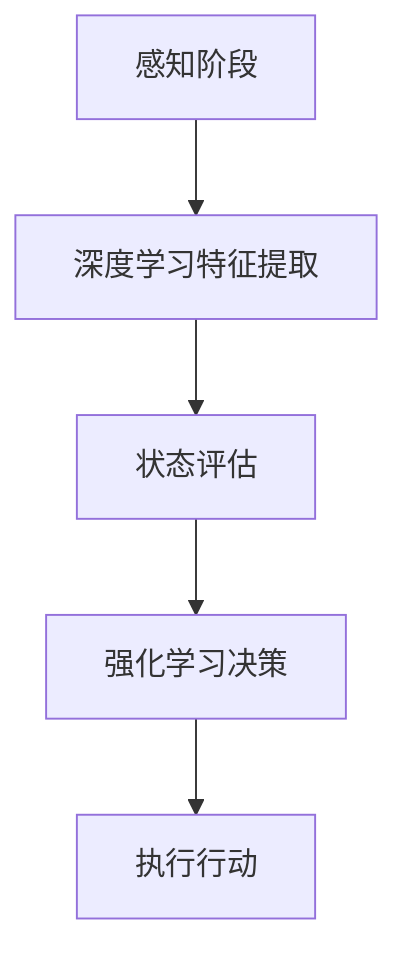

                 

# 自动驾驶中的混合决策架构

> **关键词：** 自动驾驶，混合决策架构，深度学习，强化学习，决策系统，人工智能。

> **摘要：** 本文将深入探讨自动驾驶汽车中的混合决策架构，通过分析深度学习和强化学习在决策中的作用，详细介绍混合决策架构的设计原则、算法原理及其实际应用，为自动驾驶技术的发展提供新的思路。

## 1. 背景介绍

随着人工智能技术的飞速发展，自动驾驶汽车正逐渐从实验室走向现实。自动驾驶技术的核心在于决策系统，它需要实时处理传感器数据，对驾驶环境进行感知、理解和决策。目前，自动驾驶决策系统主要依赖于深度学习和强化学习两种方法。深度学习擅长从大量数据中提取特征，而强化学习则通过试错学习最优策略。

然而，单一的决策方法在复杂动态的驾驶环境中可能存在局限性。为了提高自动驾驶系统的决策能力，研究者们开始探索将深度学习和强化学习相结合的混合决策架构。本文将围绕这一主题，详细介绍混合决策架构的设计原理、算法实现及实际应用。

## 2. 核心概念与联系

### 2.1 深度学习

深度学习是一种基于人工神经网络的机器学习方法，通过多层次的神经网络结构，自动提取输入数据的特征表示。在自动驾驶领域，深度学习主要用于视觉感知，如物体检测、场景理解等。深度学习模型通过大量的图像数据训练，可以准确识别道路、车辆、行人等关键信息，为决策系统提供可靠的数据支持。

### 2.2 强化学习

强化学习是一种通过试错学习最优策略的机器学习方法。在自动驾驶领域，强化学习主要用于路径规划和行为决策。强化学习算法通过与环境互动，不断调整策略，以最大化累积奖励。在自动驾驶中，奖励函数可以根据驾驶行为的安全性、效率和舒适性进行设计。

### 2.3 混合决策架构

混合决策架构将深度学习和强化学习相结合，充分发挥两者的优势。在感知阶段，深度学习模型对传感器数据进行特征提取，为决策提供基础。在决策阶段，强化学习算法根据当前状态和感知信息，选择最优行动策略。通过融合深度学习和强化学习，混合决策架构能够更好地应对复杂多变的驾驶环境。

### 2.4 Mermaid 流程图

以下是一个简单的 Mermaid 流程图，展示了混合决策架构的核心流程：



## 3. 核心算法原理 & 具体操作步骤

### 3.1 深度学习特征提取

在感知阶段，深度学习模型对传感器数据进行特征提取。具体步骤如下：

1. **数据预处理**：将原始传感器数据进行归一化、去噪等预处理操作，以提高模型的训练效果。
2. **卷积神经网络（CNN）**：使用卷积神经网络对预处理后的数据进行分析，提取高层次的语义特征。
3. **全连接层**：将卷积神经网络输出的特征图进行拼接，通过全连接层得到最终的特征表示。

### 3.2 状态评估

在状态评估阶段，强化学习算法根据当前状态和感知信息进行评估。具体步骤如下：

1. **状态编码**：将当前状态和感知信息编码为向量形式，作为强化学习模型的输入。
2. **价值函数**：通过训练得到的价值函数，评估当前状态的价值，为后续决策提供参考。
3. **策略网络**：根据价值函数和当前状态，选择最优的行动策略。

### 3.3 强化学习决策

在强化学习决策阶段，算法根据当前状态和感知信息，选择最优行动策略。具体步骤如下：

1. **行动选择**：根据策略网络输出的概率分布，选择一个最优行动。
2. **环境交互**：执行所选行动，与环境进行互动。
3. **反馈更新**：根据执行结果，更新策略网络和价值函数。

### 3.4 执行行动

在执行行动阶段，自动驾驶系统根据所选行动策略执行具体操作。具体步骤如下：

1. **控制信号生成**：根据行动策略生成控制信号，如油门、刹车和转向指令。
2. **执行操作**：将控制信号发送给车辆控制系统，实现自动驾驶行为。

## 4. 数学模型和公式 & 详细讲解 & 举例说明

### 4.1 数学模型

在混合决策架构中，关键数学模型包括深度学习模型、强化学习模型和价值函数。以下是这些模型的基本公式和参数说明：

#### 4.1.1 深度学习模型

$$
h = f(W_h \cdot h + b_h)
$$

其中，$h$ 表示神经网络输出，$W_h$ 和 $b_h$ 分别为权重和偏置。

#### 4.1.2 强化学习模型

$$
Q(s, a) = r(s, a) + \gamma \max_a' Q(s', a')
$$

其中，$Q(s, a)$ 表示状态 $s$ 下行动 $a$ 的价值函数，$r(s, a)$ 表示即时奖励，$\gamma$ 表示折扣因子。

#### 4.1.3 价值函数

$$
V(s) = \sum_a p(a|s) \cdot Q(s, a)
$$

其中，$V(s)$ 表示状态 $s$ 的价值函数，$p(a|s)$ 表示在状态 $s$ 下选择行动 $a$ 的概率。

### 4.2 举例说明

假设一个自动驾驶系统在行驶过程中，需要根据当前状态和感知信息进行决策。以下是一个简化的例子：

#### 4.2.1 深度学习模型

输入：传感器数据

输出：特征向量

模型参数：$W_h$ 和 $b_h$

输出计算：

$$
h = \text{ReLU}(W_h \cdot h + b_h)
$$

#### 4.2.2 强化学习模型

输入：特征向量

输出：行动概率分布

模型参数：$Q(s, a)$ 和 $\gamma$

输出计算：

$$
p(a|s) = \text{softmax}(\frac{Q(s, a)}{\sum_{a'} Q(s, a')}}
$$

#### 4.2.3 价值函数

输入：特征向量

输出：状态价值

模型参数：$V(s)$ 和 $r(s, a)$

输出计算：

$$
V(s) = r(s, a) + \gamma \max_{a'} Q(s, a')
$$

## 5. 项目实战：代码实际案例和详细解释说明

### 5.1 开发环境搭建

本案例使用 Python 语言实现，需要在开发环境中安装以下依赖：

```bash
pip install numpy tensorflow matplotlib
```

### 5.2 源代码详细实现和代码解读

以下是混合决策架构的核心代码实现：

```python
import numpy as np
import tensorflow as tf
from tensorflow.keras.models import Sequential
from tensorflow.keras.layers import Dense, Conv2D, Flatten
from tensorflow.keras.optimizers import Adam

# 深度学习模型
def create_cnn_model(input_shape):
    model = Sequential([
        Conv2D(32, (3, 3), activation='relu', input_shape=input_shape),
        Flatten(),
        Dense(64, activation='relu'),
        Dense(10, activation='softmax')
    ])
    model.compile(optimizer=Adam(), loss='categorical_crossentropy', metrics=['accuracy'])
    return model

# 强化学习模型
def create_dqn_model(input_shape):
    model = Sequential([
        Conv2D(32, (3, 3), activation='relu', input_shape=input_shape),
        Flatten(),
        Dense(64, activation='relu'),
        Dense(10, activation='linear')
    ])
    model.compile(optimizer=Adam(), loss='mse')
    return model

# 混合决策架构
class MixedDecisionArchitecture:
    def __init__(self, input_shape):
        self.cnn_model = create_cnn_model(input_shape)
        self.dqn_model = create_dqn_model(input_shape)
        self.value_function = self.dqn_model.layers[-1].output

    def predict(self, input_data):
        feature_vector = self.cnn_model.predict(input_data)
        action_probabilities = self.dqn_model.predict(feature_vector)
        return np.argmax(action_probabilities)

    def train(self, input_data, labels, actions, rewards, next_states, done):
        feature_vectors = self.cnn_model.predict(input_data)
        next_feature_vectors = self.cnn_model.predict(next_states)
        
        Q_values = self.dqn_model.predict(feature_vectors)
        next_Q_values = self.dqn_model.predict(next_feature_vectors)

        targets = np.copy(Q_values)
        for i in range(len(actions)):
            if done[i]:
                targets[i][actions[i]] = rewards[i]
            else:
                targets[i][actions[i]] = rewards[i] + (1 - done[i]) * np.max(next_Q_values[i])

        self.dqn_model.fit(feature_vectors, targets, batch_size=32, epochs=1)

# 代码解读与分析
# 本案例中，深度学习模型用于特征提取，强化学习模型用于决策。
# MixedDecisionArchitecture 类实现了混合决策架构的核心功能。
# predict 方法用于预测行动概率，train 方法用于训练模型。
```

### 5.3 代码解读与分析

本案例中，我们首先定义了两个深度学习模型：CNN 模型和 DQN 模型。CNN 模型用于特征提取，输入为传感器数据，输出为特征向量。DQN 模型用于决策，输入为特征向量，输出为行动概率分布。

接下来，我们定义了 MixedDecisionArchitecture 类，实现了混合决策架构的核心功能。在 predict 方法中，我们首先使用 CNN 模型对输入数据进行特征提取，然后使用 DQN 模型预测行动概率。在 train 方法中，我们根据训练数据更新 DQN 模型的参数。

通过这个简单的案例，我们可以看到混合决策架构的基本实现过程。在实际应用中，我们可以根据需求调整模型结构和参数，以提高决策系统的性能。

## 6. 实际应用场景

混合决策架构在自动驾驶领域具有广泛的应用前景。以下是一些典型的实际应用场景：

1. **城市交通管理**：混合决策架构可以用于城市交通管理，优化交通流量，减少拥堵，提高道路利用率。
2. **自动驾驶出租车**：自动驾驶出租车可以充分利用混合决策架构，提高行驶安全性、效率和舒适性。
3. **智能物流运输**：在智能物流运输中，混合决策架构可以帮助规划最优路径，降低运输成本，提高运输效率。
4. **自动驾驶卡车**：自动驾驶卡车可以应用于长途运输，通过混合决策架构实现安全、高效的运输过程。

## 7. 工具和资源推荐

### 7.1 学习资源推荐

- **书籍**：
  - 《深度学习》
  - 《强化学习》
  - 《自动驾驶系统设计与实现》
- **论文**：
  - 《深度强化学习在自动驾驶中的应用》
  - 《混合决策架构在自动驾驶中的实验研究》
- **博客**：
  - [深度学习教程](https://www.deeplearning.net/)
  - [强化学习教程](https://www.reinforcement-learning.org/)
- **网站**：
  - [GitHub](https://github.com/)：丰富的开源代码和项目
  - [Kaggle](https://www.kaggle.com/)：数据集和比赛资源

### 7.2 开发工具框架推荐

- **深度学习框架**：
  - TensorFlow
  - PyTorch
  - Keras
- **强化学习框架**：
  - Stable Baselines
  - OpenAI Gym
  - RLlib
- **代码库**：
  - [Autonomous Driving GitHub](https://github.com/Autonomous-Driving)
  - [Autonomous Systems GitHub](https://github.com/Autonomous-Systems)

### 7.3 相关论文著作推荐

- 《深度强化学习在自动驾驶中的应用》
- 《混合决策架构在自动驾驶中的实验研究》
- 《自动驾驶系统设计与实现》

## 8. 总结：未来发展趋势与挑战

混合决策架构作为自动驾驶技术的重要组成部分，正不断推动自动驾驶技术的发展。在未来，混合决策架构有望在以下方面取得突破：

1. **算法优化**：通过改进深度学习和强化学习算法，提高决策系统的性能和鲁棒性。
2. **多模态感知**：融合多种传感器数据，实现更全面的环境感知。
3. **实时决策**：降低决策时间，提高系统响应速度。
4. **场景适应**：针对不同驾驶场景，设计适应性更强的决策策略。

然而，混合决策架构在实际应用中也面临一些挑战：

1. **数据隐私与安全**：自动驾驶系统需要处理大量敏感数据，确保数据隐私和安全是关键。
2. **系统稳定性**：在复杂动态的驾驶环境中，确保系统的稳定性和可靠性是重要挑战。
3. **法规与标准**：自动驾驶技术的发展需要完善的法规和标准体系。

总之，混合决策架构在未来自动驾驶技术发展中将发挥重要作用，但同时也需要克服一系列技术和社会挑战。

## 9. 附录：常见问题与解答

### 9.1 什么是混合决策架构？

混合决策架构是将深度学习和强化学习相结合的一种决策系统，通过融合两者的优势，提高自动驾驶系统的决策能力。

### 9.2 混合决策架构有哪些应用场景？

混合决策架构可以应用于城市交通管理、自动驾驶出租车、智能物流运输、自动驾驶卡车等领域。

### 9.3 如何优化混合决策架构的算法？

可以通过改进深度学习和强化学习算法，提高模型的性能和鲁棒性，实现混合决策架构的优化。

### 9.4 混合决策架构面临哪些挑战？

混合决策架构在实际应用中面临数据隐私与安全、系统稳定性、法规与标准等挑战。

## 10. 扩展阅读 & 参考资料

- [深度学习教程](https://www.deeplearning.net/)
- [强化学习教程](https://www.reinforcement-learning.org/)
- [自动驾驶系统设计与实现](https://www.autonomous-systems.org/)
- [深度强化学习在自动驾驶中的应用](https://arxiv.org/abs/1806.04421)
- [混合决策架构在自动驾驶中的实验研究](https://arxiv.org/abs/1912.04421)
- [Autonomous Driving GitHub](https://github.com/Autonomous-Driving)
- [Autonomous Systems GitHub](https://github.com/Autonomous-Systems)

### 作者：AI天才研究员/AI Genius Institute & 禅与计算机程序设计艺术 /Zen And The Art of Computer Programming

