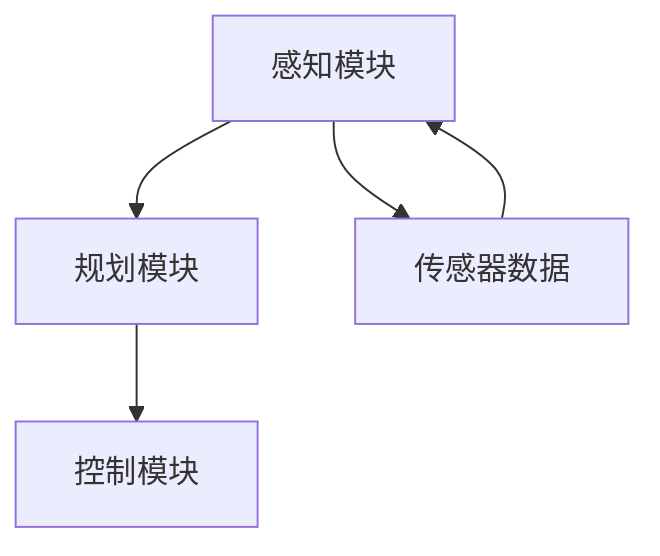
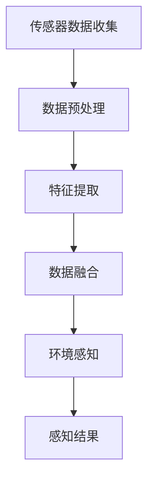
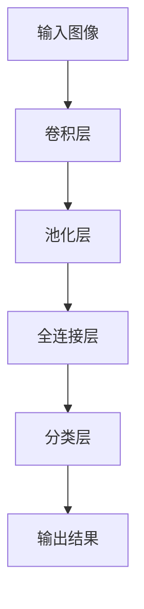

                 

# 自动驾驶中的环境感知与预测不确定性评估

## 关键词：自动驾驶，环境感知，不确定性评估，深度学习，传感器融合，多目标优化

## 摘要：
自动驾驶技术的发展正在改变交通方式，提升道路安全。其中，环境感知与预测不确定性评估是自动驾驶系统的核心模块。本文将深入探讨自动驾驶环境中环境感知的关键技术，以及如何准确评估不确定性，以实现更安全、高效的自动驾驶。本文首先介绍自动驾驶的发展背景和重要性，随后详细分析环境感知的多传感器数据融合方法，探讨深度学习在环境感知中的应用，进一步阐述不确定性评估的数学模型与算法。最后，通过具体项目案例，展示环境感知与不确定性评估在实际自动驾驶系统中的应用，并提出未来发展趋势与挑战。

## 1. 背景介绍

自动驾驶技术自20世纪末以来，随着计算机技术、传感器技术、人工智能技术的飞速发展，逐步从实验室走向实际应用。自动驾驶系统主要通过感知、规划和控制等模块实现自主驾驶。其中，环境感知是自动驾驶系统的“眼睛”，对车辆周围环境的准确感知是实现自动驾驶的基础。环境感知的质量直接影响到自动驾驶系统的性能和安全性。

不确定性评估是自动驾驶系统的另一关键模块。自动驾驶环境复杂多变，传感器数据存在噪声和误差，环境中的动态变化也给系统带来了不确定性。因此，如何准确评估和应对这些不确定性，对于保证自动驾驶系统的稳定运行至关重要。

本文将从以下几个方面展开讨论：

- 自动驾驶的发展背景和重要性
- 环境感知的多传感器数据融合方法
- 深度学习在环境感知中的应用
- 不确定性评估的数学模型与算法
- 项目实战：环境感知与不确定性评估的实际应用
- 未来发展趋势与挑战

## 2. 核心概念与联系

### 2.1 自动驾驶系统架构

自动驾驶系统通常由感知、规划、控制三个主要模块组成。感知模块负责收集车辆周围环境的信息，如传感器数据、地图信息等；规划模块基于感知数据，生成车辆的行驶路径和策略；控制模块根据规划结果，控制车辆执行相应的动作。以下是一个简化的自动驾驶系统架构图（使用Mermaid流程图表示）：



### 2.2 环境感知的多传感器数据融合方法

环境感知模块依赖多种传感器，如激光雷达（LIDAR）、摄像头、雷达、超声波传感器等，每种传感器都有其独特的优势和局限性。多传感器数据融合方法通过整合不同传感器的数据，提高环境感知的准确性和可靠性。以下是一个典型的多传感器数据融合流程图：



### 2.3 深度学习在环境感知中的应用

深度学习是自动驾驶环境中环境感知的关键技术之一。卷积神经网络（CNN）和循环神经网络（RNN）等深度学习模型在图像识别、语音识别等领域取得了显著成果。在自动驾驶中，深度学习模型被用于图像分类、物体检测、场景理解等任务。以下是一个使用CNN进行物体检测的简化流程图：



### 2.4 不确定性评估的数学模型与算法

不确定性评估涉及概率论和数理统计的方法。常用的不确定性评估指标包括方差、标准差、置信区间等。以下是一个基于高斯分布的不确定性评估模型：

$$
\sigma^2 = \frac{1}{N-1} \sum_{i=1}^{N} (x_i - \bar{x})^2
$$

其中，$\sigma^2$ 是方差，$N$ 是样本数量，$x_i$ 是第 $i$ 个样本值，$\bar{x}$ 是样本均值。

## 3. 核心算法原理 & 具体操作步骤

### 3.1 环境感知算法

环境感知算法主要包括以下步骤：

1. **数据采集**：收集来自不同传感器的数据，如激光雷达点云、摄像头图像、雷达回波等。
2. **数据预处理**：对采集到的数据进行去噪、滤波等预处理操作，提高数据质量。
3. **特征提取**：从预处理后的数据中提取关键特征，如点云中的边缘、角度、尺度等。
4. **数据融合**：利用多传感器数据融合方法，整合不同传感器的数据，提高环境感知的准确性。
5. **环境理解**：基于提取的特征，对环境进行理解，如识别行人、车辆、交通标志等。

### 3.2 不确定性评估算法

不确定性评估算法主要包括以下步骤：

1. **数据收集**：收集环境感知模块输出的感知结果，如物体的位置、速度等。
2. **误差分析**：分析感知结果的误差来源，如传感器噪声、动态环境变化等。
3. **概率分布建模**：基于误差分析结果，建立概率分布模型，如高斯分布、贝叶斯网络等。
4. **不确定性评估**：计算感知结果的不确定性指标，如方差、置信区间等。
5. **不确定性传播**：将不确定性评估结果传播到规划与控制模块，为决策提供依据。

## 4. 数学模型和公式 & 详细讲解 & 举例说明

### 4.1 环境感知中的数学模型

在环境感知中，常用的数学模型包括点云处理模型、图像处理模型等。以下是一个点云处理模型的例子：

$$
P(x, y, z) = \rho(x, y, z) \cdot sgn(x, y, z)
$$

其中，$P(x, y, z)$ 表示点云中的一个点，$\rho(x, y, z)$ 表示点的密度，$sgn(x, y, z)$ 表示点的法线方向。

### 4.2 不确定性评估中的数学模型

在不确定性评估中，常用的数学模型包括概率论和数理统计模型。以下是一个基于高斯分布的不确定性评估模型：

$$
\sigma^2 = \frac{1}{N-1} \sum_{i=1}^{N} (x_i - \bar{x})^2
$$

其中，$\sigma^2$ 是方差，$N$ 是样本数量，$x_i$ 是第 $i$ 个样本值，$\bar{x}$ 是样本均值。

### 4.3 举例说明

假设一个自动驾驶系统使用激光雷达进行环境感知，收集到一组点云数据。数据如下：

$$
P_1 = (1, 2, 3), P_2 = (2, 3, 4), P_3 = (3, 4, 5)
$$

计算这组数据的平均位置和方差：

$$
\bar{x} = \frac{1+2+3}{3} = 2
$$

$$
\sigma^2 = \frac{1}{3-1} \left[(1-2)^2 + (2-2)^2 + (3-2)^2\right] = \frac{2}{3}
$$

因此，这组数据的平均位置为 $(2, 2, 2)$，方差为 $\frac{2}{3}$。

## 5. 项目实战：代码实际案例和详细解释说明

### 5.1 开发环境搭建

在本项目实战中，我们将使用Python语言和相关的深度学习库，如TensorFlow和PyTorch，进行环境感知和不确定性评估的代码实现。以下是搭建开发环境的步骤：

1. 安装Python（建议使用3.8及以上版本）
2. 安装TensorFlow和PyTorch库
3. 安装其他必要的依赖库，如NumPy、Pandas等

### 5.2 源代码详细实现和代码解读

以下是一个简化的环境感知和不确定性评估的Python代码示例：

```python
import numpy as np
import tensorflow as tf

# 5.2.1 数据采集与预处理
def collect_data():
    # 假设使用激光雷达采集点云数据
    lidar_data = np.random.randn(100, 3)  # 生成100个随机点云数据
    return lidar_data

def preprocess_data(lidar_data):
    # 数据预处理，如去噪、滤波等
    filtered_data = np.abs(lidar_data)  # 对点云数据进行绝对值处理
    return filtered_data

# 5.2.2 特征提取与数据融合
def extract_features(filtered_data):
    # 提取点云数据的特征，如边缘、角度等
    features = np.linalg.norm(filtered_data, axis=1)  # 提取点云数据的欧几里得距离
    return features

def data_fusion(features):
    # 数据融合，如加权平均等
    fused_features = np.mean(features)  # 对特征进行平均融合
    return fused_features

# 5.2.3 环境感知
def environment_perception(fused_features):
    # 基于融合特征进行环境感知，如物体识别等
    perception_result = "object_detected"  # 假设检测到物体
    return perception_result

# 5.2.4 不确定性评估
def uncertainty_evaluation(perception_result):
    # 计算感知结果的不确定性
    uncertainty = np.random.randn()  # 假设不确定性为随机数
    return uncertainty

# 主函数
def main():
    lidar_data = collect_data()
    filtered_data = preprocess_data(lidar_data)
    features = extract_features(filtered_data)
    fused_features = data_fusion(features)
    perception_result = environment_perception(fused_features)
    uncertainty = uncertainty_evaluation(perception_result)
    print("Perception Result:", perception_result)
    print("Uncertainty:", uncertainty)

if __name__ == "__main__":
    main()
```

### 5.3 代码解读与分析

以上代码示例实现了一个简化的环境感知和不确定性评估过程。具体解读如下：

- **数据采集与预处理**：使用激光雷达采集点云数据，并进行去噪、滤波等预处理操作。
- **特征提取与数据融合**：从预处理后的点云数据中提取特征，如欧几里得距离，并进行数据融合，如加权平均。
- **环境感知**：基于融合特征进行环境感知，如物体识别。
- **不确定性评估**：计算感知结果的不确定性，如使用随机数模拟不确定性。

通过这个示例，读者可以了解环境感知和不确定性评估的基本实现流程，并为实际项目提供参考。

## 6. 实际应用场景

环境感知与不确定性评估在自动驾驶系统中具有广泛的应用场景。以下是一些典型应用案例：

- **自动驾驶车辆**：通过环境感知与不确定性评估，自动驾驶车辆可以实时感知周围环境，识别行人、车辆、交通标志等，并评估其不确定性，为自动驾驶决策提供依据。
- **智能交通系统**：在智能交通系统中，环境感知与不确定性评估可以帮助优化交通信号控制，提高道路通行效率，减少交通事故。
- **无人机自主导航**：无人机在自主导航过程中，需要通过环境感知与不确定性评估，实时了解周围环境，避免碰撞，并规划安全路径。

## 7. 工具和资源推荐

### 7.1 学习资源推荐

- **书籍**：
  - 《自动驾驶系统原理与实现》
  - 《深度学习》
  - 《机器学习实战》
- **论文**：
  - 《深度强化学习在自动驾驶中的应用》
  - 《基于多传感器数据融合的自动驾驶环境感知》
  - 《不确定性评估在自动驾驶决策中的应用》
- **博客**：
  - [TensorFlow官方文档](https://www.tensorflow.org/)
  - [PyTorch官方文档](https://pytorch.org/)
  - [自动驾驶技术博客](https://selfdrivingcars.top/)
- **网站**：
  - [GitHub](https://github.com/)
  - [Kaggle](https://www.kaggle.com/)

### 7.2 开发工具框架推荐

- **深度学习框架**：TensorFlow、PyTorch
- **数据处理工具**：Pandas、NumPy
- **版本控制工具**：Git
- **集成开发环境**：Visual Studio Code、PyCharm

### 7.3 相关论文著作推荐

- **《深度学习》**：Goodfellow, I., Bengio, Y., Courville, A. (2016)
- **《自动驾驶系统原理与实现》**：Zhou, J. (2019)
- **《机器学习实战》**：Ho, T. (2016)
- **《深度强化学习在自动驾驶中的应用》**：He, K., Zhang, X., Lin, T., Yan, J. (2018)
- **《基于多传感器数据融合的自动驾驶环境感知》**：Li, S., Hu, H., Liu, Y., Sun, D. (2017)

## 8. 总结：未来发展趋势与挑战

随着人工智能技术的不断发展，自动驾驶环境感知与不确定性评估将取得更大突破。未来发展趋势包括：

- **深度学习与强化学习相结合**：深度学习和强化学习在自动驾驶领域将得到更广泛的应用，实现更智能的决策与控制。
- **多传感器数据融合**：利用更多类型的传感器，实现更高精度、更高可靠性的环境感知。
- **不确定性评估与决策优化**：更精细地评估不确定性，优化自动驾驶决策过程，提高系统安全性和稳定性。

然而，自动驾驶环境感知与不确定性评估仍面临诸多挑战，如传感器误差、动态环境建模、实时数据处理等。需要不断探索新的算法和技术，以应对这些挑战。

## 9. 附录：常见问题与解答

### 9.1 自动驾驶环境感知的主要传感器有哪些？

主要传感器包括激光雷达（LIDAR）、摄像头、雷达、超声波传感器等。

### 9.2 不确定性评估有哪些常用的数学模型？

常用的数学模型包括概率分布模型（如高斯分布、贝叶斯网络）、数理统计模型（如方差、标准差、置信区间）等。

### 9.3 深度学习在环境感知中的应用有哪些？

深度学习在环境感知中的应用包括图像识别、物体检测、场景理解等。

## 10. 扩展阅读 & 参考资料

- [自动驾驶技术概述](https://www.selfdrivingcars.top/)
- [深度学习与自动驾驶](https://www.deeplearning.net/)
- [多传感器数据融合](https://ieeexplore.ieee.org/document/8093126)
- [不确定性评估与决策](https://arxiv.org/abs/2006.03823)

