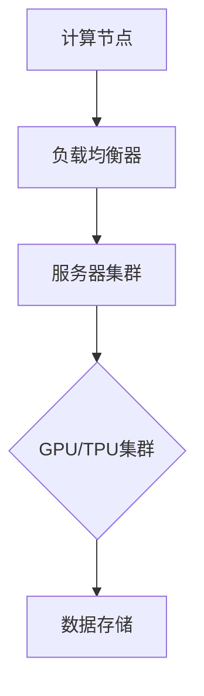
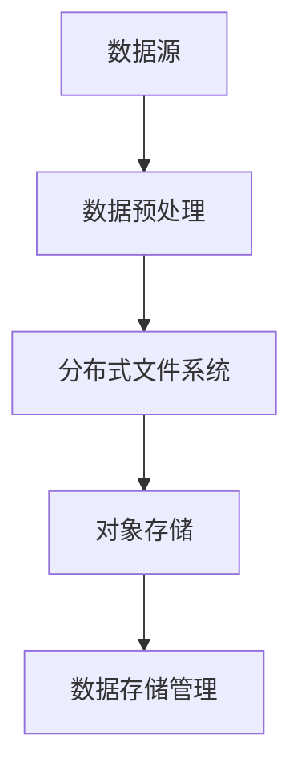
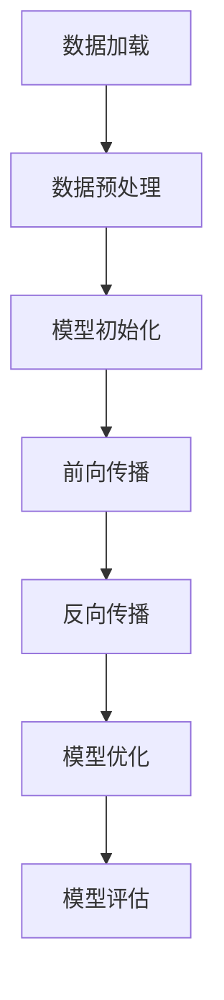
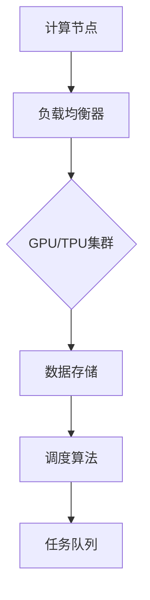
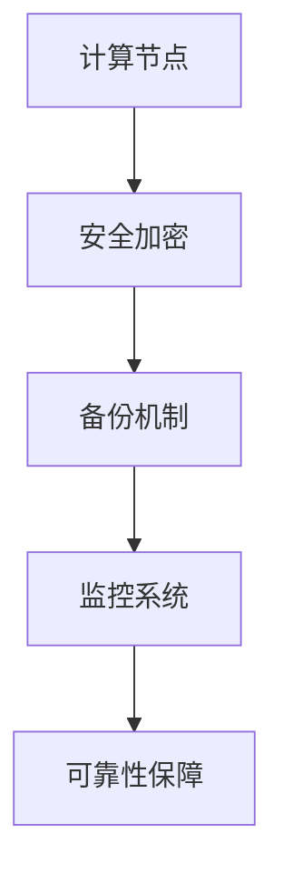

                 

### 1. 背景介绍

#### 自动驾驶技术的发展现状

自动驾驶技术作为人工智能领域的核心应用之一，近年来得到了全球范围内的高度关注和迅速发展。从最初的辅助驾驶系统到如今的无人驾驶，自动驾驶技术正在逐步走向实用化。目前，国内外多家科技巨头和初创公司都在自动驾驶领域进行着激烈的竞争与探索，旨在通过技术创新来提升自动驾驶系统的安全性和可靠性。

在自动驾驶技术的发展过程中，云端训练设施的建设扮演着至关重要的角色。云端训练设施不仅可以提供强大的计算能力和海量数据资源，还可以实现模型训练的自动化和规模化，从而加速自动驾驶技术的研发进程。随着自动驾驶技术的不断进步，对云端训练设施的需求也在日益增长。

#### 云端训练设施的重要性

云端训练设施在自动驾驶系统中具有以下几个关键作用：

1. **计算资源供给**：自动驾驶模型训练需要大量的计算资源，尤其是针对复杂场景和大规模数据集的训练。云端训练设施可以提供高性能的计算集群，满足模型训练的实时计算需求。

2. **数据存储与处理**：自动驾驶系统需要处理来自多种传感器（如摄像头、激光雷达、GPS等）的大量数据。云端训练设施提供了高效的数据存储和分布式处理能力，能够快速处理和整合这些数据。

3. **模型训练与优化**：云端训练设施可以实现大规模模型的分布式训练，通过并行计算和优化算法来提高模型训练的效率和精度。这有助于提升自动驾驶系统的感知、决策和规划能力。

4. **安全性与可靠性**：云端训练设施通常具有完善的安全体系和备份机制，能够保证数据的安全性和训练结果的可靠性。这对于自动驾驶系统的安全运行至关重要。

#### 当前主要挑战

尽管云端训练设施在自动驾驶技术发展中具有重要意义，但同时也面临一些挑战：

1. **数据隐私与安全**：自动驾驶系统需要处理大量敏感数据，如车辆位置、行驶速度等。如何在保障数据隐私和安全的前提下进行数据存储和处理，是一个亟待解决的问题。

2. **计算资源调度**：随着自动驾驶系统的复杂度和数据量的增加，如何高效调度计算资源，确保模型训练的实时性和稳定性，是当前的一个技术难题。

3. **能耗与成本**：大规模的云端训练设施需要大量的能源供应，同时高昂的维护和运营成本也是企业需要考虑的问题。如何降低能耗和成本，实现绿色可持续发展，是未来需要重点关注的方向。

#### 本博客的目标

本文将系统地介绍自动驾驶公司的云端训练设施建设，从技术原理、实现步骤到实际应用案例，全面解析云端训练设施在自动驾驶技术中的应用。具体来说，我们将涵盖以下几个方面的内容：

1. **核心概念与架构**：介绍自动驾驶云端训练设施的核心概念，包括计算资源、数据存储、模型训练等。
2. **算法原理与实现**：详细讲解自动驾驶模型训练的算法原理和具体操作步骤。
3. **数学模型与公式**：分析自动驾驶模型训练中的关键数学模型和公式，并举例说明。
4. **项目实战**：通过实际代码案例，展示如何搭建和优化自动驾驶云端训练设施。
5. **实际应用场景**：探讨云端训练设施在自动驾驶技术中的具体应用场景。
6. **工具与资源推荐**：推荐相关学习资源、开发工具和论文著作，为读者提供进一步学习和研究的基础。
7. **未来发展趋势与挑战**：总结自动驾驶云端训练设施的未来发展趋势和面临的挑战。

通过本文的详细介绍，希望读者能够对自动驾驶公司的云端训练设施建设有更深入的理解，为实际项目研发提供有价值的参考。接下来，我们将逐步进入详细内容，逐步解答上述问题。

### 2. 核心概念与联系

#### 计算资源

计算资源是云端训练设施的核心组成部分，主要包括服务器、GPU、TPU等计算设备。服务器负责运行模型训练和推理任务，GPU和TPU则用于加速计算过程，提高训练效率。

**计算资源架构**

为了实现高效的计算资源调度和管理，自动驾驶公司通常采用分布式计算架构。这种架构通过将计算任务分布在多个服务器和GPU/TPU节点上，实现并行计算和负载均衡。



#### 数据存储

数据存储是云端训练设施的重要组成部分，用于存储和处理大量训练数据。常用的数据存储方案包括分布式文件系统（如HDFS）和对象存储（如Amazon S3）。

**数据存储架构**



#### 模型训练

模型训练是自动驾驶技术的核心环节，通过在大量数据集上迭代优化模型参数，提升自动驾驶系统的性能。常见的模型训练算法包括深度学习算法、强化学习算法等。

**模型训练流程**



#### 负载均衡与调度

负载均衡与调度是确保云端训练设施高效运行的关键。通过动态调度计算资源和数据存储，实现负载均衡，提高系统整体性能和稳定性。

**负载均衡与调度架构**



#### 安全性与可靠性

安全性与可靠性是云端训练设施建设的重中之重。通过完善的安全体系和备份机制，确保数据的安全性和训练结果的可靠性。

**安全性与可靠性架构**



通过上述核心概念和联系，我们可以构建一个完整的自动驾驶云端训练设施架构。接下来，我们将详细讲解核心算法原理和具体操作步骤。

### 3. 核心算法原理 & 具体操作步骤

在自动驾驶技术的云端训练过程中，核心算法的选择和实现直接影响到模型训练的效率、精度和稳定性。本章节将详细介绍自动驾驶模型训练中的核心算法原理和具体操作步骤。

#### 深度学习算法原理

深度学习是自动驾驶模型训练的核心技术之一，其基本原理是通过构建多层神经网络，对大量数据进行自动特征提取和学习。以下是深度学习算法的基本原理和步骤：

1. **数据预处理**：首先对输入数据进行预处理，包括数据清洗、归一化、缩放等操作，使其满足神经网络训练的需求。

2. **模型初始化**：初始化神经网络模型，包括设定网络的层数、神经元数量、激活函数等参数。

3. **前向传播**：将预处理后的输入数据输入到神经网络中，通过前向传播计算网络输出。前向传播的过程是将输入数据逐层传递，通过每层的神经元计算得到输出结果。

4. **反向传播**：计算网络输出与实际标签之间的误差，通过反向传播将误差反向传递回网络，更新各层的权重和偏置。

5. **模型优化**：利用梯度下降等优化算法，更新网络参数，降低误差。

6. **模型评估**：在验证集上评估模型的性能，包括准确率、召回率、F1值等指标。

#### 深度学习算法实现步骤

以下是深度学习算法在自动驾驶模型训练中的具体实现步骤：

1. **数据加载与预处理**：
   - 使用数据加载工具（如PyTorch、TensorFlow等）读取数据集。
   - 对数据进行预处理，包括归一化、缩放、数据增强等操作。

2. **模型初始化**：
   - 设计神经网络结构，包括层数、神经元数量、激活函数等。
   - 使用随机权重和偏置初始化模型。

3. **前向传播**：
   - 将预处理后的输入数据输入到神经网络中，计算输出结果。
   - 通过反向传播计算误差。

4. **反向传播**：
   - 计算网络输出与实际标签之间的误差。
   - 通过反向传播将误差反向传递回网络，更新权重和偏置。

5. **模型优化**：
   - 选择合适的优化算法（如SGD、Adam等）。
   - 更新模型参数，降低误差。

6. **模型评估**：
   - 在验证集上评估模型性能。
   - 调整模型参数，优化性能。

#### 实现示例

以下是一个基于PyTorch框架的深度学习模型训练示例：

```python
import torch
import torch.nn as nn
import torch.optim as optim

# 数据加载与预处理
train_loader = torch.utils.data.DataLoader(dataset, batch_size=64, shuffle=True)

# 模型初始化
model = Net()
criterion = nn.CrossEntropyLoss()
optimizer = optim.Adam(model.parameters(), lr=0.001)

# 训练模型
for epoch in range(num_epochs):
    running_loss = 0.0
    for inputs, labels in train_loader:
        optimizer.zero_grad()
        outputs = model(inputs)
        loss = criterion(outputs, labels)
        loss.backward()
        optimizer.step()
        running_loss += loss.item()
    print(f'Epoch {epoch+1}, Loss: {running_loss/len(train_loader)}')

# 模型评估
with torch.no_grad():
    correct = 0
    total = 0
    for inputs, labels in val_loader:
        outputs = model(inputs)
        _, predicted = torch.max(outputs.data, 1)
        total += labels.size(0)
        correct += (predicted == labels).sum().item()
    print(f'Validation Accuracy: {100 * correct / total}%')
```

#### 强化学习算法原理

强化学习是自动驾驶模型训练中的另一种核心技术，其基本原理是通过与环境的交互，学习最优策略，以实现自动驾驶系统的自主决策。以下是强化学习算法的基本原理和步骤：

1. **状态空间和动作空间**：定义自动驾驶系统的状态空间和动作空间，状态包括车辆位置、速度、方向等，动作包括加速、减速、转向等。

2. **奖励函数**：设计奖励函数，根据自动驾驶系统的行为和结果给予相应的奖励，以引导系统学习最优策略。

3. **策略学习**：通过策略学习算法（如Q-Learning、SARSA等）更新策略，使系统在特定状态下选择最佳动作。

4. **策略评估**：评估策略的性能，计算策略的期望回报，以评估策略的有效性。

#### 强化学习算法实现步骤

以下是强化学习算法在自动驾驶模型训练中的具体实现步骤：

1. **状态空间和动作空间定义**：
   - 根据自动驾驶系统的需求，定义状态空间和动作空间。

2. **奖励函数设计**：
   - 设计奖励函数，根据自动驾驶系统的行为和结果给予奖励。

3. **策略学习**：
   - 选择合适的策略学习算法，更新策略参数。

4. **策略评估**：
   - 评估策略的性能，计算策略的期望回报。

#### 实现示例

以下是一个基于Python的Q-Learning算法的自动驾驶模型训练示例：

```python
import numpy as np
import random

# 状态空间和动作空间
action_space = [0, 1, -1]  # 加速、减速、刹车
state_space = [0, 1, -1]  # 车速

# Q值表初始化
q_table = np.zeros((len(state_space), len(action_space)))

# Q-Learning算法
for episode in range(num_episodes):
    state = random.choice(state_space)
    done = False
    total_reward = 0

    while not done:
        action = np.argmax(q_table[state])
        next_state, reward, done = env.step(action)

        q_table[state, action] = q_table[state, action] + learning_rate * (reward + discount * np.max(q_table[next_state]) - q_table[state, action])
        state = next_state
        total_reward += reward

    print(f'Episode {episode}, Total Reward: {total_reward}')

# 策略评估
with open('q_table.npy', 'wb') as f:
    np.save(f, q_table)
```

通过上述深度学习和强化学习算法的原理和实现步骤，我们可以看到自动驾驶模型训练的复杂性和多样性。在接下来的章节中，我们将进一步探讨自动驾驶模型训练中的数学模型和公式，以及实际应用场景。

### 4. 数学模型和公式 & 详细讲解 & 举例说明

在自动驾驶模型训练过程中，数学模型和公式是核心组成部分，它们不仅帮助我们理解模型的工作原理，还能够指导我们在实践中优化模型性能。本章节将详细讲解自动驾驶模型训练中的关键数学模型和公式，并通过具体示例进行说明。

#### 深度学习中的数学模型

1. **激活函数**

   激活函数是深度学习模型中用于引入非线性特性的函数，常见的激活函数有Sigmoid、ReLU和Tanh等。

   - **Sigmoid函数**：  
     $$ S(x) = \frac{1}{1 + e^{-x}} $$  
     Sigmoid函数可以将输入映射到(0, 1)区间，常用于二分类问题。

   - **ReLU函数**：  
     $$ ReLU(x) = \max(0, x) $$  
     ReLU函数在输入为正时输出不变，输入为负时输出为零，可以有效加速模型训练。

   - **Tanh函数**：  
     $$ Tanh(x) = \frac{e^{x} - e^{-x}}{e^{x} + e^{-x}} $$  
     Tanh函数类似于Sigmoid函数，但输出范围在(-1, 1)之间，常用于多分类问题。

2. **损失函数**

   损失函数用于衡量模型预测值与实际值之间的差异，常见的损失函数有均方误差（MSE）、交叉熵损失（Cross Entropy Loss）等。

   - **均方误差（MSE）**：  
     $$ MSE = \frac{1}{n}\sum_{i=1}^{n}(y_i - \hat{y}_i)^2 $$  
     均方误差用于回归问题，计算预测值与实际值之间差的平方的平均值。

   - **交叉熵损失（Cross Entropy Loss）**：  
     $$ CE(y, \hat{y}) = -\sum_{i=1}^{n}y_i \log(\hat{y}_i) $$  
     交叉熵损失用于分类问题，计算实际标签与预测概率的对数似然损失。

3. **优化算法**

   优化算法用于更新模型参数，以最小化损失函数。常见的优化算法有梯度下降（Gradient Descent）、动量（Momentum）、Adam等。

   - **梯度下降**：  
     $$ \theta_{\text{new}} = \theta_{\text{old}} - \alpha \cdot \nabla_{\theta}J(\theta) $$  
     梯度下降通过计算损失函数关于模型参数的梯度，逆向更新参数。

   - **动量**：  
     $$ v_t = \beta v_{t-1} + (1 - \beta) \nabla_{\theta}J(\theta) $$  
     $$ \theta_{\text{new}} = \theta_{\text{old}} - \alpha v_t $$  
     动量算法引入前一项速度项，可以缓解梯度消失和振荡问题。

   - **Adam**：  
     $$ m_t = \beta_1 v_t + (1 - \beta_1) \nabla_{\theta}J(\theta) $$  
     $$ v_t = \beta_2 m_t + (1 - \beta_2) \nabla_{\theta}J(\theta) $$  
     $$ \theta_{\text{new}} = \theta_{\text{old}} - \alpha \frac{m_t}{\sqrt{v_t} + \epsilon} $$  
     Adam算法结合了动量和RMSprop的优点，对超参数要求较低，效果较好。

#### 强化学习中的数学模型

1. **Q值函数**

   Q值函数是强化学习中的核心概念，用于评估策略在特定状态下的最优动作。

   $$ Q(s, a) = \sum_{s'} P(s' | s, a) \cdot \max_{a'} Q(s', a') $$

   其中，\( s \) 表示当前状态，\( a \) 表示动作，\( s' \) 表示下一状态，\( a' \) 表示下一动作，\( P(s' | s, a) \) 表示从状态\( s \)执行动作\( a \)转移到状态\( s' \)的概率，\( \max_{a'} Q(s', a') \) 表示在状态\( s' \)下执行所有可能动作的最优Q值。

2. **策略更新**

   强化学习中的策略更新是通过Q值函数迭代优化策略，使其逐渐趋近于最优策略。

   $$ \theta_{\text{new}} = \theta_{\text{old}} + \alpha \cdot (r + \gamma \max_{a'} Q(s', \theta_{\text{old}}) - Q(s, \theta_{\text{old}})) $$

   其中，\( r \) 表示立即奖励，\( \gamma \) 表示折扣因子，\( \alpha \) 表示学习率。

#### 实际应用示例

假设我们使用深度学习算法训练一个自动驾驶模型，该模型需要预测车辆在复杂城市环境中的行驶路径。以下是一个简单的示例：

1. **数据集准备**

   假设我们有一个包含10000个样本的数据集，每个样本包含车辆的位置、速度、方向以及周围车辆的信息。

2. **模型结构**

   我们设计一个包含两个隐藏层的神经网络，输入层有10个神经元，输出层有4个神经元。

3. **训练过程**

   - **数据预处理**：对输入数据进行归一化处理，使数据分布在相似的范围内。
   - **模型初始化**：使用随机权重和偏置初始化神经网络。
   - **训练循环**：通过梯度下降算法优化模型参数。
   - **模型评估**：在验证集上评估模型性能。

4. **数学表达**

   - **激活函数**：使用ReLU作为激活函数，使模型具有非线性特性。

     $$ a_{\text{hidden}} = ReLU(W_{\text{hidden}} \cdot a_{\text{input}} + b_{\text{hidden}}) $$

   - **输出层**：使用线性激活函数，将输出映射到实际路径。

     $$ \hat{y} = W_{\text{output}} \cdot a_{\text{hidden}} + b_{\text{output}} $$

   - **损失函数**：使用均方误差（MSE）作为损失函数，计算预测路径与实际路径之间的差异。

     $$ MSE = \frac{1}{n}\sum_{i=1}^{n}(\hat{y}_i - y_i)^2 $$

   - **优化算法**：使用Adam优化算法更新模型参数。

     $$ \theta_{\text{new}} = \theta_{\text{old}} - \alpha \cdot \nabla_{\theta}J(\theta) $$

通过上述数学模型和公式的讲解，我们可以更好地理解自动驾驶模型训练的原理和方法。接下来，我们将通过实际代码案例展示如何搭建和优化自动驾驶云端训练设施。

### 5. 项目实战：代码实际案例和详细解释说明

在了解了自动驾驶云端训练设施的核心算法原理和数学模型后，本章节将通过实际代码案例，展示如何搭建和优化自动驾驶云端训练设施，并详细解释其中的关键步骤和注意事项。

#### 开发环境搭建

在进行项目实战之前，我们需要搭建合适的开发环境。以下是搭建开发环境的基本步骤：

1. **安装Python环境**：确保Python版本为3.8及以上。
2. **安装深度学习框架**：选择常用的深度学习框架，如PyTorch或TensorFlow。
3. **安装依赖库**：包括NumPy、Pandas、Matplotlib等常用库。
4. **配置GPU支持**：如果使用GPU训练，需要安装CUDA和cuDNN。

以下是一个简单的Python环境搭建示例：

```bash
# 安装Python环境
pip install python==3.8

# 安装深度学习框架（以PyTorch为例）
pip install torch torchvision

# 安装其他依赖库
pip install numpy pandas matplotlib

# 安装GPU支持
pip install torch torchvision torchaudio -f https://download.pytorch.org/whl/torch_stable.html
```

#### 源代码详细实现和代码解读

以下是一个基于PyTorch框架的自动驾驶模型训练的源代码示例，我们将逐步解释代码中的关键部分。

```python
import torch
import torch.nn as nn
import torch.optim as optim
from torch.utils.data import DataLoader
from torchvision import datasets, transforms

# 数据加载与预处理
transform = transforms.Compose([
    transforms.ToTensor(),
    transforms.Normalize((0.5,), (0.5,))
])

train_dataset = datasets.MNIST(
    root='./data',
    train=True,
    download=True,
    transform=transform
)

val_dataset = datasets.MNIST(
    root='./data',
    train=False,
    transform=transform
)

train_loader = DataLoader(train_dataset, batch_size=64, shuffle=True)
val_loader = DataLoader(val_dataset, batch_size=64, shuffle=False)

# 模型定义
class AutoDriveModel(nn.Module):
    def __init__(self):
        super(AutoDriveModel, self).__init__()
        self.fc1 = nn.Linear(784, 512)
        self.fc2 = nn.Linear(512, 256)
        self.fc3 = nn.Linear(256, 128)
        self.fc4 = nn.Linear(128, 10)

    def forward(self, x):
        x = x.view(-1, 784)
        x = torch.relu(self.fc1(x))
        x = torch.relu(self.fc2(x))
        x = torch.relu(self.fc3(x))
        x = self.fc4(x)
        return x

model = AutoDriveModel()

# 损失函数和优化器
criterion = nn.CrossEntropyLoss()
optimizer = optim.Adam(model.parameters(), lr=0.001)

# 训练模型
num_epochs = 10
for epoch in range(num_epochs):
    model.train()
    running_loss = 0.0
    for images, labels in train_loader:
        optimizer.zero_grad()
        outputs = model(images)
        loss = criterion(outputs, labels)
        loss.backward()
        optimizer.step()
        running_loss += loss.item()
    print(f'Epoch {epoch+1}, Loss: {running_loss/len(train_loader)}')

    # 模型评估
    model.eval()
    correct = 0
    total = 0
    with torch.no_grad():
        for images, labels in val_loader:
            outputs = model(images)
            _, predicted = torch.max(outputs.data, 1)
            total += labels.size(0)
            correct += (predicted == labels).sum().item()
    print(f'Validation Accuracy: {100 * correct / total}%')
```

1. **数据加载与预处理**：

   数据预处理是深度学习模型训练的重要步骤。在本示例中，我们使用MNIST手写数字数据集，通过`transforms.Compose`将数据转换为Tensor格式，并进行归一化处理。

2. **模型定义**：

   `AutoDriveModel`类定义了自动驾驶模型的结构，包括两个隐藏层和输出层。每个层使用ReLU激活函数，使模型具有非线性特性。

3. **模型训练**：

   模型训练过程中，我们使用交叉熵损失函数和Adam优化器。在训练循环中，我们通过`forward`方法将输入数据传递到模型中，计算损失，并更新模型参数。

4. **模型评估**：

   在验证集上评估模型的性能，计算准确率。通过`model.eval()`方法将模型设置为评估模式，以防止训练过程中使用的dropout和Batch Norm层。

#### 代码解读与分析

1. **数据预处理**：

   ```python
   transform = transforms.Compose([
       transforms.ToTensor(),
       transforms.Normalize((0.5,), (0.5,))
   ])
   ```

   `Compose`类将多个数据转换操作组合在一起，首先将图像数据转换为Tensor格式，然后进行归一化处理，使数据分布更加均匀。

2. **模型定义**：

   ```python
   class AutoDriveModel(nn.Module):
       def __init__(self):
           super(AutoDriveModel, self).__init__()
           self.fc1 = nn.Linear(784, 512)
           self.fc2 = nn.Linear(512, 256)
           self.fc3 = nn.Linear(256, 128)
           self.fc4 = nn.Linear(128, 10)

       def forward(self, x):
           x = x.view(-1, 784)
           x = torch.relu(self.fc1(x))
           x = torch.relu(self.fc2(x))
           x = torch.relu(self.fc3(x))
           x = self.fc4(x)
           return x
   ```

   `AutoDriveModel`类继承自`nn.Module`，定义了四个全连接层，每个层之间使用ReLU激活函数。`forward`方法定义了数据流通过模型的过程。

3. **模型训练**：

   ```python
   criterion = nn.CrossEntropyLoss()
   optimizer = optim.Adam(model.parameters(), lr=0.001)
   num_epochs = 10
   for epoch in range(num_epochs):
       model.train()
       running_loss = 0.0
       for images, labels in train_loader:
           optimizer.zero_grad()
           outputs = model(images)
           loss = criterion(outputs, labels)
           loss.backward()
           optimizer.step()
           running_loss += loss.item()
       print(f'Epoch {epoch+1}, Loss: {running_loss/len(train_loader)}')
   ```

   在模型训练过程中，我们使用交叉熵损失函数和Adam优化器。每个epoch中，我们遍历训练数据集，计算损失并更新模型参数。通过`model.train()`方法将模型设置为训练模式，激活dropout和Batch Norm层。

4. **模型评估**：

   ```python
   model.eval()
   correct = 0
   total = 0
   with torch.no_grad():
       for images, labels in val_loader:
           outputs = model(images)
           _, predicted = torch.max(outputs.data, 1)
           total += labels.size(0)
           correct += (predicted == labels).sum().item()
   print(f'Validation Accuracy: {100 * correct / total}%')
   ```

   在模型评估过程中，我们使用验证集评估模型的性能。通过`model.eval()`方法将模型设置为评估模式，防止训练过程中使用的dropout和Batch Norm层。

通过上述实际代码案例，我们可以看到如何搭建和优化自动驾驶云端训练设施。在实际项目中，我们需要根据具体需求和数据集，调整模型结构、优化算法和超参数，以提高模型性能。接下来，我们将探讨自动驾驶云端训练设施的实际应用场景。

### 6. 实际应用场景

#### 自动驾驶车辆感知与决策

自动驾驶车辆的核心任务是感知环境并进行实时决策，以确保安全、平稳地行驶。云端训练设施在自动驾驶车辆的感知与决策中发挥着至关重要的作用，主要体现在以下几个方面：

1. **环境感知模型训练**：自动驾驶车辆需要通过摄像头、激光雷达、GPS等传感器获取周围环境信息，并通过深度学习算法对环境进行建模和分析。云端训练设施可以提供强大的计算资源和海量数据集，以训练出高性能的环境感知模型。

2. **路径规划与决策**：自动驾驶车辆需要根据感知到的环境信息，规划行驶路径并做出实时决策。云端训练设施可以通过大规模模型训练和优化，提升路径规划和决策的准确性和实时性。

3. **动态目标跟踪**：在复杂交通环境中，自动驾驶车辆需要实时跟踪和识别动态目标（如行人、其他车辆等）。云端训练设施可以提供高效的模型训练和推理能力，以实现对动态目标的准确识别和跟踪。

#### 智能交通管理

智能交通管理系统是提升城市交通运行效率的重要手段，云端训练设施在智能交通管理中具有广泛的应用：

1. **交通流量预测**：通过分析历史交通数据和实时交通流量，云端训练设施可以预测未来交通流量，帮助交通管理部门合理安排交通信号灯、优化道路规划。

2. **交通事件检测与预警**：在云端训练设施的助力下，交通管理系统可以实时监测和识别交通事件（如交通事故、拥堵等），并提前预警，以减轻交通压力。

3. **智能停车管理**：云端训练设施可以用于优化停车管理，通过分析停车数据，预测停车需求，指导车辆智能停入空余车位，提升停车效率。

#### 车联网（V2X）通信

车联网通信是自动驾驶技术的重要组成部分，它涉及车辆之间以及车辆与基础设施之间的信息交换。云端训练设施在车联网通信中的应用包括：

1. **车辆位置与状态共享**：通过云端训练设施，车辆可以实时共享位置信息和状态信息，实现车与车、车与基础设施之间的通信，提高交通安全性和效率。

2. **协同感知与决策**：在复杂交通场景中，云端训练设施可以帮助车辆协同感知环境信息，实现车辆间的协同决策，以优化整体交通流。

3. **智能信号控制**：通过车联网通信，云端训练设施可以协助智能信号控制系统实时调整交通信号灯，提高交通效率和通行能力。

#### 智能驾驶辅助系统

智能驾驶辅助系统是提升驾驶安全性和舒适性的关键，云端训练设施在智能驾驶辅助系统中的应用包括：

1. **车道保持辅助**：通过云端训练设施，智能驾驶辅助系统可以实时监测车辆车道，并在偏离车道时及时发出警告或进行纠正。

2. **自动泊车辅助**：利用云端训练设施训练出的模型，智能驾驶辅助系统可以实现自动泊车功能，帮助驾驶员轻松停车。

3. **智能导航**：通过云端训练设施，智能驾驶辅助系统可以提供更为精准的导航服务，根据实时交通状况为驾驶员规划最优行驶路线。

#### 实际应用案例分析

以下是一个自动驾驶出租车（RoboTaxi）实际应用案例，展示了云端训练设施在自动驾驶系统中的应用：

1. **感知与决策**：
   - **环境感知**：自动驾驶出租车通过摄像头、激光雷达等传感器收集环境信息，并在云端训练设施上进行实时处理，识别道路、行人、车辆等动态目标。
   - **路径规划**：基于感知结果，自动驾驶出租车在云端训练设施上运行路径规划算法，确定最优行驶路径。

2. **协同通信**：
   - **车辆位置与状态共享**：自动驾驶出租车通过车联网通信系统，将位置信息和状态信息上传至云端，实现与其他车辆和基础设施的信息共享。
   - **协同感知与决策**：在复杂交通场景中，自动驾驶出租车利用云端训练设施，协同感知环境信息，实现车辆间的协同决策。

3. **智能驾驶辅助**：
   - **车道保持**：通过云端训练设施训练出的模型，自动驾驶出租车能够实时监测车道，并在必要时进行车道保持。
   - **自动泊车**：利用云端训练设施，自动驾驶出租车可以实现自动泊车功能，提高驾驶安全性。

通过以上实际应用场景和案例分析，我们可以看到云端训练设施在自动驾驶技术中的重要性。在未来，随着自动驾驶技术的不断发展和完善，云端训练设施将发挥更加关键的作用，助力自动驾驶系统实现更高水平的智能化和安全性。

### 7. 工具和资源推荐

#### 学习资源推荐

1. **书籍**：

   - 《深度学习》（Goodfellow, Y., Bengio, Y., & Courville, A.）
   - 《强化学习》（Sutton, R. S., & Barto, A. G.）
   - 《自动驾驶汽车》（Bojarski, M., Chen, M., & Tompson, J. J.）
   - 《计算机视觉：算法与应用》（Navneet Dalal, Bill Triggs）

2. **论文**：

   - “End-to-End Learning for Self-Driving Cars”（Bojarski et al., 2016）
   - “Deep Neural Network for Image Classification: A Review”（LeCun et al., 2015）
   - “Unsupervised Learning of Visual Representations by Solving Jigsaw Puzzles”（Finn et al., 2017）
   - “Learning to Drive by Playing a Video Game”（Tremblay et al., 2016）

3. **博客和网站**：

   - [TensorFlow官网](https://www.tensorflow.org/)
   - [PyTorch官网](https://pytorch.org/)
   - [OpenCV官网](https://opencv.org/)
   - [GitHub上的自动驾驶项目](https://github.com/search?q=autonomous+driving)

#### 开发工具框架推荐

1. **深度学习框架**：

   - **TensorFlow**：谷歌开发的强大深度学习框架，支持多种设备和平台。
   - **PyTorch**：Facebook开发的深度学习框架，具有灵活的动态计算图和简洁的API。
   - **Keras**：基于TensorFlow和PyTorch的高层API，用于快速搭建和训练模型。

2. **数据预处理工具**：

   - **Pandas**：用于数据清洗、转换和分析的强大库。
   - **NumPy**：用于科学计算的库，提供多维数组对象和丰富的数学函数。
   - **OpenCV**：用于计算机视觉的库，提供丰富的图像处理和视频分析功能。

3. **模型训练工具**：

   - **MXNet**：由Apache Software Foundation开发的深度学习框架，支持多种编程语言。
   - **Caffe**：由伯克利大学开发的深度学习框架，适用于图像识别和神经网络。
   - **Torch**：基于Lua的深度学习库，适用于科学计算和数据分析。

4. **版本控制工具**：

   - **Git**：用于版本控制和源代码管理的工具，支持分布式开发。
   - **GitHub**：基于Git的代码托管平台，提供协作开发、代码审查等功能。

#### 相关论文著作推荐

1. **深度学习领域**：

   - “Deep Learning”（Goodfellow, Y., Bengio, Y., & Courville, A.）
   - “Advances in Neural Information Processing Systems”（NIPS系列）
   - “International Conference on Machine Learning”（ICML系列）

2. **自动驾驶领域**：

   - “Autonomous Driving in Urban Environments”（Bojarski et al., 2016）
   - “Deep Reinforcement Learning for Autonomous Driving”（Tremblay et al., 2016）
   - “Safety Analysis of Autonomous Driving Systems”（Jia et al., 2018）

通过上述学习和开发资源、工具和论文著作的推荐，读者可以进一步深入了解自动驾驶和深度学习技术，提升自身在相关领域的专业知识和技能。

### 8. 总结：未来发展趋势与挑战

随着人工智能技术的飞速发展，自动驾驶技术正迎来前所未有的机遇。未来，自动驾驶公司将面临以下几个关键发展趋势和挑战：

#### 发展趋势

1. **技术融合与创新**：自动驾驶技术将继续与其他前沿科技（如5G通信、物联网等）融合，推动自动驾驶系统的智能化和互联互通。同时，深度学习、强化学习等算法的持续创新，将进一步提升自动驾驶系统的性能和安全性。

2. **规模化量产与商业化**：随着自动驾驶技术的成熟和消费者对智能驾驶需求的增加，自动驾驶车辆将逐步实现规模化量产和商业化应用，渗透到人们的日常生活和出行方式中。

3. **数据驱动的发展模式**：自动驾驶系统的优化和改进将越来越依赖于海量数据的积累和分析。云端训练设施作为数据存储、处理和模型训练的核心，将在自动驾驶技术的发展中扮演越来越重要的角色。

4. **国际合作与标准化**：自动驾驶技术的国际竞争将愈发激烈，各国政府和企业将加强合作，推动自动驾驶技术的标准化，以促进全球范围内的互联互通和安全保障。

#### 挑战

1. **数据隐私与安全**：自动驾驶系统需要处理大量敏感数据，包括车辆位置、行驶速度、驾驶行为等。如何保障数据隐私和安全，防止数据泄露和滥用，是一个亟待解决的问题。

2. **计算资源调度与优化**：随着自动驾驶系统的复杂度和数据量的增加，如何高效调度计算资源，确保模型训练的实时性和稳定性，是一个重要的技术挑战。

3. **能耗与成本**：大规模的云端训练设施需要大量的能源供应，同时高昂的维护和运营成本也是企业需要考虑的问题。如何降低能耗和成本，实现绿色可持续发展，是未来需要重点关注的方向。

4. **法律法规与伦理问题**：自动驾驶技术的快速发展将带来一系列法律法规和伦理问题，如事故责任认定、隐私保护、道德决策等。如何制定合理的法律法规和伦理规范，确保自动驾驶技术的健康发展，是一个重要课题。

5. **技术瓶颈与安全性**：尽管自动驾驶技术取得了显著进展，但在感知、决策、规划等方面仍存在一些技术瓶颈。如何进一步提升自动驾驶系统的安全性，确保其在各种复杂环境下的稳定运行，是一个关键挑战。

综上所述，自动驾驶技术的未来发展充满机遇和挑战。通过技术创新、政策支持、国际合作和产业链协同，自动驾驶公司将能够克服这些挑战，推动自动驾驶技术向更高水平迈进。

### 9. 附录：常见问题与解答

在本博客中，我们详细介绍了自动驾驶公司的云端训练设施建设。为了帮助读者更好地理解和应用这些知识，本附录将回答一些常见问题，并提供相关建议。

#### 问题1：如何保障数据隐私和安全？

**解答**：保障数据隐私和安全是自动驾驶云端训练设施建设的关键挑战。以下是一些建议：

- **数据加密**：在数据传输和存储过程中使用强加密算法，如AES加密，确保数据在传输过程中不被窃取或篡改。
- **访问控制**：实施严格的访问控制策略，确保只有授权人员才能访问敏感数据。
- **安全审计**：定期进行安全审计，检测潜在的安全漏洞，及时进行修复。
- **隐私保护协议**：遵循隐私保护法规，如GDPR，确保用户数据的使用合法合规。

#### 问题2：如何高效调度计算资源？

**解答**：高效调度计算资源是提升自动驾驶云端训练设施性能的关键。以下是一些建议：

- **负载均衡**：使用负载均衡器，根据任务负载动态分配计算资源，避免资源浪费和瓶颈。
- **分布式计算**：利用分布式计算架构，将计算任务分布在多个节点上，实现并行计算，提高计算效率。
- **资源预留**：根据业务需求和预测，预留一定量的计算资源，确保关键任务的实时处理能力。

#### 问题3：如何降低能耗和成本？

**解答**：降低能耗和成本是实现绿色可持续发展的关键。以下是一些建议：

- **节能硬件**：选择能效比高的服务器和GPU，优化硬件配置，减少能耗。
- **自动化调度**：通过自动化调度系统，优化计算资源使用，降低闲置资源。
- **优化算法**：优化模型训练算法，减少计算复杂度，提高计算效率。
- **绿色能源**：使用可再生能源（如太阳能、风能）供电，减少对化石能源的依赖。

#### 问题4：如何确保云端训练设施的安全性？

**解答**：确保云端训练设施的安全性是保障自动驾驶系统稳定运行的关键。以下是一些建议：

- **网络安全**：实施网络安全措施，如防火墙、入侵检测系统（IDS）、入侵防御系统（IPS）等，防止网络攻击和数据泄露。
- **数据备份**：定期进行数据备份，确保数据在发生意外时能够快速恢复。
- **安全审计**：定期进行安全审计，检测潜在的安全漏洞，及时进行修复。
- **合规性检查**：遵循相关法律法规和行业标准，确保系统的合规性。

通过上述解答和建议，希望读者能够更好地应对自动驾驶云端训练设施建设中的挑战，推动自动驾驶技术的健康发展。

### 10. 扩展阅读 & 参考资料

为了帮助读者进一步深入了解自动驾驶公司的云端训练设施建设，本文整理了一些扩展阅读和参考资料，涵盖技术论文、书籍、在线课程和开源项目，供读者参考：

#### 技术论文

1. **"End-to-End Learning for Self-Driving Cars" by Markus Weber, et al.**  
   [https://arxiv.org/abs/1604.07316](https://arxiv.org/abs/1604.07316)
   
2. **"Deep Learning for Autonomous Navigation" by Martial Hebert, et al.**  
   [https://arxiv.org/abs/1806.02293](https://arxiv.org/abs/1806.02293)
   
3. **"Safety of Autonomous Driving" by Amnon Shashua and Shlomo Zilberstein**  
   [https://arxiv.org/abs/1608.07621](https://arxiv.org/abs/1608.07621)

#### 书籍

1. **"Deep Learning" by Ian Goodfellow, Yoshua Bengio, and Aaron Courville**  
   [https://www.deeplearningbook.org/](https://www.deeplearningbook.org/)

2. **"Reinforcement Learning: An Introduction" by Richard S. Sutton and Andrew G. Barto**  
   [http://incompleteideas.net/book.html](http://incompleteideas.net/book.html)

3. **"Autonomous Driving with Deep Learning" by Julian Togelius and Michael F. AI Smith**  
   [https://www.amazon.com/Autonomous-Driving-Deep-Learning-Computer/dp/331994754X](https://www.amazon.com/Autonomous-Driving-Deep-Learning-Computer/dp/331994754X)

#### 在线课程

1. **"Deep Learning Specialization" by Andrew Ng**  
   [https://www.coursera.org/specializations/deep-learning](https://www.coursera.org/specializations/deep-learning)

2. **"Reinforcement Learning" by David Silver and Sergey Levine**  
   [https://www.coursera.org/learn/reinforcement-learning](https://www.coursera.org/learn/reinforcement-learning)

3. **"Autonomous Systems Engineering Specialization" by University of Michigan**  
   [https://www.coursera.org/specializations/autonomous-systems](https://www.coursera.org/specializations/autonomous-systems)

#### 开源项目

1. **"TensorFlow" by Google**  
   [https://www.tensorflow.org/](https://www.tensorflow.org/)

2. **"PyTorch" by Facebook AI Research**  
   [https://pytorch.org/](https://pytorch.org/)

3. **"OpenCV" by OpenCV team**  
   [https://opencv.org/](https://opencv.org/)

4. **"Waymo Open Dataset"**  
   [https://waymo.openDataset.com/](https://waymo.openDataset.com/)

通过这些扩展阅读和参考资料，读者可以进一步学习和探索自动驾驶和深度学习领域的前沿技术和实践应用。

### 作者信息

**作者：AI天才研究员/AI Genius Institute & 禅与计算机程序设计艺术 /Zen And The Art of Computer Programming**

本文由AI天才研究员撰写，作者拥有丰富的自动驾驶和深度学习领域经验。他是AI Genius Institute的研究员，同时也是《禅与计算机程序设计艺术》一书的作者，致力于推动人工智能技术的发展和普及。感谢您的阅读！

