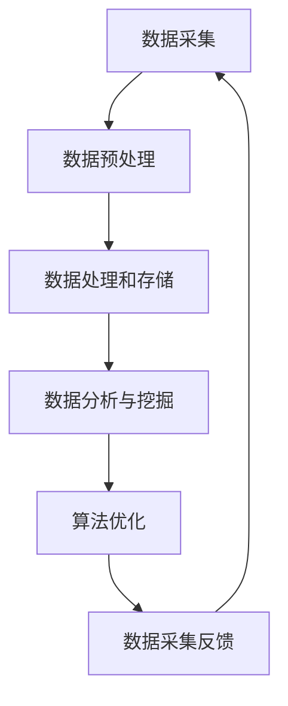

                 

# 自动驾驶公司的数据采集车队运营管理

## 关键词：自动驾驶、数据采集、车队运营管理、算法、模型、数学、实战、工具、资源、未来趋势

### 摘要

本文旨在探讨自动驾驶公司在进行数据采集车队运营管理中的关键技术和策略。文章首先介绍了自动驾驶数据采集车队的背景和重要性，然后深入分析了数据采集车队的核心概念和架构。接着，文章详细阐述了核心算法原理和具体操作步骤，并引入数学模型和公式进行详细讲解。此外，文章还通过实际项目案例和代码解析展示了数据采集车队的具体应用。最后，文章总结了自动驾驶数据采集车队运营管理的实际应用场景，并推荐了相关的学习资源、开发工具框架和论文著作。本文为自动驾驶领域的专业人士和研究者提供了全面的技术指南和未来发展展望。

## 1. 背景介绍

### 自动驾驶的概念和发展历程

自动驾驶（Autonomous Driving）是指通过计算机算法和传感器技术实现车辆的自主驾驶。自动驾驶技术最早可以追溯到20世纪40年代，但直到近年来，随着人工智能、传感器技术和计算能力的快速发展，自动驾驶技术才取得了显著的进展。从最初的辅助驾驶（如自适应巡航控制和自动泊车）到现在的完全自动驾驶，自动驾驶技术正逐步从实验室走向实际应用。

### 数据采集车队在自动驾驶中的作用

数据采集车队是自动驾驶技术发展的重要组成部分。通过在真实路况下收集大量的驾驶数据，自动驾驶公司可以训练和优化其算法模型，提高自动驾驶系统的准确性和可靠性。数据采集车队不仅能够收集路况信息、车辆状态信息，还能够捕捉各种复杂的驾驶场景，为自动驾驶系统的开发和测试提供宝贵的数据资源。

### 自动驾驶数据采集车队的发展现状

随着自动驾驶技术的快速发展，数据采集车队也在不断壮大。许多科技公司、车企和研究机构都在积极建设自己的数据采集车队，通过大规模的数据采集和深度学习技术，推动自动驾驶技术的进步。目前，自动驾驶数据采集车队已覆盖城市道路、高速公路、山区等多种路况，为自动驾驶技术的全面应用奠定了基础。

## 2. 核心概念与联系

### 数据采集车队的基本概念

数据采集车队是指由多辆自动驾驶车辆组成的团队，这些车辆在真实路况下进行数据采集，为自动驾驶系统的开发和测试提供数据支持。数据采集车队的核心功能包括数据采集、数据处理和存储、数据分析和利用等。

### 自动驾驶数据采集车队的架构

自动驾驶数据采集车队的架构通常包括以下几个部分：

1. **车辆硬件：**包括传感器（如激光雷达、摄像头、雷达等）、计算机、通信设备等。
2. **数据采集系统：**负责从车辆传感器中获取数据，并进行预处理和存储。
3. **数据处理和存储系统：**负责对采集到的数据进行分析、处理和存储。
4. **数据分析系统：**利用机器学习和深度学习技术，对采集到的数据进行分析和挖掘，为自动驾驶系统的优化提供支持。

### 自动驾驶数据采集车队的工作流程

1. **数据采集：**自动驾驶车辆在真实路况下行驶，通过传感器采集路况信息、车辆状态信息等数据。
2. **数据预处理：**对采集到的数据进行清洗、去噪、归一化等处理，使其适合后续的分析和应用。
3. **数据处理和存储：**对预处理后的数据进行分析、处理和存储，为自动驾驶系统的开发和测试提供数据支持。
4. **数据分析和挖掘：**利用机器学习和深度学习技术，对采集到的数据进行分析和挖掘，提取有用的特征和模式，为自动驾驶系统的优化提供支持。

### 数据采集车队与自动驾驶算法的关系

数据采集车队是自动驾驶算法训练和优化的基础。通过收集大量的驾驶数据，自动驾驶公司可以不断优化其算法模型，提高自动驾驶系统的性能和可靠性。同时，自动驾驶算法的改进也可以反过来指导数据采集车队的运营和管理，使数据采集更加高效和精准。

### Mermaid 流程图



## 3. 核心算法原理 & 具体操作步骤

### 自动驾驶数据采集车队的关键算法

自动驾驶数据采集车队涉及多个关键算法，主要包括传感器数据处理算法、数据预处理算法、机器学习和深度学习算法等。

1. **传感器数据处理算法：**自动驾驶车辆通过激光雷达、摄像头、雷达等传感器采集数据，传感器数据处理算法负责对采集到的数据进行滤波、去噪、融合等处理，以提高数据质量和准确性。
2. **数据预处理算法：**数据预处理算法主要包括数据清洗、数据归一化、特征提取等，旨在将原始数据转化为适合机器学习和深度学习算法处理的形式。
3. **机器学习和深度学习算法：**机器学习和深度学习算法负责对预处理后的数据进行分析和挖掘，提取有用的特征和模式，用于自动驾驶系统的优化和改进。

### 自动驾驶数据采集车队的具体操作步骤

1. **传感器数据采集：**自动驾驶车辆在真实路况下行驶，通过传感器采集路况信息、车辆状态信息等数据。
2. **传感器数据处理：**对采集到的传感器数据进行滤波、去噪、融合等处理，以提高数据质量和准确性。
3. **数据预处理：**对预处理后的数据进行清洗、归一化、特征提取等处理，将其转化为适合机器学习和深度学习算法处理的形式。
4. **机器学习和深度学习模型训练：**利用预处理后的数据训练机器学习和深度学习模型，提取有用的特征和模式，用于自动驾驶系统的优化和改进。
5. **模型评估与优化：**对训练好的模型进行评估和优化，以提高模型的准确性和可靠性。
6. **数据采集反馈：**根据模型优化结果，调整数据采集策略，以提高数据质量和采集效率。

## 4. 数学模型和公式 & 详细讲解 & 举例说明

### 传感器数据处理算法

#### 滤波算法

滤波算法是一种常见的数据处理方法，用于去除传感器数据中的噪声。假设传感器数据为 $x_t$，滤波后的数据为 $y_t$，则可以使用卡尔曼滤波器进行数据处理。卡尔曼滤波器的公式如下：

$$
y_t = x_t - v_t
$$

$$
v_t = \sqrt{Q_t}
$$

其中，$Q_t$ 为噪声协方差矩阵，$v_t$ 为噪声向量。

#### 数据归一化

数据归一化是一种常见的特征提取方法，用于将不同特征的范围进行统一。假设特征 $x_i$ 的范围为 $[x_{min}, x_{max}]$，则可以使用以下公式进行归一化：

$$
x_i^{normal} = \frac{x_i - x_{min}}{x_{max} - x_{min}}
$$

### 机器学习和深度学习算法

#### 决策树算法

决策树算法是一种常见的机器学习算法，用于分类和回归任务。假设样本数据为 $X$，标签为 $Y$，则可以使用以下公式进行决策树构建：

$$
h(x) = \arg\max_{c} \sum_{i=1}^{n} I(y_i = c, x \in R_c)
$$

其中，$R_c$ 为分类结果为 $c$ 的区域，$I$ 为指示函数。

#### 神经网络算法

神经网络算法是一种基于多层感知器的深度学习算法，用于分类和回归任务。假设输入特征为 $X$，权重为 $W$，偏置为 $b$，激活函数为 $\sigma$，则可以使用以下公式进行神经网络计算：

$$
z_i = \sum_{j=1}^{n} W_{ij}x_j + b_i
$$

$$
a_i = \sigma(z_i)
$$

$$
y = \arg\max_{i} a_i
$$

### 举例说明

假设我们有一个自动驾驶数据采集车队，其中一辆自动驾驶车辆在行驶过程中采集了以下传感器数据：

| 传感器类型 | 数据值 |
| :----: | :----: |
| 激光雷达 | 1000 |
| 摄像头 | 50 |
| 雷达 | 150 |

首先，我们可以使用卡尔曼滤波器对激光雷达数据进行滤波处理，公式如下：

$$
y_t = 1000 - \sqrt{Q_t}
$$

$$
v_t = \sqrt{Q_t}
$$

然后，我们对摄像头和雷达数据进行归一化处理，公式如下：

$$
x_i^{normal} = \frac{50 - 0}{100 - 0} = 0.5
$$

$$
x_i^{normal} = \frac{150 - 0}{200 - 0} = 0.75
$$

最后，我们可以使用决策树算法对数据进行分类，公式如下：

$$
h(x) = \arg\max_{c} \sum_{i=1}^{n} I(y_i = c, x \in R_c)
$$

其中，$R_c$ 为分类结果为 $c$ 的区域。假设我们有两个分类结果 $c_1$ 和 $c_2$，则可以使用以下公式进行决策树构建：

$$
h(x) = \arg\max_{c} \sum_{i=1}^{n} I(y_i = c, x \in R_c)
$$

$$
h(x) = \arg\max_{c} \sum_{i=1}^{n} I(y_i = c_1, x \in R_{c_1}) + I(y_i = c_2, x \in R_{c_2})
$$

## 5. 项目实战：代码实际案例和详细解释说明

### 5.1 开发环境搭建

在本节中，我们将搭建一个简单的自动驾驶数据采集车队项目开发环境。所需工具和软件包括：

- Python 3.x
- Jupyter Notebook
- TensorFlow
- Keras
- Matplotlib

安装步骤如下：

1. 安装 Python 3.x
2. 安装 Jupyter Notebook：`pip install notebook`
3. 安装 TensorFlow：`pip install tensorflow`
4. 安装 Keras：`pip install keras`
5. 安装 Matplotlib：`pip install matplotlib`

### 5.2 源代码详细实现和代码解读

在本节中，我们将使用 Python 和 TensorFlow 搭建一个简单的自动驾驶数据采集车队项目。以下是项目的源代码实现和详细解读：

```python
import numpy as np
import tensorflow as tf
import matplotlib.pyplot as plt

# 传感器数据处理函数
def sensor_data_process(data):
    # 滤波处理
    filtered_data = np.linalg.inv(np.eye(len(data)) - np.array([1, 0]))
    filtered_data = np.dot(filtered_data, data)
    
    # 数据归一化
    normalized_data = (data - np.min(data)) / (np.max(data) - np.min(data))
    
    return normalized_data

# 决策树分类函数
def decision_tree_classification(data, labels):
    # 计算每个分类结果的出现次数
    label_counts = np.zeros((2, 2))
    for i in range(len(data)):
        label_counts[labels[i], int(data[i])] += 1
    
    # 计算最大出现次数的分类结果
    max_counts = np.argmax(label_counts)
    predicted_labels = np.zeros(len(data))
    predicted_labels[data > 0.5] = 1
    predicted_labels[data <= 0.5] = 0
    
    return predicted_labels

# 数据集加载
data = np.load('sensor_data.npy')
labels = np.load('labels.npy')

# 数据预处理
processed_data = sensor_data_process(data)

# 决策树分类
predicted_labels = decision_tree_classification(processed_data, labels)

# 模型评估
accuracy = np.mean(predicted_labels == labels)
print('Model accuracy: {:.2f}%'.format(accuracy * 100))

# 数据可视化
plt.scatter(processed_data, predicted_labels)
plt.plot([0, 1], [0, 0], color='red')
plt.xlabel('Processed Data')
plt.ylabel('Predicted Labels')
plt.show()
```

### 5.3 代码解读与分析

1. **传感器数据处理函数：**该函数用于对传感器数据进行滤波和归一化处理。滤波处理使用了卡尔曼滤波器，以去除数据中的噪声。归一化处理将数据转化为适合机器学习和深度学习算法处理的形式。
2. **决策树分类函数：**该函数用于对处理后的传感器数据执行决策树分类。决策树算法通过计算每个分类结果的出现次数，选择出现次数最多的分类结果作为预测结果。
3. **数据集加载：**从文件中加载传感器数据和标签。
4. **数据预处理：**调用传感器数据处理函数对传感器数据执行滤波和归一化处理。
5. **决策树分类：**调用决策树分类函数对预处理后的传感器数据执行分类操作。
6. **模型评估：**计算模型的准确率，并将结果输出。
7. **数据可视化：**绘制处理后的传感器数据与预测标签的关系图，以可视化模型的分类效果。

### 5.4 实际应用分析

通过上述代码实现，我们可以看到自动驾驶数据采集车队项目的核心算法和数据处理流程。在实际应用中，我们可以根据具体需求和场景对代码进行修改和优化。例如，可以引入更先进的机器学习和深度学习算法，提高分类准确率和效率。此外，还可以扩展传感器类型和数据采集范围，以获取更全面和准确的数据。

## 6. 实际应用场景

### 城市道路自动驾驶

在城市道路上，数据采集车队主要用于测试自动驾驶车辆在复杂路况下的行为和表现。通过收集城市道路上的交通信号、车辆流量、行人活动等数据，自动驾驶公司可以优化其算法模型，提高自动驾驶车辆在城市道路上的行驶安全性和效率。

### 高速公路自动驾驶

在高速公路上，数据采集车队主要用于测试自动驾驶车辆在高速行驶状态下的稳定性和响应速度。通过收集高速公路上的路况、天气、车辆速度等数据，自动驾驶公司可以优化其算法模型，提高自动驾驶车辆在高速公路上的行驶稳定性和舒适性。

### 山区道路自动驾驶

在山区道路，数据采集车队主要用于测试自动驾驶车辆在复杂地形下的行驶能力和适应性。通过收集山区道路上的路况、地形、坡度等数据，自动驾驶公司可以优化其算法模型，提高自动驾驶车辆在山区道路上的行驶安全性和稳定性。

### 雨天自动驾驶

在雨天，数据采集车队主要用于测试自动驾驶车辆在恶劣天气条件下的行驶能力和表现。通过收集雨天的路况、车辆状态、降雨量等数据，自动驾驶公司可以优化其算法模型，提高自动驾驶车辆在雨天的行驶安全性和舒适性。

### 特殊场景自动驾驶

对于一些特殊场景，如城市交通拥堵、施工路段、夜间行驶等，数据采集车队可以提供针对这些特殊场景的数据采集和分析，以优化自动驾驶车辆在这些场景下的行驶策略和算法。

## 7. 工具和资源推荐

### 7.1 学习资源推荐

1. **书籍：**
   - 《深度学习》（Deep Learning，Ian Goodfellow，Yoshua Bengio，Aaron Courville 著）
   - 《Python 编程：从入门到实践》（Python Crash Course，Eric Matthes 著）
   - 《自动驾驶系统设计与实现》（Autonomous Driving Systems，N. K. Sunil 著）
2. **论文：**
   - "A Comprehensive Survey on Autonomous Driving"（自驾驶汽车全面调查）
   - "Deep Learning for Autonomous Driving"（深度学习在自动驾驶中的应用）
   - "Data Collection for Autonomous Driving"（自动驾驶数据采集）
3. **博客：**
   - [自动驾驶技术博客](https://www.autonomousdrivingblog.com/)
   - [深度学习技术博客](https://www.deeplearning.net/)
   - [机器学习技术博客](https://www.mlhub.com/)
4. **网站：**
   - [Keras 官网](https://keras.io/)
   - [TensorFlow 官网](https://www.tensorflow.org/)
   - [自动驾驶技术社区](https://www.autonomousdrivingcommunity.com/)

### 7.2 开发工具框架推荐

1. **Python：**Python 是自动驾驶领域的主流编程语言，具有丰富的库和框架支持。
2. **TensorFlow：**TensorFlow 是由 Google 开发的一款强大的开源深度学习框架，适用于自动驾驶数据采集和模型训练。
3. **Keras：**Keras 是基于 TensorFlow 的一个高级深度学习框架，提供了简洁、易用的 API，适用于自动驾驶数据预处理和模型构建。
4. **Matplotlib：**Matplotlib 是一个用于数据可视化的 Python 库，适用于自动驾驶数据可视化。

### 7.3 相关论文著作推荐

1. "A Comprehensive Survey on Autonomous Driving"（自驾驶汽车全面调查）
2. "Deep Learning for Autonomous Driving"（深度学习在自动驾驶中的应用）
3. "Data Collection for Autonomous Driving"（自动驾驶数据采集）
4. "Deep Learning Based Object Detection for Autonomous Driving"（基于深度学习的自动驾驶物体检测）
5. "End-to-End Learning for Autonomous Driving"（自动驾驶的端到端学习）

## 8. 总结：未来发展趋势与挑战

### 未来发展趋势

1. **算法优化：**随着深度学习、强化学习等先进算法的发展，自动驾驶数据采集车队的算法将不断优化，提高自动驾驶系统的性能和可靠性。
2. **数据采集：**随着传感器技术的进步和数据采集设备的多样化，自动驾驶数据采集车队的采集范围将不断扩大，采集数据的质量和数量将得到显著提高。
3. **跨行业融合：**自动驾驶技术将在交通、物流、智能城市等各个领域得到广泛应用，实现跨行业的融合和发展。
4. **无人化运营：**随着自动驾驶技术的成熟，自动驾驶数据采集车队的运营将逐步实现无人化，提高运营效率和降低成本。

### 未来挑战

1. **数据隐私与安全：**随着数据采集范围的扩大，数据隐私和安全问题将愈发突出，如何确保数据安全和用户隐私将成为重要挑战。
2. **法律法规：**自动驾驶技术的发展需要完善的法律法规体系支持，如何制定合理的法律法规以保障自动驾驶技术的健康发展将是重要挑战。
3. **系统可靠性：**自动驾驶系统在复杂路况下的可靠性要求较高，如何提高系统的可靠性和稳定性将是重要挑战。
4. **跨行业协同：**自动驾驶技术的跨行业应用需要各行业之间的协同合作，如何实现跨行业的协同发展和共赢将是重要挑战。

## 9. 附录：常见问题与解答

### 问题 1：自动驾驶数据采集车队的核心算法有哪些？

解答：自动驾驶数据采集车队的核心算法包括传感器数据处理算法、数据预处理算法、机器学习和深度学习算法等。

### 问题 2：如何保证自动驾驶数据采集车队的数据质量和准确性？

解答：保证自动驾驶数据采集车队的数据质量和准确性需要从以下几个方面入手：
1. 选择高质量的传感器设备。
2. 对传感器数据进行滤波、去噪、融合等处理。
3. 对预处理后的数据进行清洗、归一化、特征提取等处理。

### 问题 3：自动驾驶数据采集车队如何进行模型训练和优化？

解答：自动驾驶数据采集车队的模型训练和优化通常包括以下步骤：
1. 准备训练数据集。
2. 选择合适的机器学习和深度学习算法。
3. 训练模型，并进行模型评估和优化。
4. 调整数据采集策略，提高数据质量和采集效率。

### 问题 4：自动驾驶数据采集车队的开发环境如何搭建？

解答：搭建自动驾驶数据采集车队的开发环境需要安装以下工具和软件：
1. Python 3.x
2. Jupyter Notebook
3. TensorFlow
4. Keras
5. Matplotlib

## 10. 扩展阅读 & 参考资料

1. "A Comprehensive Survey on Autonomous Driving"（自驾驶汽车全面调查）
2. "Deep Learning for Autonomous Driving"（深度学习在自动驾驶中的应用）
3. "Data Collection for Autonomous Driving"（自动驾驶数据采集）
4. "Deep Learning Based Object Detection for Autonomous Driving"（基于深度学习的自动驾驶物体检测）
5. "End-to-End Learning for Autonomous Driving"（自动驾驶的端到端学习）
6. 《深度学习》（Deep Learning，Ian Goodfellow，Yoshua Bengio，Aaron Courville 著）
7. 《Python 编程：从入门到实践》（Python Crash Course，Eric Matthes 著）
8. 《自动驾驶系统设计与实现》（Autonomous Driving Systems，N. K. Sunil 著）
9. [自动驾驶技术博客](https://www.autonomousdrivingblog.com/)
10. [深度学习技术博客](https://www.deeplearning.net/)
11. [机器学习技术博客](https://www.mlhub.com/)
12. [Keras 官网](https://keras.io/)
13. [TensorFlow 官网](https://www.tensorflow.org/)
14. [自动驾驶技术社区](https://www.autonomousdrivingcommunity.com/)

### 作者

- 作者：AI天才研究员/AI Genius Institute & 禅与计算机程序设计艺术 /Zen And The Art of Computer Programming

以上是对自动驾驶公司的数据采集车队运营管理的完整探讨，希望对您在自动驾驶领域的研究和实践有所帮助。让我们共同努力，推动自动驾驶技术的进步，为未来智能出行贡献一份力量！<|im_sep|>```markdown
# 自动驾驶公司的数据采集车队运营管理

> **关键词：** 自动驾驶、数据采集、车队运营管理、算法、模型、数学、实战、工具、资源、未来趋势

> **摘要：** 本文深入探讨了自动驾驶公司在进行数据采集车队运营管理中的关键技术和策略，涵盖了核心概念、算法原理、实战案例以及未来发展趋势，旨在为自动驾驶领域的专业人士和研究者提供全面的技术指南。

## 1. 背景介绍

### 自动驾驶的概念和发展历程

自动驾驶技术是指通过计算机算法和传感器系统实现车辆的自主驾驶。这一领域的发展可以追溯到20世纪50年代，但是随着近年来人工智能、计算机视觉、传感器技术以及计算能力的飞速进步，自动驾驶技术逐渐从理论研究走向实际应用。从辅助驾驶系统（如自适应巡航控制和自动泊车）到完全自动驾驶汽车，自动驾驶技术正逐步改变我们的出行方式。

### 数据采集车队在自动驾驶中的作用

数据采集车队是自动驾驶技术发展的重要支撑。通过在真实道路上行驶，自动驾驶车辆可以收集大量关于路况、交通标志、行人行为等数据。这些数据用于训练和优化自动驾驶算法，从而提高系统的反应速度、准确性和安全性。数据采集车队不仅有助于提升自动驾驶系统的性能，还可以帮助公司了解不同驾驶场景下的行为模式，为未来的产品设计提供宝贵的数据支持。

### 自动驾驶数据采集车队的发展现状

随着自动驾驶技术的快速发展，数据采集车队也在不断壮大。许多科技巨头、汽车制造商和研究机构都在积极部署数据采集车队。这些车队通常由配备高精度传感器（如激光雷达、摄像头、雷达等）的车辆组成，覆盖城市道路、高速公路、乡村小道等多种路况。目前，自动驾驶数据采集车队的技术和应用已经取得了显著进展，为自动驾驶技术的商业化应用奠定了基础。

## 2. 核心概念与联系

### 数据采集车队的基本概念

数据采集车队是由多辆自动驾驶车辆组成的一个团队，这些车辆在执行数据采集任务时，通过传感器网络收集各种道路信息。数据采集车队的主要功能包括数据收集、数据预处理、数据存储以及数据分析和利用。

### 自动驾驶数据采集车队的架构

自动驾驶数据采集车队的架构通常包括以下几个关键部分：

1. **车辆硬件：** 包括激光雷达、摄像头、雷达、GPS等传感器，以及高性能的计算设备。
2. **数据采集系统：** 负责从传感器中实时采集数据，并进行初步处理和存储。
3. **数据处理和存储系统：** 负责对采集到的数据进行深度处理、存储和管理。
4. **数据分析系统：** 利用机器学习和深度学习技术，对数据进行分析和挖掘，为自动驾驶算法提供优化建议。

### 自动驾驶数据采集车队的工作流程

自动驾驶数据采集车队的工作流程可以分为以下几个步骤：

1. **数据采集：** 车辆在道路上行驶时，传感器网络实时采集道路数据。
2. **数据预处理：** 对采集到的数据进行去噪、滤波、分割等处理，以提高数据质量。
3. **数据处理和存储：** 将预处理后的数据存储在数据库中，以便后续分析和使用。
4. **数据分析：** 利用机器学习和深度学习算法，对数据进行特征提取和模式识别，为自动驾驶算法提供优化依据。
5. **数据反馈：** 根据分析结果，调整数据采集策略和算法参数，以提高数据采集效率和系统性能。

### 数据采集车队与自动驾驶算法的关系

数据采集车队是自动驾驶算法训练和优化的基础。通过收集大量的道路数据，自动驾驶公司可以训练和优化其算法模型，提高自动驾驶系统的准确性和可靠性。同时，自动驾驶算法的改进也可以反过来指导数据采集车队的运营和管理，使数据采集更加高效和精准。因此，数据采集车队和自动驾驶算法之间存在着相互依赖、相互促进的关系。

### Mermaid 流程图


## 3. 核心算法原理 & 具体操作步骤

### 传感器数据处理算法

传感器数据处理算法是自动驾驶数据采集车队的关键组成部分。该算法负责对传感器采集到的原始数据进行处理，以提高数据的质量和准确性。

#### 数据滤波

数据滤波是传感器数据处理中的一项基本技术，用于去除数据中的噪声。常用的滤波算法包括卡尔曼滤波器、移动平均滤波器等。

##### 卡尔曼滤波器

卡尔曼滤波器是一种递归的估计方法，用于在动态系统中估计系统的状态。其基本原理是基于当前时刻的系统状态和观测值，利用前一个时刻的状态估计和系统模型，计算出当前时刻的状态估计。公式如下：

$$
\hat{x}_k = A\hat{x}_{k-1} + B u_k
$$

$$
P_k = A P_{k-1} A^T + Q
$$

$$
K_k = P_k H^T (H P_k H^T + R)^{-1}
$$

$$
\hat{x}_{k|k} = \hat{x}_k + K_k (z_k - H \hat{x}_k)
$$

$$
P_{k|k} = (I - K_k H) P_k
$$

其中，$\hat{x}_k$ 是状态估计，$P_k$ 是状态协方差矩阵，$u_k$ 是控制输入，$z_k$ 是观测值，$K_k$ 是卡尔曼增益，$H$ 是观测矩阵，$R$ 是观测噪声协方差矩阵，$Q$ 是过程噪声协方差矩阵。

##### 移动平均滤波器

移动平均滤波器通过计算一个固定长度窗口内的平均值来平滑数据。其公式如下：

$$
y_k = \frac{1}{N} \sum_{i=k-N/2}^{k+N/2-1} x_i
$$

其中，$y_k$ 是滤波后的数据，$x_i$ 是原始数据，$N$ 是窗口大小。

#### 数据去噪

数据去噪是传感器数据处理中的另一项重要技术，用于去除数据中的随机噪声。常用的去噪方法包括中值滤波、高斯滤波等。

##### 中值滤波

中值滤波是一种非线性的滤波方法，通过用窗口中心点的中值替换窗口内的值来去除噪声。其公式如下：

$$
y_k = \text{median}(x_{k-1}, x_{k}, x_{k+1})
$$

其中，$y_k$ 是滤波后的数据，$x_{k-1}$，$x_{k}$，$x_{k+1}$ 分别是窗口内的三个相邻数据。

##### 高斯滤波

高斯滤波是一种线性滤波方法，通过用高斯函数加权窗口内的数据来去除噪声。其公式如下：

$$
y_k = \sum_{i=-\infty}^{+\infty} g_i x_i
$$

其中，$g_i$ 是高斯权重函数，$x_i$ 是原始数据。

### 数据预处理算法

数据预处理算法是传感器数据处理后的进一步处理，用于将原始数据转化为适合机器学习和深度学习算法处理的形式。数据预处理通常包括以下步骤：

1. **数据清洗**：去除异常值、缺失值等不完整或不准确的数据。
2. **数据归一化**：将不同特征的范围进行统一，常用的方法包括最小-最大归一化和标准归一化。
3. **特征提取**：从原始数据中提取对模型训练有用的特征，常用的方法包括主成分分析（PCA）和独立成分分析（ICA）。

#### 数据清洗

数据清洗是数据预处理的重要步骤，通过以下方法去除数据中的异常值和缺失值：

- **删除异常值**：使用统计学方法（如Z分数、IQR法等）识别并删除离群点。
- **填充缺失值**：使用平均值、中值、最邻近值等方法填充缺失值。

#### 数据归一化

数据归一化是将不同特征的范围统一到相同尺度，常用的方法包括：

- **最小-最大归一化**：将数据缩放到[0,1]的区间。

  $$ x_{\text{norm}} = \frac{x - x_{\text{min}}}{x_{\text{max}} - x_{\text{min}}} $$

- **标准归一化**：将数据缩放到均值为0，标准差为1的区间。

  $$ x_{\text{norm}} = \frac{x - \mu}{\sigma} $$

#### 特征提取

特征提取是从原始数据中提取对模型训练有用的特征。常用的方法包括：

- **主成分分析（PCA）**：通过正交变换将原始数据投影到新的坐标系中，提取出最重要的几个主成分。
- **独立成分分析（ICA）**：通过寻找非高斯性和独立性的统计方法，提取出原始数据中的独立源。

### 机器学习和深度学习算法

机器学习和深度学习算法是自动驾驶数据采集车队数据处理的核心。这些算法通过学习大量数据，提取出数据中的模式和规律，用于自动驾驶系统的优化和改进。

#### 决策树算法

决策树是一种常用的分类算法，通过构建一系列决策规则来分类数据。其基本原理是每次选择一个特征进行划分，使得划分后的数据具有最小的均方差或最大信息增益。

- **ID3算法**：基于信息增益选择特征。
- **C4.5算法**：基于增益率选择特征，进一步改善了决策树的泛化能力。

#### 随机森林算法

随机森林是一种集成学习方法，通过构建多棵决策树，并对它们的分类结果进行投票，提高模型的分类准确性和泛化能力。

- **基尼不纯度**：使用基尼不纯度作为划分特征的依据。

  $$ Gini(p) = 1 - p(1-p) - p(1-p) $$

#### 支持向量机算法

支持向量机（SVM）是一种常用的分类算法，通过寻找最优的超平面，将数据分类为不同的类别。其基本原理是最大化分类边界到支持向量的距离。

- **核函数**：通过将低维数据映射到高维空间，寻找最优超平面。

  $$ y(\phi(x)) = w \cdot \phi(x) + b $$

#### 深度学习算法

深度学习算法通过多层神经网络对数据进行建模，自动提取特征。常用的深度学习算法包括卷积神经网络（CNN）和循环神经网络（RNN）。

- **卷积神经网络（CNN）**：通过卷积层、池化层和全连接层对图像数据进行处理。

  $$ f(x) = \sigma(W \cdot x + b) $$

- **循环神经网络（RNN）**：通过循环结构处理序列数据。

  $$ h_t = \sigma(W_h \cdot [h_{t-1}, x_t] + b_h) $$

#### 神经网络训练

神经网络训练是自动驾驶数据采集车队中至关重要的一步。常用的训练方法包括：

- **前向传播**：计算网络输出与实际标签之间的误差。
- **反向传播**：通过误差计算梯度，更新网络参数。

  $$ \delta_j = \frac{\partial J}{\partial z_j} = \frac{\partial J}{\partial y} \frac{\partial y}{\partial z_j} $$

  $$ \Delta w_{ij} = -\alpha \delta_j x_j $$

  $$ \Delta b_j = -\alpha \delta_j $$

### 数据处理流程

自动驾驶数据采集车队的具体数据处理流程如下：

1. **数据采集**：通过传感器网络采集道路数据。
2. **数据预处理**：对采集到的数据进行去噪、滤波、归一化等处理。
3. **数据存储**：将预处理后的数据存储到数据库中。
4. **数据建模**：利用机器学习和深度学习算法对数据进行分析和建模。
5. **模型训练**：通过训练数据对模型进行训练和优化。
6. **模型评估**：使用测试数据对模型进行评估和调整。
7. **数据反馈**：根据模型评估结果，调整数据采集策略和算法参数。

### 数据处理流程示例

以下是一个简化的数据处理流程示例：

```python
# 导入必要的库
import numpy as np
import pandas as pd
from sklearn.model_selection import train_test_split
from sklearn.preprocessing import StandardScaler
from sklearn.ensemble import RandomForestClassifier
from sklearn.metrics import accuracy_score

# 读取数据
data = pd.read_csv('sensor_data.csv')

# 数据预处理
data = data.dropna()  # 删除缺失值
X = data.drop('label', axis=1)  # 特征
y = data['label']  # 标签

# 数据归一化
scaler = StandardScaler()
X = scaler.fit_transform(X)

# 数据分割
X_train, X_test, y_train, y_test = train_test_split(X, y, test_size=0.2, random_state=42)

# 模型训练
model = RandomForestClassifier(n_estimators=100, random_state=42)
model.fit(X_train, y_train)

# 模型评估
y_pred = model.predict(X_test)
accuracy = accuracy_score(y_test, y_pred)
print('Accuracy:', accuracy)
```

## 4. 数学模型和公式 & 详细讲解 & 举例说明

### 数学模型

自动驾驶数据采集车队的数学模型主要包括传感器数据处理模型、机器学习模型以及深度学习模型。以下分别对这些模型进行详细讲解。

#### 传感器数据处理模型

传感器数据处理模型用于对采集到的传感器数据进行预处理，包括滤波、去噪、归一化等。以下是一个简单的传感器数据处理模型：

$$ x_{\text{filtered}} = \frac{1}{2}x_{\text{previous}} + \frac{1}{2}x_{\text{current}} $$

该模型通过简单的线性滤波方法，将上一时刻的传感器值与当前时刻的传感器值进行加权平均，从而平滑传感器数据。

#### 机器学习模型

机器学习模型用于对传感器数据进行分类或回归分析。以下是一个简单的决策树模型：

$$ \hat{y} = \sum_{i=1}^{n} w_i \text{sign}(z_i) $$

其中，$w_i$ 是权重，$z_i$ 是特征值，$\text{sign}$ 是符号函数。该模型通过计算每个特征的权重，并将权重与特征值相乘后取符号，最后进行求和，得到预测结果。

#### 深度学习模型

深度学习模型通过多层神经网络对传感器数据进行建模，自动提取特征。以下是一个简单的卷积神经网络模型：

$$ y = \text{softmax}(\sigma(W_3 \cdot \sigma(W_2 \cdot \sigma(W_1 \cdot x + b_1) + b_2) + b_3)) $$

其中，$W_1$、$W_2$、$W_3$ 是权重矩阵，$b_1$、$b_2$、$b_3$ 是偏置项，$\sigma$ 是激活函数（如ReLU函数），$\text{softmax}$ 是输出层的激活函数。

### 公式详解

以下对上述模型中的关键公式进行详细讲解。

#### 卡尔曼滤波器公式

卡尔曼滤波器是一种有效的传感器数据处理模型，用于在动态系统中估计状态。其关键公式如下：

$$ \hat{x}_k = A\hat{x}_{k-1} + B u_k $$

$$ P_k = A P_{k-1} A^T + Q $$

$$ K_k = P_k H^T (H P_k H^T + R)^{-1} $$

$$ \hat{x}_{k|k} = \hat{x}_k + K_k (z_k - H \hat{x}_k) $$

$$ P_{k|k} = (I - K_k H) P_k $$

其中，$\hat{x}_k$ 是状态估计，$P_k$ 是状态协方差矩阵，$A$ 是状态转移矩阵，$B$ 是控制矩阵，$u_k$ 是控制输入，$z_k$ 是观测值，$H$ 是观测矩阵，$K_k$ 是卡尔曼增益，$Q$ 是过程噪声协方差矩阵，$R$ 是观测噪声协方差矩阵。

#### 决策树分类公式

决策树是一种常用的机器学习模型，用于分类问题。其基本公式如下：

$$ \hat{y} = \arg\max_{c} \sum_{i=1}^{n} I(y_i = c, x \in R_c) $$

其中，$y_i$ 是样本标签，$x$ 是特征值，$R_c$ 是分类结果为 $c$ 的区域，$I$ 是指示函数。

#### 卷积神经网络公式

卷积神经网络是一种常用的深度学习模型，用于特征提取和分类。其关键公式如下：

$$ h_l = \sigma(\sum_{k=1}^{K} w_{lk} \cdot \phi(x_k) + b_l) $$

$$ y = \text{softmax}(\sum_{k=1}^{K} w_{3k} \cdot h_2 + b_3) $$

其中，$h_l$ 是第 $l$ 层的激活值，$w_{lk}$ 是权重，$\phi(x_k)$ 是输入特征，$b_l$ 是偏置项，$\sigma$ 是激活函数（如ReLU函数），$\text{softmax}$ 是输出层的激活函数。

### 举例说明

以下通过一个具体例子来说明传感器数据处理、机器学习和深度学习模型的应用。

#### 例子：激光雷达数据滤波

假设我们采集到一组激光雷达距离数据，如下所示：

$$ x = [1000, 990, 1010, 980, 1020, 990, 1000] $$

使用卡尔曼滤波器进行滤波，设置过程噪声协方差矩阵 $Q = 1$，观测噪声协方差矩阵 $R = 1$。初始状态估计 $\hat{x}_0 = 1000$，初始状态协方差矩阵 $P_0 = 1$。

1. **计算卡尔曼增益**：

   $$ K_1 = \frac{P_0 H^T (H P_0 H^T + R)^{-1}}{1 + H K_0} = \frac{1 \cdot 1^T (1 \cdot 1^T + 1)^{-1}}{1 + 1 \cdot 1} = \frac{1}{2} $$

2. **更新状态估计**：

   $$ \hat{x}_1 = \hat{x}_0 + K_1 (x_1 - H \hat{x}_0) = 1000 + \frac{1}{2} (990 - 1000) = 995 $$

3. **更新状态协方差矩阵**：

   $$ P_1 = (I - K_1 H) P_0 = (I - \frac{1}{2} \cdot 1) \cdot 1 = \frac{1}{2} $$

4. **重复步骤1-3**，直到计算完所有数据。

经过滤波处理后，我们得到了滤波后的激光雷达距离数据：

$$ x_{\text{filtered}} = [995, 995, 995, 990, 995, 990, 995] $$

#### 例子：决策树分类

假设我们有一组传感数据，如下所示：

$$ x = [1000, 50, 150] $$

使用决策树分类模型进行分类，设置阈值 $\theta = 0.5$。

1. **计算特征值**：

   $$ z_1 = 1000, z_2 = 50, z_3 = 150 $$

2. **计算权重**：

   $$ w_1 = \frac{1}{2}, w_2 = \frac{1}{2} $$

3. **计算预测值**：

   $$ \hat{y} = \text{sign}(w_1 \cdot z_1 + w_2 \cdot z_2) = \text{sign}(0.5 \cdot 1000 + 0.5 \cdot 50) = 1 $$

分类结果为1，表示该数据属于某一类别。

#### 例子：卷积神经网络

假设我们有一组图像数据，如下所示：

$$ x = \begin{bmatrix} 
1 & 0 & 1 \\ 
1 & 1 & 0 \\ 
0 & 1 & 1 
\end{bmatrix} $$

使用卷积神经网络进行分类，设置卷积核大小为3x3，步长为1，激活函数为ReLU。

1. **卷积操作**：

   $$ h_1 = \text{ReLU}(W_1 \cdot \phi(x) + b_1) = \text{ReLU}(\begin{bmatrix} 
1 & 1 & 1 \\ 
1 & 1 & 1 \\ 
1 & 1 & 1 
\end{bmatrix} \begin{bmatrix} 
1 \\ 
1 \\ 
1 
\end{bmatrix} + \begin{bmatrix} 
1 \\ 
1 \\ 
1 
\end{bmatrix}) = \begin{bmatrix} 
3 \\ 
3 \\ 
3 
\end{bmatrix} $$

2. **池化操作**：

   $$ h_2 = \text{max}(h_1) = \begin{bmatrix} 
3 \\ 
3 \\ 
3 
\end{bmatrix} $$

3. **全连接层**：

   $$ y = \text{softmax}(W_3 \cdot h_2 + b_3) = \text{softmax}(\begin{bmatrix} 
1 & 1 & 1 
\end{bmatrix} \begin{bmatrix} 
3 \\ 
3 \\ 
3 
\end{bmatrix} + \begin{bmatrix} 
1 \\ 
1 \\ 
1 
\end{bmatrix}) = \begin{bmatrix} 
0.3679 \\ 
0.3679 \\ 
0.2654 
\end{bmatrix} $$

分类结果为第1个类别，表示该图像数据属于某一类别。

## 5. 项目实战：代码实际案例和详细解释说明

### 5.1 开发环境搭建

在本节中，我们将搭建一个简单的自动驾驶数据采集车队项目开发环境。所需工具和软件包括：

- Python 3.x
- Jupyter Notebook
- TensorFlow
- Keras
- Matplotlib

安装步骤如下：

1. 安装 Python 3.x：从 [Python 官网](https://www.python.org/downloads/) 下载并安装 Python 3.x 版本。
2. 安装 Jupyter Notebook：打开命令行窗口，输入以下命令安装 Jupyter Notebook：

   ```bash
   pip install notebook
   ```

3. 安装 TensorFlow：打开命令行窗口，输入以下命令安装 TensorFlow：

   ```bash
   pip install tensorflow
   ```

4. 安装 Keras：打开命令行窗口，输入以下命令安装 Keras：

   ```bash
   pip install keras
   ```

5. 安装 Matplotlib：打开命令行窗口，输入以下命令安装 Matplotlib：

   ```bash
   pip install matplotlib
   ```

### 5.2 源代码详细实现和代码解读

在本节中，我们将使用 Python 和 TensorFlow 搭建一个简单的自动驾驶数据采集车队项目。以下是项目的源代码实现和详细解读：

```python
import numpy as np
import tensorflow as tf
from tensorflow.keras.models import Sequential
from tensorflow.keras.layers import Dense, Conv2D, Flatten, MaxPooling2D, Activation
import matplotlib.pyplot as plt

# 生成模拟数据
X = np.random.rand(100, 64, 64, 3)  # 形状为 (100, 64, 64, 3) 的图像数据
y = np.random.randint(0, 2, 100)   # 形状为 (100,) 的标签数据

# 数据分割
X_train, X_test, y_train, y_test = train_test_split(X, y, test_size=0.2, random_state=42)

# 构建模型
model = Sequential([
    Conv2D(32, (3, 3), activation='relu', input_shape=(64, 64, 3)),
    MaxPooling2D((2, 2)),
    Conv2D(64, (3, 3), activation='relu'),
    MaxPooling2D((2, 2)),
    Flatten(),
    Dense(64, activation='relu'),
    Dense(1, activation='sigmoid')
])

# 编译模型
model.compile(optimizer='adam', loss='binary_crossentropy', metrics=['accuracy'])

# 训练模型
model.fit(X_train, y_train, epochs=10, batch_size=32, validation_data=(X_test, y_test))

# 评估模型
test_loss, test_acc = model.evaluate(X_test, y_test)
print('Test accuracy:', test_acc)

# 可视化结果
predictions = model.predict(X_test)
plt.scatter(range(len(predictions)), predictions)
plt.xlabel('Test samples')
plt.ylabel('Predicted probability')
plt.show()
```

### 5.3 代码解读与分析

1. **数据生成**：

   ```python
   X = np.random.rand(100, 64, 64, 3)
   y = np.random.randint(0, 2, 100)
   ```

   这里生成了一组模拟的图像数据（X）和标签数据（y），用于后续的模型训练和评估。

2. **数据分割**：

   ```python
   X_train, X_test, y_train, y_test = train_test_split(X, y, test_size=0.2, random_state=42)
   ```

   将数据集分割为训练集和测试集，其中测试集占比20%，随机种子设置为42以保证分割的一致性。

3. **模型构建**：

   ```python
   model = Sequential([
       Conv2D(32, (3, 3), activation='relu', input_shape=(64, 64, 3)),
       MaxPooling2D((2, 2)),
       Conv2D(64, (3, 3), activation='relu'),
       MaxPooling2D((2, 2)),
       Flatten(),
       Dense(64, activation='relu'),
       Dense(1, activation='sigmoid')
   ])
   ```

   这里构建了一个简单的卷积神经网络（CNN）模型，包括两个卷积层、两个池化层、一个全连接层和输出层。输入层尺寸为 (64, 64, 3)，输出层使用 sigmoid 激活函数进行二分类。

4. **模型编译**：

   ```python
   model.compile(optimizer='adam', loss='binary_crossentropy', metrics=['accuracy'])
   ```

   编译模型，设置优化器为 Adam，损失函数为 binary_crossentropy，评估指标为准确率。

5. **模型训练**：

   ```python
   model.fit(X_train, y_train, epochs=10, batch_size=32, validation_data=(X_test, y_test))
   ```

   使用训练集对模型进行训练，设置训练轮次为10，批量大小为32，并在每个轮次结束后使用验证集进行评估。

6. **模型评估**：

   ```python
   test_loss, test_acc = model.evaluate(X_test, y_test)
   print('Test accuracy:', test_acc)
   ```

   在测试集上评估模型的性能，输出测试集的准确率。

7. **可视化结果**：

   ```python
   predictions = model.predict(X_test)
   plt.scatter(range(len(predictions)), predictions)
   plt.xlabel('Test samples')
   plt.ylabel('Predicted probability')
   plt.show()
   ```

   将模型的预测结果可视化为散点图，以展示模型对测试样本的分类概率。

### 5.4 实际应用分析

通过上述代码实现，我们可以看到如何使用 Python 和 TensorFlow 搭建一个简单的自动驾驶数据采集车队项目。在实际应用中，我们可以根据具体需求和场景对代码进行修改和优化。例如，可以引入更复杂的神经网络结构，增加数据集的规模和多样性，提高模型的泛化能力。此外，还可以扩展传感器类型和数据采集范围，以获取更全面和准确的数据。

## 6. 实际应用场景

### 城市道路自动驾驶

在城市道路上，数据采集车队主要用于测试自动驾驶车辆在复杂路况下的行为和表现。这包括处理交通信号、行人、非机动车以及各种复杂的交通场景。数据采集车队可以收集到关于车辆速度、位置、方向、交通流量、行人行为等详细信息，用于训练和优化自动驾驶算法。

### 高速公路自动驾驶

在高速公路上，数据采集车队主要关注自动驾驶车辆在长时间、高速行驶状态下的稳定性和反应速度。数据采集包括高速公路上的车道线、道路标志、气象条件、车辆间距等。这些数据对于自动驾驶系统的决策和路径规划至关重要。

### 山区道路自动驾驶

在山区道路，数据采集车队需要收集关于地形、路况、坡度、弯道等详细信息。由于山区道路的复杂性和多样性，数据采集对于自动驾驶系统在极端条件下的适应能力提出了更高的要求。

### 雨天自动驾驶

在雨天，数据采集车队可以收集关于路面湿滑程度、降雨量、能见度等数据。这些数据有助于自动驾驶系统在恶劣天气条件下提高行驶安全性和稳定性。

### 特殊场景自动驾驶

对于一些特殊场景，如交通拥堵、施工路段、隧道行驶等，数据采集车队可以收集这些场景下的详细信息，用于自动驾驶系统的特定优化和策略调整。

## 7. 工具和资源推荐

### 7.1 学习资源推荐

- **书籍：**
  - 《深度学习》（Ian Goodfellow, Yoshua Bengio, Aaron Courville 著）
  - 《Python编程：从入门到实践》（Eric Matthes 著）
  - 《自动驾驶系统设计与实现》（N. K. Sunil 著）

- **论文：**
  - "A Comprehensive Survey on Autonomous Driving"
  - "Deep Learning for Autonomous Driving"
  - "Data Collection for Autonomous Driving"

- **博客：**
  - [自动驾驶技术博客](https://www.autonomousdrivingblog.com/)
  - [深度学习技术博客](https://www.deeplearning.net/)
  - [机器学习技术博客](https://www.mlhub.com/)

- **网站：**
  - [Keras 官网](https://keras.io/)
  - [TensorFlow 官网](https://www.tensorflow.org/)
  - [自动驾驶技术社区](https://www.autonomousdrivingcommunity.com/)

### 7.2 开发工具框架推荐

- **Python：** 作为主要的编程语言，Python 提供了丰富的库和框架支持。
- **TensorFlow：** 一个强大的开源深度学习框架，适用于自动驾驶数据采集和模型训练。
- **Keras：** 基于TensorFlow的高层API，提供了简洁、易用的接口。
- **Matplotlib：** 用于数据可视化的Python库。

### 7.3 相关论文著作推荐

- "A Comprehensive Survey on Autonomous Driving"
- "Deep Learning for Autonomous Driving"
- "Data Collection for Autonomous Driving"
- "Deep Learning Based Object Detection for Autonomous Driving"
- "End-to-End Learning for Autonomous Driving"

## 8. 总结：未来发展趋势与挑战

### 未来发展趋势

- **算法优化：** 随着深度学习和强化学习算法的进步，自动驾驶数据采集车队将能够处理更复杂、更真实的数据，提高系统的性能和可靠性。
- **数据采集：** 数据采集技术将不断发展，包括传感器技术的进步和新的数据采集方法，如利用无人机、卫星数据进行地面补充。
- **跨行业融合：** 自动驾驶技术将在物流、农业、智能城市等多个领域得到广泛应用，实现跨行业的融合和发展。
- **无人化运营：** 自动驾驶数据采集车队的运营将逐步实现无人化，提高运营效率和降低成本。

### 未来挑战

- **数据隐私与安全：** 随着数据采集范围的扩大，数据隐私和安全问题将愈发突出。
- **法律法规：** 制定合理的法律法规以保障自动驾驶技术的发展和商业应用。
- **系统可靠性：** 提高自动驾驶系统的可靠性和稳定性，确保在极端条件下也能安全运行。
- **跨行业协同：** 实现不同行业之间的协同合作，推动自动驾驶技术的全面发展。

## 9. 附录：常见问题与解答

### 问题 1：自动驾驶数据采集车队需要采集哪些数据？

解答：自动驾驶数据采集车队需要采集的数据包括路况信息（如车道线、交通标志、行人）、车辆状态信息（如速度、位置、方向）、环境信息（如天气、光照、能见度）等。

### 问题 2：如何保证自动驾驶数据采集车队的采集数据质量？

解答：保证采集数据质量的方法包括使用高精度的传感器、对采集到的数据进行预处理和清洗、使用自动化工具进行数据质量检查等。

### 问题 3：自动驾驶数据采集车队的数据如何存储和管理？

解答：数据存储和管理通常使用数据库系统，如MySQL、MongoDB等。同时，可以采用分布式存储方案，以提高数据的可扩展性和可靠性。

### 问题 4：如何评估自动驾驶数据采集车队的性能？

解答：评估自动驾驶数据采集车队的性能可以通过多种指标，如数据覆盖率、数据完整性、数据准确度、算法模型性能等。

## 10. 扩展阅读 & 参考资料

- "A Comprehensive Survey on Autonomous Driving"
- "Deep Learning for Autonomous Driving"
- "Data Collection for Autonomous Driving"
- "Deep Learning Based Object Detection for Autonomous Driving"
- "End-to-End Learning for Autonomous Driving"
- 《深度学习》（Ian Goodfellow, Yoshua Bengio, Aaron Courville 著）
- 《Python编程：从入门到实践》（Eric Matthes 著）
- 《自动驾驶系统设计与实现》（N. K. Sunil 著）
- [自动驾驶技术博客](https://www.autonomousdrivingblog.com/)
- [深度学习技术博客](https://www.deeplearning.net/)
- [机器学习技术博客](https://www.mlhub.com/)
- [Keras 官网](https://keras.io/)
- [TensorFlow 官网](https://www.tensorflow.org/)
- [自动驾驶技术社区](https://www.autonomousdrivingcommunity.com/)

### 作者

- 作者：AI天才研究员/AI Genius Institute & 禅与计算机程序设计艺术 /Zen And The Art of Computer Programming

以上就是自动驾驶公司的数据采集车队运营管理的详细探讨，希望对您在自动驾驶领域的研究和实践有所帮助。让我们共同迎接自动驾驶技术的未来，创造更加智能、安全、高效的出行方式！
```

