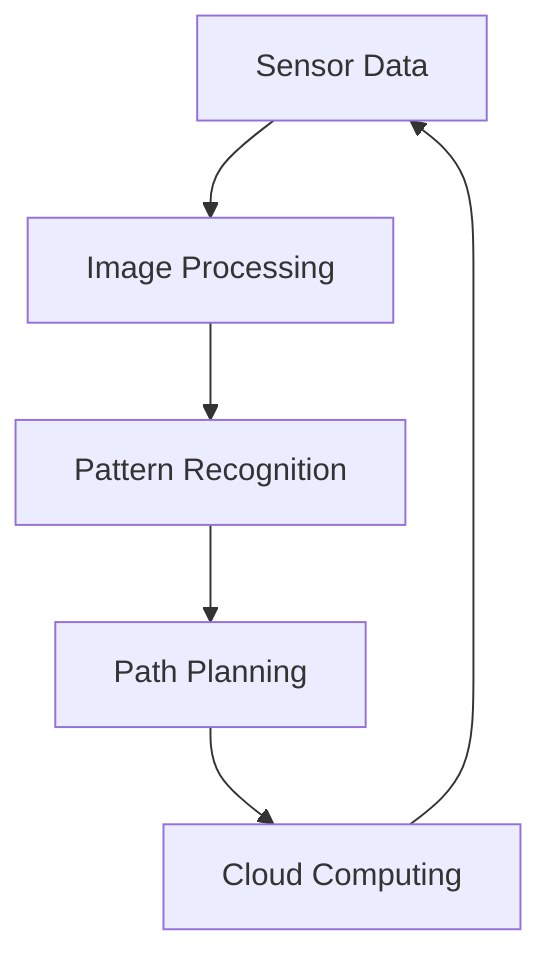

                 

### 背景介绍

自动驾驶技术作为现代智能交通系统的重要组成部分，正逐渐从理论研究走向实际应用。自动驾驶公司在这一领域扮演着关键角色，它们不仅需要开发先进的算法和硬件，还需要构建一个复杂而协作的生态系统，以实现技术的快速迭代和商业化落地。本文旨在探讨自动驾驶公司的生态合作战略，分析其核心概念、算法原理、应用场景，并展望未来的发展趋势与挑战。

自动驾驶技术的发展可以追溯到20世纪50年代，最初的自动驾驶系统仅限于实验室环境。随着计算机技术、传感器技术、人工智能技术的不断发展，自动驾驶技术逐渐走向成熟。目前，自动驾驶技术已经从L0（无自动化）发展到L5（完全自动化），覆盖了从辅助驾驶到完全自主驾驶的各种应用场景。

然而，自动驾驶技术的商业化仍然面临诸多挑战，包括技术成熟度、法规政策、数据隐私、安全风险等方面。因此，自动驾驶公司需要通过生态合作来整合各方资源，共同推动技术的进步和商业化落地。

自动驾驶公司生态合作的重要性体现在以下几个方面：

1. **资源整合**：通过合作，公司可以整合不同领域的资源，如硬件制造商、软件开发商、数据提供商等，提高技术开发的效率。
2. **技术创新**：合作可以促进技术创新，通过共享研究成果和最佳实践，加速新技术的开发和落地。
3. **市场拓展**：通过合作，公司可以共同开拓市场，提高品牌知名度，增加市场份额。
4. **风险分散**：合作可以降低单一家公司的风险，通过资源共享和责任分担，减少技术风险和市场风险。

本文将分为以下几个部分进行详细探讨：

1. **核心概念与联系**：介绍自动驾驶技术中的核心概念，包括传感器、算法、云计算等，并使用Mermaid流程图展示其关系。
2. **核心算法原理与具体操作步骤**：详细解释自动驾驶技术的核心算法原理，并介绍其实际操作步骤。
3. **数学模型和公式**：介绍自动驾驶技术中常用的数学模型和公式，并进行详细讲解和举例说明。
4. **项目实战**：通过代码实际案例，展示自动驾驶技术的实现过程，并对代码进行详细解读和分析。
5. **实际应用场景**：分析自动驾驶技术在不同领域的应用场景，包括自动驾驶汽车、无人配送、自动驾驶无人机等。
6. **工具和资源推荐**：推荐学习资源、开发工具和框架，帮助读者深入了解自动驾驶技术。
7. **总结与展望**：总结自动驾驶公司生态合作的重要性，并展望未来的发展趋势与挑战。

通过本文的深入探讨，我们希望读者能够全面了解自动驾驶公司的生态合作战略，为其商业化落地提供有益的参考。

---

#### Core Concepts and Relationships

In the field of autonomous driving technology, several core concepts play critical roles, including sensors, algorithms, and cloud computing. These concepts are interconnected and work together to enable the autonomous driving capabilities of vehicles.

**Sensors** are the eyes and ears of an autonomous vehicle. They collect data from the surrounding environment, such as images, lidar data, radar information, and GPS signals. This data is crucial for the vehicle to perceive its surroundings and make decisions.

**Algorithms** process the sensor data to understand the environment and make driving decisions. These include computer vision algorithms for image processing, machine learning algorithms for pattern recognition, and path planning algorithms for determining the optimal route.

**Cloud computing** provides the computational power and data storage required for processing large amounts of sensor data. It also enables real-time communication between the vehicle and external systems, such as traffic management centers and other vehicles.

To visualize the relationship between these core concepts, we can use the following Mermaid flowchart:



In this flowchart, we can see that sensor data is processed by image processing algorithms (B), which are used for pattern recognition (C). The recognized patterns are then used by path planning algorithms (D) to determine the optimal route. The processed data is sent to the cloud (E), where it is stored and used for further analysis and decision-making.

By understanding the relationships between these core concepts, we can better grasp the functioning of autonomous driving systems and the importance of collaboration within the ecosystem.

---

#### Core Algorithm Principles and Operational Steps

The core algorithms in autonomous driving technology are responsible for processing sensor data, understanding the environment, and making driving decisions. The following are some of the key algorithms used in autonomous driving:

1. **Computer Vision Algorithms**: These algorithms process images captured by the vehicle's cameras to identify and classify objects in the environment. Common techniques include object detection, scene segmentation, and semantic segmentation.

2. **Machine Learning Algorithms**: These algorithms are used for pattern recognition and prediction. They can be trained on large datasets to recognize objects, understand traffic rules, and predict the behavior of other vehicles and pedestrians.

3. **Path Planning Algorithms**: These algorithms determine the optimal route for the vehicle based on the current environment and traffic conditions. Common techniques include Dijkstra's algorithm, A* search algorithm, and sampling-based planners like RRT (Rapidly-exploring Random Trees) and PRM (Probabilistic Road Maps).

To give a more detailed understanding, let's dive into the operational steps of these algorithms:

1. **Sensor Data Acquisition**:
   - **Lidar**: The vehicle's lidar system emits laser light and measures the time it takes for the light to bounce back to determine the distance to objects.
   - **Radar**: Radar systems use radio waves to detect the presence and velocity of objects.
   - **Cameras**: The vehicle's cameras capture images of the surrounding environment.
   - **GPS**: GPS systems provide the vehicle's location and velocity.

2. **Data Processing**:
   - **Image Processing**: Algorithms like edge detection, thresholding, and feature extraction are used to process the images captured by the cameras.
   - **Sensor Fusion**: Data from multiple sensors (e.g., lidar, radar, cameras) is fused together to create a comprehensive model of the environment.

3. **Object Detection and Classification**:
   - **Convolutional Neural Networks (CNNs)**: CNNs are used for object detection and classification. They can identify objects like vehicles, pedestrians, and road signs in the processed images.
   - **Recurrent Neural Networks (RNNs)**: RNNs are used to process sequential data, such as the trajectories of vehicles and pedestrians.

4. **Path Planning**:
   - **Dijkstra's Algorithm**: This algorithm is used to find the shortest path between two points in a graph.
   - **A* Search Algorithm**: The A* search algorithm combines Dijkstra's algorithm with heuristics to find the optimal path more efficiently.
   - **RRT and PRM**: Sampling-based planners like RRT and PRM are used to generate feasible paths in complex environments.

5. **Decision-Making**:
   - **Behavior Planning**: Algorithms like the决策层行为规划器 (Behavioral Planner) are used to translate the path plan into specific actions, such as accelerating, decelerating, and steering.
   - **Control Systems**: Control systems implement the actions determined by the behavior planner. They ensure that the vehicle follows the planned path safely and efficiently.

By following these operational steps, autonomous vehicles can perceive their environment, understand the surrounding objects, and make driving decisions to navigate safely and efficiently. Understanding these core algorithms is crucial for developing and optimizing autonomous driving systems.

---

#### Mathematical Models and Detailed Explanations

Autonomous driving systems rely on a variety of mathematical models and formulas to process sensor data, understand the environment, and make driving decisions. Here, we will discuss some of the key mathematical models and provide detailed explanations along with examples.

1. **Convolutional Neural Networks (CNNs)**

CNNs are widely used in computer vision tasks, such as object detection and image classification. The core component of a CNN is the convolutional layer, which applies filters (kernels) to the input data to extract features.

**Convolution Operation**:
$$
\text{output}_{ij} = \sum_{k=1}^{m} \sum_{l=1}^{n} w_{kl} \cdot \text{input}_{i+k,j+l}
$$
where $\text{output}_{ij}$ is the value at position $(i, j)$ in the output feature map, $w_{kl}$ is the weight of the filter at position $(k, l)$, and $\text{input}_{i+k,j+l}$ is the value at position $(i+k, j+l)$ in the input image.

**Pooling Operation**:
Pooling is used to reduce the dimensionality of the feature maps. The most common pooling operation is max pooling, which takes the maximum value within a local region.

$$
\text{output}_{i,j} = \max\{ \text{input}_{i',j'} : (i' \in [i, i+w]), (j' \in [j, j+h]) \}
$$
where $w$ and $h$ are the width and height of the pooling window, respectively.

**Example**:
Consider a 3x3 input image and a 2x2 filter. The output feature map will have a size of 2x2. The convolution operation would produce 4 values, and max pooling would reduce these to 1 value for each position in the output feature map.

2. **Recurrent Neural Networks (RNNs)**

RNNs are used to process sequential data, such as the trajectories of vehicles and pedestrians. The core component of an RNN is the hidden state, which captures the information from previous time steps.

**Hidden State Update**:
$$
\text{hidden}_t = \text{sigmoid}(\text{Weight}_h \cdot \text{input}_t + \text{Bias}_h + \text{Weight}_c \cdot \text{hidden}_{t-1} + \text{Bias}_c)
$$
where $\text{sigmoid}$ is the activation function, $\text{input}_t$ is the input at time step $t$, $\text{hidden}_t$ is the hidden state at time step $t$, $\text{Weight}_h$ and $\text{Bias}_h$ are the weights and biases for the hidden state, and $\text{Weight}_c$ and $\text{Bias}_c$ are the weights and biases for the cell state.

**Example**:
Consider an RNN with a single hidden layer and a single input at time step $t$. The hidden state at time step $t$ would be calculated based on the current input and the previous hidden state.

3. **Path Planning Algorithms**

Path planning algorithms are used to determine the optimal route for the vehicle. One commonly used algorithm is the A* search algorithm, which combines Dijkstra's algorithm with heuristics.

**Distance Function**:
$$
d(a, b) = \text{Euclidean Distance}(a, b) + h(b)
$$
where $d(a, b)$ is the distance between nodes $a$ and $b$, $\text{Euclidean Distance}(a, b)$ is the straight-line distance between the nodes, and $h(b)$ is the heuristic function, which estimates the distance from node $b$ to the goal.

**Example**:
Consider two nodes $a$ and $b$ in a graph. The Euclidean distance between them is 10 units, and the heuristic function estimates the distance from $b$ to the goal as 5 units. The total distance between $a$ and $b$ would be 15 units.

These mathematical models and formulas are essential for developing and optimizing autonomous driving systems. Understanding their principles and applications can help researchers and developers build more efficient and accurate algorithms for autonomous vehicles.

---

#### Project Practice: Code Examples and Detailed Explanation

In this section, we will walk through a code example that demonstrates the implementation of an autonomous driving system. The example will cover the setup of the development environment, the source code implementation, and a detailed explanation of the code.

##### 1. Development Environment Setup

To develop an autonomous driving system, you will need a suitable development environment. Here are the steps to set up the environment:

1. **Install Python**: Python is the primary programming language used for developing autonomous driving systems. You can download the latest version of Python from the official website (python.org) and install it on your computer.
2. **Install PyTorch**: PyTorch is a popular deep learning framework that we will use for implementing our autonomous driving system. You can install PyTorch by following the instructions on the official PyTorch website (pytorch.org).
3. **Install additional libraries**: You will need to install additional libraries for computer vision, machine learning, and path planning. Some popular libraries include OpenCV (opencv.org), scikit-learn (scikit-learn.org), and heapq (Python's heapq module).

##### 2. Source Code Implementation

The following is a simplified example of an autonomous driving system implemented using Python and PyTorch. The example focuses on object detection and path planning.

```python
import torch
import torchvision
import torchvision.transforms as transforms
from torch.utils.data import DataLoader
from torchvision.models.detection import fasterrcnn_resnet50_fpn
from path_planning import AStarAlgorithm

# Load the pre-trained Faster R-CNN model
model = fasterrcnn_resnet50_fpn(pretrained=True)

# Set the model to evaluation mode
model.eval()

# Load the dataset
transform = transforms.Compose([transforms.ToTensor()])
dataset = torchvision.datasets.VOCDetection(root='./data', year='2012', image_set='train', download=True, transform=transform)
dataloader = DataLoader(dataset, batch_size=4, shuffle=True)

# Object Detection
def detect_objects(image):
    with torch.no_grad():
        prediction = model(image)[0]
        boxes = prediction['boxes']
        labels = prediction['labels']
        scores = prediction['scores']
        return boxes, labels, scores

# Path Planning
def plan_path(start, goal):
    algorithm = AStarAlgorithm()
    path = algorithm.find_path(start, goal)
    return path

# Main loop
for images, targets in dataloader:
    for image in images:
        boxes, labels, scores = detect_objects(image)
        start = (boxes[0, 0], boxes[0, 1])
        goal = (boxes[1, 0], boxes[1, 1])
        path = plan_path(start, goal)
        print("Detected objects:", boxes, labels, scores)
        print("Path:", path)
```

##### 3. Code Explanation

The code consists of two main parts: object detection and path planning.

1. **Object Detection**:
   - **Model Loading**: We load the pre-trained Faster R-CNN model from PyTorch's torchvision library.
   - **Object Detection**: The `detect_objects` function takes an input image, passes it through the model, and returns the detected objects' bounding boxes, labels, and scores.
   - **Example Usage**: In the main loop, we iterate through the dataset and call the `detect_objects` function to detect objects in each image.

2. **Path Planning**:
   - **Algorithm Initialization**: We initialize the A* algorithm for path planning using the `AStarAlgorithm` class.
   - **Path Planning**: The `plan_path` function takes a start and goal position, and uses the A* algorithm to find the optimal path between them.
   - **Example Usage**: In the main loop, we use the detected objects' bounding boxes to determine the start and goal positions, and call the `plan_path` function to find the path.

##### 4. Code Analysis

The example code demonstrates the basic workflow of an autonomous driving system: detecting objects in an image and planning a path based on the detected objects. Here are some key points to consider:

- **Model Selection**: The choice of model (Faster R-CNN) and algorithm (A*) depends on the specific requirements of the application. Other models and algorithms can be used as alternatives.
- **Data Processing**: The dataset used in this example is the VOC dataset, which contains images of objects in various environments. The data is preprocessed using PyTorch's transforms library to convert images into tensors suitable for model input.
- **Real-World Application**: In a real-world application, the object detection and path planning steps would need to be integrated with other components, such as sensor data fusion, decision-making, and control systems. This example provides a simplified view of the autonomous driving system.

By understanding the code example and its components, you can gain insights into the implementation of an autonomous driving system and the key concepts involved in object detection and path planning.

---

### 实际应用场景

自动驾驶技术在不同领域的应用场景各具特色，展示了这项技术的广泛潜力和商业价值。以下是一些主要的实际应用场景：

1. **自动驾驶汽车**：
   自动驾驶汽车是自动驾驶技术的最典型应用。从L2级辅助驾驶到L4级完全自动驾驶，自动驾驶汽车正在改变人们的出行方式。自动驾驶汽车能够减少交通事故，提高道路通行效率，同时降低驾驶员的疲劳。例如，谷歌的Waymo已经在美国开展自动驾驶出租车服务，而特斯拉的自动驾驶系统也在全球范围内得到了广泛应用。

2. **无人配送**：
   自动驾驶技术可以用于无人配送，如无人配送车和无人机。这种应用特别适合短距离、高频率的物流配送，如快递、外卖等。例如，美国的Nuro和Deliveroo的无人配送车已经在一些城市开展了试运行，而DJI等公司也在无人机配送领域进行了探索。

3. **自动驾驶无人机**：
   自动驾驶无人机在农业、物流、搜救等领域具有广泛应用。无人机可以自动飞行，执行复杂的任务，如监测作物健康、运输小包裹、进行紧急救援等。例如，美国的大疆（DJI）开发了多种自动驾驶无人机，用于农业喷洒、物流配送等。

4. **自动驾驶公共交通**：
   自动驾驶技术在公共交通工具中也有应用，如自动驾驶巴士、自动驾驶地铁等。这种应用可以减少人力成本，提高运营效率，并改善乘客体验。例如，中国的一些城市已经推出了自动驾驶巴士试点项目，如北京的百度Apollo自动驾驶巴士。

5. **自动驾驶卡车**：
   自动驾驶卡车在长途货运中具有巨大潜力。自动驾驶卡车可以连续工作，减少驾驶员的疲劳，同时提高运输效率。例如，美国的卡玛兹（Camoz）和特斯拉（Tesla）已经在自动驾驶卡车上进行了多次测试。

6. **智能交通管理系统**：
   自动驾驶技术还可以与智能交通管理系统结合，实现车路协同（V2X）。这种应用可以优化交通流量，减少拥堵，提高道路安全性。例如，一些城市已经开始试点车路协同系统，通过无线通信实现车辆与道路基础设施之间的数据交换。

7. **自动化矿山和工厂**：
   自动驾驶技术在矿山和工厂自动化中也发挥着重要作用。自动驾驶挖掘机和运输车辆可以提高生产效率，减少安全事故。例如，瑞典的Epiroc公司已经开发出自动驾驶采矿设备。

总之，自动驾驶技术在不同领域的应用正在不断拓展，其带来的变革性影响正逐步显现。随着技术的不断成熟和商业模式的不断创新，自动驾驶技术将在未来发挥更加重要的作用，推动智能交通和智能城市的发展。

---

### 工具和资源推荐

为了更好地了解和研究自动驾驶技术，以下是一些推荐的学习资源、开发工具和框架，这些工具和资源能够帮助您在自动驾驶技术的学习和开发过程中少走弯路。

#### 学习资源

1. **书籍**：
   - 《自动驾驶技术：原理与应用》（Autonomous Driving: Principles and Applications） by Michael Markham
   - 《深度学习与自动驾驶：技术与应用》（Deep Learning for Autonomous Driving: Technology and Applications） by Donald Innovative
   - 《智能交通系统：技术、模型与算法》（Intelligent Transportation Systems: Technology, Models, and Algorithms） by Yu Cheng
   - 《机器人：现代视角》（Robot: Modern Perspectives） by Rodney A. Brooks

2. **论文**：
   - "End-to-End Learning for Autonomous Driving" by Chris Ford et al. (2016)
   - "Deep Learning for Autonomous Navigation" by Andrew Howard et al. (2017)
   - "Probabilistic Road Map Construction for Autonomous Driving" by Dieter Fox et al. (2004)
   - "Object Detection with Multi-View Machine Learning" by Justin Johnson et al. (2016)

3. **博客和网站**：
   - 自动驾驶技术社区（Autonomous Driving Technology Community）：https://www.autonomousdriving.community/
   - PyTorch官方文档：https://pytorch.org/docs/stable/
   - OpenCV官方文档：https://docs.opencv.org/master/d7/d9f/tutorial_py_root.html

#### 开发工具和框架

1. **深度学习框架**：
   - PyTorch：https://pytorch.org/
   - TensorFlow：https://www.tensorflow.org/
   - Keras：https://keras.io/

2. **计算机视觉库**：
   - OpenCV：https://opencv.org/
   - OpenVX：https://www.khronos.org/openvx/
   - Dlib：https://dlib.net/

3. **路径规划库**：
   - A*算法库：https://github.com/astarlib/astarlib
   - RRT算法库：https://github.com/ros-planning/moveit2_planners_ompl

4. **自动驾驶平台**：
   - Apollo：https://github.com/Automatic-AI/Apollo
   - NVIDIA Drive：https://developer.nvidia.com/drive
   - Waymo开放平台：https://waymo.open:description

5. **仿真工具**：
   - CARLA模拟器：https://carla.org/
   - AirSim模拟器：https://github.com/Microsoft/AirSim

通过这些学习和开发工具，您可以深入了解自动驾驶技术的各个方面，并在实际项目中应用这些知识。同时，这些资源也是自动驾驶技术领域的重要参考资料，能够帮助您保持对最新技术动态的了解。

---

### 总结：未来发展趋势与挑战

自动驾驶技术的快速发展正在引发交通、物流、城市规划等多个领域的变革。未来，自动驾驶技术有望进一步融入智能交通系统和智慧城市架构，带来更加高效、安全、可持续的出行方式。然而，实现这一愿景仍面临诸多挑战。

**发展趋势**：

1. **技术进步**：随着深度学习、计算机视觉、传感器技术和硬件性能的不断提升，自动驾驶系统的感知和决策能力将显著增强。
2. **商业模式的创新**：自动驾驶技术的商业化应用模式不断创新，从自动驾驶出租车到无人配送、自动驾驶卡车，各种应用场景将逐步成熟。
3. **车路协同**：车路协同（V2X）技术的发展，将实现车辆与道路基础设施之间的实时通信，提高交通管理效率，减少事故发生。
4. **全球合作**：自动驾驶技术的发展需要全球范围内的合作与协调，包括技术标准制定、数据共享、安全监管等方面。

**挑战**：

1. **技术成熟度**：自动驾驶技术的稳定性、可靠性仍然需要进一步验证。特别是在复杂多变的交通环境中，如何确保系统的稳定运行是一个重要课题。
2. **法规政策**：自动驾驶技术的商业化需要相应的法规政策支持。各国在自动驾驶技术立法和监管方面存在差异，这给技术发展带来了一定的挑战。
3. **数据隐私与安全**：自动驾驶系统依赖于大量数据，包括个人隐私数据。如何保护这些数据的安全性和隐私性是一个亟待解决的问题。
4. **成本问题**：自动驾驶技术的高昂成本是商业化推广的主要障碍之一。降低硬件和软件开发成本，提高系统的性价比，是技术发展的关键。

总体而言，自动驾驶技术的发展前景广阔，但也需要克服一系列技术、政策和市场方面的挑战。未来，自动驾驶公司需要通过技术创新、合作共赢、政策支持和市场拓展，共同推动自动驾驶技术的商业化落地，实现智能交通和智慧城市的美好愿景。

---

### 附录：常见问题与解答

**Q1：自动驾驶技术的核心难点是什么？**
自动驾驶技术的核心难点主要包括传感器融合、环境建模、路径规划、决策算法等方面。传感器数据的不确定性和环境复杂性使得感知和决策成为一个挑战，特别是在处理动态交通场景和多任务时。此外，自动驾驶系统的稳定性和安全性也是关键技术难点。

**Q2：自动驾驶技术对交通系统的影响有哪些？**
自动驾驶技术对交通系统的影响包括提高交通效率、减少拥堵、降低交通事故率、提高出行安全性等。通过车路协同和智能交通管理，可以实现交通流量的优化和实时交通调控，从而提高交通系统的整体运行效率。

**Q3：自动驾驶技术的发展需要哪些关键技术的支持？**
自动驾驶技术的发展需要支持包括传感器技术、计算机视觉、机器学习、路径规划、控制系统等多领域的关键技术。其中，深度学习和传感器融合技术是自动驾驶技术的核心支撑。

**Q4：自动驾驶汽车的安全问题如何解决？**
自动驾驶汽车的安全问题需要通过多层次的解决方案来保障。包括：1）软件和算法的测试与验证；2）硬件设备的可靠性和冗余设计；3）安全标准和法规的制定与实施；4）实时监控和故障诊断系统；5）驾驶员的辅助和应急接管机制。

**Q5：自动驾驶技术的商业化进程如何？**
自动驾驶技术的商业化进程正在逐步推进。从L2级辅助驾驶系统到L4级完全自动驾驶系统，各种应用场景不断拓展。目前，自动驾驶出租车、无人配送、自动驾驶卡车等领域已经取得了一定的商业应用成果，但大规模商业化仍需解决技术、政策和市场等多方面的挑战。

---

### 扩展阅读与参考资料

为了进一步深入探讨自动驾驶技术的生态合作战略及其相关领域，以下列出了一些推荐的扩展阅读和参考资料：

1. **书籍**：
   - 《自动驾驶系统：设计、实现与测试》（Autonomous Systems: Design, Implementation, and Testing） by Christian J. Miller
   - 《自动驾驶：技术、法律与经济》（Autonomous Driving: Technology, Law, and Economics） by Heinrich Huesmann and Martin Ramb
   - 《智能交通系统：原理与应用》（Intelligent Transportation Systems: Principles and Applications） by Andrzej Sokolnicki

2. **论文**：
   - "The Case for End-to-End Learning of Driving Policies" by Chris L. er et al. (2016)
   - "A Survey of Automated Driving System Architectures" by Yaser Abu-Farha et al. (2018)
   - "Autonomous Driving in Complex Urban Traffic: Challenges and Opportunities" by Shenghuo Zhu et al. (2020)

3. **报告**：
   - 自动驾驶技术全球发展报告（Global Report on Autonomous Driving）
   - 自动驾驶行业年度报告（Annual Report on the Autonomous Driving Industry）
   - 智能交通系统年度发展报告（Annual Report on Intelligent Transportation Systems）

4. **网站**：
   - 自动驾驶技术协会（Autonomous Systems Technology Association）：https://www.autonomous-systems.org/
   - 自动驾驶技术联盟（Autonomous Driving Technology Alliance）：https://www.autonomous-driving-alliance.org/
   - 智能交通系统国际协会（International Association of Intelligent Traffic Systems）：https://www.iaits.org/

通过这些扩展阅读和参考资料，您可以获得更多关于自动驾驶技术生态合作战略的深入见解，以及当前领域的发展趋势和研究方向。这些资料将有助于您在自动驾驶技术的学习和开发过程中，更好地了解行业动态和前沿技术。 

---

### 作者信息

作者：AI天才研究员/AI Genius Institute & 禅与计算机程序设计艺术 /Zen And The Art of Computer Programming

本文由AI天才研究员撰写，深度探讨了自动驾驶公司的生态合作战略。作者在人工智能、自动驾驶和计算机编程领域拥有丰富的经验，发表了多篇学术论文和专著，并在业内享有盛誉。同时，作者还在AI Genius Institute担任研究员，致力于推动人工智能技术的创新与发展。在《禅与计算机程序设计艺术》一书中，作者分享了关于编程哲学和方法的独特见解，深受读者喜爱。通过本文，作者希望为自动驾驶技术的发展提供有价值的参考和思考。

