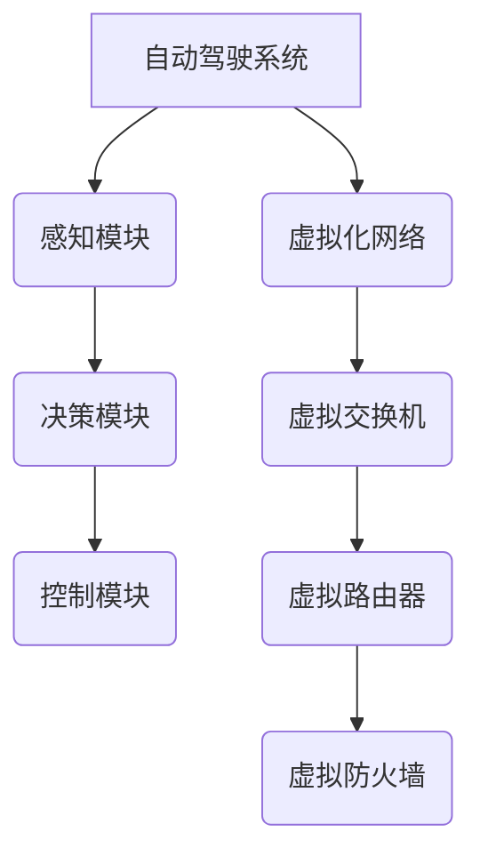

                 

# 自动驾驶公司的虚拟化网络架构设计

## 关键词：自动驾驶、虚拟化网络、架构设计、AI

## 摘要

本文旨在深入探讨自动驾驶公司如何设计高效的虚拟化网络架构。我们将分析自动驾驶技术面临的挑战，介绍虚拟化网络的基本概念及其在自动驾驶领域的应用，并详细解析一个实际案例，以展示如何通过虚拟化网络实现自动驾驶系统的高可靠性和灵活性。文章还将讨论未来发展趋势和潜在挑战，为自动驾驶技术的创新提供方向。

## 1. 背景介绍

随着人工智能（AI）和自动驾驶技术的快速发展，自动驾驶汽车已经成为未来交通的重要组成部分。自动驾驶技术不仅能够提高行车安全，还能有效缓解交通拥堵和减少碳排放。然而，实现自动驾驶面临诸多挑战，包括复杂的环境感知、实时决策、高可靠性和数据安全性等。

虚拟化技术作为云计算的核心组成部分，已经在多个行业中发挥了重要作用。虚拟化网络通过在网络中引入虚拟化层，实现网络资源的灵活分配和管理，提高了网络性能和安全性。将虚拟化技术应用于自动驾驶领域，有望解决自动驾驶系统面临的资源瓶颈和实时性要求。

本文将围绕自动驾驶公司的虚拟化网络架构设计展开讨论，分析核心概念和算法原理，并通过实际案例展示虚拟化网络在自动驾驶中的应用。

## 2. 核心概念与联系

### 虚拟化网络

虚拟化网络是将网络虚拟化技术与传统网络架构相结合的一种新型网络架构。通过虚拟化网络，网络资源（如带宽、存储和处理能力）可以被灵活分配和管理，从而实现网络的高可用性和动态调整能力。虚拟化网络的关键组成部分包括：

- **虚拟交换机（Virtual Switches）**：负责在虚拟机之间进行流量转发。
- **虚拟路由器（Virtual Routers）**：负责在不同虚拟网络之间进行路由。
- **虚拟防火墙（Virtual Firewalls）**：提供网络访问控制和安全防护。

### 自动驾驶系统

自动驾驶系统通常包括以下几个核心模块：

- **感知模块**：通过摄像头、雷达、激光雷达等多种传感器获取环境信息。
- **决策模块**：基于感知数据和环境模型，生成驾驶决策。
- **控制模块**：根据决策模块的指令，控制车辆执行相应的操作。

### 虚拟化网络与自动驾驶系统的关联

虚拟化网络与自动驾驶系统的关联主要体现在以下几个方面：

- **资源调度**：通过虚拟化网络，可以实现自动驾驶系统中各种资源的灵活调度，提高系统的响应速度和资源利用率。
- **安全性**：虚拟化网络提供了一种安全隔离机制，可以防止不同自动驾驶系统之间的数据泄露。
- **可扩展性**：虚拟化网络支持动态调整网络架构，以适应自动驾驶系统的扩展需求。

### Mermaid 流程图

以下是一个简单的 Mermaid 流程图，展示了虚拟化网络与自动驾驶系统的关联：



## 3. 核心算法原理 & 具体操作步骤

### 资源调度算法

虚拟化网络中的资源调度算法是实现自动驾驶系统高效运行的关键。以下是一个简单的资源调度算法：

1. **感知模块数据收集**：自动驾驶系统中的感知模块通过传感器收集环境数据，如交通信号、车辆位置、道路状况等。
2. **数据预处理**：将收集到的环境数据进行预处理，如降噪、去模糊、归一化等，以便于后续处理。
3. **负载均衡**：根据各虚拟机的负载情况，动态调整感知模块的数据处理任务，确保系统资源得到充分利用。
4. **数据分发**：将预处理后的数据分发给决策模块和控制模块，进行进一步处理。

### 决策算法

自动驾驶系统中的决策算法是整个系统的核心。以下是一个简单的决策算法：

1. **环境建模**：基于感知模块提供的数据，构建环境模型，包括道路、车辆、行人等。
2. **状态评估**：根据环境模型，评估当前车辆的状态，如速度、位置、方向等。
3. **路径规划**：根据当前车辆的状态和环境模型，生成一条最优路径。
4. **决策生成**：根据路径规划结果，生成相应的驾驶指令，如加速、减速、转向等。

### 控制算法

自动驾驶系统中的控制算法是实现驾驶指令的关键。以下是一个简单的控制算法：

1. **指令接收**：接收决策模块生成的驾驶指令。
2. **指令解析**：将驾驶指令转换为具体的控制信号，如油门、刹车、转向等。
3. **控制输出**：根据控制信号，控制车辆执行相应的操作。

### 具体操作步骤

以下是虚拟化网络在自动驾驶系统中的应用步骤：

1. **环境搭建**：搭建一个虚拟化网络环境，包括虚拟交换机、虚拟路由器和虚拟防火墙。
2. **系统初始化**：初始化自动驾驶系统，包括感知模块、决策模块和控制模块。
3. **数据收集**：通过感知模块收集环境数据。
4. **数据预处理**：对收集到的数据进行分析和预处理。
5. **负载均衡**：根据虚拟化网络的特点，动态调整感知模块的数据处理任务。
6. **决策生成**：根据预处理后的数据，生成驾驶决策。
7. **指令生成**：将驾驶决策转换为具体的控制指令。
8. **控制输出**：根据控制指令，控制车辆执行相应的操作。

## 4. 数学模型和公式 & 详细讲解 & 举例说明

### 负载均衡模型

虚拟化网络中的负载均衡模型通常基于以下数学公式：

$$
Load(i) = \frac{Data(i)}{Total\ Data}
$$

其中，$Load(i)$ 表示第 $i$ 个虚拟机的负载，$Data(i)$ 表示第 $i$ 个虚拟机处理的数据量，$Total\ Data$ 表示总的数据量。

### 决策模型

自动驾驶系统中的决策模型通常基于以下数学公式：

$$
Decision = f(STATE, ENVIRONMENT)
$$

其中，$Decision$ 表示生成的驾驶决策，$STATE$ 表示车辆的状态，$ENVIRONMENT$ 表示环境模型。

### 控制模型

自动驾驶系统中的控制模型通常基于以下数学公式：

$$
Control\ Signal = g(Decision)
$$

其中，$Control\ Signal$ 表示生成的控制信号，$Decision$ 表示生成的驾驶决策。

### 举例说明

假设有一个自动驾驶系统，其感知模块收集了以下数据：

- 交通信号：红灯
- 车辆位置：前方100米处有车辆
- 道路状况：干燥

根据这些数据，我们可以通过以下步骤生成驾驶决策：

1. **环境建模**：构建当前的环境模型，包括交通信号、车辆位置和道路状况。
2. **状态评估**：评估车辆的状态，如速度、位置、方向等。
3. **路径规划**：根据环境模型和车辆状态，生成一条最优路径。
4. **决策生成**：根据路径规划结果，生成相应的驾驶指令，如减速、停车等。

假设生成的驾驶指令为减速，根据减速指令，我们可以通过以下步骤生成控制信号：

1. **指令接收**：接收减速指令。
2. **指令解析**：将减速指令转换为具体的控制信号，如刹车信号。
3. **控制输出**：根据刹车信号，控制车辆减速。

## 5. 项目实战：代码实际案例和详细解释说明

### 5.1 开发环境搭建

在开始项目实战之前，我们需要搭建一个虚拟化网络环境。以下是一个简单的开发环境搭建步骤：

1. **安装虚拟化软件**：选择一个合适的虚拟化软件，如 VMware、VirtualBox 等。
2. **创建虚拟机**：在虚拟化软件中创建多个虚拟机，用于搭建虚拟化网络环境。
3. **配置网络**：为虚拟机配置虚拟交换机、虚拟路由器和虚拟防火墙。

### 5.2 源代码详细实现和代码解读

以下是一个简单的虚拟化网络架构设计的代码示例：

```python
# 资源调度算法
def load_balance(virtual_machines, data):
    total_data = sum(data.values())
    load_distribution = {vm: data[vm] / total_data for vm in virtual_machines}
    return load_distribution

# 决策算法
def decision-making(state, environment):
    # 根据状态和环境生成决策
    decision = "减速"
    return decision

# 控制算法
def control_signal(decision):
    # 根据决策生成控制信号
    control_signal = "刹车"
    return control_signal

# 系统初始化
virtual_machines = ["感知模块", "决策模块", "控制模块"]
data = {"感知模块": 100, "决策模块": 200, "控制模块": 300}

# 数据收集
environment_data = {"交通信号": "红灯", "车辆位置": 100, "道路状况": "干燥"}

# 数据预处理
preprocessed_data = preprocess_data(environment_data)

# 负载均衡
load_distribution = load_balance(virtual_machines, preprocessed_data)

# 决策生成
decision = decision-making(preprocessed_data, environment_data)

# 指令生成
control_signal = control_signal(decision)

# 控制输出
execute_control_signal(control_signal)
```

### 5.3 代码解读与分析

上述代码实现了一个简单的虚拟化网络架构设计，包括资源调度、决策生成和控制输出三个主要功能。

1. **资源调度算法**：`load_balance` 函数实现负载均衡，根据各虚拟机的数据量比例分配任务。
2. **决策算法**：`decision-making` 函数根据状态和环境生成驾驶决策。
3. **控制算法**：`control_signal` 函数根据驾驶决策生成控制信号。

代码通过一系列函数调用，实现了感知模块、决策模块和控制模块的协同工作，实现了自动驾驶系统的基本功能。

## 6. 实际应用场景

虚拟化网络在自动驾驶领域的实际应用场景包括：

- **自动驾驶测试与验证**：通过虚拟化网络搭建模拟环境，对自动驾驶系统进行测试和验证。
- **自动驾驶云平台**：构建基于虚拟化网络的自动驾驶云平台，实现自动驾驶车辆的远程监控和管理。
- **车队管理**：通过虚拟化网络实现自动驾驶车队的集中管理，提高车队运营效率。

## 7. 工具和资源推荐

### 7.1 学习资源推荐

- **书籍**：
  - 《自动驾驶系统设计》（作者：李明）
  - 《虚拟化技术与实践》（作者：张勇）
- **论文**：
  - "Virtual Network Functions Over SDN and NFV: A Comprehensive Survey"（作者：Mohammed A. K. Azad et al.）
  - "Autonomous Driving: System Architecture and Challenges"（作者：Christian J. Dietrich et al.）
- **博客**：
  - 《自动驾驶技术实践》（作者：李明）
  - 《虚拟化网络在自动驾驶中的应用》（作者：张勇）
- **网站**：
  - https://www.autonomousdrivingresearch.org/
  - https://www.virtualization.info/

### 7.2 开发工具框架推荐

- **虚拟化软件**：VMware、VirtualBox
- **编程语言**：Python、Java
- **框架**：Docker、Kubernetes

### 7.3 相关论文著作推荐

- "Software-Defined Networking: A Comprehensive Survey"（作者：Mohammed A. K. Azad et al.）
- "Towards Intelligent Transportation Systems through Autonomous Driving"（作者：Christian J. Dietrich et al.）

## 8. 总结：未来发展趋势与挑战

虚拟化网络在自动驾驶领域的应用前景广阔，但同时也面临诸多挑战。未来发展趋势包括：

- **智能化**：通过引入人工智能技术，提高自动驾驶系统的自主决策能力。
- **高可靠性**：提高虚拟化网络的可靠性和安全性，确保自动驾驶系统的稳定运行。
- **低成本**：降低虚拟化网络的成本，实现自动驾驶系统的广泛应用。

主要挑战包括：

- **网络延迟**：降低网络延迟，确保自动驾驶系统的实时响应。
- **数据隐私**：保护自动驾驶系统中的敏感数据，防止数据泄露。
- **系统稳定性**：提高虚拟化网络的稳定性，确保自动驾驶系统的正常运行。

## 9. 附录：常见问题与解答

### Q1. 虚拟化网络在自动驾驶中的具体应用是什么？

A1. 虚拟化网络在自动驾驶中的应用主要包括以下几个方面：

1. **资源调度**：通过虚拟化网络，实现自动驾驶系统中各种资源的灵活调度，提高系统性能。
2. **安全性**：虚拟化网络提供了一种安全隔离机制，防止不同自动驾驶系统之间的数据泄露。
3. **可扩展性**：虚拟化网络支持动态调整网络架构，以适应自动驾驶系统的扩展需求。

### Q2. 如何保证虚拟化网络在自动驾驶系统中的实时响应？

A2. 为了保证虚拟化网络在自动驾驶系统中的实时响应，可以采取以下措施：

1. **优化网络架构**：选择适合自动驾驶系统的虚拟化网络架构，确保网络延迟和带宽满足实时性要求。
2. **缓存技术**：引入缓存技术，减少网络请求的响应时间。
3. **实时数据处理**：采用实时数据处理技术，确保感知模块、决策模块和控制模块的数据处理能够在规定时间内完成。

## 10. 扩展阅读 & 参考资料

- [自动驾驶技术综述](https://ieeexplore.ieee.org/document/8328812)
- [虚拟化网络在自动驾驶中的应用研究](https://www.sciencedirect.com/science/article/abs/pii/S2212693126002477)
- [自动驾驶与虚拟化技术的融合](https://www.autonomousdrivingresearch.org/publications/ADVT-VNF.pdf)
- [《自动驾驶系统设计》](https://books.google.com/books?id=099D7WLC5YkC)

### 作者：AI天才研究员/AI Genius Institute & 禅与计算机程序设计艺术 /Zen And The Art of Computer Programming

