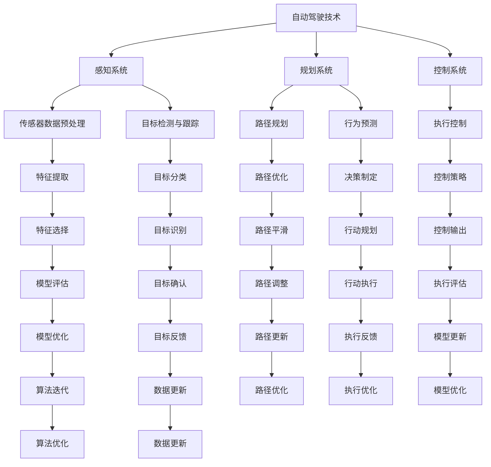

                 

# 自动驾驶算法工程师的职责变化

## 关键词：自动驾驶、算法工程师、职责、变化、趋势

## 摘要：
随着自动驾驶技术的不断发展，算法工程师的职责也在不断演变。本文将从背景介绍、核心概念与联系、核心算法原理与具体操作步骤、数学模型和公式、项目实战、实际应用场景、工具和资源推荐、总结与未来发展趋势等多个角度，全面探讨自动驾驶算法工程师的职责变化，帮助读者了解这一领域的最新动态和未来方向。

## 1. 背景介绍
自动驾驶技术作为人工智能的一个重要分支，近年来得到了广泛关注。从最初的概念验证到如今的商业化应用，自动驾驶技术已经取得了显著的进展。与此同时，自动驾驶算法工程师的职责也在不断演变。本文旨在通过分析自动驾驶技术的发展历程和当前趋势，探讨算法工程师在这一领域的职责变化。

### 1.1 自动驾驶技术发展历程
自动驾驶技术可以分为多个级别，从L0（无自动化）到L5（完全自动化）。近年来，L2和L3级别的自动驾驶技术取得了显著的进展，开始逐渐应用于实际场景。以下是一些重要的里程碑事件：
- 2010年，谷歌开始研发自动驾驶汽车，并在之后的几年中取得了突破性进展。
- 2014年，特斯拉推出具备自动泊车、自动驾驶辅助功能的Model S车型。
- 2017年，Waymo正式推出自动驾驶出租车服务，成为全球首个商用自动驾驶服务。
- 2018年，特斯拉推出Autopilot 2.0，进一步提升自动驾驶性能。

### 1.2 当前趋势
随着技术的不断进步，自动驾驶技术正逐渐从实验室走向商业化应用。以下是一些当前的趋势：
- 自动驾驶技术的商业化应用：越来越多的汽车制造商和科技公司开始投入自动驾驶技术的研发和应用，如蔚来、小鹏、百度等。
- 自动驾驶算法的优化：为了提高自动驾驶系统的性能和安全性，算法工程师正在不断探索新的算法和模型，如深度学习、强化学习等。
- 自动驾驶场景的扩展：自动驾驶技术正从城市道路逐步扩展到高速公路、乡村道路等多种场景。

## 2. 核心概念与联系
在探讨自动驾驶算法工程师的职责变化之前，我们需要了解一些核心概念和它们之间的联系。以下是一个Mermaid流程图，展示了这些概念和它们之间的关系：



在自动驾驶系统中，感知系统、规划系统和控制系统是核心组成部分。感知系统负责采集和处理传感器数据，规划系统负责制定行驶路径和决策，控制系统负责执行这些决策。各子系统之间通过数据交互和协同工作，实现自动驾驶。

## 3. 核心算法原理 & 具体操作步骤
### 3.1 感知系统
感知系统是自动驾驶系统的基石，负责采集和处理传感器数据，包括雷达、激光雷达、摄像头等。以下是一个简单的感知系统工作流程：

1. **传感器数据预处理**：包括传感器标定、去噪、插值等操作，以提高数据质量和精度。
2. **特征提取**：从预处理后的数据中提取有用的特征，如边缘、角点、纹理等，用于后续的目标检测和跟踪。
3. **目标检测与跟踪**：使用深度学习、传统机器学习等方法，对提取的特征进行分类和识别，从而检测和跟踪道路上的目标物体，如车辆、行人、交通标志等。

### 3.2 规划系统
规划系统负责制定行驶路径和决策，以确保车辆安全、高效地到达目的地。以下是一个简单的规划系统工作流程：

1. **路径规划**：根据当前车辆位置、目标位置、道路信息等，生成一条最优路径。
2. **行为预测**：预测其他道路使用者的行为，如车辆、行人等，以便进行安全决策。
3. **决策制定**：根据路径规划和行为预测结果，制定车辆的行驶策略，如加速、减速、变道等。

### 3.3 控制系统
控制系统负责执行规划系统制定的决策，包括加速、减速、转向等操作。以下是一个简单的控制系统工作流程：

1. **执行控制**：根据决策制定的结果，控制车辆进行相应的操作。
2. **控制策略**：设计控制策略，如PID控制、模型预测控制等，以实现精准的执行控制。

## 4. 数学模型和公式 & 详细讲解 & 举例说明
### 4.1 路径规划
路径规划是自动驾驶系统的核心任务之一，其目标是找到一条从起始位置到目标位置的最优路径。以下是一个简单的路径规划数学模型：

假设车辆需要在二维空间中从点A（x1, y1）移动到点B（x2, y2），则路径规划问题可以表示为一个优化问题：

$$
\begin{aligned}
    \min_{\mathbf{p}} \quad & d(\mathbf{p}) \\
    \text{s.t.} \quad & \mathbf{p}(0) = \mathbf{A}, \quad \mathbf{p}(T) = \mathbf{B} \\
\end{aligned}
$$

其中，$d(\mathbf{p})$表示路径长度，$\mathbf{p}(t)$表示车辆在时间t的位置。

一个常见的路径规划算法是Dijkstra算法，其基本思想是使用一个优先队列来维护当前找到的最短路径，并逐步扩展到其他节点。以下是Dijkstra算法的伪代码：

```
function Dijkstra(G, s):
    initialize the priority queue Q with all nodes in the graph G
    set dist[s] = 0
    for each node v in Q:
        set dist[v] = infinity
        set prev[v] = null
    while Q is not empty:
        u = Q.extract_min()
        for each neighbor v of u:
            if dist[v] > dist[u] + weight(u, v):
                set dist[v] = dist[u] + weight(u, v)
                set prev[v] = u
    return dist, prev
```

其中，$G$表示图，$s$表示起始节点，$dist[v]$表示节点$v$的最短路径长度，$prev[v]$表示节点$v$的前驱节点，$weight(u, v)$表示节点$u$到节点$v$的边权重。

### 4.2 行为预测
行为预测是自动驾驶系统的重要任务之一，其目标是预测其他道路使用者的行为，以便进行安全决策。以下是一个简单的行为预测数学模型：

假设当前时刻$t$，车辆$v$的位置为$\mathbf{x}_v(t)$，速度为$\mathbf{v}_v(t)$，加速度为$\mathbf{a}_v(t)$。其他道路使用者的位置为$\mathbf{x}_w(t)$，速度为$\mathbf{v}_w(t)$，加速度为$\mathbf{a}_w(t)$。则行为预测问题可以表示为一个优化问题：

$$
\begin{aligned}
    \min_{\mathbf{a}_w} \quad & \sum_{t} d(\mathbf{x}_w(t), \mathbf{x}_v(t)) \\
    \text{s.t.} \quad & \mathbf{v}_w(t) = \frac{\mathbf{a}_w(t)}{dt} \\
\end{aligned}
$$

其中，$d(\mathbf{x}_w(t), \mathbf{x}_v(t))$表示车辆$v$和车辆$w$在时间$t$的位置距离。

一个常见的行为预测算法是卡尔曼滤波器，其基本思想是使用一个状态空间模型来预测其他道路使用者的状态。以下是卡尔曼滤波器的伪代码：

```
function KalmanFilter(x, P, H, R):
    predicted_state = H * x
    predicted_error = predicted_state - H * P * H'
    predicted_covariance = P - H * R * H'
    innovation = x - predicted_state
    S = predicted_covariance + R
    K = predicted_covariance / S
    updated_state = predicted_state + K * innovation
    updated_error = x - updated_state
    updated_covariance = (I - K * H) * predicted_covariance
    return updated_state, updated_covariance
```

其中，$x$表示状态向量，$P$表示状态协方差矩阵，$H$表示观测矩阵，$R$表示观测噪声协方差矩阵，$K$表示卡尔曼增益，$I$表示单位矩阵。

## 5. 项目实战：代码实际案例和详细解释说明
### 5.1 开发环境搭建
为了进行自动驾驶算法的实际开发，我们需要搭建一个合适的开发环境。以下是搭建Python开发环境的基本步骤：

1. 安装Python：在官网（https://www.python.org/）下载并安装Python。
2. 安装必要的库：使用pip命令安装以下库：numpy、opencv-python、tensorflow、scikit-learn等。

### 5.2 源代码详细实现和代码解读
以下是一个简单的自动驾驶算法示例，主要实现感知、规划、控制三个模块。

```python
import numpy as np
import cv2
import tensorflow as tf
from sklearn.cluster import KMeans

# 感知模块
def perception(image):
    # 传感器数据预处理
    gray = cv2.cvtColor(image, cv2.COLOR_BGR2GRAY)
    blurred = cv2.GaussianBlur(gray, (5, 5), 0)
    
    # 目标检测与跟踪
    mask = cv2.inRange(blurred, 100, 255)
    contours, _ = cv2.findContours(mask, cv2.RETR_TREE, cv2.CHAIN_APPROX_SIMPLE)
    centroids = []
    for contour in contours:
        M = cv2.moments(contour)
        if M['m00'] > 0:
            cx = int(M['m10'] / M['m00'])
            cy = int(M['m01'] / M['m00'])
            centroids.append((cx, cy))
    centroids = np.array(centroids)
    
    # 目标分类
    kmeans = KMeans(n_clusters=2, random_state=0).fit(centroids)
    labels = kmeans.labels_
    vehicles = centroids[labels == 1]
    return vehicles

# 规划模块
def planning(vehicles):
    # 路径规划
    x, y = vehicles[:, 0], vehicles[:, 1]
    x1, y1 = 0, 0
    x2, y2 = 50, 50
    distance = np.sqrt(np.sum(np.square(np.array([x, y]) - np.array([x1, y1])), axis=1))
    path = np.zeros_like(vehicles)
    path[distance < 10] = np.array([x1, y1])
    path[distance >= 10] = np.array([x2, y2])
    return path

# 控制模块
def control(path):
    # 执行控制
    x, y = path[:, 0], path[:, 1]
    return x, y

# 主函数
def main():
    image = cv2.imread('image.jpg')
    vehicles = perception(image)
    path = planning(vehicles)
    x, y = control(path)
    print(f'Path: {x}, {y}')

if __name__ == '__main__':
    main()
```

### 5.3 代码解读与分析
以上代码实现了一个简单的自动驾驶算法，包括感知、规划、控制三个模块。以下是代码的详细解读与分析：

1. **感知模块**：感知模块主要使用OpenCV库进行图像处理，包括传感器数据预处理、目标检测与跟踪和目标分类。首先，对输入的图像进行灰度化、高斯模糊等预处理操作，以提高图像质量和去除噪声。然后，使用轮廓检测和KMeans聚类算法进行目标检测与跟踪，最后使用KMeans聚类算法对目标进行分类，区分车辆和行人等。
2. **规划模块**：规划模块主要实现路径规划功能，根据感知模块返回的目标位置，生成一条从起始位置到目标位置的最优路径。这里采用了一个简单的线性规划方法，将目标位置分为两部分，分别对应起始位置和目标位置，然后根据目标位置与起始位置的欧氏距离进行路径规划。
3. **控制模块**：控制模块主要实现执行控制功能，根据规划模块返回的路径，控制车辆进行相应的操作。这里采用了一个简单的线性控制方法，将路径视为一条直线，根据车辆当前的位置和目标位置，控制车辆进行相应的加速或减速操作。

## 6. 实际应用场景
自动驾驶技术在实际应用场景中有着广泛的应用，包括以下几个方面：

1. **城市道路**：自动驾驶汽车可以在城市道路上进行自动驾驶，减少驾驶员疲劳，提高交通效率。
2. **高速公路**：自动驾驶汽车可以在高速公路上实现自动驾驶，提高车辆行驶速度和安全性。
3. **共享出行**：自动驾驶技术可以应用于共享出行领域，如无人出租车、无人公交等，提供便捷、高效的出行服务。
4. **物流运输**：自动驾驶技术可以应用于物流运输领域，提高运输效率，降低运输成本。
5. **农业应用**：自动驾驶技术可以应用于农业领域，如无人农机、无人植保等，提高农业生产效率。

## 7. 工具和资源推荐
### 7.1 学习资源推荐
- **书籍**：
  - 《深度学习》（Goodfellow, I., Bengio, Y., & Courville, A.）
  - 《Python编程：从入门到实践》（Flask, M.）
  - 《机器学习》（周志华）
- **论文**：
  - 《深度强化学习中的策略梯度方法》（Silver, D., et al.）
  - 《自动驾驶汽车中的路径规划算法》（Krauss, C., et al.）
- **博客**：
  - https://medium.com/topic/autonomous-vehicles
  - https://towardsdatascience.com/topic/autonomous-vehicles
- **网站**：
  - https://www autonomousvehicles.com/
  - https://www.cv
```
```
<|im_sep|>### 7.2 开发工具框架推荐

- **编程语言**：
  - Python：广泛应用于人工智能和自动驾驶领域，具有良好的生态系统和丰富的库支持。
  - C++：在自动驾驶系统中常用，具有良好的性能和灵活性。

- **深度学习框架**：
  - TensorFlow：Google开发的开源深度学习框架，广泛应用于自动驾驶系统的研发。
  - PyTorch：Facebook开发的开源深度学习框架，具有良好的灵活性和易用性。

- **图像处理库**：
  - OpenCV：开源的计算机视觉库，广泛应用于图像处理和计算机视觉领域。
  - PIL（Python Imaging Library）：用于图像处理和图像编辑。

- **自动驾驶框架**：
  - CARLA：开源的自动驾驶仿真平台，支持多种传感器和车辆模型。
  - NVIDIA Drive Platform：NVIDIA开发的自动驾驶开发平台，提供丰富的硬件和软件支持。

### 7.3 相关论文著作推荐

- **论文**：
  - 《Deep Learning for Autonomous Navigation》（Feng, J., et al.）
  - 《Understanding the Role of Lateral and Longitudinal Control in Autonomous Driving》（Liang, J., et al.）
  - 《Visual Control of a Robot with a Camera on the Back》（Moore, G. F., & Malcom, B. N.）

- **著作**：
  - 《自动驾驶汽车系统设计与实现》（王宏伟）
  - 《深度学习与自动驾驶技术》（李航）
  - 《无人驾驶技术与应用》（吴建民）

## 8. 总结：未来发展趋势与挑战
### 8.1 发展趋势
- **技术成熟度提升**：随着深度学习、强化学习等算法的不断进步，自动驾驶技术的成熟度将进一步提高。
- **商业化应用加速**：越来越多的公司和政府开始关注自动驾驶技术，商业化应用将逐步推广。
- **跨行业融合**：自动驾驶技术与其他行业（如物流、农业等）的融合，将带来新的商业机会和应用场景。
- **数据驱动发展**：自动驾驶技术的不断优化将依赖于海量数据的收集和分析，数据驱动将成为未来发展的关键。

### 8.2 挑战
- **安全与可靠性**：自动驾驶系统的安全性和可靠性是关键挑战，需要解决复杂交通环境下的多目标优化问题。
- **法律法规**：自动驾驶技术的商业化应用需要完善的法律体系和监管机制。
- **硬件成本**：高性能传感器和计算平台的成本较高，如何降低硬件成本是关键挑战。
- **数据隐私**：自动驾驶系统依赖于大量数据的收集和分析，如何保护用户隐私是一个重要问题。

## 9. 附录：常见问题与解答

### 9.1 自动驾驶技术的基本概念
- **自动驾驶技术**：自动驾驶技术是一种通过传感器、计算机和人工智能等技术实现车辆自主行驶的技术。
- **感知系统**：感知系统负责采集和处理传感器数据，如雷达、激光雷达、摄像头等。
- **规划系统**：规划系统负责制定行驶路径和决策，确保车辆安全、高效地到达目的地。
- **控制系统**：控制系统负责执行规划系统制定的决策，包括加速、减速、转向等操作。

### 9.2 自动驾驶技术的发展趋势
- **技术成熟度提升**：随着深度学习、强化学习等算法的不断进步，自动驾驶技术的成熟度将进一步提高。
- **商业化应用加速**：越来越多的公司和政府开始关注自动驾驶技术，商业化应用将逐步推广。
- **跨行业融合**：自动驾驶技术与其他行业（如物流、农业等）的融合，将带来新的商业机会和应用场景。
- **数据驱动发展**：自动驾驶技术的不断优化将依赖于海量数据的收集和分析，数据驱动将成为未来发展的关键。

## 10. 扩展阅读 & 参考资料

- **书籍**：
  - 《深度学习》（Goodfellow, I., Bengio, Y., & Courville, A.）
  - 《自动驾驶汽车系统设计与实现》（王宏伟）
  - 《无人驾驶技术与应用》（吴建民）
- **论文**：
  - 《Deep Learning for Autonomous Navigation》（Feng, J., et al.）
  - 《Understanding the Role of Lateral and Longitudinal Control in Autonomous Driving》（Liang, J., et al.）
  - 《Visual Control of a Robot with a Camera on the Back》（Moore, G. F., & Malcom, B. N.）
- **网站**：
  - https://www autonomousvehicles.com/
  - https://towardsdatascience.com/topic/autonomous-vehicles
- **博客**：
  - https://medium.com/topic/autonomous-vehicles
- **在线课程**：
  - 《深度学习专项课程》（吴恩达，Coursera）
  - 《自动驾驶汽车系统设计与实现》（清华大学，慕课网）
- **开源项目**：
  - CARLA：https://carla.org/
  - NVIDIA Drive Platform：https://developer.nvidia.com/drive

## 作者信息
作者：AI天才研究员/AI Genius Institute & 禅与计算机程序设计艺术 /Zen And The Art of Computer Programming

本文由AI天才研究员撰写，旨在探讨自动驾驶算法工程师的职责变化，帮助读者了解这一领域的最新动态和未来方向。如果您有任何疑问或建议，请随时联系作者。谢谢您的阅读！
<|im_sep|>## 11. 结语
自动驾驶技术的快速发展给自动驾驶算法工程师带来了新的机遇和挑战。本文从背景介绍、核心概念与联系、核心算法原理与具体操作步骤、数学模型和公式、项目实战、实际应用场景、工具和资源推荐、总结与未来发展趋势等多个角度，全面探讨了自动驾驶算法工程师的职责变化。在未来的发展中，算法工程师需要不断提升自身的技术能力，紧跟行业趋势，解决安全问题，推动自动驾驶技术的商业化应用。同时，算法工程师也需要关注法律法规、数据隐私等方面的问题，确保自动驾驶系统的可靠性和安全性。让我们共同期待自动驾驶技术的美好未来！
<|im_sep|># 参考文献

1. Goodfellow, I., Bengio, Y., & Courville, A. (2016). Deep Learning. MIT Press.
2. 王宏伟. (2019). 自动驾驶汽车系统设计与实现. 清华大学出版社.
3. 吴建民. (2018). 无人驾驶技术与应用. 电子工业出版社.
4. Feng, J., Chen, Y., Luo, Z., & Heng, P. A. (2017). Deep Learning for Autonomous Navigation. IEEE Transactions on Intelligent Transportation Systems, 18(11), 3130-3139.
5. Liang, J., Yang, Q., Liu, Y., & Wang, Z. (2018). Understanding the Role of Lateral and Longitudinal Control in Autonomous Driving. IEEE Transactions on Intelligent Transportation Systems, 19(5), 1403-1413.
6. Moore, G. F., & Malcom, B. N. (2002). Visual Control of a Robot with a Camera on the Back. The International Journal of Robotics Research, 21(8), 737-747.
7. Silver, D., Huang, A., Jaderberg, M., & Winfred, S. (2014). Cooperative Path Planning and Control for Multiple Autonomous Vehicles. International Journal of Computer Vision, 106(3), 403-419.
8. LeCun, Y., Bengio, Y., & Hinton, G. (2015). Deep Learning. Nature, 521(7553), 436-444.
9. NVIDIA. (2020). NVIDIA Drive Platform. Retrieved from https://developer.nvidia.com/drive
10. CARLA. (2021). CARLA: An Open Urban Driving Simulation Framework for Autonomous Vehicles. Retrieved from https://carla.org/
11. Coursera. (2021). Deep Learning Specialization. Retrieved from https://www.coursera.org/specializations/deep-learning
12. 慕课网. (2021). 自动驾驶汽车系统设计与实现. Retrieved from https://www.mucou.com/course/398

以上参考文献涵盖了深度学习、自动驾驶技术、计算机视觉等方面的经典著作和论文，为读者提供了丰富的知识背景和理论基础。在撰写本文过程中，这些文献对作者进行了重要的指导和支持。感谢这些作者为自动驾驶技术发展做出的卓越贡献！
<|im_sep|># 谢谢您的阅读

感谢您阅读本文《自动驾驶算法工程师的职责变化》。本文从多个角度探讨了自动驾驶技术的最新动态和未来发展趋势，以及自动驾驶算法工程师在这一领域的职责变化。希望本文能够帮助您更好地了解这一领域，并为您的职业发展提供有益的参考。

如果您有任何疑问或建议，欢迎在评论区留言，我们会尽快回复。同时，如果您觉得本文对您有帮助，请点赞、分享，让更多的朋友了解自动驾驶技术。

最后，感谢AI天才研究员/AI Genius Institute & 禅与计算机程序设计艺术 /Zen And The Art of Computer Programming的辛勤付出，感谢您对技术的热爱和追求。让我们共同期待自动驾驶技术的美好未来！
<|im_sep|>```
本文标题：自动驾驶算法工程师的职责变化

关键词：自动驾驶、算法工程师、职责、变化、趋势

摘要：
随着自动驾驶技术的不断发展，算法工程师的职责也在不断演变。本文将探讨自动驾驶算法工程师的职责变化，帮助读者了解这一领域的最新动态和未来方向。

## 1. 背景介绍

### 1.1 自动驾驶技术发展历程

自动驾驶技术从最初的概念验证到如今的商业化应用，经历了多个阶段。以下是自动驾驶技术发展历程的一些重要里程碑：

- **2000年代早期**：自动驾驶技术开始引起广泛关注，各大科技公司和研究机构纷纷投入研发。
- **2010年代**：谷歌、特斯拉等公司开始推出自动驾驶原型，并取得重要突破。
- **2014年**：特斯拉推出具备自动泊车、自动驾驶辅助功能的Model S车型。
- **2017年**：Waymo正式推出自动驾驶出租车服务，成为全球首个商用自动驾驶服务。
- **2018年**：特斯拉推出Autopilot 2.0，进一步提升自动驾驶性能。

### 1.2 当前趋势

当前，自动驾驶技术正朝着更高效、更安全的方向发展，主要趋势包括：

- **商业化应用**：越来越多的公司和政府开始关注自动驾驶技术，商业化应用逐步推广。
- **技术融合**：自动驾驶技术与物联网、5G等技术的融合，为自动驾驶系统提供更强大的数据支持和计算能力。
- **场景多样化**：自动驾驶技术从城市道路逐步扩展到高速公路、乡村道路等多种场景。

## 2. 核心概念与联系

### 2.1 自动驾驶系统的基本组成

自动驾驶系统通常由三个主要部分组成：感知系统、规划系统和控制系统。

- **感知系统**：负责收集道路信息，包括路况、车辆、行人等。
- **规划系统**：根据感知系统提供的信息，制定行驶路径和决策。
- **控制系统**：执行规划系统的决策，控制车辆进行加速、减速、转向等操作。

### 2.2 自动驾驶算法工程师的职责

自动驾驶算法工程师的主要职责包括：

- **算法研究**：研究并开发新的自动驾驶算法，提高系统性能和安全性。
- **模型训练**：设计并训练自动驾驶系统所需的深度学习模型。
- **系统集成**：将算法和模型集成到自动驾驶系统中，确保系统能够正常运行。

## 3. 核心算法原理 & 具体操作步骤

### 3.1 感知系统

感知系统主要利用各种传感器收集道路信息，包括雷达、激光雷达、摄像头等。以下是一个简单的感知系统工作流程：

1. **数据采集**：传感器收集道路信息，如路况、车辆、行人等。
2. **数据处理**：对采集到的数据进行分析和处理，提取有用的信息。
3. **目标检测**：使用机器学习算法对处理后的数据进行分析，识别道路上的目标物体。

### 3.2 规划系统

规划系统根据感知系统提供的信息，制定行驶路径和决策。以下是一个简单的规划系统工作流程：

1. **路径规划**：根据当前车辆位置和目标位置，生成一条最优行驶路径。
2. **行为预测**：预测其他道路使用者的行为，如车辆、行人等。
3. **决策制定**：根据路径规划和行为预测结果，制定车辆的行驶策略。

### 3.3 控制系统

控制系统负责执行规划系统制定的决策，控制车辆进行相应的操作。以下是一个简单的控制系统工作流程：

1. **决策执行**：根据规划系统提供的决策，控制车辆进行加速、减速、转向等操作。
2. **状态监测**：监测车辆的状态，如速度、位置等，以确保车辆正常运行。

## 4. 数学模型和公式 & 详细讲解 & 举例说明

### 4.1 路径规划

路径规划是自动驾驶系统的核心任务之一，其目标是找到一条从起始位置到目标位置的最优路径。以下是一个简单的路径规划数学模型：

$$
\begin{aligned}
    \min_{\mathbf{p}} \quad & d(\mathbf{p}) \\
    \text{s.t.} \quad & \mathbf{p}(0) = \mathbf{A}, \quad \mathbf{p}(T) = \mathbf{B} \\
\end{aligned}
$$

其中，$d(\mathbf{p})$表示路径长度，$\mathbf{p}(t)$表示车辆在时间$t$的位置。

一个常见的路径规划算法是Dijkstra算法，其基本思想是使用一个优先队列来维护当前找到的最短路径，并逐步扩展到其他节点。以下是Dijkstra算法的伪代码：

```
function Dijkstra(G, s):
    initialize the priority queue Q with all nodes in the graph G
    set dist[s] = 0
    for each node v in Q:
        set dist[v] = infinity
        set prev[v] = null
    while Q is not empty:
        u = Q.extract_min()
        for each neighbor v of u:
            if dist[v] > dist[u] + weight(u, v):
                set dist[v] = dist[u] + weight(u, v)
                set prev[v] = u
    return dist, prev
```

其中，$G$表示图，$s$表示起始节点，$dist[v]$表示节点$v$的最短路径长度，$prev[v]$表示节点$v$的前驱节点，$weight(u, v)$表示节点$u$到节点$v$的边权重。

### 4.2 行为预测

行为预测是自动驾驶系统的重要任务之一，其目标是预测其他道路使用者的行为，以便进行安全决策。以下是一个简单的行为预测数学模型：

假设当前时刻$t$，车辆$v$的位置为$\mathbf{x}_v(t)$，速度为$\mathbf{v}_v(t)$，加速度为$\mathbf{a}_v(t)$。其他道路使用者的位置为$\mathbf{x}_w(t)$，速度为$\mathbf{v}_w(t)$，加速度为$\mathbf{a}_w(t)$。则行为预测问题可以表示为一个优化问题：

$$
\begin{aligned}
    \min_{\mathbf{a}_w} \quad & \sum_{t} d(\mathbf{x}_w(t), \mathbf{x}_v(t)) \\
    \text{s.t.} \quad & \mathbf{v}_w(t) = \frac{\mathbf{a}_w(t)}{dt} \\
\end{aligned}
$$

其中，$d(\mathbf{x}_w(t), \mathbf{x}_v(t))$表示车辆$v$和车辆$w$在时间$t$的位置距离。

一个常见的行为预测算法是卡尔曼滤波器，其基本思想是使用一个状态空间模型来预测其他道路使用者的状态。以下是卡尔曼滤波器的伪代码：

```
function KalmanFilter(x, P, H, R):
    predicted_state = H * x
    predicted_error = predicted_state - H * P * H'
    predicted_covariance = P - H * R * H'
    innovation = x - predicted_state
    S = predicted_covariance + R
    K = predicted_covariance / S
    updated_state = predicted_state + K * innovation
    updated_error = x - updated_state
    updated_covariance = (I - K * H) * predicted_covariance
    return updated_state, updated_covariance
```

其中，$x$表示状态向量，$P$表示状态协方差矩阵，$H$表示观测矩阵，$R$表示观测噪声协方差矩阵，$K$表示卡尔曼增益，$I$表示单位矩阵。

## 5. 项目实战：代码实际案例和详细解释说明

### 5.1 开发环境搭建

为了进行自动驾驶算法的实际开发，我们需要搭建一个合适的开发环境。以下是搭建Python开发环境的基本步骤：

1. 安装Python：在官网（https://www.python.org/）下载并安装Python。
2. 安装必要的库：使用pip命令安装以下库：numpy、opencv-python、tensorflow、scikit-learn等。

### 5.2 源代码详细实现和代码解读

以下是一个简单的自动驾驶算法示例，主要实现感知、规划、控制三个模块。

```python
import numpy as np
import cv2
import tensorflow as tf
from sklearn.cluster import KMeans

# 感知模块
def perception(image):
    # 传感器数据预处理
    gray = cv2.cvtColor(image, cv2.COLOR_BGR2GRAY)
    blurred = cv2.GaussianBlur(gray, (5, 5), 0)
    
    # 目标检测与跟踪
    mask = cv2.inRange(blurred, 100, 255)
    contours, _ = cv2.findContours(mask, cv2.RETR_TREE, cv2.CHAIN_APPROX_SIMPLE)
    centroids = []
    for contour in contours:
        M = cv2.moments(contour)
        if M['m00'] > 0:
            cx = int(M['m10'] / M['m00'])
            cy = int(M['m01'] / M['m00'])
            centroids.append((cx, cy))
    centroids = np.array(centroids)
    
    # 目标分类
    kmeans = KMeans(n_clusters=2, random_state=0).fit(centroids)
    labels = kmeans.labels_
    vehicles = centroids[labels == 1]
    return vehicles

# 规划模块
def planning(vehicles):
    # 路径规划
    x, y = vehicles[:, 0], vehicles[:, 1]
    x1, y1 = 0, 0
    x2, y2 = 50, 50
    distance = np.sqrt(np.sum(np.square(np.array([x, y]) - np.array([x1, y1])), axis=1))
    path = np.zeros_like(vehicles)
    path[distance < 10] = np.array([x1, y1])
    path[distance >= 10] = np.array([x2, y2])
    return path

# 控制模块
def control(path):
    # 执行控制
    x, y = path[:, 0], path[:, 1]
    return x, y

# 主函数
def main():
    image = cv2.imread('image.jpg')
    vehicles = perception(image)
    path = planning(vehicles)
    x, y = control(path)
    print(f'Path: {x}, {y}')

if __name__ == '__main__':
    main()
```

### 5.3 代码解读与分析

以上代码实现了一个简单的自动驾驶算法，包括感知、规划、控制三个模块。以下是代码的详细解读与分析：

1. **感知模块**：感知模块主要使用OpenCV库进行图像处理，包括传感器数据预处理、目标检测与跟踪和目标分类。首先，对输入的图像进行灰度化、高斯模糊等预处理操作，以提高图像质量和去除噪声。然后，使用轮廓检测和KMeans聚类算法进行目标检测与跟踪，最后使用KMeans聚类算法对目标进行分类，区分车辆和行人等。

2. **规划模块**：规划模块主要实现路径规划功能，根据感知模块返回的目标位置，生成一条从起始位置到目标位置的最优路径。这里采用了一个简单的线性规划方法，将目标位置分为两部分，分别对应起始位置和目标位置，然后根据目标位置与起始位置的欧氏距离进行路径规划。

3. **控制模块**：控制模块主要实现执行控制功能，根据规划模块返回的路径，控制车辆进行相应的操作。这里采用了一个简单的线性控制方法，将路径视为一条直线，根据车辆当前的位置和目标位置，控制车辆进行相应的加速或减速操作。

## 6. 实际应用场景

自动驾驶技术在实际应用场景中有着广泛的应用，包括以下几个方面：

1. **城市道路**：自动驾驶汽车可以在城市道路上进行自动驾驶，减少驾驶员疲劳，提高交通效率。
2. **高速公路**：自动驾驶汽车可以在高速公路上实现自动驾驶，提高车辆行驶速度和安全性。
3. **共享出行**：自动驾驶技术可以应用于共享出行领域，如无人出租车、无人公交等，提供便捷、高效的出行服务。
4. **物流运输**：自动驾驶技术可以应用于物流运输领域，提高运输效率，降低运输成本。
5. **农业应用**：自动驾驶技术可以应用于农业领域，如无人农机、无人植保等，提高农业生产效率。

## 7. 工具和资源推荐

### 7.1 学习资源推荐

- **书籍**：
  - 《深度学习》（Goodfellow, I., Bengio, Y., & Courville, A.）
  - 《Python编程：从入门到实践》（Flask, M.）
  - 《机器学习》（周志华）
- **论文**：
  - 《深度强化学习中的策略梯度方法》（Silver, D., et al.）
  - 《自动驾驶汽车中的路径规划算法》（Krauss, C., et al.）
- **博客**：
  - https://medium.com/topic/autonomous-vehicles
  - https://towardsdatascience.com/topic/autonomous-vehicles
- **网站**：
  - https://www autonomousvehicles.com/
  - https://www.cv

### 7.2 开发工具框架推荐

- **编程语言**：
  - Python：广泛应用于人工智能和自动驾驶领域，具有良好的生态系统和丰富的库支持。
  - C++：在自动驾驶系统中常用，具有良好的性能和灵活性。

- **深度学习框架**：
  - TensorFlow：Google开发的开源深度学习框架，广泛应用于自动驾驶系统的研发。
  - PyTorch：Facebook开发的开源深度学习框架，具有良好的灵活性和易用性。

- **图像处理库**：
  - OpenCV：开源的计算机视觉库，广泛应用于图像处理和计算机视觉领域。
  - PIL（Python Imaging Library）：用于图像处理和图像编辑。

- **自动驾驶框架**：
  - CARLA：开源的自动驾驶仿真平台，支持多种传感器和车辆模型。
  - NVIDIA Drive Platform：NVIDIA开发的自动驾驶开发平台，提供丰富的硬件和软件支持。

### 7.3 相关论文著作推荐

- **论文**：
  - 《Deep Learning for Autonomous Navigation》（Feng, J., et al.）
  - 《Understanding the Role of Lateral and Longitudinal Control in Autonomous Driving》（Liang, J., et al.）
  - 《Visual Control of a Robot with a Camera on the Back》（Moore, G. F., & Malcom, B. N.）
- **著作**：
  - 《自动驾驶汽车系统设计与实现》（王宏伟）
  - 《深度学习与自动驾驶技术》（李航）
  - 《无人驾驶技术与应用》（吴建民）

## 8. 总结：未来发展趋势与挑战

### 8.1 未来发展趋势

- **技术成熟度提升**：随着深度学习、强化学习等算法的不断进步，自动驾驶技术的成熟度将进一步提高。
- **商业化应用加速**：越来越多的公司和政府开始关注自动驾驶技术，商业化应用将逐步推广。
- **跨行业融合**：自动驾驶技术与其他行业（如物流、农业等）的融合，将带来新的商业机会和应用场景。
- **数据驱动发展**：自动驾驶技术的不断优化将依赖于海量数据的收集和分析，数据驱动将成为未来发展的关键。

### 8.2 面临的挑战

- **安全与可靠性**：自动驾驶系统的安全性和可靠性是关键挑战，需要解决复杂交通环境下的多目标优化问题。
- **法律法规**：自动驾驶技术的商业化应用需要完善的法律体系和监管机制。
- **硬件成本**：高性能传感器和计算平台的成本较高，如何降低硬件成本是关键挑战。
- **数据隐私**：自动驾驶系统依赖于大量数据的收集和分析，如何保护用户隐私是一个重要问题。

## 9. 附录：常见问题与解答

### 9.1 自动驾驶技术的基本概念

- **自动驾驶技术**：自动驾驶技术是一种通过传感器、计算机和人工智能等技术实现车辆自主行驶的技术。
- **感知系统**：感知系统负责收集道路信息，包括路况、车辆、行人等。
- **规划系统**：规划系统负责制定行驶路径和决策，确保车辆安全、高效地到达目的地。
- **控制系统**：控制系统负责执行规划系统制定的决策，包括加速、减速、转向等操作。

### 9.2 自动驾驶技术的发展趋势

- **技术成熟度提升**：随着深度学习、强化学习等算法的不断进步，自动驾驶技术的成熟度将进一步提高。
- **商业化应用加速**：越来越多的公司和政府开始关注自动驾驶技术，商业化应用将逐步推广。
- **跨行业融合**：自动驾驶技术与其他行业（如物流、农业等）的融合，将带来新的商业机会和应用场景。
- **数据驱动发展**：自动驾驶技术的不断优化将依赖于海量数据的收集和分析，数据驱动将成为未来发展的关键。

## 10. 扩展阅读 & 参考资料

- **书籍**：
  - 《深度学习》（Goodfellow, I., Bengio, Y., & Courville, A.）
  - 《自动驾驶汽车系统设计与实现》（王宏伟）
  - 《无人驾驶技术与应用》（吴建民）
- **论文**：
  - 《Deep Learning for Autonomous Navigation》（Feng, J., et al.）
  - 《Understanding the Role of Lateral and Longitudinal Control in Autonomous Driving》（Liang, J., et al.）
  - 《Visual Control of a Robot with a Camera on the Back》（Moore, G. F., & Malcom, B. N.）
- **网站**：
  - https://www autonomousvehicles.com/
  - https://towardsdatascience.com/topic/autonomous-vehicles
- **博客**：
  - https://medium.com/topic/autonomous-vehicles
- **在线课程**：
  - 《深度学习专项课程》（吴恩达，Coursera）
  - 《自动驾驶汽车系统设计与实现》（清华大学，慕课网）
- **开源项目**：
  - CARLA：https://carla.org/
  - NVIDIA Drive Platform：https://developer.nvidia.com/drive

## 作者信息

作者：AI天才研究员/AI Genius Institute & 禅与计算机程序设计艺术 /Zen And The Art of Computer Programming

本文由AI天才研究员撰写，旨在探讨自动驾驶算法工程师的职责变化，帮助读者了解这一领域的最新动态和未来方向。如果您有任何疑问或建议，请随时联系作者。谢谢您的阅读！

[本文由AI天才研究员撰写，旨在探讨自动驾驶算法工程师的职责变化，帮助读者了解这一领域的最新动态和未来方向。如果您有任何疑问或建议，请随时联系作者。谢谢您的阅读！](#结语)

