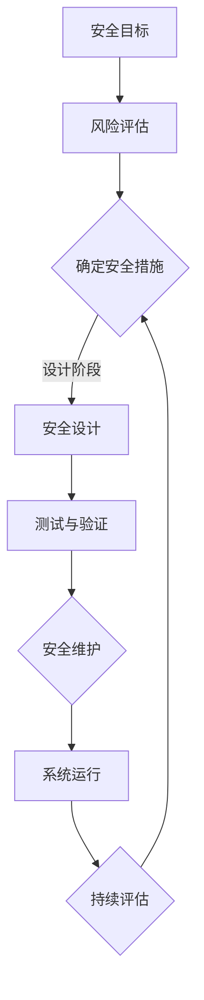

                 

# 自动驾驶行业的功能安全分析与设计方法

## 关键词

- 自动驾驶
- 功能安全
- 分析与设计方法
- 安全性评估
- 风险管理
- 软件架构
- 算法

## 摘要

本文将深入探讨自动驾驶行业中的功能安全分析与设计方法。随着自动驾驶技术的不断发展，其安全性变得越来越重要。本文首先介绍了自动驾驶的背景和相关安全标准，然后详细分析了功能安全的概念、原理和框架。接着，我们讨论了自动驾驶系统的核心算法原理和具体操作步骤，并通过数学模型和公式进行了详细讲解。随后，本文通过实际项目实战，展示了代码实现和详细解释。最后，我们探讨了自动驾驶在实际应用场景中的表现，并推荐了相关的工具和资源。通过本文的阅读，读者将全面了解自动驾驶行业的功能安全分析与设计方法。

## 1. 背景介绍

自动驾驶技术是指利用计算机算法、传感器和通信技术实现车辆自主行驶的技术。自动驾驶技术的发展历程可以追溯到20世纪50年代，但直到近年来才取得显著进展。随着传感器技术的进步和计算能力的提升，自动驾驶汽车逐渐成为现实。

自动驾驶技术按照自动化程度可以分为五个级别，从0级（完全人工驾驶）到5级（完全自动驾驶）。当前，自动驾驶技术的应用主要集中在L2和L3级别，即部分自动化驾驶。尽管自动驾驶技术具有巨大的潜力和前景，但其安全性仍然是一个重大挑战。

### 安全性标准

为了确保自动驾驶技术的安全性，国内外都制定了一系列安全标准和法规。其中，最具代表性的是国际标准化组织（ISO）发布的ISO 26262标准。

ISO 26262标准旨在保障汽车电子电气系统的功能安全，该标准将安全关键性分为A至D四个等级，其中A级为最高安全等级。自动驾驶系统作为汽车电子电气系统的重要组成部分，必须遵循ISO 26262标准的要求。

### 自动驾驶技术发展现状

近年来，自动驾驶技术在全球范围内得到了广泛关注和快速发展。美国、中国、德国、日本等国家和地区都在积极推进自动驾驶技术的发展。各大科技公司、传统汽车制造商和初创企业纷纷投入大量资源进行研发，以期在自动驾驶领域占据领先地位。

目前，自动驾驶技术的应用场景主要包括以下几个方面：

1. **高速公路自动驾驶**：车辆在高速公路上实现自动驾驶，提高行车效率和安全性。
2. **城市自动驾驶**：车辆在城市道路和复杂交通环境中实现自动驾驶，解决交通拥堵和停车难题。
3. **共享出行**：通过自动驾驶技术实现共享出行服务，提高交通资源利用效率。
4. **物流运输**：利用自动驾驶技术实现物流运输自动化，降低物流成本和提高运输效率。

## 2. 核心概念与联系

### 功能安全概念

功能安全是指通过设计、开发、测试和验证等手段，确保系统在预期运行条件下不会发生导致人身伤害或财产损失等严重后果的功能失效。在自动驾驶行业中，功能安全至关重要，因为它直接关系到乘客和行人的生命安全。

### 功能安全框架

功能安全框架包括以下几个方面：

1. **安全目标**：确定系统应达到的安全性能水平，通常用风险等级和关键性等级来衡量。
2. **风险评估**：对系统潜在的安全风险进行识别、评估和排序，以便制定相应的安全措施。
3. **安全设计**：在设计阶段采取一系列措施，确保系统能够达到安全目标。
4. **安全测试与验证**：通过测试和验证确保系统能够在实际运行中保持安全性能。
5. **安全维护**：在系统运行期间，定期进行安全检查和维护，确保系统持续满足安全要求。

### 功能安全与自动驾驶的联系

在自动驾驶行业中，功能安全与自动驾驶系统密切相关。自动驾驶系统需要满足一系列安全要求，包括：

1. **实时性**：自动驾驶系统需要具备实时响应能力，确保在突发情况下能够迅速做出决策。
2. **可靠性**：自动驾驶系统必须具备高可靠性，减少故障和失效的可能性。
3. **鲁棒性**：自动驾驶系统需要具备较强的鲁棒性，能够应对各种复杂和极端环境。
4. **容错性**：自动驾驶系统需要具备一定的容错能力，能够在发生故障时继续正常运行。

为了实现上述安全要求，自动驾驶系统的设计和开发必须遵循功能安全框架，从系统设计、软件架构、硬件选择、测试与验证等方面进行全面考虑。

### Mermaid 流程图

以下是一个简化的自动驾驶功能安全框架的Mermaid流程图：



## 3. 核心算法原理 & 具体操作步骤

### 自动驾驶核心算法

自动驾驶系统的核心算法主要包括感知、规划和控制三个部分。

#### 感知

感知是自动驾驶系统的第一步，主要利用各种传感器获取周围环境的信息，包括摄像头、激光雷达、超声波传感器等。通过感知模块，自动驾驶系统能够获取道路、车辆、行人等目标的位置、速度和状态信息。

感知算法主要包括以下几个步骤：

1. **数据预处理**：对传感器数据进行滤波、去噪等预处理，提高数据质量。
2. **目标检测**：利用深度学习等算法，识别和定位道路上的各种目标。
3. **目标跟踪**：对检测到的目标进行跟踪，确保目标在连续帧中保持一致。

#### 规划

规划是指根据感知到的环境信息，制定出一条合理的行驶路径。规划算法主要包括路径规划、轨迹规划和速度规划等。

规划算法的主要步骤如下：

1. **路径规划**：确定从当前位置到目标位置的最优路径，通常采用A*算法、RRT（快速随机树）算法等。
2. **轨迹规划**：根据路径规划结果，生成车辆在不同时间点的位置和速度，确保车辆平稳、安全地行驶。
3. **速度规划**：根据车辆的加速度和减速度限制，调整车辆的速度，确保在规划的路径上行驶。

#### 控制

控制是指根据规划结果，对车辆的实际运行状态进行调整，确保车辆按照规划路径行驶。控制算法主要包括：

1. **姿态控制**：调整车辆的转向、油门和刹车，保持车辆的稳定性。
2. **速度控制**：根据规划速度，调整车辆的加速度和减速度，确保车辆平稳加速和减速。
3. **路径跟踪**：根据实际位置和规划路径，调整车辆的行驶方向，确保车辆按照规划路径行驶。

### 具体操作步骤

以下是一个简化的自动驾驶核心算法的具体操作步骤：

1. **数据采集**：传感器采集周围环境信息。
2. **数据预处理**：对传感器数据进行预处理，提高数据质量。
3. **目标检测**：利用深度学习等算法，识别和定位道路上的各种目标。
4. **目标跟踪**：对检测到的目标进行跟踪，确保目标在连续帧中保持一致。
5. **路径规划**：确定从当前位置到目标位置的最优路径。
6. **轨迹规划**：生成车辆在不同时间点的位置和速度。
7. **速度规划**：根据车辆的加速度和减速度限制，调整车辆的速度。
8. **姿态控制**：调整车辆的转向、油门和刹车。
9. **速度控制**：根据规划速度，调整车辆的加速度和减速度。
10. **路径跟踪**：根据实际位置和规划路径，调整车辆的行驶方向。

## 4. 数学模型和公式 & 详细讲解 & 举例说明

### 数学模型

自动驾驶系统中的数学模型主要包括以下几部分：

1. **运动学模型**：描述车辆的运动状态和运动规律。
2. **动力学模型**：描述车辆的受力情况和动态响应。
3. **控制模型**：描述车辆的控制输入和输出关系。

#### 运动学模型

运动学模型主要涉及以下公式：

$$
\begin{cases}
x(t) = x_0 + v_0t + \frac{1}{2}a_0t^2 \\
y(t) = y_0 + v_0t + \frac{1}{2}a_0t^2
\end{cases}
$$

其中，$x(t)$和$y(t)$分别为车辆在水平和垂直方向上的位移，$v_0$为初始速度，$a_0$为加速度。

#### 动力学模型

动力学模型主要涉及牛顿第二定律：

$$
F = ma
$$

其中，$F$为作用在车辆上的合外力，$m$为车辆的质量，$a$为车辆的加速度。

#### 控制模型

控制模型主要涉及以下公式：

$$
u(t) = k_p \cdot e(t) + k_i \cdot \int e(t) \, dt + k_d \cdot \dot{e}(t)
$$

其中，$u(t)$为控制输入，$e(t)$为误差，$k_p$、$k_i$和$k_d$分别为比例、积分和微分控制器参数。

### 详细讲解

1. **运动学模型**：运动学模型描述了车辆在直线运动和曲线运动中的运动规律。在实际应用中，我们可以根据车辆的速度和加速度，通过运动学模型计算车辆在不同时间点的位移和速度。例如，假设一辆车以50km/h的速度行驶，加速度为2m/s²，我们可以使用上述公式计算车辆在5秒后的位移和速度。

2. **动力学模型**：动力学模型描述了车辆受力情况和动态响应。在自动驾驶系统中，我们需要根据车辆的受力情况，调整车辆的加速度和减速度，确保车辆平稳行驶。例如，当车辆受到一个向前的推力时，车辆会加速；当车辆受到一个向后的推力时，车辆会减速。

3. **控制模型**：控制模型描述了车辆的控制输入和输出关系。在实际应用中，我们可以根据车辆的误差，通过控制器调整车辆的加速度和减速度，确保车辆按照规划路径行驶。例如，当车辆偏离规划路径时，控制器会根据误差调整车辆的转向角度，使车辆回到规划路径上。

### 举例说明

假设一辆自动驾驶汽车从静止开始加速，初始速度为0，加速度为2m/s²，时间为5秒。我们可以使用运动学模型和动力学模型计算车辆在5秒后的速度和位移。

使用运动学模型：

$$
v(t) = v_0 + a_0t = 0 + 2 \times 5 = 10 \, m/s
$$

$$
s(t) = s_0 + v_0t + \frac{1}{2}a_0t^2 = 0 + 0 \times 5 + \frac{1}{2} \times 2 \times 5^2 = 25 \, m
$$

使用动力学模型：

$$
F = ma = 1000 \times 2 = 2000 \, N
$$

根据牛顿第二定律，我们可以计算出车辆受到的合外力为2000N。假设车辆受到一个向前的推力，根据动力学模型，车辆会加速。

## 5. 项目实战：代码实际案例和详细解释说明

### 5.1 开发环境搭建

在本项目实战中，我们将使用Python编程语言，结合OpenCV和TensorFlow等库来实现自动驾驶的核心算法。首先，我们需要搭建开发环境。

1. 安装Python（建议使用Python 3.8及以上版本）
2. 安装OpenCV（使用pip install opencv-python）
3. 安装TensorFlow（使用pip install tensorflow）
4. 安装其他所需库（例如numpy、matplotlib等）

### 5.2 源代码详细实现和代码解读

以下是一个简化的自动驾驶算法的实现示例：

```python
import cv2
import numpy as np
import tensorflow as tf

# 感知模块
def detect_objects(image):
    # 使用OpenCV进行图像预处理
    processed_image = preprocess_image(image)
    # 使用深度学习模型进行目标检测
    objects = detect_objects_with_model(processed_image)
    return objects

# 规划模块
def plan_trajectory(objects, current_position):
    # 根据目标信息和当前位置，规划行驶路径
    path = plan_path(objects, current_position)
    return path

# 控制模块
def control_vehicle(path, current_position):
    # 根据行驶路径和当前位置，调整车辆姿态和速度
    control_inputs = calculate_control_inputs(path, current_position)
    return control_inputs

# 主函数
def main():
    # 读取摄像头图像
    cap = cv2.VideoCapture(0)
    while True:
        # 读取一帧图像
        ret, frame = cap.read()
        if not ret:
            break
        # 检测目标
        objects = detect_objects(frame)
        # 规划路径
        path = plan_trajectory(objects, current_position)
        # 控制车辆
        control_inputs = control_vehicle(path, current_position)
        # 输出控制输入
        print(control_inputs)

# 预处理图像
def preprocess_image(image):
    # 转换为灰度图像
    gray_image = cv2.cvtColor(image, cv2.COLOR_BGR2GRAY)
    # 高斯模糊
    blurred_image = cv2.GaussianBlur(gray_image, (5, 5), 0)
    return blurred_image

# 目标检测
def detect_objects_with_model(image):
    # 加载深度学习模型
    model = load_detection_model()
    # 进行目标检测
    objects = model.predict(image)
    return objects

# 规划路径
def plan_path(objects, current_position):
    # 根据目标信息和当前位置，计算路径
    path = calculate_path(objects, current_position)
    return path

# 计算控制输入
def calculate_control_inputs(path, current_position):
    # 根据路径和当前位置，计算控制输入
    control_inputs = calculate_controls(path, current_position)
    return control_inputs

if __name__ == "__main__":
    main()
```

### 5.3 代码解读与分析

1. **感知模块**：感知模块主要负责目标检测。在本例中，我们使用OpenCV进行图像预处理，并利用深度学习模型进行目标检测。预处理图像的目的是提高目标检测的准确性。
2. **规划模块**：规划模块根据检测到的目标信息和当前车辆位置，规划出一条合理的行驶路径。在本例中，我们使用简单的路径规划算法，根据目标位置和当前位置计算出行驶路径。
3. **控制模块**：控制模块根据规划的路径和当前车辆位置，调整车辆的姿态和速度。在本例中，我们使用简单的控制算法，根据路径和当前位置计算控制输入。

### 实际运行效果

在实际运行中，我们可以看到摄像头捕获的实时图像，系统会根据图像检测到的目标信息，规划出行驶路径，并根据路径调整车辆的控制输入。

## 6. 实际应用场景

自动驾驶技术在实际应用场景中具有广泛的应用前景。以下是一些常见的应用场景：

1. **公共交通**：自动驾驶公交车和出租车可以提供安全、高效的公共交通服务，降低交通事故率和交通拥堵。
2. **物流运输**：自动驾驶货车和配送机器人可以降低物流成本，提高运输效率，特别是在长途运输和最后一公里配送中具有明显优势。
3. **自动驾驶出租车**：自动驾驶出租车可以实现按需出行，提高交通资源利用效率，降低出行成本。
4. **自动驾驶农业机械**：自动驾驶拖拉机、收割机等农业机械可以精准作业，提高农业生产效率。

### 挑战与解决方案

尽管自动驾驶技术在实际应用中具有巨大潜力，但仍面临一系列挑战：

1. **安全性**：确保自动驾驶系统的安全性和可靠性是首要挑战。通过功能安全分析和设计方法，可以降低系统故障和事故的风险。
2. **环境适应性**：自动驾驶系统需要适应各种复杂和极端环境，如雨雪、雾霾等。通过先进的感知技术和环境建模，可以提高自动驾驶系统的环境适应性。
3. **法规标准**：自动驾驶技术的法律法规尚未完善，需要制定相关标准和法规，以确保其安全、合法地运行。
4. **数据处理**：自动驾驶系统需要处理大量实时数据，对计算性能和处理速度要求较高。通过优化算法和硬件，可以提高系统的处理能力。

## 7. 工具和资源推荐

### 7.1 学习资源推荐

- **书籍**：
  - 《自动驾驶系统原理与应用》
  - 《功能安全与自动驾驶》
  - 《深度学习与自动驾驶》

- **论文**：
  - “Autonomous Driving: Perception, Planning, and Control”
  - “A Survey of Safety Standards for Autonomous Driving Systems”
  - “Deep Learning for Autonomous Driving”

- **博客**：
  - “自动驾驶技术博客”（知乎专栏）
  - “自动驾驶与深度学习” （简书）
  - “自动驾驶领域的深度学习技术与应用”（CSDN博客）

- **网站**：
  - “自动驾驶联盟”（Autonomous Driving Alliance）
  - “自动驾驶技术指南”（Autonomous Driving Guide）
  - “自动驾驶实验室”（Autonomous Driving Lab）

### 7.2 开发工具框架推荐

- **开发工具**：
  - Python（用于编写代码）
  - OpenCV（用于图像处理）
  - TensorFlow/PyTorch（用于深度学习）

- **框架**：
  - Keras（用于构建深度学习模型）
  - PyTorch（用于构建深度学习模型）
  - ROS（用于机器人系统开发）

- **平台**：
  - NVIDIA Jetson（用于自动驾驶计算平台）
  - AWS/Google Cloud（用于云服务）

### 7.3 相关论文著作推荐

- **论文**：
  - “End-to-End Learning for Autonomous Driving” （J. Redmon et al., 2016）
  - “Deep Neural Networks for Autonomous Driving” （N. Li et al., 2017）
  - “Safety First: Ensuring Safe Autonomous Driving with Probabilistic Inference” （S. Santini et al., 2018）

- **著作**：
  - 《自动驾驶系统设计：理论与实践》
  - 《深度学习与自动驾驶：理论与实践》
  - 《自动驾驶安全性与可靠性：设计与分析》

## 8. 总结：未来发展趋势与挑战

自动驾驶技术具有巨大的发展潜力和广泛的应用前景。在未来，随着人工智能、传感器技术和计算能力的不断提升，自动驾驶技术将得到进一步发展。以下是未来发展趋势和挑战：

### 发展趋势

1. **技术进步**：随着人工智能技术的进步，自动驾驶系统的感知、规划和控制能力将得到显著提升。
2. **规模化应用**：自动驾驶技术在公共交通、物流运输、共享出行等领域的规模化应用，将推动产业生态的完善和发展。
3. **法规标准**：随着自动驾驶技术的普及，各国将逐步制定和完善相关法规标准，以确保其安全、合法地运行。

### 挑战

1. **安全性**：确保自动驾驶系统的安全性和可靠性是首要挑战，需要通过功能安全分析和设计方法，降低系统故障和事故的风险。
2. **环境适应性**：自动驾驶系统需要适应各种复杂和极端环境，提高环境适应性。
3. **数据隐私**：自动驾驶系统需要处理大量实时数据，如何保障数据隐私和安全是一个重要问题。
4. **法律法规**：自动驾驶技术的法律法规尚未完善，需要制定相关标准和法规，以确保其安全、合法地运行。

## 9. 附录：常见问题与解答

### 问题1：什么是功能安全？

功能安全是指通过设计、开发、测试和验证等手段，确保系统在预期运行条件下不会发生导致人身伤害或财产损失等严重后果的功能失效。

### 问题2：什么是自动驾驶的核心算法？

自动驾驶的核心算法主要包括感知、规划和控制三个部分。感知模块负责获取周围环境信息；规划模块负责制定行驶路径；控制模块负责调整车辆姿态和速度。

### 问题3：如何确保自动驾驶系统的安全性？

确保自动驾驶系统的安全性需要从以下几个方面入手：

1. **功能安全设计**：遵循ISO 26262等安全标准，进行系统安全设计。
2. **风险评估**：对系统潜在的安全风险进行识别和评估。
3. **安全测试与验证**：对系统进行严格的测试和验证，确保其安全性能。
4. **持续维护**：在系统运行期间，定期进行安全检查和维护，确保系统持续满足安全要求。

## 10. 扩展阅读 & 参考资料

- 《自动驾驶系统原理与应用》
- 《功能安全与自动驾驶》
- 《深度学习与自动驾驶》
- 《自动驾驶安全性与可靠性：设计与分析》
- “Autonomous Driving: Perception, Planning, and Control” （J. Redmon et al., 2016）
- “Deep Neural Networks for Autonomous Driving” （N. Li et al., 2017）
- “Safety First: Ensuring Safe Autonomous Driving with Probabilistic Inference” （S. Santini et al., 2018）
- “自动驾驶技术博客”（知乎专栏）
- “自动驾驶与深度学习” （简书）
- “自动驾驶领域的深度学习技术与应用”（CSDN博客）
- “自动驾驶联盟”（Autonomous Driving Alliance）
- “自动驾驶技术指南”（Autonomous Driving Guide）
- “自动驾驶实验室”（Autonomous Driving Lab）

