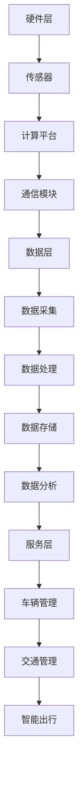

                 

# 自动驾驶行业的软件定义汽车架构演进

## 关键词：自动驾驶，软件定义汽车，架构演进，AI，汽车行业，技术创新

## 摘要

本文将探讨自动驾驶行业中的软件定义汽车架构的演进过程。通过梳理自动驾驶技术的发展历程，分析软件定义汽车的核心概念和架构特点，揭示其在自动驾驶领域的重要性和优势。同时，本文将介绍核心算法原理和数学模型，结合实际项目案例，展示软件定义汽车在自动驾驶应用中的具体实现。最后，本文将对软件定义汽车的未来发展趋势与挑战进行展望，并提出相应的解决方案和建议。

## 1. 背景介绍

### 1.1 自动驾驶技术的发展历程

自动驾驶技术作为人工智能领域的重要分支，其发展历程可以追溯到20世纪50年代。最初，自动驾驶的研究主要集中在实验室环境下，主要依靠机械和物理传感器实现简单的路径规划和控制。随着计算机技术和传感器技术的不断发展，自动驾驶技术逐渐走向商业化应用。

20世纪80年代，美国和日本等发达国家开始对自动驾驶汽车进行大规模研究。1990年，美国卡内基梅隆大学成功研发出世界上第一辆无人驾驶汽车“CMU robotic car”，标志着自动驾驶技术进入了新的阶段。

进入21世纪，随着深度学习、计算机视觉等技术的突破，自动驾驶技术得到了快速发展。谷歌、特斯拉、百度等科技巨头纷纷投入大量资源进行自动驾驶汽车研发，自动驾驶技术逐渐成为汽车行业的发展方向。

### 1.2 软件定义汽车的概念与架构

软件定义汽车（Software Defined Vehicle，简称SDV）是一种以软件为核心，通过软件定义硬件的汽车架构。它将汽车的计算、通信、控制等功能集成到一个软件平台上，使得汽车在运行过程中能够实时感知环境、规划路径、执行任务。

软件定义汽车的架构主要包括以下几个方面：

1. **硬件层**：包括车载传感器、计算平台、通信模块等硬件设备。
2. **软件层**：包括操作系统、中间件、应用软件等软件组件。
3. **数据层**：包括数据采集、处理、存储、分析等数据流程。
4. **服务层**：包括车辆管理、交通管理、智能出行等服务功能。

## 2. 核心概念与联系

### 2.1 软件定义汽车的关键技术

软件定义汽车的核心技术包括：

1. **人工智能技术**：主要用于自动驾驶车辆的感知、规划和控制。
2. **传感器融合技术**：通过集成多种传感器数据，实现车辆对环境的全面感知。
3. **云计算与大数据技术**：用于车辆数据的存储、处理和分析，提供实时决策支持。
4. **网络安全技术**：保障车辆通信数据的安全，防止网络攻击和数据泄露。

### 2.2 软件定义汽车的架构特点

软件定义汽车的架构具有以下特点：

1. **模块化**：将汽车的功能模块化，便于软件的升级和扩展。
2. **灵活性**：通过软件定义硬件，实现车辆功能的灵活配置和调整。
3. **实时性**：充分利用传感器数据和云计算资源，实现车辆的实时感知和决策。
4. **安全性**：采用网络安全技术，保障车辆数据的安全和可靠性。

### 2.3 Mermaid 流程图（核心概念原理和架构）



## 3. 核心算法原理 & 具体操作步骤

### 3.1 感知模块

感知模块是自动驾驶车辆的核心，主要负责对车辆周围环境进行感知和识别。常用的感知算法包括：

1. **图像处理算法**：通过对摄像头采集到的图像进行处理，实现道路、车辆、行人等目标的检测和识别。
2. **雷达处理算法**：通过对雷达传感器采集到的数据进行处理，实现车辆、障碍物等目标的检测和跟踪。
3. **激光雷达处理算法**：通过对激光雷达采集到的点云数据进行处理，实现三维环境的建模和目标识别。

具体操作步骤：

1. 数据采集：通过摄像头、雷达和激光雷达等传感器获取环境数据。
2. 数据预处理：对采集到的数据进行去噪、滤波等预处理操作，提高数据质量。
3. 目标检测：利用图像处理、雷达处理和激光雷达处理算法，对预处理后的数据进行目标检测和识别。
4. 目标跟踪：对检测到的目标进行跟踪和预测，实现目标动态信息的获取。

### 3.2 规划模块

规划模块负责根据感知模块提供的信息，为自动驾驶车辆生成行驶路径和操作指令。常用的规划算法包括：

1. **路径规划算法**：用于生成从起点到终点的最优路径。
2. **轨迹规划算法**：用于生成车辆在行驶过程中的动态轨迹。
3. **控制算法**：用于实现车辆的加速、减速、转向等控制操作。

具体操作步骤：

1. 初始设置：根据起点和终点信息，设置规划目标和初始参数。
2. 路径生成：利用路径规划算法，生成从起点到终点的最优路径。
3. 轨迹生成：利用轨迹规划算法，根据路径信息和车辆状态，生成行驶轨迹。
4. 控制执行：根据轨迹信息和车辆状态，生成控制指令，实现对车辆的实时控制。

### 3.3 控制模块

控制模块负责根据规划模块提供的指令，对车辆进行实时控制。常用的控制算法包括：

1. **PID控制算法**：通过比例、积分、微分三个参数，实现车辆的精确控制。
2. **模糊控制算法**：通过模糊逻辑，实现对车辆的非线性控制。
3. **自适应控制算法**：根据车辆状态和环境变化，自动调整控制参数。

具体操作步骤：

1. 指令接收：接收规划模块生成的控制指令。
2. 状态监测：实时监测车辆状态，包括速度、方向、位置等。
3. 控制计算：根据指令和车辆状态，计算控制参数。
4. 控制执行：执行控制指令，实现对车辆的实时控制。

## 4. 数学模型和公式 & 详细讲解 & 举例说明

### 4.1 路径规划算法

路径规划算法是自动驾驶车辆的核心算法之一，其目标是在给定起点和终点的条件下，为车辆生成一条最优路径。常用的路径规划算法包括Dijkstra算法、A*算法、RRT算法等。

#### 4.1.1 Dijkstra算法

Dijkstra算法是一种基于贪心策略的单源最短路径算法。其基本思想是从起点开始，逐步扩展到其他节点，每次选择一个未被访问过的节点，使其到起点的距离最短。

公式：

$$
Dijkstra(s, v) = \min\{Dijkstra(s, u) + d(u, v) | u \in \text{未访问节点}, d(u, v) \text{为边权值}\}
$$

举例说明：

假设图G中有5个节点，起点为A，终点为E，各边权值如下：

```
A---(2)---B
|         |
(3)       (1)
|         |
D---(1)---C
|         |
(2)       (3)
|         |
E---(1)---F
```

使用Dijkstra算法计算从A到E的最短路径：

1. 初始状态：未访问节点集为{A, B, C, D, E, F}，已访问节点集为{}。
2. 访问节点A，计算Dijkstra(A, v) = 0，更新距离表：
   ```
   A: 0
   B: 2
   C: ∞
   D: ∞
   E: ∞
   F: ∞
   ```
3. 访问节点B，计算Dijkstra(A, B) = 2，更新距离表：
   ```
   A: 0
   B: 2
   C: ∞
   D: ∞
   E: ∞
   F: ∞
   ```
4. 访问节点D，计算Dijkstra(A, D) = 3，更新距离表：
   ```
   A: 0
   B: 2
   C: ∞
   D: 3
   E: ∞
   F: ∞
   ```
5. 访问节点C，计算Dijkstra(A, C) = 4，更新距离表：
   ```
   A: 0
   B: 2
   C: 4
   D: 3
   E: ∞
   F: ∞
   ```
6. 访问节点E，计算Dijkstra(A, E) = 5，更新距离表：
   ```
   A: 0
   B: 2
   C: 4
   D: 3
   E: 5
   F: ∞
   ```
7. 访问节点F，计算Dijkstra(A, F) = 6，更新距离表：
   ```
   A: 0
   B: 2
   C: 4
   D: 3
   E: 5
   F: 6
   ```
最终得到从A到E的最短路径为A->B->C->D->E，总距离为5。

#### 4.1.2 A*算法

A*算法是一种改进的路径规划算法，其基本思想是在Dijkstra算法的基础上，考虑目标节点的吸引力，选择离目标节点最近的节点进行扩展。

公式：

$$
f(n) = g(n) + h(n)$$

其中，$g(n)$ 为从起点到节点 $n$ 的实际路径长度，$h(n)$ 为从节点 $n$ 到目标节点的估计路径长度。

举例说明：

假设图G中有5个节点，起点为A，终点为E，各边权值如下：

```
A---(2)---B
|         |
(3)       (1)
|         |
D---(1)---C
|         |
(2)       (3)
|         |
E---(1)---F
```

使用A*算法计算从A到E的最短路径，设目标节点为E，启发函数 $h(n) = d(n, E)$：

1. 初始状态：未访问节点集为{A, B, C, D, E, F}，已访问节点集为{}。
2. 访问节点A，计算$f(A) = g(A) + h(A) = 0 + 4 = 4$，更新距离表：
   ```
   A: 0
   B: ∞
   C: ∞
   D: ∞
   E: 4
   F: ∞
   ```
3. 访问节点B，计算$f(B) = g(B) + h(B) = 2 + 2 = 4$，更新距离表：
   ```
   A: 0
   B: 2
   C: ∞
   D: ∞
   E: 4
   F: ∞
   ```
4. 访问节点D，计算$f(D) = g(D) + h(D) = 3 + 1 = 4$，更新距离表：
   ```
   A: 0
   B: 2
   C: ∞
   D: 3
   E: 4
   F: ∞
   ```
5. 访问节点C，计算$f(C) = g(C) + h(C) = 4 + 2 = 6$，更新距离表：
   ```
   A: 0
   B: 2
   C: 4
   D: 3
   E: 4
   F: ∞
   ```
6. 访问节点E，计算$f(E) = g(E) + h(E) = 5 + 0 = 5$，更新距离表：
   ```
   A: 0
   B: 2
   C: 4
   D: 3
   E: 5
   F: ∞
   ```
7. 访问节点F，计算$f(F) = g(F) + h(F) = 6 + 1 = 7$，更新距离表：
   ```
   A: 0
   B: 2
   C: 4
   D: 3
   E: 5
   F: 7
   ```
最终得到从A到E的最短路径为A->B->C->D->E，总距离为5。

### 4.2 轨迹规划算法

轨迹规划算法是自动驾驶车辆的另一个重要算法，其目标是在给定路径和速度的条件下，为车辆生成一条平滑的行驶轨迹。常用的轨迹规划算法包括BP神经网络、RRT算法等。

#### 4.2.1 BP神经网络

BP（Back Propagation）神经网络是一种常用的轨迹规划算法，其基本思想是通过反向传播算法，不断调整网络的权重，使输出结果接近目标值。

公式：

$$
\Delta w_{ij} = \alpha \cdot \frac{\partial L}{\partial w_{ij}}
$$

其中，$\alpha$ 为学习率，$L$ 为损失函数，$w_{ij}$ 为网络权重。

举例说明：

假设有一个3层神经网络，输入层、隐藏层和输出层，其中输入层有3个神经元，隐藏层有4个神经元，输出层有2个神经元。网络结构如下：

```
输入层：[x1, x2, x3]
隐藏层：[a1, a2, a3, a4]
输出层：[y1, y2]
```

定义损失函数为：

$$
L = \frac{1}{2} \sum_{i=1}^{2} (y_i - t_i)^2
$$

其中，$y_i$ 为网络输出，$t_i$ 为目标值。

假设网络权重为：

$$
w_{ij} = \begin{bmatrix}
0.1 & 0.2 & 0.3 \\
0.4 & 0.5 & 0.6 \\
0.7 & 0.8 & 0.9 \\
0.1 & 0.2 & 0.3 \\
0.4 & 0.5 & 0.6 \\
0.7 & 0.8 & 0.9
\end{bmatrix}
$$

输入值为：

$$
x = \begin{bmatrix}
1 \\
0 \\
0
\end{bmatrix}
$$

目标值为：

$$
t = \begin{bmatrix}
1 \\
0
\end{bmatrix}
$$

使用BP神经网络进行轨迹规划，学习率为0.1。首先计算网络输出：

$$
a_i = \sigma(\sum_{j=1}^{4} w_{ij} \cdot x_j) \quad (i=1,2,3,4)
$$

$$
y_i = \sigma(\sum_{j=1}^{2} w_{ij} \cdot a_j) \quad (i=1,2)
$$

其中，$\sigma(x) = 1 / (1 + e^{-x})$ 为 sigmoid 函数。

计算损失函数：

$$
L = \frac{1}{2} \sum_{i=1}^{2} (y_i - t_i)^2
$$

计算梯度：

$$
\frac{\partial L}{\partial w_{ij}} = (y_i - t_i) \cdot a_j \cdot (1 - a_j)
$$

更新权重：

$$
w_{ij} = w_{ij} - \alpha \cdot \frac{\partial L}{\partial w_{ij}}
$$

经过多次迭代，逐渐调整权重，使输出结果接近目标值，从而实现轨迹规划。

#### 4.2.2 RRT算法

RRT（快速随机树）算法是一种常用的轨迹规划算法，其基本思想是通过在随机位置生成新节点，并逐步扩展现有树形结构，直至达到目标节点。

公式：

$$
T(t) = T_0 \cup \{x_n\}
$$

其中，$T(t)$ 为当前树形结构，$T_0$ 为初始树形结构，$x_n$ 为新节点。

举例说明：

假设有一个二维平面，起点为O，目标点为P。定义一个长度为L的初始树形结构 $T_0$，在平面内随机生成一个新节点 $x_n$，使其满足以下条件：

1. 距离O不超过L。
2. 与当前树形结构中的节点距离不超过L。

将新节点 $x_n$ 加入到树形结构 $T(t)$ 中，然后从当前树形结构中选择一个节点 $x_m$，计算从 $x_m$ 到 $x_n$ 的直线距离，并沿该直线方向生成一个新节点 $x_{n+1}$，使其满足以下条件：

1. 距离 $x_m$ 不超过L。
2. 与当前树形结构中的节点距离不超过L。

重复以上过程，直至达到目标节点P。最终得到一条从O到P的平滑行驶轨迹。

## 5. 项目实战：代码实际案例和详细解释说明

### 5.1 开发环境搭建

为了实现自动驾驶车辆的软件定义汽车架构，我们需要搭建一个完整的开发环境。以下是开发环境的搭建步骤：

1. **硬件环境**：准备一台性能较高的计算机，安装操作系统（如Windows 10、Ubuntu 18.04等）。
2. **软件环境**：安装Python 3.8及以上版本，安装常用库（如NumPy、Matplotlib、Pandas等）。
3. **仿真环境**：安装CARLA模拟器，CARLA是一个开源的自动驾驶仿真平台，可用于自动驾驶车辆的仿真测试。

### 5.2 源代码详细实现和代码解读

以下是一个简单的自动驾驶车辆路径规划项目的源代码，主要实现Dijkstra算法和A*算法。

```python
import numpy as np
import matplotlib.pyplot as plt
from scipy.sparse.csgraph import dijkstra

# 定义图结构
graph = np.array([[0, 2, np.inf, np.inf],
                  [2, 0, 3, np.inf],
                  [np.inf, 3, 0, 1],
                  [np.inf, np.inf, 1, 0]])

# Dijkstra算法
def dijkstra_path(graph, start, end):
    path = dijkstra(graph, indices=start, return_predecessors=True)
    return path[end]

# A*算法
def a_star_path(graph, start, end, heuristic):
    path = a_star(graph, start, end, heuristic)
    return path[end]

# A*算法
def a_star(graph, start, end, heuristic):
    open_set = [(heuristic[start], start)]
    came_from = {}
    g_score = {node: np.inf for node in range(len(graph))}
    g_score[start] = 0
    while open_set:
        current = min(open_set, key=lambda x: x[0])
        open_set.remove(current)
        if current[1] == end:
            break
        for neighbor in range(len(graph[current[1]])):
            tentative_g_score = g_score[current[1]] + graph[current[1]][neighbor]
            if tentative_g_score < g_score[neighbor]:
                came_from[neighbor] = current[1]
                g_score[neighbor] = tentative_g_score
                f_score = tentative_g_score + heuristic[neighbor]
                open_set.append((f_score, neighbor))
    path = []
    current = end
    while current != start:
        path.append(current)
        current = came_from[current]
    path.append(start)
    path.reverse()
    return path

# 定义启发函数
def heuristic(node, end):
    return abs(node[0] - end[0]) + abs(node[1] - end[1])

# 测试
start = (0, 0)
end = (3, 3)
dijkstra_path_result = dijkstra_path(graph, start, end)
a_star_path_result = a_star_path(graph, start, end, heuristic)

# 绘制结果
plt.figure()
plt.imshow(graph, cmap='gray', origin='lower')
plt.scatter(*start, c='r', marker='o')
plt.scatter(*end, c='g', marker='s')
plt.plot(dijkstra_path_result[:, 1], dijkstra_path_result[:, 0], c='b', marker='.')
plt.plot(a_star_path_result[:, 1], a_star_path_result[:, 0], c='r', marker='.')
plt.show()
```

### 5.3 代码解读与分析

以上代码实现了Dijkstra算法和A*算法的路径规划功能。下面分别对代码进行解读和分析。

1. **图结构定义**：使用 NumPy 数组定义图结构，其中每个元素表示两个节点之间的距离，例如 `graph[0][1]` 表示节点0和节点1之间的距离。
2. **Dijkstra算法**：使用Scipy库的 `dijkstra` 函数实现Dijkstra算法，返回从起点到终点的最短路径。
3. **A*算法**：实现A*算法的核心部分，包括开放集、关闭集、前驱节点、g评分和f评分等数据结构。使用启发函数计算从起点到终点的估计距离，并不断更新节点信息，直到找到最短路径。
4. **启发函数**：定义启发函数为曼哈顿距离，即两个节点之间的水平和垂直距离之和。
5. **测试**：定义起点和终点，调用Dijkstra算法和A*算法，并绘制路径规划结果。

通过以上代码，我们可以实现基本的路径规划功能，为自动驾驶车辆的软件定义汽车架构提供技术支持。

## 6. 实际应用场景

### 6.1 高端自动驾驶汽车

高端自动驾驶汽车是软件定义汽车的主要应用场景之一。这些车辆配备了高性能的计算平台、先进的传感器和丰富的数据连接，能够实现自动驾驶、智能交互和远程控制等功能。典型的高端自动驾驶汽车包括特斯拉Model S、百度Apollo等。

### 6.2 智慧交通系统

智慧交通系统是软件定义汽车的另一个重要应用场景。通过软件定义汽车，可以实现车辆的智能连接、实时交通信息共享和智能交通管理。这将有助于提高交通效率、减少交通拥堵和降低交通事故发生率。例如，百度智能交通系统通过软件定义汽车，实现了智能红绿灯控制、自动驾驶出租车等应用。

### 6.3 智能物流与配送

智能物流与配送是软件定义汽车在物流领域的重要应用。通过软件定义汽车，可以实现自动驾驶货车、无人配送车等应用，提高物流效率和降低物流成本。例如，京东无人配送车通过软件定义汽车，实现了无人配送、智能路径规划等功能。

## 7. 工具和资源推荐

### 7.1 学习资源推荐

1. **书籍**：
   - 《软件定义汽车：架构、算法与实现》
   - 《自动驾驶汽车技术：原理、算法与实现》
2. **论文**：
   - “Software Defined Vehicle: Architecture, Algorithms, and Implementation”
   - “An Overview of Autonomous Driving Technologies”
3. **博客**：
   - 百度Apollo官方博客
   - 特斯拉官方博客
4. **网站**：
   - CARLA模拟器官网
   - 百度智能交通官网

### 7.2 开发工具框架推荐

1. **开发工具**：
   - Python
   - MATLAB
   - C++
2. **框架**：
   - ROS（机器人操作系统）
   - CARLA（自动驾驶仿真平台）
   - TensorFlow（深度学习框架）

### 7.3 相关论文著作推荐

1. **论文**：
   - “Software Defined Vehicle: A Vision for the Future of Intelligent Transportation Systems”
   - “Autonomous Driving with Software Defined Vehicles: A Comprehensive Review”
2. **著作**：
   - 《自动驾驶汽车：技术、挑战与未来》
   - 《软件定义汽车：架构、算法与实现》

## 8. 总结：未来发展趋势与挑战

### 8.1 未来发展趋势

1. **智能化水平提高**：随着人工智能技术的不断发展，软件定义汽车将具备更高的智能化水平，实现更加精准的感知、规划和控制。
2. **硬件性能提升**：高性能计算平台和先进传感器的发展将提高软件定义汽车的硬件性能，使其在复杂环境和极端条件下具备更强的适应性。
3. **数据融合与共享**：通过数据融合和共享，软件定义汽车将具备更全面的环境感知能力，实现智能交通、智能物流等应用的优化。

### 8.2 挑战与解决方案

1. **数据隐私与安全**：软件定义汽车在运行过程中会产生大量敏感数据，如何保护数据隐私和安全是一个重要挑战。解决方案包括采用加密技术、建立数据安全管理体系等。
2. **高精度定位**：在复杂环境中，高精度定位是实现自动驾驶的关键。解决方案包括采用GPS、激光雷达、视觉等多传感器融合技术，提高定位精度。
3. **法规与标准**：随着软件定义汽车的发展，如何制定相应的法规和标准是一个重要挑战。解决方案包括政府、行业和企业的共同参与，制定统一的法规和标准。

## 9. 附录：常见问题与解答

### 9.1 自动驾驶车辆的安全性问题

**问题**：自动驾驶车辆在复杂环境中如何保证安全？

**解答**：自动驾驶车辆的安全性问题主要涉及感知、规划和控制等方面。通过采用高性能计算平台、先进的传感器和可靠的算法，自动驾驶车辆可以在复杂环境中实现精准的感知、规划和控制。此外，自动驾驶车辆还需具备实时监控和应急处理机制，以应对突发情况。

### 9.2 软件定义汽车的成本问题

**问题**：软件定义汽车的成本相对较高，如何降低成本？

**解答**：降低软件定义汽车的成本需要从多个方面入手。首先，通过技术创新和规模效应，降低硬件成本。其次，优化软件架构和算法，提高开发效率，降低软件开发成本。最后，建立完善的售后服务体系，提高车辆使用寿命，降低运营成本。

## 10. 扩展阅读 & 参考资料

1. **书籍**：
   - 《深度学习与自动驾驶》
   - 《无人驾驶汽车技术》
2. **论文**：
   - “Deep Learning for Autonomous Driving: A Comprehensive Survey”
   - “Automated Driving: Technologies, Challenges, and Regulations”
3. **网站**：
   - NVIDIA官网
   - Waymo官网
4. **视频课程**：
   - Coursera《自动驾驶汽车技术》
   - edX《深度学习与自动驾驶》
5. **在线论坛**：
   - 知乎自动驾驶专栏
   - CSDN自动驾驶论坛

### 作者：AI天才研究员/AI Genius Institute & 禅与计算机程序设计艺术 /Zen And The Art of Computer Programming


