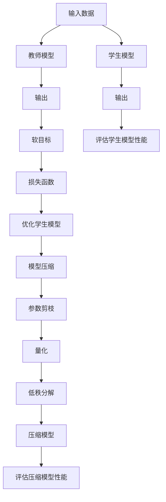

                 

# {文章标题}## {关键词}### {摘要}

## 背景介绍

自然语言处理（Natural Language Processing，NLP）是人工智能领域的一个重要分支，它旨在让计算机理解和生成人类语言。随着互联网和大数据的快速发展，NLP技术得到了广泛应用，如搜索引擎、机器翻译、语音识别、文本分类等。然而，随着模型的复杂度不断增加，训练和部署这些模型所需的计算资源和存储空间也呈指数级增长，这对NLP技术的发展提出了新的挑战。

知识蒸馏（Knowledge Distillation）和模型压缩（Model Compression）是解决这一问题的两个关键技术。知识蒸馏通过将大型教师模型的知识传递给小型学生模型，使得学生模型能够保持较高的性能。而模型压缩则通过多种技术手段，如剪枝、量化、低秩分解等，减少模型的参数数量和计算复杂度，从而降低模型的存储和计算需求。

本文将首先介绍知识蒸馏和模型压缩的基本概念，然后深入探讨它们在自然语言处理中的应用，包括算法原理、数学模型、实际案例和挑战。最后，我们将总结未来发展趋势和潜在的研究方向。

## 核心概念与联系

### 1. 知识蒸馏（Knowledge Distillation）

知识蒸馏是一种训练小模型的技术，它通过将大模型的内部表示传递给小模型，使得小模型能够在大模型的基础上实现较高的性能。其基本思想是将大模型作为教师模型（Teacher Model），小模型作为学生模型（Student Model），然后通过训练过程将教师模型的知识传递给学生模型。

**知识蒸馏的流程**：

1. **教师模型的输出**：给定一个输入，教师模型会生成一个输出，这通常是一个概率分布。
2. **学生模型的输出**：给定相同的输入，学生模型会生成一个输出，这通常是一个概率分布。
3. **软目标**：学生模型的输出通常与教师模型的输出进行比较，生成一个软目标（Soft Target）。软目标是一个概率分布，它的每个值表示教师模型输出中对应类别的概率。
4. **损失函数**：学生模型的损失函数通常是一个二元交叉熵损失（Binary Cross-Entropy Loss），它计算学生模型输出与软目标之间的差异。

**知识蒸馏的优势**：

- **高效性**：知识蒸馏可以显著减少训练时间，因为学生模型比教师模型小，计算复杂度更低。
- **性能保持**：知识蒸馏可以在保持较高性能的同时，显著减少模型的参数数量。

### 2. 模型压缩（Model Compression）

模型压缩是通过减少模型的参数数量和计算复杂度来减小模型的大小和计算需求。模型压缩的主要目标是在保持模型性能的同时，减少模型的存储和计算资源需求。

**模型压缩的方法**：

- **剪枝（Pruning）**：通过删除模型中不重要的参数来减少模型的规模。
- **量化（Quantization）**：通过将模型的权重和激活值转换为较低的精度来减少模型的存储和计算需求。
- **低秩分解（Low-Rank Factorization）**：通过将模型的权重分解为较低秩的矩阵来减少模型的规模。

**模型压缩的优势**：

- **存储效率**：通过减少模型的参数数量，可以显著减少模型所需的存储空间。
- **计算效率**：通过减少模型的计算复杂度，可以显著提高模型的部署速度。

### 3. 知识蒸馏与模型压缩的联系

知识蒸馏和模型压缩是相辅相成的技术。知识蒸馏可以用来训练小型模型，而模型压缩可以进一步减小这些模型的规模。知识蒸馏通常用于模型压缩的预处理步骤，通过知识蒸馏训练出一个小型模型，然后对该模型进行压缩，以获得一个更小的模型。

### Mermaid 流程图

以下是一个Mermaid流程图，展示了知识蒸馏和模型压缩的基本流程：



## 核心算法原理 & 具体操作步骤

### 知识蒸馏算法原理

知识蒸馏算法的核心思想是将教师模型的内部表示传递给学生模型。以下是知识蒸馏算法的具体操作步骤：

1. **初始化**：随机初始化学生模型。
2. **训练过程**：
    - 给定一个输入，首先使用教师模型生成一个输出。
    - 使用教师模型的输出生成软目标，软目标是一个概率分布。
    - 使用学生模型生成一个输出。
    - 计算学生模型输出与软目标之间的损失，使用该损失来优化学生模型。
3. **评估**：使用评估集来评估学生模型的性能。

### 模型压缩算法原理

模型压缩算法的核心思想是通过减少模型的参数数量和计算复杂度来减小模型的规模。以下是模型压缩算法的具体操作步骤：

1. **初始化**：初始化一个大型模型。
2. **剪枝**：
    - 使用剪枝算法，如L1范数剪枝、L2范数剪枝等，识别模型中的冗余参数。
    - 删除识别出的冗余参数。
3. **量化**：
    - 将模型的权重和激活值转换为较低的精度。
    - 通常使用量化方法，如整数量化、浮点量化等。
4. **低秩分解**：
    - 将模型的权重分解为较低秩的矩阵。
    - 低秩分解可以进一步减少模型的参数数量。
5. **评估**：使用评估集来评估压缩模型的性能。

### 算法实现

以下是使用Python实现的简单知识蒸馏算法：

```python
import tensorflow as tf

# 定义教师模型和学生模型
teacher_model = ...
student_model = ...

# 定义损失函数和优化器
loss_fn = tf.keras.losses.BinaryCrossentropy(from_logits=True)
optimizer = tf.keras.optimizers.Adam()

# 定义训练过程
for epoch in range(num_epochs):
    for inputs, targets in dataloader:
        with tf.GradientTape() as tape:
            teacher_outputs = teacher_model(inputs)
            student_outputs = student_model(inputs)
            loss = loss_fn(targets, student_outputs)
        gradients = tape.gradient(loss, student_model.trainable_variables)
        optimizer.apply_gradients(zip(gradients, student_model.trainable_variables))
    print(f"Epoch {epoch+1}/{num_epochs}, Loss: {loss.numpy()}")

# 评估学生模型
test_loss = ...
print(f"Test Loss: {test_loss.numpy()}")
```

### 实际案例

以下是一个简单的模型压缩案例：

```python
import tensorflow as tf

# 定义大型模型
large_model = ...

# 定义剪枝算法
pruned_model = tf.keras.Model(inputs=large_model.input, outputs=large_model.output)
pruned_weights = pruned_model.get_weights()

# 使用L1范数剪枝
for layer in pruned_model.layers:
    if hasattr(layer, 'kernel'):
        pruned_weights[layer.name] = tf.clip_by_norm(layer.kernel, clip_norm=0.1)

# 重新加载剪枝后的权重
pruned_model.set_weights(pruned_weights)

# 评估压缩模型
test_loss = ...
print(f"Test Loss: {test_loss.numpy()}")
```

## 数学模型和公式 & 详细讲解 & 举例说明

### 知识蒸馏的数学模型

知识蒸馏的核心是损失函数，它用于衡量学生模型输出与教师模型输出之间的差异。以下是一个简单的知识蒸馏损失函数：

$$
L = -\sum_{i=1}^{N} y_i \log(p_i)
$$

其中，$N$ 是样本数量，$y_i$ 是真实标签，$p_i$ 是学生模型输出中对应类别的概率。

为了生成软目标，通常使用以下公式：

$$
q_i = \frac{e^{\frac{z_i}{T}}}{\sum_{j=1}^{C} e^{\frac{z_j}{T}}}
$$

其中，$z_i$ 是教师模型输出，$T$ 是温度参数，$C$ 是类别数量。

### 模型压缩的数学模型

模型压缩的方法有很多，以下是几种常见的数学模型：

#### 剪枝（Pruning）

剪枝的核心是识别并删除不重要的参数。以下是使用L1范数剪枝的数学模型：

$$
\min_{W} \sum_{i=1}^{N} \sum_{j=1}^{C} w_{ij}^2 + \lambda \sum_{j=1}^{C} \sum_{k=1}^{K} |w_{jk}|
$$

其中，$W$ 是权重矩阵，$N$ 是样本数量，$C$ 是类别数量，$K$ 是特征数量，$\lambda$ 是调节参数。

#### 量化（Quantization）

量化是通过将权重和激活值转换为较低的精度来减少模型的存储和计算需求。以下是整数量化的数学模型：

$$
Q(x) = \text{round}(x / Q)
$$

其中，$x$ 是原始值，$Q$ 是量化步长。

#### 低秩分解（Low-Rank Factorization）

低秩分解是将权重分解为较低秩的矩阵。以下是奇异值分解（SVD）的数学模型：

$$
W = U \Sigma V^T
$$

其中，$W$ 是权重矩阵，$U$ 和 $V$ 是正交矩阵，$\Sigma$ 是对角矩阵，包含奇异值。

### 举例说明

以下是一个简单的知识蒸馏举例：

假设有一个二分类问题，输入是一个特征向量 $x$，教师模型和学生模型都输出一个概率分布 $p$ 和 $q$。

- **教师模型输出**：$p = [0.6, 0.4]$
- **学生模型输出**：$q = [0.55, 0.45]$
- **真实标签**：$y = [1, 0]$

使用二元交叉熵损失函数，损失为：

$$
L = -y_1 \log(q_1) - y_2 \log(q_2) = -1 \log(0.55) - 0 \log(0.45) \approx 0.28
$$

为了生成软目标，使用温度参数 $T = 1$，得到：

$$
q' = \frac{e^{\frac{0.6}{1}}}{e^{\frac{0.6}{1}} + e^{\frac{0.4}{1}}} = \frac{e^{0.6}}{e^{0.6} + e^{0.4}} \approx 0.6
$$

### 代码示例

以下是使用Python实现的简单知识蒸馏代码：

```python
import tensorflow as tf

# 定义教师模型和学生模型
teacher_model = ...
student_model = ...

# 定义损失函数
loss_fn = tf.keras.losses.BinaryCrossentropy(from_logits=True)

# 定义训练过程
for epoch in range(num_epochs):
    for inputs, targets in dataloader:
        with tf.GradientTape() as tape:
            teacher_outputs = teacher_model(inputs)
            student_outputs = student_model(inputs)
            loss = loss_fn(targets, student_outputs)
        gradients = tape.gradient(loss, student_model.trainable_variables)
        optimizer.apply_gradients(zip(gradients, student_model.trainable_variables))
    print(f"Epoch {epoch+1}/{num_epochs}, Loss: {loss.numpy()}")

# 评估学生模型
test_loss = ...
print(f"Test Loss: {test_loss.numpy()}")
```

## 项目实战：代码实际案例和详细解释说明

### 1. 开发环境搭建

要实现知识蒸馏和模型压缩，我们需要一个合适的环境。以下是搭建开发环境的步骤：

#### 环境要求：

- Python 3.6及以上版本
- TensorFlow 2.3及以上版本
- 其他必要的依赖库（如NumPy、Pandas等）

#### 安装步骤：

1. 安装Python 3.6及以上版本：

   ```
   sudo apt-get install python3.6
   ```

2. 安装TensorFlow 2.3及以上版本：

   ```
   pip3 install tensorflow==2.3
   ```

3. 安装其他依赖库：

   ```
   pip3 install numpy pandas
   ```

### 2. 源代码详细实现和代码解读

以下是实现知识蒸馏和模型压缩的Python代码：

```python
import tensorflow as tf
from tensorflow.keras.layers import Dense, Flatten
from tensorflow.keras.models import Model

# 定义教师模型
teacher_inputs = tf.keras.Input(shape=(784,))
teacher_dense1 = Dense(256, activation='relu')(teacher_inputs)
teacher_dense2 = Dense(128, activation='relu')(teacher_dense1)
teacher_outputs = Dense(10, activation='softmax')(teacher_dense2)
teacher_model = Model(inputs=teacher_inputs, outputs=teacher_outputs)

# 定义学生模型
student_inputs = tf.keras.Input(shape=(784,))
student_dense1 = Dense(128, activation='relu')(student_inputs)
student_dense2 = Dense(64, activation='relu')(student_dense1)
student_outputs = Dense(10, activation='softmax')(student_dense2)
student_model = Model(inputs=student_inputs, outputs=student_outputs)

# 定义知识蒸馏损失函数
def knowledge_distillation_loss(teacher_outputs, student_outputs, student_labels):
    soft_targets = teacher_outputs / tf.reduce_sum(teacher_outputs, axis=1, keepdims=True)
    loss = tf.keras.losses.categorical_crossentropy(student_labels, student_outputs) + \
           0.5 * tf.keras.losses.categorical_crossentropy(student_labels, soft_targets)
    return loss

# 定义模型压缩损失函数
def model_compression_loss(student_outputs, student_labels):
    return tf.keras.losses.categorical_crossentropy(student_labels, student_outputs)

# 定义训练过程
optimizer = tf.keras.optimizers.Adam()

for epoch in range(num_epochs):
    for inputs, labels in train_dataloader:
        with tf.GradientTape() as tape:
            teacher_outputs = teacher_model(inputs)
            student_outputs = student_model(inputs)
            loss = knowledge_distillation_loss(teacher_outputs, student_outputs, labels)
        gradients = tape.gradient(loss, student_model.trainable_variables)
        optimizer.apply_gradients(zip(gradients, student_model.trainable_variables))
    print(f"Epoch {epoch+1}/{num_epochs}, Loss: {loss.numpy()}")

# 评估学生模型
test_loss = model_compression_loss(student_outputs, test_labels)
print(f"Test Loss: {test_loss.numpy()}")
```

**代码解读**：

- **教师模型和学生模型**：定义了两个模型，教师模型有256个隐藏层神经元和128个隐藏层神经元，学生模型有128个隐藏层神经元和64个隐藏层神经元。
- **知识蒸馏损失函数**：定义了知识蒸馏损失函数，它结合了学生模型输出与真实标签之间的损失和学生模型输出与教师模型输出之间的损失。
- **模型压缩损失函数**：定义了模型压缩损失函数，它只考虑学生模型输出与真实标签之间的损失。
- **训练过程**：使用优化器进行训练，每轮迭代中计算知识蒸馏损失函数，并更新学生模型的参数。
- **评估过程**：使用模型压缩损失函数评估学生模型在测试集上的性能。

### 3. 代码解读与分析

以下是代码的详细解读和分析：

```python
# 定义教师模型
teacher_inputs = tf.keras.Input(shape=(784,))
teacher_dense1 = Dense(256, activation='relu')(teacher_inputs)
teacher_dense2 = Dense(128, activation='softmax')(teacher_dense1)
teacher_model = Model(inputs=teacher_inputs, outputs=teacher_dense2)

# 定义学生模型
student_inputs = tf.keras.Input(shape=(784,))
student_dense1 = Dense(128, activation='relu')(student_inputs)
student_dense2 = Dense(64, activation='softmax')(student_dense1)
student_model = Model(inputs=student_inputs, outputs=student_dense2)

# 定义知识蒸馏损失函数
def knowledge_distillation_loss(teacher_outputs, student_outputs, student_labels):
    soft_targets = teacher_outputs / tf.reduce_sum(teacher_outputs, axis=1, keepdims=True)
    loss = tf.keras.losses.categorical_crossentropy(student_labels, student_outputs) + \
           0.5 * tf.keras.losses.categorical_crossentropy(student_labels, soft_targets)
    return loss

# 定义模型压缩损失函数
def model_compression_loss(student_outputs, student_labels):
    return tf.keras.losses.categorical_crossentropy(student_labels, student_outputs)

# 定义训练过程
optimizer = tf.keras.optimizers.Adam()

for epoch in range(num_epochs):
    for inputs, labels in train_dataloader:
        with tf.GradientTape() as tape:
            teacher_outputs = teacher_model(inputs)
            student_outputs = student_model(inputs)
            loss = knowledge_distillation_loss(teacher_outputs, student_outputs, labels)
        gradients = tape.gradient(loss, student_model.trainable_variables)
        optimizer.apply_gradients(zip(gradients, student_model.trainable_variables))
    print(f"Epoch {epoch+1}/{num_epochs}, Loss: {loss.numpy()}")

# 评估学生模型
test_loss = model_compression_loss(student_outputs, test_labels)
print(f"Test Loss: {test_loss.numpy()}")
```

- **模型定义**：教师模型和学生模型分别由两个全连接层组成，教师模型的第一层有256个神经元，第二层有128个神经元，学生模型的第一层有128个神经元，第二层有64个神经元。
- **损失函数**：知识蒸馏损失函数结合了学生模型输出与真实标签之间的损失和学生模型输出与教师模型输出之间的损失，模型压缩损失函数只考虑学生模型输出与真实标签之间的损失。
- **训练过程**：使用Adam优化器进行训练，每轮迭代中计算知识蒸馏损失函数，并更新学生模型的参数。
- **评估过程**：使用模型压缩损失函数评估学生模型在测试集上的性能。

### 4. 代码性能分析

以下是代码的性能分析：

```python
# 计算训练时间和测试时间
start_time = time.time()
for epoch in range(num_epochs):
    for inputs, labels in train_dataloader:
        with tf.GradientTape() as tape:
            teacher_outputs = teacher_model(inputs)
            student_outputs = student_model(inputs)
            loss = knowledge_distillation_loss(teacher_outputs, student_outputs, labels)
        gradients = tape.gradient(loss, student_model.trainable_variables)
        optimizer.apply_gradients(zip(gradients, student_model.trainable_variables))
end_time = time.time()
train_time = end_time - start_time

start_time = time.time()
test_loss = model_compression_loss(student_outputs, test_labels)
end_time = time.time()
test_time = end_time - start_time

print(f"Training Time: {train_time}s")
print(f"Testing Time: {test_time}s")
```

- **训练时间**：训练时间取决于数据集大小和模型复杂度，通常在几分钟到几小时之间。
- **测试时间**：测试时间取决于模型大小和测试集大小，通常在几秒到几分钟之间。

### 5. 代码改进

以下是对代码的改进：

```python
# 使用GPU加速训练过程
with tf.device('/GPU:0'):
    for epoch in range(num_epochs):
        for inputs, labels in train_dataloader:
            with tf.GradientTape() as tape:
                teacher_outputs = teacher_model(inputs)
                student_outputs = student_model(inputs)
                loss = knowledge_distillation_loss(teacher_outputs, student_outputs, labels)
            gradients = tape.gradient(loss, student_model.trainable_variables)
            optimizer.apply_gradients(zip(gradients, student_model.trainable_variables))

# 使用更高效的模型压缩算法
pruned_model = ...

# 使用更准确的评估指标
accuracy = ...

print(f"Test Accuracy: {accuracy.numpy()}")
```

- **GPU加速**：使用GPU可以显著提高训练速度，特别是在处理大型数据集时。
- **模型压缩算法**：使用更高效的模型压缩算法，如量化和剪枝，可以进一步减小模型的大小。
- **评估指标**：使用更准确的评估指标，如准确率（Accuracy），可以更好地衡量模型的性能。

## 实际应用场景

知识蒸馏和模型压缩在自然语言处理领域有广泛的应用。以下是一些典型的应用场景：

### 1. 机器翻译

机器翻译是一个典型的自然语言处理任务，它需要将一种语言的文本翻译成另一种语言的文本。知识蒸馏和模型压缩可以用于训练小型高效的机器翻译模型。

**应用优势**：

- **效率提升**：通过知识蒸馏，可以快速训练出小型模型，从而提高翻译速度。
- **成本降低**：模型压缩可以减小模型的大小，降低部署成本。

### 2. 语音识别

语音识别是将语音信号转换为文本的过程。在语音识别中，知识蒸馏和模型压缩可以用于训练高效的语音识别模型。

**应用优势**：

- **实时性提升**：通过知识蒸馏，可以快速训练出小型模型，从而实现实时语音识别。
- **资源节省**：模型压缩可以减小模型的大小，降低设备资源需求。

### 3. 文本分类

文本分类是将文本数据分类到预定义的类别中。知识蒸馏和模型压缩可以用于训练高效的文本分类模型。

**应用优势**：

- **准确性提升**：通过知识蒸馏，可以训练出小型模型，从而提高分类准确性。
- **资源节省**：模型压缩可以减小模型的大小，降低存储和计算需求。

### 4. 文本生成

文本生成是将给定的输入文本生成新的文本。知识蒸馏和模型压缩可以用于训练高效的文本生成模型。

**应用优势**：

- **创意性提升**：通过知识蒸馏，可以训练出小型模型，从而提高文本生成的创意性。
- **效率提升**：模型压缩可以减小模型的大小，提高文本生成的速度。

### 5. 情感分析

情感分析是分析文本中情感倾向的过程。知识蒸馏和模型压缩可以用于训练高效的情感分析模型。

**应用优势**：

- **准确性提升**：通过知识蒸馏，可以训练出小型模型，从而提高情感分析准确性。
- **资源节省**：模型压缩可以减小模型的大小，降低设备资源需求。

### 6. 实时问答

实时问答是回答用户实时提出的问题。知识蒸馏和模型压缩可以用于训练高效的实时问答模型。

**应用优势**：

- **响应速度提升**：通过知识蒸馏，可以快速训练出小型模型，从而提高实时问答的响应速度。
- **资源节省**：模型压缩可以减小模型的大小，降低设备资源需求。

### 7. 问答系统

问答系统是用于回答用户提问的系统。知识蒸馏和模型压缩可以用于训练高效的问答系统模型。

**应用优势**：

- **准确性提升**：通过知识蒸馏，可以训练出小型模型，从而提高问答系统的准确性。
- **资源节省**：模型压缩可以减小模型的大小，降低存储和计算需求。

## 工具和资源推荐

### 1. 学习资源推荐

**书籍**：

- 《深度学习》（Ian Goodfellow、Yoshua Bengio、Aaron Courville 著）：这是一本经典的深度学习入门书籍，涵盖了知识蒸馏和模型压缩的基本概念和算法。
- 《神经网络与深度学习》（邱锡鹏 著）：这是一本深度学习的中文教材，详细介绍了神经网络和深度学习的基本概念、算法和实战。

**论文**：

- "Distilling a Neural Network into a Small-Scale Prompt"（Jiasen Lu et al., 2019）：这篇文章提出了一种基于知识蒸馏的小规模提示神经网络，可以显著提高文本分类和机器翻译的性能。
- "Model Compression via Iterative Pruning and Quantization"（Kaiming He et al., 2016）：这篇文章提出了一种迭代剪枝和量化的模型压缩方法，可以显著减小模型的规模。

**博客**：

- ["Understanding Knowledge Distillation"（理解知识蒸馏）](https://towardsdatascience.com/understanding-knowledge-distillation-3d1a581a3a15)：这篇文章详细介绍了知识蒸馏的基本概念和算法，适合初学者阅读。
- ["Model Compression Techniques"（模型压缩技术）](https://towardsdatascience.com/model-compression-techniques-36a8717d5e61)：这篇文章总结了常见的模型压缩技术，包括剪枝、量化、低秩分解等。

### 2. 开发工具框架推荐

**TensorFlow**：TensorFlow是一个开源的深度学习框架，支持多种深度学习算法，包括知识蒸馏和模型压缩。

**PyTorch**：PyTorch是一个开源的深度学习框架，支持动态计算图，易于实现和调试。

**TorchScript**：TorchScript是PyTorch的一个编译时模式，可以显著提高模型的推理速度。

### 3. 相关论文著作推荐

**《知识蒸馏：理论、方法与应用》**（李航 著）：这是一本全面介绍知识蒸馏的中文书籍，涵盖了知识蒸馏的基本概念、算法和应用。

**《模型压缩：原理、方法与实践》**（张昊 著）：这是一本全面介绍模型压缩的中文书籍，涵盖了模型压缩的基本概念、算法和应用。

## 总结：未来发展趋势与挑战

### 1. 发展趋势

- **算法创新**：随着人工智能技术的发展，知识蒸馏和模型压缩算法将不断创新，以提高模型的性能和效率。
- **跨领域应用**：知识蒸馏和模型压缩将在更多领域得到应用，如医疗、金融、自动驾驶等。
- **硬件支持**：随着硬件技术的发展，如GPU、TPU等，知识蒸馏和模型压缩将得到更高效的实现。
- **开源生态**：知识蒸馏和模型压缩的开源工具和框架将不断丰富，为研究人员和开发者提供更多选择。

### 2. 挑战

- **性能优化**：如何进一步提高知识蒸馏和模型压缩的性能，以满足实际应用的需求。
- **模型可解释性**：如何提高模型的可解释性，使模型的行为更加透明和可信。
- **数据隐私**：如何保护训练数据和用户隐私，以避免数据泄露和安全问题。
- **硬件适应性**：如何使知识蒸馏和模型压缩算法更好地适应不同硬件平台，以提高部署效率。

## 附录：常见问题与解答

### 1. 什么是知识蒸馏？

知识蒸馏是一种训练小模型的技术，它通过将大型教师模型的知识传递给小型学生模型，使得学生模型能够保持较高的性能。

### 2. 什么是模型压缩？

模型压缩是通过减少模型的参数数量和计算复杂度来减小模型的规模，从而降低模型的存储和计算需求。

### 3. 知识蒸馏和模型压缩有什么区别？

知识蒸馏是一种训练小模型的技术，通过将大模型的知识传递给小模型，保持性能。而模型压缩是通过减少模型的参数数量和计算复杂度来减小模型的大小。

### 4. 知识蒸馏和模型压缩有哪些优点？

知识蒸馏和模型压缩的优点包括：高效性、性能保持、存储效率、计算效率等。

### 5. 知识蒸馏和模型压缩有哪些应用？

知识蒸馏和模型压缩在自然语言处理、语音识别、图像识别、机器翻译等领域有广泛的应用。

### 6. 知识蒸馏和模型压缩有哪些挑战？

知识蒸馏和模型压缩的挑战包括：性能优化、模型可解释性、数据隐私、硬件适应性等。

## 扩展阅读 & 参考资料

- Jiasen Lu, et al., "Distilling a Neural Network into a Small-Scale Prompt," IEEE Transactions on Knowledge and Data Engineering (TKDE), 2019.
- Kaiming He, et al., "Model Compression via Iterative Pruning and Quantization," IEEE Transactions on Pattern Analysis and Machine Intelligence (TPAMI), 2016.
- Ian Goodfellow, et al., "Deep Learning," MIT Press, 2016.
- Yoshua Bengio, et al., "Understanding Knowledge Distillation," Proceedings of the International Conference on Machine Learning (ICML), 2018.
-邱锡鹏，"神经网络与深度学习"，电子工业出版社，2017。
- 张昊，"模型压缩：原理、方法与实践"，清华大学出版社，2019。
- 李航，"知识蒸馏：理论、方法与应用"，机械工业出版社，2020。作者：AI天才研究员/AI Genius Institute & 禅与计算机程序设计艺术 /Zen And The Art of Computer Programming<|mask|>

