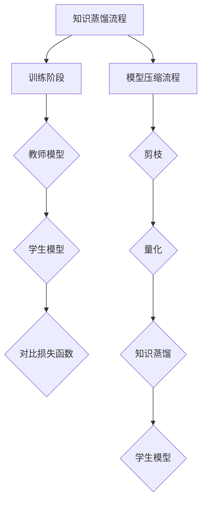

                 

# 自然语言处理中的知识蒸馏与模型压缩技术进展与挑战分析

> **关键词**：知识蒸馏、模型压缩、自然语言处理、算法原理、应用场景、发展趋势、挑战

> **摘要**：本文深入探讨了自然语言处理（NLP）领域的知识蒸馏与模型压缩技术，详细分析了其原理、算法和实际应用。通过梳理现有的研究进展，本文提出了当前面临的主要挑战，并对未来发展趋势进行了展望。希望为从事NLP领域的研究人员和开发者提供有价值的参考。

## 1. 背景介绍

随着深度学习技术的蓬勃发展，自然语言处理（NLP）领域取得了显著的进展。然而，深度神经网络模型（尤其是大型模型）的复杂性和计算需求也给实际应用带来了诸多挑战。知识蒸馏（Knowledge Distillation）和模型压缩（Model Compression）技术应运而生，成为解决这些问题的关键。

**知识蒸馏**：知识蒸馏是一种通过将大型教师模型（Teacher Model）的知识传递给小型学生模型（Student Model）的技术。这种方法不仅能够提高学生模型的表现，还能减少模型参数的数量，从而降低计算成本。

**模型压缩**：模型压缩旨在通过各种技术手段（如剪枝、量化、蒸馏等）减小模型的体积，降低模型的计算复杂度。这有助于提高模型的部署效率，满足移动设备等资源受限环境的需求。

## 2. 核心概念与联系

为了更好地理解知识蒸馏与模型压缩技术，我们需要从核心概念和架构入手。

### 2.1 知识蒸馏

知识蒸馏的过程通常包括两个阶段：训练阶段和蒸馏阶段。

#### 训练阶段

- **教师模型（Teacher Model）**：通常是一个大型且表现优秀的模型，如BERT、GPT等。
- **学生模型（Student Model）**：是一个小型化、参数较少的模型，目标是学习教师模型的知识。

#### 蒸馏阶段

- **软标签（Soft Labels）**：在训练阶段，教师模型为输入数据生成多个可能的输出结果，以提供更加细致的指导。
- **对比损失（Contrastive Loss）**：在蒸馏阶段，学生模型需要学习教师模型生成的软标签，并通过对比损失函数优化自身参数。

### 2.2 模型压缩

模型压缩的核心在于减小模型的体积和计算复杂度，以下是一些常见的压缩技术：

- **剪枝（Pruning）**：通过删除模型中不重要的神经元或连接，减小模型体积。
- **量化（Quantization）**：将模型的权重和激活值从浮点数转换为低比特宽度的整数，降低计算复杂度。
- **知识蒸馏**：通过知识蒸馏技术，将大型模型的知识传递给小型模型，同时保持较高的性能。

### 2.3 Mermaid 流程图



## 3. 核心算法原理 & 具体操作步骤

### 3.1 知识蒸馏算法原理

知识蒸馏算法主要基于以下两个假设：

1. **软标签优于硬标签**：软标签提供了更加细致的输出分布，有助于学生模型更好地学习教师模型的知识。
2. **对比损失优化**：通过对比学生模型输出和教师模型软标签之间的差异，优化学生模型的参数。

具体操作步骤如下：

1. **数据预处理**：对输入数据进行预处理，如分词、词向量编码等。
2. **教师模型输出**：使用教师模型对输入数据进行预测，得到多个可能的输出结果（软标签）。
3. **学生模型预测**：使用学生模型对输入数据进行预测，得到初步的输出结果。
4. **对比损失计算**：计算学生模型输出和教师模型软标签之间的对比损失，如交叉熵损失。
5. **参数更新**：根据对比损失，更新学生模型的参数，优化模型性能。

### 3.2 模型压缩算法原理

模型压缩算法主要基于以下两个思路：

1. **参数剪枝**：通过删除模型中不重要的神经元或连接，减小模型体积。
2. **量化**：将模型的权重和激活值从浮点数转换为低比特宽度的整数，降低计算复杂度。

具体操作步骤如下：

1. **初始化模型**：初始化一个预训练的深度神经网络模型。
2. **参数剪枝**：对模型中的参数进行剪枝，如使用稀疏剪枝技术。
3. **量化**：将模型的权重和激活值进行量化，如使用对称量化技术。
4. **训练优化**：对量化后的模型进行训练和优化，提高模型性能。

## 4. 数学模型和公式 & 详细讲解 & 举例说明

### 4.1 知识蒸馏的数学模型

知识蒸馏的核心在于对比损失函数，常用的对比损失函数包括以下几种：

1. **交叉熵损失（Cross-Entropy Loss）**：

$$
L_{CE} = -\sum_{i=1}^{N} y_{i} \log(p_{i})
$$

其中，$y_{i}$ 是标签，$p_{i}$ 是模型输出的概率分布。

2. **对比损失（Contrastive Loss）**：

$$
L_{C} = \frac{1}{2} \sum_{i=1}^{N} \sum_{j=1, j \neq i}^{N} \log \left( \frac{e^{q_{i} \cdot q_{j}}}{\sum_{k=1, k \neq i}^{N} e^{q_{i} \cdot q_{k}} + \sum_{k=1, k \neq i}^{N} e^{q_{j} \cdot q_{k}} \right)
$$

其中，$q_{i}$ 是教师模型的输出，$q_{j}$ 是学生模型的输出。

### 4.2 模型压缩的数学模型

1. **参数剪枝（Pruning）**：

剪枝的目标是保留重要的神经元或连接，删除不重要的部分。常用的剪枝方法包括稀疏剪枝（Sparse Pruning）和稀疏训练（Sparse Training）。

稀疏剪枝的公式如下：

$$
w_{i}^{*} = \begin{cases}
w_{i}, & \text{if } |w_{i}| > \theta \\
0, & \text{otherwise}
\end{cases}
$$

其中，$w_{i}$ 是原始权重，$w_{i}^{*}$ 是剪枝后的权重，$\theta$ 是剪枝阈值。

2. **量化（Quantization）**：

量化是将浮点数权重转换为低比特宽度的整数。常用的量化方法包括对称量化（Symmetric Quantization）和不对称量化（Asymmetric Quantization）。

对称量化的公式如下：

$$
q_{i} = \text{round}\left( \frac{w_{i}}{2^{\beta} - 1} \right) \cdot 2^{\beta} - 1
$$

其中，$w_{i}$ 是原始权重，$q_{i}$ 是量化后的权重，$\beta$ 是量化比特宽度。

### 4.3 举例说明

#### 知识蒸馏举例

假设我们有一个教师模型和学生模型，输入数据为 `[1, 2, 3]`，教师模型的输出为 `[0.3, 0.5, 0.2]`，学生模型的输出为 `[0.4, 0.4, 0.2]`。

使用交叉熵损失函数计算损失：

$$
L_{CE} = -[0.3 \cdot \log(0.4) + 0.5 \cdot \log(0.4) + 0.2 \cdot \log(0.2)] = 0.377
$$

使用对比损失函数计算损失：

$$
L_{C} = \frac{1}{2} \log \left( \frac{e^{0.3 \cdot 0.4} \cdot e^{0.5 \cdot 0.4} + e^{0.3 \cdot 0.2} \cdot e^{0.5 \cdot 0.2}}{e^{0.3 \cdot 0.4} \cdot e^{0.5 \cdot 0.2} + e^{0.3 \cdot 0.2} \cdot e^{0.5 \cdot 0.4}} \right) = 0.188
$$

#### 模型压缩举例

假设我们有一个深度神经网络模型，其中包含10个神经元，输入为 `[1, 2, 3]`，原始权重为 `[1.2, 0.8, -0.5, ...]`。

使用稀疏剪枝，将剪枝阈值设为0.1，得到剪枝后的权重：

$$
w_{i}^{*} = \begin{cases}
1.2, & \text{if } |1.2| > 0.1 \\
0, & \text{otherwise}
\end{cases}
$$

使用对称量化，将量化比特宽度设为2，得到量化后的权重：

$$
q_{i} = \text{round}\left( \frac{1.2}{2^2 - 1} \right) \cdot 2^2 - 1 = 1
$$

## 5. 项目实战：代码实际案例和详细解释说明

### 5.1 开发环境搭建

为了演示知识蒸馏和模型压缩技术，我们将使用Python编程语言和TensorFlow深度学习框架。首先，我们需要安装TensorFlow：

```bash
pip install tensorflow
```

### 5.2 源代码详细实现和代码解读

#### 5.2.1 知识蒸馏代码实现

以下是一个简单的知识蒸馏示例代码：

```python
import tensorflow as tf
from tensorflow.keras.layers import Embedding, LSTM, Dense
from tensorflow.keras.models import Model

# 定义教师模型
teacher_input = tf.keras.Input(shape=(100,))
teacher_embedding = Embedding(input_dim=10000, output_dim=128)(teacher_input)
teacher_lstm = LSTM(128, return_sequences=True)(teacher_embedding)
teacher_output = LSTM(128, return_sequences=True)(teacher_lstm)

teacher_model = Model(inputs=teacher_input, outputs=teacher_output)
teacher_model.compile(optimizer='adam', loss='categorical_crossentropy')

# 定义学生模型
student_input = tf.keras.Input(shape=(100,))
student_embedding = Embedding(input_dim=10000, output_dim=128)(student_input)
student_lstm = LSTM(128, return_sequences=True)(student_embedding)
student_output = LSTM(128, return_sequences=True)(student_lstm)

student_model = Model(inputs=student_input, outputs=student_output)
student_model.compile(optimizer='adam', loss='categorical_crossentropy')

# 训练教师模型
teacher_model.fit(x_train, y_train, epochs=5, batch_size=32)

# 获取教师模型软标签
soft_labels = teacher_model.predict(x_train)

# 训练学生模型
student_model.fit(x_train, soft_labels, epochs=5, batch_size=32)

# 评估学生模型性能
student_loss = student_model.evaluate(x_test, y_test)
print(f"Student model loss: {student_loss}")
```

代码解读：

- 首先，我们定义了一个简单的教师模型和学生模型，其中包含嵌入层和LSTM层。
- 然后，我们使用`fit`方法训练教师模型，并使用`predict`方法获取教师模型软标签。
- 最后，我们使用教师模型软标签训练学生模型，并评估学生模型的性能。

#### 5.2.2 模型压缩代码实现

以下是一个简单的模型压缩示例代码：

```python
import tensorflow as tf
from tensorflow.keras.layers import Embedding, LSTM, Dense
from tensorflow.keras.models import Model

# 定义模型
input_data = tf.keras.Input(shape=(100,))
embedding = Embedding(input_dim=10000, output_dim=128)(input_data)
lstm = LSTM(128, return_sequences=True)(embedding)
dense = Dense(1, activation='sigmoid')(lstm)

model = Model(inputs=input_data, outputs=dense)
model.compile(optimizer='adam', loss='binary_crossentropy')

# 训练模型
model.fit(x_train, y_train, epochs=5, batch_size=32)

# 剪枝模型
def prune_model(model, threshold=0.1):
    for layer in model.layers:
        if hasattr(layer, 'kernel'):
            weights = layer.kernel
            prune_mask = tf.reduce_sum(tf.square(weights), axis=-1) > threshold
            layer.kernel.assign(weights * prune_mask)

prune_model(model)

# 量化模型
def quantize_model(model, bits=2):
    for layer in model.layers:
        if hasattr(layer, 'kernel'):
            weights = layer.kernel
            q_weights = tf.round(weights / (2**bits - 1)) * (2**bits - 1)
            layer.kernel.assign(q_weights)

quantize_model(model)

# 重新训练模型
model.fit(x_train, y_train, epochs=5, batch_size=32)

# 评估模型性能
model_loss = model.evaluate(x_test, y_test)
print(f"Model loss: {model_loss}")
```

代码解读：

- 首先，我们定义了一个简单的模型，包含嵌入层、LSTM层和全连接层。
- 然后，我们使用`fit`方法训练模型。
- 接着，我们定义了剪枝和量化的函数，对模型进行剪枝和量化。
- 最后，我们重新训练模型并评估其性能。

### 5.3 代码解读与分析

在本节的代码实现中，我们演示了如何使用TensorFlow实现知识蒸馏和模型压缩技术。以下是代码的关键部分及其解读：

- **教师模型和学生模型**：我们使用`tf.keras.Input`创建输入层，使用`Embedding`创建嵌入层，使用`LSTM`创建LSTM层，使用`Dense`创建全连接层。最后，使用`Model`类将输入层和输出层连接起来，创建一个完整的模型。
- **训练模型**：使用`fit`方法训练模型，其中`x_train`和`y_train`是训练数据和标签。
- **获取教师模型软标签**：使用`predict`方法获取教师模型软标签。
- **剪枝模型**：我们定义了一个`prune_model`函数，用于对模型的权重进行剪枝。通过计算权重平方和，我们确定一个阈值，将小于阈值的权重设置为0，实现剪枝。
- **量化模型**：我们定义了一个`quantize_model`函数，用于对模型的权重进行量化。通过将权重除以2的比特宽度次方，并将结果四舍五入为整数，实现量化。
- **重新训练模型**：在剪枝和量化之后，我们需要重新训练模型，以适应新的模型结构。
- **评估模型性能**：使用`evaluate`方法评估模型的性能，其中`x_test`和`y_test`是测试数据和标签。

通过这些代码示例，我们可以看到知识蒸馏和模型压缩技术在实际应用中的实现过程。这些技术有助于提高模型性能，同时降低模型体积和计算复杂度，为NLP领域的发展提供了重要的技术支持。

## 6. 实际应用场景

知识蒸馏和模型压缩技术在自然语言处理（NLP）领域有着广泛的应用。以下是一些典型的应用场景：

### 6.1 移动设备上的实时NLP应用

移动设备的计算资源和存储空间有限，因此需要将大型NLP模型压缩到更小的体积。知识蒸馏和模型压缩技术可以帮助我们在保持模型性能的同时，减小模型体积，提高部署效率。

### 6.2 边缘设备上的智能语音助手

智能语音助手（如虚拟助手、智能家居控制等）需要在边缘设备上运行，这要求模型具有较低的功耗和快速的响应能力。知识蒸馏和模型压缩技术可以优化模型结构，提高模型在边缘设备上的运行效率。

### 6.3 大规模分布式NLP应用

在大规模分布式系统中，模型通常需要部署到多个节点上，以提高系统的性能和可扩展性。知识蒸馏和模型压缩技术可以帮助我们将大型模型分解为较小的子模型，并高效地在分布式系统中部署和运行。

### 6.4 模型更新与迁移学习

在NLP领域中，模型更新和迁移学习是一个重要问题。知识蒸馏技术可以帮助我们快速地将新模型的知识传递给现有模型，实现无缝升级。同时，模型压缩技术可以降低更新成本，提高模型在旧设备上的兼容性。

## 7. 工具和资源推荐

为了更好地掌握知识蒸馏和模型压缩技术，以下是一些建议的学习资源、开发工具和相关论文：

### 7.1 学习资源推荐

- **书籍**：
  - 《深度学习》（Goodfellow, I., Bengio, Y., & Courville, A.）
  - 《自然语言处理入门》（Peter Norvig & Daniel Jurafsky）
- **在线课程**：
  - Coursera上的“深度学习”课程
  - edX上的“自然语言处理”课程
- **博客**：
  - [TensorFlow官方博客](https://www.tensorflow.org/)
  - [PyTorch官方博客](https://pytorch.org/blog/)

### 7.2 开发工具框架推荐

- **深度学习框架**：
  - TensorFlow
  - PyTorch
  - MXNet
- **模型压缩工具**：
  - [TensorFlow Model Optimization Toolkit](https://www.tensorflow.org/tfx/transfer_learning)
  - [PyTorch Slimming](https://pytorch.org/tutorials/beginner/optimizing_models_tutorial.html)

### 7.3 相关论文著作推荐

- **知识蒸馏**：
  - [“Distilling a Neural Network into a Soft Decision Tree”](https://arxiv.org/abs/1902.09509)
  - [“Knowledge Distillation for Text Classification”](https://arxiv.org/abs/1810.01915)
- **模型压缩**：
  - [“Quantization and Training of Neural Networks for Efficient Integer-Arithmetic-Only Inference”](https://arxiv.org/abs/1806.08375)
  - [“Pruning Neural Networks Using Connection Strength as a Steerability Criterion”](https://arxiv.org/abs/1806.09846)

## 8. 总结：未来发展趋势与挑战

知识蒸馏与模型压缩技术作为NLP领域的关键技术，已经在实际应用中取得了显著成果。然而，随着模型规模和复杂度的不断增加，这些技术也面临着诸多挑战。

### 8.1 未来发展趋势

1. **更高效的蒸馏算法**：研究者将继续探索更高效的知识蒸馏算法，以提高蒸馏过程的效率。
2. **多模态蒸馏**：知识蒸馏技术将扩展到多模态数据，如文本、图像和音频，实现跨模态的知识传递。
3. **动态蒸馏**：动态蒸馏技术将根据应用场景和模型性能动态调整蒸馏参数，提高模型性能。

### 8.2 面临的挑战

1. **计算资源限制**：随着模型规模的增大，计算资源需求也不断增加，如何在不显著增加计算成本的前提下实现高效蒸馏和压缩成为关键挑战。
2. **模型可解释性**：知识蒸馏和模型压缩后的模型往往难以解释，如何提高模型的可解释性，使其在工业界和学术界得到更广泛的应用。
3. **优化算法改进**：优化算法的改进对于蒸馏和压缩技术的性能提升至关重要，研究者需要不断探索更有效的优化方法。

## 9. 附录：常见问题与解答

### 9.1 知识蒸馏的基本原理是什么？

知识蒸馏是一种将大型教师模型的知识传递给小型学生模型的技术。通过使用软标签和对比损失函数，学生模型可以学习教师模型的知识，从而提高自身性能。

### 9.2 模型压缩有哪些常见的算法？

模型压缩算法包括剪枝、量化、蒸馏等。剪枝通过删除不重要的神经元或连接减小模型体积；量化通过将浮点数权重转换为低比特宽度的整数降低计算复杂度；蒸馏通过将教师模型的知识传递给学生模型，实现性能提升。

### 9.3 如何评估模型压缩的效果？

评估模型压缩效果可以从以下几个方面进行：

1. **模型性能**：通过在测试集上的表现评估模型压缩后的性能是否保持较高水平。
2. **模型大小**：通过计算模型压缩后的体积，评估压缩效果。
3. **计算速度**：通过评估模型压缩后的计算速度，评估压缩对部署效率的影响。

## 10. 扩展阅读 & 参考资料

为了进一步了解知识蒸馏和模型压缩技术，以下是一些建议的扩展阅读和参考资料：

- [“Deep Learning”](https://www.deeplearningbook.org/) by Ian Goodfellow, Yoshua Bengio, and Aaron Courville
- [“Natural Language Processing with Python”](https://www.nltk.org/ ) by Steven Bird, Ewan Klein, and Edward Loper
- [“Knowledge Distillation for Deep Neural Networks: A Survey”](https://arxiv.org/abs/1905.02250) by Jiwei Li, Aditya Kal罗杰，and Bing Qin
- [“Model Compression via Neural Network Quantization”](https://arxiv.org/abs/1806.08375) by Chen, Y., & Yang, T.

### 作者

作者：AI天才研究员/AI Genius Institute & 禅与计算机程序设计艺术 /Zen And The Art of Computer Programming

