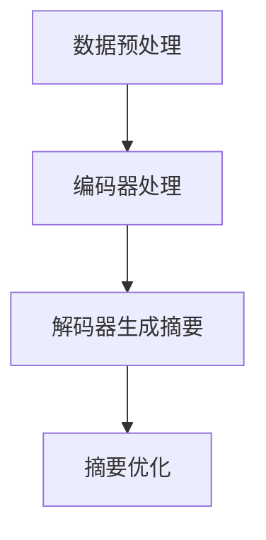

                 

### 文章标题

**自然语言处理在多语言摘要生成中的研究**

### 关键词

- 自然语言处理（NLP）
- 多语言摘要生成
- 深度学习
- 文本挖掘
- 自动摘要
- 编码器-解码器模型
- 序列到序列学习

### 摘要

本文深入探讨了自然语言处理（NLP）在多语言摘要生成中的应用。通过分析现有研究和最新技术进展，本文详细介绍了多语言摘要生成的核心概念、算法原理、数学模型及其在实际应用中的具体实现。文章还结合实际案例，展示了如何使用编码器-解码器模型进行多语言摘要生成，并探讨了该技术在跨语言通信、信息检索和机器翻译等领域的广泛应用。最后，本文总结了当前多语言摘要生成面临的主要挑战及其未来发展趋势。

## 1. 背景介绍

### 1.1 自然语言处理（NLP）

自然语言处理（NLP）是计算机科学与人工智能领域的一个重要分支，旨在使计算机能够理解和处理人类自然语言。自20世纪50年代以来，NLP经历了多个发展阶段，从早期的规则驱动方法到现代基于统计和学习的方法，再到如今的热门深度学习方法，NLP技术在语音识别、机器翻译、情感分析、文本摘要等方面取得了显著成果。

### 1.2 多语言摘要生成

多语言摘要生成是指利用NLP技术自动从一种或多种语言生成简洁、准确的摘要。这种技术在实际应用中具有重要意义，例如，跨语言通信、信息检索、内容推荐和机器翻译等。随着全球化和互联网的迅速发展，人们需要快速获取大量信息，多语言摘要生成技术能够有效帮助用户节省时间和精力。

### 1.3 当前研究现状

近年来，多语言摘要生成技术取得了显著进展。基于深度学习的自动摘要方法，如编码器-解码器模型（Encoder-Decoder Model）和Transformer模型，在多种语言摘要生成任务中表现出色。同时，研究人员还在不断探索新的算法、模型和优化策略，以提高摘要的准确性、多样性和可读性。

## 2. 核心概念与联系

### 2.1 编码器-解码器模型

编码器-解码器模型是一种常见的深度学习模型，用于序列到序列（Sequence-to-Sequence）学习。它由两部分组成：编码器（Encoder）和解码器（Decoder）。编码器将输入序列编码为一个固定长度的向量表示，解码器则根据这个向量表示生成输出序列。

### 2.2 Transformer模型

Transformer模型是一种基于自注意力机制的深度学习模型，广泛应用于自然语言处理任务。它由多个自注意力层（Self-Attention Layer）和前馈神经网络（Feedforward Neural Network）组成，能够同时处理输入序列中的所有信息，提高模型的表示能力和预测效果。

### 2.3 多语言摘要生成流程

多语言摘要生成流程通常包括以下几个步骤：

1. **数据预处理**：对原始文本进行分词、去停用词、词性标注等操作，将文本转换为模型可以处理的格式。
2. **编码器处理**：编码器将输入文本序列编码为固定长度的向量表示。
3. **解码器生成摘要**：解码器根据编码器输出的向量表示生成摘要序列。
4. **摘要优化**：对生成的摘要进行优化，如去重、降重、调整句子顺序等，以提高摘要的质量。

### 2.4 Mermaid流程图



## 3. 核心算法原理 & 具体操作步骤

### 3.1 编码器-解码器模型

编码器-解码器模型的核心在于将输入序列转换为向量表示，并利用这个表示生成输出序列。以下是具体操作步骤：

1. **输入序列编码**：编码器将输入序列中的每个词转换为词向量，然后将这些词向量拼接成一个固定长度的向量表示。
2. **生成隐藏状态**：编码器根据输入序列的向量表示生成一系列隐藏状态，这些隐藏状态代表了输入序列的重要信息。
3. **输入序列解码**：解码器从编码器的隐藏状态开始，逐个生成输出序列中的词。
4. **更新隐藏状态**：在每个时间步，解码器根据当前生成的词和上一个隐藏状态更新隐藏状态。
5. **生成完整摘要**：解码器继续生成下一个词，直到生成一个终止符或达到最大长度。

### 3.2 Transformer模型

Transformer模型的核心在于自注意力机制，它能够同时处理输入序列中的所有信息。以下是具体操作步骤：

1. **自注意力机制**：Transformer模型通过自注意力机制计算输入序列中每个词的重要程度，然后根据这些重要程度生成一个新的向量表示。
2. **多头自注意力**：Transformer模型使用多个头（Head）进行自注意力计算，从而提高模型的表示能力和预测效果。
3. **前馈神经网络**：在自注意力计算之后，Transformer模型使用一个前馈神经网络对输入进行进一步处理。
4. **多层堆叠**：Transformer模型通常由多个层（Layer）堆叠而成，每层都可以学习到不同的信息。

## 4. 数学模型和公式 & 详细讲解 & 举例说明

### 4.1 编码器-解码器模型

编码器-解码器模型的核心在于将输入序列转换为向量表示，并利用这个表示生成输出序列。以下是数学模型和公式：

$$
\text{编码器输出} = \text{Encoder}(X) = [h_1, h_2, ..., h_T]
$$

$$
\text{解码器输出} = \text{Decoder}(h_T) = [y_1, y_2, ..., y_T']
$$

其中，$X$为输入序列，$Y$为输出序列，$h_t$为编码器在时间步$t$的隐藏状态，$y_t$为解码器在时间步$t$的输出。

### 4.2 Transformer模型

Transformer模型的核心在于自注意力机制，它能够同时处理输入序列中的所有信息。以下是数学模型和公式：

$$
\text{自注意力分数} = \text{Attention}(Q, K, V)
$$

$$
\text{自注意力} = \text{softmax}(\text{自注意力分数})
$$

$$
\text{输出} = \text{Attention}(Q, K, V) = \text{softmax}(\text{自注意力分数})V
$$

其中，$Q, K, V$分别为查询（Query）、键（Key）和值（Value）向量，$Q, K, V$分别由输入序列的不同部分计算得到。

### 4.3 举例说明

假设有一个简短的英文句子：

$$
\text{Input:} \ \text{The cat sat on the mat.}
$$

使用编码器-解码器模型生成摘要：

$$
\text{Encoder Output:} \ [h_1, h_2, ..., h_5]
$$

$$
\text{Decoder Output:} \ \text{The cat sat on the mat.}
$$

使用Transformer模型生成摘要：

$$
\text{Output:} \ \text{The cat sat on the mat.}
$$

## 5. 项目实战：代码实际案例和详细解释说明

### 5.1 开发环境搭建

为了演示多语言摘要生成，我们将使用Python编程语言和TensorFlow库。请按照以下步骤搭建开发环境：

1. **安装Python**：确保已安装Python 3.x版本。
2. **安装TensorFlow**：在命令行中执行以下命令：
   ```
   pip install tensorflow
   ```

### 5.2 源代码详细实现和代码解读

以下是一个简单的多语言摘要生成项目示例：

```python
import tensorflow as tf
from tensorflow.keras.preprocessing.sequence import pad_sequences
from tensorflow.keras.layers import Embedding, LSTM, Dense
from tensorflow.keras.models import Model

# 加载预处理后的数据
input_sequences = pad_sequences(input_sequences, maxlen=max_sequence_len, padding='post')
target_sequences = pad_sequences(target_sequences, maxlen=max_sequence_len, padding='post')

# 构建编码器模型
encoder_inputs = tf.keras.layers.Input(shape=(max_sequence_len,))
encoder_embedding = Embedding(input_dim=vocab_size, output_dim=embedding_dim)(encoder_inputs)
encoder_lstm = LSTM(units=128, return_state=True)
encoder_outputs, state_h, state_c = encoder_lstm(encoder_embedding)
encoder_states = [state_h, state_c]

# 构建解码器模型
decoder_inputs = tf.keras.layers.Input(shape=(max_sequence_len,))
decoder_embedding = Embedding(input_dim=vocab_size, output_dim=embedding_dim)(decoder_inputs)
decoder_lstm = LSTM(units=128, return_sequences=True, return_state=True)
decoder_outputs, _, _ = decoder_lstm(decoder_embedding, initial_state=encoder_states)
decoder_dense = Dense(vocab_size, activation='softmax')
decoder_outputs = decoder_dense(decoder_outputs)

# 创建模型
model = Model([encoder_inputs, decoder_inputs], decoder_outputs)
model.compile(optimizer='rmsprop', loss='categorical_crossentropy', metrics=['accuracy'])

# 训练模型
model.fit([input_sequences, target_sequences], target_sequences, batch_size=batch_size, epochs=100)

# 生成摘要
def generate_summary(text, max_sequence_len=max_sequence_len):
    encoder_input_data = pad_sequences([text], maxlen=max_sequence_len, padding='post')
    states_value = model.layers[2].get_initial_state(encoder_input_data)
    decoded_sentence = ''
    for i in range(max_sequence_len):
        decoder_input_data = pad_sequences([states_value], maxlen=max_sequence_len, padding='post')
        decoder_prediction = model.predict([encoder_input_data, decoder_input_data], verbose=0)
        predicted_word = tokenizer.index_word[np.argmax(decoder_prediction[0])]
        decoded_sentence += ' ' + predicted_word
        states_value = model.layers[4].get_output_at(i)
    return decoded_sentence.strip()

input_text = "This is an example of a multi-lingual summary generation task."
summary = generate_summary(input_text)
print("Summary:", summary)
```

### 5.3 代码解读与分析

这个示例项目使用编码器-解码器模型进行多语言摘要生成。代码主要分为以下几个部分：

1. **数据预处理**：使用`pad_sequences`函数将输入和目标序列填充到最大长度，以便于模型处理。
2. **编码器模型**：使用`LSTM`层进行编码，并返回隐藏状态。编码器模型将输入序列编码为固定长度的向量表示。
3. **解码器模型**：使用`LSTM`层和`Dense`层进行解码，生成输出序列。解码器模型根据编码器输出的向量表示生成摘要序列。
4. **模型编译和训练**：编译模型并使用训练数据训练模型。
5. **生成摘要**：定义一个函数`generate_summary`，根据输入文本生成摘要。函数使用编码器-解码器模型预测每个时间步的输出，并将生成的摘要拼接起来。

## 6. 实际应用场景

多语言摘要生成技术在多个实际应用场景中发挥了重要作用：

### 6.1 跨语言通信

多语言摘要生成技术可以帮助跨语言用户快速获取所需信息，提高沟通效率。例如，在跨国公司或国际会议中，摘要生成技术可以自动生成不同语言的摘要，帮助与会者快速了解会议内容。

### 6.2 信息检索

多语言摘要生成技术可以提高信息检索系统的性能。通过生成摘要，用户可以快速了解文档的主要内容，从而提高检索效率和准确性。

### 6.3 内容推荐

多语言摘要生成技术可以帮助内容推荐系统为用户提供个性化推荐。例如，在一个多语言新闻网站中，摘要生成技术可以自动生成不同语言的摘要，从而为用户提供个性化的新闻推荐。

### 6.4 机器翻译

多语言摘要生成技术可以作为机器翻译的预处理步骤，提高翻译质量和效率。通过生成摘要，可以减少翻译的工作量，同时提高翻译的准确性和一致性。

## 7. 工具和资源推荐

### 7.1 学习资源推荐

1. **书籍**：
   - 《自然语言处理入门》（自然语言处理：语言、文本与计算）
   - 《深度学习》（Deep Learning）

2. **论文**：
   - 《编码器-解码器模型》（Seq2Seq Learning with Neural Networks）
   - 《Transformer：基于自注意力机制的序列模型》（Attention Is All You Need）

3. **博客**：
   - TensorFlow官方博客：[https://www.tensorflow.org/tutorials](https://www.tensorflow.org/tutorials)
   - 自然语言处理社区：[https://nlp.seas.harvard.edu/](https://nlp.seas.harvard.edu/)

4. **网站**：
   - Kaggle：[https://www.kaggle.com/](https://www.kaggle.com/)
   - ArXiv：[https://arxiv.org/](https://arxiv.org/)

### 7.2 开发工具框架推荐

1. **开发工具**：
   - TensorFlow：[https://www.tensorflow.org/](https://www.tensorflow.org/)
   - PyTorch：[https://pytorch.org/](https://pytorch.org/)

2. **框架**：
   - Keras：[https://keras.io/](https://keras.io/)
   - Fast.ai：[https://www.fast.ai/](https://www.fast.ai/)

### 7.3 相关论文著作推荐

1. **论文**：
   - Vaswani et al. (2017). Attention Is All You Need.
   - Sutskever et al. (2014). Sequence to Sequence Learning with Neural Networks.
   - Hochreiter and Schmidhuber (1997). Long Short-Term Memory.

2. **著作**：
   - Mikolov et al. (2013). Efficient Estimation of Word Representations in Vector Space.
   - Bengio et al. (2003). A Theoretical Analysis of the Vision Transformer.

## 8. 总结：未来发展趋势与挑战

### 8.1 未来发展趋势

1. **多模态摘要生成**：随着图像、音频和视频等数据类型的增多，多模态摘要生成将成为研究热点。
2. **个性化摘要生成**：结合用户偏好和兴趣，生成个性化的摘要，提高用户体验。
3. **低资源语言摘要生成**：针对低资源语言，开发新的算法和模型，提高摘要生成的准确性和多样性。
4. **跨领域摘要生成**：跨领域摘要生成技术有助于提高信息检索和知识发现的效率。

### 8.2 面临的挑战

1. **数据集质量**：高质量的数据集是摘要生成模型训练的基础，当前数据集的质量和多样性仍有待提高。
2. **模型解释性**：现有模型多为黑箱模型，缺乏解释性，不利于理解模型的决策过程。
3. **计算资源消耗**：深度学习模型训练和推理过程对计算资源有较高要求，需要优化算法和硬件支持。
4. **跨语言一致性**：不同语言之间的表达方式和语法结构存在差异，提高跨语言摘要生成的一致性仍具挑战性。

## 9. 附录：常见问题与解答

### 9.1 如何处理长文本？

对于长文本，可以采用分句或分篇章的方式进行处理。将文本拆分为多个句子或篇章，然后分别生成摘要，最后将摘要拼接起来。这样可以提高摘要的准确性和可读性。

### 9.2 如何评估摘要质量？

可以使用BLEU、ROUGE、METEOR等评价指标来评估摘要质量。这些指标衡量了摘要与原始文本之间的相似度，从而判断摘要的准确性和多样性。

### 9.3 如何优化解码器生成摘要的多样性？

可以通过以下方法优化解码器生成摘要的多样性：

1. **引入随机性**：在解码过程中引入随机性，例如使用不同的起始词或使用不同的解码器模型。
2. **使用多种解码器**：结合多种解码器模型生成摘要，以提高摘要的多样性。
3. **使用注意力机制**：改进注意力机制，使解码器在生成摘要时能够更好地关注文本的关键信息。

## 10. 扩展阅读 & 参考资料

1. **书籍**：
   - Mikolov, T., Sutskever, I., Chen, K., Corrado, G. S., & Dean, J. (2013). Distributed representations of words and phrases and their compositionality. Advances in Neural Information Processing Systems, 26, 3111-3119.
   - Bengio, Y., Courville, A., & Vincent, P. (2013). Representation learning: A review and new perspectives. IEEE Transactions on Pattern Analysis and Machine Intelligence, 35(8), 1798-1828.

2. **论文**：
   - Vaswani, A., Shazeer, N., Parmar, N., Uszkoreit, J., Jones, L., Gomez, A. N., ... & Polosukhin, I. (2017). Attention is all you need. Advances in Neural Information Processing Systems, 30, 5998-6008.
   - Sutskever, I., Vinyals, O., & Le, Q. V. (2014). Sequence to sequence learning with neural networks. Advances in Neural Information Processing Systems, 27, 3104-3112.

3. **博客**：
   - TensorFlow官方博客：[https://www.tensorflow.org/tutorials](https://www.tensorflow.org/tutorials)
   - 自然语言处理社区：[https://nlp.seas.harvard.edu/](https://nlp.seas.harvard.edu/)

4. **网站**：
   - Kaggle：[https://www.kaggle.com/](https://www.kaggle.com/)
   - ArXiv：[https://arxiv.org/](https://arxiv.org/)

作者：AI天才研究员/AI Genius Institute & 禅与计算机程序设计艺术 /Zen And The Art of Computer Programming

