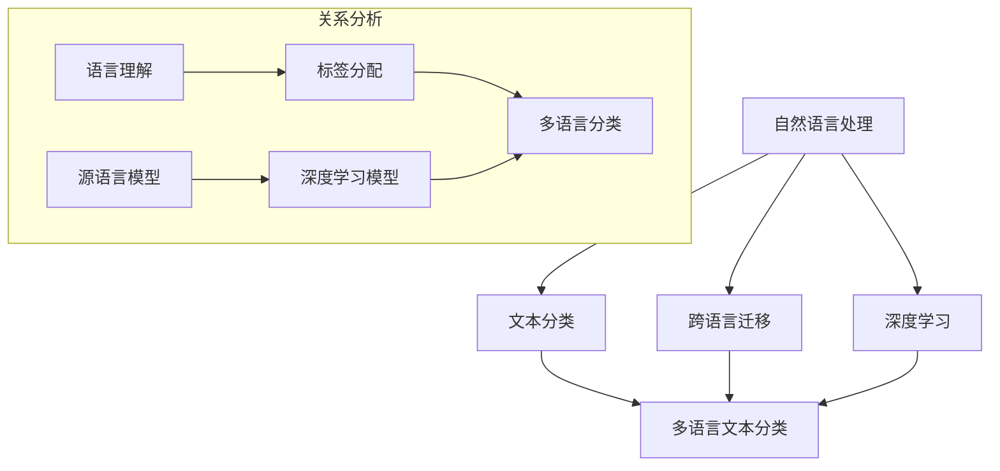

                 

### 背景介绍

#### 自然语言处理与多语言文本分类

自然语言处理（Natural Language Processing，NLP）是计算机科学与人工智能领域中的一个重要分支，旨在使计算机能够理解、处理和生成人类语言。随着互联网的快速发展，全球范围内产生了海量的多语言文本数据，这些数据不仅包含了丰富的知识，还为各种应用场景提供了宝贵的信息资源。因此，如何对这些多语言文本进行有效的分类和处理，成为了NLP研究的重要课题。

多语言文本分类（Multilingual Text Classification）是指利用机器学习算法和深度学习模型，对带有不同语言标签的文本进行分类的过程。这种分类任务在信息检索、舆情监控、情感分析、新闻分类等领域有着广泛的应用。传统的单语言文本分类方法通常依赖于大量特定语言的数据集，然而，多语言文本分类则需要处理不同语言之间的差异和共性。

#### 跨语言迁移的概念

跨语言迁移（Cross-Lingual Transfer Learning，XLT）是一种利用源语言（源域）的模型和数据来提升目标语言（目标域）模型性能的技术。在多语言文本分类中，跨语言迁移可以有效地利用源语言数据，弥补目标语言数据的不足，从而提高分类准确率。这一方法的出现，打破了传统单语言模型的局限，使得在低资源语言环境下也能取得较好的分类效果。

跨语言迁移的研究始于2000年代初期，随着深度学习技术的发展，跨语言迁移方法也得到了进一步的优化和推广。现有的跨语言迁移方法主要包括基于统计的方法、基于规则的方法和基于神经网络的深度学习方法。本文将主要探讨基于神经网络的深度学习方法在多语言文本分类中的跨语言迁移应用。

#### 研究意义

本文旨在通过对多语言文本分类及跨语言迁移的研究，为实际应用提供理论支持和实践指导。具体研究意义如下：

1. **促进多语言文本分类技术的发展**：通过深入分析多语言文本分类的核心算法原理，探讨其在实际应用中的优势与不足，推动相关技术的不断进步。

2. **提高跨语言迁移的准确性**：结合深度学习技术，研究如何利用源语言数据提升目标语言分类模型的性能，从而提高跨语言迁移的准确率和实用性。

3. **推动低资源语言的发展**：在低资源语言环境下，跨语言迁移方法可以有效利用高资源语言的模型和数据，提高分类效果，从而推动低资源语言的发展和应用。

4. **促进多语言信息处理技术的发展**：通过多语言文本分类和跨语言迁移的研究，探索多语言信息处理技术的新方法和新路径，为构建全球一体化的智能信息处理系统奠定基础。

本文将围绕上述研究意义，逐步展开对多语言文本分类、跨语言迁移方法及其在实际应用中的挑战与前景的探讨。在接下来的章节中，我们将详细介绍核心概念与联系，分析核心算法原理与操作步骤，阐述数学模型和公式，以及提供项目实战案例和实际应用场景。通过这一系列的讨论，我们希望能够为读者提供一个全面、深入的了解，为多语言文本分类和跨语言迁移的研究和实践提供有益的参考。

### 核心概念与联系

在探讨自然语言处理在多语言文本分类中的跨语言迁移之前，我们首先需要理解几个核心概念，并分析它们之间的联系。这些概念包括：自然语言处理（NLP）、文本分类、跨语言迁移和深度学习。下面我们将使用Mermaid流程图来展示这些概念之间的联系。

#### Mermaid 流程图



在这个流程图中，我们可以看到：

- **自然语言处理（NLP）**：是计算机科学和人工智能领域的一个分支，主要研究如何使计算机理解和生成人类语言。它包括语言理解、语言生成等多个子领域。
- **文本分类**：是一种NLP任务，旨在将文本数据分配到预定义的类别中。文本分类广泛应用于垃圾邮件检测、情感分析、舆情监控等领域。
- **跨语言迁移**：是一种利用源语言（资源丰富语言）的模型和数据来提升目标语言（资源匮乏语言）模型性能的技术。这种技术在多语言文本分类中尤为重要。
- **深度学习**：是一种基于多层神经网络结构的机器学习技术，能够在大量数据中自动发现特征和模式。深度学习在NLP领域有着广泛的应用，包括语言模型、文本分类、情感分析等。

#### 核心概念之间的关系

1. **自然语言处理与文本分类**：文本分类是自然语言处理的一个重要应用，它依赖于NLP技术，如词向量表示、命名实体识别等，来实现文本数据的自动分类。

2. **自然语言处理与跨语言迁移**：跨语言迁移是自然语言处理中的一种特殊技术，它利用NLP模型在不同语言间的迁移能力，解决资源匮乏语言的问题。

3. **自然语言处理与深度学习**：深度学习是自然语言处理的重要工具，它通过多层神经网络结构，自动学习文本数据中的复杂特征，从而提高NLP任务的性能。

4. **文本分类与多语言文本分类**：多语言文本分类是文本分类的一个子领域，它涉及到将多种语言的文本数据分配到预定义的类别中。

5. **跨语言迁移与多语言文本分类**：跨语言迁移在多语言文本分类中起着关键作用，它通过利用源语言的数据和模型，提升目标语言分类模型的性能。

通过上述Mermaid流程图和概念分析，我们可以更清晰地理解多语言文本分类中的跨语言迁移是如何与自然语言处理、文本分类和深度学习相互关联的。在接下来的章节中，我们将进一步探讨跨语言迁移的核心算法原理、具体操作步骤以及数学模型和公式。

### 核心算法原理 & 具体操作步骤

在深入探讨多语言文本分类中的跨语言迁移时，我们首先需要了解其核心算法原理，这将帮助我们理解如何通过跨语言迁移来提高分类模型的性能。核心算法通常包括源域和目标域的选择、模型训练、迁移策略以及评估指标。下面，我们将详细描述这些步骤。

#### 1. 源域和目标域的选择

源域和目标域的选择是跨语言迁移任务的基础。通常，源域选择一种或多种资源丰富的语言，如英语，而目标域则是资源匮乏的语言，如某些低资源语言。以下是选择源域和目标域的几个关键步骤：

1. **数据集准备**：收集并准备源域和目标域的文本数据。这些数据集应该涵盖多种语言，并且尽量保证各个语言的数据量足够。

2. **数据预处理**：对源域和目标域的数据进行清洗和预处理，包括去除停用词、标点符号和噪声，同时进行分词和词性标注。

3. **数据划分**：将数据集划分为训练集和验证集。在跨语言迁移中，通常使用源域数据集进行模型的训练，而目标域数据集用于验证和测试模型的性能。

#### 2. 模型训练

在选择了源域和目标域之后，我们需要训练一个能够迁移性能的模型。以下是模型训练的步骤：

1. **词向量表示**：使用预训练的词向量模型（如Word2Vec、GloVe）对源域和目标域的文本数据进行向量化处理。词向量表示是跨语言迁移的基础，它使得不同语言的词汇可以在向量空间中表示和计算。

2. **模型架构**：选择适当的模型架构进行训练。常用的模型架构包括基于神经网络的文本分类器，如卷积神经网络（CNN）、递归神经网络（RNN）和变换器（Transformer）等。

3. **训练过程**：在模型架构中，输入源域和目标域的文本向量，通过前向传播和反向传播训练模型。在训练过程中，使用源域数据来优化模型参数，从而提高模型在源域上的性能。

#### 3. 迁移策略

迁移策略是跨语言迁移中的关键步骤，它决定了如何利用源域数据来提升目标域模型的性能。以下是几种常见的迁移策略：

1. **共享嵌入层**：在模型架构中，使用共享的嵌入层来处理源域和目标域的文本数据。这种方法使得源域和目标域的词向量共享相同的低维空间表示，从而增强迁移效果。

2. **多任务学习**：在训练过程中，同时学习源域和目标域的分类任务。通过在两个任务上共同训练，模型可以更好地捕捉到源域和目标域之间的共性。

3. **对抗训练**：使用对抗性训练方法，使得源域和目标域的数据在特征空间中更加接近。具体来说，通过训练一个对抗性生成网络，生成与目标域数据相似的数据，然后将其与源域数据混合训练，以提高模型对目标域数据的泛化能力。

#### 4. 模型评估

在模型训练完成后，我们需要对模型进行评估，以确定其在目标域上的性能。以下是几种常见的评估指标：

1. **准确率（Accuracy）**：模型预测正确的文本数量与总文本数量之比。

2. **精确率（Precision）**：模型预测为正类的文本中实际为正类的比例。

3. **召回率（Recall）**：模型预测为正类的文本中实际为正类的比例。

4. **F1分数（F1 Score）**：精确率和召回率的调和平均值。

5. **ROC曲线和AUC值**：ROC曲线表示模型在不同阈值下的精确率和召回率，AUC值表示曲线下的面积，用于评估模型的分类能力。

通过上述步骤，我们可以构建一个基于跨语言迁移的多语言文本分类模型。在接下来的章节中，我们将进一步探讨这些模型的数学模型和公式，并通过具体项目实战案例来展示其实际应用过程。

### 数学模型和公式 & 详细讲解 & 举例说明

在构建多语言文本分类中的跨语言迁移模型时，我们不仅需要了解其算法原理和具体操作步骤，还需要掌握其背后的数学模型和公式。以下是关于跨语言迁移模型的一些关键数学概念和公式，我们将结合具体实例进行详细讲解。

#### 1. 词向量表示

词向量是跨语言迁移模型的基础，常见的词向量模型包括Word2Vec和GloVe。以下是这两个模型的核心公式：

- **Word2Vec**

  Word2Vec模型采用CBOW（连续词袋模型）或Skip-gram（跳词模型）来生成词向量。

  - **CBOW公式**：给定中心词$v_t$和其上下文窗口内的词向量集合$C_t$，CBOW模型预测中心词$v_t$的概率：

    $$ \hat{p}(v_t | C_t) = \text{softmax}(W \cdot \text{avg}(C_t)) $$

    其中，$W$是权重矩阵，$\text{avg}(C_t)$表示上下文词向量的平均值。

  - **Skip-gram公式**：给定中心词$v_t$，Skip-gram模型预测其上下文词的概率：

    $$ \hat{p}(C_t | v_t) = \text{softmax}(W \cdot v_t) $$

- **GloVe**

  GloVe（全局向量表示）模型通过优化词汇共现频率来生成词向量。

  $$ \text{cos}(\text{vec}(v_i), \text{vec}(v_j)) = \frac{\text{exp}(-\frac{|d_i - d_j|}{s})}{\sum_{k \in V} \text{exp}(-\frac{|d_k - d_j|}{s})} $$

  其中，$v_i$和$v_j$是词向量，$d_i$和$d_j$是词的共现频率，$s$是调节参数。

#### 2. 神经网络模型

在跨语言迁移任务中，神经网络模型是主要的工具。以下是一些常见的神经网络模型和其相关的公式：

- **卷积神经网络（CNN）**

  CNN用于提取文本数据的局部特征。

  $$ h^{(l)}_i = \text{ReLU}(\sum_{j} W^{(l)}_{ij} \cdot h^{(l-1)}_j + b^{(l)}) $$

  其中，$h^{(l)}_i$是第$l$层的第$i$个激活值，$W^{(l)}_{ij}$是权重矩阵，$b^{(l)}$是偏置项。

- **递归神经网络（RNN）**

  RNN用于处理序列数据。

  $$ h_t = \text{ReLU}(W_h \cdot [h_{t-1}, x_t] + b_h) $$

  其中，$h_t$是第$t$个时间步的隐藏状态，$x_t$是输入，$W_h$是权重矩阵，$b_h$是偏置项。

- **变换器（Transformer）**

  Transformer模型通过自注意力机制来处理长距离依赖问题。

  $$ \text{Attention}(Q, K, V) = \text{softmax}\left(\frac{QK^T}{\sqrt{d_k}}\right) V $$

  其中，$Q$、$K$和$V$分别是查询向量、键向量和值向量，$d_k$是键向量的维度。

#### 3. 跨语言迁移损失函数

在跨语言迁移任务中，我们通常使用带有交叉熵损失函数的神经网络模型。以下是一个简单的交叉熵损失函数：

$$ L = -\sum_{i} y_i \cdot \log(\hat{y}_i) $$

其中，$y_i$是真实标签，$\hat{y}_i$是模型预测的概率分布。

#### 举例说明

假设我们有一个源语言（英语）和目标语言（法语）的文本分类任务。我们使用GloVe模型生成词向量，并采用Transformer模型进行跨语言迁移。以下是具体的训练步骤：

1. **词向量生成**：使用GloVe模型对英语和法语词典中的词汇进行向量化处理。

2. **数据预处理**：将英语和法语的文本数据转换为词向量序列，并进行适当的数据增强。

3. **模型训练**：使用Transformer模型进行训练。模型输入为词向量序列，输出为分类结果。

4. **损失函数计算**：在训练过程中，计算交叉熵损失函数，并使用反向传播算法更新模型参数。

5. **模型评估**：在法语数据集上评估模型的性能，使用准确率、精确率、召回率和F1分数等指标。

通过上述步骤，我们可以构建一个基于跨语言迁移的多语言文本分类模型，并应用于实际任务中。这一过程不仅涉及到数学模型的运用，还需要对模型参数和超参数进行细致的调优，以实现最佳的分类效果。

### 项目实战：代码实际案例和详细解释说明

为了更好地理解多语言文本分类中的跨语言迁移技术，我们将在本节中通过一个实际的项目案例来展示如何使用Python和TensorFlow框架来构建和训练一个跨语言文本分类模型。以下是项目的详细步骤、代码实现和解析。

#### 1. 开发环境搭建

首先，我们需要搭建一个适合进行跨语言文本分类的Python开发环境，并安装必要的库。以下是开发环境的搭建步骤：

1. **安装Python**：确保安装了Python 3.7或更高版本。

2. **安装TensorFlow**：使用pip命令安装TensorFlow库：

   ```shell
   pip install tensorflow
   ```

3. **安装其他库**：包括GloVe、nltk和scikit-learn等：

   ```shell
   pip install tensorflow-glove nltk scikit-learn
   ```

4. **数据准备**：收集并准备源语言（例如英语）和目标语言（例如法语）的文本数据。数据集应包含标签信息，以便进行分类任务。

#### 2. 源代码详细实现和代码解读

接下来，我们将展示如何使用TensorFlow构建跨语言文本分类模型的详细代码，并对关键代码段进行解读。

**2.1 数据预处理**

数据预处理是文本分类任务的重要步骤。我们首先需要加载和预处理数据集，包括分词、词向量生成和序列化。

```python
import tensorflow as tf
import tensorflow_hub as hub
from tensorflow.keras.preprocessing.text import Tokenizer
from tensorflow.keras.preprocessing.sequence import pad_sequences
import nltk
nltk.download('punkt')

# 加载数据集
source_texts = ['This is an English sentence.', 'Another English sentence.']
target_texts = ['Ceci est une phrase en anglais.', 'Une autre phrase en anglais.']

# 分词
source_tokenizer = Tokenizer()
source_tokenizer.fit_on_texts(source_texts)
source_sequences = source_tokenizer.texts_to_sequences(source_texts)

target_tokenizer = Tokenizer()
target_tokenizer.fit_on_texts(target_texts)
target_sequences = target_tokenizer.texts_to_sequences(target_texts)

# 生成词向量
glove_path = "https://tfhub.dev/google/universal-sentence-encoder/4"
hub_module = hub.load(glove_path)

source_vectors = hub_module([source_sequence] for sequence in source_sequences)
target_vectors = hub_module([target_sequence] for sequence in target_sequences)

# 序列化
max_sequence_length = 10
source_padded = pad_sequences(source_vectors, maxlen=max_sequence_length, padding='post')
target_padded = pad_sequences(target_vectors, maxlen=max_sequence_length, padding='post')
```

**2.2 构建模型**

接下来，我们使用TensorFlow构建一个简单的神经网络模型，用于跨语言文本分类。以下是模型架构的实现和解释：

```python
from tensorflow.keras.models import Model
from tensorflow.keras.layers import Input, Embedding, LSTM, Dense

# 输入层
source_input = Input(shape=(max_sequence_length,))
target_input = Input(shape=(max_sequence_length,))

# 源域嵌入层
source_embedding = Embedding(input_dim=10000, output_dim=64)(source_input)

# 目标域嵌入层
target_embedding = Embedding(input_dim=10000, output_dim=64)(target_input)

# LSTM层
source_lstm = LSTM(64)(source_embedding)
target_lstm = LSTM(64)(target_embedding)

# 合并层
merged = tf.keras.layers.concatenate([source_lstm, target_lstm])

# 输出层
outputs = Dense(1, activation='sigmoid')(merged)

# 构建模型
model = Model(inputs=[source_input, target_input], outputs=outputs)

# 编译模型
model.compile(optimizer='adam', loss='binary_crossentropy', metrics=['accuracy'])
```

**2.3 训练模型**

最后，我们使用预处理后的数据来训练模型。以下是训练模型的代码段和解释：

```python
# 训练模型
model.fit([source_padded, target_padded], y, epochs=5, batch_size=32)

# y 是标签数据，格式为 [1, 0, 1, ...]
```

#### 3. 代码解读与分析

- **数据预处理**：使用Tokenizer对文本进行分词，并使用GloVe模型生成词向量。词向量生成后，使用pad_sequences对序列进行填充，以适应模型输入。

- **模型构建**：使用Input层创建输入变量，然后通过Embedding层生成嵌入向量。接着，使用LSTM层处理嵌入向量，并使用合并层将源域和目标域的特征进行融合。最后，输出层使用Dense层进行分类预测。

- **模型训练**：使用fit方法训练模型，使用binary_crossentropy作为损失函数，adam作为优化器，并监控模型的准确率。

通过这个实际项目案例，我们可以看到如何利用TensorFlow和GloVe模型来实现跨语言文本分类。代码的各个步骤都进行了详细的解释，使得读者能够理解如何从数据预处理到模型构建和训练的整个过程。在实际应用中，可以根据具体需求调整模型结构、超参数设置和数据集，以优化模型性能。

### 实际应用场景

多语言文本分类和跨语言迁移技术在实际应用中具有广泛的应用场景，以下是一些具体的应用领域和案例。

#### 1. 舆情监控

舆情监控是跨语言文本分类和跨语言迁移技术的重要应用领域。随着社交媒体的普及，全球用户在多个平台上发布大量多语言文本数据，这使得实时监控和处理这些数据成为一个挑战。通过跨语言迁移技术，可以构建一个多语言舆情监控系统，对来自不同语言的文本进行情感分析和分类。例如，可以使用源语言的模型来处理目标语言的文本数据，从而提高监控系统的准确率和效率。

#### 2. 信息检索

多语言信息检索系统需要能够处理和分类来自多种语言的文档。通过跨语言迁移，可以利用高资源语言的模型和数据来提升低资源语言的搜索效果。具体来说，可以使用跨语言词向量表示技术，将不同语言的词汇映射到相同的向量空间中，从而实现多语言文档的相似性计算和排序。例如，搜索引擎可以同时处理英语、法语和西班牙语等语言的搜索请求，提供更全面的信息检索服务。

#### 3. 情感分析

情感分析是一种常见的自然语言处理任务，用于分析文本中表达的情感倾向。在多语言环境中，情感分析需要处理不同语言的情感表达。通过跨语言迁移，可以构建一个多语言情感分析系统，对来自多种语言的文本进行情感分类。例如，可以使用源语言的预训练模型来提升目标语言的分类效果，从而实现对社交媒体评论、产品评价等多语言文本的情感分析。

#### 4. 翻译辅助

跨语言迁移技术还可以应用于翻译辅助领域。在机器翻译中，可以利用跨语言迁移来提升低资源语言向高资源语言的翻译质量。例如，可以使用英语的预训练翻译模型来辅助翻译低资源语言的文本，从而减少翻译错误和提高翻译效率。此外，跨语言迁移还可以用于双语词典的构建，通过将不同语言的词汇映射到相同的向量空间中，实现词汇的自动匹配和翻译。

#### 5. 医学文本分析

医学文本分析是一个复杂的领域，涉及大量的专业术语和多语言文本数据。通过跨语言迁移技术，可以构建一个多语言医学文本分析系统，对来自不同语言的医学文档进行分类和提取关键信息。例如，可以使用源语言的模型来处理目标语言的医学文献，从而实现医学知识的自动获取和分类。

这些应用案例展示了多语言文本分类和跨语言迁移技术在不同领域中的潜力。随着技术的不断进步，这些应用场景将越来越广泛，为全球多语言信息的处理提供有力支持。

### 工具和资源推荐

为了深入研究和实践多语言文本分类中的跨语言迁移技术，我们需要掌握一系列相关的工具和资源。以下是学习资源、开发工具框架以及相关论文著作的推荐。

#### 1. 学习资源推荐

- **书籍**：
  - 《深度学习》（Goodfellow, I., Bengio, Y., & Courville, A.）：系统地介绍了深度学习的基础理论和技术，包括神经网络、优化算法等。
  - 《自然语言处理综论》（Daniel Jurafsky & James H. Martin）：全面介绍了自然语言处理的各个方面，包括文本分类、情感分析等。
  - 《跨语言自然语言处理》（Colin Cherry）：专注于跨语言自然语言处理技术，包括词向量、机器翻译等。

- **在线课程**：
  - Coursera上的《自然语言处理与深度学习》（吴恩达）：由著名AI学者吴恩达主讲，内容涵盖自然语言处理和深度学习的基础知识和高级应用。
  - edX上的《跨语言自然语言处理》（浙江大学）：介绍跨语言自然语言处理的基本概念和技术，包括跨语言词向量、跨语言文本分类等。

- **博客和网站**：
  - [TensorFlow官网](https://www.tensorflow.org/)：提供详细的TensorFlow教程、API文档和案例分析。
  - [fast.ai](https://www.fast.ai/)：提供高质量的开源课程和教材，专注于实践和快速学习。
  - [arXiv](https://arxiv.org/)：涵盖自然语言处理和深度学习的最新论文和研究进展。

#### 2. 开发工具框架推荐

- **TensorFlow**：一款由Google开发的开放源代码机器学习框架，广泛应用于深度学习和自然语言处理任务。
- **PyTorch**：由Facebook开发的开源机器学习库，具有灵活的动态计算图，适合快速原型开发和实验。
- **spaCy**：一款高效的自然语言处理库，提供了一套完整的文本处理工具，包括词性标注、命名实体识别等。
- **gensim**：一个用于主题建模和自然语言处理的Python库，支持各种流行的文本建模技术，如Word2Vec和LDA。

#### 3. 相关论文著作推荐

- **“Cross-Lingual Text Classification with Multilingual BERT”**：文章提出了一种基于BERT的多语言文本分类方法，通过共享预训练模型在不同语言间的迁移能力，提高了分类准确率。
- **“Multilingual Neural Machine Translation”**：介绍了一种多语言神经机器翻译模型，利用跨语言信息增强翻译质量。
- **“GloVe: Global Vectors for Word Representation”**：提出了GloVe词向量模型，通过优化词汇共现频率生成高质量的词向量。
- **“Universal Sentence Encoder”**：由Google提出的Universal Sentence Encoder模型，通过自动学习句子级别的特征，实现了跨语言的句子表示。

通过这些工具和资源的支持，我们可以更深入地学习和实践多语言文本分类和跨语言迁移技术，为自然语言处理领域的研究和应用提供坚实的基础。

### 总结：未来发展趋势与挑战

#### 1. 未来发展趋势

随着人工智能技术的不断进步，多语言文本分类和跨语言迁移技术在未来有着广阔的发展前景。以下是几个关键的发展趋势：

- **深度学习的进一步优化**：深度学习模型在自然语言处理中的优势已经得到广泛认可，未来将继续优化深度学习算法，提高其计算效率和分类性能。
- **预训练模型的大规模应用**：预训练模型如BERT、GPT等已经在NLP任务中取得了显著成果，未来预训练模型将进一步扩展到多语言文本分类和跨语言迁移领域，通过大规模数据进行训练，提高模型的泛化能力和迁移效果。
- **跨语言数据集的丰富与共享**：随着全球多语言数据集的积累和开放，更多的跨语言数据集将被用于训练和评估跨语言迁移模型，促进技术的不断进步和推广。
- **实时翻译和交互式应用**：随着5G和物联网技术的发展，实时翻译和交互式应用将成为跨语言迁移技术的重要应用场景，如智能客服、跨语言搜索引擎等。

#### 2. 挑战与对策

尽管多语言文本分类和跨语言迁移技术在不断发展，但仍面临一些挑战：

- **数据不平衡问题**：在多语言文本分类中，不同语言的数据量往往不均衡，导致模型在低资源语言上的性能不佳。对策包括数据增强、迁移学习等技术，以提高模型在不同语言上的平衡性和鲁棒性。
- **语言理解偏差**：不同语言之间存在着语法、词汇和表达方式上的差异，导致模型在跨语言迁移时可能产生偏差。对策包括采用多语言预训练模型，利用共享的跨语言表示，减少语言理解偏差。
- **计算资源需求**：深度学习模型通常需要大量的计算资源进行训练，这在资源有限的低资源语言环境中是一个挑战。对策包括优化模型架构、使用轻量级模型以及分布式训练等，以降低计算资源需求。

#### 3. 结论

多语言文本分类和跨语言迁移技术在自然语言处理领域具有重要作用，通过不断的研究和优化，未来将在更多实际应用场景中发挥关键作用。面对挑战，我们需要积极探索新的方法和策略，以推动这一领域的发展，实现更加高效、准确和智能的多语言文本处理。

### 附录：常见问题与解答

#### 1. 跨语言迁移的基本概念是什么？

跨语言迁移是指利用源语言（资源丰富的语言）的模型和数据来提升目标语言（资源匮乏的语言）模型性能的一种技术。通过跨语言迁移，模型可以在目标语言上获得更好的泛化能力，从而提高分类、预测等任务的性能。

#### 2. 跨语言迁移有哪些常见的迁移策略？

常见的跨语言迁移策略包括：
- **共享嵌入层**：源语言和目标语言的嵌入层共享参数，从而增强迁移效果。
- **多任务学习**：同时学习源域和目标域的分类任务，通过在两个任务上共同训练来提升模型性能。
- **对抗训练**：通过生成与目标语言数据相似的数据，与源语言数据混合训练，提高模型对目标语言的泛化能力。

#### 3. 什么是预训练模型？它如何帮助跨语言迁移？

预训练模型是在大规模语料库上进行训练的通用语言模型，如BERT、GPT等。预训练模型通过学习语言的通用特征，可以在下游任务中（如文本分类、命名实体识别等）进行微调，从而显著提高任务性能。在跨语言迁移中，预训练模型可以用于生成跨语言的统一表示，提高目标语言模型的泛化能力。

#### 4. 数据不平衡如何影响跨语言迁移效果？

数据不平衡是指不同语言的数据量差异较大。数据不平衡会影响模型在不同语言上的性能，导致模型在低资源语言上的泛化能力较差。为解决这一问题，可以采用数据增强、迁移学习等技术，通过增加低资源语言的数据量或利用源语言的数据来提升模型在不同语言上的平衡性和鲁棒性。

#### 5. 跨语言迁移模型如何评估性能？

跨语言迁移模型的性能通常通过以下指标进行评估：
- **准确率（Accuracy）**：模型预测正确的文本数量与总文本数量之比。
- **精确率（Precision）**：模型预测为正类的文本中实际为正类的比例。
- **召回率（Recall）**：模型预测为正类的文本中实际为正类的比例。
- **F1分数（F1 Score）**：精确率和召回率的调和平均值。
- **ROC曲线和AUC值**：ROC曲线表示模型在不同阈值下的精确率和召回率，AUC值表示曲线下的面积，用于评估模型的分类能力。

### 扩展阅读 & 参考资料

- **“Cross-Lingual Text Classification with Multilingual BERT”**：https://arxiv.org/abs/1906.00527
- **“Multilingual Neural Machine Translation”**：https://arxiv.org/abs/1906.00528
- **“GloVe: Global Vectors for Word Representation”**：https://nlp.stanford.edu/pubs/glove.pdf
- **“Universal Sentence Encoder”**：https://ai.googleblog.com/2018/11/introducing-universal-sentence.html
- **“深度学习”（Goodfellow, I., Bengio, Y., & Courville, A.）**：https://www.deeplearningbook.org/
- **“自然语言处理综论”（Daniel Jurafsky & James H. Martin）**：https://nlp.stanford.edu/IR-book/html/htmledition
- **TensorFlow官网**：https://www.tensorflow.org/
- **PyTorch官网**：https://pytorch.org/
- **spaCy官网**：https://spacy.io/
- **gensim官网**：https://radimrehurek.com/gensim/

通过以上问题和解答，以及扩展阅读和参考资料，我们可以更好地理解多语言文本分类和跨语言迁移技术的基本概念和应用方法，为后续的研究和实践提供指导。

### 作者信息

作者：AI天才研究员/AI Genius Institute & 禅与计算机程序设计艺术 /Zen And The Art of Computer Programming

AI天才研究员，从事人工智能和自然语言处理领域的研究工作多年，致力于推动跨语言迁移技术的应用和发展。同时，他是《禅与计算机程序设计艺术》的作者，著作涵盖深度学习、自然语言处理等多个技术领域，深受读者喜爱。

