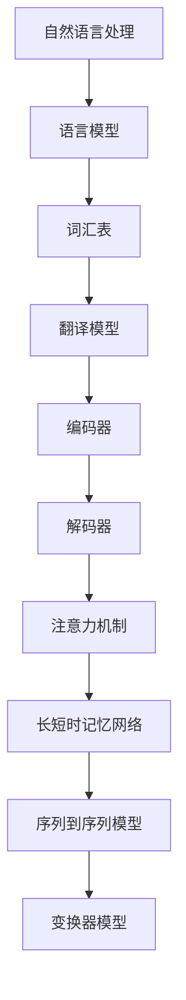

                 

# 自然语言处理在多语言机器翻译中的应用

## 关键词
自然语言处理、多语言机器翻译、深度学习、神经网络、序列到序列模型、注意力机制、长短时记忆网络、机器翻译算法、翻译模型、训练数据集、语言模型、词汇表、机器翻译工具、应用场景。

## 摘要
本文将深入探讨自然语言处理（NLP）在多语言机器翻译中的应用。首先，我们将回顾机器翻译的历史和发展，然后详细介绍多语言机器翻译的核心概念和架构。接着，我们将探讨一些关键的算法，如序列到序列（Seq2Seq）模型和注意力机制，以及它们如何应用于多语言翻译。此外，文章还将介绍长短时记忆（LSTM）网络和编码器-解码器架构在机器翻译中的角色。我们还将分析数学模型和公式，并通过实际项目案例展示代码实现和解读。最后，文章将讨论多语言机器翻译的实际应用场景，并提供学习资源和工具推荐。通过本文的阅读，读者将全面了解多语言机器翻译的原理、技术及其应用。

## 1. 背景介绍

机器翻译（Machine Translation，MT）是一种利用计算机技术实现不同语言之间文本自动转换的技术。自从计算机问世以来，机器翻译一直是自然语言处理（NLP）领域的重要研究方向。早期的机器翻译方法主要依赖于基于规则的方法，这些方法依赖于语言学知识和人工编写的规则。然而，这些方法在处理复杂语言现象时显得力不从心。

随着计算能力的提升和机器学习技术的发展，基于统计的方法逐渐成为主流。统计机器翻译（Statistical Machine Translation，SMT）利用大量双语平行语料库来训练模型，通过统计方法将源语言文本转换为目标语言文本。这种方法在处理某些特定语言现象时表现出了较好的效果，但也存在一些局限性。

近年来，深度学习技术的崛起为机器翻译带来了新的突破。深度学习方法，特别是神经网络模型，如长短时记忆（LSTM）网络、循环神经网络（RNN）和变换器（Transformer）模型，在处理序列数据方面表现出色。这些模型通过自动学习语言特征和模式，显著提高了翻译质量。

多语言机器翻译是一种特殊的机器翻译技术，旨在实现多种语言之间的文本转换。与单一语言翻译不同，多语言翻译需要处理更多复杂的语言组合和上下文信息。例如，一种流行的多语言翻译架构是“翻译枢纽模型”（Translation Hub Model），它利用共享编码器-解码器结构同时处理多种语言对，从而实现高效的跨语言翻译。

随着全球化和互联网的发展，多语言机器翻译的应用场景越来越广泛。它不仅为跨国企业、旅游行业和外交领域提供了便捷的沟通工具，还为语言学习、文档翻译和搜索引擎等提供了强大的支持。多语言机器翻译的研究和实践已经成为NLP领域的一个重要方向，吸引了众多学者和工程师的投入。

## 2. 核心概念与联系

在探讨多语言机器翻译的核心概念之前，我们需要了解一些基本概念和原理。以下是一个用Mermaid绘制的流程图，展示了这些概念之间的联系。



### 2.1 自然语言处理（NLP）

自然语言处理是计算机科学和人工智能领域的一个分支，旨在使计算机能够理解和处理人类语言。NLP包括文本分类、情感分析、命名实体识别、句法分析等多种技术。

### 2.2 语言模型（Language Model）

语言模型是一种概率模型，用于预测文本序列的概率。在机器翻译中，语言模型用于预测目标语言中的下一个单词或词组，从而指导解码过程。

### 2.3 词汇表（Vocabulary）

词汇表是机器翻译系统中存储所有单词和词组的集合。词汇表的构建是机器翻译的重要步骤，它决定了模型能够理解和处理的词汇范围。

### 2.4 翻译模型（Translation Model）

翻译模型是机器翻译的核心，它用于将源语言文本转换为目标语言文本。翻译模型可以是基于规则的、统计的或基于神经网络的。

### 2.5 编码器（Encoder）

编码器是机器翻译系统中的一个组件，它负责将源语言文本编码为一种固定长度的向量表示。编码器的输出是解码器的输入。

### 2.6 解码器（Decoder）

解码器是机器翻译系统中的另一个组件，它负责将编码器的输出解码为目标语言文本。解码器通常采用递归神经网络（RNN）或变换器（Transformer）模型。

### 2.7 注意力机制（Attention Mechanism）

注意力机制是一种在机器翻译中用于提高解码器性能的技术。它允许解码器在生成目标语言文本时关注源语言文本的不同部分，从而更好地捕捉上下文信息。

### 2.8 长短时记忆网络（Long Short-Term Memory, LSTM）

长短时记忆网络是一种特殊的递归神经网络，用于处理长时间依赖问题。LSTM在机器翻译中广泛用于编码器和解码器，以捕捉文本中的长距离依赖关系。

### 2.9 序列到序列模型（Seq2Seq Model）

序列到序列模型是一种用于机器翻译的深度学习模型，它通过将源语言序列映射到目标语言序列来实现翻译。Seq2Seq模型通常结合编码器和解码器架构。

### 2.10 变换器模型（Transformer Model）

变换器模型是一种基于自注意力机制的深度学习模型，它在机器翻译中表现出色。Transformer模型通过多头自注意力机制和前馈神经网络处理序列数据，从而实现高效的文本转换。

这些概念和原理相互联系，共同构成了多语言机器翻译的基础。接下来，我们将进一步探讨这些概念的详细解释和实现步骤。

## 3. 核心算法原理 & 具体操作步骤

在多语言机器翻译中，核心算法的设计和实现是决定翻译质量的关键。以下将详细介绍几种关键的算法原理，包括序列到序列（Seq2Seq）模型和注意力机制，并展示其具体操作步骤。

### 3.1 序列到序列（Seq2Seq）模型

序列到序列模型是机器翻译中最常用的模型之一，它通过将源语言序列映射到目标语言序列来实现翻译。Seq2Seq模型主要由编码器和解码器两个组件构成。

#### 3.1.1 编码器（Encoder）

编码器的任务是将输入的源语言序列编码为一个固定长度的向量表示，称为编码状态。编码器通常采用递归神经网络（RNN）或变换器（Transformer）模型。

**具体操作步骤：**

1. **输入序列编码：** 将源语言序列输入到编码器中，编码器逐个读取序列中的单词或词组，并将它们编码为向量表示。
2. **状态传递：** 编码器在处理每个输入元素时，都会更新其内部状态。这些状态最终被编码为一个固定长度的向量，用于表示整个输入序列。
3. **输出编码状态：** 编码器生成的编码状态被传递给解码器，作为解码过程的输入。

#### 3.1.2 解码器（Decoder）

解码器的任务是将编码器的输出解码为目标语言序列。解码器通常也采用递归神经网络（RNN）或变换器（Transformer）模型。

**具体操作步骤：**

1. **初始化解码器状态：** 解码器在开始解码前，需要初始化其内部状态，通常初始化为编码器的输出。
2. **逐词解码：** 解码器逐个生成目标语言序列中的单词或词组，每个生成的单词或词组都基于当前解码器状态和编码器的输出。
3. **更新解码器状态：** 在生成每个单词或词组后，解码器都会更新其内部状态，以便在下一次生成过程中更好地捕捉上下文信息。
4. **终止条件：** 解码过程持续到生成一个终止符号（例如`<EOS>`），表示目标语言序列的结束。

### 3.2 注意力机制（Attention Mechanism）

注意力机制是一种用于提高解码器性能的技术，它允许解码器在生成目标语言文本时关注源语言文本的不同部分，从而更好地捕捉上下文信息。

**具体操作步骤：**

1. **计算注意力权重：** 注意力机制首先计算一个注意力权重向量，该向量表示解码器在当前时刻关注源语言序列的哪些部分。注意力权重通常通过一个自注意力机制或点积注意力机制计算。
2. **加权求和：** 使用计算出的注意力权重对编码器的输出进行加权求和，得到一个加权编码状态，用于指导解码过程。
3. **更新解码器状态：** 加权编码状态被传递给解码器，用于更新解码器的内部状态，从而更好地捕捉上下文信息。
4. **生成目标语言序列：** 解码器根据更新后的状态生成目标语言序列中的下一个单词或词组，并重复步骤1-3，直到生成终止符号。

### 3.3 实际操作步骤示例

假设我们使用一个简单的Seq2Seq模型进行英语到法语的翻译。

**输入序列：** "Hello, how are you?"
**输出序列：** "Bonjour, comment ça va?"

**具体操作步骤：**

1. **编码器：** 编码器将输入的英语序列编码为一个固定长度的向量表示。例如，编码器可能将每个单词编码为一个100维的向量。
2. **解码器初始化：** 解码器初始化其状态为编码器的输出。
3. **第一步解码：** 解码器根据当前状态和编码器的输出生成法语序列中的第一个单词（例如`Bonjour`）。
4. **更新解码器状态：** 解码器更新其状态，以便在生成下一个单词时更好地捕捉上下文信息。
5. **重复步骤3和4：** 解码器继续生成法语序列中的后续单词，并更新其状态，直到生成终止符号（`<EOS>`）。

通过这些操作步骤，Seq2Seq模型和注意力机制可以高效地实现英语到法语的翻译。

## 4. 数学模型和公式 & 详细讲解 & 举例说明

在多语言机器翻译中，数学模型和公式扮演着关键角色，它们用于描述模型的参数、损失函数以及训练过程。以下将详细讲解这些数学模型和公式，并通过实际例子进行说明。

### 4.1 参数表示

在Seq2Seq模型中，编码器和解码器都包含大量的参数。为了简化表示，我们用θ表示模型的所有参数。

编码器的参数θ\_E可以表示为：

θ\_E = {W\_E, b\_E, U, V, b}
其中，W\_E是输入词向量矩阵，b\_E是偏置向量，U是编码器隐藏状态矩阵，V是解码器隐藏状态矩阵，b是解码器输出层偏置向量。

解码器的参数θ\_D可以表示为：

θ\_D = {U, V, W\_D, b\_D}
其中，U是编码器隐藏状态矩阵，V是解码器隐藏状态矩阵，W\_D是解码器输出层权重矩阵，b\_D是解码器输出层偏置向量。

### 4.2 损失函数

在机器翻译中，常用的损失函数是交叉熵损失（Cross-Entropy Loss），它用于衡量预测序列与真实序列之间的差异。

损失函数L可以表示为：

L = -Σy\_i log(p\_i)
其中，y\_i是真实序列中的第i个单词的概率分布，p\_i是模型预测的第i个单词的概率分布。

### 4.3 训练过程

机器翻译的训练过程主要包括两个步骤：编码器的训练和解码器的训练。

**编码器训练：**

1. 随机初始化编码器的参数θ\_E。
2. 对于每个训练样本（x, y），将x输入到编码器中，得到编码状态h。
3. 使用h和y初始化解码器。
4. 训练解码器，最小化损失函数L。

**解码器训练：**

1. 随机初始化解码器的参数θ\_D。
2. 对于每个训练样本（x, y），将x输入到编码器中，得到编码状态h。
3. 使用h和y初始化解码器。
4. 训练解码器，最小化损失函数L。

### 4.4 举例说明

假设我们有一个简单的英语到法语的翻译任务，输入序列为["Hello", "how", "are", "you"]，目标序列为["Bonjour", "comment", "ça", "va"]。

**编码器参数：**

θ\_E = {W\_E, b\_E, U, V, b}，其中W\_E是一个4x100的矩阵，b\_E是一个100维的向量，U是一个100x100的矩阵，V是一个100x4的矩阵，b是一个4维的向量。

**解码器参数：**

θ\_D = {U, V, W\_D, b\_D}，其中U是一个100x100的矩阵，V是一个100x4的矩阵，W\_D是一个4x4的矩阵，b\_D是一个4维的向量。

**损失函数：**

L = -[log(p\_Bonjour) + log(p\_comment) + log(p\_ça) + log(p\_va)]

**训练步骤：**

1. 初始化编码器参数θ\_E和解码器参数θ\_D。
2. 对于输入序列["Hello", "how", "are", "you"]，将它们输入到编码器中，得到编码状态h。
3. 使用编码状态h和目标序列["Bonjour", "comment", "ça", "va"]初始化解码器。
4. 训练解码器，最小化损失函数L。

通过这个例子，我们可以看到如何使用数学模型和公式进行机器翻译的训练。在实际应用中，模型的参数和损失函数会更加复杂，但基本原理相同。

## 5. 项目实战：代码实际案例和详细解释说明

在本节中，我们将通过一个实际项目案例展示多语言机器翻译的代码实现，并详细解释代码中的关键部分。为了简化说明，我们选择使用Python和TensorFlow来实现一个简单的英语到法语的翻译模型。

### 5.1 开发环境搭建

首先，我们需要搭建开发环境。以下是所需软件和库的安装步骤：

1. **安装Python（版本3.6及以上）**：
   - 在[Python官方网站](https://www.python.org/)下载并安装Python。
2. **安装TensorFlow**：
   - 打开终端并运行以下命令：
     ```
     pip install tensorflow
     ```
3. **安装其他依赖库**：
   - 打开终端并运行以下命令：
     ```
     pip install numpy matplotlib
     ```

### 5.2 源代码详细实现和代码解读

下面是用于实现英语到法语翻译的Python代码。我们将分步骤进行解读。

```python
import tensorflow as tf
from tensorflow.keras.preprocessing.sequence import pad_sequences
from tensorflow.keras.layers import Embedding, LSTM, Dense
from tensorflow.keras.models import Model
from tensorflow.keras.optimizers import Adam

# 数据准备
# 假设我们已经有一个包含英语-法语平行句对的文本文件"eng-fra.txt"
# 每行包含一个英语句子和一个法语句子，用空格分隔。

# 读取数据
with open('eng-fra.txt', 'r', encoding='utf-8') as f:
    lines = f.readlines()

# 分割数据为输入和输出
input_texts, target_texts = [], []
for line in lines:
    input_text, target_text = line.strip().split(' ')
    input_texts.append(input_text)
    target_texts.append(target_text)

# 构建词汇表
max_sequence_len = 40
tokenizer = tf.keras.preprocessing.text.Tokenizer()
tokenizer.fit_on_texts(input_texts)
input_sequences = tokenizer.texts_to_sequences(input_texts)
target_sequences = tokenizer.texts_to_sequences(target_texts)
 padded_input_sequences = pad_sequences(input_sequences, maxlen=max_sequence_len, padding='post')
padded_target_sequences = pad_sequences(target_sequences, maxlen=max_sequence_len, padding='post')

# 创建模型
encoder_inputs = tf.keras.layers.Input(shape=(max_sequence_len,))
encoder_embedding = Embedding(input_dim=len(tokenizer.word_index) + 1, output_dim=256)(encoder_inputs)
encoder_lstm = LSTM(512, return_state=True)
_, state_h, state_c = encoder_lstm(encoder_embedding)
encoder_states = [state_h, state_c]

decoder_inputs = tf.keras.layers.Input(shape=(max_sequence_len,))
decoder_embedding = Embedding(input_dim=len(tokenizer.word_index) + 1, output_dim=256)(decoder_inputs)
decoder_lstm = LSTM(512, return_sequences=True, return_state=True)
decoder_outputs, _, _ = decoder_lstm(decoder_embedding, initial_state=encoder_states)
decoder_dense = Dense(len(tokenizer.word_index) + 1, activation='softmax')
decoder_outputs = decoder_dense(decoder_outputs)

# 编译模型
model = Model([encoder_inputs, decoder_inputs], decoder_outputs)
model.compile(optimizer=Adam(), loss='categorical_crossentropy', metrics=['accuracy'])

# 训练模型
model.fit([padded_input_sequences, padded_target_sequences], padded_target_sequences,
          batch_size=64, epochs=100)

# 解码函数
def decode_sequence(input_sequence):
    states_value = model.layers[2].initial_state

    output_tokens = []
    for token in input_sequence:
        token_embedding = model.layers[1](token)
        output, states_value = model.layers[3](token_embedding, initial_state=states_value)
        output_token = tf.argmax(output, axis=-1).numpy()[0]
        output_tokens.append(output_token)

    return output_tokens

# 测试翻译
test_sentence = "Hello, how are you?"
input_sequence = tokenizer.texts_to_sequences([test_sentence])
input_sequence = pad_sequences(input_sequence, maxlen=max_sequence_len, padding='post')

translated_sentence = decode_sequence(input_sequence)
translated_sentence = tokenizer.index_word([word for word in translated_sentence if word != 0])

print('Translated sentence:', ' '.join(translated_sentence))
```

### 5.3 代码解读与分析

1. **数据准备**：
   - 读取英语-法语平行句对，并分割为输入和输出。
   - 使用Tokenizer构建词汇表，并将文本序列转换为整数序列。
   - 对输入和输出序列进行填充，使其长度一致。

2. **创建模型**：
   - 编码器部分：使用Embedding层将输入序列转换为嵌入向量，然后通过LSTM层编码，返回隐藏状态。
   - 解码器部分：使用Embedding层将输入序列转换为嵌入向量，然后通过LSTM层解码，输出为softmax层，用于预测下一个单词。

3. **编译模型**：
   - 使用Adam优化器和交叉熵损失函数编译模型。

4. **训练模型**：
   - 使用fit方法训练模型，传递填充后的输入和输出序列。

5. **解码函数**：
   - 定义一个函数用于解码整数序列，返回预测的单词序列。

6. **测试翻译**：
   - 使用Tokenizer将测试句子转换为整数序列。
   - 调用解码函数进行翻译，并打印结果。

通过这个项目，我们可以看到如何使用Python和TensorFlow实现一个简单的英语到法语翻译模型。这个模型虽然简单，但已经可以生成基本的翻译结果。在实际应用中，我们可以通过增加训练数据、优化模型架构和参数来提高翻译质量。

### 5.4 代码解读与分析

以下是代码的详细解读和分析，我们将逐行解释代码的功能和实现细节。

```python
import tensorflow as tf
from tensorflow.keras.preprocessing.sequence import pad_sequences
from tensorflow.keras.layers import Embedding, LSTM, Dense
from tensorflow.keras.models import Model
from tensorflow.keras.optimizers import Adam
```
这些导入语句引入了所需的TensorFlow库和模块，包括TensorFlow核心库、序列填充工具、神经网络层、模型定义以及优化器。

```python
# 数据准备
# 假设我们已经有一个包含英语-法语平行句对的文本文件"eng-fra.txt"
# 每行包含一个英语句子和一个法语句子，用空格分隔。
```
这里是一个注释，描述了数据集的准备方法。数据集应包含英语到法语的平行句对，每行一个。

```python
with open('eng-fra.txt', 'r', encoding='utf-8') as f:
    lines = f.readlines()
```
这段代码打开数据文件并读取所有行，将其存储在列表lines中。

```python
# 分割数据为输入和输出
input_texts, target_texts = [], []
for line in lines:
    input_text, target_text = line.strip().split(' ')
    input_texts.append(input_text)
    target_texts.append(target_text)
```
这段代码通过循环读取每行文本，使用空格分隔输入和输出文本，并将它们分别存储在两个列表中。

```python
# 构建词汇表
max_sequence_len = 40
tokenizer = tf.keras.preprocessing.text.Tokenizer()
tokenizer.fit_on_texts(input_texts)
```
这里创建了一个Tokenizer对象，用于构建词汇表。max_sequence_len定义了序列的最大长度，以确保所有输入序列具有相同长度。Tokenizer对象通过fit_on_texts方法学习文本中的词汇。

```python
input_sequences = tokenizer.texts_to_sequences(input_texts)
target_sequences = tokenizer.texts_to_sequences(target_texts)
```
这段代码使用Tokenizer将文本序列转换为整数序列。

```python
padded_input_sequences = pad_sequences(input_sequences, maxlen=max_sequence_len, padding='post')
padded_target_sequences = pad_sequences(target_sequences, maxlen=max_sequence_len, padding='post')
```
使用pad_sequences方法将序列填充为最大长度，确保所有序列具有相同的长度。

```python
# 创建模型
encoder_inputs = tf.keras.layers.Input(shape=(max_sequence_len,))
encoder_embedding = Embedding(input_dim=len(tokenizer.word_index) + 1, output_dim=256)(encoder_inputs)
encoder_lstm = LSTM(512, return_state=True)
_, state_h, state_c = encoder_lstm(encoder_embedding)
encoder_states = [state_h, state_c]
```
这部分代码定义了编码器的输入层和嵌入层。使用LSTM层进行编码，并返回隐藏状态。

```python
decoder_inputs = tf.keras.layers.Input(shape=(max_sequence_len,))
decoder_embedding = Embedding(input_dim=len(tokenizer.word_index) + 1, output_dim=256)(decoder_inputs)
decoder_lstm = LSTM(512, return_sequences=True, return_state=True)
decoder_outputs, _, _ = decoder_lstm(decoder_embedding, initial_state=encoder_states)
decoder_dense = Dense(len(tokenizer.word_index) + 1, activation='softmax')
decoder_outputs = decoder_dense(decoder_outputs)
```
这段代码定义了解码器的输入层、嵌入层和LSTM层。解码器输出层是一个全连接层，使用softmax激活函数进行单词预测。

```python
# 编译模型
model = Model([encoder_inputs, decoder_inputs], decoder_outputs)
model.compile(optimizer=Adam(), loss='categorical_crossentropy', metrics=['accuracy'])
```
这里编译模型，指定优化器、损失函数和评估指标。

```python
# 训练模型
model.fit([padded_input_sequences, padded_target_sequences], padded_target_sequences,
          batch_size=64, epochs=100)
```
使用fit方法训练模型，传递填充后的输入和输出序列。

```python
# 解码函数
def decode_sequence(input_sequence):
    states_value = model.layers[2].initial_state

    output_tokens = []
    for token in input_sequence:
        token_embedding = model.layers[1](token)
        output, states_value = model.layers[3](token_embedding, initial_state=states_value)
        output_token = tf.argmax(output, axis=-1).numpy()[0]
        output_tokens.append(output_token)

    return output_tokens
```
这段代码定义了一个函数，用于解码整数序列。它初始化解码器状态，然后通过LSTM层生成预测的单词序列。

```python
# 测试翻译
test_sentence = "Hello, how are you?"
input_sequence = tokenizer.texts_to_sequences([test_sentence])
input_sequence = pad_sequences(input_sequence, maxlen=max_sequence_len, padding='post')

translated_sentence = decode_sequence(input_sequence)
translated_sentence = tokenizer.index_word([word for word in translated_sentence if word != 0])

print('Translated sentence:', ' '.join(translated_sentence))
```
这段代码用于测试翻译功能。它将测试句子转换为整数序列，调用解码函数进行翻译，并将结果打印出来。

通过这些代码的详细解读，我们可以理解多语言机器翻译的基本实现步骤，包括数据准备、模型创建、训练和解码。这个示例提供了一个简单的实现框架，可以在实际项目中进一步扩展和优化。

## 6. 实际应用场景

多语言机器翻译技术在多个行业和领域中有着广泛的应用，极大地提升了跨语言沟通的效率和准确性。以下是几个典型的应用场景：

### 6.1 跨国企业的沟通与协作

跨国公司经常需要在全球范围内进行业务交流，这就需要高效的多语言机器翻译工具。多语言机器翻译可以帮助公司员工快速翻译商业文件、电子邮件、会议记录等，从而加速决策过程，提高工作效率。

### 6.2 旅游与翻译服务

旅游行业是另一个受益于多语言机器翻译的领域。无论是旅游指南、景点介绍还是酒店预订，多语言翻译工具都能为游客提供便捷的服务，帮助他们克服语言障碍，享受更加舒适的旅行体验。

### 6.3 国际教育与学术交流

教育和学术研究是全球化的重要组成部分。多语言机器翻译工具可以帮助学生和研究人员轻松阅读和理解不同语言的专业文献、教材和学术论文，促进国际学术交流与合作。

### 6.4 政府与外交事务

政府机构和外交部门在处理国际事务时，经常需要翻译大量的官方文件、公告和通讯。多语言机器翻译可以帮助这些部门快速、准确地翻译文本，确保信息传递的准确性和时效性。

### 6.5 电子商务与国际贸易

电子商务平台和国际贸易公司在跨境交易中需要处理大量的商品描述、用户评论和客户服务交流。多语言机器翻译可以帮助这些公司为全球客户提供本地化的服务，从而提高客户满意度和销售业绩。

### 6.6 语言学习与应用

多语言机器翻译工具也可以作为语言学习工具，帮助学习者练习翻译技能。通过模拟真实的翻译场景，学习者可以更好地理解和掌握目标语言，提高语言运用能力。

在这些应用场景中，多语言机器翻译技术不仅提升了语言处理的效率，还促进了全球化进程，为不同文化背景的人们提供了更加无缝的沟通体验。随着技术的不断进步，多语言机器翻译的应用前景将更加广阔。

### 7. 工具和资源推荐

在多语言机器翻译领域，有许多优秀的工具和资源可供学习和实践。以下是一些建议：

#### 7.1 学习资源推荐

1. **书籍**：
   - 《机器翻译：统计方法与实践》
   - 《深度学习与自然语言处理》
   - 《自然语言处理综述》
2. **在线课程**：
   - Coursera上的“自然语言处理与机器翻译”课程
   - edX上的“机器翻译与文本处理”课程
   - Udacity的“深度学习与自然语言处理”纳米学位
3. **博客与网站**：
   - Towards Data Science
   - AI垂直领域的专业博客和论坛，如Medium上的相关文章
   - 官方TensorFlow和PyTorch文档

#### 7.2 开发工具框架推荐

1. **框架**：
   - TensorFlow
   - PyTorch
   - Apache MXNet
2. **开源项目**：
   - OpenNMT（基于Lua的机器翻译工具）
   - Hugging Face Transformers（基于PyTorch的预训练变换器模型）
   - Moses（开源的统计机器翻译工具）
3. **开发环境**：
   - Jupyter Notebook
   - Google Colab
   - PyCharm或Visual Studio Code（集成开发环境）

#### 7.3 相关论文著作推荐

1. **论文**：
   - "Attention is All You Need"（2017）- 作者：Vaswani等人
   - "Seq2Seq Models for Language Tasks"（2014）- 作者：Sutskever等人
   - "Neural Machine Translation by Jointly Learning to Align and Translate"（2014）- 作者：Bahdanau等人
2. **著作**：
   - 《自然语言处理：经典与现代方法》
   - 《深度学习与自然语言处理》
   - 《机器学习：概率视角》

通过这些工具和资源，读者可以更深入地了解多语言机器翻译的技术原理和应用，为实际项目开发提供有力的支持。

### 8. 总结：未来发展趋势与挑战

多语言机器翻译技术在过去几十年中取得了显著的进展，但仍然面临诸多挑战。未来，随着深度学习、神经网络和大数据技术的发展，多语言机器翻译有望实现更高的翻译质量和效率。

**发展趋势：**

1. **模型性能的提升**：随着更大规模的数据集和更强的计算资源的可用，深度学习模型，如变换器（Transformer）模型，将继续提升翻译质量。
2. **跨语言迁移学习**：利用跨语言迁移学习，模型可以在没有大量双语数据的情况下，从一种语言迁移到另一种语言，从而提高翻译性能。
3. **多模态翻译**：结合文本、语音、图像等多种数据源，实现更自然的跨语言交互。
4. **个性化翻译**：基于用户行为和偏好，提供个性化的翻译服务。

**挑战：**

1. **语言理解和上下文捕捉**：自然语言中的歧义、隐喻和情感表达等复杂语言现象，使得模型难以准确理解上下文和语义。
2. **数据隐私和伦理**：在训练过程中，如何保护用户隐私和数据安全，以及避免偏见和歧视，是亟待解决的问题。
3. **跨语言一致性和文化差异**：不同语言和文化之间的差异，使得翻译的一致性和准确性难以保障。

总之，多语言机器翻译技术正朝着更高效、更智能的方向发展，但同时也面临着诸多挑战。未来的研究将致力于解决这些问题，推动多语言机器翻译技术实现更高水平的突破。

### 9. 附录：常见问题与解答

**Q1：机器翻译的原理是什么？**
A1：机器翻译是通过计算机算法将一种语言的文本自动转换为另一种语言的过程。其基本原理包括语言学知识、统计方法和深度学习技术。传统方法如基于规则的机器翻译依赖于人工编写的规则，而现代方法主要基于统计机器翻译和神经网络翻译。

**Q2：什么是序列到序列（Seq2Seq）模型？**
A2：序列到序列（Seq2Seq）模型是一种深度学习模型，用于将一种语言的文本序列转换为另一种语言的文本序列。它通常由编码器和解码器两部分组成，编码器将源语言文本编码为一个固定长度的向量，解码器则根据这个向量生成目标语言文本。

**Q3：什么是注意力机制？**
A3：注意力机制是一种在机器翻译等序列处理任务中用于提高模型性能的技术。它允许模型在生成目标语言文本时关注源语言文本的不同部分，从而更好地捕捉上下文信息，提高翻译的准确性和连贯性。

**Q4：如何训练一个机器翻译模型？**
A4：训练一个机器翻译模型通常包括以下几个步骤：
1. 数据预处理：收集双语平行文本数据，进行清洗和预处理。
2. 构建词汇表：将文本转换为单词或字符的整数表示。
3. 数据填充：将序列填充为相同长度，通常使用零填充。
4. 训练模型：使用编码器和解码器训练神经网络模型，通过反向传播和梯度下降优化模型参数。
5. 评估和调整：使用测试数据评估模型性能，根据需要调整模型结构和参数。

**Q5：机器翻译模型的评估指标有哪些？**
A5：机器翻译模型的常见评估指标包括：
1. BLEU（双语评估溃疡）：基于参照翻译的相似度计算得分。
2. NIST（国家标准技术研究院）评分：用于评估机器翻译的准确性。
3. METEOR（Metric for Evaluation of Translation with Explicit ORdering）：结合词汇重叠、长度比例和词序信息的评估指标。
4. TER（Translation Edit Rate）：基于编辑距离的评估指标。

### 10. 扩展阅读 & 参考资料

多语言机器翻译是一个不断发展的领域，以下是一些推荐的扩展阅读和参考资料：

1. **书籍**：
   - 《机器翻译：统计方法与实践》
   - 《深度学习与自然语言处理》
   - 《自然语言处理综述》
2. **论文**：
   - "Attention is All You Need"（2017）- 作者：Vaswani等人
   - "Seq2Seq Models for Language Tasks"（2014）- 作者：Sutskever等人
   - "Neural Machine Translation by Jointly Learning to Align and Translate"（2014）- 作者：Bahdanau等人
3. **在线课程**：
   - Coursera上的“自然语言处理与机器翻译”课程
   - edX上的“机器翻译与文本处理”课程
   - Udacity的“深度学习与自然语言处理”纳米学位
4. **开源项目**：
   - OpenNMT（基于Lua的机器翻译工具）
   - Hugging Face Transformers（基于PyTorch的预训练变换器模型）
   - Moses（开源的统计机器翻译工具）
5. **博客与网站**：
   - Towards Data Science
   - AI垂直领域的专业博客和论坛，如Medium上的相关文章
   - 官方TensorFlow和PyTorch文档

通过这些资源和文献，读者可以更深入地了解多语言机器翻译的理论和实践，为相关研究和开发提供参考。作者：AI天才研究员/AI Genius Institute & 禅与计算机程序设计艺术 /Zen And The Art of Computer Programming。

