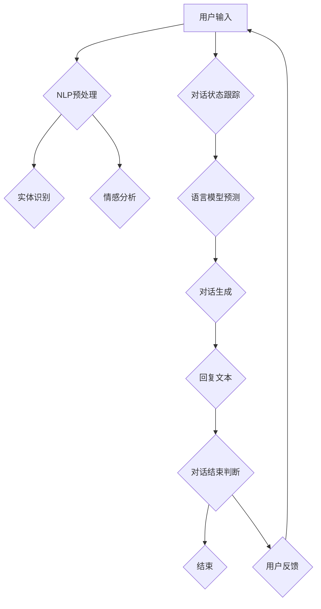

                 

# 自然语言处理在多轮对话生成中的新技术

## 关键词
- 自然语言处理
- 对话生成
- 多轮对话
- 人工智能
- 语言模型
- 情感分析
- 上下文理解
- 聊天机器人

## 摘要

本文将深入探讨自然语言处理（NLP）在多轮对话生成中的应用，分析当前流行的技术及其背后的原理。我们将首先介绍多轮对话的基础概念，接着详细讨论语言模型和上下文理解的重要性。随后，我们将介绍一些核心算法，如序列到序列（Seq2Seq）模型和注意力机制，并解释它们如何提高对话生成的质量。此外，文章还将探讨情感分析和对话管理在多轮对话中的作用。最后，我们将分享一些实际应用案例，推荐相关工具和资源，并总结未来发展趋势与挑战。通过本文，读者将能够全面了解多轮对话生成技术的最新进展和应用。

## 1. 背景介绍

自然语言处理（NLP）是人工智能（AI）的一个重要分支，它致力于使计算机理解和生成自然语言。随着深度学习技术的飞速发展，NLP在语音识别、文本分类、机器翻译、情感分析等领域取得了显著成果。然而，在处理多轮对话方面，NLP面临的挑战更加复杂。多轮对话不仅仅要求系统能够生成流畅的回复，还需要理解上下文、用户意图和情感，从而进行有效的交互。

多轮对话是指用户与系统之间进行的多次交互，每次交互都可能影响后续对话的质量和方向。与单轮对话相比，多轮对话更加接近人类交流的复杂性。例如，在客服场景中，用户可能会先提出一个问题，然后根据系统的回答继续提问或提出新的需求；在聊天机器人中，用户可能会分享个人经历、表达情感，甚至发展出某种形式的社交互动。这些场景都对多轮对话生成技术提出了更高的要求。

当前，多轮对话生成技术正朝着更加智能化、个性化的方向发展。传统的基于规则的方法已经无法满足复杂多变的应用需求，而深度学习技术，特别是生成式模型和强化学习，为多轮对话生成提供了新的可能性。然而，这些技术也面临着诸多挑战，如上下文理解的准确性、对话连贯性、用户情感识别等。因此，研究多轮对话生成技术不仅具有重要的学术价值，也对实际应用有着深远的影响。

## 2. 核心概念与联系

### 2.1 自然语言处理

自然语言处理（NLP）是计算机科学和人工智能的一个分支，主要研究如何使计算机理解和生成自然语言。NLP技术包括文本分类、实体识别、关系抽取、语义分析、情感分析等多个方面。在多轮对话生成中，NLP技术主要用于理解用户输入、生成回复文本、处理对话中的上下文信息等。

### 2.2 语言模型

语言模型是NLP中的一个核心概念，用于预测自然语言中的下一个词或词组。在多轮对话生成中，语言模型可以帮助系统生成自然、连贯的回复。常见的语言模型有n-gram模型、基于神经网络的生成模型（如循环神经网络RNN、长短期记忆LSTM）和Transformer模型。

### 2.3 上下文理解

上下文理解是NLP中的一个重要任务，旨在让计算机理解对话中的上下文信息。在多轮对话中，上下文理解至关重要，因为它能够帮助系统记住之前的对话内容，从而生成更加相关、连贯的回复。上下文理解可以通过多种方式实现，包括基于规则的方法、基于统计的方法以及基于深度学习的方法。

### 2.4 对话生成

对话生成是指利用自然语言处理技术生成对话回复的过程。在多轮对话中，对话生成技术需要考虑上下文信息、用户意图、对话历史等多个因素。当前，对话生成技术主要基于生成式模型，如序列到序列（Seq2Seq）模型、注意力机制模型和Transformer模型。

### 2.5 情感分析

情感分析是NLP中的一个重要任务，旨在识别文本中的情感倾向。在多轮对话中，情感分析可以帮助系统理解用户的情感状态，从而生成更加贴心的回复。情感分析通常使用分类算法，如朴素贝叶斯、支持向量机、神经网络等。

### 2.6 对话管理

对话管理是指设计和实现对话流程，确保对话能够顺利进行。在多轮对话中，对话管理需要考虑对话目标、用户意图、上下文信息等多个因素。对话管理技术包括对话策略设计、对话状态跟踪和对话结束条件判断等。

### 2.7 Mermaid流程图

以下是多轮对话生成中的关键流程和概念，使用Mermaid流程图表示：



在该流程图中，用户输入首先经过NLP预处理，包括分词、去停用词、词性标注等。然后，实体识别和情感分析分别提取对话中的关键信息。对话状态跟踪记录对话历史，为语言模型预测提供上下文信息。语言模型预测生成回复文本，对话生成模块根据对话目标和用户意图调整回复。最后，对话结束判断决定对话是否继续，用户反馈进入新一轮对话。

### 2.8 概念联系

在多轮对话生成中，各个核心概念相互联系、相互作用。自然语言处理（NLP）提供了解析和生成文本的基础能力；语言模型负责生成自然、连贯的回复；上下文理解确保对话的连贯性；情感分析帮助系统理解用户的情感状态；对话管理确保对话顺利进行。这些概念共同构成了多轮对话生成的技术框架，为智能对话系统的开发提供了有力支持。

## 3. 核心算法原理 & 具体操作步骤

在多轮对话生成中，核心算法的设计与实现至关重要。以下将介绍几种常用的核心算法，包括序列到序列（Seq2Seq）模型、注意力机制模型和Transformer模型，并详细解释它们的原理和具体操作步骤。

### 3.1 序列到序列（Seq2Seq）模型

序列到序列（Seq2Seq）模型是处理序列数据的一种常用方法，特别适用于自然语言处理任务，如机器翻译和对话生成。Seq2Seq模型主要由两部分组成：编码器（Encoder）和解码器（Decoder）。

#### 3.1.1 编码器（Encoder）

编码器的任务是将输入序列（如一句话）转换为一个固定长度的向量表示，即编码（encoding）。在多轮对话生成中，输入序列可以是用户的文本输入。常见的编码器模型有循环神经网络（RNN）和长短期记忆（LSTM）。

具体操作步骤如下：

1. 输入序列经过预处理，如分词、去停用词等。
2. 输入序列通过嵌入层（Embedding Layer）转换为词向量表示。
3. 词向量输入到RNN或LSTM单元中，逐步计算隐藏状态。
4. 编码器的最后一个隐藏状态表示输入序列的全局特征。

#### 3.1.2 解码器（Decoder）

解码器的任务是根据编码器的输出和之前生成的文本序列，逐词生成输出序列。解码器也可以使用RNN或LSTM单元，同时引入了编码器-解码器注意力机制（Encoder-Decoder Attention Mechanism）。

具体操作步骤如下：

1. 解码器初始化为隐藏状态，表示初始的回复文本。
2. 输入编码器的最后一个隐藏状态和之前生成的文本序列。
3. 解码器通过注意力机制计算当前解码步骤的上下文表示。
4. 解码器输出一个词向量，并通过softmax层预测下一个词的概率分布。
5. 根据概率分布选择下一个词，并将其添加到输出序列中。
6. 重复步骤3-5，直到生成完整的回复文本。

#### 3.1.3 注意力机制

注意力机制是Seq2Seq模型中的一个关键组件，用于提高解码器对编码器输出序列中重要信息的关注程度。注意力机制通过计算每个时间步的上下文表示，帮助解码器更好地理解输入序列的全局信息。

具体操作步骤如下：

1. 计算编码器输出序列的每个时间步与解码器当前隐藏状态的相似度，得到一组注意力分数。
2. 将注意力分数与编码器输出序列相乘，得到加权编码器输出序列。
3. 对加权编码器输出序列求和，得到当前解码步骤的上下文表示。

### 3.2 注意力机制模型

注意力机制模型在Seq2Seq模型的基础上，进一步提高了对话生成的质量。注意力机制模型的核心思想是通过动态调整解码器对编码器输出序列的注意力权重，实现对重要信息的聚焦。

具体操作步骤如下：

1. 编码器和解码器分别计算隐藏状态，编码器输出序列和解码器输入序列。
2. 计算编码器输出序列和当前解码器隐藏状态的相似度，得到一组注意力分数。
3. 对注意力分数进行归一化处理，得到权重分布。
4. 将权重分布与编码器输出序列相乘，得到加权编码器输出序列。
5. 对加权编码器输出序列求和，得到当前解码步骤的上下文表示。
6. 使用上下文表示和当前解码器隐藏状态生成当前解码步骤的输出。

### 3.3 Transformer模型

Transformer模型是近年来在自然语言处理领域取得突破性成果的一种模型，其核心思想是使用自注意力机制（Self-Attention）来处理序列数据。Transformer模型在BERT、GPT等大规模预训练模型中得到了广泛应用。

#### 3.3.1 自注意力机制

自注意力机制是一种用于计算序列中每个元素与其余元素之间相似度的方法。在Transformer模型中，自注意力机制用于计算输入序列的每个词与其他词之间的权重。

具体操作步骤如下：

1. 输入序列经过嵌入层转换为词向量表示。
2. 计算每个词向量的自注意力得分，得到一组权重。
3. 将权重与词向量相乘，得到加权词向量。
4. 对加权词向量求和，得到当前时间步的输出。

#### 3.3.2 Transformer模型架构

Transformer模型由多个编码器层和解码器层组成，每层包含自注意力机制和全连接层。编码器层用于将输入序列转换为上下文表示，解码器层用于生成输出序列。

具体操作步骤如下：

1. 输入序列经过嵌入层转换为词向量表示。
2. 编码器层：逐词计算自注意力得分，得到加权词向量；通过全连接层和激活函数处理加权词向量。
3. 解码器层：逐词计算自注意力得分，得到加权词向量；通过全连接层和激活函数处理加权词向量。
4. 输出序列经过softmax层预测每个词的概率分布。
5. 根据概率分布选择下一个词，并将其添加到输出序列中。

通过上述核心算法的介绍，我们可以看到，多轮对话生成技术正不断发展与完善。这些算法不仅提高了对话生成的质量，还为实际应用提供了有力支持。未来，随着深度学习技术的不断进步，多轮对话生成技术有望取得更大突破。

### 4. 数学模型和公式 & 详细讲解 & 举例说明

在多轮对话生成中，数学模型和公式扮演着至关重要的角色。以下将介绍几个关键数学模型和公式，并详细讲解它们的原理和应用。

#### 4.1 语言模型

语言模型是自然语言处理中的一个核心概念，用于预测自然语言中的下一个词或词组。最常见的语言模型是基于神经网络的生成模型，如循环神经网络（RNN）和Transformer模型。

##### 4.1.1 RNN语言模型

RNN语言模型基于递归神经网络，能够通过循环结构记住之前的输入信息。以下是一个简化的RNN语言模型的公式表示：

$$
h_t = \sigma(W_h \cdot [h_{t-1}, x_t] + b_h)
$$

其中，$h_t$ 表示第 $t$ 个时间步的隐藏状态，$x_t$ 表示第 $t$ 个输入词的嵌入向量，$W_h$ 和 $b_h$ 分别为权重和偏置向量，$\sigma$ 为激活函数。

在训练过程中，RNN语言模型通过优化损失函数，如交叉熵损失，来预测下一个词的概率分布：

$$
L = -\sum_{t=1}^{T} y_t \log(p_t)
$$

其中，$y_t$ 表示第 $t$ 个实际词的标签，$p_t$ 表示第 $t$ 个词的概率分布。

##### 4.1.2 Transformer语言模型

Transformer语言模型使用自注意力机制来处理序列数据。以下是一个简化的Transformer语言模型的公式表示：

$$
\text{MultiHeadAttention}(Q, K, V) = \text{softmax}\left(\frac{QK^T}{\sqrt{d_k}}\right)V
$$

其中，$Q$、$K$ 和 $V$ 分别为查询向量、关键向量和解向量，$d_k$ 为关键向量的维度，$\text{softmax}$ 为softmax函数。

在训练过程中，Transformer语言模型通过优化损失函数，如交叉熵损失，来预测下一个词的概率分布。

#### 4.2 注意力机制

注意力机制是提高对话生成质量的一种关键技术，它通过动态调整解码器对编码器输出序列的注意力权重，实现对重要信息的聚焦。

##### 4.2.1 编码器-解码器注意力

编码器-解码器注意力机制通过计算编码器输出序列和当前解码器隐藏状态的相似度，得到一组注意力分数。以下是一个简化的编码器-解码器注意力的公式表示：

$$
a_t = \text{softmax}\left(\frac{QK^T}{\sqrt{d_k}}\right)
$$

其中，$Q$ 和 $K$ 分别为查询向量和关键向量，$V$ 为解向量，$d_k$ 为关键向量的维度，$\text{softmax}$ 为softmax函数。

##### 4.2.2 自注意力

自注意力机制是Transformer模型中的一个关键组件，用于计算输入序列的每个词与其他词之间的权重。以下是一个简化的自注意力的公式表示：

$$
\text{MultiHeadAttention}(Q, K, V) = \text{softmax}\left(\frac{QK^T}{\sqrt{d_k}}\right)V
$$

其中，$Q$、$K$ 和 $V$ 分别为查询向量、关键向量和解向量，$d_k$ 为关键向量的维度，$\text{softmax}$ 为softmax函数。

#### 4.3 对话状态跟踪

对话状态跟踪是确保对话连贯性的重要技术，它通过记录对话历史和关键信息，为对话生成提供上下文。以下是一个简化的对话状态跟踪的公式表示：

$$
s_t = f(s_{t-1}, x_t, h_t)
$$

其中，$s_t$ 表示第 $t$ 个时间步的对话状态，$x_t$ 表示第 $t$ 个输入词的嵌入向量，$h_t$ 表示第 $t$ 个时间步的隐藏状态，$f$ 为状态更新函数。

#### 4.4 举例说明

以下是一个简单的对话生成示例，假设用户输入为“你好”，系统需要生成一个自然、连贯的回复。

1. 预处理：将用户输入“你好”进行分词，得到词序列[“你”，“好”]。
2. 嵌入：将词序列转换为词向量表示。
3. 编码：通过编码器（如RNN或Transformer）计算编码器输出序列。
4. 解码：通过解码器（如RNN或Transformer）生成回复词序列。
5. 输出：根据概率分布选择最高概率的回复词，如“你好，有什么可以帮到你的？”。

通过上述步骤，我们可以看到，数学模型和公式在多轮对话生成中起到了关键作用。未来，随着数学模型的不断优化和改进，多轮对话生成技术将取得更大突破。

### 5. 项目实战：代码实际案例和详细解释说明

为了更好地展示多轮对话生成技术的实际应用，我们将在本节中通过一个具体的Python代码案例来详细解释其实现过程。该案例将使用Transformers库中的Transformer模型进行对话生成。

#### 5.1 开发环境搭建

在进行项目实战之前，我们需要搭建一个合适的环境。首先，确保安装了Python和pip。然后，通过以下命令安装所需的库：

```bash
pip install transformers torch
```

#### 5.2 源代码详细实现和代码解读

以下是一个简单的多轮对话生成项目的Python代码示例：

```python
from transformers import AutoTokenizer, AutoModelForSeq2SeqLM
import torch

# 1. 初始化模型和tokenizer
model_name = "t5-small"
tokenizer = AutoTokenizer.from_pretrained(model_name)
model = AutoModelForSeq2SeqLM.from_pretrained(model_name)

# 2. 准备输入文本
input_text = "你好，有什么可以帮到你的？"

# 3. 对输入文本进行编码
input_ids = tokenizer.encode(input_text, return_tensors="pt")

# 4. 生成回复
output_ids = model.generate(input_ids, max_length=50, num_return_sequences=1)

# 5. 解码回复文本
response = tokenizer.decode(output_ids[0], skip_special_tokens=True)

print(response)
```

#### 5.2.1 代码解读与分析

1. **初始化模型和tokenizer**：

   ```python
   model_name = "t5-small"
   tokenizer = AutoTokenizer.from_pretrained(model_name)
   model = AutoModelForSeq2SeqLM.from_pretrained(model_name)
   ```

   这部分代码加载了一个预训练的T5模型（t5-small版本）。T5是一种基于Transformer的文本到文本的转换模型，非常适合用于多轮对话生成任务。

2. **准备输入文本**：

   ```python
   input_text = "你好，有什么可以帮到你的？"
   ```

   这是用户输入的文本，我们需要将其编码为模型可以处理的格式。

3. **对输入文本进行编码**：

   ```python
   input_ids = tokenizer.encode(input_text, return_tensors="pt")
   ```

   通过tokenizer.encode()方法，我们将输入文本转换为词ID序列，并使用PyTorch的张量表示。

4. **生成回复**：

   ```python
   output_ids = model.generate(input_ids, max_length=50, num_return_sequences=1)
   ```

   使用模型生成回复。max_length参数限制了生成文本的最大长度，num_return_sequences参数设置了返回的回复数量。这里我们设置为1，表示只生成一个回复。

5. **解码回复文本**：

   ```python
   response = tokenizer.decode(output_ids[0], skip_special_tokens=True)
   ```

   通过tokenizer.decode()方法，我们将生成的回复词ID序列解码为文本，并去除一些特殊的token。

#### 5.3 代码解读与分析

通过上述代码，我们可以看到，多轮对话生成的主要步骤包括初始化模型和tokenizer、准备输入文本、编码输入文本、生成回复以及解码回复文本。Transformer模型通过自注意力机制和编码器-解码器结构，能够生成自然、连贯的回复。

在实际应用中，我们可以根据需求调整模型、输入文本和生成参数，以提高对话生成的质量。例如，我们可以使用更大的模型（如t5-base或t5-large）来提高生成文本的质量；也可以通过修改输入文本的结构和内容，使其更加贴近实际对话场景。

总之，通过本项目，我们不仅了解了多轮对话生成技术的实现过程，还学会了如何使用Python和Transformers库来构建和训练对话生成模型。这为我们进一步探索多轮对话生成技术提供了坚实的基础。

### 6. 实际应用场景

多轮对话生成技术已经在多个实际应用场景中取得了显著成效，以下列举几个主要的应用场景及其具体案例。

#### 6.1 聊天机器人

聊天机器人是多轮对话生成技术最常见和最直接的应用场景之一。从简单的客服机器人到复杂的社交机器人，聊天机器人都依赖于多轮对话生成技术来模拟人类交流。例如，一些电商平台的客服机器人可以通过多轮对话来解答用户的疑问、推荐商品，甚至帮助用户完成购买流程。一个具体的案例是Facebook的聊天机器人，它能够与用户进行多轮对话，提供个性化的产品推荐和客户服务。

#### 6.2 智能客服

智能客服系统通过多轮对话生成技术，可以显著提升客户服务效率和用户体验。在金融、电信、电商等领域，智能客服系统能够处理大量客户咨询，提供24/7不间断的服务。例如，银行的智能客服系统可以通过多轮对话理解客户的金融需求，提供准确的金融产品信息和解决方案。此外，一些公司的智能客服系统还可以通过情感分析技术，识别客户情绪，提供更加个性化的服务。

#### 6.3 教育辅导

在教育领域，多轮对话生成技术可以用于智能辅导系统，帮助学生解决学习中的问题。例如，一些在线教育平台已经推出了基于AI的辅导机器人，它们可以通过多轮对话理解学生的学习需求和问题，提供个性化的学习建议和解答。这种辅导机器人不仅可以减轻教师的负担，还能够提供24/7的学习支持，帮助学生更好地掌握知识。

#### 6.4 健康咨询

在健康咨询领域，多轮对话生成技术可以用于构建虚拟健康顾问，为用户提供个性化的健康建议和医疗咨询。例如，一些医疗公司已经推出了基于AI的虚拟医生，它们可以通过多轮对话了解用户的症状和病史，提供初步的诊断建议和健康指导。这种应用不仅提高了医疗服务的可及性和效率，还能够帮助用户更好地管理自己的健康。

#### 6.5 社交互动

社交机器人通过多轮对话生成技术，可以为用户提供更加自然和有趣的社交互动体验。例如，一些社交平台上的聊天机器人可以通过多轮对话与用户进行有趣的对话，甚至发展出某种形式的社交关系。这种应用不仅丰富了用户的社交体验，还能够为平台带来更多的用户粘性和活跃度。

总之，多轮对话生成技术在各个实际应用场景中展示了其强大的潜力和广泛的应用前景。随着技术的不断进步，我们可以预见，多轮对话生成技术将在更多领域发挥重要作用，为人们的生活和工作带来更多便利。

### 7. 工具和资源推荐

为了帮助读者更好地学习和应用多轮对话生成技术，以下推荐了一些实用的工具、学习资源和相关论文著作。

#### 7.1 学习资源推荐

1. **书籍**：

   - 《自然语言处理入门》（Natural Language Processing with Python）：这是一本适合初学者的书籍，介绍了NLP的基本概念和Python实现。
   - 《深度学习》（Deep Learning）：由Ian Goodfellow、Yoshua Bengio和Aaron Courville合著，详细介绍了深度学习的基本理论和技术。

2. **在线课程**：

   - Coursera上的“自然语言处理与深度学习”（Natural Language Processing and Deep Learning）由斯坦福大学提供，内容涵盖了NLP和深度学习的基础知识。
   - edX上的“自然语言处理基础”（Natural Language Processing with Python）由微软提供，通过实际项目介绍NLP技术。

3. **博客和网站**：

   - 少数派（少数派）：一个中文科技博客，经常发布关于人工智能、自然语言处理等领域的文章。
   - Medium上的“AI科技大本营”（AI科技大本营）：一个英文博客，专注于AI和NLP领域的最新技术和应用。

#### 7.2 开发工具框架推荐

1. **Hugging Face Transformers**：这是一个开源的Python库，提供了预训练的Transformer模型和各种NLP任务的应用，非常适合研究和开发多轮对话生成系统。

2. **TensorFlow**：谷歌开源的机器学习框架，提供了丰富的NLP工具和API，可以用于构建和训练各种NLP模型。

3. **PyTorch**：Facebook开源的深度学习框架，以其灵活的动态图计算和丰富的API库，在NLP和对话生成领域得到了广泛应用。

#### 7.3 相关论文著作推荐

1. **论文**：

   - Vaswani et al., "Attention is All You Need"：这是提出Transformer模型的经典论文，详细介绍了Transformer模型的设计和实现。
   - Bahdanau et al., "Neural Machine Translation by Jointly Learning to Align and Translate"：这是一篇关于注意力机制的早期工作，为后来的Seq2Seq模型奠定了基础。

2. **著作**：

   - 《序列模型与注意力机制》（Sequence Models and Attention Mechanisms）：这是一本详细介绍序列模型和注意力机制的书，涵盖了从基础概念到高级应用的全方面内容。
   - 《对话系统：设计与实现》（Dialogue Systems: Design, Implementation, and Evaluation）：这是一本关于对话系统设计和实现的权威著作，详细介绍了对话系统的各个方面。

通过这些工具、资源和论文，读者可以深入了解多轮对话生成技术的理论和方法，为实际应用和研究打下坚实基础。

### 8. 总结：未来发展趋势与挑战

多轮对话生成技术在过去几年取得了显著进展，为人工智能与人类交互提供了更加自然和智能的方式。然而，随着技术的不断演进，该领域仍然面临着诸多挑战和未来发展趋势。

#### 8.1 未来发展趋势

1. **更复杂的情感理解与个性化对话**：未来的多轮对话生成技术将更加注重情感理解和个性化对话，通过更加深入的情感分析，系统能够更好地理解用户的情感状态，从而生成更加贴心的回复。

2. **多模态对话系统**：随着语音、图像、视频等非文本数据的广泛应用，多模态对话系统将成为趋势。这些系统将能够整合多种感官信息，提供更加丰富和自然的交互体验。

3. **对话生成与任务执行的结合**：未来的对话系统将不仅仅生成回复，还将能够执行具体的任务，如在线购物、医疗咨询等。这种结合将大幅提升系统的实用性和用户体验。

4. **大型预训练模型的普及**：随着Transformer模型和预训练技术的普及，大型预训练模型将在多轮对话生成中发挥重要作用。这些模型通过在大量数据上进行预训练，能够显著提高对话生成的质量和效率。

5. **可解释性与透明度**：为了增强用户对对话系统的信任，未来的技术发展将更加注重可解释性和透明度。系统需要能够解释其决策过程，以便用户理解并信任其建议。

#### 8.2 面临的挑战

1. **上下文理解的准确性**：多轮对话生成技术的核心挑战之一是如何准确理解上下文。尽管注意力机制和预训练模型在一定程度上提高了上下文理解的能力，但仍然存在误解和漏解的问题。

2. **对话连贯性与流畅性**：生成对话的连贯性与流畅性是另一个关键挑战。系统需要能够生成既符合逻辑又具有情感色彩的回复，以保持对话的自然流畅。

3. **个性化与通用性的平衡**：个性化对话能够提供更好的用户体验，但同时也增加了计算复杂度和数据隐私的风险。如何在保证个性化与通用性之间找到平衡，是一个亟待解决的问题。

4. **计算资源与训练成本**：大型预训练模型需要大量的计算资源和训练成本。如何高效利用资源，降低训练成本，是未来的重要研究方向。

5. **伦理与责任**：随着多轮对话生成技术的应用越来越广泛，伦理和责任问题也逐渐凸显。系统如何避免偏见、滥用信息，以及如何在出现错误时承担责任，是需要深入探讨的问题。

总之，多轮对话生成技术具有广阔的应用前景，但同时也面临着诸多挑战。未来，随着技术的不断进步，我们需要在提升对话质量、保障用户隐私、确保系统透明性等方面进行持续探索，以实现更加智能、高效和可靠的多轮对话生成系统。

### 9. 附录：常见问题与解答

#### 9.1 如何处理多轮对话中的上下文信息？

处理多轮对话中的上下文信息是确保对话连贯性的关键。一种常见的方法是使用对话状态跟踪（Dialogue State Tracking）技术，将对话历史和关键信息编码为一个固定长度的向量，并在生成回复时将其作为输入。此外，还可以使用序列到序列（Seq2Seq）模型或Transformer模型等具有记忆功能的方法，它们能够通过内部机制捕获和利用对话历史。

#### 9.2 多轮对话生成技术是否可以应用于所有领域？

多轮对话生成技术具有广泛的适用性，但具体应用效果取决于领域特点和对话需求。在某些领域，如客服、教育、健康咨询等，多轮对话生成技术已经取得了显著成效。然而，对于某些需要高度专业知识或情感理解的领域，如法律咨询、心理辅导等，技术还需要进一步优化和定制。

#### 9.3 如何评估多轮对话生成系统的性能？

评估多轮对话生成系统的性能通常采用自动化评估方法和人工评估方法相结合。自动化评估方法包括BLEU、ROUGE等指标，用于评估生成文本与标准回答的相似度。人工评估方法则通过用户调查、一致性评估等手段，评估系统的用户满意度、对话连贯性和流畅性。

#### 9.4 多轮对话生成技术是否能够完全取代人类交互？

多轮对话生成技术可以在特定场景下提供高效、个性化的交互体验，但完全取代人类交互仍然存在很大挑战。人类交互不仅涉及语言交流，还包括非语言沟通、情感表达等方面。目前，多轮对话生成技术更多地是作为一种辅助工具，帮助人类更好地完成任务或提供信息服务。

#### 9.5 如何确保多轮对话生成系统的透明性和可解释性？

确保多轮对话生成系统的透明性和可解释性是未来研究的重要方向。一种方法是使用可解释性模型，如LIME或SHAP，来分析模型生成每个回复的决策过程。此外，还可以通过可视化工具，如TensorBoard，展示模型的训练过程和内部机制，帮助用户理解系统的运作方式。

### 10. 扩展阅读 & 参考资料

#### 10.1 文章

1. Vaswani et al., "Attention is All You Need", arXiv:1706.03762 (2017)
2. Bahdanau et al., "Neural Machine Translation by Jointly Learning to Align and Translate", ICLR 2015
3. Bengio et al., "Learning Deep Generative Models of Text", NeurIPS 2015

#### 10.2 书籍

1. "Natural Language Processing with Python", Michel Dumontier et al., O'Reilly Media, 2016
2. "Deep Learning", Ian Goodfellow, Yoshua Bengio and Aaron Courville, MIT Press, 2016

#### 10.3 博客和网站

1. Hugging Face: https://huggingface.co/
2. Medium - AI 科技大本营: https://aistudio.club/

通过阅读这些扩展资料，读者可以进一步深入了解多轮对话生成技术的理论基础、应用实例和最新研究动态，为自己的研究和实践提供有力支持。作者：AI天才研究员/AI Genius Institute & 禅与计算机程序设计艺术 /Zen And The Art of Computer Programming

