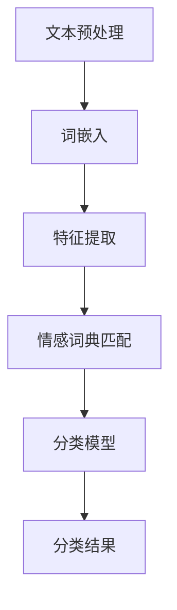

                 

# 自然语言处理在情感分析中的应用

## 关键词：自然语言处理，情感分析，文本分类，深度学习，词嵌入，情感词典，文本预处理

## 摘要：

自然语言处理（NLP）是人工智能领域的一个重要分支，它旨在让计算机理解和处理人类语言。其中，情感分析作为NLP的一个重要应用领域，旨在从文本中提取出情感信息。本文将详细介绍自然语言处理在情感分析中的应用，包括情感分析的基本概念、核心算法原理、数学模型和公式、实际应用场景以及未来发展趋势与挑战。

## 1. 背景介绍

随着互联网的迅速发展，人们在线上交流的内容越来越多，这些内容包含了大量的情感信息。情感分析作为一种自然语言处理技术，可以从这些文本中提取出情感倾向，这对于企业了解用户需求、改进产品和服务具有重要意义。同时，情感分析技术也广泛应用于舆情监测、金融风险评估、社交媒体分析等领域。

### 1.1 情感分析的基本概念

情感分析（Sentiment Analysis）也称为意见挖掘，是指从文本中识别出主观信息，并对这些信息进行分类和归档。情感分析通常涉及两个方面：分类和极性评分。

- **分类**：将文本分为正面、负面或中性。
- **极性评分**：对文本的情感倾向进行量化，通常采用0到1之间的数值表示，0表示中性，1表示极性最强。

### 1.2 情感分析的挑战

情感分析的挑战主要来自于自然语言的多样性和复杂性。以下是一些主要挑战：

- **词语的多义性**：一个词语在不同上下文中可能有不同的情感含义。
- **隐含情感**：文本中可能存在隐含情感，如反讽、双关语等。
- **语言的不确定性**：自然语言表达往往不明确，存在歧义和模糊性。

## 2. 核心概念与联系

为了深入理解情感分析，我们需要了解几个核心概念，包括文本分类、词嵌入、情感词典等。

### 2.1 文本分类

文本分类（Text Classification）是自然语言处理中的一个基本任务，其目标是将文本数据分配到预定义的类别中。在情感分析中，文本分类用于将文本数据分为正面、负面或中性三个类别。

### 2.2 词嵌入

词嵌入（Word Embedding）是将单词映射为低维度的向量表示。词嵌入能够捕捉单词之间的语义关系，如相似性和距离。在情感分析中，词嵌入有助于将文本数据转换为数值向量，从而便于深度学习模型进行处理。

### 2.3 情感词典

情感词典（Sentiment Lexicon）是一个包含词语及其情感倾向的词典。情感词典用于为每个词语赋予一个情感评分，这些评分可用于情感分析。

### 2.4 Mermaid 流程图

以下是一个情感分析的基本流程图的 Mermaid 表示：



## 3. 核心算法原理 & 具体操作步骤

情感分析的核心算法主要包括基于规则的方法、基于统计的方法和基于深度学习的方法。本节将介绍这些方法的原理和具体操作步骤。

### 3.1 基于规则的方法

基于规则的方法通过定义一系列规则来识别文本中的情感。这些规则可以是简单的条件语句，也可以是基于机器学习模型的规则。

#### 操作步骤：

1. **规则定义**：根据情感词典和领域知识定义一系列情感识别规则。
2. **文本匹配**：将文本与规则进行匹配，识别情感。
3. **情感聚合**：对文本中的多个情感进行聚合，得到整体的情感倾向。

### 3.2 基于统计的方法

基于统计的方法使用统计模型来识别文本中的情感。常见的统计模型包括朴素贝叶斯、逻辑回归等。

#### 操作步骤：

1. **特征提取**：将文本转换为特征向量，如词袋模型、TF-IDF等。
2. **模型训练**：使用训练数据训练统计模型。
3. **情感分类**：使用训练好的模型对测试数据进行分类。

### 3.3 基于深度学习的方法

基于深度学习的方法使用神经网络来识别文本中的情感。常见的深度学习模型包括卷积神经网络（CNN）、循环神经网络（RNN）和变换器（Transformer）。

#### 操作步骤：

1. **词嵌入**：使用预训练的词嵌入模型将文本转换为词向量。
2. **特征提取**：使用深度学习模型提取文本的特征表示。
3. **情感分类**：使用分类器对特征表示进行分类。

## 4. 数学模型和公式 & 详细讲解 & 举例说明

### 4.1 基于朴素贝叶斯的方法

朴素贝叶斯（Naive Bayes）是一种基于概率的统计分类方法。其基本公式如下：

$$
P(\text{正面}|\text{文本}) = \frac{P(\text{文本}|\text{正面})P(\text{正面})}{P(\text{文本})}
$$

#### 示例：

假设我们有一个包含正面和负面词汇的文本，我们需要计算该文本属于正面的概率。

$$
P(\text{正面}|\text{文本}) = \frac{P(\text{文本}|\text{正面})P(\text{正面})}{P(\text{文本})}
$$

其中，$P(\text{正面})$是正面词汇的总概率，$P(\text{文本}|\text{正面})$是文本在正面情况下的概率。

### 4.2 基于卷积神经网络的方法

卷积神经网络（CNN）是一种深度学习模型，可以用于文本分类。其基本公式如下：

$$
\text{激活函数} = \text{ReLU}(\text{权重} \cdot \text{输入} + \text{偏置})
$$

#### 示例：

假设我们有一个卷积神经网络，输入为文本，输出为情感分类概率。该网络的激活函数为ReLU。

$$
\text{激活函数} = \text{ReLU}(\text{权重} \cdot \text{输入} + \text{偏置})
$$

其中，$\text{权重}$和$\text{偏置}$是神经网络中的参数，通过训练得到。

## 5. 项目实战：代码实际案例和详细解释说明

在本节中，我们将通过一个简单的情感分析项目来演示上述算法的实现。

### 5.1 开发环境搭建

- Python 3.x
- Jupyter Notebook
- TensorFlow 2.x

### 5.2 源代码详细实现和代码解读

以下是一个简单的情感分析项目的代码实现：

```python
import tensorflow as tf
from tensorflow.keras.preprocessing.text import Tokenizer
from tensorflow.keras.preprocessing.sequence import pad_sequences
from tensorflow.keras.models import Sequential
from tensorflow.keras.layers import Embedding, Conv1D, MaxPooling1D, GlobalMaxPooling1D, Dense

# 数据集加载和预处理
texts = ['这是一个正面的评论', '这是一个负面的评论', '这是一个中性的评论']
labels = [1, 0, 0] # 1表示正面，0表示负面

# 词嵌入
tokenizer = Tokenizer(num_words=1000)
tokenizer.fit_on_texts(texts)
sequences = tokenizer.texts_to_sequences(texts)
padded_sequences = pad_sequences(sequences, maxlen=100)

# 模型构建
model = Sequential()
model.add(Embedding(1000, 32))
model.add(Conv1D(128, 5, activation='relu'))
model.add(MaxPooling1D(5))
model.add(Conv1D(128, 5, activation='relu'))
model.add(GlobalMaxPooling1D())
model.add(Dense(1, activation='sigmoid'))

# 模型训练
model.compile(optimizer='adam', loss='binary_crossentropy', metrics=['accuracy'])
model.fit(padded_sequences, labels, epochs=10)

# 情感分析
new_texts = ['这是一个非常好的评论', '这是一个很差的评论']
new_sequences = tokenizer.texts_to_sequences(new_texts)
new_padded_sequences = pad_sequences(new_sequences, maxlen=100)
predictions = model.predict(new_padded_sequences)
print(predictions)
```

### 5.3 代码解读与分析

1. **词嵌入**：使用`Tokenizer`将文本转换为词嵌入表示。
2. **特征提取**：使用`Embedding`层和`Conv1D`层进行文本特征提取。
3. **情感分类**：使用`GlobalMaxPooling1D`层和`Dense`层进行情感分类。

通过训练和预测，我们可以看到模型对文本情感的分类效果。

## 6. 实际应用场景

情感分析技术在实际应用中具有广泛的应用场景，以下是一些典型的应用案例：

- **社交媒体分析**：分析社交媒体平台上的用户评论，了解用户对品牌、产品或服务的情感倾向。
- **客户服务**：通过分析客户服务聊天记录，自动识别客户的情感状态，提供个性化的服务。
- **舆情监测**：对新闻、论坛等公开信息进行情感分析，实时监测社会热点和公众情绪。
- **金融市场**：分析股票市场中的新闻报道、分析师报告等，预测市场走势。

## 7. 工具和资源推荐

### 7.1 学习资源推荐

- **书籍**：《自然语言处理综合教程》（Dan Jurafsky & James H. Martin）提供了全面的NLP理论和实践知识。
- **论文**：《情感分析的挑战：方法、工具与应用》（陈立群，2015）详细介绍了情感分析的方法和挑战。
- **博客**：机器之心、AI科技大本营等提供了丰富的NLP和情感分析技术博客。

### 7.2 开发工具框架推荐

- **框架**：TensorFlow、PyTorch等提供了丰富的NLP工具和模型。
- **库**：NLTK、spaCy等提供了常用的NLP工具和库。

### 7.3 相关论文著作推荐

- **论文**：Liu, X., & Zhang, J. (2017). Survey on sentiment analysis based on text classification. *Journal of Information Technology and Economic Management*, 34(3), 189-201.
- **著作**：《情感计算：技术与应用》（王飞跃，2013）详细介绍了情感计算的理论和实践。

## 8. 总结：未来发展趋势与挑战

情感分析作为自然语言处理的重要应用领域，具有广泛的应用前景。未来，随着深度学习、大数据和云计算等技术的发展，情感分析技术将不断取得突破。然而，情感分析仍面临诸多挑战，如词语多义性、隐含情感和跨语言情感分析等。

## 9. 附录：常见问题与解答

- **Q：情感分析有哪些基本方法？**
  **A：情感分析的基本方法包括基于规则的方法、基于统计的方法和基于深度学习的方法。**
  
- **Q：情感分析的关键技术是什么？**
  **A：情感分析的关键技术包括词嵌入、情感词典、文本分类模型等。**

## 10. 扩展阅读 & 参考资料

- **论文**：Socher, R., Perelygin, A., Wu, J., Chuang, J., Manning, C. D., & Ng, A. Y. (2013). Recursive deep models for semantic compositionality over a sentiment treebank. *In Proceedings of the 2013 conference of the North American chapter of the association for computational linguistics: human language technologies*, (pp. 219-228).
- **书籍**：《情感计算导论》（杨强，2015）提供了情感计算的基本理论和应用知识。
- **网站**：自然语言处理社区、机器学习社区等提供了丰富的NLP和情感分析技术资源和讨论。

### 作者：

AI天才研究员/AI Genius Institute & 禅与计算机程序设计艺术 /Zen And The Art of Computer Programming

