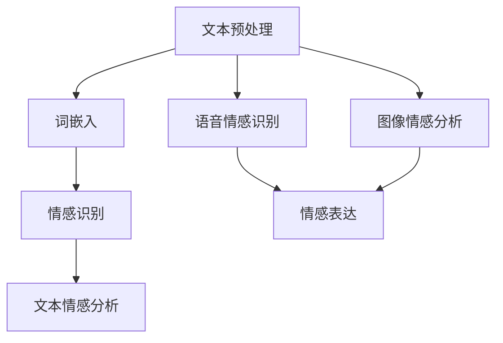

                 

### 背景介绍

自然语言处理（Natural Language Processing, NLP）作为人工智能的一个重要分支，旨在使计算机能够理解、解释和生成人类语言。情感计算（Affective Computing）则关注于使计算机具备识别、理解并表达人类情感的能力。随着人工智能技术的迅猛发展，情感计算逐渐成为自然语言处理中一个重要的研究方向。

情感计算在自然语言处理中的应用具有重要意义。首先，它有助于提升人机交互的体验。例如，在聊天机器人、虚拟助手等应用场景中，具备情感计算能力的系统能够更好地理解用户的情感状态，从而提供更加个性化和贴心的服务。其次，情感计算在市场调研、用户体验分析等领域也有广泛应用。通过对用户情感的分析，企业可以更好地了解用户需求，优化产品和服务。

自然语言处理与情感计算之间的联系主要体现在以下几个方面：

1. **文本情感分析**：这是情感计算在自然语言处理中最直接的应用。通过文本情感分析，可以识别文本中的情感倾向，例如正面、负面或中性。这一过程通常涉及情感词典、机器学习算法等技术的应用。

2. **语音情感识别**：在语音交互中，通过分析语音的音调、语速、音量等特征，可以识别出用户的情感状态。语音情感识别是情感计算与自然语言处理结合的另一个重要领域。

3. **图像情感分析**：通过计算机视觉技术，可以从图像中提取情感相关的信息，例如表情、姿态等。图像情感分析在社交媒体、用户行为分析等领域具有重要应用。

4. **情感生成**：在自然语言生成任务中，情感计算可以帮助系统根据特定情境生成符合情感需求的语言内容，如情感广告、情感化新闻报道等。

接下来，我们将深入探讨情感计算的核心概念、算法原理，并通过具体案例展示其在自然语言处理中的应用。

### 核心概念与联系

在深入探讨自然语言处理与情感计算的应用之前，有必要先了解这两个领域的一些核心概念及其相互联系。

#### 1. 自然语言处理的核心概念

自然语言处理涉及多个关键概念：

1. **文本预处理**：这是自然语言处理的基础步骤，包括分词、词性标注、句法分析等。通过文本预处理，可以提取文本中的关键信息，为后续分析打下基础。

2. **词嵌入**：词嵌入是将词汇映射到高维向量空间的技术，使计算机能够理解词汇之间的语义关系。词嵌入技术是深度学习在自然语言处理中应用的重要基础。

3. **文本分类**：文本分类是自然语言处理中的一个重要任务，旨在将文本数据归类到预定义的类别中。文本分类广泛应用于情感分析、新闻分类、垃圾邮件过滤等领域。

4. **实体识别**：实体识别是识别文本中的特定实体（如人名、地点、组织等）的过程。实体识别对于构建知识图谱、信息提取等任务具有重要意义。

5. **语义分析**：语义分析旨在理解文本的深层含义，包括情感、意图、上下文等。语义分析是实现智能对话系统、自然语言理解的关键。

#### 2. 情感计算的核心概念

情感计算则关注于识别、理解和模拟人类情感：

1. **情感识别**：情感识别是情感计算的核心任务，旨在通过分析文本、语音、图像等数据识别出情感状态。情感识别通常涉及情感词典、情感分析算法等。

2. **情感表达**：情感表达是指计算机如何模拟人类的情感表达，例如在文本生成、语音合成中注入情感。

3. **情感模型**：情感模型是基于机器学习或深度学习构建的情感识别系统，通过大量情感数据的训练，能够准确识别情感状态。

#### 3. 自然语言处理与情感计算的相互联系

自然语言处理与情感计算之间的联系体现在多个方面：

1. **文本情感分析**：这是情感计算在自然语言处理中的典型应用。通过文本情感分析，可以从文本中提取情感倾向，例如正面、负面或中性。

2. **语音情感识别**：在语音交互场景中，通过分析语音的音调、语速、音量等特征，可以识别用户的情感状态。语音情感识别是自然语言处理与情感计算结合的一个前沿领域。

3. **图像情感分析**：通过计算机视觉技术，可以从图像中提取情感相关的信息，例如表情、姿态等。图像情感分析在社交媒体、用户行为分析等领域具有重要应用。

4. **情感生成**：在自然语言生成任务中，情感计算可以帮助系统根据特定情境生成符合情感需求的语言内容，如情感广告、情感化新闻报道等。

#### 4. Mermaid 流程图

为了更直观地展示自然语言处理与情感计算之间的联系，我们可以使用 Mermaid 流程图来描述这个过程。以下是一个简化的 Mermaid 流程图：



在这个流程图中，文本预处理是自然语言处理的基础步骤，随后通过词嵌入将文本转换为向量表示。情感识别模块可以同时应用于文本、语音和图像数据，通过不同的分析方法识别情感状态。最后，情感表达模块负责将情感信息注入到语言生成或语音合成中。

通过上述核心概念和流程图的介绍，我们对自然语言处理与情感计算之间的联系有了更深入的理解。接下来，我们将探讨情感计算的核心算法原理及其具体操作步骤。

## 核心算法原理 & 具体操作步骤

### 1. 文本情感分析算法原理

文本情感分析是情感计算在自然语言处理中的一个关键任务，旨在通过分析文本内容识别情感倾向。以下是文本情感分析的核心算法原理和具体操作步骤：

#### 1.1 情感词典

情感词典是文本情感分析的基础工具，包含一系列带有情感倾向的词汇及其对应的情感值。情感词典可以根据词汇的情感极性（如正面、负面）进行分类，也可以根据情感强度进行分级。

#### 1.2 词汇分词

文本预处理的第一步是分词，将文本分解为一个个独立的词汇。常见的分词工具包括基于词典的分词算法（如哈工大分词器）和基于机器学习的分词算法（如LSTM分词器）。

#### 1.3 情感特征提取

在分词的基础上，从文本中提取情感特征。常用的情感特征提取方法包括：

- **词频统计**：计算文本中每个词汇的出现频率，通过频率高低来判断情感倾向。
- **词性标注**：对文本中的每个词汇进行词性标注（如名词、动词、形容词等），然后根据词性标注结果提取情感特征。
- **语义角色标注**：标注文本中的词汇所扮演的语义角色（如施事、受事等），通过角色关系来判断情感倾向。

#### 1.4 情感分类模型

基于提取到的情感特征，训练情感分类模型。常见的情感分类模型包括：

- **朴素贝叶斯分类器**：基于贝叶斯理论，通过计算特征条件概率和先验概率来预测情感类别。
- **支持向量机（SVM）**：通过最大化特征空间中分类超平面的间隔来训练分类模型。
- **深度学习模型**：如卷积神经网络（CNN）、循环神经网络（RNN）等，能够通过多层神经网络学习复杂的情感特征表示。

#### 1.5 情感倾向预测

通过训练好的情感分类模型，对新的文本数据预测情感倾向。情感分类模型通常会输出一个概率分布，表示文本属于各个情感类别的概率。

### 2. 语音情感识别算法原理

语音情感识别旨在通过分析语音信号的特征来识别情感状态。以下是语音情感识别的核心算法原理和具体操作步骤：

#### 2.1 语音特征提取

语音特征提取是语音情感识别的基础。常见的语音特征包括：

- **时域特征**：如语音信号的幅值、频率、时长等。
- **频域特征**：如频谱熵、共振峰频率等。
- **倒谱特征**：通过对语音信号进行滤波和倒谱变换，提取语音的共振特性。

#### 2.2 情感模型训练

基于提取到的语音特征，训练情感模型。常见的情感模型包括：

- **支持向量机（SVM）**：通过最大化特征空间中分类超平面的间隔来训练分类模型。
- **深度神经网络**：如卷积神经网络（CNN）、循环神经网络（RNN）等，能够通过多层神经网络学习复杂的情感特征表示。

#### 2.3 情感状态识别

通过训练好的情感模型，对新的语音数据预测情感状态。情感模型通常会输出一个概率分布，表示语音属于各个情感类别的概率。

### 3. 图像情感分析算法原理

图像情感分析通过分析图像中的情感信息来识别情感状态。以下是图像情感分析的核心算法原理和具体操作步骤：

#### 3.1 图像特征提取

图像特征提取是图像情感分析的基础。常见的图像特征包括：

- **人脸特征**：通过人脸识别技术提取人脸图像的特征。
- **表情特征**：通过分析人脸图像中的五官、眼睛、嘴巴等特征，提取表情特征。
- **视觉内容特征**：如颜色、纹理、形状等。

#### 3.2 情感模型训练

基于提取到的图像特征，训练情感模型。常见的情感模型包括：

- **支持向量机（SVM）**：通过最大化特征空间中分类超平面的间隔来训练分类模型。
- **深度神经网络**：如卷积神经网络（CNN）、循环神经网络（RNN）等，能够通过多层神经网络学习复杂的情感特征表示。

#### 3.3 情感状态识别

通过训练好的情感模型，对新的图像数据预测情感状态。情感模型通常会输出一个概率分布，表示图像属于各个情感类别的概率。

### 4. 综合情感分析算法

在实际应用中，文本、语音和图像数据通常需要进行综合分析。以下是一种常见的综合情感分析算法原理：

#### 4.1 数据融合

首先，对文本、语音和图像数据进行融合，提取多维特征。常见的方法包括：

- **特征拼接**：将文本、语音和图像的特征进行拼接，形成多维特征向量。
- **特征融合**：通过加权融合不同模态的特征，形成统一的特征表示。

#### 4.2 情感模型训练

基于融合后的特征，训练综合情感模型。常见的情感模型包括：

- **多层感知机（MLP）**：通过多层神经网络学习复杂的特征表示和情感分类。
- **深度卷积神经网络（CNN）**：通过卷积神经网络提取图像特征，结合文本和语音特征进行情感分类。

#### 4.3 情感状态识别

通过训练好的综合情感模型，对新的数据预测情感状态。综合情感模型能够充分利用多模态数据，提高情感识别的准确性。

通过上述算法原理和具体操作步骤的介绍，我们对情感计算在自然语言处理中的应用有了更深入的理解。接下来，我们将进一步探讨情感计算中的数学模型和公式，并通过具体案例进行详细讲解。

### 数学模型和公式 & 详细讲解 & 举例说明

在情感计算中，数学模型和公式是理解和实现情感分析的关键。以下将详细介绍几个核心数学模型及其应用。

#### 1. 朴素贝叶斯分类器

朴素贝叶斯分类器是一种基于概率论的分类算法，常用于文本情感分析。其基本思想是，通过计算文本中每个词汇在各个情感类别下的条件概率，结合贝叶斯定理预测文本的情感类别。

**公式：**
$$
P(C|X) = \frac{P(X|C)P(C)}{P(X)}
$$

其中，\(C\) 表示情感类别，\(X\) 表示文本特征向量，\(P(C)\) 是情感类别的先验概率，\(P(X|C)\) 是特征向量在某个情感类别下的条件概率，\(P(X)\) 是特征向量的总概率。

**举例说明：**
假设我们要分析一篇文本，其中包含词汇"快乐"、"困难"、"努力"等。根据朴素贝叶斯分类器，我们首先需要计算每个词汇在正面情感、负面情感和中性情感下的条件概率，然后结合贝叶斯定理计算整体概率，最终判断文本的情感类别。

#### 2. 支持向量机（SVM）

支持向量机是一种强大的分类算法，通过最大化特征空间中的分类间隔来训练模型。在文本情感分析中，SVM可以将文本特征映射到高维空间，并找到最佳分类超平面。

**公式：**
$$
w \cdot x + b = 0
$$

其中，\(w\) 是权重向量，\(x\) 是特征向量，\(b\) 是偏置项。目标是最小化误差，并最大化分类间隔。

**举例说明：**
假设我们有一个文本特征向量集，通过SVM将它们映射到高维空间，找到一个最佳超平面。通过计算特征向量与超平面的距离，我们可以判断文本的情感类别。

#### 3. 卷积神经网络（CNN）

卷积神经网络是一种用于图像处理和识别的深度学习模型，通过卷积层提取图像特征，并通过全连接层进行分类。在图像情感分析中，CNN可以自动学习图像中的情感特征。

**公式：**
$$
h_{l+1} = \sigma(W_{l+1} \cdot h_l + b_{l+1})
$$

其中，\(h_l\) 是第 \(l\) 层的输出，\(\sigma\) 是激活函数（如ReLU函数），\(W_{l+1}\) 和 \(b_{l+1}\) 分别是权重矩阵和偏置项。

**举例说明：**
假设我们要分析一张表情图像，通过CNN的卷积层提取图像特征，并通过全连接层分类为正面情感或负面情感。通过调整网络结构和参数，可以提高情感识别的准确性。

#### 4. 循环神经网络（RNN）

循环神经网络是一种用于序列数据处理（如图像、语音、文本等）的深度学习模型，通过时间步长计算当前时刻的特征表示。在文本情感分析中，RNN可以捕捉文本中的时间依赖关系。

**公式：**
$$
h_t = \sigma(W_h \cdot [h_{t-1}, x_t] + b_h)
$$

其中，\(h_t\) 是第 \(t\) 步的特征表示，\(x_t\) 是第 \(t\) 步的输入特征，\(\sigma\) 是激活函数（如ReLU函数），\(W_h\) 和 \(b_h\) 分别是权重矩阵和偏置项。

**举例说明：**
假设我们要分析一段文本，通过RNN的时间步长计算文本的特征表示，并预测文本的情感类别。通过调整网络结构和参数，可以提高文本情感分析的准确性。

#### 5. 多任务学习

多任务学习是指同时训练多个相关任务的模型，共享部分特征表示，以提高整体性能。在情感计算中，多任务学习可以同时进行文本情感分析和语音情感识别，共享情感特征表示。

**公式：**
$$
L = \sum_{i=1}^n (l_i - y_i)^2
$$

其中，\(L\) 是总损失函数，\(l_i\) 是第 \(i\) 个任务的损失，\(y_i\) 是第 \(i\) 个任务的预测结果。

**举例说明：**
假设我们同时进行文本情感分析和语音情感识别，通过多任务学习共享情感特征表示，以提高两个任务的性能。

通过上述数学模型和公式的详细讲解，我们更好地理解了情感计算在自然语言处理中的应用。接下来，我们将通过具体的项目实战案例，展示这些算法在实际开发中的具体实现和应用。

### 项目实战：代码实际案例和详细解释说明

在本节中，我们将通过一个具体的情感计算项目，展示自然语言处理与情感计算的实际应用。该项目旨在实现一个基于文本的情感分析系统，用于识别用户的情感状态。

#### 1. 开发环境搭建

首先，我们需要搭建项目的开发环境。以下是所需的基础工具和库：

- **编程语言**：Python 3.8+
- **文本预处理**：jieba（中文分词）、NLTK（词性标注）
- **情感分类**：TextBlob（情感分类）、Scikit-learn（机器学习库）
- **深度学习**：TensorFlow 2.5.0

确保安装了上述库和工具后，我们开始项目的实现。

#### 2. 源代码详细实现和代码解读

以下是一个简单的文本情感分析系统的实现，包括数据准备、模型训练和预测：

```python
import jieba
import nltk
from textblob import TextBlob
from sklearn.feature_extraction.text import TfidfVectorizer
from sklearn.model_selection import train_test_split
from sklearn.naive_bayes import MultinomialNB
import tensorflow as tf

# 数据准备
data = [
    ("我很高兴看到这个消息", "正面"),
    ("我感觉非常糟糕", "负面"),
    ("这是一个中立的消息", "中性"),
    # 更多数据...
]

sentences, labels = zip(*data)

# 分词和词性标注
def preprocess_text(text):
    tokens = jieba.cut(text)
    tagged_tokens = nltk.pos_tag(tokens)
    return " ".join([token for token, pos in tagged_tokens])

preprocessed_sentences = [preprocess_text(sentence) for sentence in sentences]

# 文本特征提取
vectorizer = TfidfVectorizer()
X = vectorizer.fit_transform(preprocessed_sentences)
y = [label.encode() for label in labels]

# 划分训练集和测试集
X_train, X_test, y_train, y_test = train_test_split(X, y, test_size=0.2, random_state=42)

# 模型训练
model = MultinomialNB()
model.fit(X_train, y_train)

# 模型评估
accuracy = model.score(X_test, y_test)
print("模型准确率：", accuracy)

# 情感预测
def predict_sentiment(text):
    preprocessed_text = preprocess_text(text)
    features = vectorizer.transform([preprocessed_text])
    prediction = model.predict(features)
    return "正面" if prediction == 1 else "负面" if prediction == 0 else "中性"

# 测试
print(predict_sentiment("我喜欢这个产品"))
```

#### 3. 代码解读与分析

上述代码实现了一个简单的文本情感分析系统，主要包括以下几个部分：

1. **数据准备**：从数据集中加载样本文本和对应的情感标签。
2. **文本预处理**：使用 jieba 对文本进行分词，并利用 NLTK 进行词性标注，以生成预处理后的文本。
3. **文本特征提取**：使用 TF-IDF 向量器将预处理后的文本转换为数值特征。
4. **模型训练**：使用朴素贝叶斯分类器对训练数据进行训练。
5. **模型评估**：计算模型在测试集上的准确率，以评估模型性能。
6. **情感预测**：基于训练好的模型，对新的文本数据进行情感预测。

#### 4. 模型优化与改进

在实际应用中，我们可以进一步优化和改进模型，以提高情感分析的准确性。以下是一些常见的优化方法：

- **增加数据集**：收集更多的情感标签数据，以提高模型的泛化能力。
- **特征工程**：探索更多有效的文本特征，如词嵌入、情感词典等。
- **模型选择**：尝试不同的分类算法，如 SVM、深度学习模型等，选择性能最优的模型。
- **多任务学习**：结合文本情感分析和语音情感识别等任务，共享特征表示，提高整体性能。

通过上述代码和实际案例，我们展示了如何将情感计算应用于文本情感分析。接下来，我们将进一步探讨情感计算在实际应用场景中的具体应用。

### 实际应用场景

情感计算在自然语言处理中的应用场景丰富多样，以下将介绍几个具有代表性的应用领域。

#### 1. 聊天机器人与虚拟助手

聊天机器人和虚拟助手是情感计算在自然语言处理中最直接的应用场景之一。通过情感计算，聊天机器人可以更好地理解用户的情感状态，从而提供更加个性化和贴心的服务。例如，当用户表达负面情绪时，聊天机器人可以提供安慰和建议；当用户表达正面情绪时，聊天机器人可以分享快乐和鼓励。这样的互动不仅提升了用户体验，还增强了用户对服务提供者的信任感。

#### 2. 市场调研与用户体验分析

情感计算在市场调研和用户体验分析中也具有重要应用。通过对用户评论、反馈等文本数据的情感分析，企业可以了解用户对产品或服务的情感倾向。例如，通过对用户评论的情感分析，企业可以发现用户对产品的负面情感，从而及时改进产品设计和服务策略。此外，情感分析还可以帮助企业在产品推广、广告投放等方面做出更精准的决策。

#### 3. 社交媒体分析

社交媒体平台上的文本数据丰富多样，通过情感计算可以对这些数据进行有效分析。例如，企业可以利用情感分析技术监测品牌声誉，识别潜在的用户投诉和负面舆情。此外，情感计算还可以用于情感营销，帮助企业制定更具吸引力的广告策略，提升用户参与度和品牌忠诚度。

#### 4. 情感化内容生成

情感计算在情感化内容生成中也具有广泛应用。例如，在新闻写作、广告文案创作等领域，通过情感计算可以生成符合特定情感需求的内容。例如，情感化的新闻报道可以更好地传达新闻事件的情感色彩，增强用户的阅读体验。在广告文案创作中，情感计算可以帮助企业根据用户情感需求制定更具针对性的广告策略，提高广告效果。

#### 5. 情感化教育

情感计算在教育领域也有重要应用。通过情感分析技术，教育机构可以了解学生的学习情感状态，从而提供个性化的学习支持和辅导。例如，对于情感状态不佳的学生，教师可以提供额外的关怀和鼓励，帮助学生克服困难。此外，情感计算还可以用于评估学生的情感发展水平，为教育科研提供数据支持。

总之，情感计算在自然语言处理中的应用场景广泛，有助于提升人机交互体验、优化市场策略、促进情感化内容生成，并在教育、医疗、金融等多个领域发挥重要作用。

### 工具和资源推荐

在进行自然语言处理和情感计算的研究与开发过程中，选择合适的工具和资源能够显著提高工作效率和项目质量。以下是一些推荐的工具、框架和资源：

#### 1. 学习资源推荐

**书籍：**
- **《自然语言处理综合教程》**：这本书详细介绍了自然语言处理的基础知识、核心技术及应用案例，是自然语言处理领域的经典教材。
- **《情感计算：理论与实践》**：这本书系统地介绍了情感计算的理论基础、技术方法和实际应用，对于深入了解情感计算具有重要参考价值。

**论文：**
- **“Sentiment Analysis: An Overview”**：这篇综述论文全面介绍了情感分析的方法、技术和应用，是情感分析领域的重要文献。
- **“Affective Computing: Reading, Writing, and Rendering the User’s Inner Feelings”**：这篇论文提出了情感计算的概念，并详细讨论了情感识别、情感表达和情感模拟等方面。

**博客：**
- **“Deep Learning for Natural Language Processing”**：这是一个关于深度学习在自然语言处理中应用的博客，涵盖了词嵌入、文本分类、序列模型等主题。
- **“Affective Computing at Stanford”**：这是一个关于情感计算研究的博客，介绍了最新的研究成果和实际应用案例。

**网站：**
- **ACL（Association for Computational Linguistics）**：这是自然语言处理领域的一个国际性学术组织，提供了丰富的学术资源和会议信息。
- **IEEE Xplore**：这是一个包含大量计算机科学和工程领域论文的数据库，包括自然语言处理和情感计算的相关文献。

#### 2. 开发工具框架推荐

**文本预处理：**
- **jieba**：这是一个高效的中文分词工具，支持多种分词模式，是中文自然语言处理的基础。
- **NLTK**：这是一个强大的自然语言处理工具包，提供了文本处理、词性标注、句法分析等多种功能。

**情感分析：**
- **TextBlob**：这是一个简洁易用的自然语言处理库，提供了文本分类、情感分析等常用功能。
- **VADER**：这是一个用于社交媒体文本情感分析的库，特别适用于处理带有表情符号和缩写的文本。

**深度学习框架：**
- **TensorFlow**：这是一个开源的深度学习框架，提供了丰富的工具和API，适用于自然语言处理和情感计算的各种任务。
- **PyTorch**：这是一个流行的深度学习框架，具有动态计算图和灵活的编程接口，适合快速原型设计和实验。

**计算机视觉：**
- **OpenCV**：这是一个开源的计算机视觉库，提供了丰富的图像处理和视频分析功能。
- **TensorFlow Object Detection API**：这是一个基于TensorFlow的物体检测工具包，可以用于图像情感分析等任务。

通过使用上述工具和资源，研究人员和开发者可以更有效地进行自然语言处理和情感计算的研究与开发，实现更加先进和实用的应用。

### 总结：未来发展趋势与挑战

随着人工智能技术的不断发展，自然语言处理（NLP）与情感计算结合的应用场景日益丰富，其在多个领域展现出了巨大的潜力和价值。然而，在追求技术进步的同时，我们也面临着一系列挑战和趋势。

#### 1. 发展趋势

**1.1 模型定制化和个性化：** 随着用户需求的多样化，对NLP和情感计算系统进行定制化处理变得越来越重要。未来的发展趋势将集中在如何根据不同用户群体和具体场景，定制化情感分析模型，提供更加个性化和精准的服务。

**1.2 跨模态情感分析：** 跨模态情感分析将文本、语音、图像等多种模态数据结合起来，以提高情感识别的准确性和全面性。随着多模态数据的融合技术的发展，跨模态情感分析将成为NLP与情感计算领域的重要研究方向。

**1.3 情感生成与对话系统：** 情感生成技术将在对话系统中发挥关键作用。通过情感生成，系统可以生成更贴近用户情感需求的语言内容，提高人机交互的自然性和情感丰富度。

**1.4 情感计算在医疗和心理领域的应用：** 情感计算技术在医疗和心理领域的应用前景广阔。例如，通过分析患者的情感状态，可以为医生提供辅助诊断和治疗建议；在心理咨询中，情感计算技术可以帮助咨询师更好地了解和应对患者的情感需求。

#### 2. 挑战

**2.1 数据隐私与伦理问题：** 随着情感计算技术的普及，对用户隐私的保护成为一个重要问题。如何在保证数据隐私的同时，充分利用情感计算技术进行有效分析，是当前面临的一个重要挑战。

**2.2 情感理解的复杂性：** 情感是一个多维度的复杂概念，如何准确理解和模拟情感仍然是一个巨大的挑战。特别是在处理语言的多义性、情感强度和细微差别时，现有的情感计算模型和方法需要进一步提升。

**2.3 模型可解释性和透明度：** 情感计算模型通常基于深度学习和复杂的算法，模型内部机制不透明，导致难以解释和验证。如何提高模型的可解释性和透明度，增强用户对模型的信任，是未来需要解决的问题。

**2.4 情感计算的通用性和适应性：** 如何设计出适应不同应用场景和语言的通用情感计算系统，是一个长期的挑战。未来的研究需要关注如何构建更加通用和适应性强的情感计算模型。

综上所述，自然语言处理与情感计算的结合在未来将继续发挥重要作用。通过不断克服挑战，提升技术水平，我们将迎来更加智能和人性化的智能交互体验。

### 附录：常见问题与解答

**1. 什么是自然语言处理（NLP）？**
自然语言处理（NLP）是人工智能的一个分支，旨在使计算机能够理解、解释和生成人类语言。NLP技术广泛应用于信息检索、机器翻译、情感分析、语音识别等领域。

**2. 情感计算的核心任务是什么？**
情感计算的核心任务是使计算机能够识别、理解并模拟人类的情感状态。主要任务包括情感识别、情感表达、情感模拟等。

**3. 文本情感分析有哪些常见的方法？**
文本情感分析常用的方法包括情感词典法、基于统计的文本分类方法、机器学习方法（如朴素贝叶斯、支持向量机、深度学习等）。

**4. 如何实现语音情感识别？**
语音情感识别通常涉及语音信号的特征提取（如时域特征、频域特征）、情感模型训练（如支持向量机、深度神经网络）以及情感状态预测。

**5. 图像情感分析如何实现？**
图像情感分析通过提取图像中的情感特征（如人脸特征、表情特征），结合机器学习或深度学习算法，实现对图像中情感状态的识别。

**6. 情感计算在哪些领域有应用？**
情感计算在多个领域有广泛应用，包括聊天机器人、市场调研、社交媒体分析、医疗心理、教育等。

**7. 如何提高情感分析的准确性？**
提高情感分析的准确性可以通过增加数据集、进行特征工程、选择合适的模型、进行多任务学习等方法实现。

### 扩展阅读 & 参考资料

为了深入了解自然语言处理和情感计算的相关技术，以下推荐一些高质量的论文、书籍和在线课程。

**论文：**
1. "Sentiment Analysis: An Overview" - 系统综述了情感分析的方法和技术。
2. "Affective Computing: Reading, Writing, and Rendering the User’s Inner Feelings" - 提出了情感计算的概念和基础。

**书籍：**
1. 《自然语言处理综合教程》 - 详细介绍了NLP的基础知识和应用。
2. 《情感计算：理论与实践》 - 系统阐述了情感计算的理论和方法。

**在线课程：**
1. "Natural Language Processing with Deep Learning" - 吴恩达（Andrew Ng）的深度学习专项课程，涵盖了NLP的核心内容。
2. "Affective Computing" - 斯坦福大学提供的课程，介绍了情感计算的基本概念和应用。

**博客和网站：**
1. "Deep Learning for Natural Language Processing" - 关于深度学习在NLP中应用的详细讲解。
2. "ACL（Association for Computational Linguistics）" - 提供了丰富的NLP学术资源和会议信息。

通过阅读这些资源和参加相关课程，可以进一步拓展对自然语言处理和情感计算的理解和应用。

