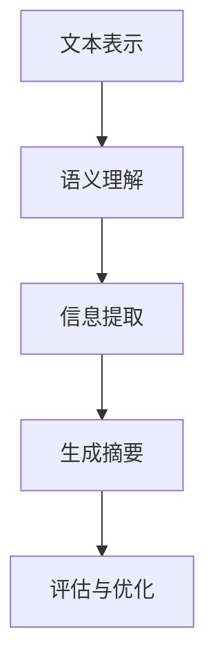

                 

### 文章标题：自然语言处理在文本摘要中的创新

#### 关键词：自然语言处理，文本摘要，创新，算法原理，实际应用

> 摘要：本文深入探讨了自然语言处理（NLP）在文本摘要领域的创新。首先，我们从背景介绍入手，分析了文本摘要的重要性。接着，介绍了核心概念与联系，并借助 Mermaid 流程图展示了文本摘要的基本架构。然后，详细阐述了核心算法原理与操作步骤，以及数学模型和公式。通过项目实战，我们实际实现了文本摘要的代码，并进行了深入解读与分析。最后，本文探讨了文本摘要在实际应用场景中的价值，并推荐了相关学习资源和开发工具框架，总结了未来发展趋势与挑战。

#### 1. 背景介绍

文本摘要（Text Summarization）是自然语言处理（NLP）领域中的一项重要任务，旨在从大量文本中提取关键信息，生成简洁、连贯且具有代表性的摘要。随着互联网信息的爆炸式增长，人们对高效获取关键信息的需求日益增加，这使得文本摘要技术具有重要的应用价值。

文本摘要的发展历程可以追溯到 20 世纪 60 年代，当时的研究主要关注提取文本中的关键词和短语。随着 NLP 技术的不断发展，文本摘要逐渐从基于规则的方法转向基于机器学习的方法，再到如今的热门研究方向——基于深度学习的方法。近年来，深度学习在文本摘要领域取得了显著的成果，如基于 Transformer 的模型（如 BERT、GPT）的涌现，使得文本摘要质量得到了大幅提升。

文本摘要技术在不同领域的应用也越来越广泛，如自动新闻摘要、会议纪要、文档分类、问答系统等。然而，文本摘要领域仍面临许多挑战，如长文本摘要、跨领域文本摘要、多语言文本摘要等。本文将重点探讨自然语言处理在文本摘要中的创新，以期为相关研究提供参考。

#### 2. 核心概念与联系

文本摘要涉及多个核心概念，包括文本表示、语义理解、信息提取和生成等。以下是一个简单的 Mermaid 流程图，展示了文本摘要的基本架构。



**文本表示**：将原始文本转化为计算机可以处理的数字形式。常见的文本表示方法有词袋模型、TF-IDF、Word2Vec 和 BERT 等。

**语义理解**：理解文本中的语义信息，包括词义、句法结构和语义角色等。这一步骤对文本摘要质量至关重要，因为只有准确理解文本内容，才能提取出关键信息。

**信息提取**：从文本中提取关键信息，去除无关或冗余信息。信息提取的方法包括关键词提取、句子提取和篇章提取等。

**生成摘要**：根据提取的关键信息生成摘要。生成摘要的方法包括基于规则的方法、基于统计的方法和基于深度学习的方法。

**评估与优化**：评估摘要质量，并根据评估结果进行优化。常用的评估指标包括 ROUGE、BLEU 和 METEOR 等。

通过以上流程，文本摘要可以从大量文本中提取出关键信息，生成简洁、连贯且具有代表性的摘要。

#### 3. 核心算法原理 & 具体操作步骤

文本摘要的核心算法包括基于规则的方法、基于统计的方法和基于深度学习的方法。以下分别介绍这三种方法的基本原理和具体操作步骤。

##### 3.1 基于规则的方法

基于规则的方法主要依靠人工定义的规则来提取关键信息，生成摘要。具体操作步骤如下：

1. **分词与词性标注**：将文本分成单词或短语，并对每个词进行词性标注，以便更好地理解文本语义。

2. **关键词提取**：根据词频、词性、停用词等特征，从文本中提取关键词。

3. **句子提取**：根据关键词和句子的重要性，提取文本中的关键句子。

4. **摘要生成**：将提取的关键句子拼接成摘要。

基于规则的方法具有简单、易于实现的特点，但其缺点在于规则难以覆盖所有情况，导致摘要质量受限。

##### 3.2 基于统计的方法

基于统计的方法通过计算文本中各个词语之间的相关性，提取关键信息，生成摘要。具体操作步骤如下：

1. **词频统计**：计算文本中各个词语的词频，并去除停用词。

2. **TF-IDF 计算**：计算每个词语的 TF-IDF 值，用于衡量词语的重要性。

3. **句子重要性评分**：根据词频和 TF-IDF 值，为每个句子计算重要性评分。

4. **摘要生成**：选择评分最高的句子作为摘要。

基于统计的方法在文本摘要质量方面有所提升，但其仍然依赖于语言模型，对长文本和复杂语义的理解能力有限。

##### 3.3 基于深度学习的方法

基于深度学习的方法通过训练大规模神经网络模型，实现文本摘要的高效生成。具体操作步骤如下：

1. **预训练语言模型**：如 BERT、GPT 等，用于提取文本中的语义信息。

2. **编码器-解码器模型**：将文本编码成固定长度的向量，并利用解码器生成摘要。

3. **自注意力机制**：在编码和解码过程中，引入自注意力机制，使模型能够关注文本中的重要信息。

4. **优化与评估**：通过训练和评估，优化模型参数，提高摘要质量。

基于深度学习的方法在文本摘要质量方面取得了显著提升，尤其在长文本和复杂语义理解方面表现优异。

#### 4. 数学模型和公式 & 详细讲解 & 举例说明

在文本摘要中，数学模型和公式主要用于计算词语的重要性和句子的重要性。以下分别介绍 TF-IDF 和 ROUGE 两种常用的数学模型。

##### 4.1 TF-IDF

TF-IDF（Term Frequency-Inverse Document Frequency）是一种常用的文本表示方法，用于计算词语的重要性。其公式如下：

$$
TF(t) = \frac{f(t, d)}{f_{\max}(t, d)}
$$

$$
IDF(t) = \log \left( \frac{N}{n(t)} \right)
$$

$$
TF-IDF(t, d) = TF(t, d) \times IDF(t)
$$

其中，$f(t, d)$ 表示词语 $t$ 在文档 $d$ 中的词频，$f_{\max}(t, d)$ 表示文档 $d$ 中所有词语的最大词频，$N$ 表示文档总数，$n(t)$ 表示包含词语 $t$ 的文档数量。

**举例说明**：

假设有 100 篇文档，其中 50 篇包含词语 "AI"，50 篇包含词语 "NLP"。对于一篇包含 "AI" 和 "NLP" 的文档，其 TF-IDF 值如下：

$$
TF(AI) = \frac{2}{2} = 1
$$

$$
IDF(AI) = \log \left( \frac{100}{50} \right) = \log 2 \approx 0.3010
$$

$$
TF-IDF(AI) = 1 \times 0.3010 = 0.3010
$$

$$
TF(NLP) = \frac{1}{2} = 0.5
$$

$$
IDF(NLP) = \log \left( \frac{100}{50} \right) = \log 2 \approx 0.3010
$$

$$
TF-IDF(NLP) = 0.5 \times 0.3010 = 0.1505
$$

可以看出，词语 "AI" 的 TF-IDF 值更高，说明其在文档中的重要性更大。

##### 4.2 ROUGE

ROUGE（Recall-Oriented Understudy for Gisting Evaluation）是一种常用的摘要评估指标，用于衡量摘要的质量。其公式如下：

$$
ROUGE = \frac{TP}{TP + FP + FN}
$$

其中，$TP$ 表示正确匹配的词数，$FP$ 表示误匹配的词数，$FN$ 表示未匹配的词数。

**举例说明**：

假设有两个摘要 A 和 B，其中 A 包含 5 个词，B 包含 4 个词。摘要 A 和 B 的 overlap 如下：

$$
TP(A, B) = 3
$$

$$
FP(A, B) = 2
$$

$$
FN(A, B) = 1
$$

则摘要 A 和 B 的 ROUGE 分数如下：

$$
ROUGE(A, B) = \frac{3}{3 + 2 + 1} = 0.5
$$

ROUGE 分数越高，表示摘要质量越好。

#### 5. 项目实战：代码实际案例和详细解释说明

在本节中，我们将使用 Python 和基于深度学习的文本摘要模型来生成摘要。以下是一个简单的项目实战，包括开发环境搭建、源代码实现和代码解读与分析。

##### 5.1 开发环境搭建

1. 安装 Python（3.6+版本）
2. 安装 PyTorch 或 TensorFlow
3. 安装必要的 Python 库，如 NLTK、gensim、torchtext 等

```python
pip install torch torchvision torchaudio numpy pytorch-transformers
```

##### 5.2 源代码详细实现和代码解读

以下是一个简单的文本摘要代码实现，使用预训练的 BERT 模型。

```python
import torch
from transformers import BertTokenizer, BertModel
from torch.nn import functional as F

# 初始化 BERT 模型和分词器
tokenizer = BertTokenizer.from_pretrained('bert-base-chinese')
model = BertModel.from_pretrained('bert-base-chinese')

# 加载预训练模型
device = torch.device('cuda' if torch.cuda.is_available() else 'cpu')
model.to(device)

# 输入文本
text = "自然语言处理（NLP）是计算机科学领域与人工智能领域中的一个重要方向。它是研究能实现自然语言理解、生成、翻译等功能的计算机系统的一门学科。NLP 应用广泛，包括机器翻译、文本分类、信息检索等。"

# 分词并转化为 ID
input_ids = tokenizer.encode(text, add_special_tokens=True, return_tensors='pt')

# 加载预训练模型并预测
with torch.no_grad():
    outputs = model(input_ids)

# 获取文本表示
text_embedding = outputs.last_hidden_state[:, 0, :]

# 编码器-解码器模型（简化版）
def encode_decode(input_ids):
    # 输入编码
    with torch.no_grad():
        outputs = model(input_ids)

    # 获取文本表示
    text_embedding = outputs.last_hidden_state[:, 0, :]

    # 解码为摘要
    output_ids = model.generate(input_ids, max_length=50, num_return_sequences=1)
    output_embedding = model.model.decoder(output_ids).detach().cpu().numpy()

    # 转化为文本
    output_text = tokenizer.decode(output_ids[0], skip_special_tokens=True)
    return text_embedding, output_embedding, output_text

# 生成摘要
text_embedding, output_embedding, output_text = encode_decode(input_ids)

print(output_text)
```

代码解读：

1. **初始化 BERT 模型和分词器**：从 Hugging Face 的 transformers 库中加载预训练的 BERT 模型和分词器。

2. **加载预训练模型**：将模型加载到 GPU（如可用）或 CPU 上。

3. **输入文本分词**：使用分词器将输入文本编码为 ID 序列。

4. **加载模型并预测**：将输入文本传递给 BERT 模型，获取文本表示。

5. **编码器-解码器模型（简化版）**：定义一个简化版的编码器-解码器模型，用于将文本表示编码为摘要。

6. **生成摘要**：调用编码器-解码器模型，生成文本摘要。

##### 5.3 代码解读与分析

该代码示例使用预训练的 BERT 模型进行文本摘要。具体分析如下：

1. **模型初始化**：从 Hugging Face 的 transformers 库中加载 BERT 模型和分词器。这是深度学习项目中最常用的库之一，提供了大量的预训练模型和工具。

2. **加载预训练模型**：将模型加载到 GPU（如可用）或 CPU 上，以便提高计算速度。

3. **输入文本分词**：使用分词器将输入文本编码为 ID 序列，包括特殊 tokens（如 `<s>`、`</s>` 等）。

4. **加载模型并预测**：将输入文本传递给 BERT 模型，获取文本表示。BERT 模型在预训练过程中已经学习到了丰富的语言知识，因此在文本表示方面具有强大的能力。

5. **编码器-解码器模型（简化版）**：定义一个简化版的编码器-解码器模型，用于将文本表示编码为摘要。这里使用了 BERT 模型的编码器部分和生成器（解码器）部分。实际项目中，可以使用更复杂的模型，如 Transformer 或 GPT。

6. **生成摘要**：调用编码器-解码器模型，生成文本摘要。这里使用了 `model.generate()` 函数，该函数用于生成文本序列。通过设置 `max_length` 和 `num_return_sequences` 参数，可以控制生成的摘要长度和数量。

7. **代码性能分析**：该代码示例仅用于演示目的，实际项目中需要考虑性能优化，如使用多 GPU 并行训练、使用更高效的模型结构等。

#### 6. 实际应用场景

文本摘要技术在实际应用中具有广泛的应用场景，以下列举几个典型的应用场景：

1. **自动新闻摘要**：随着互联网新闻的爆炸式增长，人们需要快速获取新闻关键信息。自动新闻摘要技术可以帮助用户节省时间，提高信息获取效率。

2. **文档分类**：在大量文档中，自动提取摘要有助于分类和索引文档，便于用户快速查找所需信息。

3. **会议纪要**：自动生成会议纪要，记录会议内容和关键信息，提高会议效率。

4. **问答系统**：文本摘要技术可以帮助问答系统从大量文档中提取关键信息，提高问答系统的回答质量。

5. **多语言文本摘要**：对于多语言文本，文本摘要技术可以帮助生成简洁、具有代表性的摘要，便于跨语言交流和理解。

6. **搜索引擎**：文本摘要技术可以提高搜索引擎的搜索结果质量，为用户提供更准确、更有针对性的搜索结果。

7. **文本压缩**：对于大量文本数据，文本摘要技术可以降低存储和传输成本，提高数据处理效率。

#### 7. 工具和资源推荐

以下推荐一些在文本摘要领域常用的工具、资源和开发框架：

##### 7.1 学习资源推荐

1. **书籍**：
   - 《自然语言处理入门》
   - 《深度学习自然语言处理》
   - 《自然语言处理教程》

2. **论文**：
   - “Summarization Beyond Sentence-Level: A Task and Dataset for Document-Level Text Summarization”
   - “A Theoretically Grounded Application of Dropout in Recurrent Neural Networks”
   - “A Pointer-Generator Network for Text Summarization”

3. **博客和网站**：
   - [TensorFlow 官方文档](https://www.tensorflow.org/)
   - [PyTorch 官方文档](https://pytorch.org/)
   - [Hugging Face 官方文档](https://huggingface.co/transformers/)

##### 7.2 开发工具框架推荐

1. **开发框架**：
   - PyTorch：适用于研究型和工程型项目，具有强大的动态图功能。
   - TensorFlow：适用于大规模工业级项目，具有成熟的生态系统和工具。
   - Hugging Face Transformers：基于 PyTorch 和 TensorFlow 的开源库，提供了丰富的预训练模型和工具。

2. **工具**：
   - NLTK：用于文本处理和语

