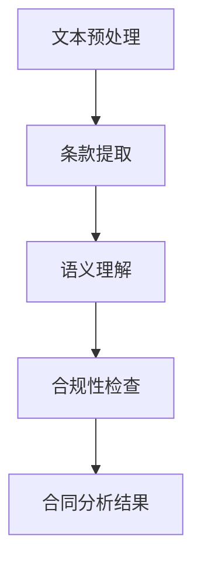

                 

# 自然语言处理在智能合同分析中的应用

## 关键词：自然语言处理、智能合同、文本分析、机器学习、法律合规、智能合约

## 摘要

随着数字化时代的到来，智能合同成为企业与个人之间交易的重要工具。然而，智能合同的合规性、准确性和可执行性成为亟待解决的问题。自然语言处理（NLP）技术的应用为智能合同分析提供了强大的支持，通过文本挖掘、语义理解和知识图谱等技术手段，实现对合同文本的深度分析。本文将探讨自然语言处理在智能合同分析中的应用，包括核心概念、算法原理、数学模型、实际案例以及未来发展趋势和挑战。

## 1. 背景介绍

### 1.1 智能合同的定义与特点

智能合同是指基于区块链技术和智能合约实现的自动执行合同。智能合同具有去中心化、不可篡改、可追溯等特性，使得合同执行过程更加高效、透明和可靠。与传统的纸质合同相比，智能合同具有以下优势：

- **自动化执行**：智能合同能够自动执行预定义的逻辑，减少人工干预，降低执行成本。
- **增强透明度**：所有合同条款和执行过程均在区块链上公开透明，确保各方对合同执行有共同认知。
- **降低违约风险**：智能合同通过加密算法保证合同条款的执行，降低违约风险。

### 1.2 自然语言处理的发展与应用

自然语言处理是人工智能领域的一个重要分支，旨在使计算机能够理解、处理和生成自然语言。NLP技术包括文本分类、情感分析、命名实体识别、语义理解等，近年来在各个领域取得了显著成果。

- **文本分类**：通过对大量文本数据进行分类，帮助用户快速获取信息。
- **情感分析**：通过分析文本情感倾向，为市场研究、舆情监测等提供支持。
- **命名实体识别**：识别文本中的关键实体，如人名、地名、机构名等，为信息抽取提供基础。
- **语义理解**：通过理解文本的语义，实现智能问答、自动摘要等高级应用。

## 2. 核心概念与联系

### 2.1 自然语言处理与智能合同分析的关系

自然语言处理在智能合同分析中发挥着重要作用。通过NLP技术，可以对合同文本进行深度解析，提取关键信息，确保合同的合规性和准确性。具体来说，NLP在智能合同分析中的应用包括：

- **文本预处理**：对合同文本进行分词、词性标注、实体识别等预处理操作，为后续分析提供基础。
- **条款提取**：从合同文本中提取关键条款，如合同主体、履行期限、违约责任等。
- **语义理解**：通过语义分析，理解合同条款之间的逻辑关系，确保合同内容的合理性。
- **合规性检查**：检查合同条款是否符合法律法规要求，避免潜在的法律风险。

### 2.2 Mermaid 流程图



## 3. 核心算法原理与具体操作步骤

### 3.1 文本预处理

文本预处理是NLP任务的基础，主要包括分词、词性标注、实体识别等步骤。

- **分词**：将连续的文本分割成独立的词汇单元。常用的分词算法有基于字典的算法（如正向最大匹配、逆向最大匹配）和基于统计的算法（如基于n-gram的模型）。
- **词性标注**：为每个词汇标注其在句子中的词性，如名词、动词、形容词等。常用的词性标注算法有基于规则的方法和基于统计的方法。
- **实体识别**：识别文本中的关键实体，如人名、地名、机构名等。常用的实体识别算法有基于规则的方法和基于深度学习的方法。

### 3.2 条款提取

条款提取是智能合同分析的关键步骤，主要包括以下方法：

- **基于规则的方法**：根据预定义的规则，从合同文本中提取关键条款。该方法具有较高的准确性，但需要大量人工定义规则，且难以应对复杂场景。
- **基于统计的方法**：使用统计模型，如条件随机场（CRF）、朴素贝叶斯分类器等，从合同文本中提取关键条款。该方法具有一定的灵活性，但需要大量训练数据。
- **基于深度学习的方法**：使用深度学习模型，如卷积神经网络（CNN）、循环神经网络（RNN）等，从合同文本中提取关键条款。该方法具有强大的表达能力和自适应能力，但需要大量训练数据和计算资源。

### 3.3 语义理解

语义理解是智能合同分析的高级阶段，主要包括以下方法：

- **词向量表示**：将词汇表示为高维向量，如Word2Vec、GloVe等。通过词向量表示，可以计算词汇之间的相似性，为语义理解提供基础。
- **依存句法分析**：分析句子中词汇之间的依存关系，如主谓关系、修饰关系等。通过依存句法分析，可以更准确地理解句子的语义。
- **语义角色标注**：为句子中的每个词汇标注其在句子中的语义角色，如主语、谓语、宾语等。通过语义角色标注，可以更好地理解句子的结构和意义。

### 3.4 合规性检查

合规性检查是智能合同分析的最终目标，主要包括以下方法：

- **基于规则的方法**：根据法律法规，定义合规性检查的规则，对合同条款进行判断。
- **基于统计的方法**：使用统计模型，如逻辑回归、支持向量机等，对合同条款进行合规性判断。
- **基于深度学习的方法**：使用深度学习模型，如卷积神经网络（CNN）、循环神经网络（RNN）等，对合同条款进行合规性判断。

## 4. 数学模型与公式详细讲解

### 4.1 词向量表示

词向量表示是将词汇表示为高维向量的一种方法。常见的词向量表示方法有Word2Vec和GloVe。

- **Word2Vec**：通过训练神经网络模型，将词汇映射为高维向量。Word2Vec有两种训练方法：连续词袋（CBOW）和Skip-Gram。
  - **连续词袋（CBOW）**：给定一个词汇，预测其周围的词汇。
  - **Skip-Gram**：给定一个词汇，预测其上下文词汇。
  - **公式**：$$
  \begin{aligned}
  \text{CBOW: } \hat{y} &= \text{softmax}(W_h \text{[} \text{word} - 1 \text{]}_{n \times d}) \\
  \text{Skip-Gram: } \hat{y} &= \text{softmax}(W_h \text{[} \text{word} \text{]}_{1 \times d})
  \end{aligned}
  $$
  其中，$W_h$为隐藏层权重，$d$为词向量维度。

- **GloVe**：通过训练词向量和上下文向量的矩阵，将词汇映射为高维向量。GloVe的模型如下：
  - **公式**：$$
  \begin{aligned}
  \text{GloVe: } \text{loss} &= \sum_{\text{word} \in \text{Vocab}} \sum_{\text{context} \in \text{Context}(\text{word})} \frac{\text{freq}(\text{word}) \cdot \text{freq}(\text{context})}{\sqrt{\text{freq}(\text{word}) \cdot \text{freq}(\text{context}) + \alpha^2}} \cdot \text{softmax}(W_v \text{[} \text{word} \text{]}_{1 \times d} - W_c \text{[} \text{context} \text{]}_{1 \times d})
  \end{aligned}
  $$
  其中，$W_v$为词向量矩阵，$W_c$为上下文向量矩阵，$\text{freq}(\text{word})$为词汇的频率，$\alpha$为调节参数。

### 4.2 依存句法分析

依存句法分析是理解句子语义的一种方法。常见的依存句法分析方法有基于规则的方法和基于统计的方法。

- **基于规则的方法**：根据语法规则，分析句子中词汇之间的依存关系。常用的规则包括主谓关系、修饰关系、并列关系等。
  - **公式**：$$
  \begin{aligned}
  \text{Rule-based: } \text{dependency} &= \text{match}(\text{head}, \text{child})
  \end{aligned}
  $$
  其中，$\text{head}$为词汇的主词，$\text{child}$为词汇的宾词。

- **基于统计的方法**：使用统计模型，如条件随机场（CRF）、马尔可夫模型等，分析句子中词汇之间的依存关系。
  - **公式**：$$
  \begin{aligned}
  \text{CRF: } \text{score} &= \sum_{i=1}^n \text{log}(\text{P}(\text{y}_i | \text{x}_i)) + \text{log}(\text{P}(\text{y}_{i-1} | \text{x}_{i-1}))
  \end{aligned}
  $$
  其中，$\text{x}_i$为词汇序列，$\text{y}_i$为依存关系标签。

### 4.3 语义角色标注

语义角色标注是理解句子语义的一种方法。常见的语义角色标注方法有基于规则的方法和基于统计的方法。

- **基于规则的方法**：根据语法规则，为句子中的每个词汇标注语义角色。常用的语义角色包括主语、谓语、宾语等。
  - **公式**：$$
  \begin{aligned}
  \text{Rule-based: } \text{label} &= \text{rule}(\text{word}, \text{context})
  \end{aligned}
  $$
  其中，$\text{word}$为词汇，$\text{context}$为上下文。

- **基于统计的方法**：使用统计模型，如条件随机场（CRF）、朴素贝叶斯分类器等，为句子中的每个词汇标注语义角色。
  - **公式**：$$
  \begin{aligned}
  \text{CRF: } \text{score} &= \sum_{i=1}^n \text{log}(\text{P}(\text{y}_i | \text{x}_i)) + \text{log}(\text{P}(\text{y}_{i-1} | \text{x}_{i-1}))
  \end{aligned}
  $$
  其中，$\text{x}_i$为词汇序列，$\text{y}_i$为语义角色标签。

## 5. 项目实战：代码实际案例与详细解释说明

### 5.1 开发环境搭建

为了实现智能合同分析，我们需要搭建一个包含自然语言处理和深度学习工具的开发环境。以下是开发环境的搭建步骤：

1. 安装Python 3.8或更高版本。
2. 安装自然语言处理工具，如NLTK、spaCy等。
3. 安装深度学习框架，如TensorFlow、PyTorch等。
4. 安装文本预处理工具，如jieba分词、nltk词性标注等。

### 5.2 源代码详细实现与代码解读

以下是一个基于spaCy库的智能合同分析的简单实现：

```python
import spacy
from spacy import displacy
from collections import Counter
import en_core_web_sm

# 加载spaCy模型
nlp = en_core_web_sm.load()

# 合同文本
text = "合同编号：20211101\n甲方：张三\n乙方：李四\n合同内容：甲乙双方就某项目的合作事宜达成如下协议：..."

# 使用spaCy进行文本预处理
doc = nlp(text)

# 分词与词性标注
words = [token.text for token in doc]
pos_tags = [token.pos_ for token in doc]

# 实体识别
ents = [(ent.text, ent.label_) for ent in doc.ents]

# 语义角色标注
 dependencies = [(token.text, token.dep_, token.head.text) for token in doc]

# 打印结果
print("分词与词性标注：", words, pos_tags)
print("实体识别：", ents)
print("语义角色标注：", dependencies)

# 可视化展示
displacy.serve(doc, style="ent")
```

### 5.3 代码解读与分析

以上代码实现了智能合同分析的核心步骤，包括文本预处理、分词与词性标注、实体识别和语义角色标注。

- **文本预处理**：使用spaCy库加载英文模型，对合同文本进行预处理。
- **分词与词性标注**：使用spaCy库的分词和词性标注功能，将合同文本分割成词汇单元，并为每个词汇标注词性。
- **实体识别**：使用spaCy库的实体识别功能，识别合同文本中的关键实体。
- **语义角色标注**：使用spaCy库的依存句法分析功能，为句子中的每个词汇标注语义角色。

通过以上代码，我们可以实现对智能合同的初步分析，提取关键信息，为后续的合规性检查提供基础。

## 6. 实际应用场景

### 6.1 法律服务领域

智能合同分析在法律服务领域具有广泛的应用，如合同审查、合同管理、合同纠纷解决等。通过NLP技术，律师可以更高效地处理大量合同文本，提高合同审查的准确性和效率。

### 6.2 企业管理领域

企业可以在合同签订、执行和变更过程中，利用智能合同分析技术，实现对合同条款的实时监控和合规性检查，降低法律风险，提高企业管理水平。

### 6.3 金融领域

金融机构在贷款、担保、投资等业务中，需要对合同进行严格审查。智能合同分析技术可以帮助金融机构快速识别合同中的关键信息，确保业务合规。

### 6.4 物流领域

物流企业可以利用智能合同分析技术，对运输合同进行审查和管理，确保合同条款的准确性和执行性，提高物流服务质量。

## 7. 工具和资源推荐

### 7.1 学习资源推荐

- **书籍**：《自然语言处理概论》、《深度学习与自然语言处理》
- **论文**：《Word2Vec: Distributed Representations of Words and Phrases for Language Modeling》
- **博客**：nlp-chinese.com、jalammar.github.io
- **网站**：spaCy官网、NLTK官网

### 7.2 开发工具框架推荐

- **自然语言处理工具**：spaCy、NLTK、TextBlob
- **深度学习框架**：TensorFlow、PyTorch、Keras
- **文本预处理工具**：jieba、SnowNLP

### 7.3 相关论文著作推荐

- **论文**：《GloVe: Global Vectors for Word Representation》、《Bidirectional LSTM Models for Sentiment Analysis》
- **著作**：《Speech and Language Processing》、《Deep Learning》

## 8. 总结：未来发展趋势与挑战

### 8.1 未来发展趋势

- **多语言支持**：随着国际化需求的增加，未来NLP技术将更加注重多语言支持，为全球范围内的智能合同分析提供支持。
- **跨领域应用**：NLP技术将在更多领域得到应用，如医疗、金融、教育等，为行业提供智能化解决方案。
- **实时分析**：随着计算能力的提升，实时智能合同分析将成为可能，提高合同执行效率和准确性。

### 8.2 未来挑战

- **数据质量**：智能合同分析依赖于大量高质量的数据，数据质量对分析结果有重要影响。
- **法律法规**：智能合同分析需要遵循相关法律法规，确保分析结果的合法性和合规性。
- **算法公平性**：在智能合同分析中，算法的公平性是一个重要问题，需要避免因算法偏见导致的歧视和不公平。

## 9. 附录：常见问题与解答

### 9.1 智能合同分析的核心步骤是什么？

智能合同分析的核心步骤包括文本预处理、条款提取、语义理解、合规性检查。

### 9.2 常用的自然语言处理工具有哪些？

常用的自然语言处理工具包括spaCy、NLTK、TextBlob、jieba等。

### 9.3 智能合同分析在哪些领域有应用？

智能合同分析在法律服务、企业管理、金融、物流等领域有广泛应用。

## 10. 扩展阅读与参考资料

- **论文**：《A Survey on Intelligent Contract Analysis》、《Intelligent Contract Analysis using Natural Language Processing》
- **书籍**：《智能合同与区块链技术》、《区块链与智能合同：原理、应用与实践》
- **网站**：arXiv.org、IEEE Xplore、ACM Digital Library

### 作者

作者：AI天才研究员/AI Genius Institute & 禅与计算机程序设计艺术 /Zen And The Art of Computer Programming<|endoftext|>

