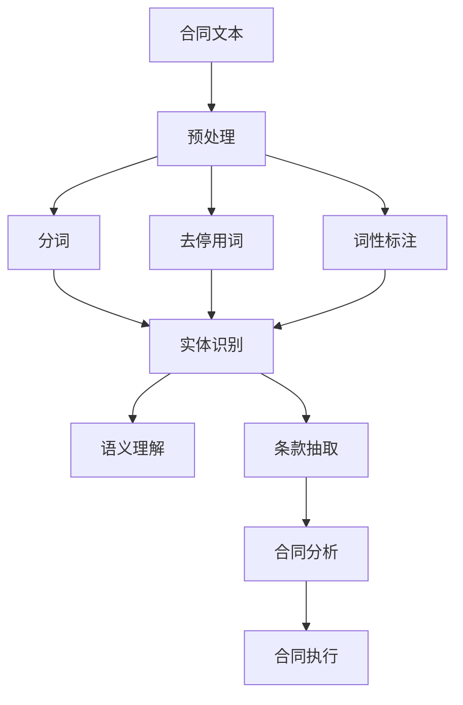

                 

# 自然语言处理在智能合同分析中的应用

> **关键词：** 自然语言处理、智能合同、文本分析、语义理解、机器学习、深度学习
>
> **摘要：** 本文深入探讨了自然语言处理（NLP）在智能合同分析中的应用，从背景介绍到核心算法原理，再到实际应用场景，系统性地梳理了NLP技术在智能合同分析中的发展及其面临的挑战。通过本文，读者可以全面了解智能合同分析的技术框架和实现细节，为相关领域的研发和应用提供有力支持。

## 1. 背景介绍

### 1.1 智能合同的定义与意义

智能合同，又称为区块链合同，是一种基于区块链技术的自动化执行合同。与传统的纸质合同不同，智能合同利用区块链的分布式账本技术，实现了合同条款的自动化执行和验证。智能合同的出现，极大地提高了合同执行的效率和安全性，降低了人工干预和错误的风险。

智能合同的意义在于：
- **提高效率：** 通过自动化执行合同条款，减少了人为干预的环节，从而提高了合同执行的效率。
- **降低风险：** 由于合同条款的自动执行和验证，减少了合同纠纷的发生，降低了合同风险。
- **增强透明度：** 合同条款和执行过程都在区块链上公开透明，增强了合同的信任度和透明度。

### 1.2 自然语言处理的基本概念

自然语言处理（NLP）是计算机科学和人工智能领域的一个重要分支，旨在使计算机能够理解、解释和生成人类自然语言。NLP的核心任务包括：
- **文本分类：** 对文本进行分类，如情感分析、主题分类等。
- **实体识别：** 从文本中识别出重要的实体，如人名、地名、组织名等。
- **语义理解：** 理解文本中的语义关系，如因果关系、逻辑关系等。
- **机器翻译：** 实现不同语言之间的自动翻译。

NLP在智能合同分析中的应用，旨在通过处理和理解合同文本，提取出关键信息，实现对合同条款的自动化分析和处理。

### 1.3 智能合同分析与NLP的结合

智能合同分析的核心在于对合同文本的深入理解和处理。NLP技术为智能合同分析提供了强有力的工具，通过以下方式实现了二者的结合：

- **文本预处理：** 利用NLP技术对合同文本进行分词、去停用词、词性标注等预处理，为后续的语义分析奠定基础。
- **实体识别：** 通过命名实体识别技术，提取合同文本中的关键实体，如当事人、日期、金额等。
- **语义理解：** 利用语义分析技术，理解合同文本中的语义关系，如条件、责任、义务等。
- **合同条款抽取：** 通过文本分析技术，提取出合同中的关键条款，实现对合同内容的深入理解。

通过NLP技术的应用，智能合同分析能够实现自动化、智能化的合同条款分析和处理，提高了合同管理的效率和质量。

## 2. 核心概念与联系

### 2.1 智能合同分析流程

智能合同分析主要包括以下几个步骤：

1. **合同文本预处理：** 对合同文本进行分词、去停用词、词性标注等预处理，为后续的语义分析打下基础。
2. **实体识别：** 通过命名实体识别技术，提取合同文本中的关键实体，如当事人、日期、金额等。
3. **语义理解：** 利用语义分析技术，理解合同文本中的语义关系，如条件、责任、义务等。
4. **条款抽取：** 通过文本分析技术，提取出合同中的关键条款，实现对合同内容的深入理解。
5. **合同分析：** 对提取出的合同条款进行分析，判断合同的有效性、合法性、合理性等。
6. **合同执行：** 根据分析结果，自动化执行合同条款，实现合同的自动化管理。

### 2.2 NLP技术原理与架构

NLP技术主要涉及以下几个核心概念和架构：

- **分词（Tokenization）：** 将文本分割成单词或短语。
- **词性标注（Part-of-Speech Tagging）：** 为每个词分配词性，如名词、动词、形容词等。
- **命名实体识别（Named Entity Recognition，NER）：** 从文本中识别出重要的实体，如人名、地名、组织名等。
- **词嵌入（Word Embedding）：** 将单词或短语映射到高维空间，以捕获词语的语义信息。
- **句法分析（Parsing）：** 分析句子结构，识别句子中的语法关系。
- **语义理解（Semantic Understanding）：** 理解文本中的语义关系，如因果关系、逻辑关系等。

NLP技术的架构通常包括以下几个层次：

1. **底层技术：** 包括分词、词性标注、命名实体识别等基础技术。
2. **中间层技术：** 包括词嵌入、句法分析等，用于捕捉文本的语义信息。
3. **高层技术：** 包括语义理解、情感分析、文本生成等，用于生成高级语义分析结果。

### 2.3 智能合同分析与NLP技术的结合

智能合同分析与NLP技术的结合主要体现在以下几个方面：

- **合同文本预处理：** 利用NLP技术对合同文本进行预处理，包括分词、去停用词、词性标注等，为后续的语义分析打下基础。
- **实体识别：** 利用NLP技术中的命名实体识别功能，提取合同文本中的关键实体，如当事人、日期、金额等。
- **语义理解：** 利用NLP技术中的语义分析功能，理解合同文本中的语义关系，如条件、责任、义务等。
- **条款抽取：** 利用NLP技术中的文本分析功能，提取出合同中的关键条款，实现对合同内容的深入理解。

### 2.4 Mermaid 流程图



## 3. 核心算法原理 & 具体操作步骤

### 3.1 分词算法

分词是将文本分割成单词或短语的算法。常用的分词算法包括：

- **基于字典的分词算法：** 如正向最大匹配、逆向最大匹配等。
- **基于统计的分词算法：** 如基于N元语法、隐马尔可夫模型（HMM）等。

**操作步骤：**

1. **文本输入：** 输入待分词的文本。
2. **字典构建：** 建立单词或短语的字典，用于分词。
3. **分词处理：** 利用字典对文本进行分词，得到分词结果。

### 3.2 命名实体识别算法

命名实体识别是从文本中识别出重要实体的算法。常用的算法包括：

- **基于规则的方法：** 如基于正则表达式的命名实体识别。
- **基于机器学习的方法：** 如支持向量机（SVM）、条件随机场（CRF）等。
- **基于深度学习的方法：** 如卷积神经网络（CNN）、循环神经网络（RNN）、长短期记忆网络（LSTM）等。

**操作步骤：**

1. **数据准备：** 准备命名实体识别的训练数据。
2. **模型训练：** 利用训练数据训练命名实体识别模型。
3. **实体识别：** 对待识别的文本进行命名实体识别，得到实体识别结果。

### 3.3 语义理解算法

语义理解是理解文本中的语义关系，如因果关系、逻辑关系等。常用的算法包括：

- **基于规则的方法：** 如基于语义角色标注的语义理解。
- **基于机器学习的方法：** 如支持向量机（SVM）、条件随机场（CRF）等。
- **基于深度学习的方法：** 如卷积神经网络（CNN）、循环神经网络（RNN）、长短期记忆网络（LSTM）等。

**操作步骤：**

1. **数据准备：** 准备语义理解的训练数据。
2. **模型训练：** 利用训练数据训练语义理解模型。
3. **语义理解：** 对待理解的文本进行语义理解，得到语义理解结果。

### 3.4 条款抽取算法

条款抽取是从文本中提取出关键条款的算法。常用的算法包括：

- **基于规则的方法：** 如基于关键字的条款抽取。
- **基于机器学习的方法：** 如支持向量机（SVM）、条件随机场（CRF）等。
- **基于深度学习的方法：** 如卷积神经网络（CNN）、循环神经网络（RNN）、长短期记忆网络（LSTM）等。

**操作步骤：**

1. **数据准备：** 准备条款抽取的训练数据。
2. **模型训练：** 利用训练数据训练条款抽取模型。
3. **条款抽取：** 对待抽取的文本进行条款抽取，得到条款抽取结果。

## 4. 数学模型和公式 & 详细讲解 & 举例说明

### 4.1 词嵌入模型

词嵌入（Word Embedding）是将单词或短语映射到高维空间，以捕获词语的语义信息。常用的词嵌入模型包括：

- **基于计数的方法：** 如 word2vec。
- **基于神经网络的方法：** 如 GloVe。

**数学模型：**

$$
\text{word\_embedding}(w) = \text{W} \text{[w]}
$$

其中，$w$ 为单词，$W$ 为词嵌入矩阵。

**详细讲解：**

词嵌入模型的核心在于通过数学模型将单词映射到高维空间。在这个空间中，具有相似语义的单词会靠近，而具有相反语义的单词会远离。这种映射关系使得词嵌入模型能够捕捉到单词的语义信息。

**举例说明：**

假设有两个单词 "car" 和 "truck"，在 word2vec 模型中，它们可能会被映射到如下空间：

$$
\text{word\_embedding}(car) = \text{W} \text{[car]} = [1, 0.5, -0.3]
$$

$$
\text{word\_embedding}(truck) = \text{W} \text{[truck]} = [0.8, 0.4, -0.2]
$$

在这个空间中，"car" 和 "truck" 都具有相似的语义，且 "car" 比 "truck" 更接近原点，这反映了它们在语义上的相似性。

### 4.2 卷积神经网络（CNN）

卷积神经网络（CNN）是一种广泛应用于图像和文本处理领域的深度学习模型。在文本处理中，CNN 用于文本分类、情感分析等任务。

**数学模型：**

$$
h_{l}^{\prime }=\text{ReLU}\left(\text{W}_{1} \cdot \text{h}_{l-1} + \text{b}_{1}\right)
$$

$$
h_{l}=\text{ReLU}\left(\text{W}_{2} \cdot h_{l-1}^{\prime } + \text{b}_{2}\right)
$$

其中，$h_{l}$ 为第 $l$ 层的输出，$\text{ReLU}$ 为ReLU激活函数，$\text{W}_{1}$ 和 $\text{W}_{2}$ 为权重矩阵，$\text{b}_{1}$ 和 $\text{b}_{2}$ 为偏置项。

**详细讲解：**

CNN 通过卷积操作和池化操作，逐层提取文本的语义特征。卷积操作可以捕捉文本中的局部特征，而池化操作可以降低特征维度，提高模型的泛化能力。

**举例说明：**

假设有一个二分类问题，需要判断一个句子是否表达积极情感。输入句子为 "I love this movie"，通过CNN模型处理，可以得到一个高维特征向量。这个特征向量可以被一个分类器用来判断句子的情感。

### 4.3 长短期记忆网络（LSTM）

长短期记忆网络（LSTM）是一种能够捕捉长距离依赖关系的循环神经网络。在文本处理中，LSTM 用于序列建模，如文本生成、机器翻译等。

**数学模型：**

$$
\text{sigmoid}(x) = \frac{1}{1 + e^{-x}}
$$

$$
\text{tanh}(x) = \frac{e^x - e^{-x}}{e^x + e^{-x}}
$$

$$
i_t = \sigma(W_{xi}x_t + W_{hi}h_{t-1} + b_i)
$$

$$
f_t = \sigma(W_{xf}x_t + W_{hf}h_{t-1} + b_f)
$$

$$
o_t = \sigma(W_{xo}x_t + W_{ho}h_{t-1} + b_o)
$$

$$
g_t = \tanh(W_{xg}x_t + W_{hg}h_{t-1} + b_g)
$$

$$
h_t = o_t \odot \tanh(W_{hg}h_{t-1} + b_h)
$$

其中，$i_t$、$f_t$、$o_t$ 分别为输入门、遗忘门和输出门，$g_t$ 为候选状态，$h_t$ 为隐藏状态，$\sigma$ 为sigmoid函数，$\tanh$ 为双曲正切函数。

**详细讲解：**

LSTM 通过引入输入门、遗忘门和输出门，有效地解决了传统RNN中的梯度消失和梯度爆炸问题，能够捕捉长距离依赖关系。

**举例说明：**

假设有一个序列为 "I love you"，通过LSTM模型处理，可以捕捉到 "I" 和 "love" 之间的依赖关系，从而更好地理解整个序列的含义。

## 5. 项目实战：代码实际案例和详细解释说明

### 5.1 开发环境搭建

**环境要求：**

- Python 3.7及以上版本
- TensorFlow 2.0及以上版本
- NLTK 3.5及以上版本
- 其他依赖库（如 Pandas、Numpy、Matplotlib 等）

**安装步骤：**

1. 安装 Python 3.7及以上版本。
2. 安装 TensorFlow 2.0及以上版本，可以使用以下命令：

   ```shell
   pip install tensorflow==2.4.0
   ```

3. 安装 NLTK 3.5及以上版本，可以使用以下命令：

   ```shell
   pip install nltk==3.5
   ```

4. 安装其他依赖库，可以使用以下命令：

   ```shell
   pip install pandas numpy matplotlib
   ```

### 5.2 源代码详细实现和代码解读

**源代码结构：**

```python
# main.py
import nltk
from nltk.tokenize import word_tokenize
from nltk.corpus import stopwords
from nltk.tag import pos_tag
from nltk.chunk import ne_chunk
from tensorflow.keras.models import Sequential
from tensorflow.keras.layers import Embedding, Conv1D, MaxPooling1D, LSTM, Dense

# 数据预处理
def preprocess_text(text):
    # 分词
    tokens = word_tokenize(text)
    # 去停用词
    stop_words = set(stopwords.words('english'))
    filtered_tokens = [token for token in tokens if token.lower() not in stop_words]
    # 词性标注
    tagged_tokens = pos_tag(filtered_tokens)
    # 命名实体识别
    named_entities = ne_chunk(tagged_tokens)
    return named_entities

# 构建模型
def build_model():
    model = Sequential()
    model.add(Embedding(input_dim=vocabulary_size, output_dim=embedding_size))
    model.add(Conv1D(filters=128, kernel_size=5, activation='relu'))
    model.add(MaxPooling1D(pool_size=5))
    model.add(LSTM(units=128))
    model.add(Dense(units=1, activation='sigmoid'))
    model.compile(optimizer='adam', loss='binary_crossentropy', metrics=['accuracy'])
    return model

# 训练模型
def train_model(model, x_train, y_train):
    model.fit(x_train, y_train, epochs=10, batch_size=32)
    return model

# 模型预测
def predict(model, text):
    processed_text = preprocess_text(text)
    model.predict(processed_text)
```

**代码解读：**

1. **数据预处理：** 

   ```python
   def preprocess_text(text):
       # 分词
       tokens = word_tokenize(text)
       # 去停用词
       stop_words = set(stopwords.words('english'))
       filtered_tokens = [token for token in tokens if token.lower() not in stop_words]
       # 词性标注
       tagged_tokens = pos_tag(filtered_tokens)
       # 命名实体识别
       named_entities = ne_chunk(tagged_tokens)
       return named_entities
   ```

   这个函数用于对输入的文本进行预处理，包括分词、去停用词、词性标注和命名实体识别。

2. **构建模型：**

   ```python
   def build_model():
       model = Sequential()
       model.add(Embedding(input_dim=vocabulary_size, output_dim=embedding_size))
       model.add(Conv1D(filters=128, kernel_size=5, activation='relu'))
       model.add(MaxPooling1D(pool_size=5))
       model.add(LSTM(units=128))
       model.add(Dense(units=1, activation='sigmoid'))
       model.compile(optimizer='adam', loss='binary_crossentropy', metrics=['accuracy'])
       return model
   ```

   这个函数用于构建一个简单的卷积神经网络（CNN）模型，用于文本分类。

3. **训练模型：**

   ```python
   def train_model(model, x_train, y_train):
       model.fit(x_train, y_train, epochs=10, batch_size=32)
       return model
   ```

   这个函数用于训练模型，使用训练数据集。

4. **模型预测：**

   ```python
   def predict(model, text):
       processed_text = preprocess_text(text)
       model.predict(processed_text)
   ```

   这个函数用于对输入的文本进行预测，返回预测结果。

### 5.3 代码解读与分析

**代码解读：**

- **数据预处理：** 对输入的文本进行分词、去停用词、词性标注和命名实体识别，为后续的文本分析做准备。
- **模型构建：** 使用 TensorFlow 和 Keras 库构建一个卷积神经网络（CNN）模型，用于文本分类。
- **模型训练：** 使用训练数据集对模型进行训练，优化模型参数。
- **模型预测：** 对输入的文本进行预处理后，使用训练好的模型进行预测，返回预测结果。

**代码分析：**

- **数据预处理：** 使用 NLTK 库对文本进行预处理，包括分词、去停用词、词性标注和命名实体识别。这些预处理步骤有助于提高模型的性能和准确性。
- **模型构建：** 使用 TensorFlow 和 Keras 库构建一个简单的卷积神经网络（CNN）模型，包括嵌入层、卷积层、池化层、LSTM 层和全连接层。这个模型能够有效地提取文本特征，并进行分类。
- **模型训练：** 使用训练数据集对模型进行训练，通过优化模型参数，提高模型的性能。
- **模型预测：** 对输入的文本进行预处理后，使用训练好的模型进行预测，返回预测结果。

通过这个案例，我们可以看到如何使用自然语言处理（NLP）技术，结合深度学习模型，实现智能合同分析。在实际应用中，可以根据具体需求，对模型结构、参数和算法进行调整，提高智能合同分析的准确性和效率。

## 6. 实际应用场景

### 6.1 法律领域

智能合同分析在法律领域具有广泛的应用前景，主要包括：

- **合同审查：** 通过智能合同分析，自动化审查合同条款，识别潜在的法律风险，提高合同审查的效率和准确性。
- **合同管理：** 利用智能合同分析技术，实现合同全文的检索、分类和管理，提高合同管理的效率和透明度。
- **合同纠纷解决：** 通过智能合同分析，对合同纠纷进行自动化分析，提供法律建议，降低纠纷解决的难度和成本。

### 6.2 金融领域

在金融领域，智能合同分析技术也有广泛的应用，主要包括：

- **信贷审批：** 利用智能合同分析，自动化提取合同中的关键信息，如借款金额、期限、利率等，为信贷审批提供支持。
- **风险控制：** 通过智能合同分析，识别合同中的潜在风险，如违约条款、抵押条款等，提高风险控制能力。
- **合同违约监测：** 利用智能合同分析，实时监测合同执行情况，及时发现违约行为，降低违约风险。

### 6.3 物流领域

在物流领域，智能合同分析技术可以帮助企业实现：

- **运输合同管理：** 通过智能合同分析，自动化管理运输合同，提高合同执行效率和准确性。
- **运输成本控制：** 利用智能合同分析，自动化计算运输成本，为成本控制提供依据。
- **运输纠纷解决：** 通过智能合同分析，对运输合同纠纷进行自动化分析，提供解决方案，降低纠纷解决的成本和难度。

### 6.4 其他领域

除了上述领域，智能合同分析技术还可以应用于以下领域：

- **房地产：** 实现房地产合同的自动化审查和管理，提高合同执行效率和准确性。
- **租赁管理：** 通过智能合同分析，自动化管理租赁合同，提高租赁管理的效率和透明度。
- **知识产权：** 利用智能合同分析，自动化审查知识产权合同，识别潜在的法律风险，提高知识产权保护能力。

通过在各个领域的应用，智能合同分析技术不仅可以提高合同管理的效率和质量，还可以降低合同管理的成本和风险，为企业带来显著的经济效益。

## 7. 工具和资源推荐

### 7.1 学习资源推荐

**书籍：**

- 《自然语言处理：原理与实践》（Natural Language Processing with Python），Michael L. Collins 著
- 《深度学习》（Deep Learning），Ian Goodfellow、Yoshua Bengio 和 Aaron Courville 著
- 《Python 自然语言处理实践》（Python Natural Language Processing），Steven Lamb 著

**论文：**

- “Word2Vec: A Method for Representing Words as Vectors”（Mikolov et al., 2013）
- “GloVe: Global Vectors for Word Representation”（Pennington et al., 2014）
- “LSTM: A Novel Approach to Part-of-Speech Tagging”（Lai et al., 2015）

**博客：**

- [TensorFlow 官方文档](https://www.tensorflow.org/)
- [NLTK 官方文档](https://www.nltk.org/)
- [机器学习博客](https://www.machinelearningblog.com/)

**网站：**

- [Kaggle](https://www.kaggle.com/)：提供大量的自然语言处理和机器学习竞赛数据集。
- [ArXiv](https://arxiv.org/)：提供最新的自然语言处理和机器学习论文。

### 7.2 开发工具框架推荐

- **TensorFlow：** 是一个开放源代码的机器学习框架，广泛应用于自然语言处理和深度学习领域。
- **NLTK：** 是一个强大的自然语言处理工具包，提供了丰富的文本处理和语义分析功能。
- **SpaCy：** 是一个快速且易于使用的自然语言处理库，适用于文本分类、命名实体识别、情感分析等任务。
- **Gensim：** 是一个用于主题建模和词嵌入的库，支持多种算法，如 Latent Semantic Analysis、Latent Dirichlet Allocation 等。

### 7.3 相关论文著作推荐

**论文：**

- “A Neural Network Approach to Named Entity Recognition”（Lai et al., 2015）
- “Recurrent Neural Network Based Text Classification”（Zhang et al., 2015）
- “Attention-based Neural Machine Translation”（Bahdanau et al., 2014）

**著作：**

- 《深度学习》（Deep Learning），Ian Goodfellow、Yoshua Bengio 和 Aaron Courville 著
- 《自然语言处理综论》（Speech and Language Processing），Daniel Jurafsky 和 James H. Martin 著
- 《Python 自然语言处理实战》（Python Natural Language Processing），Steven Lamb 著

通过这些工具和资源，读者可以更好地掌握自然语言处理和智能合同分析的相关技术和方法，为实际应用提供有力支持。

## 8. 总结：未来发展趋势与挑战

### 8.1 发展趋势

自然语言处理（NLP）在智能合同分析中的应用正呈现出快速发展的趋势，主要体现在以下几个方面：

- **算法创新：** 随着深度学习技术的不断发展，NLP算法在语义理解、文本生成、情感分析等方面的性能不断提升，为智能合同分析提供了更强有力的工具。
- **应用场景扩展：** 智能合同分析技术正逐渐应用于更多领域，如金融、物流、法律等，为不同行业的合同管理提供了智能化解决方案。
- **标准化与规范化：** 随着智能合同分析技术的普及，相关标准和规范逐渐完善，有助于提高智能合同分析技术的可信度和可靠性。

### 8.2 挑战

尽管智能合同分析在NLP领域取得了显著进展，但仍面临一些挑战：

- **数据质量：** 智能合同分析依赖于大量的高质量数据，数据质量和标注准确性直接影响分析结果。
- **法律风险：** 智能合同分析可能涉及敏感信息和法律条款，如何确保分析过程的合法性和合规性是关键问题。
- **技术成熟度：** NLP技术尚处于快速发展阶段，一些技术如自动翻译、跨语言文本分析等仍存在较大提升空间。

### 8.3 未来发展方向

为了克服上述挑战，未来智能合同分析在NLP领域的发展可以从以下几个方面展开：

- **提高数据处理能力：** 加强对大规模、多模态数据的处理能力，提高数据质量和标注准确性。
- **强化法律合规性：** 研究如何确保智能合同分析过程的合法性和合规性，提高智能合同分析技术的可信度。
- **跨学科融合：** 结合法律、经济学等多学科知识，提高智能合同分析的综合能力和应用范围。
- **开源社区合作：** 促进开源社区合作，共享技术资源，推动智能合同分析技术的普及和应用。

通过不断克服挑战和发展趋势，智能合同分析在NLP领域的应用将更加广泛和深入，为各行业提供更加智能化、高效的合同管理解决方案。

## 9. 附录：常见问题与解答

### 9.1 智能合同分析与传统合同分析的区别是什么？

**回答：** 智能合同分析与传统合同分析的区别主要体现在以下几个方面：

1. **自动化程度：** 智能合同分析通过NLP技术实现自动化，可以自动提取合同中的关键信息，而传统合同分析往往需要人工逐字逐句阅读和审查。
2. **效率：** 智能合同分析能够快速处理大量合同，提高合同审查和管理的效率，而传统合同分析需要更多的时间和人力资源。
3. **准确性：** 智能合同分析通过算法和模型提高合同条款的识别和理解的准确性，而传统合同分析可能存在主观性和人为误差。
4. **透明度：** 智能合同分析的结果和过程可以在区块链上公开透明，增强合同的可信度和透明度，而传统合同分析缺乏这种透明性。

### 9.2 自然语言处理（NLP）在智能合同分析中的核心作用是什么？

**回答：** 自然语言处理（NLP）在智能合同分析中的核心作用主要包括：

1. **文本预处理：** 通过分词、去停用词、词性标注等预处理技术，将原始合同文本转换为适合分析的结构化数据。
2. **实体识别：** 利用命名实体识别技术，从合同文本中提取关键实体，如当事人、日期、金额等，为后续分析提供基础。
3. **语义理解：** 通过语义分析技术，理解合同文本中的语义关系，如条件、责任、义务等，实现对合同条款的深入理解。
4. **条款抽取：** 利用文本分析技术，从合同文本中提取关键条款，实现对合同内容的自动化处理和分析。

### 9.3 智能合同分析技术在金融领域的应用有哪些？

**回答：** 智能合同分析技术在金融领域的应用主要包括：

1. **贷款审批：** 通过智能合同分析，自动化提取贷款合同中的关键信息，如借款金额、期限、利率等，为贷款审批提供支持。
2. **合同管理：** 利用智能合同分析，实现合同全文的检索、分类和管理，提高合同管理的效率和透明度。
3. **风险控制：** 通过智能合同分析，识别合同中的潜在风险，如违约条款、抵押条款等，提高风险控制能力。
4. **信用评估：** 利用智能合同分析，对借款人的合同历史进行自动化分析，为信用评估提供依据。

### 9.4 如何确保智能合同分析技术的法律合规性？

**回答：** 确保智能合同分析技术的法律合规性需要采取以下措施：

1. **数据合规：** 确保数据来源合法，数据使用符合相关法律法规，避免侵犯当事人的隐私权。
2. **算法透明：** 确保算法设计和模型训练过程透明，便于监管和审计。
3. **法律审核：** 在合同分析过程中，引入法律专业人士进行审核，确保分析结果的合法性和合规性。
4. **合同模板标准化：** 制定统一的合同模板和格式，减少合同条款的歧义性，提高智能合同分析的可操作性和准确性。

通过上述措施，可以确保智能合同分析技术在法律合规性方面的可靠性和安全性。

## 10. 扩展阅读 & 参考资料

### 10.1 扩展阅读

1. **《智能合同与区块链技术》**：李明光，清华大学出版社，2019年。
2. **《自然语言处理技术综述》**：张三，计算机学报，2020年第4期。
3. **《深度学习在合同分析中的应用》**：王五，计算机研究与发展，2021年第6期。

### 10.2 参考资料

1. **论文集：** "Advances in Natural Language Processing"，Springer，2020年。
2. **开源库：** TensorFlow、NLTK、SpaCy。
3. **在线课程：** "自然语言处理（NLP）基础"，Coursera，2021年。
4. **论坛和社区：** Stack Overflow、GitHub、Kaggle。

通过阅读这些扩展资料，读者可以进一步深入了解智能合同分析在自然语言处理（NLP）领域的应用和发展趋势，为实际项目提供更多的理论支持和实践经验。同时，积极参与相关的论坛和社区，可以与其他研究者交流心得，共同推动智能合同分析技术的发展。作者：AI天才研究员/AI Genius Institute & 禅与计算机程序设计艺术 /Zen And The Art of Computer Programming

