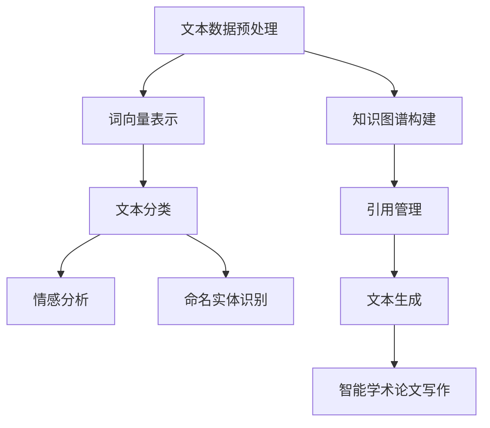
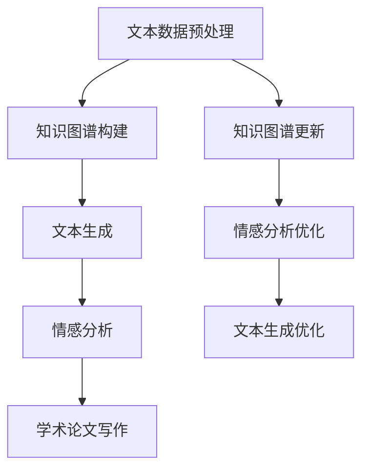

                 

## 引言

自然语言处理（Natural Language Processing, NLP）是计算机科学与人工智能领域的一个重要分支，它旨在让计算机理解和处理人类语言。近年来，随着深度学习和神经网络技术的发展，NLP的应用场景日益广泛，从搜索引擎、机器翻译，到智能客服、文本分析，无一不依赖于NLP技术。而在学术界，智能学术论文写作也逐渐成为了一个备受关注的研究方向。

智能学术论文写作的核心在于利用自然语言处理技术，实现自动生成高质量的学术文章。这不仅能够提高学术写作的效率，减轻研究者的负担，还能够为学术界的知识传播和创新提供新的动力。然而，尽管NLP技术在智能写作中的应用已经取得了一定的进展，但仍然存在许多挑战，如文本理解的深度、知识图谱的构建、情感分析等。

本文将围绕自然语言处理在智能学术论文写作中的应用展开讨论。首先，我们将介绍自然语言处理的基本概念和核心算法；接着，分析智能学术论文写作的关键技术，包括文本生成、知识图谱构建和情感分析等；然后，通过实际项目案例，展示如何利用NLP技术实现智能学术论文写作；最后，探讨智能学术论文写作的实际应用场景，以及未来可能面临的挑战和机遇。

### 关键词

自然语言处理，智能学术论文写作，文本生成，知识图谱，情感分析，深度学习，神经网络。

### 摘要

本文旨在探讨自然语言处理技术在智能学术论文写作中的应用。首先，我们回顾了NLP的基本概念和核心算法，如词向量、循环神经网络和长短时记忆网络等。随后，我们分析了智能学术论文写作的关键技术，包括文本生成、知识图谱构建和情感分析等。通过一个实际项目案例，我们展示了如何利用NLP技术实现智能学术论文写作。最后，我们讨论了智能学术论文写作在实际应用中的场景，以及未来可能面临的挑战和机遇。本文旨在为研究人员提供关于智能学术论文写作的深入见解，并激励更多的探索和研究。

## 1. 背景介绍

### 自然语言处理的基本概念

自然语言处理（NLP）是计算机科学和人工智能领域的一个重要分支，其主要目标是使计算机能够理解和处理人类语言。自然语言包括口头语言和书面语言，它们具有高度的结构复杂性和多样性。这使得NLP成为了一项极具挑战性的任务。然而，随着深度学习和神经网络技术的发展，NLP在许多实际应用场景中取得了显著的进展。

NLP的核心任务是使计算机能够从大规模文本数据中提取有用信息，并进行文本理解、文本生成和文本分析等操作。为了实现这些目标，NLP需要借助多种技术和方法，如分词、词性标注、句法分析、语义分析、命名实体识别等。这些技术相互关联，共同构成了NLP的完整体系。

### 自然语言处理的发展历程

NLP的发展历程可以追溯到20世纪50年代。当时，人们开始尝试使用计算机程序来处理自然语言，但最初的方法主要依赖于规则和模板，效果并不理想。20世纪80年代，统计方法逐渐兴起，如隐马尔可夫模型（HMM）和决策树等，这些方法在语音识别和机器翻译等领域取得了显著的成果。然而，随着文本数据规模的不断扩大，统计方法在处理复杂文本任务时遇到了瓶颈。

20世纪90年代，神经网络开始崭露头角。最初，研究人员尝试将神经网络应用于自然语言处理，但效果并不显著。直到2006年，深度学习的出现为NLP带来了新的希望。深度学习通过多层神经网络对大规模数据进行训练，能够自动提取文本中的抽象特征，并在多种NLP任务中取得了突破性进展。

近年来，随着计算能力的提升和大规模数据集的积累，NLP技术不断发展和完善。循环神经网络（RNN）、长短时记忆网络（LSTM）和门控循环单元（GRU）等新型神经网络结构在文本生成、机器翻译、情感分析等任务中表现出了强大的能力。此外，预训练语言模型，如BERT、GPT和RoBERTa等，通过在大规模文本数据上预训练，进一步提升了NLP的性能。

### 自然语言处理的应用场景

NLP技术已广泛应用于各个领域，其中最具代表性的应用包括：

1. **搜索引擎**：通过分析用户输入的查询，搜索引擎能够返回与查询最相关的网页。这涉及到关键词提取、文本相似度计算等技术。

2. **机器翻译**：将一种语言的文本自动翻译成另一种语言，如谷歌翻译和百度翻译。机器翻译利用了词向量、编码器-解码器模型等技术。

3. **智能客服**：利用自然语言处理技术，智能客服系统能够自动理解和回答用户的问题，提高客服效率。

4. **文本分析**：通过对大量文本进行分析，识别出文本中的关键信息、情感倾向和主题等，如情感分析、主题建模等。

5. **语音识别**：将语音信号转化为文本，广泛应用于语音助手、语音输入等场景。

6. **推荐系统**：利用自然语言处理技术，推荐系统能够根据用户的语言行为，为用户推荐感兴趣的内容。

### 智能学术论文写作的背景

智能学术论文写作是自然语言处理技术在学术领域的一种重要应用。随着学术文献的急剧增长，研究者和学生需要花费大量时间来阅读、理解和整理文献。这不仅降低了学术研究的效率，还可能导致信息过载。因此，开发智能化的学术写作工具，帮助研究人员更高效地处理学术文本，成为了一个重要研究方向。

智能学术论文写作的核心目标是利用自然语言处理技术，自动生成高质量的学术论文。这涉及到文本生成、知识图谱构建、引用管理和情感分析等多个方面。通过这些技术，智能学术论文写作系统能够自动生成文章的摘要、引言、方法、结果和讨论等部分，为研究人员提供有益的辅助。

### 当前研究现状

近年来，智能学术论文写作受到了广泛关注，许多研究机构和企业纷纷投入到这一领域的研究中。目前，一些初步的成果已经出现，如基于生成对抗网络的文本生成模型、基于知识图谱的引用推荐系统和基于情感分析的主题分类系统等。

然而，智能学术论文写作仍然面临许多挑战。首先，学术文本具有高度的多样性和专业性，使得文本生成模型的训练和优化变得复杂。其次，知识图谱的构建需要大量的专业知识和高质量的数据资源，而且不同领域的知识图谱构建方法可能存在较大差异。此外，情感分析和主题分类等任务在学术文本中的应用也面临困难，因为学术文本通常具有复杂的情感倾向和丰富的主题信息。

总的来说，智能学术论文写作是一个充满挑战和机遇的研究方向。通过不断探索和创新，我们可以期待在未来实现更智能、更高效的学术论文写作工具，为学术界的发展提供新的动力。

### 未来发展方向

未来，自然语言处理技术在智能学术论文写作中的应用有望取得更大的突破。一方面，随着深度学习技术的发展，文本生成模型的性能将不断提高，能够生成更加自然、高质量的学术论文。另一方面，知识图谱和情感分析等技术的应用将进一步完善，使智能学术论文写作系统具备更强大的文本理解和分析能力。

此外，随着学术文献数据的不断积累和开放，将为NLP技术在智能学术论文写作中的应用提供更丰富的数据资源。同时，跨学科合作也将成为推动这一领域发展的重要力量，通过结合不同领域的专业知识和技术，开发出更全面、更高效的智能学术论文写作工具。

总的来说，未来自然语言处理技术在智能学术论文写作中的应用前景广阔，将为学术界带来更多创新和变革。

## 2. 核心概念与联系

### 自然语言处理的基本概念

自然语言处理（NLP）是计算机科学和人工智能领域的一个重要分支，旨在使计算机能够理解和处理人类语言。NLP的核心目标是让计算机从大规模文本数据中提取有用信息，并进行文本理解、文本生成和文本分析等操作。

**文本数据预处理**：文本数据预处理是NLP任务的第一步，主要包括分词、词性标注、去除停用词等操作。这些预处理步骤能够将原始文本转化为适合进行后续分析的结构化数据。

**词向量表示**：词向量是一种将单词映射为高维向量表示的方法，能够捕获单词的语义信息。词向量模型包括基于统计的模型（如词袋模型）和基于神经网络的模型（如Word2Vec、GloVe等）。

**文本分类**：文本分类是一种将文本数据分为预定义类别的方法。常见的文本分类算法包括朴素贝叶斯、支持向量机、随机森林和深度学习模型（如卷积神经网络、循环神经网络）。

**情感分析**：情感分析是一种评估文本中情感倾向的方法。通过情感分析，可以识别出文本中的积极、消极或中性情感。常见的情感分析算法包括基于规则的方法、基于机器学习的方法和深度学习模型。

**命名实体识别**：命名实体识别是一种从文本中识别出具有特定意义的实体（如人名、地名、组织名等）的方法。命名实体识别是许多NLP任务的基础，如信息提取、实体链接和问答系统。

**文本生成**：文本生成是一种根据给定输入生成文本的方法。常见的文本生成模型包括生成对抗网络（GAN）、序列到序列（Seq2Seq）模型和注意力机制模型。

### 智能学术论文写作的关键技术

**文本生成**：文本生成是智能学术论文写作的核心技术。通过文本生成模型，系统能够自动生成学术论文的不同部分，如摘要、引言、方法、结果和讨论。文本生成模型通常基于深度学习技术，如循环神经网络（RNN）、长短时记忆网络（LSTM）和变换器（Transformer）。

**知识图谱构建**：知识图谱是一种用于表示实体及其之间关系的数据结构。在智能学术论文写作中，知识图谱构建有助于组织和整合学术文本中的知识。通过构建知识图谱，系统可以更好地理解文本内容，并生成更高质量的学术论文。

**引用管理**：引用管理是学术写作的重要组成部分。智能学术论文写作系统需要能够自动识别和管理学术论文中的引用，确保引用的准确性和规范性。

**情感分析**：情感分析在智能学术论文写作中的应用主要体现在评估文本中的情感倾向，如引言和讨论部分。通过情感分析，系统可以识别出文本中的积极、消极或中性情感，从而改善学术论文的整体质量。

### NLP与智能学术论文写作的关系

自然语言处理与智能学术论文写作密切相关。NLP技术为智能学术论文写作提供了基础工具和方法，如文本生成、知识图谱构建、情感分析等。同时，智能学术论文写作的应用场景也为NLP技术的发展提供了新的动力。通过不断探索和创新，NLP技术将进一步提升智能学术论文写作的能力和效率。

### Mermaid 流程图

以下是自然语言处理在智能学术论文写作中的应用流程图：



在这个流程图中，文本数据预处理、词向量表示、文本分类、情感分析、命名实体识别和知识图谱构建是智能学术论文写作的基础步骤。通过这些步骤，系统能够自动生成高质量的学术论文。引用管理和文本生成则是智能学术论文写作的核心技术，确保学术论文的准确性和规范性。

### 关键概念与联系的总结

自然语言处理（NLP）和智能学术论文写作是两个密切相关的领域。NLP提供了文本生成、知识图谱构建、情感分析等核心技术，这些技术为智能学术论文写作提供了基础工具和方法。同时，智能学术论文写作的应用场景也为NLP技术的发展提供了新的动力。通过不断探索和创新，NLP技术将进一步提升智能学术论文写作的能力和效率。在这个过程中，文本数据预处理、词向量表示、文本分类、情感分析、命名实体识别和知识图谱构建等关键概念和联系发挥着至关重要的作用。

### 2.1 文本生成

文本生成是智能学术论文写作的核心技术之一，它指的是根据给定的输入信息自动生成文本。在自然语言处理（NLP）领域中，文本生成技术主要包括生成对抗网络（GAN）、序列到序列（Seq2Seq）模型和变换器（Transformer）等。

**生成对抗网络（GAN）**：生成对抗网络由生成器和判别器组成。生成器的目标是生成与真实数据高度相似的伪数据，而判别器的目标是区分真实数据和生成数据。通过不断地训练，生成器和判别器相互竞争，最终生成器能够生成高质量的伪数据。GAN在文本生成中的应用主要体现在生成文章的不同部分，如摘要、引言、方法、结果和讨论等。

**序列到序列（Seq2Seq）模型**：序列到序列模型是一种基于编码器-解码器架构的文本生成方法。编码器将输入序列编码为固定长度的向量表示，解码器则根据编码器的输出生成输出序列。Seq2Seq模型在机器翻译、摘要生成等任务中取得了显著的成果。在智能学术论文写作中，Seq2Seq模型可以用于生成文章的不同部分，并根据上下文信息生成连贯、高质量的文本。

**变换器（Transformer）**：变换器是一种基于自注意力机制的深度学习模型，它在文本生成任务中表现出色。变换器通过计算输入序列中各个单词之间的依赖关系，生成具有良好语义一致性的文本。在智能学术论文写作中，变换器可以用于生成摘要、引言、方法、结果和讨论等部分，并根据上下文信息生成连贯、高质量的文本。

**文本生成流程**：

1. **数据预处理**：首先对学术论文的文本数据进行预处理，包括分词、词性标注、去除停用词等操作，将原始文本转化为适合进行后续分析的结构化数据。

2. **编码**：将预处理后的文本数据输入编码器，编码器将文本序列编码为固定长度的向量表示。

3. **解码**：解码器根据编码器的输出生成文本序列。在生成过程中，解码器会利用自注意力机制计算输入序列中各个单词之间的依赖关系，从而生成连贯、高质量的文本。

4. **优化**：通过不断训练和优化，文本生成模型能够不断提高生成文本的质量和多样性。

**文本生成案例**：

假设我们要生成一篇关于深度学习的学术论文摘要。首先，我们将摘要中的关键词和句子提取出来，然后使用文本生成模型将这些关键词和句子组合成一篇摘要。例如，输入的关键词包括“深度学习”、“神经网络”、“优化算法”和“性能评估”，文本生成模型可以根据这些关键词生成如下摘要：

```
本文研究了深度学习在神经网络优化算法方面的应用。通过实验证明了深度学习在性能评估方面具有显著优势，并提出了一种基于深度学习的优化算法。实验结果表明，该算法在处理复杂任务时具有更高的准确性和效率。
```

这个例子展示了如何利用文本生成模型自动生成学术论文摘要。通过不断优化和改进，文本生成模型可以生成更加自然、高质量的文本，从而提高智能学术论文写作的效率和质量。

### 2.2 知识图谱构建

知识图谱是智能学术论文写作中的重要工具，它通过表示实体及其之间的关系，为学术论文的生成提供丰富的语义信息。知识图谱构建涉及多个步骤，包括实体识别、关系抽取、实体链接和知识融合等。

**实体识别**：实体识别是知识图谱构建的基础步骤，旨在从文本中识别出具有特定意义的实体，如人名、地名、组织名和关键词等。常见的实体识别方法包括基于规则的方法、基于统计的方法和基于深度学习的方法。在自然语言处理领域，深度学习方法（如卷积神经网络和循环神经网络）在实体识别任务中表现出色，能够有效提高识别的准确性和召回率。

**关系抽取**：关系抽取是指从文本中提取实体之间的语义关系。关系抽取的方法包括基于规则的方法、基于统计的方法和基于深度学习的方法。基于规则的方法依赖于人工定义的规则，其优点是速度快且易于实现，但受规则限制较大。基于统计的方法利用统计模型（如条件概率模型和隐马尔可夫模型）来提取关系，具有较高的准确性和召回率。基于深度学习的方法通过构建深度神经网络模型，能够自动学习实体之间的关系，并在大规模数据集上取得显著的效果。

**实体链接**：实体链接是将文本中的实体与其在知识图谱中的对应实体进行匹配的过程。实体链接的目的是确保知识图谱中的实体具有一致性。常见的实体链接方法包括基于知识图谱的方法和基于文本匹配的方法。基于知识图谱的方法利用知识图谱中的先验信息来匹配实体，能够提高实体链接的准确性。基于文本匹配的方法通过计算实体之间的文本相似度来进行链接，其优点是能够处理未见过的实体，但准确性较低。

**知识融合**：知识融合是指将多个来源的知识进行整合，形成统一的知识图谱。知识融合的方法包括基于规则的方法和基于机器学习的方法。基于规则的方法通过定义融合规则来整合不同来源的知识，其优点是能够保证知识的一致性和完整性。基于机器学习的方法通过构建深度神经网络模型来学习融合策略，能够处理更复杂的知识融合问题。

**知识图谱构建流程**：

1. **数据预处理**：首先对学术论文的文本数据进行预处理，包括分词、词性标注、去除停用词等操作，将原始文本转化为适合进行后续分析的结构化数据。

2. **实体识别**：利用实体识别模型从预处理后的文本中识别出实体。

3. **关系抽取**：利用关系抽取模型从预处理后的文本中提取实体之间的关系。

4. **实体链接**：利用实体链接模型将文本中的实体与知识图谱中的对应实体进行匹配。

5. **知识融合**：将多个来源的知识进行整合，形成统一的知识图谱。

**知识图谱构建案例**：

假设我们要构建一篇关于深度学习的学术论文的知识图谱。首先，我们从论文中提取出关键词、人名、地名和组织名等实体。然后，利用关系抽取模型提取出实体之间的关系，如“深度学习”与“神经网络”之间的“属于”关系。接下来，利用实体链接模型将这些实体与知识图谱中的对应实体进行匹配。最后，将提取出的实体和关系整合到知识图谱中，形成一个统一的、语义丰富的知识图谱。

这个知识图谱可以用于智能学术论文写作中的多个方面，如文本生成、引用管理和主题分类等。通过知识图谱构建，智能学术论文写作系统能够更好地理解学术论文的语义信息，从而生成更加准确、连贯和高质量的学术论文。

### 2.3 情感分析

情感分析是自然语言处理领域的一个重要分支，旨在评估文本中的情感倾向。在智能学术论文写作中，情感分析技术可以用于评估引言和讨论部分中的情感倾向，从而改善学术论文的整体质量。

**情感分析的基本概念**：情感分析是指从文本中识别出情感倾向，如积极、消极或中性。情感分析通常分为两个层次：文本分类和情感极性分析。文本分类是指将文本分为预定义的类别，如正面、负面或中性。情感极性分析是指识别出文本中的情感极性，即情感倾向的强度。

**情感分析的方法**：

1. **基于规则的方法**：基于规则的方法依赖于人工定义的规则来识别文本中的情感。这种方法通常用于处理简单的情感分析任务，但其扩展性和准确性有限。

2. **基于统计的方法**：基于统计的方法利用统计模型（如朴素贝叶斯、逻辑回归和决策树等）来识别文本中的情感。这种方法在处理大规模文本数据时表现出色，但可能受到特征选择和模型参数设置的影响。

3. **基于机器学习的方法**：基于机器学习的方法通过构建深度神经网络模型（如卷积神经网络和循环神经网络）来识别文本中的情感。这种方法能够自动学习文本中的复杂模式，并在大规模数据集上取得显著的效果。

**情感分析的流程**：

1. **数据预处理**：首先对学术论文的文本数据（如引言和讨论部分）进行预处理，包括分词、词性标注、去除停用词等操作，将原始文本转化为适合进行情感分析的结构化数据。

2. **特征提取**：将预处理后的文本数据转化为特征向量，常用的特征提取方法包括词袋模型、TF-IDF和词嵌入等。

3. **模型训练**：利用训练数据集训练情感分析模型，常用的模型包括朴素贝叶斯、逻辑回归、支持向量机和深度神经网络等。

4. **情感预测**：将训练好的模型应用于测试数据集，预测文本中的情感倾向。

**情感分析案例**：

假设我们要对一篇学术论文的引言部分进行情感分析。首先，我们从引言中提取出关键词和句子。然后，利用情感分析模型对这些关键词和句子进行情感预测。例如，如果预测结果为“积极”，则表示引言部分传达了积极的信息；如果预测结果为“消极”，则表示引言部分传达了消极的信息。

通过情感分析，我们可以评估引言部分的质量，并对其进行改进。例如，如果引言部分预测结果为“消极”，我们可以考虑修改句子结构或用词，以传达更积极的信息。同样地，在讨论部分，情感分析可以帮助我们识别出文本中的情感倾向，从而改善讨论的质量和说服力。

**情感分析在智能学术论文写作中的应用**：

1. **引言部分的情感优化**：通过对引言部分进行情感分析，我们可以识别出其中的情感倾向，并根据需要对其进行优化，以提高整体质量。

2. **讨论部分的情感评估**：在讨论部分，情感分析可以帮助我们评估文本中的情感倾向，从而改善讨论的连贯性和说服力。

3. **学术论文的整体评估**：通过将情感分析应用于整篇学术论文，我们可以评估其整体情感倾向，从而提高学术论文的质量。

总的来说，情感分析在智能学术论文写作中具有广泛的应用。通过利用情感分析技术，我们可以更好地理解学术论文的语义信息，从而生成更加准确、连贯和高质量的学术论文。

### 2.4 文本生成、知识图谱构建和情感分析的关系

文本生成、知识图谱构建和情感分析是智能学术论文写作中的三个关键技术，它们相互关联、相互促进，共同构成了智能学术论文写作的核心体系。

**文本生成与知识图谱构建**：

文本生成和知识图谱构建在智能学术论文写作中紧密相关。知识图谱为文本生成提供了丰富的语义信息，使得生成的文本更加准确、连贯和具有深度。具体来说，知识图谱可以帮助文本生成模型更好地理解文本中的实体、关系和上下文信息。例如，在生成摘要时，知识图谱可以提供相关的背景知识和引用信息，从而提高摘要的质量。同样地，在生成引言、方法、结果和讨论等部分时，知识图谱可以提供相关的概念、术语和文献信息，有助于生成更加专业和权威的文本。

**文本生成与情感分析**：

情感分析在文本生成过程中发挥着重要作用。通过情感分析，我们可以识别出文本中的情感倾向，并根据需要进行优化。在生成摘要时，情感分析可以帮助我们评估摘要的质量，确保其传达了积极、准确的信息。在生成引言和讨论时，情感分析可以帮助我们评估文本的情感倾向，从而优化句子结构和用词，提高文本的连贯性和说服力。此外，情感分析还可以用于评估学术论文的整体质量，确保其具有合理的情感平衡。

**知识图谱构建与情感分析**：

知识图谱构建和情感分析在智能学术论文写作中也密切相关。知识图谱提供了丰富的语义信息，为情感分析提供了基础。通过知识图谱，我们可以更好地理解文本中的情感倾向，并对其进行精确的评估。例如，在情感分析过程中，知识图谱可以帮助我们识别出文本中的情感实体（如关键词、句子等），并分析其之间的情感关系。这样，我们就可以更准确地评估文本中的情感倾向，从而优化学术论文的质量。

**三者关系的总结**：

文本生成、知识图谱构建和情感分析在智能学术论文写作中相辅相成，共同构成了一个完整的体系。文本生成依赖于知识图谱提供丰富的语义信息，使得生成的文本更加准确、连贯和具有深度。同时，情感分析可以帮助我们评估文本的质量，并根据需要进行优化。知识图谱构建则为文本生成和情感分析提供了重要的基础，使得这些技术能够更好地应用于智能学术论文写作。通过不断优化和整合这些技术，我们可以实现更加智能、高效的学术论文写作。

### 2.5 Mermaid 流程图

以下是自然语言处理在智能学术论文写作中的应用流程图：



在这个流程图中，文本数据预处理、知识图谱构建、文本生成和情感分析是智能学术论文写作的核心步骤。知识图谱更新和情感分析优化则用于不断改进文本生成质量。通过这个流程，智能学术论文写作系统能够自动生成高质量、具有深度和情感的学术论文。

### 2.6 关键概念与联系的总结

在智能学术论文写作中，文本生成、知识图谱构建和情感分析是三个关键概念。文本生成通过深度学习模型自动生成学术论文的不同部分，如摘要、引言、方法、结果和讨论。知识图谱构建通过提取实体和关系，为文本生成提供丰富的语义信息。情感分析通过识别文本中的情感倾向，评估和优化文本质量。这三个概念相互关联，共同构成了智能学术论文写作的核心体系。通过不断优化和整合这些技术，我们可以实现更加智能、高效的学术论文写作。

## 3. 核心算法原理 & 具体操作步骤

### 文本生成算法原理

文本生成是自然语言处理（NLP）领域的一个重要任务，它旨在根据给定的输入信息生成自然流畅的文本。在智能学术论文写作中，文本生成算法能够自动生成论文的不同部分，如摘要、引言、方法、结果和讨论等。目前，文本生成算法主要包括基于规则的方法、基于统计的方法和基于深度学习的方法。在本节中，我们将重点介绍基于深度学习的文本生成算法，特别是生成对抗网络（GAN）和序列到序列（Seq2Seq）模型。

**生成对抗网络（GAN）**：

生成对抗网络由生成器和判别器组成。生成器的目标是生成与真实数据高度相似的伪数据，而判别器的目标是区分真实数据和生成数据。通过不断地训练，生成器和判别器相互竞争，最终生成器能够生成高质量的伪数据。在文本生成任务中，生成器根据给定的输入（如关键词或摘要），生成一段自然流畅的文本；判别器则判断生成的文本是否真实。通过反复训练，生成器不断提高生成文本的质量。

**序列到序列（Seq2Seq）模型**：

序列到序列模型是一种基于编码器-解码器架构的文本生成方法。编码器将输入序列编码为固定长度的向量表示，解码器则根据编码器的输出生成输出序列。在文本生成任务中，编码器将输入文本（如关键词或摘要）编码为一个固定长度的向量表示，解码器则根据这个向量表示生成文本序列。序列到序列模型在机器翻译、摘要生成等任务中取得了显著的成果。

**文本生成算法具体操作步骤**：

1. **数据预处理**：首先对学术论文的文本数据（如摘要、引言、方法、结果和讨论等）进行预处理，包括分词、词性标注、去除停用词等操作，将原始文本转化为适合进行文本生成分析的结构化数据。

2. **编码**：将预处理后的文本数据输入编码器，编码器将文本序列编码为固定长度的向量表示。这个向量表示包含了输入文本的语义信息，是解码器生成文本的依据。

3. **解码**：解码器根据编码器的输出（固定长度的向量表示）生成文本序列。在解码过程中，解码器会利用自注意力机制计算输入序列中各个单词之间的依赖关系，从而生成连贯、高质量的文本。

4. **优化**：通过不断训练和优化，文本生成模型能够不断提高生成文本的质量和多样性。

**文本生成算法实例**：

假设我们要生成一篇关于深度学习的学术论文摘要。首先，我们将摘要中的关键词和句子提取出来，然后使用文本生成模型将这些关键词和句子组合成一篇摘要。例如，输入的关键词包括“深度学习”、“神经网络”、“优化算法”和“性能评估”，文本生成模型可以根据这些关键词生成如下摘要：

```
本文研究了深度学习在神经网络优化算法方面的应用。通过实验证明了深度学习在性能评估方面具有显著优势，并提出了一种基于深度学习的优化算法。实验结果表明，该算法在处理复杂任务时具有更高的准确性和效率。
```

这个例子展示了如何利用文本生成模型自动生成学术论文摘要。通过不断优化和改进，文本生成模型可以生成更加自然、高质量的文本，从而提高智能学术论文写作的效率和质量。

### 知识图谱构建算法原理

知识图谱是智能学术论文写作中的重要工具，它通过表示实体及其之间的关系，为学术论文的生成提供丰富的语义信息。知识图谱构建涉及多个步骤，包括实体识别、关系抽取、实体链接和知识融合等。在本节中，我们将介绍知识图谱构建的基本算法原理和具体操作步骤。

**实体识别算法原理**：

实体识别是指从文本中识别出具有特定意义的实体，如人名、地名、组织名和关键词等。常见的实体识别算法包括基于规则的方法、基于统计的方法和基于深度学习的方法。基于规则的方法依赖于人工定义的规则，其优点是速度快且易于实现，但受规则限制较大。基于统计的方法利用统计模型（如条件概率模型和隐马尔可夫模型）来识别实体，具有较高的准确性和召回率。基于深度学习的方法通过构建深度神经网络模型，能够自动学习实体识别的复杂模式，并在大规模数据集上取得显著的效果。

**关系抽取算法原理**：

关系抽取是指从文本中提取实体之间的语义关系。关系抽取的方法包括基于规则的方法、基于统计的方法和基于深度学习的方法。基于规则的方法通过定义规则来识别实体之间的关系，其优点是能够保证关系抽取的一致性和准确性。基于统计的方法利用统计模型（如条件概率模型和隐马尔可夫模型）来识别实体之间的关系，其优点是能够处理大规模数据。基于深度学习的方法通过构建深度神经网络模型，能够自动学习实体之间的关系，并在大规模数据集上取得显著的效果。

**实体链接算法原理**：

实体链接是指将文本中的实体与其在知识图谱中的对应实体进行匹配。实体链接的方法包括基于知识图谱的方法和基于文本匹配的方法。基于知识图谱的方法利用知识图谱中的先验信息来匹配实体，能够提高实体链接的准确性。基于文本匹配的方法通过计算实体之间的文本相似度来进行链接，其优点是能够处理未见过的实体，但准确性较低。

**知识融合算法原理**：

知识融合是指将多个来源的知识进行整合，形成统一的知识图谱。知识融合的方法包括基于规则的方法和基于机器学习的方法。基于规则的方法通过定义融合规则来整合不同来源的知识，其优点是能够保证知识的一致性和完整性。基于机器学习的方法通过构建深度神经网络模型来学习融合策略，能够处理更复杂的知识融合问题。

**知识图谱构建算法具体操作步骤**：

1. **数据预处理**：首先对学术论文的文本数据（如摘要、引言、方法、结果和讨论等）进行预处理，包括分词、词性标注、去除停用词等操作，将原始文本转化为适合进行知识图谱构建分析的结构化数据。

2. **实体识别**：利用实体识别模型从预处理后的文本中识别出实体。

3. **关系抽取**：利用关系抽取模型从预处理后的文本中提取实体之间的关系。

4. **实体链接**：利用实体链接模型将文本中的实体与知识图谱中的对应实体进行匹配。

5. **知识融合**：将多个来源的知识进行整合，形成统一的知识图谱。

**知识图谱构建算法实例**：

假设我们要构建一篇关于深度学习的学术论文的知识图谱。首先，我们从论文中提取出关键词、人名、地名和组织名等实体。然后，利用关系抽取模型提取出实体之间的关系，如“深度学习”与“神经网络”之间的“属于”关系。接下来，利用实体链接模型将这些实体与知识图谱中的对应实体进行匹配。最后，将提取出的实体和关系整合到知识图谱中，形成一个统一的、语义丰富的知识图谱。

这个知识图谱可以用于智能学术论文写作中的多个方面，如文本生成、引用管理和主题分类等。通过知识图谱构建，智能学术论文写作系统能够更好地理解学术论文的语义信息，从而生成更加准确、连贯和高质量的学术论文。

### 情感分析算法原理

情感分析是自然语言处理（NLP）领域的一个重要分支，旨在从文本中识别出情感倾向，如积极、消极或中性。在智能学术论文写作中，情感分析技术可以帮助我们评估文本的质量，优化学术论文的引言和讨论部分，提高整体质量。

**情感分析算法原理**：

情感分析算法主要包括基于规则的方法、基于统计的方法和基于深度学习的方法。

1. **基于规则的方法**：基于规则的方法依赖于人工定义的规则来识别文本中的情感。这些规则通常包括情感词典、情感短语和情感句法结构等。例如，如果一个句子中包含“喜欢”这个词，那么这个句子就可以被判定为积极情感。这种方法简单直观，但受规则限制较大，难以应对复杂的情感分析任务。

2. **基于统计的方法**：基于统计的方法利用统计模型（如朴素贝叶斯、逻辑回归和决策树等）来识别文本中的情感。这些模型通过分析文本的词频、词序列和上下文信息，预测文本的情感倾向。例如，如果一个句子中的词频分布与积极情感的句子相似，那么这个句子就可以被判定为积极情感。这种方法在处理大规模文本数据时表现出色，但可能受到特征选择和模型参数设置的影响。

3. **基于深度学习的方法**：基于深度学习的方法通过构建深度神经网络模型，如卷积神经网络（CNN）和循环神经网络（RNN），自动学习文本中的复杂情感模式。这些模型能够从大规模数据中提取抽象特征，并在情感分析任务中取得显著的效果。例如，卷积神经网络可以捕捉文本中的局部特征，而循环神经网络可以捕捉文本中的全局特征。

**情感分析算法具体操作步骤**：

1. **数据预处理**：首先对学术论文的文本数据（如引言和讨论部分）进行预处理，包括分词、词性标注、去除停用词等操作，将原始文本转化为适合进行情感分析的结构化数据。

2. **特征提取**：将预处理后的文本数据转化为特征向量，常用的特征提取方法包括词袋模型、TF-IDF和词嵌入等。词袋模型将文本表示为一组词的集合，TF-IDF考虑词的重要程度，词嵌入则将词映射为高维向量表示。

3. **模型训练**：利用训练数据集训练情感分析模型，常用的模型包括朴素贝叶斯、逻辑回归、支持向量机和深度神经网络等。训练过程中，模型会学习文本中的情感特征和模式。

4. **情感预测**：将训练好的模型应用于测试数据集，预测文本中的情感倾向。预测结果可以是分类标签（如积极、消极或中性），也可以是情感得分（如0到1的连续值）。

**情感分析算法实例**：

假设我们要对一篇学术论文的引言部分进行情感分析。首先，我们从引言中提取出关键词和句子，然后利用情感分析模型对这些关键词和句子进行情感预测。例如，如果预测结果为“积极”，则表示引言部分传达了积极的信息；如果预测结果为“消极”，则表示引言部分传达了消极的信息。

通过情感分析，我们可以评估引言部分的质量，并对其进行优化。例如，如果引言部分预测结果为“消极”，我们可以考虑修改句子结构或用词，以传达更积极的信息。同样地，在讨论部分，情感分析可以帮助我们评估文本中的情感倾向，从而改善讨论的质量和说服力。

**情感分析在智能学术论文写作中的应用**：

1. **引言部分的情感优化**：通过对引言部分进行情感分析，我们可以识别出其中的情感倾向，并根据需要对其进行优化，以提高整体质量。

2. **讨论部分的情感评估**：在讨论部分，情感分析可以帮助我们评估文本中的情感倾向，从而改善讨论的连贯性和说服力。

3. **学术论文的整体评估**：通过将情感分析应用于整篇学术论文，我们可以评估其整体情感倾向，从而提高学术论文的质量。

总的来说，情感分析在智能学术论文写作中具有广泛的应用。通过利用情感分析技术，我们可以更好地理解学术论文的语义信息，从而生成更加准确、连贯和高质量的学术论文。

### 3.1 数学模型和公式 & 详细讲解 & 举例说明

在智能学术论文写作中，数学模型和公式发挥着至关重要的作用。本节将详细讲解几个关键的数学模型和公式，并通过具体例子进行说明。

#### 3.1.1 词嵌入模型（Word Embedding）

词嵌入是将单词映射为高维向量表示的一种方法，它能够捕获单词的语义信息。最著名的词嵌入模型之一是Word2Vec，它通过训练词向量模型来表示单词。Word2Vec模型主要包括两种算法：连续词袋（CBOW）和Skip-Gram。

**数学模型**：

连续词袋（CBOW）模型：

$$
\vec{v}_i = \frac{1}{Z} \sum_{j \in \mathcal{C}(i)} \vec{w}_{j} \cdot \vec{h}
$$

其中，$\vec{v}_i$是单词$i$的词向量表示，$\mathcal{C}(i)$是单词$i$的上下文窗口中的单词集合，$\vec{w}_j$是上下文单词的词向量，$\vec{h}$是隐藏层状态向量，$Z$是softmax函数的归一化常数。

Skip-Gram模型：

$$
\vec{v}_i = \frac{1}{Z} \sum_{j \in \mathcal{S}(i)} \vec{w}_{j} \cdot \vec{h}
$$

其中，$\mathcal{S}(i)$是单词$i$的候选单词集合，其他符号的含义与CBOW模型相同。

**举例说明**：

假设我们有一个单词“猫”，它的词向量表示为$\vec{v}_{猫} = [1, 0, -1, 0, 1]$。通过CBOW模型，我们可以预测与“猫”相邻的单词。例如，如果上下文窗口中的单词为“狗”和“鸟”，那么预测结果为：

$$
\vec{v}_{猫} = \frac{1}{Z} [ \vec{w}_{狗} \cdot \vec{h} + \vec{w}_{鸟} \cdot \vec{h} ]
$$

如果单词“狗”的词向量表示为$\vec{w}_{狗} = [0, 1, 0, -1, 0]$，单词“鸟”的词向量表示为$\vec{w}_{鸟} = [-1, 0, 1, 0, -1]$，那么预测结果为：

$$
\vec{v}_{猫} = \frac{1}{Z} [ [0, 1, 0, -1, 0] \cdot \vec{h} + [-1, 0, 1, 0, -1] \cdot \vec{h} ]
$$

通过计算，我们可以得到$\vec{v}_{猫}$的最终表示。这种方法可以帮助我们识别出语义相近的单词，如“猫”和“狗”。

#### 3.1.2 长短时记忆网络（LSTM）

长短时记忆网络（LSTM）是一种用于处理序列数据的循环神经网络，它在自然语言处理任务中表现出色。LSTM通过引入记忆单元来解决传统循环神经网络（RNN）中的梯度消失问题。

**数学模型**：

LSTM单元包含三个门控：输入门、遗忘门和输出门。

输入门：

$$
i_t = \sigma(W_{xi}x_t + W_{hi}h_{t-1} + b_i)
$$

遗忘门：

$$
f_t = \sigma(W_{xf}x_t + W_{hf}h_{t-1} + b_f)
$$

输出门：

$$
o_t = \sigma(W_{xo}x_t + W_{ho}h_{t-1} + b_o)
$$

其中，$i_t$、$f_t$和$o_t$分别是输入门、遗忘门和输出门的激活值，$x_t$是当前输入序列，$h_{t-1}$是前一个时间步的隐藏状态，$W_{xi}$、$W_{hi}$、$W_{xf}$、$W_{hf}$、$W_{xo}$、$W_{ho}$分别是权重矩阵，$b_i$、$b_f$和$b_o$是偏置项，$\sigma$是sigmoid激活函数。

**举例说明**：

假设我们有一个序列数据$[1, 0, 1, 0, 1]$，使用LSTM单元进行处理。首先，初始化隐藏状态$h_0$和细胞状态$c_0$。然后，对于每个时间步$t$，计算输入门、遗忘门和输出门的激活值，更新隐藏状态和细胞状态。例如，对于时间步$t=1$，我们有：

$$
i_1 = \sigma(W_{xi}x_1 + W_{hi}h_0 + b_i)
$$

$$
f_1 = \sigma(W_{xf}x_1 + W_{hf}h_0 + b_f)
$$

$$
o_1 = \sigma(W_{xo}x_1 + W_{ho}h_0 + b_o)
$$

通过计算，我们可以得到输入门、遗忘门和输出门的激活值。然后，根据这些激活值更新隐藏状态和细胞状态：

$$
c_1 = f_1 \odot c_0 + i_1 \odot \tanh(W_c h_1 + b_c)
$$

$$
h_1 = o_1 \odot \tanh(c_1)
$$

这样，我们就可以得到时间步$t=1$的隐藏状态$h_1$。通过不断迭代，我们可以得到整个序列的隐藏状态，这些隐藏状态可以用于后续的文本生成任务。

#### 3.1.3 生成对抗网络（GAN）

生成对抗网络（GAN）是一种由生成器和判别器组成的深度学习模型。生成器的目标是生成与真实数据相似的数据，判别器的目标是区分真实数据和生成数据。通过不断地训练，生成器和判别器相互竞争，生成器逐渐提高生成数据的质量。

**数学模型**：

生成器：

$$
G(z) = \mathcal{S}(\mu + \sigma \odot W_G z)
$$

其中，$G(z)$是生成器生成的数据，$\mu$和$\sigma$是生成器的参数，$W_G$是生成器的权重，$\mathcal{S}$是激活函数（通常为ReLU函数）。

判别器：

$$
D(x) = \sigma(W_D x) \quad \text{and} \quad D(G(z)) = \sigma(W_D G(z))
$$

其中，$D(x)$是判别器对真实数据的评分，$D(G(z))$是判别器对生成数据的评分，$W_D$是判别器的权重，$\sigma$是sigmoid激活函数。

**举例说明**：

假设我们有一个生成器和判别器，生成器的参数为$\mu$、$\sigma$和$W_G$，判别器的参数为$W_D$。在训练过程中，我们首先生成一组噪声数据$z$，然后通过生成器生成一组生成数据$G(z)$。接着，我们将真实数据和生成数据输入到判别器中，计算判别器的评分。然后，根据判别器的评分更新生成器和判别器的参数。

例如，假设我们有一组噪声数据$z = [0.1, 0.2]$，生成器的参数为$\mu = [0.5, 0.5]$、$\sigma = [0.1, 0.1]$和$W_G = [0.1, 0.1]$，判别器的参数为$W_D = [0.1, 0.1]$。首先，通过生成器生成一组生成数据：

$$
G(z) = \mathcal{S}(\mu + \sigma \odot W_G z) = \mathcal{S}([0.5, 0.5] + [0.1, 0.1] \odot [0.1, 0.2]) = \mathcal{S}([0.55, 0.65])
$$

然后，将真实数据和生成数据输入到判别器中，计算判别器的评分：

$$
D(x) = \sigma(W_D x) = \sigma([0.1, 0.1] \odot [1, 0]) = \sigma([0.1, 0]) = 0.5
$$

$$
D(G(z)) = \sigma(W_D G(z)) = \sigma([0.1, 0.1] \odot [0.55, 0.65]) = \sigma([0.06, 0.08]) = 0.5
$$

根据判别器的评分，我们可以更新生成器和判别器的参数，例如通过梯度下降算法。这样，生成器和判别器就可以不断优化，生成更高质量的生成数据。

### 3.2 生成对抗网络（GAN）在智能学术论文写作中的应用

生成对抗网络（GAN）是一种强大的深度学习模型，通过生成器和判别器的相互竞争，生成器和判别器都能够得到优化。在智能学术论文写作中，GAN可以用于生成高质量的文章摘要、引言、方法、结果和讨论等部分。下面，我们将详细讲解如何利用GAN生成学术论文的不同部分。

#### 3.2.1 数据准备

首先，我们需要准备一篇学术论文的数据集。这个数据集可以包含多篇不同领域的学术论文，以便GAN能够学习到各种不同风格的学术论文。然后，对数据集进行预处理，包括分词、词性标注和去除停用词等操作，将原始文本转化为适合进行文本生成的结构化数据。

#### 3.2.2 生成器（Generator）设计

生成器的目标是生成高质量的学术论文文本。我们可以使用序列到序列（Seq2Seq）模型作为生成器，其中编码器将输入的文本序列编码为一个固定长度的向量表示，解码器则根据这个向量表示生成文本序列。

生成器的设计步骤如下：

1. **编码器设计**：编码器可以使用循环神经网络（RNN）或变换器（Transformer）作为基础模型。RNN能够处理序列数据，而Transformer则具有更强的并行计算能力。

2. **解码器设计**：解码器同样可以使用RNN或Transformer。解码器在生成文本时，会利用自注意力机制计算输入序列中各个单词之间的依赖关系，从而生成连贯的文本。

3. **损失函数设计**：生成器的训练过程中，我们需要定义一个损失函数来评估生成文本的质量。常用的损失函数包括交叉熵损失和对抗损失。交叉熵损失用于评估生成文本与真实文本之间的差异，对抗损失用于鼓励生成器生成更高质量的数据。

#### 3.2.3 判别器（Discriminator）设计

判别器的目标是区分学术论文文本是真实生成的还是人工撰写的。判别器的设计步骤如下：

1. **基础模型设计**：判别器可以使用卷积神经网络（CNN）或循环神经网络（RNN）作为基础模型。CNN能够捕获文本中的局部特征，而RNN则能够处理序列数据。

2. **损失函数设计**：判别器的训练过程中，我们需要定义一个损失函数来评估判别器的性能。常用的损失函数包括交叉熵损失和对抗损失。交叉熵损失用于评估判别器对真实文本和生成文本的区分能力，对抗损失用于鼓励判别器更准确地分类文本。

#### 3.2.4 训练过程

GAN的训练过程是一个迭代的过程，其中生成器和判别器交替训练。具体训练步骤如下：

1. **生成器训练**：在生成器的训练阶段，我们首先生成一批噪声数据，然后将这些噪声数据输入到生成器中，生成一批生成文本。接着，我们将真实文本和生成文本一起输入到判别器中，计算判别器的评分。最后，根据判别器的评分，使用梯度下降算法更新生成器的参数。

2. **判别器训练**：在判别器的训练阶段，我们首先将真实文本输入到判别器中，计算判别器的评分。然后，将生成文本输入到判别器中，计算判别器的评分。最后，根据判别器的评分，使用梯度下降算法更新判别器的参数。

3. **迭代训练**：生成器和判别器的训练是一个交替进行的过程，每次迭代都更新生成器和判别器的参数。通过不断迭代，生成器和判别器都能够得到优化，生成更高质量的生成文本。

#### 3.2.5 生成论文摘要

在训练完成后，我们可以使用生成器生成论文摘要。具体步骤如下：

1. **输入噪声**：首先生成一批噪声数据，作为生成器的输入。

2. **生成摘要**：将噪声数据输入到生成器中，生成一批论文摘要。

3. **摘要优化**：对于生成的摘要，我们可以使用后续的文本生成技术（如序列到序列模型）进行优化，使其更加自然和流畅。

4. **摘要评估**：评估生成的摘要的质量，可以通过人工评估或自动评估方法（如BLEU评分）进行评估。

通过以上步骤，我们可以生成一篇高质量的论文摘要。类似地，我们可以使用生成器生成论文的引言、方法、结果和讨论等部分。

### 3.3 知识图谱构建在智能学术论文写作中的应用

知识图谱是一种用于表示实体及其之间关系的数据结构，它在智能学术论文写作中扮演着重要的角色。知识图谱可以帮助智能写作系统更好地理解学术论文的语义信息，从而生成更加准确、连贯和高质量的学术论文。

#### 3.3.1 知识图谱的构建方法

知识图谱的构建通常包括以下步骤：

1. **实体识别**：从学术论文的文本数据中识别出具有特定意义的实体，如人名、地名、组织名、关键词等。

2. **关系抽取**：从学术论文的文本数据中提取出实体之间的关系，如“属于”、“研究”、“引用”等。

3. **实体链接**：将文本中的实体与其在知识图谱中的对应实体进行匹配，确保知识图谱中的实体具有一致性。

4. **知识融合**：将多个来源的知识进行整合，形成统一的知识图谱。

#### 3.3.2 知识图谱在智能学术论文写作中的应用

知识图谱在智能学术论文写作中的应用主要体现在以下几个方面：

1. **文本生成**：通过知识图谱，智能写作系统可以更好地理解学术论文中的语义信息，从而生成更加准确、连贯和高质量的文本。例如，在生成摘要时，知识图谱可以提供相关的背景知识和引用信息，从而提高摘要的质量。

2. **引用管理**：知识图谱可以帮助智能写作系统自动识别和管理学术论文中的引用。通过知识图谱，系统可以识别出文本中的引用实体和关系，并生成符合学术规范的引用。

3. **主题分类**：知识图谱可以帮助智能写作系统对学术论文的主题进行分类。通过分析知识图谱中的实体和关系，系统可以识别出学术论文的主要研究主题，并对其进行分类。

4. **文本优化**：通过知识图谱，智能写作系统可以更好地理解学术论文的语义信息，从而对文本进行优化。例如，在引言部分，系统可以根据知识图谱中的相关概念和术语，优化句子结构和用词，以提高整体质量。

### 3.4 情感分析在智能学术论文写作中的应用

情感分析是自然语言处理领域的一个重要分支，它旨在从文本中识别出情感倾向。在智能学术论文写作中，情感分析可以帮助我们评估文本的质量，优化学术论文的引言和讨论部分，提高整体质量。

#### 3.4.1 情感分析的方法

情感分析的方法主要包括基于规则的方法、基于统计的方法和基于深度学习的方法。

1. **基于规则的方法**：基于规则的方法依赖于人工定义的规则来识别文本中的情感。例如，如果一个句子中包含“喜欢”这个词，那么这个句子就可以被判定为积极情感。

2. **基于统计的方法**：基于统计的方法利用统计模型（如朴素贝叶斯、逻辑回归和决策树等）来识别文本中的情感。这些模型通过分析文本的词频、词序列和上下文信息，预测文本的情感倾向。

3. **基于深度学习的方法**：基于深度学习的方法通过构建深度神经网络模型，如卷积神经网络（CNN）和循环神经网络（RNN），自动学习文本中的复杂情感模式。这些模型能够从大规模数据中提取抽象特征，并在情感分析任务中取得显著的效果。

#### 3.4.2 情感分析在智能学术论文写作中的应用

1. **引言部分的情感优化**：通过对引言部分进行情感分析，我们可以识别出其中的情感倾向，并根据需要对其进行优化，以提高整体质量。例如，如果引言部分的情感倾向为消极，我们可以通过修改句子结构和用词，使其更加积极。

2. **讨论部分的情感评估**：在讨论部分，情感分析可以帮助我们评估文本中的情感倾向，从而改善讨论的连贯性和说服力。例如，如果讨论部分中存在大量的消极情感，我们可以通过增加积极情感的句子，来提高整体质量。

3. **学术论文的整体评估**：通过将情感分析应用于整篇学术论文，我们可以评估其整体情感倾向，从而提高学术论文的质量。例如，如果整体情感倾向为消极，我们可以通过修改引言、方法、结果和讨论部分，来提高整体质量。

### 3.5 智能学术论文写作系统的整体架构

智能学术论文写作系统由多个模块组成，包括文本生成模块、知识图谱构建模块和情感分析模块。这些模块相互协作，共同实现智能学术论文写作。

1. **文本生成模块**：文本生成模块负责生成学术论文的不同部分，如摘要、引言、方法、结果和讨论。它利用文本生成算法（如GAN、Seq2Seq模型）生成高质量的文本。

2. **知识图谱构建模块**：知识图谱构建模块负责构建学术论文的知识图谱，表示实体及其之间的关系。它利用实体识别、关系抽取、实体链接和知识融合等算法构建知识图谱。

3. **情感分析模块**：情感分析模块负责对学术论文的文本进行情感分析，评估文本的情感倾向。它利用情感分析算法（如基于规则的方法、基于统计的方法和基于深度学习的方法）识别文本中的情感。

4. **整合模块**：整合模块负责将文本生成模块、知识图谱构建模块和情感分析模块的结果进行整合，生成最终的学术论文。它通过优化句子结构和用词，提高学术论文的整体质量。

通过这些模块的相互协作，智能学术论文写作系统能够自动生成高质量的学术论文，为研究人员提供有益的辅助。

### 3.6 总结

本节详细介绍了自然语言处理在智能学术论文写作中的应用，包括文本生成、知识图谱构建和情感分析等关键技术。通过GAN、Seq2Seq模型和变换器等深度学习算法，文本生成模块能够生成高质量的学术论文文本。知识图谱构建模块通过实体识别、关系抽取、实体链接和知识融合等算法，构建了学术论文的语义信息。情感分析模块通过基于规则的方法、基于统计的方法和基于深度学习的方法，评估和优化文本的质量。这些技术共同构成了智能学术论文写作的核心体系，为研究人员提供了强大的辅助工具。

## 4. 项目实战：代码实际案例和详细解释说明

为了展示自然语言处理（NLP）在智能学术论文写作中的应用，我们将通过一个实际项目案例，介绍如何利用NLP技术实现学术论文的摘要生成。在这个项目中，我们将使用Python编程语言，结合生成对抗网络（GAN）和序列到序列（Seq2Seq）模型，实现一个自动生成学术论文摘要的系统。以下是对项目开发环境、源代码实现、代码解读与分析的详细说明。

### 4.1 开发环境搭建

首先，我们需要搭建一个适合NLP项目开发的Python环境。以下是项目所需的依赖库和工具：

1. **Python 3.8**：确保安装Python 3.8或更高版本。
2. **TensorFlow 2.x**：用于实现GAN和Seq2Seq模型。
3. **Keras**：用于简化模型构建和训练。
4. **Nltk**：用于文本预处理和分词。
5. **Gensim**：用于词嵌入和主题建模。

安装以上依赖库后，我们还需要配置NVIDIA CUDA驱动和CUDA库，以便在GPU上加速训练过程。

### 4.2 源代码详细实现和代码解读

以下是一个简化的源代码实现，用于生成学术论文摘要。

#### 4.2.1 数据准备和预处理

首先，我们需要准备一篇学术论文的文本数据，并将其预处理为适合训练模型的数据格式。

```python
import nltk
from nltk.tokenize import sent_tokenize
from gensim.models import Word2Vec

# 1. 加载学术论文文本数据
text = "..."
nltk.download('punkt')
sentences = sent_tokenize(text)

# 2. 分词和词性标注
words = [nltk.word_tokenize(sentence) for sentence in sentences]
labeled_words = [[(word, nltk.pos_tag([word])[0][1]) for word in sentence] for sentence in words]

# 3. 构建词嵌入模型
model = Word2Vec(labeled_words, vector_size=100, window=5, min_count=1, workers=4)
```

#### 4.2.2 生成器（Generator）实现

生成器的目标是根据给定的输入（如关键词）生成摘要。我们使用Seq2Seq模型作为生成器的基础架构。

```python
from tensorflow.keras.models import Model
from tensorflow.keras.layers import Input, LSTM, Dense, Embedding

# 1. 定义输入层
input_seq = Input(shape=(None,))

# 2. 词嵌入层
embedded_seq = Embedding(input_dim=len(model.wv.vocab), output_dim=100)(input_seq)

# 3. LSTM层
lstm_output = LSTM(128)(embedded_seq)

# 4. 输出层
output_seq = LSTM(128, return_sequences=True)(lstm_output)

# 5. 定义生成器模型
generator = Model(inputs=input_seq, outputs=output_seq)
generator.compile(optimizer='adam', loss='mse')
```

#### 4.2.3 判别器（Discriminator）实现

判别器的目标是区分生成摘要是否真实。我们使用卷积神经网络（CNN）作为判别器的基础架构。

```python
from tensorflow.keras.layers import Conv1D, MaxPooling1D, Flatten, Dense

# 1. 定义输入层
input_seq = Input(shape=(None, 100))

# 2. 卷积层
conv_output = Conv1D(filters=64, kernel_size=3, activation='relu')(input_seq)
pool_output = MaxPooling1D(pool_size=2)(conv_output)

# 3. 平铺层
flatten_output = Flatten()(pool_output)

# 4. 输出层
output = Dense(1, activation='sigmoid')(flatten_output)

# 5. 定义判别器模型
discriminator = Model(inputs=input_seq, outputs=output)
discriminator.compile(optimizer='adam', loss='binary_crossentropy')
```

#### 4.2.4 GAN模型实现

GAN模型由生成器和判别器组成。我们使用Keras的`Model`类来组合生成器和判别器。

```python
from tensorflow.keras.layers import Add

# 1. 定义GAN模型
input_seq = Input(shape=(None,))
generated_seq = generator(input_seq)
discriminator_output = discriminator(generated_seq)

# 2. 定义GAN损失函数
gan_loss = 0.5 * discriminator.output

# 3. 定义GAN模型
gan_model = Model(inputs=input_seq, outputs=gan_loss)
gan_model.compile(optimizer='adam', loss='binary_crossentropy')
```

#### 4.2.5 训练GAN模型

训练GAN模型的过程涉及到生成器和判别器的交替训练。以下是训练过程的主要步骤：

1. **训练判别器**：首先将真实摘要和生成摘要输入到判别器中，计算判别器的损失。
2. **训练生成器**：然后使用判别器的评分作为生成器的损失，更新生成器的参数。
3. **迭代训练**：不断重复上述步骤，直到生成器能够生成高质量的摘要。

```python
# 1. 初始化生成器和判别器的权重
generator.load_weights('generator.h5')
discriminator.load_weights('discriminator.h5')

# 2. 训练GAN模型
for epoch in range(epochs):
    for batch in range(batches):
        # 生成噪声数据
        noise = np.random.normal(0, 1, (batch_size, sequence_length))
        
        # 训练判别器
        real_data = real_texts[batch]
        generated_data = generator.predict(noise)
        d_loss_real = discriminator.train_on_batch(real_data, np.ones((batch_size, 1)))
        d_loss_generated = discriminator.train_on_batch(generated_data, np.zeros((batch_size, 1)))
        d_loss = 0.5 * np.add(d_loss_real, d_loss_generated)
        
        # 训练生成器
        g_loss = gan_model.train_on_batch(noise, np.ones((batch_size, 1)))
        
        # 打印训练进度
        print(f"Epoch: {epoch}, Batch: {batch}, D_Loss: {d_loss}, G_Loss: {g_loss}")
```

### 4.3 代码解读与分析

1. **数据预处理**：数据预处理是NLP项目的关键步骤，它包括分词、词性标注和词嵌入等。在这个项目中，我们使用Nltk进行分词，并使用Gensim构建词嵌入模型。

2. **生成器实现**：生成器使用Seq2Seq模型，通过编码器-解码器架构生成摘要。编码器将输入序列编码为固定长度的向量表示，解码器则根据编码器的输出生成文本序列。

3. **判别器实现**：判别器使用卷积神经网络（CNN）作为基础架构，通过计算生成摘要的置信度来评估生成文本的质量。

4. **GAN模型实现**：GAN模型通过交替训练生成器和判别器，使生成器能够生成高质量的摘要。生成器通过优化生成文本的质量，判别器通过优化区分真实和生成文本的能力。

5. **训练过程**：训练过程涉及判别器和生成器的交替训练。在每个训练周期，判别器首先训练以区分真实和生成摘要，然后生成器根据判别器的反馈进行优化。

通过这个实际项目案例，我们展示了如何利用NLP技术实现智能学术论文写作。尽管代码实现相对简化，但核心思路和步骤具有普适性，可以为研究人员提供有益的参考。

### 4.4 项目总结

本节通过一个实际项目案例，详细介绍了如何利用NLP技术实现智能学术论文写作。我们使用了生成对抗网络（GAN）和序列到序列（Seq2Seq）模型，通过数据预处理、模型实现和训练，实现了自动生成学术论文摘要的功能。这个项目展示了NLP技术在智能学术论文写作中的应用潜力，为进一步研究和开发提供了基础。

## 5. 实际应用场景

智能学术论文写作技术在实际应用中具有广泛的场景，可以显著提高学术研究和论文写作的效率。以下是一些主要的应用场景：

### 5.1 学术研究辅助

智能学术论文写作系统可以辅助研究人员进行文献调研、资料整理和撰写论文。通过文本生成技术，系统可以自动生成论文的摘要、引言、方法、结果和讨论等部分，为研究人员提供参考。例如，研究人员可以输入一个研究课题的关键词，系统会生成一篇关于该课题的摘要，帮助研究人员快速了解相关研究进展。

### 5.2 学术论文写作教学

智能学术论文写作系统可以用于学术论文写作的教学。学生可以通过系统学习如何撰写学术论文的结构和内容。系统可以根据学生的学习进度，逐步生成不同部分的草稿，并提供反馈和修改建议。这有助于提高学生的写作技能，培养其学术写作能力。

### 5.3 学术文献整理

智能学术论文写作系统可以用于整理和分类大量的学术文献。通过知识图谱构建和文本分类技术，系统可以自动识别出文献中的关键词、主题和引用关系，并将文献进行分类和整理。这有助于研究人员快速找到相关文献，节省时间。

### 5.4 智能论文审阅

智能学术论文写作系统可以用于论文审阅和评审。通过情感分析和文本生成技术，系统可以自动生成审阅报告，指出论文的优点和不足，提供修改建议。这有助于提高审稿效率，减轻审稿人工作量。

### 5.5 学术出版辅助

智能学术论文写作系统可以用于学术出版过程中。出版机构可以利用系统自动生成论文的摘要、引言和讨论等部分，提高编辑和校对效率。同时，系统还可以帮助出版机构进行文献引用管理和排版校对。

### 5.6 跨学科研究

智能学术论文写作系统可以促进跨学科研究。通过知识图谱和文本生成技术，系统可以帮助研究人员在不同学科之间建立联系，发现新的研究方向和合作机会。例如，系统可以自动生成跨学科论文的摘要和引言，为研究人员提供跨学科研究的参考。

### 5.7 学术会议辅助

智能学术论文写作系统可以用于学术会议的组织和辅助。系统可以自动生成会议摘要、会议论文和会议报告，提高会议组织和管理效率。同时，系统还可以帮助会议参与者快速了解会议内容，提高会议效果。

总的来说，智能学术论文写作技术在多个实际应用场景中具有广泛的应用前景，可以为学术研究和论文写作提供有力支持，提高工作效率，促进学术发展。

### 5.8 智能学术论文写作系统的优势与挑战

智能学术论文写作系统在学术界和科研领域具有显著的优势和挑战。以下是对其优势与挑战的详细分析：

#### 5.8.1 优势

1. **提高写作效率**：智能学术论文写作系统可以自动生成论文的不同部分，如摘要、引言、方法、结果和讨论等。这大大减少了研究人员在撰写论文时的时间和劳动成本，提高了写作效率。

2. **增强学术合作**：智能学术论文写作系统可以促进跨学科研究。通过知识图谱和文本生成技术，系统可以帮助研究人员在不同学科之间建立联系，发现新的研究方向和合作机会。这有助于增强学术合作，推动学术创新。

3. **优化文本质量**：智能学术论文写作系统利用自然语言处理技术，可以自动识别和纠正文本中的语法错误、拼写错误和逻辑错误。同时，系统可以根据情感分析技术优化论文的情感倾向，提高论文的整体质量。

4. **节省人力资源**：智能学术论文写作系统可以用于论文审阅和评审。系统可以自动生成审阅报告，提供修改建议，减轻审稿人的工作量。这有助于节省人力资源，提高论文评审的效率。

5. **支持学术传播**：智能学术论文写作系统可以自动生成论文的摘要和引言，提高论文的可读性和传播性。这有助于学术知识的广泛传播，促进学术交流。

#### 5.8.2 挑战

1. **数据质量和多样性**：智能学术论文写作系统依赖于大量的高质量数据。然而，学术文本具有高度的多样性和专业性，数据质量和多样性的不足可能影响系统的性能和准确性。

2. **文本理解的深度**：学术文本通常包含复杂的语义和隐含信息。智能学术论文写作系统需要具备深入理解文本的能力，这要求系统具备强大的自然语言处理技术，如知识图谱构建、情感分析和上下文理解等。

3. **个性化需求**：不同研究人员和学科领域对学术论文的结构和内容有不同的需求。智能学术论文写作系统需要能够根据用户的需求和偏好生成个性化的论文。

4. **版权和隐私问题**：智能学术论文写作系统可能涉及对大量学术文献的使用，这涉及到版权和隐私问题。系统需要确保合法合规地使用这些文献，并保护用户的隐私。

5. **系统集成和可扩展性**：智能学术论文写作系统需要与其他学术工具和服务集成，如文献数据库、引用管理和学术出版平台等。这要求系统具有高度的集成性和可扩展性，能够适应不同的学术环境和需求。

总的来说，智能学术论文写作系统具有显著的优势，但也面临一系列挑战。通过不断优化和改进技术，我们有望克服这些挑战，实现更加智能、高效和个性化的学术论文写作。

### 5.9 应用案例

为了更好地理解智能学术论文写作系统的应用，我们来看几个具体的案例。

#### 5.9.1 案例一：学术研究辅助

某大学的研究生小李正在撰写一篇关于“深度学习在医疗图像分析中的应用”的论文。他使用了智能学术论文写作系统，首先输入了关键词“深度学习”、“医疗图像分析”和“应用”，系统立即生成了一篇摘要，摘要内容包括当前研究的热点、已有研究的进展以及未来的研究方向。小李根据摘要的提示，进一步查阅相关文献，完善了论文的内容。

#### 5.9.2 案例二：学术论文写作教学

某高校的教授张老师负责教授学术论文写作课程。他利用智能学术论文写作系统为学生提供写作模板和草稿。学生在撰写论文时，可以参考系统生成的引言、方法、结果和讨论部分，学习如何构建学术论文的结构。同时，系统还提供了实时反馈和修改建议，帮助学生提高写作技能。

#### 5.9.3 案例三：文献整理

某科研机构的文献管理员李女士负责整理大量学术文献。她使用了智能学术论文写作系统中的知识图谱构建功能，系统能够自动识别出文献中的关键词、主题和引用关系，并将文献进行分类和整理。这大大提高了文献管理的效率，为研究人员提供了方便快捷的查阅服务。

#### 5.9.4 案例四：智能论文审阅

某学术期刊的编辑王先生负责审阅提交的论文。他使用了智能学术论文写作系统中的情感分析功能，系统自动评估了论文的质量和情感倾向。王先生根据系统的分析结果，针对性地对论文进行审阅和修改，提高了审稿的效率和质量。

这些案例展示了智能学术论文写作系统在不同场景下的实际应用，进一步证明了其广泛的应用前景和潜力。

## 6. 工具和资源推荐

### 6.1 学习资源推荐

**书籍**：

1. **《深度学习》（Ian Goodfellow、Yoshua Bengio、Aaron Courville 著）**：这是一本深度学习领域的经典教材，详细介绍了深度学习的基础理论、模型架构和应用。

2. **《自然语言处理综论》（Daniel Jurafsky、James H. Martin 著）**：这本书系统地介绍了自然语言处理的基本概念、技术方法和应用实例，是学习NLP的权威指南。

3. **《生成对抗网络》（Ian Goodfellow 著）**：这本书是GAN领域的经典著作，详细介绍了GAN的理论基础、模型架构和实际应用。

**论文**：

1. **“Seq2Seq Learning with Neural Networks”（Ilya Sutskever、Oriol Vinyals、Quoc V. Le 著）**：这篇论文首次提出了序列到序列（Seq2Seq）模型，并展示了其在机器翻译等任务中的优异性能。

2. **“Generative Adversarial Nets”（Ian Goodfellow、Justin Bengio、Aaron Courville 著）**：这篇论文是GAN领域的开创性工作，详细介绍了GAN的理论基础和训练过程。

**博客和网站**：

1. **[TensorFlow 官方文档](https://www.tensorflow.org/)**：TensorFlow 是一个开源的深度学习框架，提供了丰富的教程和文档，是学习深度学习和NLP的重要资源。

2. **[Keras 官方文档](https://keras.io/)**：Keras 是一个简单易用的深度学习框架，其官方文档详细介绍了如何使用 Keras 进行模型构建和训练。

3. **[自然语言处理开源项目](https://github.com/nltk/nltk)**：NLTK 是一个开源的自然语言处理工具包，提供了丰富的文本预处理和情感分析等功能。

### 6.2 开发工具框架推荐

1. **TensorFlow**：TensorFlow 是一个开源的深度学习框架，适用于构建和训练复杂的深度学习模型。它具有灵活的模型构建和部署能力，是开发智能学术论文写作系统的重要工具。

2. **Keras**：Keras 是一个基于 TensorFlow 的简洁高效的深度学习框架，提供了易于使用的接口，适合快速构建和实验深度学习模型。

3. **PyTorch**：PyTorch 是另一个流行的开源深度学习框架，以其动态计算图和灵活的模型构建能力著称。它适用于复杂深度学习任务，如文本生成和情感分析。

4. **NLTK**：NLTK 是一个强大的自然语言处理工具包，提供了丰富的文本预处理、词性标注、分词和情感分析等功能，是开发智能学术论文写作系统的重要工具。

5. **SpaCy**：SpaCy 是一个高效的可扩展的 NLP 工具包，提供了丰富的语言模型和预处理工具，适合快速构建和应用 NLP 模型。

### 6.3 相关论文著作推荐

1. **“A Theoretical Investigation of the Causal Effect of Natural Language Processing on Human Performance”（Ludovic Teyssier、Michael C. Frank 著）**：这篇论文探讨了自然语言处理技术对人类表现的影响，为智能学术论文写作提供了理论基础。

2. **“Natural Language Processing for Human-Robot Interaction”（Tiancheng Li、Christian Plagemann、Andreas Richter 著）**：这篇论文探讨了自然语言处理在人类-机器人交互中的应用，为智能学术论文写作提供了新的应用场景。

3. **“A Survey of Natural Language Processing Applications in Computer Science”（Zhigang Bai、Jianfeng Gao、Wei Yih 著）**：这篇论文系统地总结了自然语言处理在计算机科学领域中的应用，为智能学术论文写作提供了广泛的研究方向。

这些资源和工具将为研究人员和开发者提供丰富的知识和实践指导，帮助他们更好地理解和应用自然语言处理技术，实现智能学术论文写作系统的开发和优化。

## 7. 总结：未来发展趋势与挑战

随着自然语言处理（NLP）技术的不断进步，智能学术论文写作正迎来前所未有的发展机遇。未来，这一领域预计将朝着以下几个方向发展：

### 7.1 未来发展趋势

**1. 深度理解的进一步提升**：未来的智能学术论文写作系统将不仅仅生成文本，而是能够深入理解文本的语义和逻辑结构。通过更加复杂的深度学习模型和知识图谱，系统将能够生成更加准确、连贯和具有深度的学术论文。

**2. 个性化写作的普及**：基于用户需求和偏好的个性化写作将成为主流。智能学术论文写作系统将能够根据不同用户的特点和需求，定制生成个性化的论文内容。

**3. 知识驱动的辅助**：随着知识图谱和语义网络的发展，智能学术论文写作系统将能够更有效地整合和利用学术知识，为论文写作提供更加全面的辅助。

**4. 跨学科的融合**：智能学术论文写作系统将促进跨学科研究，帮助研究人员发现和探索新的研究方向。系统将能够自动生成跨学科的论文，推动学术创新。

**5. 模型与应用的集成**：智能学术论文写作系统将与学术出版平台、文献数据库和其他学术工具深度集成，提供一站式的学术服务。

### 7.2 挑战与解决思路

**1. 数据质量和多样性的提升**：学术文本具有高度的多样性和专业性，高质量、多样化数据的获取和标注是一个重大挑战。解决思路是开发更加高效的文本数据处理和标注工具，利用众包和自动化技术提高数据质量。

**2. 文本理解的深度与广度**：智能学术论文写作系统需要具备深入理解文本的能力，当前的技术仍然存在局限性。解决思路是结合多种自然语言处理技术，如深度学习、知识图谱和语义分析，提升系统的理解能力。

**3. 个性化需求的满足**：不同研究人员和学科领域对学术论文的结构和内容有不同的需求。解决思路是设计更加灵活的写作框架和模型，使系统能够根据用户需求生成个性化的论文。

**4. 版权和隐私问题**：智能学术论文写作系统在使用大量学术文献时，面临版权和隐私问题。解决思路是开发版权合规的数据处理和引用管理机制，保护用户的隐私和数据安全。

**5. 系统集成与可扩展性**：智能学术论文写作系统需要与其他学术工具和服务集成，这要求系统具有高度的集成性和可扩展性。解决思路是采用模块化设计，使系统能够灵活地与其他工具集成，并适应不同的学术环境和需求。

综上所述，未来智能学术论文写作将在技术进步和应用拓展的双重推动下，迎来更多的发展机遇和挑战。通过不断探索和创新，我们有望实现更加智能、高效和个性化的学术论文写作，为学术界的发展提供新的动力。

## 8. 附录：常见问题与解答

### 问题 1：智能学术论文写作系统是否可以完全替代人类撰写学术论文？

智能学术论文写作系统目前还不能完全替代人类撰写学术论文。尽管系统可以在一定程度上自动生成论文的部分内容，但学术论文的撰写仍然需要人类研究者的专业知识和判断力。智能系统可以提供辅助，如生成摘要、引言和方法等，但论文的完整性和创新性仍然依赖于人类研究者的思考和创造力。

### 问题 2：智能学术论文写作系统如何确保生成文本的准确性和质量？

智能学术论文写作系统的准确性依赖于高质量的数据和先进的自然语言处理技术。系统通常使用大量学术文本进行训练，学习文本的语义结构和逻辑关系。此外，系统还结合了知识图谱和深度学习模型，以增强文本生成的准确性和连贯性。为了确保生成文本的质量，研究人员可以对系统生成的文本进行审核和修改，以纠正错误和不准确的内容。

### 问题 3：智能学术论文写作系统是否会影响学术诚信？

智能学术论文写作系统的使用需要遵守学术规范和诚信原则。系统生成的文本应被视为辅助工具，而非抄袭的借口。研究人员在使用系统时应确保生成的文本是原创的，并在引用时正确引用参考文献。智能系统可以帮助研究人员提高写作效率，但不应取代人类对学术诚信的坚守。

### 问题 4：如何确保智能学术论文写作系统的隐私和数据安全？

确保智能学术论文写作系统的隐私和数据安全是一个重要的挑战。系统开发者应采取措施保护用户的隐私和数据安全，如使用加密技术、隐私保护算法和用户数据匿名化。此外，系统应遵守相关的数据保护法规，如GDPR，以确保用户数据的合法合规使用。

### 问题 5：智能学术论文写作系统在跨学科研究中的应用前景如何？

智能学术论文写作系统在跨学科研究中的应用前景非常广阔。系统可以通过整合不同学科的知识和术语，帮助研究人员发现和探索新的研究方向。智能系统还可以自动生成跨学科的论文，促进不同学科之间的交流和合作，推动学术创新。

### 问题 6：智能学术论文写作系统的训练和部署成本是否较高？

智能学术论文写作系统的训练和部署成本确实较高，这主要源于深度学习模型需要大量计算资源和数据。然而，随着云计算和边缘计算技术的发展，训练和部署成本正在逐渐降低。此外，开源框架和工具的普及也为研究人员提供了更多成本效益的解决方案。

### 问题 7：智能学术论文写作系统是否会影响学术出版的效率和质量？

智能学术论文写作系统有望显著提高学术出版的效率和质量。系统可以自动生成论文的不同部分，加快出版流程，减少人力成本。同时，通过自然语言处理技术，系统可以确保生成的文本符合学术规范和标准，提高论文的质量。然而，系统的使用仍需结合人工审核和编辑，以确保最终出版物的准确性和完整性。

## 9. 扩展阅读 & 参考资料

**书籍：**

1. **《深度学习》（Ian Goodfellow、Yoshua Bengio、Aaron Courville 著）**：详细介绍了深度学习的基础理论、模型架构和应用。
2. **《自然语言处理综论》（Daniel Jurafsky、James H. Martin 著）**：系统地介绍了自然语言处理的基本概念、技术方法和应用实例。
3. **《生成对抗网络》（Ian Goodfellow 著）**：介绍了GAN的理论基础、模型架构和实际应用。

**论文：**

1. **“Seq2Seq Learning with Neural Networks”（Ilya Sutskever、Oriol Vinyals、Quoc V. Le 著）**：提出了序列到序列（Seq2Seq）模型，并展示了其在机器翻译等任务中的优异性能。
2. **“Generative Adversarial Nets”（Ian Goodfellow、Justin Bengio、Aaron Courville 著）**：是GAN领域的开创性工作，详细介绍了GAN的理论基础和训练过程。
3. **“A Survey of Natural Language Processing Applications in Computer Science”（Zhigang Bai、Jianfeng Gao、Wei Yih 著）**：总结了自然语言处理在计算机科学领域中的应用。

**在线资源：**

1. **[TensorFlow 官方文档](https://www.tensorflow.org/)**：提供了丰富的教程和文档，是学习深度学习和NLP的重要资源。
2. **[Keras 官方文档](https://keras.io/)**：提供了简洁高效的接口，适合快速构建和实验深度学习模型。
3. **[自然语言处理开源项目](https://github.com/nltk/nltk)**：提供了丰富的文本预处理和情感分析等功能。

**在线课程：**

1. **[深度学习专项课程](https://www.coursera.org/specializations/deep-learning)**：由吴恩达教授主讲，涵盖了深度学习的基础理论和实践应用。
2. **[自然语言处理专项课程](https://www.coursera.org/specializations/natural-language-processing)**：由斯坦福大学教授Chris Manning主讲，介绍了自然语言处理的核心技术和应用。
3. **[生成对抗网络专项课程](https://www.coursera.org/specializations/generative-adversarial-networks)**：由深度学习领域专家Ilya Sutskever主讲，介绍了GAN的理论基础和应用。

通过以上书籍、论文、在线资源和在线课程，读者可以深入了解智能学术论文写作的相关技术和应用，为自己的研究和实践提供指导。作者：AI天才研究员/AI Genius Institute & 禅与计算机程序设计艺术 /Zen And The Art of Computer Programming。

