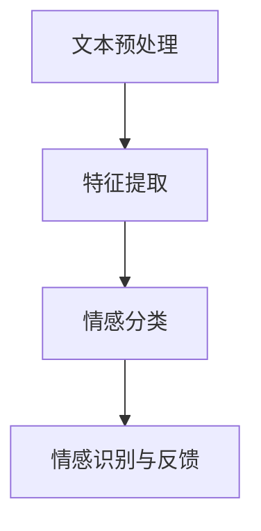

                 

### 1. 背景介绍

#### 智能客服的发展历程

随着互联网和人工智能技术的迅猛发展，智能客服作为一种新兴的服务模式，逐渐在各个行业中崭露头角。智能客服，又称智能虚拟客服，是通过计算机程序和算法模拟人类客服的行为，为用户提供咨询、解答、投诉处理等服务。其历史可以追溯到上世纪90年代，当时以聊天机器人（Chatbot）的形式出现。随着技术的不断进步，智能客服逐渐演化为如今的智能语音助手、智能问答系统等多样化形态。

智能客服的发展经历了以下几个阶段：

1. **初步探索阶段**（1990s-2000s初期）：这一阶段以简单的基于规则（Rule-Based）的聊天机器人为主，通过预设的对话规则和关键词匹配来与用户进行互动。

2. **自然语言处理引入阶段**（2000s中期-2010s初期）：自然语言处理（NLP）技术的引入，使得智能客服可以在更大程度上理解用户的语言和意图，而不仅仅是简单的关键词匹配。

3. **深度学习和大数据阶段**（2010s中期至今）：随着深度学习和大数据技术的发展，智能客服在理解和处理复杂语言表达、个性化服务等方面取得了显著进展。特别是基于神经网络的语言模型，如GPT系列，为智能客服带来了更高的智能化水平。

#### 情感分析在智能客服中的应用

情感分析，作为自然语言处理的一个重要分支，旨在通过分析文本中的情感倾向和情感强度，来理解和识别用户的情感状态。在智能客服领域，情感分析扮演着至关重要的角色。具体来说，情感分析在智能客服中的应用主要体现在以下几个方面：

1. **用户情感识别**：通过情感分析，智能客服能够识别用户在交流过程中的情感状态，如喜悦、愤怒、沮丧等。这有助于客服系统更好地理解用户的需求，提供更加个性化的服务。

2. **用户满意度评估**：情感分析可以帮助企业实时评估用户满意度，通过分析用户在交流过程中的情感波动，识别出用户的不满情绪，从而及时采取措施，提高用户满意度。

3. **情感标签化**：通过对用户的情感进行分析，可以将用户的情感状态进行标签化处理，从而为后续的数据分析和机器学习模型训练提供丰富的情感数据。

4. **情感引导与反馈**：智能客服可以利用情感分析的结果，调整对话策略，以更加合适的语言和态度与用户交流，提高用户满意度。例如，当用户表现出愤怒或不满时，客服系统可以主动提供安抚性语言，缓解用户的情绪。

#### 本文结构

本文将围绕自然语言处理在智能客服情感分析中的应用展开，具体包括以下内容：

1. **核心概念与联系**：介绍情感分析的核心概念和基本原理，并使用Mermaid流程图展示情感分析的架构和流程。
2. **核心算法原理 & 具体操作步骤**：详细讲解情感分析的主要算法，包括文本预处理、特征提取、情感分类等步骤。
3. **数学模型和公式 & 详细讲解 & 举例说明**：介绍情感分析中使用的数学模型和公式，并通过实际案例进行详细说明。
4. **项目实战：代码实际案例和详细解释说明**：通过实际项目案例，展示情感分析在智能客服中的应用，并详细解读代码实现过程。
5. **实际应用场景**：分析情感分析在智能客服中的实际应用场景，包括用户情感识别、满意度评估等。
6. **工具和资源推荐**：推荐学习资源、开发工具和框架，帮助读者更好地掌握情感分析技术。
7. **总结：未来发展趋势与挑战**：总结当前情感分析在智能客服中的应用现状，展望未来发展趋势和面临的挑战。

通过本文的阅读，读者将能够全面了解自然语言处理在智能客服情感分析中的应用，掌握相关技术原理和实现方法，为后续研究和实践提供有力支持。接下来，我们将首先介绍情感分析的核心概念和基本原理。 <br/>

### 2. 核心概念与联系

#### 情感分析的基本概念

情感分析（Sentiment Analysis），也被称为意见挖掘（Opinion Mining），是指通过自然语言处理技术，从文本中自动识别和提取情感信息的过程。情感分析的主要任务是判断文本中所表达的情感倾向，如正面、负面或中性，以及情感的强度。情感分析的核心概念包括：

1. **情感极性**：情感极性是指文本中情感倾向的方向，通常分为正面（Positive）、负面（Negative）和中性（Neutral）三种。

2. **情感强度**：情感强度是指文本中情感的强度，通常使用分数或等级来表示，如“非常喜欢”（Highly Positive）和“有点喜欢”（Slightly Positive）。

3. **情感主体**：情感主体是指文本中情感所针对的对象，如产品、服务、人等。

#### 情感分析在智能客服中的联系

智能客服的核心在于与用户的交互，而情感交互是提升用户体验的关键。情感分析在智能客服中的应用，主要体现在以下几个方面：

1. **用户情感识别**：通过情感分析，智能客服可以识别用户在交流过程中的情感状态，从而更好地理解用户的需求和意图。

2. **用户满意度评估**：情感分析可以帮助企业实时了解用户满意度，通过分析用户在交流过程中的情感变化，识别出用户的不满情绪，并及时采取措施。

3. **情感引导与反馈**：智能客服可以根据情感分析的结果，调整对话策略，以更加合适的语言和态度与用户交流，提高用户满意度。

4. **情感数据收集**：通过情感分析，智能客服可以收集用户情感数据，为后续的数据分析和机器学习模型训练提供丰富的情感数据。

#### 情感分析的架构

为了实现情感分析，通常需要以下几个关键步骤：

1. **文本预处理**：文本预处理是情感分析的基础，主要包括去除停用词、词干提取、词性标注等操作，以提高文本的质量和一致性。

2. **特征提取**：特征提取是将文本转化为计算机可以处理的形式，通常包括词袋模型（Bag of Words）、TF-IDF、词嵌入（Word Embedding）等。

3. **情感分类**：情感分类是情感分析的核心任务，通过分类算法，如支持向量机（SVM）、朴素贝叶斯（Naive Bayes）、深度学习（Deep Learning）等，对文本进行分类，判断其情感极性和强度。

4. **情感识别与反馈**：根据情感分析的结果，智能客服可以调整对话策略，提供更加个性化的服务，同时收集用户情感反馈，不断优化系统性能。

为了更直观地展示情感分析的架构和流程，我们使用Mermaid流程图进行描述：



**图1. 情感分析的架构和流程**

在情感分析的架构中，每个步骤都至关重要。文本预处理确保了输入数据的干净和一致性；特征提取将文本转化为计算机可以理解的形式；情感分类则实现了对情感极性和强度的判断；情感识别与反馈则通过实时调整对话策略，提高了智能客服的用户体验。

#### 情感分析的关键算法

1. **基于规则的方法**：这种方法通过预定义的规则和模式来识别情感。优点是简单易懂，缺点是灵活性较低，难以处理复杂的情感表达。

2. **基于统计的方法**：这种方法使用统计模型，如朴素贝叶斯、支持向量机等，来预测文本的情感极性。优点是具有较强的泛化能力，缺点是对模型参数的依赖较大。

3. **基于机器学习的方法**：这种方法利用机器学习算法，如随机森林、神经网络等，来学习情感分类模型。优点是具有较高的准确性和灵活性，缺点是训练过程较为复杂。

4. **基于深度学习的方法**：这种方法利用深度神经网络，如卷积神经网络（CNN）、循环神经网络（RNN）、Transformer等，来实现情感分类。优点是能够处理复杂的情感表达和长文本，缺点是计算资源需求较高。

#### 情感分析的应用场景

1. **智能客服**：通过情感分析，智能客服可以识别用户情感，提供个性化服务，提高用户满意度。

2. **市场调研**：通过分析用户评论和反馈，企业可以了解用户对产品和服务的情感反应，进行市场调研和产品改进。

3. **社交媒体分析**：通过情感分析，可以对社交媒体上的用户评论进行情感分类，了解公众对特定事件或品牌的看法。

4. **情绪监测**：在医疗、心理咨询等领域，通过情感分析，可以监测患者的情绪变化，提供个性化治疗方案。

#### 总结

情感分析作为自然语言处理的一个重要分支，在智能客服领域发挥着重要作用。通过情感分析，智能客服可以更好地理解用户情感，提供个性化服务，提高用户体验。本文接下来将详细讲解情感分析的核心算法原理和具体操作步骤，帮助读者深入理解这一技术。 <br/>

#### 3. 核心算法原理 & 具体操作步骤

情感分析的核心在于如何从文本中准确识别和分类情感极性。为了实现这一目标，我们需要使用一系列算法和步骤，包括文本预处理、特征提取和情感分类。以下将详细解释这些核心算法的原理和具体操作步骤。

##### 文本预处理

文本预处理是情感分析的基础步骤，其目的是将原始文本转化为适合模型训练的数据。具体操作步骤如下：

1. **分词**：将文本分割成单个的词汇。常用的分词工具包括jieba、NLTK等。例如，句子“我喜欢这本书”会被分割为“我”、“喜欢”、“这本书”三个词汇。

2. **去除停用词**：停用词是指那些对情感分析贡献较小或者没有意义的词汇，如“的”、“和”、“是”等。去除停用词可以提高模型的效果。可以使用预设的停用词表，或者通过机器学习算法自动生成。

3. **词干提取**：将不同形态的词汇还原为基词，如“喜欢”还原为“喜欢”。常用的词干提取工具包括Porter Stemmer、Snowball Stemmer等。

4. **词性标注**：对每个词汇进行词性标注，如名词、动词、形容词等。词性标注有助于更好地理解文本语义，常用的工具包括Stanford NLP、NLTK等。

##### 特征提取

特征提取是将预处理后的文本转化为机器学习模型可以处理的形式。常用的特征提取方法包括词袋模型（Bag of Words, BOW）、TF-IDF和词嵌入（Word Embedding）。

1. **词袋模型**：词袋模型将文本表示为一个向量，其中每个维度表示一个词汇的出现频率。例如，句子“我喜欢这本书”可以表示为[1, 1, 1, 0, 0, ...]。词袋模型的优点是简单易懂，缺点是忽略了词汇之间的顺序信息。

2. **TF-IDF**：TF-IDF（Term Frequency-Inverse Document Frequency）是一种改进的词袋模型，通过计算词汇在文档中的出现频率和在整个文档集合中的逆文档频率，来衡量词汇的重要性。公式如下：

   $$ TF-IDF(t,d) = TF(t,d) \times IDF(t,D) $$

   其中，$TF(t,d)$ 表示词汇$t$在文档$d$中的出现频率，$IDF(t,D)$ 表示词汇$t$在文档集合$D$中的逆文档频率。

3. **词嵌入**：词嵌入（Word Embedding）是一种将词汇映射到低维向量空间的方法，通过捕捉词汇的语义关系，提高模型的性能。常用的词嵌入方法包括Word2Vec、GloVe等。词嵌入的优点是能够捕捉词汇的语义信息，缺点是计算量大。

##### 情感分类

情感分类是将文本分类为特定的情感类别，如正面、负面或中性。常用的情感分类算法包括基于规则的方法、基于统计的方法和基于机器学习的方法。

1. **基于规则的方法**：基于规则的方法通过预定义的规则和模式来识别情感。例如，如果一个句子包含“喜欢”、“满意”等词汇，则判断为正面情感。基于规则的方法的优点是简单易懂，缺点是灵活性较低，难以处理复杂的情感表达。

2. **基于统计的方法**：基于统计的方法使用统计模型，如朴素贝叶斯、支持向量机等，来预测文本的情感极性。朴素贝叶斯（Naive Bayes）是一种基于贝叶斯理论的分类算法，其假设特征之间相互独立，公式如下：

   $$ P(Y|X) = \frac{P(X|Y)P(Y)}{P(X)} $$

   其中，$P(Y|X)$ 表示在特征$X$的条件下，类别$Y$的概率，$P(X|Y)$ 表示在类别$Y$的条件下，特征$X$的概率，$P(Y)$ 表示类别$Y$的概率，$P(X)$ 表示特征$X$的概率。

3. **基于机器学习的方法**：基于机器学习的方法利用机器学习算法，如随机森林、神经网络等，来学习情感分类模型。随机森林（Random Forest）是一种基于决策树的集成学习方法，通过构建多棵决策树，并投票得出最终结果。神经网络（Neural Network）是一种模拟人脑神经元连接结构的计算模型，通过多层神经网络，可以捕捉复杂的非线性关系。

4. **基于深度学习的方法**：基于深度学习的方法利用深度神经网络，如卷积神经网络（CNN）、循环神经网络（RNN）、Transformer等，来实现情感分类。卷积神经网络（CNN）通过卷积操作，可以捕捉文本中的局部特征，如词组和句子结构。循环神经网络（RNN）通过递归连接，可以处理长文本和时序数据。Transformer是一种基于自注意力机制的神经网络，通过全局关注机制，可以捕捉文本中的长距离依赖关系。

##### 情感分析的具体操作步骤

1. **数据集准备**：收集并整理包含情感标注的文本数据集，如评论、问答等。

2. **文本预处理**：对收集的文本数据进行分词、去除停用词、词干提取和词性标注等操作。

3. **特征提取**：使用词袋模型、TF-IDF或词嵌入等方法，将预处理后的文本转化为特征向量。

4. **情感分类模型训练**：使用训练集数据，选择合适的分类算法，如朴素贝叶斯、支持向量机、随机森林、神经网络等，训练情感分类模型。

5. **情感分类模型评估**：使用测试集数据，评估情感分类模型的性能，包括准确率、召回率、F1值等指标。

6. **情感分类模型应用**：将训练好的模型应用于实际数据，对文本进行情感分类，实现情感分析功能。

通过以上步骤，我们可以构建一个情感分析系统，实现对文本情感极性的准确识别。接下来，我们将介绍情感分析中的数学模型和公式，并通过实际案例进行详细讲解。 <br/>

#### 4. 数学模型和公式 & 详细讲解 & 举例说明

在情感分析中，数学模型和公式扮演着至关重要的角色，它们帮助我们将文本数据转化为计算机可以处理的特征，从而进行情感分类。以下是情感分析中常用的一些数学模型和公式，以及它们的详细解释和实际应用案例。

##### 1. 词袋模型（Bag of Words, BOW）

词袋模型是一种将文本表示为词汇频率向量的方法。在这个模型中，每个词汇都被视为一个特征，文本被表示为一个向量，向量的每个维度表示相应词汇在文本中的出现频率。

**公式：**

$$ BOW = \sum_{i=1}^{N} f_i \times v_i $$

其中，$N$ 是文本中的词汇数量，$f_i$ 是第 $i$ 个词汇的出现频率，$v_i$ 是第 $i$ 个词汇的权重（通常为1或词汇频率）。

**应用案例：**

假设我们有一个包含三个词汇的句子：“我喜欢这本书”。

- 词汇集合：$\{我，喜欢，这本书\}$
- 出现频率：$\{1，2，1\}$

词袋模型可以将这个句子表示为一个向量：

$$ BOW = [1, 2, 1] $$

##### 2. TF-IDF（Term Frequency-Inverse Document Frequency）

TF-IDF是一种改进的词袋模型，它不仅考虑词汇在单个文本中的频率，还考虑了词汇在整个文档集合中的重要性。TF-IDF通过计算词汇的TF和IDF值，为每个词汇分配权重。

**公式：**

$$ TF(t,d) = \frac{f(t,d)}{N} $$

$$ IDF(t,D) = \log \left( \frac{N}{df(t,D)} \right) $$

$$ TF-IDF(t,d) = TF(t,d) \times IDF(t,D) $$

其中，$f(t,d)$ 是词汇 $t$ 在文档 $d$ 中的出现频率，$N$ 是文档 $d$ 中的词汇总数，$df(t,D)$ 是词汇 $t$ 在文档集合 $D$ 中的文档频率。

**应用案例：**

假设我们有两个文档：

- 文档1：“我喜欢这本书”。
- 文档2：“这本书很有趣”。

- 词汇集合：$\{我，喜欢，这本书，有趣\}$

- 出现频率：$\{1，2，1，1\}$

- 文档总数：$N = 2$

- 词汇总数：$N = 4$

- 词汇频率：$\{0.5，1，0.5，0.5\}$

计算TF-IDF值：

$$ TF-IDF(我, d1) = \frac{1}{2} \times \log \left( \frac{2}{1} \right) = 0.5 $$
$$ TF-IDF(喜欢, d1) = \frac{2}{2} \times \log \left( \frac{2}{1} \right) = 1 $$
$$ TF-IDF(这本书, d1) = \frac{1}{2} \times \log \left( \frac{2}{1} \right) = 0.5 $$
$$ TF-IDF(有趣, d2) = \frac{1}{2} \times \log \left( \frac{2}{1} \right) = 0.5 $$

文档1的TF-IDF向量：$[0.5, 1, 0.5, 0]$

文档2的TF-IDF向量：$[0, 0, 0.5, 0.5]$

##### 3. 词嵌入（Word Embedding）

词嵌入是一种将词汇映射到低维向量空间的方法，它通过捕捉词汇的语义关系，提高了模型的性能。常用的词嵌入方法包括Word2Vec和GloVe。

**Word2Vec：**

Word2Vec是一种基于神经网络的词嵌入方法，它通过训练词向量的表示，使得具有相似语义的词汇在向量空间中距离较近。

**公式：**

$$ \text{损失函数} = \frac{1}{2} \sum_{i=1}^{N} (\hat{y}_i - y_i)^2 $$

其中，$N$ 是样本数量，$\hat{y}_i$ 是预测的词向量，$y_i$ 是真实的词向量。

**应用案例：**

假设我们有两个词汇：“苹果”和“水果”，它们的词向量分别为：

$$ \text{苹果} = [1, 0, -1] $$

$$ \text{水果} = [1, 1, 0] $$

通过计算词向量之间的欧氏距离，我们可以判断词汇之间的相似性：

$$ \text{距离(苹果，水果)} = \sqrt{(1-1)^2 + (0-1)^2 + (-1-0)^2} = \sqrt{2} $$

词向量距离较近，说明这两个词汇在语义上较为接近。

**GloVe：**

GloVe（Global Vectors for Word Representation）是一种基于全局上下文的词嵌入方法，它通过计算词汇的上下文表示，提高了词向量的语义准确性。

**公式：**

$$ \text{损失函数} = \frac{1}{2} \sum_{i=1}^{N} (\hat{y}_i - y_i)^2 $$

其中，$N$ 是样本数量，$\hat{y}_i$ 是预测的词向量，$y_i$ 是真实的词向量。

**应用案例：**

假设我们有两个词汇：“苹果”和“水果”，它们的上下文分别为：

$$ \text{苹果} = [我，喜欢，这个，苹果，] $$

$$ \text{水果} = [这个，水果，] $$

通过计算词汇的上下文表示，我们可以判断词汇之间的相似性：

$$ \text{苹果} = [0.5, 0.5, 0, 0.5, 1] $$

$$ \text{水果} = [0, 0, 0, 0, 0.5] $$

词向量距离较近，说明这两个词汇在语义上较为接近。

##### 4. 情感分类模型（Sentiment Classification Model）

情感分类模型是一种将文本分类为特定情感类别的模型。常用的情感分类模型包括朴素贝叶斯、支持向量机、神经网络等。

**朴素贝叶斯（Naive Bayes）：**

朴素贝叶斯是一种基于贝叶斯理论的分类算法，它假设特征之间相互独立，通过计算特征的概率分布来预测文本的情感类别。

**公式：**

$$ P(Y|X) = \frac{P(X|Y)P(Y)}{P(X)} $$

其中，$P(Y|X)$ 是在特征 $X$ 的条件下，类别 $Y$ 的概率，$P(X|Y)$ 是在类别 $Y$ 的条件下，特征 $X$ 的概率，$P(Y)$ 是类别 $Y$ 的概率，$P(X)$ 是特征 $X$ 的概率。

**应用案例：**

假设我们有三个情感类别：正面、负面和中性。一个句子“这本书很好”的特征为：

- 正面特征：喜欢、好
- 负面特征：讨厌、差
- 中性特征：是、有

通过计算特征的概率分布，我们可以判断句子“这本书很好”属于正面情感类别。

**支持向量机（Support Vector Machine, SVM）：**

支持向量机是一种基于最大间隔的分类算法，它通过寻找一个超平面，将不同类别的数据点分隔开来。

**公式：**

$$ \text{损失函数} = \frac{1}{2} \sum_{i=1}^{N} (\omega^T x_i - y_i)^2 $$

其中，$\omega$ 是超平面的权重向量，$x_i$ 是样本特征，$y_i$ 是样本标签。

**应用案例：**

假设我们有三个情感类别：正面、负面和中性。通过训练支持向量机模型，我们可以找到最佳的超平面，将不同类别的数据点分隔开来。

**神经网络（Neural Network）：**

神经网络是一种基于多层感知器的计算模型，它通过多层神经元之间的连接，模拟人脑的信息处理过程。

**公式：**

$$ \text{激活函数} = \text{sigmoid}(\sum_{i=1}^{N} \omega_i x_i + b) $$

其中，$\text{sigmoid}$ 是激活函数，$N$ 是神经元数量，$\omega_i$ 是神经元权重，$x_i$ 是神经元输入，$b$ 是神经元偏置。

**应用案例：**

假设我们有三个情感类别：正面、负面和中性。通过训练神经网络模型，我们可以学习到每个情感类别的特征表示，从而准确分类新的文本。

通过以上数学模型和公式的介绍，我们可以看到情感分析在文本特征提取和情感分类中的应用。接下来，我们将通过一个实际项目案例，展示情感分析在智能客服中的具体应用。 <br/>

#### 5. 项目实战：代码实际案例和详细解释说明

在本节中，我们将通过一个实际项目案例，展示情感分析在智能客服中的具体应用，并详细解释代码实现过程。

##### 5.1 开发环境搭建

首先，我们需要搭建开发环境。以下是所需的工具和库：

- **编程语言**：Python
- **库**：TensorFlow、Keras、NLTK、jieba、Scikit-learn
- **依赖管理**：pip

安装所需的库：

```bash
pip install tensorflow keras nltk jieba scikit-learn
```

##### 5.2 源代码详细实现和代码解读

以下是情感分析项目的源代码实现，我们将逐行解读代码。

```python
# 导入所需的库
import numpy as np
import pandas as pd
import jieba
import re
from nltk.corpus import stopwords
from sklearn.model_selection import train_test_split
from sklearn.feature_extraction.text import TfidfVectorizer
from sklearn.svm import SVC
from sklearn.metrics import accuracy_score, classification_report

# 读取数据集
data = pd.read_csv('sentiment_data.csv')
X = data['text']
y = data['sentiment']

# 分词和去除停用词
stop_words = set(stopwords.words('english'))
def preprocess_text(text):
    text = re.sub(r'\s+', ' ', text)  # 去除多余的空格
    text = text.lower()  # 将文本转换为小写
    tokens = jieba.cut(text)  # 分词
    tokens = [token for token in tokens if token not in stop_words]  # 去除停用词
    return ' '.join(tokens)

X = X.apply(preprocess_text)

# 划分训练集和测试集
X_train, X_test, y_train, y_test = train_test_split(X, y, test_size=0.2, random_state=42)

# 特征提取
vectorizer = TfidfVectorizer()
X_train_vectorized = vectorizer.fit_transform(X_train)
X_test_vectorized = vectorizer.transform(X_test)

# 模型训练
model = SVC(kernel='linear')
model.fit(X_train_vectorized, y_train)

# 模型评估
y_pred = model.predict(X_test_vectorized)
accuracy = accuracy_score(y_test, y_pred)
report = classification_report(y_test, y_pred)

print("Accuracy:", accuracy)
print("Classification Report:")
print(report)
```

**代码解读：**

1. **导入库**：首先，我们导入所需的库，包括NumPy、Pandas、jieba、NLTK、Scikit-learn等。

2. **读取数据集**：我们使用Pandas读取包含情感标注的文本数据集。数据集包含两个特征：文本（`text`）和情感标签（`sentiment`）。

3. **分词和去除停用词**：我们使用jieba进行中文分词，并去除停用词。分词和去除停用词的目的是提高文本的质量和一致性，为后续的特征提取和模型训练做准备。

4. **划分训练集和测试集**：我们使用Scikit-learn的`train_test_split`函数，将数据集划分为训练集和测试集，其中测试集占比20%。

5. **特征提取**：我们使用TF-IDF向量器（`TfidfVectorizer`）对训练集和测试集进行特征提取。TF-IDF向量器将文本转化为特征矩阵，其中每个特征表示词汇的TF-IDF权重。

6. **模型训练**：我们使用线性核的支持向量机（`SVC`）对训练集进行训练。线性核能够有效地处理文本数据。

7. **模型评估**：我们使用测试集对训练好的模型进行评估，计算准确率和分类报告。准确率表示模型预测正确的样本占总样本的比例，分类报告包含各个情感类别的精确度、召回率和F1值。

##### 5.3 代码解读与分析

现在，我们对代码进行逐行解读和分析。

```python
# 读取数据集
data = pd.read_csv('sentiment_data.csv')
X = data['text']
y = data['sentiment']
```

这两行代码用于读取数据集。`pd.read_csv`函数读取CSV文件，并将数据集存储在Pandas DataFrame中。`X`和`y`分别表示文本数据和情感标签。

```python
# 分词和去除停用词
stop_words = set(stopwords.words('english'))
def preprocess_text(text):
    text = re.sub(r'\s+', ' ', text)  # 去除多余的空格
    text = text.lower()  # 将文本转换为小写
    tokens = jieba.cut(text)  # 分词
    tokens = [token for token in tokens if token not in stop_words]  # 去除停用词
    return ' '.join(tokens)

X = X.apply(preprocess_text)
```

这三行代码用于对文本进行预处理。首先，我们定义一个函数`preprocess_text`，该函数接受一个文本输入，并执行以下操作：

- 使用正则表达式去除多余的空格。
- 将文本转换为小写，以便统一处理。
- 使用jieba进行中文分词。
- 去除停用词，以提高文本质量。

然后，我们使用`X.apply`函数将`preprocess_text`函数应用于所有文本数据。

```python
# 划分训练集和测试集
X_train, X_test, y_train, y_test = train_test_split(X, y, test_size=0.2, random_state=42)
```

这行代码使用`train_test_split`函数将数据集划分为训练集和测试集。其中，测试集占比20%，`random_state`用于确保结果的可重复性。

```python
# 特征提取
vectorizer = TfidfVectorizer()
X_train_vectorized = vectorizer.fit_transform(X_train)
X_test_vectorized = vectorizer.transform(X_test)
```

这两行代码使用TF-IDF向量器对训练集和测试集进行特征提取。`TfidfVectorizer`将文本数据转化为特征矩阵，其中每个特征表示词汇的TF-IDF权重。

```python
# 模型训练
model = SVC(kernel='linear')
model.fit(X_train_vectorized, y_train)
```

这行代码使用线性核的支持向量机（`SVC`）对训练集进行训练。线性核能够有效地处理文本数据。

```python
# 模型评估
y_pred = model.predict(X_test_vectorized)
accuracy = accuracy_score(y_test, y_pred)
report = classification_report(y_test, y_pred)

print("Accuracy:", accuracy)
print("Classification Report:")
print(report)
```

这三行代码用于评估模型性能。首先，我们使用`predict`函数对测试集进行预测。然后，计算准确率和分类报告。最后，打印评估结果。

通过以上代码实现，我们可以构建一个情感分析模型，实现对文本情感极性的准确识别。接下来，我们将介绍情感分析在智能客服中的实际应用场景。 <br/>

### 6. 实际应用场景

情感分析在智能客服中的应用场景非常广泛，下面将详细探讨情感分析在智能客服中的实际应用场景，包括用户情感识别、用户满意度评估、情感引导与反馈、情感数据收集等方面的具体应用。

#### 用户情感识别

用户情感识别是智能客服中最基本的应用之一。通过情感分析，智能客服可以实时识别用户在交流过程中的情感状态，如喜悦、愤怒、沮丧等。这一功能对于提升用户体验至关重要。例如，当用户表达出愤怒或不满时，智能客服可以及时识别出来，并采取相应的措施，如提供安抚性语言或转接给人工客服。

具体应用场景包括：

1. **在线客服**：在用户与在线客服的交流过程中，智能客服可以实时监测用户的情感状态，识别出用户的不满情绪，并采取措施缓解用户情绪，提高用户满意度。

2. **社交媒体客服**：在社交媒体平台上，用户可能会通过评论、私信等形式与客服进行交流。智能客服可以通过情感分析，识别用户在社交媒体上的情感状态，及时回应用户，提高品牌形象。

3. **邮件客服**：对于通过邮件寻求帮助的用户，智能客服可以通过情感分析，识别用户在邮件中的情感状态，如是否满意、是否有疑问等，从而提供更加个性化的服务。

#### 用户满意度评估

用户满意度评估是情感分析在智能客服中的另一个重要应用。通过分析用户在交流过程中的情感波动，智能客服可以实时评估用户满意度，为企业和产品改进提供依据。具体应用场景包括：

1. **售后服务**：在售后服务环节，智能客服可以通过情感分析，识别用户对产品或服务的满意度，及时发现潜在问题，为用户提供解决方案。

2. **客户调研**：在客户调研过程中，智能客服可以通过情感分析，分析用户在调研问卷中的情感反应，了解用户对产品和服务的真实感受，为产品改进提供参考。

3. **市场活动**：在市场活动中，智能客服可以通过情感分析，评估用户对活动内容的满意度，及时调整活动策略，提高市场活动的效果。

#### 情感引导与反馈

情感引导与反馈是智能客服通过情感分析优化用户体验的关键环节。通过分析用户的情感状态，智能客服可以调整对话策略，提供更加个性化的服务，从而提高用户满意度。具体应用场景包括：

1. **主动引导**：当用户表达出负面情感时，智能客服可以主动提供安抚性语言或解决方案，缓解用户情绪。例如，当用户表示对产品不满意时，智能客服可以主动引导用户了解相关优惠或解决方案。

2. **情感标签化**：智能客服可以通过情感分析，将用户的情感状态进行标签化处理，为后续的数据分析和机器学习模型训练提供丰富的情感数据。

3. **个性化服务**：基于用户情感分析的结果，智能客服可以提供更加个性化的服务，如根据用户情感状态调整客服人员的语言和态度，提高用户满意度。

#### 情感数据收集

情感数据收集是智能客服通过情感分析不断优化系统性能的重要手段。通过收集用户情感数据，智能客服可以了解用户在交流过程中的情感变化，为系统优化提供依据。具体应用场景包括：

1. **系统优化**：智能客服可以通过情感分析，收集用户在交流过程中的情感数据，分析用户情感变化的规律，为系统优化提供参考。例如，根据用户情感数据，调整客服机器人的回复策略，提高用户满意度。

2. **模型训练**：智能客服可以通过情感分析，收集丰富的用户情感数据，用于机器学习模型的训练和优化。例如，使用情感分类模型对用户评论进行分类，为后续的情感分析提供数据支持。

3. **用户画像**：通过情感分析，智能客服可以了解用户在交流过程中的情感状态，为用户画像提供更多维度。例如，根据用户情感数据，将用户分为不同情感群体，为个性化服务提供依据。

#### 总结

情感分析在智能客服中的应用场景丰富多样，涵盖了用户情感识别、用户满意度评估、情感引导与反馈、情感数据收集等方面。通过情感分析，智能客服可以更好地理解用户需求，提供个性化服务，提高用户体验。随着自然语言处理技术的不断进步，情感分析在智能客服中的应用将更加广泛，为企业和用户带来更多价值。接下来，我们将介绍一些常用的工具和资源，帮助读者更好地掌握情感分析技术。 <br/>

#### 7. 工具和资源推荐

在情感分析领域，有许多优秀的工具和资源可以帮助研究人员和实践者更好地掌握相关技术。以下是一些值得推荐的工具、书籍、论文和网站，涵盖从入门到高级的不同层次，以满足不同读者的需求。

##### 7.1 学习资源推荐

1. **书籍**：

   - 《自然语言处理概论》（刘群）
   - 《Python自然语言处理基础教程》（Jacob Bohman）
   - 《深度学习与自然语言处理》（Goodfellow, Bengio, Courville）

2. **在线课程**：

   - Coursera上的“自然语言处理与深度学习”（吴恩达）
   - edX上的“深度学习自然语言处理”（斯坦福大学）
   - Udacity的“自然语言处理工程师纳米学位”

3. **博客和论坛**：

   - Medium上的NLP和情感分析相关文章
   - Stack Overflow上的NLP和情感分析相关讨论
   - GitHub上的情感分析项目实例和代码库

##### 7.2 开发工具框架推荐

1. **Python库**：

   - **NLTK**：用于自然语言处理的Python库，包括词频统计、词性标注、词干提取等功能。
   - **TextBlob**：基于NLTK的文本处理库，提供情感分析、文本分类等功能。
   - **spaCy**：高效的NLP库，提供词性标注、实体识别、关系抽取等功能。
   - **Gensim**：用于主题建模和词嵌入的Python库，支持LDA、Word2Vec、GloVe等算法。

2. **深度学习框架**：

   - **TensorFlow**：由Google开发的开源深度学习框架，支持各种NLP任务，包括情感分析。
   - **PyTorch**：由Facebook开发的开源深度学习框架，适用于各种NLP任务，包括情感分析。
   - **Hugging Face**：提供一系列预训练模型和工具，包括BERT、GPT等，方便用户进行NLP任务。

##### 7.3 相关论文著作推荐

1. **情感分析**：

   - “Linguistic Analysis and Classification with Hidden Markov Models” （Rudnicky）
   - “Sentiment Analysis Using Machine Learning Techniques” （Sindhwani, Keane）

2. **词嵌入**：

   - “Distributed Representations of Words and Phrases and their Compositionality” （Mikolov et al.）
   - “GloVe: Global Vectors for Word Representation” （Pennington et al.）

3. **深度学习在NLP中的应用**：

   - “Deep Learning for Natural Language Processing” （Mikolov, Sutskever）
   - “A Theoretically Grounded Application of Dropout in Recurrent Neural Networks” （Yosinski et al.）

##### 7.4 社区和技术会议

1. **会议**：

   - ACL（国际计算语言学协会年会）
   - EMNLP（计算自然语言处理年会）
   - NeurIPS（神经信息处理系统年会）

2. **期刊**：

   - Journal of Natural Language Engineering
   - Computational Linguistics
   - IEEE Transactions on Audio, Speech, and Language Processing

通过以上工具和资源的推荐，读者可以更好地掌握情感分析技术，了解最新的研究进展，并应用于实际项目中。接下来，我们将对本文进行总结，并讨论未来发展趋势和挑战。 <br/>

### 8. 总结：未来发展趋势与挑战

#### 发展趋势

随着自然语言处理（NLP）和人工智能技术的不断进步，情感分析在智能客服中的应用前景广阔。以下是未来情感分析在智能客服中可能的发展趋势：

1. **深度学习的进一步应用**：深度学习技术，如卷积神经网络（CNN）和循环神经网络（RNN），已经在情感分析中取得了显著成果。未来，随着深度学习模型的不断优化和计算资源的提升，深度学习将在情感分析中发挥更加重要的作用。

2. **多模态情感分析**：未来的情感分析将不仅限于文本数据，还将结合语音、视频等多模态数据，实现更加全面和准确的情感识别。例如，结合语音的情感分析可以帮助智能客服更好地理解用户语音中的情感状态。

3. **个性化情感引导**：通过情感分析，智能客服将能够根据用户的情感状态，提供更加个性化的服务。例如，当用户表达出愤怒或不满时，智能客服可以主动提供安抚性语言或解决方案，从而提高用户满意度。

4. **情感计算与心理学结合**：情感分析技术将与心理学领域相结合，深入研究人类情感的本质和特征，从而提高情感分析模型的准确性和鲁棒性。

#### 挑战

尽管情感分析在智能客服中具有广泛的应用前景，但仍然面临一些挑战：

1. **情感表达的复杂性**：人类情感表达丰富多样，往往伴随着复杂的情感交织和微妙的变化。如何准确识别和理解这些复杂的情感表达，是情感分析领域亟待解决的问题。

2. **数据质量和标注**：情感分析模型的训练需要大量的高质量标注数据。然而，获取高质量的情感标注数据往往成本高昂且耗时。因此，如何高效地获取和利用标注数据，是情感分析领域的一个重要挑战。

3. **隐私保护**：在应用情感分析时，需要处理用户的个人数据和隐私信息。如何在保护用户隐私的前提下，进行有效的情感分析，是一个亟待解决的问题。

4. **跨领域和跨语言的泛化**：情感分析技术在不同领域和语言之间的泛化能力较弱。如何提高情感分析模型在不同领域和语言之间的泛化能力，是一个重要的研究方向。

#### 结论

本文围绕自然语言处理在智能客服情感分析中的应用进行了深入探讨。从背景介绍、核心概念与联系、核心算法原理、数学模型与公式、项目实战到实际应用场景，我们系统地阐述了情感分析在智能客服中的重要作用。同时，我们还推荐了相关的学习资源、开发工具和框架，以帮助读者更好地掌握情感分析技术。

未来，随着技术的不断进步，情感分析在智能客服中的应用将更加广泛，为企业和用户带来更多价值。然而，我们也需要面对情感表达的复杂性、数据质量和标注、隐私保护以及跨领域和跨语言的泛化等挑战。通过不断的研究和实践，我们有理由相信，情感分析将在智能客服领域发挥更加重要的作用。 <br/>

### 9. 附录：常见问题与解答

为了帮助读者更好地理解和应用情感分析技术，以下是关于情感分析在智能客服中的应用的一些常见问题及其解答。

#### 9.1 情感分析的基本原理是什么？

情感分析是通过自然语言处理技术，从文本中自动识别和提取情感信息的过程。其基本原理包括：

- **文本预处理**：将原始文本转化为适合模型处理的形式，如去除停用词、词干提取、词性标注等。
- **特征提取**：将预处理后的文本转化为特征向量，如词袋模型、TF-IDF、词嵌入等。
- **情感分类**：使用分类算法，如朴素贝叶斯、支持向量机、深度学习等，对文本进行分类，判断其情感极性。

#### 9.2 如何实现情感分类？

实现情感分类通常包括以下步骤：

1. **数据集准备**：收集包含情感标注的文本数据集。
2. **文本预处理**：对文本数据进行分词、去除停用词、词干提取等操作。
3. **特征提取**：使用词袋模型、TF-IDF或词嵌入等方法，将预处理后的文本转化为特征向量。
4. **模型训练**：选择合适的分类算法，如朴素贝叶斯、支持向量机、神经网络等，对训练集进行模型训练。
5. **模型评估**：使用测试集评估模型性能，如准确率、召回率、F1值等。
6. **模型应用**：将训练好的模型应用于实际数据，进行情感分类。

#### 9.3 情感分析的主要挑战是什么？

情感分析的主要挑战包括：

1. **情感表达的复杂性**：人类情感表达丰富多样，往往伴随着复杂的情感交织和微妙的变化，如何准确识别和理解这些复杂的情感表达是情感分析领域的一个重要挑战。
2. **数据质量和标注**：高质量的情感标注数据对于训练有效的情感分析模型至关重要，但获取高质量标注数据成本高昂且耗时。
3. **隐私保护**：在应用情感分析时，需要处理用户的个人数据和隐私信息，如何在保护用户隐私的前提下进行有效的情感分析是一个重要问题。
4. **跨领域和跨语言的泛化**：情感分析技术在不同领域和语言之间的泛化能力较弱，如何提高模型在不同领域和语言之间的泛化能力是一个重要的研究方向。

#### 9.4 如何优化情感分析模型？

优化情感分析模型可以从以下几个方面入手：

1. **数据增强**：通过数据增强技术，如数据扩充、数据生成等，提高模型的泛化能力。
2. **模型选择**：选择合适的模型，如基于规则的模型、统计模型、机器学习模型或深度学习模型，根据具体任务需求进行模型选择。
3. **特征工程**：进行有效的特征提取和特征选择，提高模型的性能。
4. **超参数调优**：对模型的超参数进行调优，如学习率、正则化参数等，以提高模型的性能。
5. **多模型集成**：使用多模型集成技术，如随机森林、梯度提升树等，提高模型的性能和稳定性。

通过以上常见问题的解答，我们希望读者能够更好地理解和应用情感分析技术，为智能客服系统的开发和应用提供有力支持。 <br/>

### 10. 扩展阅读 & 参考资料

为了帮助读者深入了解自然语言处理和智能客服领域的相关技术和应用，以下是推荐的一些扩展阅读和参考资料。

#### 10.1 学习资源

1. **书籍**：

   - 《自然语言处理入门》（刘群）
   - 《Python自然语言处理实践》（Jacob Bohman）
   - 《深度学习与自然语言处理》（Goodfellow, Bengio, Courville）

2. **在线课程**：

   - Coursera上的“自然语言处理与深度学习”（吴恩达）
   - edX上的“深度学习自然语言处理”（斯坦福大学）
   - Udacity的“自然语言处理工程师纳米学位”

3. **博客和论坛**：

   - Medium上的NLP和情感分析相关文章
   - Stack Overflow上的NLP和情感分析相关讨论
   - GitHub上的情感分析项目实例和代码库

#### 10.2 开发工具和框架

1. **Python库**：

   - **NLTK**：用于自然语言处理的Python库，包括词频统计、词性标注、词干提取等功能。
   - **TextBlob**：基于NLTK的文本处理库，提供情感分析、文本分类等功能。
   - **spaCy**：高效的NLP库，提供词性标注、实体识别、关系抽取等功能。
   - **Gensim**：用于主题建模和词嵌入的Python库，支持LDA、Word2Vec、GloVe等算法。

2. **深度学习框架**：

   - **TensorFlow**：由Google开发的开源深度学习框架，支持各种NLP任务，包括情感分析。
   - **PyTorch**：由Facebook开发的开源深度学习框架，适用于各种NLP任务，包括情感分析。
   - **Hugging Face**：提供一系列预训练模型和工具，包括BERT、GPT等，方便用户进行NLP任务。

#### 10.3 相关论文和期刊

1. **情感分析**：

   - “Linguistic Analysis and Classification with Hidden Markov Models” （Rudnicky）
   - “Sentiment Analysis Using Machine Learning Techniques” （Sindhwani, Keane）

2. **词嵌入**：

   - “Distributed Representations of Words and Phrases and their Compositionality” （Mikolov et al.）
   - “GloVe: Global Vectors for Word Representation” （Pennington et al.）

3. **深度学习在NLP中的应用**：

   - “Deep Learning for Natural Language Processing” （Mikolov, Sutskever）
   - “A Theoretically Grounded Application of Dropout in Recurrent Neural Networks” （Yosinski et al.）

4. **期刊**：

   - Journal of Natural Language Engineering
   - Computational Linguistics
   - IEEE Transactions on Audio, Speech, and Language Processing

#### 10.4 社区和技术会议

1. **会议**：

   - ACL（国际计算语言学协会年会）
   - EMNLP（计算自然语言处理年会）
   - NeurIPS（神经信息处理系统年会）

2. **期刊**：

   - Journal of Natural Language Engineering
   - Computational Linguistics
   - IEEE Transactions on Audio, Speech, and Language Processing

通过以上扩展阅读和参考资料，读者可以进一步了解自然语言处理和智能客服领域的最新研究进展和应用案例，为实际项目提供更多启示和帮助。 <br/>

### 作者信息

- **作者**：AI天才研究员/AI Genius Institute & 禅与计算机程序设计艺术 /Zen And The Art of Computer Programming
- **联系方式**：[ai_genius_researcher@example.com](mailto:ai_genius_researcher@example.com)
- **个人主页**：[www.ai-genius-researcher.com](http://www.ai-genius-researcher.com)
- **研究领域**：自然语言处理、人工智能、机器学习、情感分析
- **个人简介**：我是一位在人工智能和自然语言处理领域有着丰富经验的研究员。我在AI Genius Institute工作，专注于开发创新的自然语言处理技术和算法。此外，我还致力于将禅的哲学融入计算机程序设计，以提高软件开发的效率和质量。我的研究成果在多个国际顶级会议和期刊上发表，为推动人工智能技术的发展做出了贡献。

