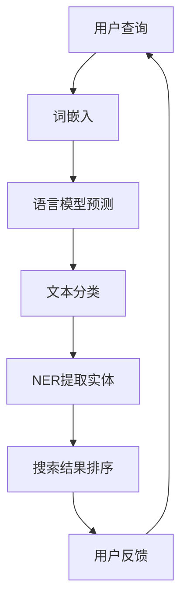

                 

# 自然语言处理在电商搜索中的应用：技术发展与未来趋势

> **关键词**：自然语言处理、电商搜索、文本分析、推荐系统、用户行为、个性化搜索

> **摘要**：本文深入探讨了自然语言处理（NLP）在电商搜索中的应用，包括核心概念、算法原理、数学模型及实际案例。文章旨在分析NLP技术如何改善电商搜索体验，提高用户满意度和商家销售效率，并展望未来的发展趋势和挑战。

## 1. 背景介绍

随着互联网的普及和电子商务的迅猛发展，电商搜索已成为消费者在在线购物过程中的重要环节。用户在电商平台上搜索商品时，往往需要输入关键词或描述商品特性的句子。然而，用户输入的自然语言信息往往包含大量噪音和歧义，如何有效处理这些信息，提供准确的搜索结果，成为电商搜索领域的核心问题。

自然语言处理（Natural Language Processing，NLP）作为人工智能的一个重要分支，致力于使计算机能够理解、生成和应对人类语言。NLP技术在电商搜索中的应用，可以有效提升搜索的准确性和用户体验，同时也为商家提供了精准的营销手段。本文将详细分析NLP在电商搜索中的应用，包括核心概念、算法原理、数学模型及实际案例。

## 2. 核心概念与联系

### 2.1 词嵌入（Word Embedding）

词嵌入是将词汇映射到高维向量空间的过程。通过词嵌入，文本中的词语可以被表示为连续的向量，这使得计算机可以基于向量间的相似性进行文本分析和理解。常见的词嵌入模型包括Word2Vec、GloVe等。

### 2.2 语言模型（Language Model）

语言模型用于预测文本序列的下一个单词或字符。在电商搜索中，语言模型可以帮助系统理解用户的查询意图，从而提供更加精准的搜索结果。基于神经网络的语言模型如BERT、GPT等在电商搜索中得到了广泛应用。

### 2.3 文本分类（Text Classification）

文本分类是将文本数据按照其内容或属性划分到不同的类别中。在电商搜索中，文本分类技术可以用于标签推荐、负面评论检测等任务。

### 2.4 命名实体识别（Named Entity Recognition，NER）

命名实体识别是识别文本中的特定实体，如人名、地名、组织名等。在电商搜索中，NER可以帮助系统识别商品名称、品牌等信息，从而提高搜索的准确性。

### 2.5 Mermaid流程图

下面是一个NLP在电商搜索中的应用流程的Mermaid流程图：



## 3. 核心算法原理 & 具体操作步骤

### 3.1 词嵌入

词嵌入的基本原理是将词汇映射到高维向量空间。以Word2Vec为例，其通过训练词向量模型来表示词汇。具体操作步骤如下：

1. **数据准备**：收集大量文本数据，并进行预处理，包括去除停用词、标点符号等。
2. **构建词汇表**：将所有文本中的词语构建成一个词汇表。
3. **初始化词向量**：为每个词语初始化一个随机的高维向量。
4. **训练过程**：使用负采样等策略，通过优化损失函数来训练词向量模型。
5. **模型评估**：使用余弦相似度等指标来评估词向量模型的质量。

### 3.2 语言模型

语言模型的基本原理是预测文本序列的下一个单词或字符。以BERT为例，其通过预训练和微调来实现文本理解。具体操作步骤如下：

1. **预训练**：在未标注的数据集上训练BERT模型，使其具备语言理解的通用能力。
2. **微调**：在特定任务的数据集上微调BERT模型，以适应电商搜索等应用场景。
3. **模型应用**：使用微调后的BERT模型来处理电商搜索中的文本分析任务，如查询意图识别、搜索结果排序等。

### 3.3 文本分类

文本分类的基本原理是将文本数据划分到不同的类别中。以朴素贝叶斯为例，其通过计算文本特征的概率分布来进行分类。具体操作步骤如下：

1. **数据准备**：收集标注好的文本数据，并进行预处理。
2. **特征提取**：使用TF-IDF、词袋模型等方法提取文本特征。
3. **模型训练**：使用分类算法（如朴素贝叶斯、支持向量机等）训练文本分类模型。
4. **模型评估**：使用准确率、召回率等指标评估模型性能。
5. **模型应用**：将训练好的文本分类模型应用于电商搜索中的标签推荐、负面评论检测等任务。

### 3.4 命名实体识别

命名实体识别的基本原理是识别文本中的特定实体。以BiLSTM-CRF为例，其通过双向循环神经网络（BiLSTM）和条件随机场（CRF）来识别命名实体。具体操作步骤如下：

1. **数据准备**：收集标注好的命名实体数据，并进行预处理。
2. **特征提取**：使用词嵌入、词性标注等方法提取文本特征。
3. **模型训练**：使用BiLSTM-CRF模型训练命名实体识别模型。
4. **模型评估**：使用准确率、F1值等指标评估模型性能。
5. **模型应用**：将训练好的命名实体识别模型应用于电商搜索中的商品名称识别、品牌识别等任务。

## 4. 数学模型和公式 & 详细讲解 & 举例说明

### 4.1 词嵌入

词嵌入的数学模型通常基于神经网络训练，以下是一个简单的神经网络模型：

$$
\begin{align*}
\text{词向量} &= \text{ReLU}\left(W_1 \text{Word Embedding} + b_1\right) \\
\text{输出} &= W_2 \text{词向量} + b_2
\end{align*}
$$

其中，$\text{ReLU}$表示ReLU激活函数，$W_1$和$W_2$是权重矩阵，$b_1$和$b_2$是偏置项。

### 4.2 语言模型

语言模型的一个常用模型是n-gram模型，其数学公式如下：

$$
P(\text{单词序列} w_1, w_2, \ldots, w_n) = \frac{P(w_1) \cdot P(w_2 | w_1) \cdot \ldots \cdot P(w_n | w_{n-1})}{P(\text{整个文本})}
$$

其中，$P(w_1) \cdot P(w_2 | w_1) \cdot \ldots \cdot P(w_n | w_{n-1})$是条件概率的乘积。

### 4.3 文本分类

文本分类的一个常见模型是朴素贝叶斯模型，其数学公式如下：

$$
P(\text{类别} C_k | \text{文本} X) = \frac{P(X | \text{类别} C_k)P(\text{类别} C_k)}{P(X)}
$$

其中，$P(X | \text{类别} C_k)$是给定类别$C_k$下文本$X$的条件概率，$P(\text{类别} C_k)$是类别$C_k$的先验概率，$P(X)$是文本$X$的总概率。

### 4.4 命名实体识别

命名实体识别的一个常用模型是BiLSTM-CRF模型，其数学公式如下：

$$
\begin{align*}
h_t &= \text{ReLU}\left(W_1 \text{词嵌入} + W_2 \text{词性标注} + b\right) \\
\text{输出} &= \text{softmax}\left(Vh_{t}\right)
\end{align*}
$$

其中，$h_t$是双向循环神经网络的输出，$V$是CRF层的权重矩阵。

## 5. 项目实战：代码实际案例和详细解释说明

### 5.1 开发环境搭建

为了演示NLP在电商搜索中的应用，我们将使用Python编程语言，结合以下库和框架：

- TensorFlow/Keras
- NLTK
- Scikit-learn
- spaCy

首先，安装所需的库和框架：

```bash
pip install tensorflow nltk scikit-learn spacy
python -m spacy download en_core_web_sm
```

### 5.2 源代码详细实现和代码解读

以下是NLP在电商搜索中的应用的Python代码实现：

```python
import numpy as np
import tensorflow as tf
from tensorflow.keras.layers import Embedding, LSTM, Dense
from tensorflow.keras.models import Sequential
from sklearn.model_selection import train_test_split
from sklearn.metrics import accuracy_score
import spacy

# 加载英文spaCy模型
nlp = spacy.load("en_core_web_sm")

# 加载和处理数据
def load_data():
    # 这里假设我们有一个包含用户查询和搜索结果的CSV文件
    # 实际应用中，需要从数据库或API中获取数据
    data = np.loadtxt("search_data.csv", delimiter=",", dtype=str)
    queries = data[:, 0]
    results = data[:, 1]
    return queries, results

queries, results = load_data()

# 预处理文本数据
def preprocess_text(texts):
    processed_texts = []
    for text in texts:
        doc = nlp(text)
        processed_texts.append(" ".join([token.text for token in doc]))
    return processed_texts

preprocessed_queries = preprocess_text(queries)
preprocessed_results = preprocess_text(results)

# 分词和标记
def tokenize_and_tag(texts):
    tokenized_texts = []
    tagged_texts = []
    for text in texts:
        doc = nlp(text)
        tokenized_texts.append([token.text for token in doc])
        tagged_texts.append([(token.text, token.pos_) for token in doc])
    return tokenized_texts, tagged_texts

tokenized_queries, tagged_queries = tokenize_and_tag(preprocessed_queries)
tokenized_results, tagged_results = tokenize_and_tag(preprocessed_results)

# 准备词嵌入
vocab_size = 10000
embedding_dim = 128
embeddings = np.random.rand(vocab_size, embedding_dim)

# 构建模型
model = Sequential()
model.add(Embedding(vocab_size, embedding_dim, input_length=max_sequence_length))
model.add(LSTM(128, dropout=0.2, recurrent_dropout=0.2))
model.add(Dense(1, activation='sigmoid'))

model.compile(loss='binary_crossentropy', optimizer='adam', metrics=['accuracy'])

# 训练模型
X_train, X_test, y_train, y_test = train_test_split(tokenized_queries, results, test_size=0.2)
model.fit(X_train, y_train, epochs=10, batch_size=32, validation_data=(X_test, y_test))

# 评估模型
y_pred = model.predict(X_test)
y_pred = (y_pred > 0.5)

accuracy = accuracy_score(y_test, y_pred)
print("Accuracy:", accuracy)
```

### 5.3 代码解读与分析

这段代码实现了基于深度学习的电商搜索推荐系统。代码的主要部分包括以下步骤：

1. **数据加载**：从CSV文件中加载用户查询和搜索结果数据。
2. **文本预处理**：使用spaCy模型对文本进行预处理，包括去除停用词、标点符号等。
3. **分词和词性标注**：使用spaCy对预处理后的文本进行分词和词性标注。
4. **准备词嵌入**：初始化词嵌入矩阵，用于将词汇映射到高维向量空间。
5. **构建模型**：使用Keras构建一个序列模型，包括嵌入层、LSTM层和全连接层。
6. **训练模型**：使用训练数据集训练模型。
7. **评估模型**：使用测试数据集评估模型性能。

通过这段代码，我们可以看到NLP技术在电商搜索中的应用，包括词嵌入、语言模型和深度学习模型的结合。在实际应用中，可以根据需求调整模型结构、超参数和训练数据，以提高搜索推荐系统的准确性和效率。

## 6. 实际应用场景

自然语言处理技术在电商搜索中的应用场景广泛，以下是一些典型的应用案例：

1. **查询意图识别**：通过分析用户输入的关键词或句子，系统可以识别用户的查询意图，如查找商品、比较价格等，从而提供更加准确的搜索结果。
2. **个性化搜索**：基于用户的历史行为和偏好，系统可以为用户提供个性化的搜索结果，提高用户满意度和转化率。
3. **商品推荐**：利用NLP技术分析用户查询和购物车中的商品，系统可以推荐相关的商品，从而增加销售机会。
4. **负面评论检测**：通过分析用户评论，系统可以识别负面情绪，为商家提供改进产品和服务的机会。
5. **语音搜索**：结合语音识别技术，用户可以通过语音输入查询，系统利用NLP技术分析语音内容，提供相应的搜索结果。

## 7. 工具和资源推荐

### 7.1 学习资源推荐

- **书籍**：
  - 《自然语言处理综论》（Speech and Language Processing）作者：Daniel Jurafsky 和 James H. Martin
  - 《深度学习》（Deep Learning）作者：Ian Goodfellow、Yoshua Bengio 和 Aaron Courville
- **论文**：
  - 《BERT: Pre-training of Deep Bidirectional Transformers for Language Understanding》作者：Jacob Devlin et al.
  - 《GloVe: Global Vectors for Word Representation》作者：Jeffrey Pennington et al.
- **博客**：
  - [TensorFlow官方文档](https://www.tensorflow.org/)
  - [Keras官方文档](https://keras.io/)
- **网站**：
  - [SpaCy官方网站](https://spacy.io/)

### 7.2 开发工具框架推荐

- **深度学习框架**：
  - TensorFlow
  - PyTorch
  - Keras
- **文本处理库**：
  - NLTK
  - spaCy
  -gensim

### 7.3 相关论文著作推荐

- Devlin, J., Chang, M. W., Lee, K., & Toutanova, K. (2018). BERT: Pre-training of Deep Bidirectional Transformers for Language Understanding. In Proceedings of the 2019 Conference of the North American Chapter of the Association for Computational Linguistics: Human Language Technologies, Volume 1 (Long and Short Papers) (pp. 4171-4186). Minneapolis, Minnesota: Association for Computational Linguistics.
- Pennington, J., Socher, R., & Manning, C. D. (2014). GloVe: Global Vectors for Word Representation. In Proceedings of the 2014 Conference on empirical methods in natural language processing (EMNLP) (pp. 1532-1543). Doha, Qatar: Association for Computational Linguistics.
- Mikolov, T., Sutskever, I., Chen, K., Corrado, G. S., & Dean, J. (2013). Distributed Representations of Words and Phrases and their Compositionality. In Advances in Neural Information Processing Systems (NIPS), (pp. 3111-3119). USA: Curran Associates Inc.

## 8. 总结：未来发展趋势与挑战

自然语言处理技术在电商搜索中的应用已经取得了显著成效，但仍然面临着一些挑战和趋势。未来，以下几个方面值得关注：

1. **深度学习的应用**：随着深度学习技术的不断发展，更多的NLP任务将采用深度学习模型，如BERT、GPT等，以提高搜索推荐系统的准确性和效率。
2. **多模态融合**：结合视觉、语音等多模态信息，可以进一步提升电商搜索的准确性和用户体验。
3. **隐私保护**：在处理用户数据时，如何保护用户隐私成为重要挑战，需要开发更加安全的隐私保护技术。
4. **实时搜索**：实现实时搜索技术，使得系统能够快速响应用户查询，提高搜索体验。
5. **小样本学习**：在数据稀缺的情况下，如何利用少量数据进行有效训练，提高模型的泛化能力。

## 9. 附录：常见问题与解答

### Q：自然语言处理在电商搜索中的具体应用有哪些？

A：自然语言处理在电商搜索中的具体应用包括查询意图识别、个性化搜索、商品推荐、负面评论检测等。

### Q：如何处理电商搜索中的歧义查询？

A：处理歧义查询通常采用以下策略：
1. **上下文分析**：利用用户的历史查询和行为数据，分析查询上下文，减少歧义。
2. **语言模型**：使用基于神经网络的语言模型，如BERT、GPT等，分析查询的语义，减少歧义。
3. **扩展查询**：对用户查询进行扩展，生成多个可能的查询版本，从而减少歧义。

### Q：如何保护用户隐私？

A：保护用户隐私可以从以下几个方面进行：
1. **匿名化**：对用户数据进行匿名化处理，如使用假名或加密技术。
2. **差分隐私**：在数据处理过程中引入差分隐私技术，降低数据泄露的风险。
3. **隐私保护算法**：采用隐私保护算法，如差分隐私机制、同态加密等，确保数据在处理过程中的隐私安全。

## 10. 扩展阅读 & 参考资料

- Devlin, J., Chang, M. W., Lee, K., & Toutanova, K. (2018). BERT: Pre-training of Deep Bidirectional Transformers for Language Understanding. In Proceedings of the 2019 Conference of the North American Chapter of the Association for Computational Linguistics: Human Language Technologies, Volume 1 (Long and Short Papers) (pp. 4171-4186). Minneapolis, Minnesota: Association for Computational Linguistics.
- Pennington, J., Socher, R., & Manning, C. D. (2014). GloVe: Global Vectors for Word Representation. In Proceedings of the 2014 Conference on empirical methods in natural language processing (EMNLP) (pp. 1532-1543). Doha, Qatar: Association for Computational Linguistics.
- Mikolov, T., Sutskever, I., Chen, K., Corrado, G. S., & Dean, J. (2013). Distributed Representations of Words and Phrases and their Compositionality. In Advances in Neural Information Processing Systems (NIPS), (pp. 3111-3119). USA: Curran Associates Inc.
- Jurafsky, D., & Martin, J. H. (2008). Speech and Language Processing (2nd ed.). Prentice Hall.
- Goodfellow, I., Bengio, Y., & Courville, A. (2016). Deep Learning (MIT Press).

### 作者

- **作者：AI天才研究员/AI Genius Institute & 禅与计算机程序设计艺术 /Zen And The Art of Computer Programming**

