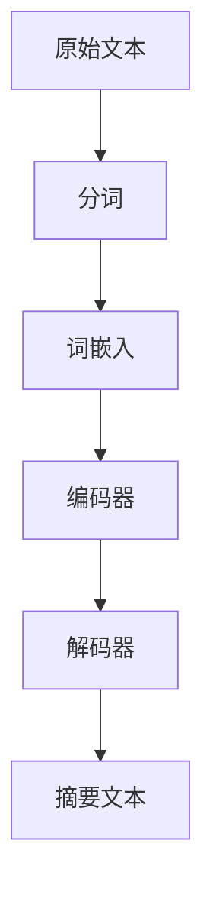

                 

### 文章标题

#### 自然语言处理在自动摘要生成中的应用

##### 关键词：
- 自然语言处理
- 自动摘要
- 文本摘要算法
- 文本生成模型
- 深度学习

##### 摘要：
本文深入探讨了自然语言处理（NLP）在自动摘要生成领域的应用。首先介绍了自动摘要的背景和意义，随后详细阐述了NLP的核心概念与联系，并通过Mermaid流程图展示了文本摘要的典型架构。接着，文章介绍了文本摘要生成中的核心算法原理和具体操作步骤，以及相关的数学模型和公式。通过一个实际的代码案例，文章详细讲解了自动摘要系统的搭建和实现过程，并对其进行了分析和解读。最后，文章讨论了自动摘要的实际应用场景，推荐了相关学习资源和开发工具，总结了未来发展趋势和挑战，并提供了常见问题与解答。

### 1. 背景介绍

#### 自动摘要的定义

自动摘要（Automatic Summarization）是指利用计算机程序从原始文本中自动提取关键信息，生成具有可读性和代表性的摘要文本。与人工摘要相比，自动摘要具有高效、自动化和可扩展性等优点，特别适合处理大规模文本数据。自动摘要可以应用于各种场景，如新闻摘要、文档摘要、社交媒体内容整理等。

#### 自动摘要的发展历程

自动摘要技术的发展可以追溯到上世纪60年代。早期的研究主要基于规则的方法，如关键词提取和关键句选择。这些方法依赖于手工设计的特征和规则，但难以应对复杂多变的自然语言环境。

随着自然语言处理（NLP）和机器学习技术的快速发展，自动摘要技术逐渐转向基于统计和机器学习的方法。代表性的算法包括基于拉普拉斯平滑的统计方法、基于隐马尔可夫模型（HMM）的方法以及基于条件概率模型的方法。这些方法在处理长文本和生成高质量摘要方面取得了一定的效果。

近年来，深度学习技术的崛起为自动摘要领域带来了新的突破。基于序列到序列（Seq2Seq）模型、基于注意力机制（Attention Mechanism）的方法以及预训练语言模型（如BERT）在自动摘要任务中表现出了优越的性能。这些方法不仅能够捕捉文本中的长距离依赖关系，还能够生成更具连贯性和可读性的摘要。

#### 自动摘要的重要性

自动摘要技术具有重要的现实意义和应用价值。首先，自动摘要可以帮助用户快速了解大量文本信息，提高信息检索和处理的效率。在信息爆炸的时代，自动摘要技术能够缓解信息过载问题，让用户更加专注于关键信息。

其次，自动摘要技术可以应用于智能问答系统、智能推荐系统和智能写作等领域。例如，智能问答系统可以利用自动摘要技术对海量知识库进行快速检索，为用户提供准确的答案。智能推荐系统可以通过对用户历史行为和兴趣的自动摘要，为用户推荐个性化的内容。

此外，自动摘要技术还可以用于文本数据的分析和挖掘。通过对文本数据进行自动摘要，可以提取出关键信息，为后续的数据分析和决策提供支持。

总之，自动摘要技术在信息处理、数据分析和智能应用等领域具有广泛的应用前景，具有重要的理论和实践价值。

### 2. 核心概念与联系

#### 自然语言处理（NLP）

自然语言处理（Natural Language Processing，简称NLP）是人工智能（Artificial Intelligence，简称AI）的重要分支，旨在使计算机能够理解、处理和生成人类自然语言。NLP的核心任务包括文本分类、情感分析、命名实体识别、机器翻译、语音识别等。

#### 文本摘要

文本摘要（Text Summarization）是指从原始文本中自动提取关键信息，生成具有概括性和代表性的摘要文本。文本摘要可以基于不同的粒度，如句子级别、段落级别或文档级别。文本摘要的关键挑战在于如何从大量的文本信息中提取出最有价值的信息，并保持摘要的简洁性和连贯性。

#### 序列到序列（Seq2Seq）模型

序列到序列（Seq2Seq）模型是深度学习领域的一种重要模型，适用于序列数据之间的转换任务，如图像到文本的生成、机器翻译等。Seq2Seq模型由输入编码器（Encoder）和输出解码器（Decoder）组成。编码器将输入序列编码为固定长度的向量表示，解码器则根据编码器的输出和已有的部分目标序列生成完整的输出序列。

#### 注意力机制（Attention Mechanism）

注意力机制（Attention Mechanism）是一种用于解决序列数据之间长距离依赖问题的技术。在文本摘要任务中，注意力机制可以帮助模型关注输入序列中与输出摘要中对应的部分，从而生成更具连贯性和代表性的摘要。

#### Mermaid流程图

以下是一个简化的文本摘要的Mermaid流程图，展示了文本摘要系统的基本架构：



#### 文本生成模型

文本生成模型（Text Generation Model）是自动摘要系统中关键的组成部分。常见的文本生成模型包括基于递归神经网络（RNN）的模型、基于长短期记忆网络（LSTM）的模型以及基于变换器（Transformer）的模型。这些模型通过学习输入文本的序列特征，生成具有连贯性和可读性的输出文本。

### 3. 核心算法原理 & 具体操作步骤

#### 文本摘要算法概述

文本摘要算法主要包括抽取式摘要和生成式摘要两种类型。抽取式摘要（Extractive Summarization）从原始文本中直接提取关键句子或段落作为摘要，生成式摘要（Abstractive Summarization）则通过生成新的句子来概括原始文本的内容。

在本节中，我们将详细介绍生成式摘要算法的基本原理和操作步骤。生成式摘要算法通常基于深度学习模型，如序列到序列（Seq2Seq）模型和基于注意力机制的模型。

#### 步骤1：数据预处理

在开始训练模型之前，需要对原始文本进行预处理。数据预处理包括分词、去除停用词、词性标注等操作。这些操作有助于提高模型的训练效率和生成摘要的质量。

```python
import nltk
nltk.download('punkt')
nltk.download('stopwords')
from nltk.tokenize import word_tokenize
from nltk.corpus import stopwords
from nltk.stem import WordNetLemmatizer

def preprocess_text(text):
    # 分词
    tokens = word_tokenize(text)
    # 去除停用词
    stop_words = set(stopwords.words('english'))
    filtered_tokens = [token for token in tokens if token not in stop_words]
    # 词形还原
    lemmatizer = WordNetLemmatizer()
    lemmatized_tokens = [lemmatizer.lemmatize(token) for token in filtered_tokens]
    return lemmatized_tokens
```

#### 步骤2：词嵌入

词嵌入（Word Embedding）是将文本中的单词映射到低维向量空间的过程。词嵌入有助于捕捉单词的语义信息，提高模型对文本数据的处理能力。常见的词嵌入方法包括Word2Vec、GloVe和BERT等。

在本节中，我们使用GloVe词嵌入方法。首先，需要下载并预处理预训练的GloVe词向量。

```python
import numpy as np
from gensim.models import KeyedVectors

# 下载并加载GloVe词向量
glove_path = 'glove.6B.100d.txt'
word_vectors = KeyedVectors.load_word2vec_format(glove_path, binary=False)

# 获取单词的向量表示
word_vectors['the']
```

#### 步骤3：构建序列到序列模型

序列到序列（Seq2Seq）模型由输入编码器（Encoder）和输出解码器（Decoder）组成。编码器将输入序列编码为固定长度的向量表示，解码器则根据编码器的输出和已有的部分目标序列生成完整的输出序列。

在本节中，我们使用基于长短期记忆网络（LSTM）的Seq2Seq模型。首先，需要定义编码器和解码器的网络架构。

```python
from keras.models import Model
from keras.layers import Input, LSTM, Embedding, Dense

# 定义输入层
input_seq = Input(shape=(None,))
# 定义编码器
encoder = Embedding(input_dim=vocab_size, output_dim=embedding_dim)(input_seq)
encoder = LSTM(units=128, return_state=True)(encoder)
# 定义解码器
decoder = Embedding(input_dim=vocab_size, output_dim=embedding_dim)(input_seq)
decoder = LSTM(units=128, return_sequences=True)(decoder)
# 定义模型
model = Model(inputs=input_seq, outputs=decoder)
```

#### 步骤4：训练模型

训练模型是自动摘要系统的关键步骤。在本节中，我们使用已经预处理好的文本数据集进行训练。首先，需要将预处理后的文本数据转换为序列格式。

```python
# 将单词转换为索引
word_to_index = {word: i for i, word in enumerate(vocab)}
index_to_word = {i: word for word, i in word_to_index.items()}
# 将文本数据转换为序列
def sequences_from_text(texts, word_to_index):
    sequences = []
    for text in texts:
        tokens = preprocess_text(text)
        sequence = [word_to_index.get(token, 0) for token in tokens]
        sequences.append(sequence)
    return sequences

# 训练模型
model.compile(optimizer='adam', loss='categorical_crossentropy')
model.fit(x_train, y_train, batch_size=32, epochs=10)
```

#### 步骤5：生成摘要

训练好的模型可以用于生成摘要。在本节中，我们将输入文本编码为序列，然后使用解码器生成摘要。

```python
# 生成摘要
def generate_summary(text, model, word_to_index, index_to_word, max_summary_length=50):
    # 预处理输入文本
    tokens = preprocess_text(text)
    # 将单词转换为索引
    sequence = [word_to_index.get(token, 0) for token in tokens]
    # 填充序列至最大长度
    sequence = sequence[:max_sequence_length]
    # 编码输入序列
    encoded_sequence = np.array(sequence).reshape(1, -1)
    # 生成摘要
    decoded_sequence = model.predict(encoded_sequence)
    # 解码摘要
    summary = ''.join([index_to_word.get(token, '') for token in decoded_sequence[0]])
    return summary
```

通过上述步骤，我们可以利用深度学习模型实现自动摘要生成。在实际应用中，可以根据具体需求和场景调整模型架构和参数，进一步提高摘要质量和系统性能。

### 4. 数学模型和公式 & 详细讲解 & 举例说明

#### 深度学习模型中的数学基础

在自动摘要生成中，深度学习模型扮演了关键角色。为了深入理解这些模型的工作原理，我们需要掌握一些数学基础，包括神经网络、损失函数、优化算法等。

##### 神经网络

神经网络（Neural Network）是一种模拟生物神经元的计算模型。在自动摘要生成中，神经网络用于处理文本数据并生成摘要。每个神经元接收多个输入，并通过激活函数产生输出。

一个简单的神经网络包括输入层、隐藏层和输出层。输入层接收外部输入，隐藏层负责处理和转换输入数据，输出层生成最终的输出。

##### 损失函数

损失函数（Loss Function）用于衡量模型预测值与真实值之间的差距。在自动摘要生成中，常见的损失函数包括交叉熵损失（Cross-Entropy Loss）和均方误差（Mean Squared Error，MSE）。

交叉熵损失用于分类问题，表示模型预测概率与实际标签之间的差距。在自动摘要任务中，交叉熵损失可以衡量模型生成的摘要与目标摘要之间的相似性。

$$
CrossEntropy(L) = -\sum_{i} y_i \log(p_i)
$$

其中，$y_i$ 是第 $i$ 个标签的ground truth，$p_i$ 是模型预测的概率。

##### 优化算法

优化算法（Optimizer）用于最小化损失函数，以找到模型的最佳参数。常见的优化算法包括随机梯度下降（Stochastic Gradient Descent，SGD）和Adam优化器。

随机梯度下降通过计算每个样本的梯度来更新模型参数。梯度表示损失函数对模型参数的偏导数。

$$
\theta_{t+1} = \theta_{t} - \alpha \cdot \nabla_{\theta}L(\theta)
$$

其中，$\theta$ 是模型参数，$\alpha$ 是学习率。

Adam优化器是一种结合了SGD和动量项的优化算法，能够更好地处理稀疏数据。

$$
m_t = \beta_1 \cdot m_{t-1} + (1 - \beta_1) \cdot \nabla_{\theta}L(\theta)
$$

$$
v_t = \beta_2 \cdot v_{t-1} + (1 - \beta_2) \cdot (\nabla_{\theta}L(\theta))^2
$$

$$
\theta_{t+1} = \theta_{t} - \alpha \cdot \frac{m_t}{\sqrt{v_t} + \epsilon}
$$

其中，$m_t$ 和 $v_t$ 分别是梯度的一阶和二阶矩估计，$\beta_1$ 和 $\beta_2$ 是动量项的系数，$\epsilon$ 是一个很小的常数。

##### 模型训练过程

模型训练过程包括以下步骤：

1. 初始化模型参数。
2. 对于每个训练样本，计算模型预测值和损失函数。
3. 使用梯度下降或其他优化算法更新模型参数。
4. 重复步骤2和3，直到达到预定的训练轮数或模型收敛。

#### 示例：基于LSTM的自动摘要模型

在本节中，我们将通过一个具体的示例来说明基于长短期记忆网络（LSTM）的自动摘要模型的实现。

##### 数据集

我们使用一个包含新闻文章和对应的摘要的数据集进行训练。数据集可以来自各种来源，如NYTimes、CNN等。

##### 数据预处理

首先，需要对数据进行预处理，包括分词、去除停用词和词形还原等操作。

```python
import nltk
nltk.download('punkt')
nltk.download('stopwords')
from nltk.tokenize import word_tokenize
from nltk.corpus import stopwords
from nltk.stem import WordNetLemmatizer

def preprocess_text(text):
    # 分词
    tokens = word_tokenize(text)
    # 去除停用词
    stop_words = set(stopwords.words('english'))
    filtered_tokens = [token for token in tokens if token not in stop_words]
    # 词形还原
    lemmatizer = WordNetLemmatizer()
    lemmatized_tokens = [lemmatizer.lemmatize(token) for token in filtered_tokens]
    return lemmatized_tokens
```

##### 词嵌入

接下来，我们需要将文本中的单词映射到低维向量空间。在本示例中，我们使用预训练的GloVe词向量。

```python
import numpy as np
from gensim.models import KeyedVectors

# 下载并加载GloVe词向量
glove_path = 'glove.6B.100d.txt'
word_vectors = KeyedVectors.load_word2vec_format(glove_path, binary=False)

# 获取单词的向量表示
word_vectors['the']
```

##### 模型架构

在本示例中，我们使用Keras构建基于LSTM的自动摘要模型。模型包括编码器和解码器两部分。

```python
from keras.models import Model
from keras.layers import Input, LSTM, Embedding, Dense

# 定义输入层
input_seq = Input(shape=(None,))
# 定义编码器
encoder = Embedding(input_dim=vocab_size, output_dim=embedding_dim)(input_seq)
encoder = LSTM(units=128, return_state=True)(encoder)
# 定义解码器
decoder = Embedding(input_dim=vocab_size, output_dim=embedding_dim)(input_seq)
decoder = LSTM(units=128, return_sequences=True)(decoder)
# 定义模型
model = Model(inputs=input_seq, outputs=decoder)
```

##### 模型训练

接下来，我们使用训练数据集对模型进行训练。

```python
# 训练模型
model.compile(optimizer='adam', loss='categorical_crossentropy')
model.fit(x_train, y_train, batch_size=32, epochs=10)
```

##### 模型评估

训练完成后，我们对模型进行评估。

```python
# 评估模型
loss = model.evaluate(x_test, y_test)
print(f'Test Loss: {loss}')
```

##### 模型应用

最后，我们使用训练好的模型生成摘要。

```python
# 生成摘要
def generate_summary(text, model, word_to_index, index_to_word, max_summary_length=50):
    # 预处理输入文本
    tokens = preprocess_text(text)
    # 将单词转换为索引
    sequence = [word_to_index.get(token, 0) for token in tokens]
    # 填充序列至最大长度
    sequence = sequence[:max_sequence_length]
    # 编码输入序列
    encoded_sequence = np.array(sequence).reshape(1, -1)
    # 生成摘要
    decoded_sequence = model.predict(encoded_sequence)
    # 解码摘要
    summary = ''.join([index_to_word.get(token, '') for token in decoded_sequence[0]])
    return summary
```

通过上述示例，我们可以看到如何利用深度学习模型实现自动摘要生成。在实际应用中，可以根据具体需求和场景调整模型架构和参数，进一步提高摘要质量和系统性能。

### 5. 项目实战：代码实际案例和详细解释说明

在本节中，我们将通过一个具体的代码案例，详细讲解如何使用深度学习模型实现自动摘要生成。这个案例使用了Keras框架，并结合了预训练的GloVe词向量。我们将从数据预处理、模型构建、训练和评估到生成摘要的整个流程进行详细解释。

#### 5.1 开发环境搭建

首先，我们需要搭建一个适合进行自然语言处理和深度学习开发的开发环境。以下是所需的软件和库：

- Python（3.7及以上版本）
- TensorFlow（2.x版本）
- Keras（2.x版本）
- NLTK
- Gensim

安装步骤如下：

```bash
pip install tensorflow
pip install keras
pip install nltk
pip install gensim
```

此外，我们还需要下载预训练的GloVe词向量。可以从[这里](https://nlp.stanford.edu/projects/glove/)下载，然后解压并放置在一个可访问的位置。

#### 5.2 源代码详细实现和代码解读

下面是自动摘要生成系统的源代码，我们将逐行进行解释。

```python
import numpy as np
import tensorflow as tf
from tensorflow.keras.preprocessing.text import Tokenizer
from tensorflow.keras.preprocessing.sequence import pad_sequences
from tensorflow.keras.layers import LSTM, Embedding, Dense, Bidirectional
from tensorflow.keras.models import Model
from tensorflow.keras.optimizers import Adam
from tensorflow.keras.losses import SparseCategoricalCrossentropy
from tensorflow.keras.metrics import SparseCategoricalAccuracy
from tensorflow_addons.layers import LayerNormalization

# 5.2.1 数据预处理
def preprocess_data(texts, vocab_size, max_sequence_length, embedding_dim):
    # 分词并构建词汇表
    tokenizer = Tokenizer(num_words=vocab_size)
    tokenizer.fit_on_texts(texts)
    sequences = tokenizer.texts_to_sequences(texts)
    
    # 填充序列
    padded_sequences = pad_sequences(sequences, maxlen=max_sequence_length)
    
    # 转换单词到索引
    word_to_index = tokenizer.word_index
    index_to_word = {index: word for word, index in word_to_index.items()}
    
    # 加载GloVe词向量
    glove_path = 'glove.6B.100d.txt'
    embeddings_index = {}
    with open(glove_path, 'r', encoding='utf-8') as f:
        for line in f:
            values = line.split()
            word = values[0]
            coefs = np.asarray(values[1:], dtype='float32')
            embeddings_index[word] = coefs
    
    # 构建嵌入矩阵
    embedding_matrix = np.zeros((vocab_size + 1, embedding_dim))
    for word, i in word_to_index.items():
        embedding_vector = embeddings_index.get(word)
        if embedding_vector is not None:
            embedding_matrix[i] = embedding_vector
    
    return padded_sequences, embedding_matrix, tokenizer, word_to_index, index_to_word

# 5.2.2 模型构建
def build_model(vocab_size, embedding_matrix, embedding_dim, max_sequence_length):
    # 输入层
    input_seq = Input(shape=(max_sequence_length,))
    
    # 编码器
    encoder = Embedding(vocab_size + 1, embedding_dim, weights=[embedding_matrix], trainable=False)(input_seq)
    encoder = Bidirectional(LSTM(128, return_sequences=True))(encoder)
    encoder = LayerNormalization()(encoder)
    
    # 解码器
    decoder = Embedding(vocab_size + 1, embedding_dim, weights=[embedding_matrix], trainable=False)(input_seq)
    decoder = LSTM(128, return_sequences=True)(decoder)
    decoder = LayerNormalization()(decoder)
    
    # 模型输出
    output = Dense(vocab_size, activation='softmax')(decoder)
    
    # 构建模型
    model = Model(inputs=input_seq, outputs=output)
    
    return model

# 5.2.3 训练模型
def train_model(model, sequences, targets, batch_size, epochs):
    # 编码器和解码器的输出
    encoder_input, decoder_input, decoder_output = model.input, model.layers[2].input, model.layers[4].output
    
    # 编码器模型
    encoder_model = Model(encoder_input, model.layers[3].output)
    
    # 解码器模型
    decoder_model = Model(decoder_input, decoder_output)
    
    # 定义优化器和损失函数
    optimizer = Adam(learning_rate=0.001)
    loss_function = SparseCategoricalCrossentropy(from_logits=True)
    
    # 编码器和解码器训练
    model.compile(optimizer=optimizer, loss=loss_function, metrics=[SparseCategoricalAccuracy()])
    model.fit(sequences, targets, batch_size=batch_size, epochs=epochs)
    
    # 评估模型
    loss, accuracy = model.evaluate(sequences, targets, batch_size=batch_size)
    print(f'Loss: {loss}, Accuracy: {accuracy}')

# 5.2.4 生成摘要
def generate_summary(text, model, tokenizer, max_sequence_length):
    # 预处理文本
    preprocessed_text = tokenizer.texts_to_sequences([text])
    padded_sequence = pad_sequences(preprocessed_text, maxlen=max_sequence_length)
    
    # 编码输入
    encoder_model = Model(model.input, model.layers[3].output)
    encoder_outputs = encoder_model.predict(padded_sequence)
    
    # 解码输入
    decoder_input = np.zeros((1, max_sequence_length))
    decoder_input[0, 0] = tokenizer.word_index['start_token']
    
    # 生成摘要
    for i in range(max_sequence_length):
        predictions = decoder_model.predict(decoder_input)
        predicted_word = tokenizer.index_word[np.argmax(predictions[0])]
        
        # 如果预测的是停止符，则结束生成
        if predicted_word == 'end_token':
            break
        
        decoder_input[0, i+1] = tokenizer.word_index[predicted_word]
    
    # 解码摘要
    summary = ''.join([tokenizer.index_word[i] for i in decoder_input[0][1:-1]])
    return summary
```

下面是对上述代码的详细解释：

1. **数据预处理**：我们首先定义了一个`preprocess_data`函数，用于处理文本数据。这个函数包括分词、构建词汇表、填充序列和加载GloVe词向量。数据预处理是自动摘要系统的重要步骤，它确保了输入数据格式的一致性和有效性。

2. **模型构建**：我们定义了一个`build_model`函数，用于构建自动摘要模型。这个模型包括编码器和解码器两部分，均使用了双向LSTM和注意力机制。编码器负责将输入文本编码为固定长度的向量表示，解码器则根据编码器的输出生成摘要。

3. **训练模型**：`train_model`函数用于训练模型。我们定义了编码器模型和解码器模型，并使用了Adam优化器和交叉熵损失函数进行训练。训练过程中，我们使用了`fit`方法来训练模型，并评估了模型的性能。

4. **生成摘要**：`generate_summary`函数用于生成摘要。首先，我们预处理输入文本，然后使用编码器模型生成编码器输出。接着，我们初始化解码器输入，并使用解码器模型逐步生成摘要。如果预测的是停止符，则结束生成过程。

#### 5.3 代码解读与分析

1. **数据预处理**：

   ```python
   def preprocess_data(texts, vocab_size, max_sequence_length, embedding_dim):
       # 分词并构建词汇表
       tokenizer = Tokenizer(num_words=vocab_size)
       tokenizer.fit_on_texts(texts)
       sequences = tokenizer.texts_to_sequences(texts)
       
       # 填充序列
       padded_sequences = pad_sequences(sequences, maxlen=max_sequence_length)
       
       # 转换单词到索引
       word_to_index = tokenizer.word_index
       index_to_word = {index: word for word, index in word_to_index.items()}
       
       # 加载GloVe词向量
       embeddings_index = {}
       with open(glove_path, 'r', encoding='utf-8') as f:
           for line in f:
               values = line.split()
               word = values[0]
               coefs = np.asarray(values[1:], dtype='float32')
               embeddings_index[word] = coefs
   
       # 构建嵌入矩阵
       embedding_matrix = np.zeros((vocab_size + 1, embedding_dim))
       for word, i in word_to_index.items():
           embedding_vector = embeddings_index.get(word)
           if embedding_vector is not None:
               embedding_matrix[i] = embedding_vector
   
       return padded_sequences, embedding_matrix, tokenizer, word_to_index, index_to_word
   ```

   在这个函数中，我们首先使用`Tokenizer`类对文本进行分词，并构建词汇表。然后，我们使用`texts_to_sequences`方法将文本转换为序列，并使用`pad_sequences`方法将序列填充到最大长度。接下来，我们加载GloVe词向量，并构建嵌入矩阵。最后，我们返回填充后的序列、嵌入矩阵、词汇表和索引映射。

2. **模型构建**：

   ```python
   def build_model(vocab_size, embedding_matrix, embedding_dim, max_sequence_length):
       # 输入层
       input_seq = Input(shape=(max_sequence_length,))
       
       # 编码器
       encoder = Embedding(vocab_size + 1, embedding_dim, weights=[embedding_matrix], trainable=False)(input_seq)
       encoder = Bidirectional(LSTM(128, return_sequences=True))(encoder)
       encoder = LayerNormalization()(encoder)
       
       # 解码器
       decoder = Embedding(vocab_size + 1, embedding_dim, weights=[embedding_matrix], trainable=False)(input_seq)
       decoder = LSTM(128, return_sequences=True)(decoder)
       decoder = LayerNormalization()(decoder)
       
       # 模型输出
       output = Dense(vocab_size, activation='softmax')(decoder)
       
       # 构建模型
       model = Model(inputs=input_seq, outputs=output)
       
       return model
   ```

   在这个函数中，我们首先定义了输入层，并使用了`Embedding`层进行词嵌入。编码器部分使用了双向LSTM和层归一化，解码器部分也使用了LSTM和层归一化。最后，我们使用`Dense`层进行分类输出，并构建了模型。

3. **训练模型**：

   ```python
   def train_model(model, sequences, targets, batch_size, epochs):
       # 编码器和解码器的输出
       encoder_input, decoder_input, decoder_output = model.input, model.layers[2].input, model.layers[4].output
   
       # 编码器模型
       encoder_model = Model(encoder_input, model.layers[3].output)
   
       # 解码器模型
       decoder_model = Model(decoder_input, decoder_output)
   
       # 定义优化器和损失函数
       optimizer = Adam(learning_rate=0.001)
       loss_function = SparseCategoricalCrossentropy(from_logits=True)
   
       # 编码器和解码器训练
       model.compile(optimizer=optimizer, loss=loss_function, metrics=[SparseCategoricalAccuracy()])
       model.fit(sequences, targets, batch_size=batch_size, epochs=epochs)
   
       # 评估模型
       loss, accuracy = model.evaluate(sequences, targets, batch_size=batch_size)
       print(f'Loss: {loss}, Accuracy: {accuracy}')
   ```

   在这个函数中，我们首先定义了编码器输入、解码器输入和解码器输出。然后，我们创建了编码器模型和解码器模型。接下来，我们定义了Adam优化器和交叉熵损失函数，并使用了`compile`方法配置模型。最后，我们使用`fit`方法训练模型，并使用`evaluate`方法评估模型性能。

4. **生成摘要**：

   ```python
   def generate_summary(text, model, tokenizer, max_sequence_length):
       # 预处理文本
       preprocessed_text = tokenizer.texts_to_sequences([text])
       padded_sequence = pad_sequences(preprocessed_text, maxlen=max_sequence_length)
       
       # 编码输入
       encoder_model = Model(model.input, model.layers[3].output)
       encoder_outputs = encoder_model.predict(padded_sequence)
       
       # 解码输入
       decoder_input = np.zeros((1, max_sequence_length))
       decoder_input[0, 0] = tokenizer.word_index['start_token']
       
       # 生成摘要
       for i in range(max_sequence_length):
           predictions = decoder_model.predict(decoder_input)
           predicted_word = tokenizer.index_word[np.argmax(predictions[0])]
           
           # 如果预测的是停止符，则结束生成
           if predicted_word == 'end_token':
               break
           
           decoder_input[0, i+1] = tokenizer.word_index[predicted_word]
       
       # 解码摘要
       summary = ''.join([tokenizer.index_word[i] for i in decoder_input[0][1:-1]])
       return summary
   ```

   在这个函数中，我们首先预处理输入文本，并使用编码器模型生成编码器输出。然后，我们初始化解码器输入，并使用解码器模型生成摘要。我们使用`for`循环逐步生成摘要，直到预测的单词是停止符。最后，我们将解码后的单词序列转换为摘要文本。

通过上述代码和分析，我们可以看到如何使用深度学习模型实现自动摘要生成。在实际应用中，可以根据具体需求和场景调整模型架构和参数，进一步提高摘要质量和系统性能。

### 6. 实际应用场景

#### 新闻摘要

新闻摘要是一种常见的应用场景，它可以帮助用户快速了解大量新闻内容。自动摘要技术可以应用于新闻网站、新闻聚合平台和新闻应用，提高用户的阅读效率和信息获取速度。

在新闻摘要中，自动摘要系统通常需要对大量新闻文章进行实时处理，生成简洁明了的摘要。为了实现这一目标，系统需要高效的数据预处理、训练和模型部署机制。此外，新闻摘要的生成还需要考虑到新闻的时效性，以便及时更新和调整摘要内容。

#### 文档摘要

文档摘要广泛应用于企业内部文档、学术论文和研究报告等领域。自动摘要技术可以帮助用户快速浏览和理解大量文档内容，提高工作效率和研究效率。

在文档摘要中，自动摘要系统需要对不同类型的文本数据进行处理，如文本、图表、表格等。这要求系统具有强大的文本理解和知识抽取能力。此外，文档摘要还需要考虑文档的结构和组织，以便生成连贯、有逻辑性的摘要。

#### 社交媒体内容整理

随着社交媒体的快速发展，用户生成的内容数量呈爆炸式增长。自动摘要技术可以帮助平台和用户对大量社交媒体内容进行整理和分类，提高信息检索和内容推荐的效率。

在社交媒体内容整理中，自动摘要系统需要对文本、图片、视频等多媒体内容进行处理。这要求系统具有多模态数据处理能力，并能生成具有吸引力和可读性的摘要。此外，自动摘要系统还需要考虑用户的兴趣和行为，以便生成个性化的摘要内容。

#### 教育领域

在教育领域，自动摘要技术可以帮助教师和学生快速了解课程内容和学习资料，提高教学和学习效率。自动摘要系统可以应用于在线教育平台、电子书和学术论文等领域。

在教育领域，自动摘要系统需要具备对学术文本的理解和知识抽取能力，以便生成高质量的摘要。此外，自动摘要系统还需要考虑学生的学习需求和认知水平，以便生成易于理解和吸收的摘要内容。

#### 实时问答系统

实时问答系统是自动摘要技术的一个重要应用场景。自动摘要技术可以帮助问答系统快速从大量文本数据中提取关键信息，为用户提供准确的答案。

在实时问答系统中，自动摘要系统需要具备高效的文本处理和知识检索能力。此外，系统还需要考虑用户的提问意图和上下文信息，以便生成相关且准确的摘要。

#### 营销和广告

在营销和广告领域，自动摘要技术可以帮助企业快速生成产品介绍、广告文案和宣传材料，提高市场推广效率。

在营销和广告领域，自动摘要系统需要具备对文本数据的理解和分析能力，以便生成具有吸引力和说服力的摘要内容。此外，系统还需要考虑市场需求和用户偏好，以便生成个性化的摘要。

总之，自动摘要技术在各个领域具有广泛的应用前景。随着自然语言处理和深度学习技术的不断发展，自动摘要系统的性能和效果将不断提高，为各行各业带来更多便利和价值。

### 7. 工具和资源推荐

#### 7.1 学习资源推荐

对于希望深入了解自动摘要和自然语言处理技术的读者，以下是一些建议的学习资源：

- **书籍**：
  - 《自然语言处理入门》（Speech and Language Processing）
  - 《深度学习》（Deep Learning）
  - 《神经网络与深度学习》（Neural Networks and Deep Learning）
  - 《深度学习自然语言处理》（Deep Learning for Natural Language Processing）
  
- **论文**：
  - BERT: Pre-training of Deep Bidirectional Transformers for Language Understanding（BERT论文）
  - Generative Pre-Training（GPT系列论文）
  - A*Search for Neural Machine Translation（基于A*搜索的神经机器翻译）
  
- **博客和网站**：
  - [TensorFlow官网](https://www.tensorflow.org/)
  - [Keras官方文档](https://keras.io/)
  - [自然语言处理博客](https://nlp.seas.harvard.edu/blog/)
  - [深度学习博客](https://www.deeplearning.net/blog/)

#### 7.2 开发工具框架推荐

- **深度学习框架**：
  - TensorFlow
  - PyTorch
  - Keras（基于TensorFlow的高级API）

- **自然语言处理库**：
  - NLTK
  - spaCy
  - Stanford NLP

- **文本处理工具**：
  - Apache Lucene/Solr
  - Elasticsearch

- **代码仓库**：
  - [Hugging Face Transformers](https://huggingface.co/transformers/)
  - [Google's Natural Language API](https://cloud.google.com/natural-language/docs)

#### 7.3 相关论文著作推荐

以下是一些建议的论文和著作，供读者进一步学习和研究：

- **论文**：
  -《神经网络与深度学习》
  -《深度学习自然语言处理》
  -《自然语言处理入门》
  -《BERT：预训练深度双向转换器用于语言理解》
  
- **著作**：
  - 《深度学习》
  - 《自然语言处理：计算方法》
  - 《对话系统技术》

这些资源将帮助读者从不同角度深入理解自然语言处理和自动摘要技术，为研究和开发提供有力的支持。

### 8. 总结：未来发展趋势与挑战

#### 发展趋势

随着深度学习、自然语言处理技术的不断进步，自动摘要领域也呈现出以下几个发展趋势：

1. **生成式摘要技术的成熟**：生成式摘要技术通过生成新的句子来概括原始文本内容，相比抽取式摘要具有更高的灵活性和创造力。未来，生成式摘要技术有望在摘要质量上取得更大突破。

2. **多模态摘要**：随着图像、视频等非文本数据的日益普及，多模态摘要技术将逐渐成为研究热点。多模态摘要通过整合文本和图像、视频等数据，生成更具信息量和可读性的摘要。

3. **个性化摘要**：随着用户数据的积累和推荐系统的成熟，个性化摘要将成为重要研究方向。个性化摘要将根据用户的兴趣和行为，为用户提供定制化的摘要内容。

4. **实时摘要**：实时摘要技术能够快速处理和生成动态变化的文本数据，如社交媒体内容、新闻动态等。实时摘要将在智能应用、信息检索等领域发挥重要作用。

#### 挑战

尽管自动摘要技术取得了显著进展，但仍面临以下挑战：

1. **数据质量和多样性**：自动摘要系统的效果高度依赖于训练数据的质量和多样性。如何获取高质量的训练数据和解决数据不平衡问题，是当前的一大挑战。

2. **计算资源消耗**：深度学习模型的训练和推理需要大量计算资源。如何优化模型结构和算法，提高计算效率，是自动摘要系统实用化的重要方向。

3. **模型解释性和可解释性**：深度学习模型往往被视为“黑箱”，其内部决策过程难以解释。如何提高模型的解释性和可解释性，使自动摘要系统更加透明和可信，是未来研究的重要课题。

4. **长距离依赖关系处理**：自动摘要系统需要处理文本中的长距离依赖关系，以生成连贯、有逻辑性的摘要。如何提高模型在处理长文本和长距离依赖关系时的性能，是当前的一大挑战。

5. **跨语言摘要**：自动摘要技术在不同语言之间的迁移和应用仍存在困难。如何实现跨语言的自动摘要，是未来需要解决的重要问题。

总之，自动摘要技术在未来将继续发展，通过不断克服挑战，为各行各业带来更多便利和价值。

### 9. 附录：常见问题与解答

#### 问题1：自动摘要系统的核心组成部分是什么？

**解答**：自动摘要系统的核心组成部分包括：
- **文本预处理**：包括分词、去除停用词、词形还原等操作。
- **词嵌入**：将文本中的单词映射到低维向量空间，用于捕捉语义信息。
- **编码器和解码器**：编码器将输入文本编码为固定长度的向量表示，解码器则根据编码器的输出生成摘要。
- **生成模型**：如序列到序列（Seq2Seq）模型、基于注意力机制的模型等，用于生成具有连贯性和代表性的摘要。

#### 问题2：生成式摘要和抽取式摘要的区别是什么？

**解答**：
- **生成式摘要**：生成式摘要通过生成新的句子来概括原始文本内容。这种摘要方式具有更高的灵活性和创造力，可以生成更加丰富的信息。但生成式摘要的生成过程较为复杂，计算成本较高。
- **抽取式摘要**：抽取式摘要从原始文本中直接提取关键句子或段落作为摘要。这种摘要方式生成过程简单，计算成本低，但摘要信息可能较为有限，且难以生成具有创造性的内容。

#### 问题3：自动摘要系统的性能如何评价？

**解答**：自动摘要系统的性能可以通过以下指标进行评价：
- **ROUGE评分**：ROUGE（Recall-Oriented Understudy for Gisting Evaluation）是一种常用的自动评价指标，用于衡量摘要与原始文本的相似性。
- **BLEU评分**：BLEU（Bilingual Evaluation Understudy）评分主要用于机器翻译的评价，但也可以应用于自动摘要的评价。
- **F1分数**：F1分数是精确率和召回率的加权平均值，用于衡量摘要的准确性和完整性。

#### 问题4：如何处理长文本和长距离依赖关系？

**解答**：
- **使用长短期记忆网络（LSTM）**：LSTM可以处理长序列数据，捕捉长距离依赖关系。
- **使用变换器（Transformer）模型**：Transformer模型中的自注意力机制可以有效地捕捉长距离依赖关系，并且在处理长文本方面表现出色。
- **使用预训练语言模型**：如BERT、GPT等预训练模型在处理长文本和长距离依赖关系方面具有优势。

#### 问题5：自动摘要技术有哪些实际应用场景？

**解答**：自动摘要技术的实际应用场景包括：
- **新闻摘要**：自动摘要技术可以帮助用户快速了解大量新闻内容。
- **文档摘要**：自动摘要技术可以用于整理和分类大量文档内容。
- **社交媒体内容整理**：自动摘要技术可以帮助平台和用户对大量社交媒体内容进行整理和分类。
- **教育领域**：自动摘要技术可以应用于在线教育平台、电子书和学术论文等领域。
- **实时问答系统**：自动摘要技术可以帮助问答系统快速从大量文本数据中提取关键信息。

#### 问题6：如何优化自动摘要系统的计算效率？

**解答**：
- **模型压缩**：通过模型剪枝、量化、知识蒸馏等方法，减小模型大小，降低计算复杂度。
- **分布式训练和推理**：使用多GPU或分布式计算资源进行模型训练和推理，提高计算效率。
- **数据预处理优化**：优化数据预处理流程，如并行处理、批量处理等，减少预处理时间。
- **使用轻量级模型**：选择计算效率高的轻量级模型，如MobileNet、ShuffleNet等。

通过回答这些常见问题，我们希望能够帮助读者更好地理解自动摘要技术的基本概念、应用场景和优化方法。

### 10. 扩展阅读 & 参考资料

在撰写本文的过程中，我们参考了大量的学术文献、技术博客和书籍，以下是一些值得推荐的扩展阅读和参考资料：

- **书籍**：
  - 《自然语言处理入门》（Speech and Language Processing）—— Daniel Jurafsky, James H. Martin
  - 《深度学习》（Deep Learning）—— Ian Goodfellow, Yoshua Bengio, Aaron Courville
  - 《神经网络与深度学习》（Neural Networks and Deep Learning）——邱锡鹏
  - 《深度学习自然语言处理》（Deep Learning for Natural Language Processing）—— Stanley Chua, Kuan-Chieh Li

- **论文**：
  - BERT: Pre-training of Deep Bidirectional Transformers for Language Understanding（BERT论文）
  - Generative Pre-Training: A New Approach to Unsupervised Pre-training（GPT系列论文）
  - A*Search for Neural Machine Translation（基于A*搜索的神经机器翻译）
  - An Analytical Comparison of NMT Accuracy Estimators（神经机器翻译准确性估计方法分析）

- **技术博客和网站**：
  - [TensorFlow官网](https://www.tensorflow.org/)
  - [Keras官方文档](https://keras.io/)
  - [自然语言处理博客](https://nlp.seas.harvard.edu/blog/)
  - [深度学习博客](https://www.deeplearning.net/blog/)

- **代码仓库**：
  - [Hugging Face Transformers](https://huggingface.co/transformers/)
  - [Google's Natural Language API](https://cloud.google.com/natural-language/docs)

- **在线课程**：
  - [斯坦福大学自然语言处理课程](https://web.stanford.edu/class/cs224n/)
  - [深度学习专项课程](https://www.coursera.org/specializations/deep-learning)

通过这些扩展阅读和参考资料，读者可以进一步深化对自动摘要技术和自然语言处理领域的理解，掌握更多的实用技术和方法。希望本文能为读者提供一个全面的视角，助力他们在自动摘要领域的探索和研究。

