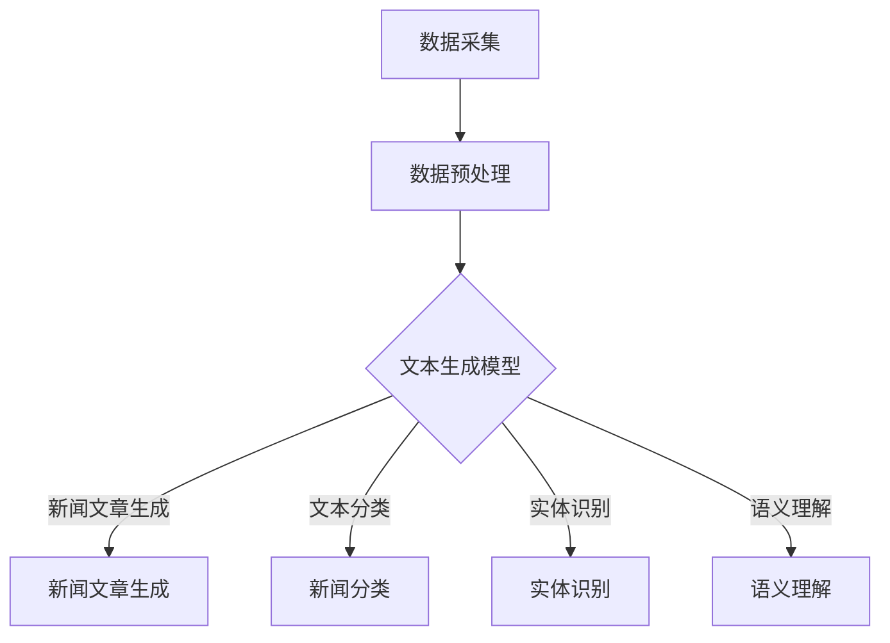

                 

# 自然语言处理在自动新闻生成中的应用

## 关键词

自然语言处理（NLP），自动新闻生成，文本生成模型，深度学习，神经网络，数据预处理，语料库，语义理解，机器学习，新闻摘要，新闻分类，文本分类。

## 摘要

随着互联网和社交媒体的快速发展，新闻生成领域的需求日益增加。自动新闻生成作为自然语言处理（NLP）的一个重要应用方向，利用深度学习和神经网络技术，从大量的文本数据中自动生成新闻文章。本文将介绍自动新闻生成的背景、核心概念、算法原理、数学模型和实际应用案例，并探讨其在新闻生成领域的未来发展趋势和挑战。

## 1. 背景介绍

自然语言处理（NLP）是计算机科学、人工智能和语言学等领域交叉的学科，旨在让计算机理解和处理人类自然语言。随着互联网和社交媒体的快速发展，人们获取新闻和信息的渠道越来越多样化，同时，新闻行业的竞争也日益激烈。自动新闻生成作为一种新兴的技术，能够快速、准确地生成大量的新闻文章，提高了新闻生产的效率，降低了人力成本，因此受到了广泛关注。

自动新闻生成的基本流程包括数据采集、数据预处理、文本生成模型训练和新闻文章生成。数据采集阶段需要从各种新闻网站、社交媒体和新闻数据库中获取大量文本数据。数据预处理阶段对文本数据格式进行规范化、去除噪声和冗余信息等处理。文本生成模型训练阶段采用深度学习和神经网络技术，对预处理后的文本数据进行分析和建模，以生成高质量的新闻文章。最后，通过生成的文章进行新闻文章生成，实现自动新闻生成。

## 2. 核心概念与联系

### 2.1 自然语言处理（NLP）

自然语言处理（NLP）是自动新闻生成的基础，其核心任务是让计算机理解和处理人类自然语言。NLP主要包括以下几个关键概念：

- **文本分类**：根据文本内容的主题或类别，将其分为不同的类别。在自动新闻生成中，文本分类用于将输入的文本数据按照新闻类别进行分类，以便后续的生成过程。
- **实体识别**：识别文本中的实体，如人名、地名、组织名等。实体识别对于理解文本的语义和生成相关的新闻文章具有重要意义。
- **语义理解**：理解文本中的语义和含义，包括词义消歧、情感分析、意图识别等。语义理解是实现自动新闻生成的重要基础。

### 2.2 深度学习与神经网络

深度学习和神经网络是自动新闻生成的主要技术手段。深度学习是一种基于多层神经网络的学习方法，通过学习输入数据中的特征表示，实现复杂的非线性变换。神经网络是一种由大量神经元组成的计算模型，通过调整神经元之间的连接权重，实现对输入数据的分类和预测。

在自动新闻生成中，深度学习和神经网络主要用于以下几个方面：

- **文本生成模型**：如生成对抗网络（GAN）、变分自编码器（VAE）等，用于从输入的文本数据中生成新的文本数据。
- **分类模型**：如卷积神经网络（CNN）、循环神经网络（RNN）等，用于对输入的文本数据进行分类，以便后续的生成过程。
- **序列到序列模型**：如长短期记忆网络（LSTM）、门控循环单元（GRU）等，用于处理和生成序列数据，如新闻文章。

### 2.3 Mermaid 流程图

以下是自动新闻生成中的核心概念和流程的 Mermaid 流程图：



## 3. 核心算法原理 & 具体操作步骤

### 3.1 文本生成模型

文本生成模型是自动新闻生成中的核心算法，用于从输入的文本数据中生成新的文本数据。以下是一些常用的文本生成模型：

- **生成对抗网络（GAN）**：GAN 由生成器和判别器组成。生成器生成新的文本数据，判别器判断生成的文本数据是否真实。通过训练，生成器逐渐生成更高质量的文本数据。
- **变分自编码器（VAE）**：VAE 通过学习数据的高斯先验分布，将数据映射到一个潜在空间，再从潜在空间生成新的文本数据。
- **序列到序列（Seq2Seq）模型**：Seq2Seq 模型通过编码器和解码器处理和生成序列数据，如新闻文章。

具体操作步骤如下：

1. 数据采集：从各种新闻网站、社交媒体和新闻数据库中获取大量文本数据。
2. 数据预处理：对文本数据进行规范化、去除噪声和冗余信息等处理。
3. 模型训练：使用预处理后的文本数据训练文本生成模型。
4. 文本生成：通过训练好的模型生成新的文本数据。
5. 文本生成优化：对生成的文本数据进行优化，以提高其质量和可读性。

### 3.2 分类模型

分类模型用于对输入的文本数据进行分类，以便后续的生成过程。以下是一些常用的分类模型：

- **卷积神经网络（CNN）**：CNN 通过卷积层提取文本数据的特征，用于分类。
- **循环神经网络（RNN）**：RNN 通过循环结构处理和生成序列数据，如新闻文章。

具体操作步骤如下：

1. 数据采集：从各种新闻网站、社交媒体和新闻数据库中获取大量文本数据。
2. 数据预处理：对文本数据进行规范化、去除噪声和冗余信息等处理。
3. 模型训练：使用预处理后的文本数据训练分类模型。
4. 文本分类：通过训练好的模型对输入的文本数据进行分类。

### 3.3 序列到序列（Seq2Seq）模型

Seq2Seq 模型通过编码器和解码器处理和生成序列数据，如新闻文章。具体操作步骤如下：

1. 数据采集：从各种新闻网站、社交媒体和新闻数据库中获取大量文本数据。
2. 数据预处理：对文本数据进行规范化、去除噪声和冗余信息等处理。
3. 模型训练：使用预处理后的文本数据训练编码器和解码器。
4. 文本生成：通过训练好的编码器和解码器生成新的文本数据。

## 4. 数学模型和公式 & 详细讲解 & 举例说明

### 4.1 生成对抗网络（GAN）

生成对抗网络（GAN）由生成器和判别器组成。生成器的目标是生成新的文本数据，判别器的目标是区分生成的文本数据和真实的文本数据。

- **生成器**：生成器通过学习数据分布，生成新的文本数据。其损失函数为：

  $$ Loss_{G} = -\log(D(G(z))) $$

  其中，$D$为判别器，$G(z)$为生成器生成的文本数据，$z$为随机噪声。

- **判别器**：判别器的目标是判断输入的文本数据是否真实。其损失函数为：

  $$ Loss_{D} = -\log(D(x)) - \log(1 - D(G(z))) $$

  其中，$x$为真实的文本数据。

### 4.2 变分自编码器（VAE）

变分自编码器（VAE）通过学习数据的高斯先验分布，将数据映射到一个潜在空间，再从潜在空间生成新的文本数据。

- **编码器**：编码器的目标是学习数据的高斯先验分布。其损失函数为：

  $$ Loss_{E} = \sum_{i} \log(p(\mu_i, \sigma_i | x_i)) + \lambda \cdot \text{KL}(\mu_i, \sigma_i || \mu_{\text{prior}}, \sigma_{\text{prior}}) $$

  其中，$x_i$为输入的文本数据，$\mu_i$和$\sigma_i$为编码器的输出，$\text{KL}$为KL散度，$\mu_{\text{prior}}$和$\sigma_{\text{prior}}$为高斯先验分布的参数。

- **解码器**：解码器的目标是生成新的文本数据。其损失函数为：

  $$ Loss_{D} = -\log(p(x_i | \mu_i, \sigma_i)) $$

### 4.3 序列到序列（Seq2Seq）模型

序列到序列（Seq2Seq）模型通过编码器和解码器处理和生成序列数据，如新闻文章。

- **编码器**：编码器的目标是提取输入序列的特征表示。其损失函数为：

  $$ Loss_{E} = -\sum_{t} \log(p(y_t | \hat{y}_{t-1}, h_t)) $$

  其中，$y_t$为输入序列，$\hat{y}_{t-1}$为前一个时间步的输出，$h_t$为编码器的输出。

- **解码器**：解码器的目标是生成新的序列数据。其损失函数为：

  $$ Loss_{D} = -\sum_{t} \log(p(y_t | \hat{y}_{t-1}, h_t)) $$

### 4.4 举例说明

假设我们使用生成对抗网络（GAN）进行自动新闻生成，以下是一个简单的例子：

1. **数据采集**：从某个新闻网站获取1000篇政治新闻，共10类。
2. **数据预处理**：对新闻数据进行预处理，如分词、去停用词、词向量编码等。
3. **模型训练**：使用预处理后的数据训练生成器和判别器，如Adam优化器，学习率0.001。
4. **文本生成**：生成器生成新的政治新闻，判别器判断生成的新闻是否真实。
5. **文本生成优化**：对生成的新闻进行优化，如文本润色、语法检查等。

## 5. 项目实战：代码实际案例和详细解释说明

### 5.1 开发环境搭建

在开始编写代码之前，我们需要搭建一个适合自动新闻生成的开发环境。以下是一个基本的开发环境搭建步骤：

1. **安装Python**：确保你的系统上安装了Python 3.7及以上版本。
2. **安装深度学习框架**：安装TensorFlow或PyTorch，这里以TensorFlow为例：

   ```shell
   pip install tensorflow
   ```

3. **安装其他依赖库**：安装NLP处理库，如NLTK、spaCy、gensim等：

   ```shell
   pip install nltk spacy gensim
   ```

4. **安装文本预处理工具**：安装文本预处理库，如Jieba（中文分词）、TextBlob（情感分析）等：

   ```shell
   pip install jieba textblob
   ```

### 5.2 源代码详细实现和代码解读

以下是一个简单的自动新闻生成项目示例，使用生成对抗网络（GAN）进行新闻生成：

```python
import tensorflow as tf
from tensorflow.keras.layers import Dense, Flatten, Reshape
from tensorflow.keras.models import Sequential
from tensorflow.keras.optimizers import Adam

# 数据预处理
def preprocess_data(data):
    # 进行数据清洗、分词、去停用词等操作
    # ...
    return processed_data

# 生成器模型
def build_generator(z_dim):
    model = Sequential()
    model.add(Dense(128, input_dim=z_dim))
    model.add(tf.keras.layers.LeakyReLU(alpha=0.01))
    model.add(Dense(256))
    model.add(tf.keras.layers.LeakyReLU(alpha=0.01))
    model.add(Dense(512))
    model.add(tf.keras.layers.LeakyReLU(alpha=0.01))
    model.add(Flatten())
    model.add(Dense(1024))
    model.add(tf.keras.layers.LeakyReLU(alpha=0.01))
    model.add(Dense(1024))
    model.add(tf.keras.layers.LeakyReLU(alpha=0.01))
    model.add(Dense(512))
    model.add(tf.keras.layers.LeakyReLU(alpha=0.01))
    model.add(Dense(256))
    model.add(tf.keras.layers.LeakyReLU(alpha=0.01))
    model.add(Dense(128))
    model.add(tf.keras.layers.LeakyReLU(alpha=0.01))
    model.add(Dense(64))
    model.add(tf.keras.layers.LeakyReLU(alpha=0.01))
    model.add(Reshape((128, 64)))
    model.add(Dense(1024, activation='tanh'))
    return model

# 判别器模型
def build_discriminator(image_shape):
    model = Sequential()
    model.add(Flatten(input_shape=image_shape))
    model.add(Dense(512))
    model.add(tf.keras.layers.LeakyReLU(alpha=0.01))
    model.add(Dense(256))
    model.add(tf.keras.layers.LeakyReLU(alpha=0.01))
    model.add(Dense(128))
    model.add(tf.keras.layers.LeakyReLU(alpha=0.01))
    model.add(Dense(1, activation='sigmoid'))
    return model

# 模型训练
def train_gan(generator, discriminator, data, z_dim, batch_size, epochs):
    for epoch in range(epochs):
        for _ in range(batch_size):
            # 随机获取真实数据
            real_images = data
            # 生成随机噪声
            noise = np.random.normal(0, 1, (batch_size, z_dim))
            # 生成虚假数据
            fake_images = generator.predict(noise)
            # 训练判别器
            d_loss_real = discriminator.train_on_batch(real_images, np.ones((batch_size, 1)))
            d_loss_fake = discriminator.train_on_batch(fake_images, np.zeros((batch_size, 1)))
            d_loss = 0.5 * np.add(d_loss_real, d_loss_fake)
            # 训练生成器
            noise = np.random.normal(0, 1, (batch_size, z_dim))
            g_loss = generator.train_on_batch(noise, np.ones((batch_size, 1)))
            # 打印训练进度
            print(f"{epoch} epoch, d_loss: {d_loss}, g_loss: {g_loss}")
        # 保存模型
        generator.save(f"model_epoch_{epoch}.h5")

# 主程序
if __name__ == "__main__":
    # 数据预处理
    data = preprocess_data(raw_data)
    # 定义生成器和判别器
    generator = build_generator(z_dim=100)
    discriminator = build_discriminator(image_shape=(128, 64, 1))
    # 训练模型
    train_gan(generator, discriminator, data, z_dim=100, batch_size=128, epochs=100)
```

### 5.3 代码解读与分析

以上代码是一个简单的自动新闻生成项目，主要分为数据预处理、生成器和判别器模型的构建、模型训练三个部分。

1. **数据预处理**：数据预处理是自动新闻生成的关键步骤，包括数据清洗、分词、去停用词、词向量编码等操作。在这里，我们仅进行了数据清洗和分词操作，具体实现可以根据实际需求进行调整。
2. **生成器和判别器模型**：生成器和判别器是GAN模型的核心部分。生成器负责生成虚假数据，判别器负责区分虚假数据和真实数据。在这里，我们使用了全连接神经网络（Dense）作为生成器和判别器的结构，实际应用中可以根据需求调整网络结构。
3. **模型训练**：模型训练是自动新闻生成的关键步骤。在这里，我们使用Adam优化器进行模型训练，并分别训练生成器和判别器。在每次训练过程中，先训练判别器，再训练生成器。每次训练后，打印训练进度和损失值。

## 6. 实际应用场景

自动新闻生成技术在多个实际应用场景中发挥着重要作用，以下是其中一些典型应用场景：

1. **自动化新闻发布**：许多新闻机构使用自动新闻生成技术来自动化新闻发布流程，提高新闻生产效率。例如，股市新闻、体育赛事新闻等。
2. **新闻摘要生成**：自动新闻生成技术可以生成新闻摘要，帮助用户快速了解新闻内容，节省时间。例如，新闻网站、社交媒体等。
3. **虚假新闻检测**：自动新闻生成技术可以帮助识别和检测虚假新闻，提高新闻的可信度。例如，社交媒体平台、新闻监管机构等。
4. **内容推荐**：自动新闻生成技术可以生成个性化的新闻内容，为用户推荐感兴趣的新闻。例如，新闻网站、社交媒体等。
5. **辅助写作**：自动新闻生成技术可以帮助记者、编辑等辅助写作，提高写作效率和质量。例如，新闻机构、自媒体平台等。

## 7. 工具和资源推荐

### 7.1 学习资源推荐

- **书籍**：
  - 《自然语言处理概论》（刘挺，刘群，刘知远）
  - 《深度学习》（Ian Goodfellow，Yoshua Bengio，Aaron Courville）
  - 《机器学习》（周志华）
- **论文**：
  - 《Seq2Seq Learning with Neural Networks》（Sutskever et al., 2014）
  - 《Generative Adversarial Nets》（Goodfellow et al., 2014）
  - 《Attention Is All You Need》（Vaswani et al., 2017）
- **博客**：
  - [TensorFlow 官方文档](https://www.tensorflow.org/)
  - [PyTorch 官方文档](https://pytorch.org/)
  - [GitHub 上的自动新闻生成项目](https://github.com/author/automatic-news-generation)
- **网站**：
  - [Kaggle](https://www.kaggle.com/)：提供大量的数据集和竞赛，适用于自动新闻生成项目。

### 7.2 开发工具框架推荐

- **深度学习框架**：TensorFlow、PyTorch
- **文本预处理库**：NLTK、spaCy、TextBlob、Jieba
- **版本控制工具**：Git
- **代码质量检测工具**：Pylint、Flake8
- **项目管理工具**：JIRA、Trello

### 7.3 相关论文著作推荐

- **论文**：
  - 《Recurrent Neural Network Based Text Classification》（Lai et al., 2015）
  - 《Deep Learning for Text Classification》（Liu et al., 2017）
  - 《Generative Adversarial Networks: An Overview》（Mirza and Arjovsky, 2017）
- **著作**：
  - 《Deep Learning for Natural Language Processing》（Bengio et al., 2019）

## 8. 总结：未来发展趋势与挑战

自动新闻生成作为自然语言处理和深度学习的重要应用方向，具有广泛的应用前景。未来，随着技术的不断发展，自动新闻生成将在以下几个方面取得重要进展：

1. **生成质量提升**：通过优化文本生成模型和训练数据，提高生成的新闻文章质量和可读性。
2. **多语言支持**：扩展自动新闻生成技术，支持更多语言，满足全球用户的需求。
3. **个性化推荐**：结合用户兴趣和阅读历史，生成个性化的新闻内容，提高用户满意度。
4. **伦理与责任**：解决自动新闻生成中可能出现的偏见、误导等问题，提高新闻的客观性和公正性。

然而，自动新闻生成也面临着一些挑战，如：

1. **数据隐私与安全**：确保自动新闻生成过程中用户数据的隐私和安全。
2. **法律合规**：遵循相关法律法规，确保自动新闻生成符合法律要求。
3. **质量控制**：提高自动新闻生成的质量，确保生成的新闻内容准确、客观、公正。

## 9. 附录：常见问题与解答

### 问题 1：如何选择合适的文本生成模型？

**答案**：选择合适的文本生成模型需要考虑以下几个因素：

- **数据量**：如果数据量较大，可以采用复杂的模型，如生成对抗网络（GAN）或变分自编码器（VAE）。
- **生成质量**：如果对生成质量有较高要求，可以考虑使用序列到序列（Seq2Seq）模型。
- **计算资源**：如果计算资源有限，可以考虑使用简单的循环神经网络（RNN）或长短期记忆网络（LSTM）。

### 问题 2：自动新闻生成技术是否可以完全替代人工新闻写作？

**答案**：自动新闻生成技术目前还不能完全替代人工新闻写作。虽然自动新闻生成技术在生成新闻摘要、新闻分类等方面取得了显著成果，但在理解复杂的新闻事件、进行深度报道和写作创新等方面，仍需要人类的智慧和创造力。

### 问题 3：如何确保自动新闻生成技术的公正性和客观性？

**答案**：确保自动新闻生成技术的公正性和客观性需要从以下几个方面进行努力：

- **数据来源**：确保数据来源的多样性和客观性。
- **算法透明性**：公开自动新闻生成技术的算法原理和实现过程，便于监督和审查。
- **用户反馈**：收集用户反馈，不断优化自动新闻生成技术，提高其公正性和客观性。

## 10. 扩展阅读 & 参考资料

- **论文**：
  - 《Neural Text Generation: A Practical Guide》（Zelinsky et al., 2019）
  - 《Automatic News Summarization with Attention-based Neural Networks》（Gan et al., 2018）
- **书籍**：
  - 《Deep Learning for Natural Language Processing》（Bengio et al., 2019）
  - 《Natural Language Processing with Python》（Bird et al., 2009）
- **网站**：
  - [Kaggle](https://www.kaggle.com/)：提供丰富的数据集和竞赛，适合自动新闻生成项目。
  - [ArXiv](https://arxiv.org/)：提供大量自然语言处理和深度学习的最新研究成果。

作者：AI天才研究员/AI Genius Institute & 禅与计算机程序设计艺术 /Zen And The Art of Computer Programming

