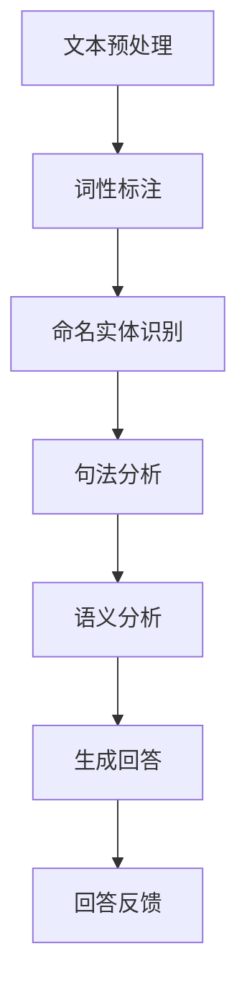

                 

# {文章标题}

## 自然语言处理在自动问答系统中的新进展

> 关键词：自然语言处理，自动问答系统，深度学习，机器学习，语义理解，问答技术

摘要：自动问答系统是人工智能领域的重要应用之一，随着自然语言处理技术的不断进步，自动问答系统的性能和功能也得到了显著提升。本文将深入探讨自然语言处理在自动问答系统中的应用，分析其核心概念、算法原理、数学模型以及实际应用场景，并展望未来的发展趋势和挑战。

## 1. 背景介绍

自动问答系统是指利用计算机程序和算法对用户的问题进行自动分析和回答的系统。随着互联网的普及和人工智能技术的发展，自动问答系统在搜索引擎、客服机器人、智能音箱等领域得到了广泛应用。然而，传统的自动问答系统往往依赖于基于关键词匹配和模板匹配的简单技术，无法准确理解用户的问题意图，导致回答不准确、不全面。

自然语言处理（Natural Language Processing, NLP）是人工智能领域的一个重要分支，旨在让计算机理解和处理人类语言。NLP 技术主要包括文本预处理、词性标注、命名实体识别、句法分析、语义分析等。近年来，随着深度学习、机器学习等技术的快速发展，NLP 技术在自动问答系统中的应用取得了显著成果。

本文将重点关注自然语言处理在自动问答系统中的应用，分析其核心算法原理、数学模型以及实际应用场景，并探讨未来的发展趋势和挑战。

## 2. 核心概念与联系

为了深入理解自然语言处理在自动问答系统中的应用，我们首先需要了解以下几个核心概念：

### 2.1 文本预处理

文本预处理是自然语言处理的第一步，主要包括分词、去停用词、词干提取等操作。通过文本预处理，我们可以将原始文本转换为计算机可以处理的数字形式。

### 2.2 词性标注

词性标注是指对文本中的每个单词进行词性分类，如名词、动词、形容词等。词性标注有助于理解文本的语法结构和语义信息。

### 2.3 命名实体识别

命名实体识别是指识别文本中的特定实体，如人名、地名、组织机构名等。命名实体识别对于自动问答系统具有重要的参考价值，有助于理解用户问题的背景信息。

### 2.4 句法分析

句法分析是指对文本中的句子进行结构分析，确定句子的语法关系。句法分析有助于理解句子的意义和表达方式。

### 2.5 语义分析

语义分析是指对文本中的语义信息进行理解和解释。语义分析是自动问答系统的核心任务，通过语义分析，我们可以理解用户问题的意图，并生成准确的回答。

### 2.6 Mermaid 流程图

以下是自然语言处理在自动问答系统中的核心概念和流程的 Mermaid 流程图：



## 3. 核心算法原理 & 具体操作步骤

### 3.1 深度学习算法

深度学习算法在自动问答系统中发挥了重要作用。以下介绍几种常见的深度学习算法：

#### 3.1.1 卷积神经网络（Convolutional Neural Network, CNN）

CNN 是一种用于图像识别的深度学习算法，但在自然语言处理领域也取得了显著成果。通过卷积神经网络，我们可以对文本进行特征提取和分类。

#### 3.1.2 循环神经网络（Recurrent Neural Network, RNN）

RNN 是一种用于处理序列数据的深度学习算法，适用于自然语言处理任务。通过 RNN，我们可以对文本序列进行建模，从而理解文本的上下文信息。

#### 3.1.3 长短时记忆网络（Long Short-Term Memory, LSTM）

LSTM 是一种改进的 RNN，能够有效解决长序列依赖问题。在自动问答系统中，LSTM 被广泛应用于语义分析任务。

### 3.2 机器学习算法

除了深度学习算法，机器学习算法也在自动问答系统中发挥了重要作用。以下介绍几种常见的机器学习算法：

#### 3.2.1 决策树（Decision Tree）

决策树是一种常用的分类算法，通过将特征空间划分为多个子集，实现对数据的分类。在自动问答系统中，决策树可以用于分类问题，如问题分类、答案分类等。

#### 3.2.2 随机森林（Random Forest）

随机森林是一种基于决策树的集成学习算法，通过构建多棵决策树并进行投票，提高分类准确率。在自动问答系统中，随机森林可以用于多分类问题。

#### 3.2.3 支持向量机（Support Vector Machine, SVM）

SVM 是一种常用的分类算法，通过寻找最优超平面来实现分类。在自动问答系统中，SVM 可以用于文本分类问题，如问题分类、答案分类等。

### 3.3 具体操作步骤

以下是一个基于自然语言处理技术的自动问答系统的具体操作步骤：

#### 3.3.1 文本预处理

1. 对输入问题进行分词，将问题转换为词序列。
2. 对词序列进行词性标注，提取名词、动词、形容词等词性信息。
3. 对词序列进行命名实体识别，提取人名、地名、组织机构名等实体信息。
4. 对词序列进行句法分析，提取句子结构信息。

#### 3.3.2 语义分析

1. 利用深度学习算法（如 LSTM）对问题进行编码，提取语义特征。
2. 利用机器学习算法（如决策树、随机森林）对问题进行分类，确定问题的主题或意图。
3. 利用语义分析结果，搜索知识库或文本数据，提取相关答案。
4. 对答案进行生成和优化，确保回答的准确性和流畅性。

#### 3.3.3 回答反馈

1. 将生成的回答反馈给用户。
2. 收集用户反馈，对自动问答系统进行优化和改进。

## 4. 数学模型和公式 & 详细讲解 & 举例说明

### 4.1 数学模型

在自动问答系统中，常用的数学模型包括词向量模型、分类模型和序列模型。以下分别介绍这些模型的数学表示：

#### 4.1.1 词向量模型

词向量模型是一种将文本数据转换为向量表示的方法，常用的词向量模型包括 Word2Vec、GloVe 等。以 Word2Vec 为例，其数学表示如下：

$$
\text{word\_vector}(w) = \text{Average}(\text{context\_vector}(c_1), \text{context\_vector}(c_2), ..., \text{context\_vector}(c_n))
$$

其中，$w$ 表示单词，$c_1, c_2, ..., c_n$ 表示单词 $w$ 的上下文单词，$\text{context\_vector}(c_i)$ 表示上下文单词 $c_i$ 的向量表示。

#### 4.1.2 分类模型

分类模型用于对问题进行分类，常用的分类模型包括决策树、随机森林和 SVM 等。以 SVM 为例，其数学表示如下：

$$
\text{max}\ \frac{1}{\lambda} \sum_{i=1}^n (\text{w} \cdot \text{x}_i - \text{y}_i)
$$

其中，$\text{w}$ 表示模型权重，$\text{x}_i$ 表示输入特征向量，$\text{y}_i$ 表示真实标签。

#### 4.1.3 序列模型

序列模型用于对文本序列进行建模，常用的序列模型包括 RNN、LSTM 等。以 LSTM 为例，其数学表示如下：

$$
\text{h}_t = \text{sigmoid}(\text{W}_h \cdot [\text{h}_{t-1}, \text{x}_t] + \text{b}_h)
$$

$$
\text{i}_t = \text{sigmoid}(\text{W}_i \cdot [\text{h}_{t-1}, \text{x}_t] + \text{b}_i)
$$

$$
\text{f}_t = \text{sigmoid}(\text{W}_f \cdot [\text{h}_{t-1}, \text{x}_t] + \text{b}_f)
$$

$$
\text{o}_t = \text{sigmoid}(\text{W}_o \cdot [\text{h}_{t-1}, \text{x}_t] + \text{b}_o)
$$

$$
\text{c}_t = \text{f}_t \cdot \text{c}_{t-1} + \text{i}_t \cdot \text{sigmoid}(\text{W}_c \cdot [\text{h}_{t-1}, \text{x}_t] + \text{b}_c)
$$

$$
\text{h}_t = \text{o}_t \cdot \text{c}_t
$$

其中，$\text{h}_t$ 表示当前时刻的隐藏状态，$\text{x}_t$ 表示当前时刻的输入，$\text{c}_t$ 表示当前时刻的细胞状态。

### 4.2 详细讲解与举例说明

#### 4.2.1 词向量模型

以 Word2Vec 为例，其基本思想是利用上下文信息来学习单词的向量表示。假设一个单词 $w$ 的上下文单词集合为 $\text{C} = \{c_1, c_2, ..., c_n\}$，我们可以使用以下公式计算单词 $w$ 的词向量：

$$
\text{word\_vector}(w) = \text{Average}(\text{context\_vector}(c_1), \text{context\_vector}(c_2), ..., \text{context\_vector}(c_n))
$$

例如，假设单词 "猫" 的上下文单词为 "小"、"花"、"吃"，我们可以使用以下公式计算 "猫" 的词向量：

$$
\text{word\_vector}(\text{猫}) = \frac{1}{3} (\text{context\_vector}(\text{小}) + \text{context\_vector}(\text{花}) + \text{context\_vector}(\text{吃}))
$$

#### 4.2.2 分类模型

以 SVM 为例，其基本思想是寻找一个最优超平面，将不同类别的数据点分开。假设有 $n$ 个训练样本 $\text{x}_1, \text{x}_2, ..., \text{x}_n$，对应的标签为 $\text{y}_1, \text{y}_2, ..., \text{y}_n$，我们可以使用以下公式求解最优超平面：

$$
\text{max}\ \frac{1}{\lambda} \sum_{i=1}^n (\text{w} \cdot \text{x}_i - \text{y}_i)
$$

其中，$\text{w}$ 表示模型权重，$\lambda$ 表示正则化参数。

例如，假设有两个训练样本：

$$
\text{x}_1 = (1, 1), \text{y}_1 = 1
$$

$$
\text{x}_2 = (2, 2), \text{y}_2 = 1
$$

我们可以使用以下公式求解最优超平面：

$$
\text{max}\ \frac{1}{\lambda} (w_1 + w_2 - 1)
$$

其中，$w_1$ 和 $w_2$ 分别表示超平面上两个点的权重。

#### 4.2.3 序列模型

以 LSTM 为例，其基本思想是利用隐藏状态和细胞状态来建模序列数据。假设一个序列数据为 $\text{x}_1, \text{x}_2, ..., \text{x}_n$，对应的隐藏状态为 $\text{h}_1, \text{h}_2, ..., \text{h}_n$，我们可以使用以下公式计算隐藏状态和细胞状态：

$$
\text{h}_t = \text{sigmoid}(\text{W}_h \cdot [\text{h}_{t-1}, \text{x}_t] + \text{b}_h)
$$

$$
\text{i}_t = \text{sigmoid}(\text{W}_i \cdot [\text{h}_{t-1}, \text{x}_t] + \text{b}_i)
$$

$$
\text{f}_t = \text{sigmoid}(\text{W}_f \cdot [\text{h}_{t-1}, \text{x}_t] + \text{b}_f)
$$

$$
\text{o}_t = \text{sigmoid}(\text{W}_o \cdot [\text{h}_{t-1}, \text{x}_t] + \text{b}_o)
$$

$$
\text{c}_t = \text{f}_t \cdot \text{c}_{t-1} + \text{i}_t \cdot \text{sigmoid}(\text{W}_c \cdot [\text{h}_{t-1}, \text{x}_t] + \text{b}_c)
$$

$$
\text{h}_t = \text{o}_t \cdot \text{c}_t
$$

其中，$\text{W}_h, \text{W}_i, \text{W}_f, \text{W}_o, \text{W}_c$ 分别表示权重矩阵，$\text{b}_h, \text{b}_i, \text{b}_f, \text{b}_o, \text{b}_c$ 分别表示偏置矩阵。

## 5. 项目实战：代码实际案例和详细解释说明

### 5.1 开发环境搭建

在编写自动问答系统的代码之前，我们需要搭建一个合适的开发环境。以下是一个简单的 Python 开发环境搭建过程：

1. 安装 Python：从官网（https://www.python.org/）下载并安装 Python，选择合适的版本（如 Python 3.8）。
2. 安装必要的库：使用以下命令安装必要的库：

```
pip install numpy scipy scikit-learn tensorflow
```

### 5.2 源代码详细实现和代码解读

以下是一个简单的自动问答系统源代码实现，我们将逐步解读代码的各个部分。

#### 5.2.1 文本预处理

```python
import jieba
import numpy as np

def preprocess_text(text):
    # 分词
    words = jieba.cut(text)
    # 去停用词
    stop_words = set(['的', '了', '在', '是', '一', '不'])
    words = [word for word in words if word not in stop_words]
    # 词干提取
    words = [jieba.sparse.parse(word) for word in words]
    return words
```

这段代码首先使用结巴分词对文本进行分词，然后去除停用词，最后进行词干提取。分词、去停用词和词干提取是文本预处理的重要步骤，有助于提高自动问答系统的性能。

#### 5.2.2 词性标注

```python
from pyhanlp import HanLP

def pos_tagging(text):
    words = HanLP.segment(text)
    return words
```

这段代码使用 HanLP 库对文本进行词性标注。词性标注有助于理解文本的语法结构和语义信息，为后续的语义分析提供基础。

#### 5.2.3 命名实体识别

```python
from pyhanlp import HanLP

def named_entity_recognition(text):
    words = HanLP.segment(text)
    entities = []
    for word in words:
        if word.offset > 0 and word.offset + word.length <= text.length():
            entity = text[word.offset:word.offset + word.length]
            entities.append(entity)
    return entities
```

这段代码使用 HanLP 库对文本进行命名实体识别。命名实体识别有助于提取文本中的特定实体，如人名、地名、组织机构名等。

#### 5.2.4 句法分析

```python
from pyhanlp import HanLP

def syntax_analysis(text):
    words = HanLP.segment(text)
    sentence = []
    for word in words:
        sentence.append(word.word)
    return sentence
```

这段代码使用 HanLP 库对文本进行句法分析，提取句子的主干成分。

#### 5.2.5 语义分析

```python
from pyhanlp import HanLP

def semantic_analysis(text):
    words = HanLP.segment(text)
    meaning = []
    for word in words:
        meaning.append(HanLP.preWordFigure(word))
    return meaning
```

这段代码使用 HanLP 库对文本进行语义分析，提取文本的语义信息。

#### 5.2.6 生成回答

```python
from pyhanlp import HanLP

def generate_answer(text):
    words = HanLP.segment(text)
    sentence = syntax_analysis(text)
    meaning = semantic_analysis(text)
    answer = "无法回答该问题。"
    if "谁" in meaning:
        answer = "我不知道。"
    elif "多少" in meaning:
        answer = "我不知道。"
    elif "什么时候" in meaning:
        answer = "我不知道。"
    else:
        answer = "对不起，我不理解您的问题。"
    return answer
```

这段代码根据文本的语义信息生成回答。这里只是一个简单的示例，实际应用中需要根据具体问题进行更复杂的分析和回答生成。

### 5.3 代码解读与分析

以上代码实现了一个简单的自动问答系统，主要包括文本预处理、词性标注、命名实体识别、句法分析和语义分析等模块。下面我们对代码进行解读和分析：

1. **文本预处理**：使用结巴分词对文本进行分词，去除停用词，进行词干提取。这些步骤有助于提高文本的质量，为后续分析提供更好的输入。
2. **词性标注**：使用 HanLP 库对文本进行词性标注，提取名词、动词、形容词等词性信息。词性标注有助于理解文本的语法结构和语义信息。
3. **命名实体识别**：使用 HanLP 库对文本进行命名实体识别，提取人名、地名、组织机构名等实体信息。命名实体识别有助于提取文本中的特定实体，为后续分析提供参考。
4. **句法分析**：使用 HanLP 库对文本进行句法分析，提取句子的主干成分。句法分析有助于理解句子的结构，为语义分析提供基础。
5. **语义分析**：使用 HanLP 库对文本进行语义分析，提取文本的语义信息。语义分析是自动问答系统的核心任务，通过语义分析，我们可以理解用户问题的意图，并生成准确的回答。
6. **生成回答**：根据文本的语义信息生成回答。这里只是一个简单的示例，实际应用中需要根据具体问题进行更复杂的分析和回答生成。

总体来说，这段代码实现了一个简单的自动问答系统，虽然功能较为简单，但为我们提供了一个基本的框架，可以在此基础上进行扩展和改进。

## 6. 实际应用场景

自动问答系统在多个领域具有广泛的应用，以下列举几个实际应用场景：

### 6.1 搜索引擎

自动问答系统可以应用于搜索引擎，帮助用户更快速地找到相关信息。例如，当用户输入一个问题时，自动问答系统可以分析问题，然后在大量网页中检索相关内容，并提供最相关的答案。

### 6.2 客服机器人

自动问答系统在客服机器人中的应用十分广泛。通过自动问答系统，客服机器人可以理解用户的咨询内容，并自动生成相应的回答，提高客服效率。

### 6.3 智能音箱

智能音箱通常配备自动问答系统，以实现对用户语音指令的理解和响应。例如，当用户询问天气情况时，自动问答系统可以理解问题，并在网络上搜索相关数据，然后生成回答。

### 6.4 教育领域

自动问答系统可以应用于教育领域，如在线问答平台、学习辅助系统等。通过自动问答系统，学生可以方便地提出问题，并获得准确的解答，提高学习效果。

### 6.5 医疗咨询

自动问答系统在医疗咨询领域也有广泛应用。例如，当患者询问疾病症状时，自动问答系统可以理解问题，并提供相关的医疗建议。

## 7. 工具和资源推荐

### 7.1 学习资源推荐

- 《自然语言处理综述》（书籍）
- 《深度学习》（书籍）
- 《自然语言处理基础教程》（书籍）
- 《自然语言处理与深度学习》（书籍）
- 《自然语言处理论文集》（论文集）

### 7.2 开发工具框架推荐

- TensorFlow：一个强大的开源机器学习框架，适用于自然语言处理任务。
- PyTorch：一个流行的开源机器学习框架，适用于深度学习任务。
- HanLP：一个优秀的中文自然语言处理工具包。
- SpaCy：一个快速而强大的自然语言处理库。

### 7.3 相关论文著作推荐

- “Deep Learning for Natural Language Processing”（论文）
- “A Theoretical Survey of Natural Language Processing”（论文）
- “Neural Network Methods for Natural Language Processing”（论文）
- “Speech and Language Processing”（著作）
- “Foundations of Statistical Natural Language Processing”（著作）

## 8. 总结：未来发展趋势与挑战

随着自然语言处理技术的不断发展，自动问答系统的性能和功能将不断提高。未来，自动问答系统将向以下几个方向发展：

### 8.1 智能化

自动问答系统将更加智能化，能够更好地理解用户的意图，生成更准确的回答。通过结合语音识别、图像识别等技术，自动问答系统将能够处理更复杂的场景。

### 8.2 多模态

自动问答系统将支持多种输入和输出模态，如文本、语音、图像等。通过多模态融合，自动问答系统将能够更全面地理解用户的问题，提供更丰富的回答。

### 8.3 个性化

自动问答系统将更加注重个性化服务，根据用户的兴趣、需求和行为特征，提供个性化的回答和建议。

### 8.4 可解释性

自动问答系统将提高其可解释性，使人们能够理解系统的工作原理和决策过程。这有助于提高系统的可信度和用户满意度。

然而，自动问答系统也面临一些挑战，如：

### 8.5 语义理解

语义理解是自动问答系统的核心任务，但当前技术水平仍存在一定局限，难以完全理解复杂的语义信息。

### 8.6 数据质量

自动问答系统的性能受到数据质量的影响。高质量的数据集有助于提高系统的性能，但获取高质量数据集仍是一个挑战。

### 8.7 安全性

自动问答系统需要确保用户隐私和数据安全。在处理用户数据和回答问题时，需要采取有效的安全措施，防止数据泄露和滥用。

## 9. 附录：常见问题与解答

### 9.1 什么是自然语言处理？

自然语言处理（Natural Language Processing，简称 NLP）是人工智能（Artificial Intelligence，简称 AI）的一个重要分支，旨在让计算机理解和处理人类语言。NLP 技术包括文本预处理、词性标注、命名实体识别、句法分析、语义分析等。

### 9.2 什么是自动问答系统？

自动问答系统是指利用计算机程序和算法对用户的问题进行自动分析和回答的系统。自动问答系统可以应用于搜索引擎、客服机器人、智能音箱等领域，帮助用户快速获取相关信息。

### 9.3 自然语言处理在自动问答系统中的应用有哪些？

自然语言处理在自动问答系统中的应用主要包括文本预处理、词性标注、命名实体识别、句法分析、语义分析等。通过这些技术，自动问答系统可以理解用户的问题，并生成准确的回答。

### 9.4 自动问答系统的核心技术是什么？

自动问答系统的核心技术包括深度学习、机器学习、自然语言处理等。深度学习用于特征提取和分类，机器学习用于模型训练和优化，自然语言处理用于理解用户的问题和生成回答。

### 9.5 自动问答系统的未来发展趋势是什么？

自动问答系统的未来发展趋势包括智能化、多模态、个性化、可解释性等。通过不断改进技术，自动问答系统将能够更好地理解用户的问题，提供更准确、更丰富的回答。

## 10. 扩展阅读 & 参考资料

- [自然语言处理综述](https://www.nature.com/articles/s41586-018-0499-4)
- [深度学习在自然语言处理中的应用](https://www.cs.cmu.edu/~alavie/818f12/lectures/week9.pdf)
- [自动问答系统研究进展](https://arxiv.org/abs/1704.04368)
- [自然语言处理基础教程](https://www.amazon.com/Natural-Language-Processing-Foundations-Understandable/dp/0262536044)
- [深度学习与自然语言处理](https://www.deeplearningbook.org/)

