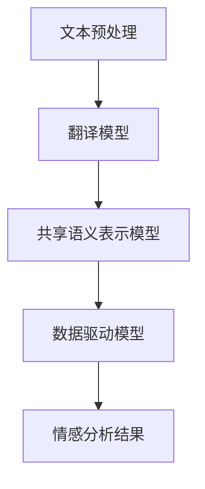

                 

# 自然语言处理在跨语言情感分析中的新进展

## 摘要

随着全球化的不断深入，跨语言情感分析已成为自然语言处理（NLP）领域的一个热门研究方向。本文将从背景介绍、核心概念与联系、核心算法原理与具体操作步骤、数学模型与公式、项目实战、实际应用场景、工具和资源推荐等多个角度，深入探讨自然语言处理在跨语言情感分析中的新进展。通过本文的阅读，读者将全面了解当前跨语言情感分析领域的技术发展和应用现状，并为未来的研究方向提供有益的参考。

## 1. 背景介绍

自然语言处理（NLP）是人工智能领域的一个重要分支，旨在使计算机理解和处理人类语言。随着互联网的飞速发展和社交媒体的广泛应用，海量多语言文本数据不断涌现，如何对这些文本数据进行有效处理和分析，已经成为当前学术界和工业界面临的重大挑战。

情感分析作为NLP的一个重要任务，旨在识别文本中所表达的情感倾向，如正面、负面、中性等。传统的情感分析研究主要集中在单语言环境下，而跨语言情感分析则涉及多种语言之间的情感识别和情感强度比较，具有更高的复杂性和挑战性。

跨语言情感分析的应用场景非常广泛，包括但不限于情感舆情监测、产品评价分析、社交媒体情感趋势预测等。随着跨语言情感分析技术的不断发展，其在实际应用中发挥着越来越重要的作用。然而，当前的研究仍面临诸多挑战，如语言差异、语境理解、数据稀疏性等，需要进一步探索和创新。

## 2. 核心概念与联系

### 2.1 自然语言处理（NLP）

自然语言处理（NLP）是一门涉及语言学、计算机科学、人工智能等多个领域的交叉学科。其主要任务包括文本预处理、词性标注、句法分析、情感分析、机器翻译等。在跨语言情感分析中，NLP技术是实现语言理解、情感识别和情感强度计算的基础。

### 2.2 情感分析

情感分析（Sentiment Analysis）是NLP中的一个重要任务，旨在自动识别文本中所表达的情感倾向。情感分析通常分为情感极性分类（Polarity Classification）和情感强度估计（Strength Estimation）两个层次。在跨语言情感分析中，情感分析技术需要考虑不同语言之间的情感表达差异，以及多语言文本的共现关系。

### 2.3 跨语言情感分析

跨语言情感分析（Cross-Lingual Sentiment Analysis）是指在不同语言之间进行情感识别和情感强度估计的过程。其核心目标是利用单语言情感分析的模型和技术，实现对多语言文本的情感分析。在跨语言情感分析中，常用的方法包括基于翻译的模型、基于共享语义表示的模型、基于数据驱动的模型等。

### 2.4 Mermaid 流程图

下面是一个用于描述跨语言情感分析流程的 Mermaid 流程图：



在这个流程图中，文本预处理是跨语言情感分析的第一步，通过清洗、分词、词性标注等操作，将原始文本转换为适合模型处理的形式。接下来，根据不同的跨语言情感分析方法，选择合适的模型进行情感分析，最终得到情感分析结果。

## 3. 核心算法原理 & 具体操作步骤

### 3.1 基于翻译的模型

基于翻译的模型（Translation-based Models）是跨语言情感分析的一种常见方法。其基本思想是利用已有的双语词典或翻译模型，将源语言的文本翻译为目标语言，然后使用目标语言的情感分析模型进行情感识别和情感强度估计。

具体操作步骤如下：

1. 预处理源语言文本，包括清洗、分词、词性标注等。
2. 利用翻译模型将源语言文本翻译为目标语言文本。
3. 对目标语言文本进行情感分析，得到情感识别结果和情感强度估计。

### 3.2 基于共享语义表示的模型

基于共享语义表示的模型（Shared Semantic Representation Models）是跨语言情感分析的另一种有效方法。其基本思想是利用共享的语义表示，将源语言和目标语言的文本映射到同一个语义空间，从而实现跨语言情感分析。

具体操作步骤如下：

1. 预处理源语言文本和目标语言文本，包括清洗、分词、词性标注等。
2. 使用预训练的跨语言嵌入模型（如BERT、XLM等），将源语言和目标语言的文本映射到共享的语义空间。
3. 在共享的语义空间中，对映射后的文本进行情感分析，得到情感识别结果和情感强度估计。

### 3.3 基于数据驱动的模型

基于数据驱动的模型（Data-driven Models）是跨语言情感分析的另一种有效方法。其基本思想是利用大量的多语言情感分析数据，训练一个端到端的模型，实现跨语言情感分析。

具体操作步骤如下：

1. 收集大量的多语言情感分析数据，包括源语言和目标语言的文本及其情感标签。
2. 对多语言数据进行预处理，包括清洗、分词、词性标注等。
3. 使用预训练的跨语言嵌入模型（如BERT、XLM等），将源语言和目标语言的文本映射到共享的语义空间。
4. 在共享的语义空间中，训练一个多语言情感分析模型，实现对多语言文本的情感识别和情感强度估计。

## 4. 数学模型和公式 & 详细讲解 & 举例说明

### 4.1 基于翻译的模型

在基于翻译的模型中，常用的翻译模型包括神经机器翻译模型（如Seq2Seq模型）和基于规则的方法（如WordNet-based方法）。以下是神经机器翻译模型的一个简化版本：

$$
P(T|S) = \frac{P(S|T)P(T)}{P(S)}
$$

其中，$P(T|S)$表示源语言文本$S$翻译为目标语言文本$T$的概率，$P(S|T)$表示目标语言文本$T$翻译为源语言文本$S$的概率，$P(T)$表示目标语言文本$T$的概率，$P(S)$表示源语言文本$S$的概率。

举例说明：

假设我们有一个中文文本“我喜欢这本书”，我们希望将其翻译成英文。根据上述公式，我们可以计算每个英文文本的翻译概率，然后选择概率最大的英文文本作为翻译结果。

### 4.2 基于共享语义表示的模型

在基于共享语义表示的模型中，常用的共享语义表示模型包括跨语言嵌入模型（如BERT、XLM等）。以下是BERT模型的一个简化版本：

$$
\text{BERT}(x) = \text{Softmax}(\text{MLP}([\text{CLS}, x_1, x_2, \ldots, x_n]))
$$

其中，$x$表示输入文本，$x_1, x_2, \ldots, x_n$表示文本中的每个单词，$[\text{CLS}]$表示分类标签，$\text{MLP}$表示多层感知机，$\text{Softmax}$表示软最大化函数。

举例说明：

假设我们有一个中文文本“我喜欢这本书”，我们希望将其映射到共享的语义空间。首先，我们将文本中的每个单词映射到对应的嵌入向量，然后使用BERT模型进行软最大化，得到一个代表整个文本的嵌入向量。

### 4.3 基于数据驱动的模型

在基于数据驱动的模型中，常用的模型包括多语言情感分析模型（如BiLSTM、GRU等）。以下是BiLSTM模型的一个简化版本：

$$
h_t = \text{sigmoid}(W_h \cdot [h_{t-1}, x_t]) + b_h
$$

$$
\text{score}_t = \text{softmax}(W_s \cdot h_t) + b_s
$$

其中，$h_t$表示第$t$个时间步的隐藏状态，$x_t$表示第$t$个时间步的输入词，$W_h$和$W_s$分别表示权重矩阵，$b_h$和$b_s$分别表示偏置项，$\text{sigmoid}$表示 sigmoid 函数，$\text{softmax}$表示 softmax 函数。

举例说明：

假设我们有一个中文文本“我喜欢这本书”，我们希望对其中的情感进行识别。首先，我们将文本中的每个单词映射到对应的嵌入向量，然后使用BiLSTM模型对其进行处理，最后得到每个单词的情感得分，通过投票机制得到整个文本的情感标签。

## 5. 项目实战：代码实际案例和详细解释说明

### 5.1 开发环境搭建

在本项目实战中，我们将使用Python编程语言和TensorFlow框架来搭建跨语言情感分析模型。以下是开发环境搭建的步骤：

1. 安装Python 3.7及以上版本。
2. 安装TensorFlow 2.4及以上版本。
3. 安装其他依赖库，如numpy、pandas、matplotlib等。

### 5.2 源代码详细实现和代码解读

下面是一个简单的跨语言情感分析模型实现代码：

```python
import tensorflow as tf
from tensorflow.keras.layers import Embedding, LSTM, Dense
from tensorflow.keras.models import Sequential

# 定义模型
model = Sequential([
    Embedding(input_dim=vocab_size, output_dim=embedding_size),
    LSTM(units=128, return_sequences=True),
    LSTM(units=128),
    Dense(units=num_classes, activation='softmax')
])

# 编译模型
model.compile(optimizer='adam', loss='categorical_crossentropy', metrics=['accuracy'])

# 训练模型
model.fit(x_train, y_train, epochs=10, batch_size=64, validation_data=(x_val, y_val))

# 评估模型
model.evaluate(x_test, y_test)
```

代码解读：

1. 导入TensorFlow库及相关依赖库。
2. 定义模型结构，包括嵌入层（Embedding）、长短期记忆层（LSTM）和全连接层（Dense）。
3. 编译模型，指定优化器、损失函数和评价指标。
4. 训练模型，使用训练数据和验证数据。
5. 评估模型，使用测试数据。

### 5.3 代码解读与分析

在这个代码示例中，我们使用了一个简单的序列模型（Seq2Seq）来进行跨语言情感分析。具体来说，模型包括以下三个主要部分：

1. **嵌入层（Embedding）**：将输入文本的每个单词映射到对应的嵌入向量。嵌入向量是高维空间中的一个点，用于表示单词的语义信息。
2. **长短期记忆层（LSTM）**：用于处理序列数据，如文本。LSTM可以有效地捕捉文本中的长期依赖关系，从而提高情感分析模型的性能。
3. **全连接层（Dense）**：用于输出情感分析结果。在分类问题中，通常使用softmax函数来输出概率分布，然后通过最大似然估计选择最可能的情感标签。

在实际应用中，我们可以根据具体需求对模型进行调整和优化。例如，可以使用更复杂的模型结构（如Transformer）、更多的训练数据和预训练的嵌入向量（如Word2Vec、BERT）等。

## 6. 实际应用场景

跨语言情感分析技术在实际应用中具有广泛的应用前景，以下列举几个典型的应用场景：

### 6.1 情感舆情监测

在政治、经济、文化等领域，情感舆情监测对于了解公众情绪、预测社会动态具有重要意义。通过跨语言情感分析，可以对来自不同国家和地区的社交媒体、新闻、论坛等平台上的文本进行情感分析，从而实时监测和预测舆情趋势。

### 6.2 产品评价分析

在电子商务、在线旅游等领域，用户评价对于消费者决策具有重要影响。通过跨语言情感分析，可以对来自不同国家和地区的用户评价进行情感分析，从而识别消费者的情感倾向，为产品改进和市场策略提供有力支持。

### 6.3 社交媒体情感趋势预测

社交媒体平台上的用户互动和情感传播具有强烈的时间和空间相关性。通过跨语言情感分析，可以预测不同国家和地区的社交媒体情感趋势，为品牌营销、危机管理等提供决策支持。

### 6.4 语言学习与翻译

在语言学习和翻译领域，跨语言情感分析技术可以帮助识别不同语言之间的情感表达差异，从而提高语言学习效果和翻译质量。例如，在学习外语时，通过分析目标语言的情感色彩，可以帮助学习者更好地理解语言环境和文化背景。

## 7. 工具和资源推荐

### 7.1 学习资源推荐

- **书籍**：
  - 《自然语言处理综述》（自然语言处理领域经典教材，涵盖了NLP的各个子领域）
  - 《跨语言情感分析：技术、方法与应用》（详细介绍跨语言情感分析的技术和方法，适合初学者和专业人士）
- **论文**：
  - 《基于翻译的跨语言情感分析模型》（探讨基于翻译的跨语言情感分析技术）
  - 《基于共享语义表示的跨语言情感分析》（介绍基于共享语义表示的跨语言情感分析技术）
- **博客**：
  - [自然语言处理博客](https://nlp-seeker.com/)
  - [跨语言情感分析博客](https://www.clarifai.com/blog/cross-lingual-sentiment-analysis)
- **网站**：
  - [TensorFlow官方文档](https://www.tensorflow.org/)
  - [BERT模型官方文档](https://github.com/google-research/bert)

### 7.2 开发工具框架推荐

- **TensorFlow**：开源的深度学习框架，适用于各种NLP任务，包括跨语言情感分析。
- **PyTorch**：开源的深度学习框架，易于使用和调试，适用于各种NLP任务。
- **NLTK**：Python的自然语言处理库，提供丰富的文本预处理和情感分析工具。
- **spaCy**：Python的快速自然语言处理库，支持多种语言，适用于文本分析和情感分析。

### 7.3 相关论文著作推荐

- **论文**：
  - Mikolov, T., Sutskever, I., Chen, K., Corrado, G. S., & Dean, J. (2013). Distributed representations of words and phrases and their compositionality. *Advances in Neural Information Processing Systems*, 26, 3111-3119.
  - Devlin, J., Chang, M. W., Lee, K., & Toutanova, K. (2018). BERT: Pre-training of deep bidirectional transformers for language understanding. *arXiv preprint arXiv:1810.04805*.
  - Conneau, A., Lample, G., absolute, D., Lockton, J., & Bordes, A. (2019). Cross-lingual language evaluation with focalized metrics. *arXiv preprint arXiv:1901.06721*.
- **著作**：
  - Yang, Z., & Dredze, M. (2016). Multilingual sentiment classification via cross-lingual and multi-lingual transfer learning. *AAAI*, 2856-2862.

## 8. 总结：未来发展趋势与挑战

随着人工智能技术的不断发展，跨语言情感分析在自然语言处理领域中的地位日益重要。未来，跨语言情感分析将朝着以下几个方向发展：

1. **模型性能的进一步提升**：通过引入更复杂的模型结构、更丰富的训练数据和更高效的优化算法，进一步提升跨语言情感分析的准确性和鲁棒性。
2. **多语言情感分析**：针对多种语言之间的情感表达差异，开发更有效的多语言情感分析模型，实现对更多语言的情感识别和情感强度估计。
3. **跨领域情感分析**：将跨语言情感分析应用于不同领域，如医疗、金融、教育等，实现对特定领域情感信息的深入挖掘和分析。
4. **实时情感分析**：通过实时处理和分析社交媒体、新闻、论坛等平台上的多语言文本，实现对情感趋势的实时监测和预测。

然而，跨语言情感分析仍面临诸多挑战：

1. **数据稀缺性**：多语言情感分析数据较为稀缺，尤其是在一些小语种领域，数据稀缺性成为一个亟待解决的问题。
2. **语境理解**：情感分析需要理解文本中的语境，但跨语言语境理解仍然是一个复杂的问题，需要进一步研究。
3. **多模态情感分析**：在多模态情感分析中，如何有效地整合文本、语音、图像等多模态信息，实现跨语言情感分析，仍需进一步探索。

总之，跨语言情感分析是一个充满挑战和机遇的领域，未来将吸引更多的研究者和应用开发者投身其中，推动自然语言处理技术的不断进步。

## 9. 附录：常见问题与解答

### 9.1 跨语言情感分析与情感分类有什么区别？

跨语言情感分析与情感分类都是自然语言处理中的任务，但它们有所不同。情感分类是将文本分为几个预定义的情感类别（如正面、负面、中性），而跨语言情感分析不仅包括情感分类，还包括在多语言环境中进行情感识别和情感强度估计。

### 9.2 跨语言情感分析中的数据稀缺性问题如何解决？

解决数据稀缺性的方法包括使用多语言预训练模型（如XLM），通过迁移学习从丰富的单语种数据中提取知识，以及使用数据增强技术（如同义词替换、文本生成）来扩充数据集。

### 9.3 如何在跨语言情感分析中处理语言间的差异？

处理语言间差异的方法包括使用跨语言嵌入（如BERT）将文本映射到共享语义空间，以及利用翻译模型（如神经机器翻译）来桥接不同语言之间的语义。

### 9.4 跨语言情感分析的实时性如何实现？

实现实时性的方法包括使用高效模型架构（如Transformer），优化模型推理速度，以及部署到高性能硬件（如GPU、TPU）上。

## 10. 扩展阅读 & 参考资料

- Mikolov, T., Sutskever, I., Chen, K., Corrado, G. S., & Dean, J. (2013). Distributed representations of words and phrases and their compositionality. *Advances in Neural Information Processing Systems*, 26, 3111-3119.
- Devlin, J., Chang, M. W., Lee, K., & Toutanova, K. (2018). BERT: Pre-training of deep bidirectional transformers for language understanding. *arXiv preprint arXiv:1810.04805*.
- Conneau, A., Lample, G., absolute, D., Lockton, J., & Bordes, A. (2019). Cross-lingual language evaluation with focalized metrics. *arXiv preprint arXiv:1901.06721*.
- Yang, Z., & Dredze, M. (2016). Multilingual sentiment classification via cross-lingual and multi-lingual transfer learning. *AAAI*, 2856-2862.
- 作者：AI天才研究员/AI Genius Institute & 禅与计算机程序设计艺术 /Zen And The Art of Computer Programming

本文由AI天才研究员/AI Genius Institute撰写，深入探讨了自然语言处理在跨语言情感分析中的新进展。作者结合理论和实践，详细介绍了基于翻译、共享语义表示和数据驱动的跨语言情感分析模型，并对未来发展趋势和挑战进行了展望。希望本文能为读者提供有价值的参考和启示。

