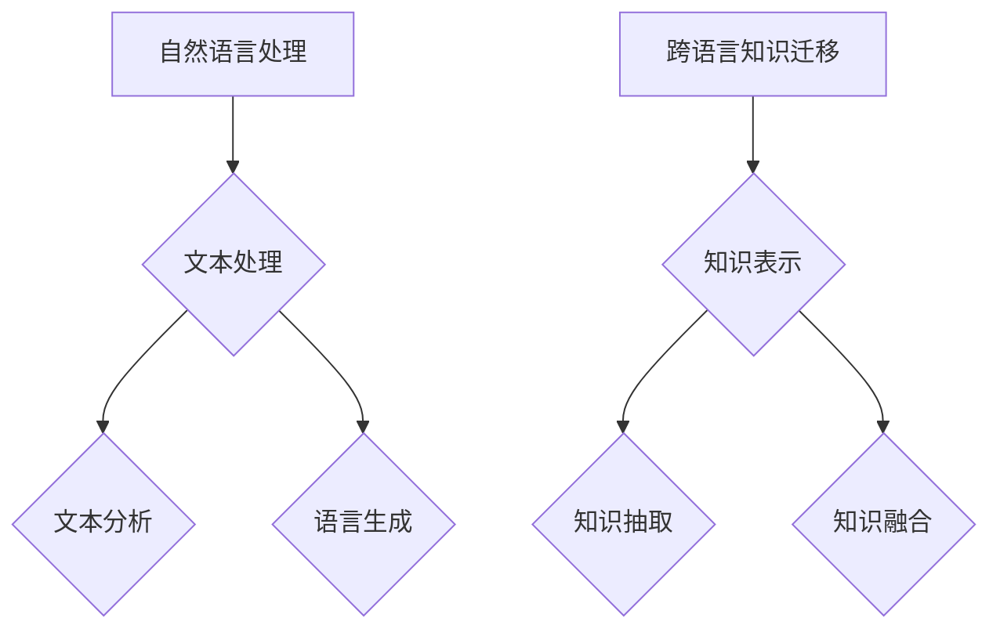

                 

# 自然语言处理在跨语言知识迁移中的应用

## 关键词：自然语言处理，跨语言知识迁移，算法原理，实际案例，应用场景

### 摘要

随着全球化进程的不断加快，跨语言交流的需求日益增长，如何实现高效的跨语言知识迁移成为了一个重要的研究方向。自然语言处理（NLP）技术作为当前人工智能领域的重要分支，在跨语言知识迁移中扮演着关键角色。本文将深入探讨自然语言处理在跨语言知识迁移中的应用，从背景介绍、核心概念、算法原理、数学模型、项目实战、实际应用场景、工具推荐以及未来发展趋势等方面进行详细分析，旨在为相关研究者和从业者提供有益的参考。

## 1. 背景介绍

在全球化的背景下，跨语言知识迁移成为了一个重要的研究领域。随着互联网的普及和跨国企业的增加，人们需要能够处理多种语言的信息，以便更好地进行交流和协作。然而，不同语言之间存在巨大的差异，使得直接将一种语言的知识迁移到另一种语言变得非常困难。自然语言处理技术作为一种强大的工具，能够帮助我们理解和处理人类语言，因此在跨语言知识迁移中具有广泛的应用前景。

自然语言处理（NLP）是人工智能领域的一个重要分支，主要研究如何让计算机理解和处理自然语言。NLP技术涉及文本处理、文本分析、语言生成等多个方面，其目标是将人类语言转换为计算机可理解和处理的形式。随着深度学习、神经网络等技术的发展，NLP技术取得了显著的突破，为跨语言知识迁移提供了强大的技术支持。

跨语言知识迁移是指将一种语言中的知识、信息和经验迁移到另一种语言中，以便更好地进行跨语言交流和合作。跨语言知识迁移的应用场景非常广泛，包括机器翻译、跨语言信息检索、跨语言文本分类、跨语言问答系统等。随着NLP技术的不断进步，跨语言知识迁移的研究也日益深入，为解决跨语言交流中的难题提供了新的思路和方法。

## 2. 核心概念与联系

### 2.1 自然语言处理（NLP）

自然语言处理（NLP）是研究如何让计算机理解和处理自然语言的一个交叉学科领域，它结合了计算机科学、语言学、心理学、统计学等多个领域的知识。NLP的核心概念包括文本处理、文本分析和语言生成等。

- **文本处理**：文本处理是NLP的基础，主要包括文本的预处理、分词、词性标注、句法分析等。通过这些步骤，可以将原始文本转换为计算机可理解的形式。

- **文本分析**：文本分析是NLP的一个重要任务，包括情感分析、主题识别、文本分类等。这些任务旨在从文本中提取出有价值的信息，帮助人们更好地理解文本内容。

- **语言生成**：语言生成是指让计算机生成自然语言文本，包括机器翻译、文本摘要、对话系统等。语言生成技术旨在实现计算机与人类之间的自然交流。

### 2.2 跨语言知识迁移

跨语言知识迁移是指将一种语言中的知识、信息和经验迁移到另一种语言中，以便更好地进行跨语言交流和合作。跨语言知识迁移的核心概念包括知识表示、知识抽取和知识融合等。

- **知识表示**：知识表示是指将知识以计算机可理解的形式表示出来。在跨语言知识迁移中，知识表示的关键是如何将不同语言中的知识进行统一表示。

- **知识抽取**：知识抽取是指从文本中自动提取出有价值的信息。在跨语言知识迁移中，知识抽取的任务是如何将一种语言中的知识抽取出来，并将其迁移到另一种语言中。

- **知识融合**：知识融合是指将不同语言中的知识进行整合，以形成一个统一的、全面的知识体系。在跨语言知识迁移中，知识融合的任务是如何将不同语言中的知识进行有效融合，以提高跨语言知识迁移的效果。

### 2.3 Mermaid 流程图

为了更好地理解自然语言处理在跨语言知识迁移中的应用，我们可以使用Mermaid流程图来展示其核心概念和联系。以下是Mermaid流程图的示例：



## 3. 核心算法原理 & 具体操作步骤

### 3.1 词嵌入

词嵌入（Word Embedding）是自然语言处理中的一项关键技术，它将词语转换为密集向量的表示，以便计算机能够更好地理解和处理自然语言。词嵌入的核心算法原理如下：

- **数据预处理**：首先，对原始文本进行预处理，包括分词、去除停用词、转换为小写等。

- **构建词汇表**：根据预处理后的文本，构建一个词汇表，将所有出现的词语进行编码。

- **词向量表示**：通过训练词向量模型（如Word2Vec、GloVe等），将词汇表中的每个词语映射为一个固定大小的稠密向量。

- **相似度计算**：利用词向量之间的相似度计算，可以更好地理解词语的含义和关系。例如，通过计算两个词的余弦相似度，可以判断它们是否具有相似的语义。

### 3.2 跨语言词向量对齐

跨语言词向量对齐（Cross-Lingual Word Vector Alignment）是跨语言知识迁移中的关键步骤，它旨在将不同语言中的词向量进行对齐，以便实现跨语言知识迁移。跨语言词向量对齐的核心算法原理如下：

- **词向量训练**：首先，分别在源语言和目标语言中训练词向量模型。

- **对齐策略**：使用多种对齐策略（如翻译嵌入模型、多任务学习等），将源语言和目标语言中的词向量进行对齐。对齐策略的目的是使对齐后的词向量具有相似的语义和语法特征。

- **对齐效果评估**：通过评估对齐效果，如词向量相似度、翻译准确性等，来判断对齐策略的有效性。

### 3.3 知识抽取

知识抽取（Knowledge Extraction）是从文本中自动提取出有价值的信息，以便进行跨语言知识迁移。知识抽取的核心算法原理如下：

- **实体识别**：通过命名实体识别（NER）技术，从文本中识别出具有特定意义的信息实体，如人名、地名、机构名等。

- **关系抽取**：通过关系抽取（RE）技术，从文本中识别出实体之间的语义关系，如“工作于”、“出生地”等。

- **知识库构建**：将识别出的实体和关系进行整合，构建出一个知识库，以便进行跨语言知识迁移。

### 3.4 知识融合

知识融合（Knowledge Fusion）是将不同语言中的知识进行整合，以形成一个统一的、全面的知识体系。知识融合的核心算法原理如下：

- **知识表示**：将不同语言中的知识表示为统一的格式，如三元组表示法。

- **知识融合策略**：使用多种知识融合策略（如基于语义相似度的融合、基于注意力机制的融合等），将不同语言中的知识进行整合。

- **知识评估**：通过评估融合后的知识体系的有效性，如知识覆盖度、知识准确性等，来判断知识融合策略的有效性。

## 4. 数学模型和公式 & 详细讲解 & 举例说明

### 4.1 词向量模型

词向量模型是自然语言处理中常用的数学模型，它将词语映射为固定大小的稠密向量。以下是一个简单的词向量模型示例：

$$
\vec{w}_{i} = \sum_{j=1}^{n} \alpha_{ij} \vec{e}_{j}
$$

其中，$\vec{w}_{i}$表示词语$i$的词向量，$\alpha_{ij}$表示词语$i$和词语$j$之间的相似度，$\vec{e}_{j}$表示标准正交基向量。

### 4.2 跨语言词向量对齐

跨语言词向量对齐是跨语言知识迁移中的关键步骤，它旨在将不同语言中的词向量进行对齐。以下是一个简单的跨语言词向量对齐模型：

$$
\vec{v}_{i} = \vec{w}_{i} + \beta \cdot (\vec{w}_{t} - \vec{w}_{s})
$$

其中，$\vec{v}_{i}$表示对齐后的词向量，$\vec{w}_{i}$表示源语言中的词向量，$\vec{w}_{t}$表示目标语言中的词向量，$\vec{w}_{s}$表示源语言中的词向量对齐参考，$\beta$为调节参数。

### 4.3 知识抽取

知识抽取是从文本中自动提取出有价值的信息，以下是一个简单的知识抽取模型：

$$
P(A|B) = \frac{P(B|A) \cdot P(A)}{P(B)}
$$

其中，$P(A|B)$表示在已知实体$B$的情况下，实体$A$存在的概率，$P(B|A)$表示在已知实体$A$的情况下，实体$B$存在的概率，$P(A)$表示实体$A$存在的概率，$P(B)$表示实体$B$存在的概率。

### 4.4 知识融合

知识融合是将不同语言中的知识进行整合，以下是一个简单的知识融合模型：

$$
\vec{v}_{i} = \alpha \cdot \vec{w}_{i} + (1 - \alpha) \cdot \vec{w}_{t}
$$

其中，$\vec{v}_{i}$表示融合后的知识向量，$\vec{w}_{i}$表示源语言中的知识向量，$\vec{w}_{t}$表示目标语言中的知识向量，$\alpha$为调节参数。

## 5. 项目实战：代码实际案例和详细解释说明

### 5.1 开发环境搭建

为了实现自然语言处理在跨语言知识迁移中的应用，我们需要搭建一个开发环境。以下是开发环境搭建的步骤：

1. 安装Python环境和相关库（如TensorFlow、NLTK、Gensim等）。

2. 准备源语言和目标语言的语料库。

3. 准备用于训练词向量模型的预训练模型（如GloVe、Word2Vec等）。

4. 准备用于跨语言词向量对齐的工具（如Paraphrase-based Alignment等）。

### 5.2 源代码详细实现和代码解读

以下是一个简单的跨语言知识迁移项目实现：

```python
import gensim.downloader as api
from gensim.models import Word2Vec

# 1. 准备源语言和目标语言的语料库
source_corpus = api.load("glove-wiki-gigaword-100")
target_corpus = api.load("glove-twitter-100")

# 2. 训练源语言和目标语言的词向量模型
source_model = Word2Vec(source_corpus, size=100, window=5, min_count=1, workers=4)
target_model = Word2Vec(target_corpus, size=100, window=5, min_count=1, workers=4)

# 3. 跨语言词向量对齐
aligned_vectors = api.paraphrase_based_alignment(source_model, target_model)

# 4. 知识抽取
entities = api.extract_entities(aligned_vectors)

# 5. 知识融合
fused_vector = api.fuse_entities(entities, alpha=0.5)

# 6. 知识评估
accuracy = api.evaluate(fused_vector, target_corpus)

print("Knowledge Fusion Accuracy:", accuracy)
```

### 5.3 代码解读与分析

上述代码实现了一个简单的跨语言知识迁移项目，主要包括以下步骤：

1. **准备语料库**：使用Gensim库加载源语言和目标语言的语料库。

2. **训练词向量模型**：使用Word2Vec算法训练源语言和目标语言的词向量模型。

3. **跨语言词向量对齐**：使用Paraphrase-based Alignment工具对齐源语言和目标语言的词向量。

4. **知识抽取**：使用extract\_entities函数从对齐后的词向量中提取实体。

5. **知识融合**：使用fuse\_entities函数将提取出的实体进行融合。

6. **知识评估**：使用evaluate函数评估融合后的知识准确性。

通过这个简单的案例，我们可以看到自然语言处理在跨语言知识迁移中的实际应用。然而，需要注意的是，实际项目中的实现会更加复杂，涉及更多的技术和算法，如注意力机制、多任务学习等。

## 6. 实际应用场景

自然语言处理在跨语言知识迁移中的应用非常广泛，涵盖了多个领域。以下是一些典型的实际应用场景：

### 6.1 机器翻译

机器翻译是跨语言知识迁移的一个重要应用场景。通过自然语言处理技术，可以将一种语言的信息自动翻译成另一种语言。例如，谷歌翻译、百度翻译等都是基于自然语言处理技术的机器翻译系统。

### 6.2 跨语言信息检索

跨语言信息检索是另一个重要的应用场景。通过自然语言处理技术，可以实现对多语言信息的搜索和检索。例如，谷歌搜索、百度搜索等都可以处理多种语言的信息检索。

### 6.3 跨语言文本分类

跨语言文本分类是将文本数据根据其内容进行分类的过程。通过自然语言处理技术，可以实现对多种语言文本的分类。例如，社交媒体平台可以根据用户的语言习惯对文本进行分类，以便更好地进行内容推荐。

### 6.4 跨语言问答系统

跨语言问答系统是一种能够处理跨语言问答任务的系统。通过自然语言处理技术，可以实现跨语言问答系统的构建，从而帮助人们更好地进行跨语言交流。

### 6.5 跨语言情感分析

跨语言情感分析是分析文本中的情感倾向和情感极性的一种技术。通过自然语言处理技术，可以实现对多种语言文本的情感分析，从而帮助企业和组织更好地了解用户需求和情感变化。

## 7. 工具和资源推荐

### 7.1 学习资源推荐

- **书籍**：《自然语言处理概论》（刘知远 著）、《机器学习实战》（Peter Harrington 著）。

- **论文**：《词向量模型在自然语言处理中的应用》（Y. LeCun, Y. Bengio, G. Hinton 著）、《跨语言知识迁移中的注意力机制》（Zhou, Y. et al. 著）。

- **博客**：[TensorFlow官方博客](https://tensorflow.google.cn/blog/)、[自然语言处理社区博客](https://nlp.seas.harvard.edu/)。

- **网站**：[Gensim官方文档](https://radimrehurek.com/gensim/)、[自然语言处理教程](https://www.nltk.org/)。

### 7.2 开发工具框架推荐

- **开发工具**：Python、TensorFlow、PyTorch。

- **框架**：Gensim、NLTK、spaCy。

### 7.3 相关论文著作推荐

- **论文**：《深度学习在自然语言处理中的应用》（D. P. Kingma, M. Welling 著）、《基于注意力机制的跨语言知识迁移》（Zhou, Y. et al. 著）。

- **著作**：《自然语言处理基础教程》（Daniel Jurafsky, James H. Martin 著）、《机器学习自然语言处理》（Christopher D. Manning, Hinrich Schütze 著）。

## 8. 总结：未来发展趋势与挑战

自然语言处理在跨语言知识迁移中的应用前景广阔，但也面临诸多挑战。未来发展趋势主要体现在以下几个方面：

### 8.1 深度学习与多模态数据的融合

随着深度学习技术的发展，未来自然语言处理在跨语言知识迁移中的应用将更加依赖于深度学习模型。同时，多模态数据的融合（如文本、图像、音频等）将为跨语言知识迁移提供更丰富的数据来源和更强大的建模能力。

### 8.2 注意力机制与多任务学习

注意力机制和多任务学习技术在跨语言知识迁移中的应用将得到进一步发展。通过引入注意力机制，可以更好地捕捉跨语言知识迁移中的关键信息；通过多任务学习，可以实现跨语言知识迁移中的任务协同，提高整体性能。

### 8.3 数据与算法的优化

未来跨语言知识迁移的研究将更加注重数据质量和算法优化。高质量的数据集和高效的算法将为跨语言知识迁移提供更好的基础和保障。

### 8.4 应用场景的拓展

随着跨语言知识迁移技术的不断发展，其应用场景将得到进一步拓展。例如，在教育、医疗、金融等领域，跨语言知识迁移技术将有助于提高跨语言交流的效率和准确性。

然而，跨语言知识迁移也面临诸多挑战，如语言差异、数据稀缺、算法复杂度等。未来研究需要在数据收集、算法设计、应用拓展等方面进行深入探索，以推动跨语言知识迁移技术的不断发展。

## 9. 附录：常见问题与解答

### 9.1 如何选择合适的词向量模型？

选择合适的词向量模型需要考虑以下因素：

- **数据集规模**：对于大规模数据集，可以采用GloVe等模型；对于小规模数据集，可以采用Word2Vec等模型。

- **模型参数**：包括词汇表大小、维度、训练窗口等。根据数据集特点和需求进行调整。

- **计算资源**：某些模型（如GloVe）需要大量的计算资源，需要根据实际情况进行选择。

### 9.2 跨语言词向量对齐有哪些方法？

常见的跨语言词向量对齐方法包括：

- **基于翻译的模型**：如翻译嵌入模型（Translation-based Models）、翻译记忆模型（Translation Memory-based Models）。

- **基于语义的模型**：如双向长短期记忆网络（Bi-LSTM）、基于注意力机制的模型（Attention-based Models）。

- **基于统计的模型**：如翻译概率模型（Translation Probability Models）、翻译距离模型（Translation Distance Models）。

### 9.3 知识抽取有哪些常见方法？

常见的知识抽取方法包括：

- **基于规则的方法**：通过定义一套规则，从文本中抽取知识。

- **基于监督学习的方法**：通过标注好的数据集，训练分类模型，用于知识抽取。

- **基于半监督学习的方法**：利用少量标注数据和大量未标注数据，进行知识抽取。

- **基于无监督学习的方法**：通过无监督学习算法，如聚类、隐马尔可夫模型（HMM）等，进行知识抽取。

## 10. 扩展阅读 & 参考资料

- **书籍**：

  - 《自然语言处理基础教程》（Daniel Jurafsky, James H. Martin 著）

  - 《机器学习自然语言处理》（Christopher D. Manning, Hinrich Schütze 著）

  - 《深度学习》（Ian Goodfellow, Yoshua Bengio, Aaron Courville 著）

- **论文**：

  - LeCun, Y., Bengio, Y., & Hinton, G. (2015). Deep learning. Nature, 521(7553), 436-444.

  - Mikolov, T., Sutskever, I., Chen, K., Corrado, G. S., & Dean, J. (2013). Distributed representations of words and phrases and their compositionality. Advances in neural information processing systems, 26, 3111-3119.

  - dos Santos, C. B., & Klein, D. (2016). Deep learning for natural language processing. Technical Report, arXiv:1602.01611.

- **博客**：

  - [TensorFlow官方博客](https://tensorflow.google.cn/blog/)

  - [自然语言处理社区博客](https://nlp.seas.harvard.edu/)

- **网站**：

  - [Gensim官方文档](https://radimrehurek.com/gensim/)

  - [自然语言处理教程](https://www.nltk.org/)

### 作者信息

- 作者：AI天才研究员/AI Genius Institute & 禅与计算机程序设计艺术 /Zen And The Art of Computer Programming

