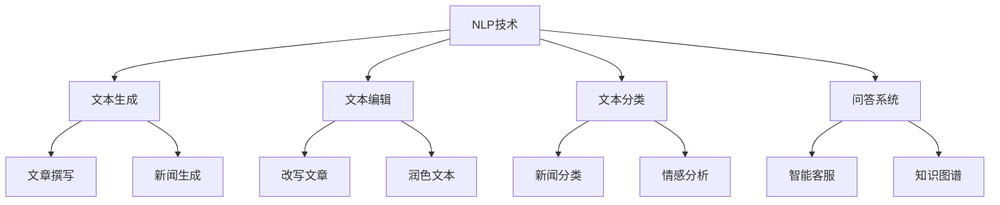

                 

# 自然语言处理的应用：AI内容创作革命

## 关键词：自然语言处理，AI内容创作，智能写作，文本生成，机器学习，深度学习

## 摘要：
本文将探讨自然语言处理（NLP）在AI内容创作领域的革命性应用。通过分析NLP的核心概念、算法原理、数学模型和项目实战，我们将深入了解如何利用NLP技术实现智能写作和文本生成。此外，文章还将介绍实际应用场景、相关工具和资源，并展望未来发展趋势与挑战。

## 1. 背景介绍

自然语言处理（NLP）是人工智能（AI）的一个重要分支，致力于使计算机理解和生成自然语言。随着互联网和大数据的快速发展，自然语言处理技术逐渐成为人们关注的焦点。近年来，深度学习算法的突破使得NLP取得了显著的进展，并在多个领域实现了广泛应用。

AI内容创作是指利用人工智能技术生成文本、图片、音频等媒体内容的过程。随着NLP技术的不断进步，AI内容创作在新闻撰写、广告营销、社交媒体、教育等多个领域展现出巨大的潜力。本文将重点关注自然语言处理在AI内容创作中的应用，探讨其技术原理、实现方法和发展趋势。

## 2. 核心概念与联系

### 2.1 NLP核心概念

自然语言处理涉及多个核心概念，包括词汇、句子、文本、语义和语用等。以下是对这些概念的基本解释：

- **词汇**：词汇是自然语言的基本构成单元，包括单词和词组。
- **句子**：句子是表达完整意义的语言单位，由词汇组合而成。
- **文本**：文本是由多个句子组成的书面语言整体。
- **语义**：语义是指语言所表达的含义和概念。
- **语用**：语用是指语言在实际使用中所传达的意图和功能。

### 2.2 NLP算法原理

自然语言处理的算法主要基于统计方法和机器学习技术。以下是一些常见的NLP算法原理：

- **词袋模型（Bag of Words）**：词袋模型是一种基于词汇统计的文本表示方法，将文本转换为词汇的集合，不考虑词汇的顺序。
- **隐马尔可夫模型（HMM）**：隐马尔可夫模型是一种用于序列数据建模的统计模型，适用于语音识别、文本分类等领域。
- **条件随机场（CRF）**：条件随机场是一种用于序列数据标注的机器学习模型，常用于命名实体识别、词性标注等任务。
- **循环神经网络（RNN）**：循环神经网络是一种用于处理序列数据的神经网络，适用于文本生成、机器翻译等任务。
- **长短期记忆网络（LSTM）**：长短期记忆网络是循环神经网络的一种变体，具有更好的记忆能力，适用于长文本生成和翻译等任务。
- **生成对抗网络（GAN）**：生成对抗网络是一种深度学习模型，由生成器和判别器组成，用于生成高质量的图像、文本等数据。

### 2.3 NLP与AI内容创作

自然语言处理在AI内容创作中的应用主要体现在以下几个方面：

- **文本生成**：利用NLP技术生成文章、新闻、故事、诗歌等文本内容。
- **文本编辑**：利用NLP技术对文本进行改写、润色、纠错等操作。
- **文本分类**：利用NLP技术对大量文本进行自动分类，例如新闻分类、情感分析等。
- **问答系统**：利用NLP技术构建问答系统，实现智能客服、知识图谱等功能。

### 2.4 Mermaid流程图

以下是一个简化的NLP与AI内容创作流程的Mermaid流程图：



## 3. 核心算法原理 & 具体操作步骤

### 3.1 循环神经网络（RNN）

循环神经网络（RNN）是一种用于处理序列数据的神经网络，其核心思想是将当前输入与之前的隐藏状态进行结合，从而实现序列建模。

**具体操作步骤**：

1. 初始化权重和隐藏状态。
2. 对输入序列进行编码，得到编码后的输入。
3. 对编码后的输入进行加权求和，得到当前隐藏状态。
4. 利用当前隐藏状态预测下一个输出。
5. 更新隐藏状态和权重。

### 3.2 长短期记忆网络（LSTM）

长短期记忆网络（LSTM）是RNN的一种变体，具有更好的记忆能力，适用于长文本生成和翻译等任务。

**具体操作步骤**：

1. 初始化权重和隐藏状态。
2. 对输入序列进行编码，得到编码后的输入。
3. 对编码后的输入进行加权求和，得到当前隐藏状态。
4. 通过门控机制控制信息的输入和输出，实现长短期记忆。
5. 利用当前隐藏状态预测下一个输出。
6. 更新隐藏状态和权重。

### 3.3 生成对抗网络（GAN）

生成对抗网络（GAN）是一种深度学习模型，由生成器和判别器组成，用于生成高质量的图像、文本等数据。

**具体操作步骤**：

1. 初始化生成器和判别器权重。
2. 生成器生成数据。
3. 判别器对真实数据和生成数据进行分类。
4. 计算生成器和判别器的损失函数。
5. 更新生成器和判别器权重。

### 3.4 代码示例

以下是一个简单的LSTM文本生成器的Python代码示例：

```python
import tensorflow as tf
from tensorflow.keras.models import Sequential
from tensorflow.keras.layers import LSTM, Dense, Embedding

# 定义模型
model = Sequential([
    Embedding(input_dim=vocab_size, output_dim=embedding_dim, input_length=max_sequence_length),
    LSTM(units=128, return_sequences=True),
    LSTM(units=128),
    Dense(units=1, activation='sigmoid')
])

# 编译模型
model.compile(optimizer='adam', loss='binary_crossentropy', metrics=['accuracy'])

# 训练模型
model.fit(x_train, y_train, batch_size=32, epochs=10)
```

## 4. 数学模型和公式 & 详细讲解 & 举例说明

### 4.1 循环神经网络（RNN）

RNN的数学模型主要基于以下公式：

$$
h_t = \sigma(W_h \cdot [h_{t-1}, x_t] + b_h)
$$

其中，$h_t$ 表示第 $t$ 个隐藏状态，$x_t$ 表示第 $t$ 个输入，$W_h$ 和 $b_h$ 分别表示权重和偏置。

### 4.2 长短期记忆网络（LSTM）

LSTM的数学模型主要包括以下三个门控机制：

$$
i_t = \sigma(W_i \cdot [h_{t-1}, x_t] + b_i) \\
f_t = \sigma(W_f \cdot [h_{t-1}, x_t] + b_f) \\
o_t = \sigma(W_o \cdot [h_{t-1}, x_t] + b_o)
$$

其中，$i_t$、$f_t$ 和 $o_t$ 分别表示输入门、遗忘门和输出门。

### 4.3 生成对抗网络（GAN）

GAN的数学模型主要包括以下两个部分：

- **生成器**：生成器 $G$ 的目标是生成与真实数据分布相似的数据。
- **判别器**：判别器 $D$ 的目标是区分真实数据和生成数据。

生成器和判别器的损失函数通常采用以下公式：

$$
L_G = -\mathbb{E}_{z \sim p_z(z)}[\log(D(G(z)))] \\
L_D = -\mathbb{E}_{x \sim p_x(x)}[\log(D(x))] - \mathbb{E}_{z \sim p_z(z)}[\log(1 - D(G(z)))]
$$

其中，$G(z)$ 表示生成器生成的数据，$D(x)$ 表示判别器对真实数据的评分。

### 4.4 代码示例

以下是一个简单的LSTM文本生成器的Python代码示例：

```python
import tensorflow as tf
from tensorflow.keras.models import Sequential
from tensorflow.keras.layers import LSTM, Dense, Embedding

# 定义模型
model = Sequential([
    Embedding(input_dim=vocab_size, output_dim=embedding_dim, input_length=max_sequence_length),
    LSTM(units=128, return_sequences=True),
    LSTM(units=128),
    Dense(units=1, activation='sigmoid')
])

# 编译模型
model.compile(optimizer='adam', loss='binary_crossentropy', metrics=['accuracy'])

# 训练模型
model.fit(x_train, y_train, batch_size=32, epochs=10)
```

## 5. 项目实战：代码实际案例和详细解释说明

### 5.1 开发环境搭建

在开始项目实战之前，我们需要搭建一个适合NLP和AI内容创作的开发环境。以下是搭建环境的步骤：

1. 安装Python（建议版本3.7及以上）。
2. 安装TensorFlow库（使用pip安装）。
3. 安装其他必要的库，如numpy、pandas、tensorflow-addons等。

### 5.2 源代码详细实现和代码解读

以下是一个简单的LSTM文本生成器的Python代码示例：

```python
import tensorflow as tf
from tensorflow.keras.models import Sequential
from tensorflow.keras.layers import LSTM, Dense, Embedding

# 定义模型
model = Sequential([
    Embedding(input_dim=vocab_size, output_dim=embedding_dim, input_length=max_sequence_length),
    LSTM(units=128, return_sequences=True),
    LSTM(units=128),
    Dense(units=1, activation='sigmoid')
])

# 编译模型
model.compile(optimizer='adam', loss='binary_crossentropy', metrics=['accuracy'])

# 训练模型
model.fit(x_train, y_train, batch_size=32, epochs=10)
```

### 5.3 代码解读与分析

1. **模型定义**：使用Sequential模型定义一个简单的LSTM文本生成器，包括嵌入层、两个LSTM层和输出层。
2. **编译模型**：使用adam优化器和binary_crossentropy损失函数编译模型。
3. **训练模型**：使用训练数据训练模型，设置批量大小和训练轮数。

### 5.4 代码改进

1. **添加Dropout层**：为了防止过拟合，可以在LSTM层之间添加Dropout层。
2. **使用更复杂的LSTM结构**：可以尝试使用更复杂的LSTM结构，如双向LSTM（BiLSTM）或多层LSTM（Stacked LSTM）。
3. **使用预训练的嵌入层**：使用预训练的嵌入层可以提升文本生成质量。

## 6. 实际应用场景

自然语言处理在AI内容创作领域有广泛的应用场景，以下是一些典型的应用案例：

- **新闻撰写**：利用NLP技术生成新闻文章，提高新闻撰写效率。
- **广告营销**：利用NLP技术生成有针对性的广告文案，提高广告效果。
- **社交媒体**：利用NLP技术分析社交媒体数据，实现用户情感分析、话题检测等功能。
- **教育**：利用NLP技术生成教育内容，如智能问答、自动批改等。
- **医疗**：利用NLP技术处理医学文本数据，实现医学文本分析、疾病预测等功能。

## 7. 工具和资源推荐

### 7.1 学习资源推荐

- **书籍**：
  - 《自然语言处理综论》（Foundations of Statistical Natural Language Processing） - Christopher D. Manning、Heidi J. Smith和Peter R. Ronning
  - 《深度学习自然语言处理》（Deep Learning for Natural Language Processing） - Jialin Liu、Weipeng Li和Xiaodong Liu
- **论文**：
  - "A Neural Network Model of Text" - Yoshua Bengio等人
  - "Improving Language Understanding by Generative Pre-Training" - Kyunghyun Cho等人
- **博客**：
  - TensorFlow官方文档（https://www.tensorflow.org/）
  - Keras官方文档（https://keras.io/）
- **网站**：
  - GitHub（https://github.com/） - 查找开源的NLP项目
  - arXiv（https://arxiv.org/） - 查找最新的NLP论文

### 7.2 开发工具框架推荐

- **自然语言处理框架**：
  - NLTK（https://www.nltk.org/） - 用于文本处理和NLP任务的Python库
  - SpaCy（https://spacy.io/） - 用于快速文本处理和实体识别的Python库
- **深度学习框架**：
  - TensorFlow（https://www.tensorflow.org/） - 用于构建和训练深度学习模型的Python库
  - PyTorch（https://pytorch.org/） - 用于构建和训练深度学习模型的Python库

### 7.3 相关论文著作推荐

- **论文**：
  - "A Neural Model of Language" - David E. Rumelhart、Geoffrey E. Hinton和Ronald J. Williams
  - "Bidirectional Recurrent Neural Networks" - Franz Josef Och和Holger Schwenk
- **著作**：
  - 《深度学习》（Deep Learning） - Ian Goodfellow、Yoshua Bengio和Aaron Courville
  - 《自然语言处理入门》（Introduction to Natural Language Processing） - Daniel Jurafsky和James H. Martin

## 8. 总结：未来发展趋势与挑战

自然语言处理在AI内容创作领域具有广阔的发展前景。随着深度学习算法的不断进步，NLP技术在文本生成、文本编辑、文本分类等方面将取得更大的突破。未来，NLP与AI内容创作的发展趋势包括：

1. **更高质量的文本生成**：利用预训练模型和大规模数据，实现更高质量的文本生成。
2. **多模态内容创作**：结合文本、图像、音频等多种模态，实现更丰富的内容创作。
3. **个性化内容创作**：根据用户兴趣和需求，实现个性化内容创作。

然而，NLP在AI内容创作领域也面临着一些挑战，如：

1. **数据质量和标注**：高质量的数据和准确的标注对于NLP模型的训练至关重要。
2. **算法伦理**：在内容创作过程中，如何确保算法的公正性、透明性和可解释性。
3. **计算资源消耗**：大规模NLP模型的训练和推理需要大量计算资源，对硬件要求较高。

总之，自然语言处理在AI内容创作领域具有重要的应用价值，未来将不断突破技术瓶颈，推动内容创作领域的革命性变革。

## 9. 附录：常见问题与解答

### 9.1 自然语言处理是什么？

自然语言处理（NLP）是人工智能（AI）的一个分支，致力于使计算机理解和生成自然语言。NLP技术包括文本分类、情感分析、机器翻译、文本生成等多种任务。

### 9.2 什么是循环神经网络（RNN）？

循环神经网络（RNN）是一种用于处理序列数据的神经网络，其核心思想是将当前输入与之前的隐藏状态进行结合，从而实现序列建模。

### 9.3 什么是生成对抗网络（GAN）？

生成对抗网络（GAN）是一种深度学习模型，由生成器和判别器组成，用于生成高质量的图像、文本等数据。生成器生成数据，判别器对真实数据和生成数据进行分类。

### 9.4 如何优化自然语言处理模型？

优化自然语言处理模型可以从以下几个方面入手：

1. **数据质量**：提高训练数据的质量和标注准确性。
2. **模型结构**：选择合适的模型结构和参数配置。
3. **训练策略**：调整学习率、批量大小等训练参数。
4. **正则化方法**：采用Dropout、L2正则化等正则化方法防止过拟合。

## 10. 扩展阅读 & 参考资料

1. **自然语言处理书籍**：
   - 《自然语言处理综论》（Foundations of Statistical Natural Language Processing） - Christopher D. Manning、Heidi J. Smith和Peter R. Ronning
   - 《深度学习自然语言处理》（Deep Learning for Natural Language Processing） - Jialin Liu、Weipeng Li和Xiaodong Liu
2. **自然语言处理论文**：
   - "A Neural Network Model of Text" - Yoshua Bengio等人
   - "Improving Language Understanding by Generative Pre-Training" - Kyunghyun Cho等人
3. **自然语言处理网站**：
   - TensorFlow官方文档（https://www.tensorflow.org/）
   - Keras官方文档（https://keras.io/）
4. **相关论文和著作**：
   - 《深度学习》（Deep Learning） - Ian Goodfellow、Yoshua Bengio和Aaron Courville
   - 《自然语言处理入门》（Introduction to Natural Language Processing） - Daniel Jurafsky和James H. Martin

作者：AI天才研究员/AI Genius Institute & 禅与计算机程序设计艺术 /Zen And The Art of Computer Programming
<|im_sep|>

