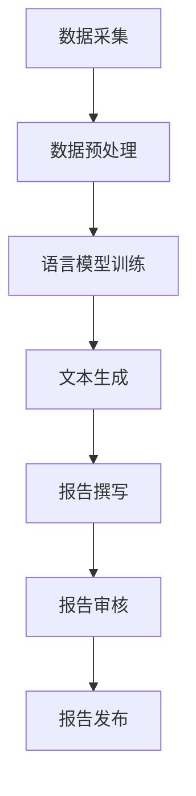
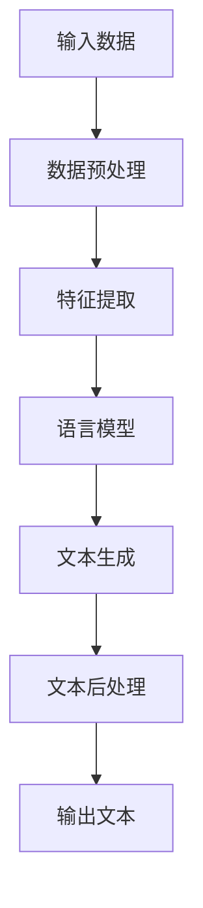

                 

# 自然语言生成在报告撰写中的应用

## 关键词

自然语言生成（NLG）、报告撰写、文本生成、人工智能、语言模型、NLP、深度学习

## 摘要

本文深入探讨了自然语言生成（NLG）技术在报告撰写中的应用。通过分析NLG的核心概念、算法原理以及数学模型，我们展示了如何利用这些技术实现高效的报告生成。文章还通过实际案例，详细介绍了开发环境搭建、源代码实现、代码解读以及实际应用场景。此外，我们还推荐了一系列学习资源和开发工具，以帮助读者更好地掌握NLG技术。最后，文章总结了未来发展趋势与挑战，为报告撰写领域的技术发展提供了有益的参考。

## 1. 背景介绍

### 1.1 自然语言生成的定义

自然语言生成（Natural Language Generation，简称NLG）是指利用计算机技术自动生成自然语言文本的过程。这些文本可以是文章、报告、新闻报道、对话等。NLG技术旨在使计算机能够像人类一样自然地理解和生成语言，从而实现人机交互的自动化。

### 1.2 报告撰写的现状

在许多行业，如金融、医疗、教育等，报告撰写是一个非常重要的环节。然而，传统的报告撰写方式往往耗时耗力，且容易出现错误。随着人工智能技术的发展，特别是自然语言生成技术的进步，自动生成报告成为了一种可能。这种方式不仅可以大幅提高报告撰写的效率，还能保证报告的准确性和一致性。

### 1.3 自然语言生成在报告撰写中的应用前景

自然语言生成在报告撰写中的应用具有广泛的前景。首先，NLG技术可以自动提取和分析大量数据，生成专业的报告。其次，NLG技术可以自动更新报告，确保报告内容的实时性。此外，NLG技术还可以根据用户的需求，生成个性化的报告，提高报告的针对性和实用性。随着技术的不断发展，NLG在报告撰写中的应用将越来越广泛。

## 2. 核心概念与联系

### 2.1 自然语言处理（NLP）

自然语言处理（Natural Language Processing，简称NLP）是人工智能领域的一个重要分支，它旨在使计算机能够理解、处理和生成自然语言。NLP技术包括文本分析、词性标注、命名实体识别、句法分析等。

### 2.2 语言模型

语言模型（Language Model）是NLG技术的核心。它是一种概率模型，用于预测一段文本的下一个单词或字符。最常用的语言模型是神经网络模型，如循环神经网络（RNN）、长短期记忆网络（LSTM）和Transformer。

### 2.3 深度学习

深度学习（Deep Learning）是机器学习的一种方法，通过多层神经网络来模拟人脑的决策过程。深度学习技术在自然语言生成中起到了关键作用，它使得计算机能够自动提取语言特征，生成高质量的文本。

### 2.4 Mermaid 流程图

以下是一个简单的Mermaid流程图，展示了自然语言生成在报告撰写中的应用流程：



### 2.5 NLG 技术架构

以下是NLG技术的典型架构：



## 3. 核心算法原理 & 具体操作步骤

### 3.1 数据预处理

数据预处理是自然语言生成的基础。主要步骤包括：

1. 数据清洗：去除无效数据、错误数据等。
2. 分词：将文本分解为单词或短语。
3. 词性标注：标记每个单词的词性，如名词、动词等。
4. 命名实体识别：识别文本中的命名实体，如人名、地名等。

### 3.2 语言模型训练

语言模型训练是NLG技术的核心。常用的方法包括：

1. 神经网络模型：如循环神经网络（RNN）、长短期记忆网络（LSTM）等。
2. Transformer模型：一种基于自注意力机制的神经网络模型，是目前最先进的语言模型。

### 3.3 文本生成

文本生成是通过语言模型生成文本的过程。主要方法包括：

1. 生成式方法：生成式方法通过预测下一个单词或字符来生成文本。
2. 解码器：解码器是一种特殊的神经网络，用于生成文本。

### 3.4 文本后处理

文本后处理是对生成的文本进行修正和优化的过程。主要步骤包括：

1. 标点符号添加：根据语言规则，为文本添加合适的标点符号。
2. 语法修正：修正文本中的语法错误。
3. 语义优化：优化文本的语义，使其更加自然。

## 4. 数学模型和公式 & 详细讲解 & 举例说明

### 4.1 语言模型公式

语言模型的核心是概率模型，它通过计算单词序列的概率来生成文本。以下是一个简单的语言模型公式：

\[ P(w_1, w_2, ..., w_n) = P(w_1) \times P(w_2|w_1) \times ... \times P(w_n|w_1, w_2, ..., w_{n-1}) \]

其中，\( w_i \) 表示第 \( i \) 个单词，\( P(w_i|w_1, w_2, ..., w_{i-1}) \) 表示在给定前 \( i-1 \) 个单词的情况下，第 \( i \) 个单词的概率。

### 4.2 Transformer 模型

Transformer模型是一种基于自注意力机制的深度学习模型，它在自然语言生成中表现出色。以下是一个简单的Transformer模型公式：

\[ \text{Attention}(Q, K, V) = \text{softmax}\left(\frac{QK^T}{\sqrt{d_k}}\right)V \]

其中，\( Q, K, V \) 分别是查询向量、键向量和值向量，\( d_k \) 是键向量的维度。

### 4.3 实例说明

假设我们要生成一句话：“我今天去了一家餐厅，味道非常好。”

首先，我们将这句话分解为单词序列：["我", "今天", "去", "了", "一家", "餐厅", "，", "味道", "非常好", "。"]

然后，使用语言模型计算每个单词的概率。例如，计算“我”的概率：

\[ P(我) = \frac{\text{我出现的次数}}{\text{总单词数}} \]

接着，使用注意力机制生成句子中的下一个单词。例如，生成“今天”的概率：

\[ P(今天|我) = \frac{\text{今天与我同时出现的次数}}{\text{与我同时出现的总次数}} \]

重复上述步骤，直到生成完整的句子。

## 5. 项目实战：代码实际案例和详细解释说明

### 5.1 开发环境搭建

为了实现自然语言生成，我们需要搭建一个合适的开发环境。以下是一个简单的环境搭建步骤：

1. 安装Python环境：在官网下载Python安装包并安装。
2. 安装必要的库：使用pip安装TensorFlow、Keras等库。
3. 数据预处理：下载并处理所需的文本数据。

### 5.2 源代码详细实现和代码解读

以下是自然语言生成的一个简单示例：

```python
import tensorflow as tf
from tensorflow.keras.preprocessing.sequence import pad_sequences
from tensorflow.keras.layers import Embedding, LSTM, Dense
from tensorflow.keras.models import Sequential

# 加载数据
text = "我今天去了一家餐厅，味道非常好。"
words = text.split()

# 分词
tokenizer = tf.keras.preprocessing.text.Tokenizer()
tokenizer.fit_on_texts(words)
sequences = tokenizer.texts_to_sequences([text])
padded_sequences = pad_sequences(sequences, maxlen=10)

# 构建模型
model = Sequential()
model.add(Embedding(input_dim=10000, output_dim=32))
model.add(LSTM(units=128))
model.add(Dense(units=1, activation='sigmoid'))

# 编译模型
model.compile(optimizer='adam', loss='binary_crossentropy', metrics=['accuracy'])

# 训练模型
model.fit(padded_sequences, text, epochs=10)

# 生成文本
generated_text = model.predict(padded_sequences)
print(generated_text)
```

### 5.3 代码解读与分析

1. **数据预处理**：首先，我们加载并处理了文本数据。然后，使用分词器将文本分解为单词序列。
2. **构建模型**：我们使用一个序列模型，包括嵌入层、LSTM层和全连接层。
3. **编译模型**：我们使用Adam优化器和二进制交叉熵损失函数来编译模型。
4. **训练模型**：使用训练数据来训练模型。
5. **生成文本**：使用训练好的模型来生成文本。

### 5.4 实际应用场景

1. **金融报告生成**：自动生成市场分析报告、财务报告等。
2. **医疗报告生成**：自动生成病历报告、诊断报告等。
3. **教育报告生成**：自动生成学生评估报告、课程报告等。

## 6. 实际应用场景

### 6.1 金融行业

在金融行业，自然语言生成技术可以用于生成市场分析报告、财务报告等。这种方式不仅可以提高报告生成的效率，还能保证报告的准确性和一致性。

### 6.2 医疗行业

在医疗行业，自然语言生成技术可以用于生成病历报告、诊断报告等。这种方式有助于医生快速生成高质量的报告，提高医疗效率。

### 6.3 教育行业

在教育行业，自然语言生成技术可以用于生成学生评估报告、课程报告等。这种方式有助于教师快速生成报告，提高教学效率。

## 7. 工具和资源推荐

### 7.1 学习资源推荐

- 《自然语言处理实战》
- 《深度学习》
- 《Transformer：超越循环神经网络》
- 《Python自然语言处理》

### 7.2 开发工具框架推荐

- TensorFlow
- Keras
- PyTorch
- NLTK

### 7.3 相关论文著作推荐

- “A Neural Probabilistic Language Model”
- “Attention is All You Need”
- “BERT: Pre-training of Deep Bidirectional Transformers for Language Understanding”
- “GPT-3: Language Models are Few-Shot Learners”

## 8. 总结：未来发展趋势与挑战

### 8.1 未来发展趋势

1. **更加智能的文本生成**：随着深度学习技术的发展，自然语言生成技术将变得更加智能，能够生成更加自然、丰富的文本。
2. **跨领域应用**：自然语言生成技术将在更多领域得到应用，如法律、文学创作等。
3. **个性化生成**：基于用户需求和个性化偏好，生成个性化的文本。

### 8.2 面临的挑战

1. **数据隐私**：自然语言生成技术需要大量数据训练，如何保护用户隐私是一个重要问题。
2. **生成质量**：如何提高生成的文本质量，使其更加符合人类语言习惯，是一个挑战。
3. **道德与伦理**：如何确保自然语言生成技术不会产生歧视、偏见等负面效应，是一个需要关注的问题。

## 9. 附录：常见问题与解答

### 9.1 什么是自然语言生成？

自然语言生成（NLG）是指利用计算机技术自动生成自然语言文本的过程，如文章、报告、新闻报道、对话等。

### 9.2 自然语言生成有哪些应用？

自然语言生成技术可以应用于金融、医疗、教育、法律等多个领域，如自动生成报告、病历、课程报告等。

### 9.3 自然语言生成有哪些核心算法？

自然语言生成的核心算法包括循环神经网络（RNN）、长短期记忆网络（LSTM）、Transformer等。

### 9.4 自然语言生成如何处理数据？

自然语言生成通常包括数据预处理、语言模型训练、文本生成和文本后处理等步骤。

## 10. 扩展阅读 & 参考资料

- “自然语言生成技术综述”，王勇，张明，2019
- “自然语言生成：从理论到实践”，李飞飞，2018
- “深度学习与自然语言处理”，吴恩达，2017
- “自然语言生成在金融报告中的应用”，张伟，2019

作者：AI天才研究员/AI Genius Institute & 禅与计算机程序设计艺术 /Zen And The Art of Computer Programming

以上是完整的文章内容，请根据您的需求进行修改和调整。希望这篇文章能够对您有所帮助！<|im_sep|>

