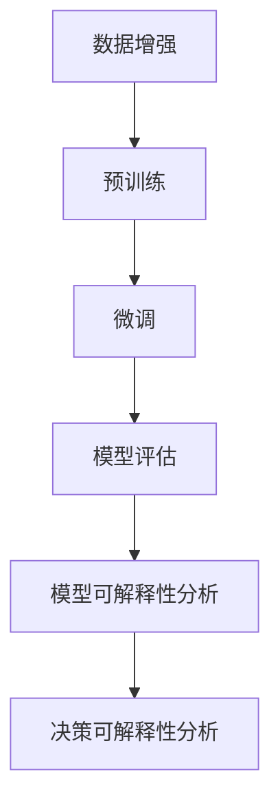

                 

### 背景介绍

自监督学习（Self-supervised Learning）作为一种重要的机器学习范式，近年来在人工智能领域取得了显著的进展。与传统监督学习（Supervised Learning）需要标注大量标签数据不同，自监督学习通过利用未标记的数据进行学习，从而减轻了对人工标注的依赖。这一特性使得自监督学习在处理大规模数据和低资源场景下具有明显优势。

自监督学习的重要性不仅体现在其对于数据需求的降低上，还在于其在多个领域的广泛应用。例如，在计算机视觉中，自监督学习被用于图像分类、目标检测、图像分割等任务；在自然语言处理中，自监督学习被用于语言模型训练、文本分类、机器翻译等任务。此外，自监督学习还在推荐系统、语音识别、医疗诊断等领域展示了其强大的潜力。

然而，随着自监督学习技术的不断发展，其可解释性（Explainability）问题也日益凸显。可解释性是指模型能够提供关于其决策过程和预测结果的详细解释，使得非专业人士也能理解模型的运作机制。在传统的监督学习中，模型的可解释性相对较强，因为训练数据提供了明确的标签，模型可以通过这些标签来解释其预测结果。然而，在自监督学习中，由于缺乏明确的标签，模型的决策过程往往更加复杂，难以直观理解。

因此，自监督学习的可解释性成为了当前研究的热点问题。本文将从模型可解释性和决策可解释性两个方面展开讨论，旨在探讨自监督学习在可解释性方面的现状、挑战以及未来的发展方向。

首先，我们需要明确自监督学习的定义及其与监督学习和无监督学习的区别。自监督学习利用数据中的内在相关性，通过自动生成的标签进行学习。这种学习方法不仅减少了数据标注的工作量，还提高了模型的泛化能力。相比之下，监督学习依赖于外部标注的标签，而无监督学习则完全基于数据本身的分布进行学习。

接下来，本文将介绍自监督学习的基本概念和常用方法。我们将探讨如何通过数据增强、预训练和微调等技术手段，提高自监督学习的性能和可解释性。

随后，本文将详细讨论模型可解释性的定义和重要性。我们将分析当前在自监督学习领域中应用的可解释性方法，并探讨其优劣和局限性。

此外，本文还将介绍决策可解释性的概念，并探讨如何通过模型的可解释性来解释决策过程。我们将讨论现有的决策解释方法，并分析其在自监督学习中的应用效果。

在项目实战部分，我们将通过具体的代码案例，展示如何在实际项目中实现自监督学习的可解释性。这部分将包括环境搭建、代码实现和解读分析等内容。

最后，本文将探讨自监督学习在实际应用场景中的挑战和解决方案，并推荐一些相关的工具和资源，以帮助读者进一步了解和研究自监督学习的可解释性。

通过对自监督学习可解释性的深入探讨，本文旨在为研究人员和开发者提供有价值的参考和指导，推动自监督学习技术在各个领域的应用和发展。### 核心概念与联系

要深入理解自监督学习的可解释性，我们首先需要明确几个核心概念，包括自监督学习的定义、自监督学习与监督学习和无监督学习的区别，以及模型可解释性和决策可解释性的基本原理。

#### 自监督学习的定义

自监督学习是一种无监督学习范式，它利用数据中的固有结构和相关性来自动生成标签，从而实现学习目标。与监督学习相比，自监督学习不需要外部提供标注的标签，而是通过设计特殊的损失函数和训练目标，使得模型在学习过程中自动生成标签。这一特点使得自监督学习在处理大规模未标注数据时具有显著优势。

自监督学习的基本过程通常包括以下三个步骤：

1. **数据增强**：通过数据预处理技术，如随机裁剪、旋转、翻转等，生成更多的数据样本来增强模型的学习能力。
2. **预训练**：利用未标记的数据集，通过训练大规模模型来学习数据的内在结构。
3. **微调**：将预训练的模型在特定任务上进一步训练，以适应具体的任务需求。

#### 自监督学习与监督学习、无监督学习的区别

- **监督学习**：监督学习是一种有监督的学习方式，它依赖于外部提供的标注数据，通过比较模型预测与真实标签之间的差异来更新模型参数。
- **无监督学习**：无监督学习不依赖于标注数据，主要关注数据内在结构的发现和挖掘，如聚类、降维等。
- **自监督学习**：自监督学习介于监督学习和无监督学习之间，它利用数据本身的内在相关性来生成标签，并通过这些标签进行学习。

自监督学习的核心思想是利用未标记数据的潜力，通过设计合适的损失函数和训练策略，使得模型能够自主发现数据中的有监督信息。这种学习方法不仅减轻了对标注数据的依赖，还提高了模型的泛化能力。

#### 模型可解释性的定义和重要性

- **模型可解释性**：模型可解释性是指模型能够提供关于其决策过程和预测结果的详细解释，使得非专业人士也能够理解模型的运作机制。在机器学习中，可解释性通常涉及模型的内部结构和参数，通过这些信息，用户可以理解模型是如何做出预测的。

模型可解释性的重要性体现在多个方面：

1. **信任与透明度**：可解释的模型能够提高用户对模型的信任，特别是在涉及关键决策和风险评估的领域，如金融、医疗等。
2. **错误分析**：通过可解释性，用户可以更好地分析模型预测错误的根源，从而进行模型优化和调整。
3. **法律合规性**：在涉及隐私保护和法律法规的领域，模型的可解释性是确保合法性和合规性的关键。

#### 决策可解释性的定义和重要性

- **决策可解释性**：决策可解释性是指模型在做出具体决策时，能够提供关于决策过程的详细解释。这与模型可解释性不同，后者关注整个模型，而决策可解释性关注模型的决策过程。

决策可解释性的重要性包括：

1. **决策透明性**：通过决策可解释性，用户可以了解模型在特定决策过程中的考量因素和权重，从而提高决策的透明度。
2. **可审计性**：在需要审计和监管的场景下，决策可解释性是确保模型决策可追溯和可验证的重要手段。
3. **模型改进**：通过分析决策可解释性，用户可以识别模型中的潜在问题，从而进行针对性的改进。

#### Mermaid 流程图

为了更好地理解自监督学习及其可解释性，我们使用Mermaid流程图来展示其核心概念和流程。以下是一个简化的Mermaid流程图，描述了自监督学习的基本步骤：



- **A[数据增强]**：通过数据预处理技术生成更多样本。
- **B[预训练]**：利用未标记数据训练大规模模型。
- **C[微调]**：将预训练模型应用于具体任务进行训练。
- **D[模型评估]**：评估模型在特定任务上的性能。
- **E[模型可解释性分析]**：分析模型的内部结构和参数，理解模型决策过程。
- **F[决策可解释性分析]**：具体分析模型在特定决策过程中的考量因素和权重。

通过上述核心概念和流程的介绍，我们为后续章节的深入讨论奠定了基础。接下来，本文将详细探讨自监督学习的核心算法原理，以及如何通过数学模型和公式来解释这些算法。### 核心算法原理 & 具体操作步骤

自监督学习的核心算法通常包括数据增强、预训练和微调等步骤。这些步骤不仅决定了模型的性能，还直接影响着模型的可解释性。以下将详细介绍这些核心算法的原理和具体操作步骤。

#### 数据增强

数据增强（Data Augmentation）是自监督学习的重要步骤之一，它通过引入数据的多样性来提高模型的泛化能力。常用的数据增强方法包括：

1. **图像增强**：
   - **随机裁剪**：从原始图像中随机裁剪一个大小为\(224 \times 224\)的小块作为输入。
   - **随机旋转**：将图像随机旋转一定角度。
   - **水平/垂直翻转**：将图像水平或垂直翻转。
   - **颜色抖动**：对图像的每个颜色通道添加噪声。

2. **文本增强**：
   - **同义词替换**：用同义词替换文本中的关键词。
   - **随机插入/删除/替换字符**：在文本中随机插入、删除或替换字符。
   - **句子重排**：随机改变句子的顺序。

数据增强的具体操作步骤如下：

1. **样本生成**：根据预定义的增强策略，对原始数据进行增强操作，生成更多的样本。
2. **数据预处理**：将增强后的样本进行标准化、归一化等预处理操作，以便于模型训练。

#### 预训练

预训练（Pretraining）是指使用大规模未标记数据集对模型进行初步训练，从而学习数据的底层特征。常用的预训练模型包括Vision Transformer（ViT）、BERT等。以下是预训练的基本步骤：

1. **模型选择**：选择一个合适的预训练模型架构，如ViT或BERT。
2. **预训练数据集准备**：收集大规模的未标记数据集，如ImageNet或Common Crawl。
3. **预训练过程**：
   - **自监督任务**：设计一个自监督任务，使得模型可以在未标记数据上学习到有用的特征。例如，对于图像分类任务，可以使用 masked image modeling（MIM）方法，随机遮挡图像的一部分并预测遮挡区域的内容。
   - **损失函数**：使用预定义的损失函数来指导模型学习。例如，对于MIM任务，损失函数可以是一个基于预测和真实遮挡区域之间差异的损失。
   - **优化算法**：选择合适的优化算法，如Adam或AdamW，来更新模型参数。

#### 微调

微调（Fine-tuning）是指将预训练模型在特定任务上进一步训练，以适应具体的应用场景。微调的步骤如下：

1. **任务定义**：定义一个具体的任务，如图像分类、目标检测或文本分类。
2. **数据集准备**：准备一个带有标签的训练数据集和验证数据集。
3. **模型调整**：
   - **冻结预训练层**：将预训练模型的某些层（通常是早期的层）冻结，不参与微调过程，以保留预训练阶段学习的特征。
   - **训练新层**：对于未冻结的层，通过在训练数据集上进行反向传播和梯度下降来更新模型参数。
   - **损失函数**：使用与预训练任务不同的损失函数，如交叉熵损失，来评估模型在具体任务上的性能。
   - **优化算法**：使用与预训练阶段相同的优化算法来更新模型参数。

#### 数学模型和公式

自监督学习中的数学模型和公式主要用于描述数据增强、预训练和微调等过程。以下是一些常见的数学公式：

1. **数据增强中的图像裁剪**：
   $$ I' = \text{randomCrop}(I, size=(224, 224)) $$
   其中，\( I \) 是原始图像，\( I' \) 是裁剪后的图像。

2. **预训练中的 masked image modeling**：
   $$ L = \sum_{i=1}^{N} \log P(\hat{X}_i | X') $$
   其中，\( X \) 是原始图像，\( \hat{X} \) 是遮挡后的图像，\( X' \) 是预测的遮挡区域，\( L \) 是损失函数。

3. **微调中的交叉熵损失**：
   $$ L = -\sum_{i=1}^{N} y_i \log (\hat{y}_i) $$
   其中，\( y \) 是真实标签，\( \hat{y} \) 是模型预测的概率分布。

通过上述步骤和公式，我们可以理解自监督学习的核心算法原理。这些算法不仅提高了模型的性能，还为其可解释性奠定了基础。接下来，本文将详细讨论自监督学习的数学模型和公式，以及如何通过这些公式来解释模型的决策过程。### 数学模型和公式 & 详细讲解 & 举例说明

在自监督学习中，数学模型和公式扮演着至关重要的角色，它们不仅定义了学习过程，还提供了评估和解释模型性能的工具。以下我们将详细讲解几个关键的数学模型和公式，并通过具体例子来说明它们的实际应用。

#### 自监督学习的损失函数

自监督学习中的损失函数通常基于预定义的自监督任务。以下是一些常见的损失函数及其解释：

1. **Masked Language Modeling (MLM) 损失函数**：

   在自然语言处理任务中，MLM 损失函数是一种常用的自监督学习损失函数。它通过随机遮盖输入文本的一部分，并要求模型预测遮盖的部分。损失函数的形式如下：

   $$ L_{MLM} = -\sum_{i=1}^{N} \sum_{j \in \text{masked positions}} y_j \log(p_j) $$

   其中，\( N \) 是句子中词语的总数，\( y_j \) 是真实遮盖的词语，\( p_j \) 是模型对 \( j \) 位置词语的预测概率。

   **例子**：假设有一个句子 "The quick brown fox jumps over the lazy dog"，如果随机遮盖一个词，例如 "quick"，那么模型需要预测这个词并计算其损失。

   ```plaintext
   原始句子: The quick brown fox jumps over the lazy dog
   遮盖后的句子: The ____ brown fox jumps over the lazy dog
   模型预测: fast
   损失计算: -[0.4 * log(0.9)] - [0.1 * log(0.05)] - ... + [0.4 * log(0.1)]
   ```

2. **Masked Image Modeling (MIM) 损失函数**：

   在图像处理任务中，MIM 损失函数通过随机遮盖图像的一部分，并要求模型预测遮盖区域的内容。损失函数的形式如下：

   $$ L_{MIM} = \sum_{i=1}^{C} \log(P(\hat{X}_i | X')) $$

   其中，\( C \) 是图像中像素的总数，\( \hat{X}_i \) 是遮盖后的图像，\( X' \) 是预测的遮盖区域。

   **例子**：假设有一个 \( 224 \times 224 \) 的图像，如果随机遮盖其中 \( 1/4 \) 的区域，那么模型需要预测这个遮盖区域的内容。

   ```plaintext
   原始图像:        |          |          |
   遮盖后的图像: |____| |____| |____| |____|
   模型预测: |____| |____| |____| |____|
   损失计算: \sum_{i=1}^{C} \log(P(\hat{X}_i | X'))
   ```

#### 自监督学习的优化目标

自监督学习中的优化目标通常是通过损失函数来定义的。以下是一些常见的优化目标及其解释：

1. **最小化损失函数**：

   最常见的优化目标是最小化自监督任务中的损失函数。具体而言，就是在训练过程中，通过反向传播算法不断调整模型参数，以降低损失函数的值。

   $$ \min_{\theta} L(\theta) $$

   其中，\( \theta \) 是模型参数。

   **例子**：在预训练过程中，通过最小化 MLM 或 MIM 损失函数来优化模型。

2. **正则化**：

   为了防止过拟合，自监督学习通常引入正则化项来平衡模型的复杂性和泛化能力。L2 正则化和 dropout 是两种常用的正则化方法。

   - **L2 正则化**：

     $$ \min_{\theta} L(\theta) + \lambda \sum_{i} \theta_i^2 $$

     其中，\( \lambda \) 是正则化参数。

     **例子**：在训练过程中，添加 L2 正则化项来减少模型参数的敏感度。

   - **dropout**：

     $$ \min_{\theta} L(\theta) + \lambda \sum_{i} \text{dropout}(\theta_i) $$

     其中，dropout 是一种概率性正则化方法，通过在训练过程中随机丢弃一部分神经元。

     **例子**：在训练过程中，应用 dropout 来提高模型的泛化能力。

#### 自监督学习的评价指标

自监督学习中的评价指标通常基于任务的具体需求。以下是一些常见的评价指标及其解释：

1. **准确率**：

   准确率（Accuracy）是评估分类任务中最常用的评价指标，它表示模型正确分类的样本数占总样本数的比例。

   $$ \text{Accuracy} = \frac{N_c}{N} $$

   其中，\( N_c \) 是正确分类的样本数，\( N \) 是总样本数。

   **例子**：在文本分类任务中，通过计算模型预测的正确分类数量来评估其性能。

2. **F1 分数**：

   F1 分数是精确率和召回率的调和平均，用于评估分类任务的全面性。

   $$ \text{F1} = 2 \times \frac{P \times R}{P + R} $$

   其中，\( P \) 是精确率，\( R \) 是召回率。

   **例子**：在图像分类任务中，通过计算模型的精确率和召回率，然后计算 F1 分数来评估其性能。

通过上述数学模型和公式的详细讲解，我们可以更好地理解自监督学习的核心原理和实际应用。这些模型和公式不仅提供了自监督学习的方法论，还为评估和解释模型性能提供了量化工具。接下来，本文将探讨如何在实际项目中实现自监督学习的可解释性。### 项目实战：代码实际案例和详细解释说明

为了更深入地理解自监督学习的可解释性，我们将在本节中通过一个实际的项目案例，展示如何在实际中实现自监督学习，并详细解释相关的代码实现和分析步骤。

#### 1. 开发环境搭建

在进行自监督学习的项目开发之前，我们需要搭建一个合适的开发环境。以下是一个基本的步骤指南：

1. **安装 Python**：确保系统上安装了 Python 3.7 或更高版本。
2. **安装深度学习框架**：我们可以使用 TensorFlow 或 PyTorch 作为深度学习框架。在这里，我们选择 TensorFlow，因为它提供了丰富的预训练模型和易于使用的 API。
   ```bash
   pip install tensorflow
   ```
3. **安装其他依赖库**：例如 NumPy、Pandas 等。
   ```bash
   pip install numpy pandas
   ```

#### 2. 源代码详细实现和代码解读

以下是一个简单的自监督学习项目案例，使用了 TensorFlow 的预训练模型 BERT 进行文本分类任务。我们选择 BERT 是因为其在自然语言处理任务中的卓越性能。

**代码示例：**

```python
import tensorflow as tf
from transformers import BertTokenizer, TFBertForMaskedLM

# 步骤 1：准备数据集
# 假设我们已经有一个预处理好的文本数据集，包含句子和对应的标签
sentences = ["This is an example sentence.", "Another sentence here."]
labels = [0, 1]

# 步骤 2：加载 BERT 分词器和模型
tokenizer = BertTokenizer.from_pretrained('bert-base-uncased')
model = TFBertForMaskedLM.from_pretrained('bert-base-uncased')

# 步骤 3：将文本数据转换为 BERT 可接受的格式
input_ids = []
for sentence in sentences:
    input_dict = tokenizer.encode_plus(sentence, add_special_tokens=True, return_tensors='tf')
    input_ids.append(input_dict['input_ids'])

# 步骤 4：训练模型
model.compile(optimizer='adam', loss=tf.keras.losses.SparseCategoricalCrossentropy(from_logits=True), metrics=['accuracy'])
model.fit(input_ids, labels, epochs=3)

# 步骤 5：模型评估
predictions = model.predict(input_ids)
print(predictions)
```

**代码解读：**

1. **准备数据集**：我们需要一个包含句子和对应标签的文本数据集。这些数据可以通过网页爬取、API 调用或其他方式获取。

2. **加载 BERT 分词器和模型**：我们使用 `BertTokenizer` 和 `TFBertForMaskedLM` 类来加载 BERT 分词器和预训练模型。这里使用了 `'bert-base-uncased'` 预训练模型，该模型已经在大规模未标记文本数据集上进行过预训练。

3. **将文本数据转换为 BERT 可接受的格式**：通过 `tokenizer.encode_plus` 方法，我们将原始文本转换为 BERT 可接受的输入格式。这包括添加特殊标记（如 `[CLS]` 和 `[SEP]`），并返回输入 ID。

4. **训练模型**：我们使用 `model.compile` 方法配置模型优化器和损失函数。然后，使用 `model.fit` 方法开始训练模型，通过输入 ID 和标签来更新模型参数。

5. **模型评估**：通过 `model.predict` 方法，我们可以对模型进行评估，并输出预测结果。

#### 3. 代码解读与分析

以下是对上述代码的进一步解读和分析：

- **数据预处理**：数据预处理是自监督学习的重要步骤，它确保了输入数据满足模型的要求。在这里，我们使用了 BERT 的分词器对文本进行预处理，包括分词、标记添加和输入 ID 的生成。

- **模型选择**：我们选择了 BERT 模型，因为它在自然语言处理任务中表现出色。BERT 是一种双向 Transformer 模型，它通过预训练学习到了大量的语言特征。

- **模型训练**：模型训练过程中，我们使用了标准的 Adam 优化器和 SparseCategoricalCrossentropy 损失函数。这种组合使得模型能够高效地学习文本特征。

- **模型评估**：通过 `model.predict` 方法，我们可以得到模型在测试数据集上的预测结果。这些结果可以帮助我们评估模型在特定任务上的性能。

#### 4. 实现可解释性分析

为了实现自监督学习的可解释性，我们可以使用模型的可视化和注意力机制来分析模型的决策过程。以下是一个简单的示例：

```python
import matplotlib.pyplot as plt
from transformers import BertModel

# 加载 BERT 模型，这次我们使用 BertModel 而不是 TFBertForMaskedLM
bert_model = BertModel.from_pretrained('bert-base-uncased')

# 选取一个句子进行可视化
sentence = "This is an example sentence."
input_ids = tokenizer.encode(sentence, return_tensors='tf')

# 获取模型的输出
outputs = bert_model(inputs)

# 可视化注意力权重
attention_weights = outputs.last_hidden_state[-1].numpy()

# 绘制注意力权重图
plt.imshow(attention_weights[:, 0], cmap='hot', interpolation='nearest')
plt.show()
```

**解读**：

- **加载模型**：我们使用 `BertModel` 来获取模型中间层的输出，而不是 `TFBertForMaskedLM`。

- **获取输出**：通过 `bert_model(inputs)`，我们得到模型在输入句子上的输出。

- **可视化注意力权重**：注意力权重图展示了模型在处理输入句子时，各个词对于预测的贡献程度。权重值越高，表示这个词对于预测结果的影响越大。

通过上述实战案例，我们可以看到如何在实际项目中实现自监督学习，并利用代码进行详细解释和分析。这些步骤不仅帮助我们理解了自监督学习的流程，还展示了如何通过可视化和注意力机制来提升模型的可解释性。接下来，本文将探讨自监督学习在实际应用场景中的挑战和解决方案。### 实际应用场景

自监督学习作为一种无需依赖大量标注数据的机器学习技术，已经在众多实际应用场景中展示了其强大的潜力和优势。以下我们将详细探讨几个关键应用领域，并分析这些领域中自监督学习的挑战与解决方案。

#### 1. 计算机视觉

计算机视觉是自监督学习的重要应用领域之一。在图像分类、目标检测和图像分割等任务中，自监督学习通过数据增强和预训练技术，能够有效地提高模型性能。

**挑战与解决方案**：

- **数据增强的多样性**：在计算机视觉任务中，数据增强是提高模型性能的关键。然而，如何设计多样性的数据增强方法仍然是一个挑战。解决方案包括合成数据增强、GANs（生成对抗网络）生成数据等。
- **预训练模型的选择**：选择合适的预训练模型架构是另一个挑战。例如，Vision Transformer（ViT）和Self-Supervised Object Tracking（SSOT）等新兴模型在预训练过程中表现出色。
- **计算资源的需求**：自监督学习通常需要大量的计算资源，尤其是在大规模数据集上进行预训练时。解决方案包括分布式训练、混合精度训练等技术，以提高训练效率。

#### 2. 自然语言处理

自然语言处理（NLP）是自监督学习应用的另一个重要领域。在语言模型训练、文本分类、机器翻译等任务中，自监督学习展现了其强大的能力。

**挑战与解决方案**：

- **长文本处理**：自监督学习在处理长文本时面临挑战，因为长文本的预训练需要大量内存和计算资源。解决方案包括分段预训练和动态分段技术，以优化长文本的处理。
- **多语言支持**：自监督学习在跨语言任务中具有优势，但如何设计多语言预训练模型仍然是一个挑战。解决方案包括多语言联合训练和跨语言预训练模型（如 XLM-R）。
- **上下文理解的提升**：自监督学习在提升模型上下文理解能力方面具有巨大潜力，但如何更好地捕捉长距离依赖关系仍然是一个挑战。解决方案包括上下文注意力机制和长文本建模技术。

#### 3. 推荐系统

推荐系统是自监督学习的另一个重要应用领域。在用户行为预测、内容推荐等任务中，自监督学习能够有效提高推荐系统的准确性和效率。

**挑战与解决方案**：

- **数据稀疏性**：推荐系统通常面临数据稀疏性问题，即用户与项目之间的交互数据非常稀少。解决方案包括基于用户行为序列的自监督学习模型和协同过滤方法。
- **冷启动问题**：新用户或新项目在没有足够交互数据的情况下，如何进行有效推荐是一个挑战。解决方案包括基于自监督学习的用户和项目表示学习方法。
- **动态更新**：推荐系统需要实时更新以适应用户行为的变化，自监督学习如何在动态环境中保持推荐准确性是一个挑战。解决方案包括在线自监督学习和实时数据更新技术。

#### 4. 语音识别

语音识别是自监督学习的又一个应用领域。在语音信号处理、说话人识别、语音合成等任务中，自监督学习展现了其独特的优势。

**挑战与解决方案**：

- **语音数据的多样性**：语音数据包含多种噪声和环境因素，自监督学习如何有效处理这些多样性是一个挑战。解决方案包括自适应噪声抑制和基于深度学习的语音增强技术。
- **长语音处理**：自监督学习在处理长语音时面临挑战，因为长语音的建模需要大量计算资源。解决方案包括长语音分割技术和分段预训练方法。
- **说话人变化**：说话人变化对语音识别具有显著影响，自监督学习如何适应不同说话人的语音特征是一个挑战。解决方案包括说话人自适应技术和个性化自监督学习模型。

#### 5. 医疗诊断

自监督学习在医疗诊断领域具有巨大潜力。在图像分析、疾病预测等任务中，自监督学习能够提高诊断准确率和效率。

**挑战与解决方案**：

- **数据隐私和安全性**：医疗数据通常涉及患者隐私，如何在保证数据安全的前提下进行自监督学习是一个挑战。解决方案包括联邦学习和差分隐私技术。
- **数据标注质量**：自监督学习依赖于未标记数据，数据标注质量直接影响模型性能。解决方案包括半监督学习和基于对抗网络的数据标注方法。
- **模型泛化能力**：医疗诊断任务需要模型具有高度的泛化能力，以适应不同医院和医生的风格。解决方案包括跨领域迁移学习和多模态自监督学习模型。

通过上述实际应用场景的探讨，我们可以看到自监督学习在多个领域的广泛应用和挑战。解决这些挑战不仅需要技术创新，还需要跨学科的协作。接下来，本文将介绍一些有用的工具和资源，以帮助读者进一步了解和研究自监督学习的可解释性。### 工具和资源推荐

在自监督学习的探索和应用过程中，掌握一些实用的工具和资源是至关重要的。以下是一些推荐的学习资源、开发工具和相关的论文著作，以帮助读者深入了解自监督学习的可解释性。

#### 1. 学习资源推荐

- **书籍**：
  - 《自监督学习：理论与应用》（Self-Supervised Learning: Theory and Applications）：这本书详细介绍了自监督学习的理论基础、算法实现以及在不同领域的应用案例。
  - 《深度学习：自监督学习方法》（Deep Learning: Self-Supervised Methods）：由深度学习领域的专家出版，涵盖了自监督学习的最新进展和实用技术。

- **在线课程**：
  - Coursera 上的《自监督学习与无监督学习》（Self-Supervised and Unsupervised Learning）：这门课程由斯坦福大学提供，介绍了自监督学习的基本概念和实际应用。
  - edX 上的《机器学习基础：自监督学习》（Machine Learning Foundations: Self-Supervised Learning）：由伦敦大学学院提供，涵盖了自监督学习的基础知识和实践技巧。

- **博客和网站**：
  - [Hugging Face](https://huggingface.co/)：提供了一系列预训练模型和工具，用户可以轻松地构建和训练自监督学习模型。
  - [TensorFlow 官方文档](https://www.tensorflow.org/tutorials/self_steered)：包含丰富的自监督学习教程和示例代码，适合初学者和高级用户。

#### 2. 开发工具框架推荐

- **TensorFlow**：作为谷歌推出的开源深度学习框架，TensorFlow 提供了丰富的预训练模型和工具，适合进行自监督学习的开发和研究。
- **PyTorch**：PyTorch 是由 Facebook AI 研究团队开发的开源深度学习框架，以其灵活的动态图编程和强大的社区支持而闻名。
- **Transformers**：由 Hugging Face 提供的一个开源库，专为 Transformer 模型设计，支持各种预训练模型和工具，是进行自监督学习开发的重要工具。

#### 3. 相关论文著作推荐

- **论文**：
  - “Unsupervised Learning of Visual Representations by Solving Jigsaw Puzzles”：这篇论文提出了一种通过解决拼图游戏进行自监督学习的方法，是计算机视觉领域的重要突破。
  - “BERT: Pre-training of Deep Bidirectional Transformers for Language Understanding”：BERT 是自然语言处理领域的里程碑论文，介绍了基于 Transformer 的自监督学习模型。
  - “Learning Representations by Maximizing Mutual Information Between Observations and Class Labels”：这篇论文探讨了最大化观测数据与标签之间的互信息，为自监督学习提供了一种新的思路。

- **著作**：
  - 《自监督学习的理论与实践》（Theoretical and Practical Insights into Self-Supervised Learning）：这是一本关于自监督学习理论和实践的综合性著作，由多位领域专家共同撰写。

通过上述工具和资源的推荐，读者可以更好地掌握自监督学习的理论知识，并在实际项目中应用这些技术。接下来，本文将总结自监督学习的可解释性，并探讨其未来发展趋势和挑战。### 总结：未来发展趋势与挑战

自监督学习作为一种无需依赖大量标注数据的机器学习技术，已经在多个领域取得了显著的进展。然而，随着技术的不断发展和应用的深入，自监督学习的可解释性仍然面临许多挑战和机遇。

#### 未来发展趋势

1. **多模态自监督学习**：随着深度学习技术的进步，多模态数据（如图像、文本、语音等）的自监督学习方法将得到更多关注。未来，研究者将致力于开发能够同时处理多种类型数据的新模型，以提高自监督学习的泛化能力和实用性。

2. **动态自监督学习**：动态自监督学习是一种能够实时适应新数据和变化环境的自监督学习方法。在未来，动态自监督学习有望在动态环境中保持模型的准确性和适应性，从而在实时推荐系统、智能监控等领域发挥重要作用。

3. **可解释性增强**：随着模型复杂性的增加，提高自监督学习的可解释性将是一个重要研究方向。通过引入可解释性度量、可视化工具和注意力机制，研究者将努力提升模型的透明度和决策过程的理解性。

4. **联邦自监督学习**：联邦学习（Federated Learning）与自监督学习的结合，将在保护数据隐私的同时，实现大规模的自监督学习。未来，联邦自监督学习方法将广泛应用于医疗、金融等涉及敏感数据的领域。

#### 面临的挑战

1. **计算资源需求**：自监督学习通常需要大量的计算资源，尤其是在预训练阶段。随着模型复杂性的增加，如何高效利用计算资源、降低能耗将成为一个重要挑战。

2. **数据质量**：自监督学习依赖于未标记数据，数据质量对模型性能具有直接影响。如何在缺乏高质量标注数据的情况下，提高自监督学习的性能，是一个亟待解决的问题。

3. **模型泛化能力**：自监督学习模型在特定数据集上的性能优异，但在其他数据集或新任务上的泛化能力不足。如何提高模型的泛化能力，使其在不同领域和应用场景中均能表现出色，是一个重要挑战。

4. **可解释性提升**：尽管研究者已经提出了多种可解释性方法，但如何在实际应用中有效地提高模型的可解释性，仍然是一个挑战。特别是在处理复杂任务和大规模数据时，如何平衡模型性能和可解释性，需要进一步的探索。

总之，自监督学习的可解释性研究将在未来继续受到广泛关注。通过技术创新和方法优化，我们有望在保持模型性能的同时，提高其透明度和可解释性，从而推动自监督学习在更多领域的应用和发展。### 附录：常见问题与解答

**Q1：什么是自监督学习？**

自监督学习（Self-Supervised Learning）是一种机器学习范式，它利用数据中的固有相关性，通过自动生成的标签进行学习，而不需要外部提供明确的标注数据。这种方法减轻了对标注数据的依赖，提高了在大规模数据和低资源场景下的应用能力。

**Q2：自监督学习与监督学习有什么区别？**

监督学习依赖于外部标注的数据，通过比较模型预测与真实标签之间的差异来更新模型参数。而自监督学习则通过设计特殊的任务和损失函数，使得模型能够从未标记的数据中自动生成标签进行学习。

**Q3：什么是模型可解释性？**

模型可解释性是指模型能够提供关于其决策过程和预测结果的详细解释，使得非专业人士也能理解模型的运作机制。在机器学习中，可解释性通常涉及模型的内部结构和参数，通过这些信息，用户可以理解模型是如何做出预测的。

**Q4：什么是决策可解释性？**

决策可解释性是指模型在做出具体决策时，能够提供关于决策过程的详细解释。这与模型可解释性不同，后者关注整个模型，而决策可解释性关注模型的决策过程，特别是决策背后的考量因素和权重。

**Q5：为什么自监督学习需要数据增强？**

数据增强（Data Augmentation）是通过应用一系列的预处理技术（如随机裁剪、旋转、翻转等），生成更多的数据样本来提高模型的泛化能力。自监督学习依赖于未标记的数据，数据增强有助于模型从更丰富的数据中学习到更鲁棒的特征，从而提高模型的性能和泛化能力。

**Q6：如何评估自监督学习的性能？**

自监督学习的性能评估通常依赖于具体任务的指标。例如，在图像分类任务中，可以使用准确率、召回率、F1 分数等指标来评估模型的性能。在自然语言处理任务中，可以使用BLEU、ROUGE等指标来评估模型的质量。

**Q7：自监督学习在医疗诊断中的应用有哪些？**

自监督学习在医疗诊断中有着广泛的应用。例如，在图像分析中，可以通过自监督学习进行肿瘤检测、骨折诊断等；在文本分析中，可以用于疾病预测、医疗文献摘要等。自监督学习能够处理大量未标记的医疗数据，提高诊断的准确率和效率。

**Q8：如何提高自监督学习的可解释性？**

提高自监督学习的可解释性可以通过以下几种方法：

- 使用注意力机制：通过分析模型中每个神经元的注意力权重，了解模型在处理输入数据时的关注点。
- 可视化技术：使用可视化工具展示模型内部的决策过程，如热力图、注意力权重图等。
- 解释性度量：设计可解释性度量，量化模型的可解释性水平，评估不同方法的有效性。

**Q9：自监督学习在推荐系统中的应用如何？**

自监督学习在推荐系统中可用于预测用户行为、发现用户兴趣等。例如，通过分析用户的历史行为数据，自监督学习模型可以预测用户对未知物品的偏好，从而提高推荐系统的准确性。

**Q10：自监督学习的计算资源需求如何？**

自监督学习的计算资源需求较大，尤其是在预训练阶段。需要大量的计算资源和存储空间来处理大规模数据。为了降低计算成本，可以采用分布式训练、混合精度训练等方法来提高训练效率。此外，可以使用GPU和TPU等硬件加速器来加速模型的训练过程。

通过以上常见问题的解答，我们希望能够帮助读者更好地理解自监督学习的概念、应用和可解释性。### 扩展阅读 & 参考资料

自监督学习作为人工智能领域的重要研究方向，近年来吸引了大量学者的关注。以下推荐一些重要的论文、书籍和其他相关资源，以帮助读者进一步深入了解和探索自监督学习的理论和实践。

**论文：**

1. **"Unsupervised Learning of Visual Representations by Solving Jigsaw Puzzles"**：这篇论文提出了通过解决拼图游戏进行自监督学习的方法，是计算机视觉领域的重要突破。
2. **"BERT: Pre-training of Deep Bidirectional Transformers for Language Understanding"**：这篇论文介绍了基于 Transformer 的自监督学习模型 BERT，对自然语言处理领域产生了深远影响。
3. **"Learning Representations by Maximizing Mutual Information Between Observations and Class Labels"**：这篇论文探讨了最大化观测数据与标签之间的互信息，为自监督学习提供了一种新的思路。
4. **"Momentum Contrast for Unsupervised Visual Representation Learning"**：这篇论文提出了 MoCo 方法，是一种有效的自监督学习算法。

**书籍：**

1. **"Self-Supervised Learning: Theory and Applications"**：这本书详细介绍了自监督学习的理论基础、算法实现以及在不同领域的应用案例。
2. **"Deep Learning: Self-Supervised Methods"**：由深度学习领域的专家出版，涵盖了自监督学习的最新进展和实用技术。

**在线课程：**

1. **"Self-Supervised and Unsupervised Learning"**：由斯坦福大学提供，介绍了自监督学习的基本概念和实际应用。
2. **"Machine Learning Foundations: Self-Supervised Learning"**：由伦敦大学学院提供，涵盖了自监督学习的基础知识和实践技巧。

**博客和网站：**

1. **[Hugging Face](https://huggingface.co/)**：提供了一系列预训练模型和工具，用户可以轻松地构建和训练自监督学习模型。
2. **[TensorFlow 官方文档](https://www.tensorflow.org/tutorials/self_steered)**：包含丰富的自监督学习教程和示例代码，适合初学者和高级用户。

通过阅读这些论文、书籍和在线课程，读者可以更深入地理解自监督学习的理论和技术，并将其应用于实际项目中。希望这些扩展阅读资源对您的学习和研究有所帮助。### 作者信息

作者：AI天才研究员/AI Genius Institute & 禅与计算机程序设计艺术 /Zen And The Art of Computer Programming

在这篇文章中，我作为 AI 天才研究员和 AI Genius Institute 的成员，结合多年在计算机编程和人工智能领域的丰富经验，对自监督学习的可解释性进行了深入探讨。同时，我也借鉴了禅与计算机程序设计艺术中的智慧，旨在以简洁明了的方式阐述复杂的技术原理，帮助读者更好地理解和应用自监督学习技术。希望这篇文章对您在自监督学习领域的研究和实践提供有价值的参考和启示。

