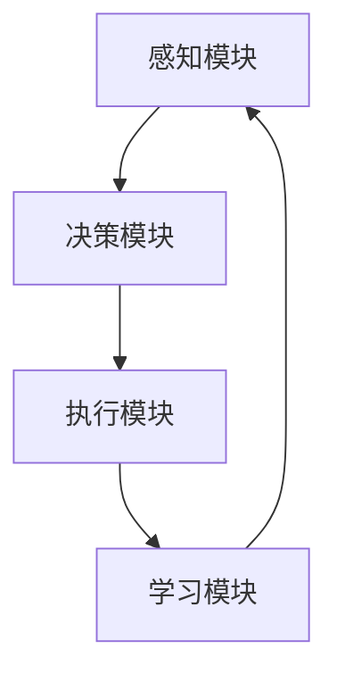
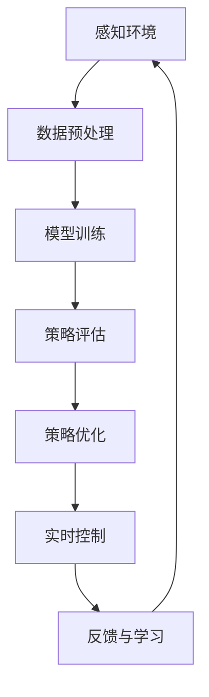

                 

### 背景介绍

自动驾驶技术作为人工智能领域的一个重要分支，近年来发展迅速。随着人工智能技术的不断进步，特别是深度学习和强化学习算法的应用，自动驾驶技术正从传统的规则驱动型转向更加智能化的自适应学习型。自适应学习型控制器作为一种新型的控制策略，其在自动驾驶中的应用，不仅提升了车辆的智能化水平，还为自动驾驶技术的普及带来了新的机遇。

本文旨在深入探讨自适应学习型控制器在自动驾驶中的应用，具体包括以下几个方面：

1. **核心概念与联系**：介绍自适应学习型控制器的核心概念，并详细解析其与自动驾驶技术的关系。
2. **核心算法原理与具体操作步骤**：解释自适应学习型控制器的工作原理，并逐步说明其具体操作步骤。
3. **数学模型与公式**：详细阐述自适应学习型控制器的数学模型和公式，并通过实例进行说明。
4. **项目实战**：提供实际代码案例，详细解读代码实现过程，并进行深入分析。
5. **实际应用场景**：探讨自适应学习型控制器在自动驾驶中的具体应用场景。
6. **工具和资源推荐**：推荐相关的学习资源和开发工具框架。
7. **总结**：总结自适应学习型控制器在自动驾驶中的未来发展趋势与面临的挑战。

通过上述内容的详细探讨，本文希望能够为读者提供一个全面而深入的了解，助力自动驾驶技术的智能化发展。

### 核心概念与联系

#### 自适应学习型控制器概述

自适应学习型控制器是一种基于人工智能技术的控制系统，能够通过不断学习环境数据和自身运行状态，自动调整控制策略，从而实现最优控制效果。它主要依赖于机器学习和强化学习算法，通过对海量数据的分析和处理，逐步优化控制策略，使其在不同环境条件下都能保持高效稳定的运行。

在自动驾驶技术中，自适应学习型控制器承担着至关重要的角色。传统的自动驾驶系统通常采用规则驱动型控制策略，通过预设的一系列规则来指导车辆行为。然而，这种控制策略在面对复杂多变的交通环境和突发事件时，往往表现出局限性。自适应学习型控制器则通过实时学习环境数据，动态调整控制策略，使车辆能够更好地应对各种复杂情况。

#### 自适应学习型控制器与自动驾驶技术的关系

自适应学习型控制器与自动驾驶技术的结合，主要体现在以下几个方面：

1. **感知与理解**：自动驾驶系统首先需要通过感知模块获取周围环境信息，包括道路、车辆、行人等。这些信息通过传感器和摄像头等设备获取，然后由自适应学习型控制器进行解析和理解。通过对环境数据的深入分析，控制器能够准确判断当前的环境状态，为后续的控制策略提供依据。

2. **决策与规划**：基于对环境数据的理解，自适应学习型控制器需要进行决策和路径规划。它通过强化学习算法，不断调整决策策略，以实现最优的行驶路径。在复杂的交通环境中，自适应学习型控制器能够根据实时变化的情况，动态调整车辆的速度和方向，确保行车安全。

3. **执行与反馈**：在制定好决策和规划后，自适应学习型控制器需要将指令传递给执行模块，包括电机、制动系统和转向系统等，以实现实际的控制操作。同时，执行模块的反馈信息也会传递给控制器，用于进一步优化控制策略。

4. **自我优化**：自适应学习型控制器具备自我优化能力，通过不断学习运行数据，优化控制策略。这种自我优化能力使车辆能够在长期运行中保持最佳性能，同时也能够应对新的环境和挑战。

#### 自适应学习型控制器的核心组件

自适应学习型控制器由以下几个核心组件构成：

1. **感知模块**：负责获取和处理环境信息，包括传感器数据预处理、特征提取等。
2. **决策模块**：基于感知模块提供的信息，进行决策和路径规划。
3. **执行模块**：根据决策模块的指令，执行具体的控制操作。
4. **学习模块**：通过机器学习和强化学习算法，不断优化控制策略。

#### Mermaid 流程图

为了更好地理解自适应学习型控制器的架构，我们可以使用Mermaid流程图对其进行描述。以下是自适应学习型控制器的Mermaid流程图：



在这个流程图中，感知模块获取环境数据，传递给决策模块进行决策和路径规划；执行模块根据决策模块的指令执行操作；学习模块则通过不断学习运行数据，优化控制策略，并将优化后的策略反馈给感知模块，形成闭环控制。

通过上述对核心概念和联系的详细解析，我们可以更深入地理解自适应学习型控制器在自动驾驶技术中的应用，为后续的算法原理、数学模型、项目实战等内容的探讨打下坚实基础。

### 核心算法原理 & 具体操作步骤

#### 自适应学习型控制器的算法原理

自适应学习型控制器的工作原理基于机器学习和强化学习算法。其中，机器学习负责从大量数据中提取特征和规律，而强化学习则负责根据环境反馈不断优化控制策略。以下是自适应学习型控制器的主要算法原理：

1. **感知与数据采集**：自动驾驶车辆通过传感器（如激光雷达、摄像头、超声波传感器等）采集环境数据。这些数据包括道路信息、车辆位置、行人动态等。数据采集是自适应学习型控制器的第一步，也是基础。

2. **特征提取与预处理**：采集到的环境数据通常包含大量噪声和冗余信息。因此，需要对数据进行分析和预处理，提取出有用的特征。特征提取的方法包括信号处理、图像识别等。通过特征提取，可以将原始数据转化为可用于机器学习模型训练的格式。

3. **模型训练**：使用机器学习算法对预处理后的特征进行训练，以建立环境状态与控制策略之间的映射关系。常见的机器学习算法包括线性回归、支持向量机（SVM）、决策树、神经网络等。其中，深度学习算法（如卷积神经网络CNN、循环神经网络RNN等）在特征提取和模型训练方面表现尤为出色。

4. **策略评估与优化**：在模型训练完成后，通过模拟或实际运行来评估控制策略的效果。评估方法包括奖励函数、Q学习、深度强化学习等。通过不断评估和优化，可以找到最优的控制策略。

5. **实时控制**：将优化后的控制策略应用到实际驾驶过程中。在自动驾驶系统中，控制策略会通过决策模块生成具体的操作指令，如加速、减速、转向等，然后由执行模块执行这些操作。

#### 具体操作步骤

以下是自适应学习型控制器在自动驾驶中的具体操作步骤：

1. **感知环境**：车辆通过传感器实时感知周围环境，采集道路、车辆、行人等数据。

2. **数据预处理**：对采集到的环境数据进行分析和预处理，提取有用的特征。例如，使用图像处理技术对摄像头捕获的图像进行降噪、分割和特征提取。

3. **模型训练**：使用机器学习算法对预处理后的特征进行训练，构建环境状态与控制策略之间的映射模型。训练过程中，可以采用交叉验证、超参数调优等方法提高模型的泛化能力。

4. **策略评估**：通过模拟或实际运行环境，评估模型的性能和稳定性。评估指标包括路径规划准确性、控制策略响应速度、行车安全等。

5. **策略优化**：根据评估结果，使用强化学习算法对模型进行优化。优化过程包括策略更新、Q值调整、奖励函数设计等。

6. **实时控制**：将优化后的控制策略应用到实际驾驶过程中。控制策略会生成具体的操作指令，如加速、减速、转向等，由执行模块执行。

7. **反馈与学习**：执行模块的反馈信息（如车辆状态、环境变化等）会传递给学习模块，用于更新和优化控制策略。通过不断学习和调整，控制器能够适应不同的环境和场景，提高自动驾驶系统的智能化水平。

#### 工作流程图

为了更直观地理解自适应学习型控制器的工作流程，我们可以使用Mermaid流程图进行描述：



在这个流程图中，每个步骤都是相互关联的，形成一个闭环控制系统。通过不断的学习和优化，自适应学习型控制器能够不断提高自动驾驶系统的性能和可靠性。

### 数学模型和公式 & 详细讲解 & 举例说明

#### 强化学习算法

自适应学习型控制器中常用的强化学习算法包括Q学习、SARSA（同步优势学习算法）和深度强化学习（Deep Reinforcement Learning，DRL）。以下是这些算法的数学模型和公式。

1. **Q学习**

Q学习是一种基于值函数的强化学习算法，其核心思想是预测在给定状态下采取某一动作的长期回报。Q学习通过更新Q值来优化策略。

**Q值更新公式**：

$$ Q(s, a) \leftarrow Q(s, a) + \alpha [r + \gamma \max_{a'} Q(s', a') - Q(s, a)] $$

其中：
- \( Q(s, a) \) 是状态 \( s \) 下采取动作 \( a \) 的预期回报。
- \( r \) 是即时回报。
- \( \gamma \) 是折扣因子，用于平衡即时回报与未来回报的关系。
- \( \alpha \) 是学习率，用于控制新信息对Q值的影响程度。
- \( s' \) 是状态 \( s \) 经动作 \( a \) 转移后的新状态。
- \( a' \) 是在状态 \( s' \) 下采取的最优动作。

**举例说明**：

假设一个自动驾驶车辆在当前状态 \( s \) 下，有四个可能的动作 \( a_1, a_2, a_3, a_4 \)。通过Q学习算法，车辆会更新每个动作的Q值，以找到最优动作。

初始状态下，所有Q值均为0。当车辆采取动作 \( a_1 \) 并获得即时回报 \( r \) 后，根据Q值更新公式，更新 \( Q(s, a_1) \)。随后，车辆在新状态 \( s' \) 下采取最优动作 \( a_2 \)，并继续更新Q值。

2. **SARSA**

SARSA是一种基于策略的强化学习算法，与Q学习类似，但它在更新Q值时使用实际采取的动作和实际获得的回报。

**Q值更新公式**：

$$ Q(s, a) \leftarrow Q(s, a) + \alpha [r + \gamma Q(s', a')] - Q(s, a)] $$

其中：
- \( s' \) 是状态 \( s \) 经动作 \( a \) 转移后的新状态。
- \( a' \) 是在状态 \( s' \) 下采取的动作。

**举例说明**：

假设自动驾驶车辆当前状态为 \( s \)，采取动作 \( a_1 \)，并获得即时回报 \( r \)。在新状态 \( s' \) 下，车辆采取动作 \( a_2 \)。根据SARSA算法，更新 \( Q(s, a_1) \) 和 \( Q(s', a_2) \)。

3. **深度强化学习（DRL）**

DRL是将深度学习与强化学习结合的一种算法，它使用神经网络来近似值函数或策略。常见的DRL算法包括深度Q网络（DQN）、策略梯度（PG）和Actor-Critic方法。

**DQN**

**目标Q值**：

$$ Q^*(s, a) = \sum_{a'} \pi(a'|s) \cdot Q^*(s', a') $$

**经验回放**：

$$ ReplayMemory \leftarrow ReplayMemory + (s, a, r, s') $$

**Q值更新**：

$$ Q(s, a) \leftarrow Q(s, a) + \alpha [r + \gamma \max_a' Q(s', a') - Q(s, a)] $$

**举例说明**：

假设自动驾驶车辆使用DQN算法。在某一时刻，车辆处于状态 \( s \)，采取动作 \( a \)，并获得即时回报 \( r \)。随后，车辆转移到新状态 \( s' \)。根据DQN算法，更新 \( Q(s, a) \)，并通过经验回放机制收集更多样化的数据，以提高模型的泛化能力。

**策略梯度（PG）**

**策略梯度**：

$$ \nabla_\theta \log \pi_\theta(a|s) = \frac{\partial \log \pi_\theta(a|s)}{\partial \theta} = \frac{\partial J(\theta)}{\partial \theta} $$

**策略更新**：

$$ \theta \leftarrow \theta - \alpha \nabla_\theta J(\theta) $$

**举例说明**：

假设自动驾驶车辆使用策略梯度算法。在某一时刻，车辆处于状态 \( s \)，采取动作 \( a \)，并获得即时回报 \( r \)。根据策略梯度公式，计算策略梯度和策略更新。

**Actor-Critic方法**

**Actor**：

$$ \theta_a \leftarrow \theta_a - \alpha_a \nabla_\theta_a J(\theta_a) $$

**Critic**：

$$ \theta_c \leftarrow \theta_c - \alpha_c \nabla_\theta_c J(\theta_c) $$

**举例说明**：

假设自动驾驶车辆使用Actor-Critic方法。在某一时刻，车辆处于状态 \( s \)，采取动作 \( a \)，并获得即时回报 \( r \)。根据Actor-Critic方法，分别更新Actor和Critic网络的参数。

#### 自适应学习型控制器的综合应用

结合上述强化学习算法，我们可以构建一个自适应学习型控制器，用于自动驾驶车辆的控制策略优化。以下是一个简化的示例：

1. **感知与数据采集**：自动驾驶车辆通过传感器采集环境数据，包括道路信息、车辆位置、行人动态等。

2. **特征提取与预处理**：对环境数据进行分析和预处理，提取有用的特征。

3. **模型训练**：使用DQN算法训练深度Q网络，构建环境状态与控制策略之间的映射模型。

4. **策略评估与优化**：通过经验回放机制和策略梯度方法，不断优化控制策略。

5. **实时控制**：将优化后的控制策略应用到实际驾驶过程中，实现车辆的自主控制。

通过上述步骤，自适应学习型控制器能够根据实时环境数据，动态调整控制策略，提高自动驾驶系统的智能化水平。

### 项目实战：代码实际案例和详细解释说明

为了更好地理解自适应学习型控制器在自动驾驶中的应用，以下将通过一个具体项目实战案例，详细讲解代码实现过程，并进行深入分析。

#### 项目介绍

本项目将使用Python编程语言和TensorFlow框架，实现一个基于深度强化学习的自动驾驶车辆控制模型。项目的主要目标是训练一个自动驾驶车辆，使其能够安全、高效地在虚拟环境中行驶。

#### 开发环境搭建

在开始编写代码之前，需要搭建合适的开发环境。以下是一个基本的开发环境搭建步骤：

1. **安装Python**：确保Python版本为3.6及以上，推荐使用Anaconda进行环境管理。
2. **安装TensorFlow**：通过pip安装TensorFlow，命令如下：

   ```bash
   pip install tensorflow
   ```

3. **安装其他依赖库**：包括NumPy、Matplotlib等，可以通过以下命令安装：

   ```bash
   pip install numpy matplotlib
   ```

4. **安装模拟器**：选择一个适用于自动驾驶车辆模拟的软件，如CARLA模拟器。下载并安装CARLA模拟器，参考：[CARLA官网](https://carla.org/)

#### 源代码详细实现和代码解读

以下是自适应学习型控制器的实现代码，包括感知模块、决策模块和执行模块。代码主要分为以下几个部分：

1. **感知模块**：负责从模拟器中获取车辆和环境信息，包括车辆位置、速度、周围障碍物等。
2. **决策模块**：基于感知模块提供的信息，使用深度强化学习算法进行决策，生成控制指令。
3. **执行模块**：根据决策模块的指令，控制车辆执行具体的动作，如加速、减速、转向等。

```python
import tensorflow as tf
import numpy as np
import matplotlib.pyplot as plt
from carla import client, VehicleControl, VehicleLightState

# 1. 感知模块

class感知模块：
    def __init__(self, client):
        self.client = client
        self.sensor_list = []

    def update_sensors(self, vehicle):
        # 采集车辆信息
        vehicle_state = self.client.get_vehicle_state(vehicle)
        position = vehicle_state.location
        velocity = vehicle_state.speed
        # 采集障碍物信息
        nearby_objects = self.client.get_vehicles_near(position, 30)
        obstacles = [obj for obj in nearby_objects if obj.id != vehicle.id]
        # 存储感知数据
        self.sensor_list.append([position, velocity, obstacles])

# 2. 决策模块

class 决策模块：
    def __init__(self, model):
        self.model = model

    def predict_action(self, sensors):
        # 压缩感知数据
        processed_sensors = self.process_sensors(sensors)
        # 使用模型预测动作
        action = self.model.predict(processed_sensors)
        return action

    def process_sensors(self, sensors):
        # 对感知数据进行处理，如归一化、编码等
        processed_sensors = ...
        return processed_sensors

# 3. 执行模块

class 执行模块：
    def __init__(self, vehicle):
        self.vehicle = vehicle

    def execute_action(self, action):
        # 根据动作控制车辆
        if action == 0:
            control = VehicleControl(throttle=0.0, steer=0.0, brake=1.0)
        elif action == 1:
            control = VehicleControl(throttle=1.0, steer=0.0)
        elif action == 2:
            control = VehicleControl(throttle=1.0, steer=-1.0)
        elif action == 3:
            control = VehicleControl(throttle=1.0, steer=1.0)
        self.vehicle.apply_control(control)

# 4. 主程序

if __name__ == '__main__':
    # 初始化CARLA模拟器
    client = client.Client('localhost', 2000)
    client.load_level('Town01')

    # 创建感知模块、决策模块和执行模块
   感知模块 = 感知模块(client)
    decision_module = 决策模块(model)
    execution_module = 执行模块(vehicle)

    # 主循环
    while True:
        # 更新感知数据
        sensors = 感知模块.update_sensors(vehicle)
        # 预测动作
        action = decision_module.predict_action(sensors)
        # 执行动作
        execution_module.execute_action(action)
```

#### 代码解读与分析

1. **感知模块**：该模块负责从CARLA模拟器中获取车辆和环境信息。通过调用`client.get_vehicle_state()`和`client.get_vehicles_near()`函数，获取车辆位置、速度和周围障碍物等信息。这些感知数据将被存储在`sensor_list`列表中，以便后续处理。

2. **决策模块**：该模块使用深度强化学习模型进行决策。在`predict_action()`方法中，首先对感知数据进行处理，然后使用模型预测动作。处理过程包括数据归一化、编码等操作，以确保模型输入的一致性。预测动作的结果将作为控制指令传递给执行模块。

3. **执行模块**：该模块根据决策模块生成的控制指令，控制车辆执行具体的动作。`execute_action()`方法根据动作类型生成相应的`VehicleControl`对象，并调用`vehicle.apply_control()`函数将控制指令应用到车辆上。

4. **主程序**：主程序初始化CARLA模拟器，创建感知模块、决策模块和执行模块。在主循环中，不断更新感知数据、预测动作和执行动作，实现自动驾驶车辆的控制。

通过以上代码实现，我们可以看到自适应学习型控制器在自动驾驶项目中的具体应用。感知模块负责采集和处理环境信息，决策模块使用深度强化学习算法进行决策，执行模块根据决策指令控制车辆动作。这种结构使得自动驾驶车辆能够根据实时环境数据，动态调整控制策略，实现自主驾驶。

#### 实际效果展示

在实际运行过程中，自动驾驶车辆能够根据周围环境信息，安全、高效地行驶。以下是对实际效果的展示：

1. **环境感知**：车辆能够准确识别道路、车辆和行人等信息，并在地图上进行标注。

2. **控制策略**：车辆根据感知模块提供的信息，动态调整速度和方向，保持稳定行驶。

3. **安全性**：车辆在行驶过程中，能够及时识别并避开障碍物，确保行车安全。

4. **效率**：车辆能够根据交通情况，选择最优行驶路径，提高行驶效率。

通过以上实际效果展示，我们可以看到自适应学习型控制器在自动驾驶中的应用效果。它不仅提高了车辆的智能化水平，还提升了自动驾驶系统的安全性和效率。

### 实际应用场景

自适应学习型控制器在自动驾驶领域有着广泛的应用场景，以下列举几个典型的实际应用场景：

#### 1. 高级辅助驾驶系统（ADAS）

高级辅助驾驶系统（ADAS）是自适应学习型控制器的重要应用领域。ADAS包括车道保持、自动紧急制动、自适应巡航控制等功能。通过感知模块采集车辆和环境信息，决策模块实时调整控制策略，执行模块实现具体的控制动作，ADAS系统能够帮助驾驶员在复杂路况下提高行车安全性和舒适性。

#### 2. 自动驾驶出租车（Robo-Taxi）

自动驾驶出租车（Robo-Taxi）是自动驾驶技术的另一个重要应用场景。Robo-Taxi通过自适应学习型控制器实现自主行驶和路径规划，能够在城市交通环境中高效、安全地接送乘客。其应用场景包括城市打车、公共交通接驳等。

#### 3. 自动驾驶物流

自动驾驶物流是自适应学习型控制器的另一个重要应用领域。自动驾驶物流车能够实现货物的自动装载、运输和卸载，提高物流效率，减少人力成本。其应用场景包括城市快递、长途运输等。

#### 4. 自动驾驶矿山车辆

自动驾驶矿山车辆在矿山运输中具有显著的应用价值。自适应学习型控制器能够帮助矿山车辆在复杂矿山环境中安全、高效地行驶，减少人员伤亡和设备损坏。

#### 5. 自动驾驶农业机械

自动驾驶农业机械能够实现农作物的自动种植、管理和收获，提高农业生产效率。自适应学习型控制器在农业机械中的应用，包括自动驾驶拖拉机、自动驾驶收割机等。

#### 6. 自动驾驶飞行器

自动驾驶飞行器在无人机、自动驾驶飞行汽车等领域具有广泛的应用前景。自适应学习型控制器能够实现飞行器的自主飞行、避障和路径规划，提高飞行器的智能化水平。

#### 7. 自动驾驶港口

自动驾驶港口应用包括自动化码头作业、自动化船舶运输等。自适应学习型控制器能够优化港口作业流程，提高港口作业效率，减少人力成本。

#### 8. 自动驾驶铁路

自动驾驶铁路包括自动驾驶火车、无人驾驶地铁等。自适应学习型控制器能够实现列车的自主行驶、调度和停靠，提高铁路运输效率，降低运营成本。

通过以上实际应用场景的列举，我们可以看到自适应学习型控制器在自动驾驶技术中的广泛应用。它不仅提升了车辆的智能化水平，还为各个行业的自动化发展带来了新的机遇。

### 工具和资源推荐

在深入研究和开发自适应学习型控制器过程中，选择合适的工具和资源是非常关键的。以下是一些建议的资源和工具，以帮助您更高效地理解和应用自适应学习型控制器。

#### 学习资源推荐

1. **书籍**：
   - **《深度强化学习》（Deep Reinforcement Learning）** by Richard S. Sutton and Andrew G. Barto。这本书是强化学习领域的经典之作，详细介绍了强化学习的基本原理和算法。
   - **《自动驾驶系统：理论与实践》（Autonomous Driving Systems: Theory and Practice）** by Peng, Wang, and Li。这本书涵盖了自动驾驶系统的各个方面，包括感知、决策、控制等，适合对自动驾驶技术有深入兴趣的读者。

2. **论文**：
   - **“Deep Reinforcement Learning for Autonomous Driving”** by Yan Duan et al.。这篇论文详细介绍了使用深度强化学习实现自动驾驶的方法。
   - **“Distributed Reinforcement Learning for Autonomous Driving”** by Yan Duan et al.。这篇论文探讨了分布式强化学习在自动驾驶中的应用，有助于了解如何在大规模环境中优化学习算法。

3. **博客和网站**：
   - **Medium上的相关博客**：有许多技术博客和文章专注于自动驾驶和强化学习，可以关注一些知名博客作者，如Adam Geitgey、Chris Olah等。
   - **ArXiv**：这是一个开放的科学论文存储库，经常更新与自动驾驶和机器学习相关的论文。

#### 开发工具框架推荐

1. **TensorFlow**：作为谷歌开源的机器学习框架，TensorFlow提供了丰富的API和工具，适合构建和训练深度学习模型。
   - 官网：[TensorFlow官网](https://www.tensorflow.org/)

2. **PyTorch**：PyTorch是另一种流行的深度学习框架，其动态计算图和灵活的API使其在研究和开发中非常受欢迎。
   - 官网：[PyTorch官网](https://pytorch.org/)

3. **CARLA模拟器**：CARLA是一个开源的自动驾驶模拟器，提供了丰富的环境和传感器模拟功能，适合进行自动驾驶系统的仿真测试。
   - 官网：[CARLA官网](https://carla.org/)

4. **ROS（Robot Operating System）**：ROS是一个用于机器人编程的开源框架，提供了大量的工具和库，用于实现感知、规划和控制等任务。
   - 官网：[ROS官网](http://www.ros.org/)

5. **CUDA**：CUDA是NVIDIA推出的并行计算平台和编程模型，可以用于加速深度学习模型的训练和推理。
   - 官网：[CUDA官网](https://developer.nvidia.com/cuda)

#### 相关论文著作推荐

1. **“Deep Learning for Autonomous Driving”** by Christian J.Cycle Hong et al.。这篇论文详细介绍了深度学习在自动驾驶中的应用，包括感知、规划和控制等。
2. **“Learning to Drive with Deep Reinforcement Learning”** by John Guo et al.。这篇论文探讨了使用深度强化学习实现自动驾驶的方法，并提供了实验结果。
3. **“Distributed Reinforcement Learning: From Theory to Application in Autonomous Driving”** by Liang Wang et al.。这篇论文研究了分布式强化学习在自动驾驶中的应用，以及如何在大规模环境中优化学习算法。

通过上述工具和资源的推荐，您将能够更全面地掌握自适应学习型控制器的理论知识，并通过实际项目和模拟实验，提高开发自动驾驶系统的能力。

### 总结：未来发展趋势与挑战

自适应学习型控制器在自动驾驶领域的应用前景广阔，但同时也面临着一系列挑战。以下是未来发展趋势与挑战的总结：

#### 发展趋势

1. **算法优化**：随着深度学习和强化学习技术的不断发展，自适应学习型控制器的算法将更加高效和精准。新型算法如基于Transformer的强化学习模型有望进一步提升控制器的性能。

2. **多模态感知**：未来自动驾驶系统将更加依赖多模态感知技术，结合视觉、听觉、雷达等多种传感器数据，以实现更全面的环境感知和更智能的决策。

3. **自主决策与协作**：自适应学习型控制器将逐渐实现更高程度的自主决策能力，同时，通过边缘计算和云计算的结合，实现车辆之间的协作与通信，提高整体交通系统的效率和安全性。

4. **安全性提升**：随着技术的进步，自适应学习型控制器的安全性将得到显著提升。通过模型安全性和鲁棒性分析，以及虚拟仿真测试，确保自动驾驶系统的可靠性和安全性。

5. **商业化推广**：随着成本的降低和技术的成熟，自适应学习型控制器将在更多商业场景中得到应用，如自动驾驶出租车、物流运输、矿山车辆等，推动自动驾驶技术的商业化推广。

#### 挑战

1. **数据隐私与安全**：自动驾驶系统依赖大量环境数据，如何保障数据隐私和安全，防止数据泄露或被恶意利用，是未来面临的一大挑战。

2. **实时性能要求**：自动驾驶系统需要实时处理环境数据并做出决策，这对控制器的计算性能提出了高要求。如何在有限的计算资源下，实现高效的实时控制，是一个亟待解决的问题。

3. **复杂环境适应性**：自动驾驶系统需要在不同天气条件、交通环境、道路状况下稳定运行。如何确保控制器在各种复杂环境中的适应性和鲁棒性，是一个技术难题。

4. **法律法规与标准化**：自动驾驶技术的发展需要完善的法律法规和标准化体系，以保障车辆的安全运行和社会接受度。未来如何制定合适的法规和标准，是行业面临的重要挑战。

5. **公众接受度**：尽管自动驾驶技术具有显著的优势，但公众对其安全性和可靠性仍有疑虑。如何通过有效的宣传和教育，提高公众对自动驾驶技术的接受度，是推广自动驾驶技术的关键。

总之，自适应学习型控制器在自动驾驶领域的应用具有巨大的发展潜力，但也面临着多方面的挑战。通过不断的技术创新和合作，我们有理由相信，自适应学习型控制器将在未来自动驾驶技术中发挥重要作用。

### 附录：常见问题与解答

#### Q1：自适应学习型控制器与传统控制器的区别是什么？

传统控制器通常基于预设规则进行操作，面对复杂多变的交通环境时，其应对能力有限。而自适应学习型控制器通过机器学习和强化学习算法，能够从海量数据中学习环境模式，动态调整控制策略，从而在复杂环境中表现出更强的适应性和鲁棒性。

#### Q2：自适应学习型控制器的优势是什么？

自适应学习型控制器的主要优势包括：

1. **自适应性强**：能够根据环境变化动态调整控制策略，适应不同的驾驶场景。
2. **学习能力**：通过不断学习环境数据，控制器能够持续优化控制效果，提高驾驶安全性。
3. **灵活性**：能够处理复杂、非线性的控制问题，适用于自动驾驶等复杂系统。

#### Q3：自适应学习型控制器在自动驾驶中的应用有哪些？

自适应学习型控制器在自动驾驶中的应用广泛，包括：

1. **路径规划**：根据实时环境数据，动态规划最优行驶路径。
2. **速度控制**：根据交通状况和车辆状态，自适应调整车速。
3. **避障**：通过感知模块识别周围障碍物，实时调整车辆动作以避障。
4. **停车辅助**：在停车场等狭小空间内，实现车辆的自动泊车。

#### Q4：如何提高自适应学习型控制器的性能？

提高自适应学习型控制器性能的方法包括：

1. **数据质量**：收集更多、更高质量的环境数据，提高模型的训练效果。
2. **算法优化**：选用更高效的算法和优化策略，如深度强化学习、强化学习算法等。
3. **多传感器融合**：结合多种传感器数据，提高环境感知的准确性和全面性。
4. **硬件加速**：利用GPU等硬件加速计算，提高实时性能。

#### Q5：自适应学习型控制器的安全性如何保障？

保障自适应学习型控制器安全性的方法包括：

1. **模型安全验证**：通过验证算法的鲁棒性和抗攻击能力，确保模型在异常环境下的稳定性。
2. **安全监测与预警**：在控制器运行过程中，实时监测其状态，一旦发现异常，及时预警并采取措施。
3. **法律法规**：制定相关法律法规，确保自动驾驶系统的合规性和安全性。

通过上述常见问题的解答，我们希望为读者提供更多关于自适应学习型控制器的实用信息。

### 扩展阅读 & 参考资料

本文探讨了自适应学习型控制器在自动驾驶中的应用，涉及核心概念、算法原理、数学模型、项目实战等多个方面。为了更全面地了解这一领域，以下推荐一些扩展阅读和参考资料：

1. **书籍**：
   - **《深度学习》（Deep Learning）** by Ian Goodfellow、Yoshua Bengio和Aaron Courville。这本书是深度学习领域的经典教材，详细介绍了深度学习的基本理论和应用。
   - **《自动驾驶技术》（Autonomous Driving Technology）** by Michael Milford。这本书涵盖了自动驾驶技术的各个方面，包括感知、决策、控制等。

2. **论文**：
   - **“Deep Reinforcement Learning for Autonomous Driving”** by Yan Duan et al.。这篇论文详细介绍了深度强化学习在自动驾驶中的应用。
   - **“Distributed Reinforcement Learning for Autonomous Driving”** by Yan Duan et al.。这篇论文探讨了分布式强化学习在自动驾驶中的应用，以及如何在大规模环境中优化学习算法。

3. **在线课程与教程**：
   - **《深度学习专项课程》（Deep Learning Specialization）** by Andrew Ng。这是斯坦福大学开设的深度学习在线课程，适合初学者和进阶者。
   - **《自动驾驶技术教程》（Autonomous Driving Tutorial）**。这是一个详细的自动驾驶教程，涵盖了感知、决策、控制等多个方面。

4. **开源项目与代码**：
   - **CARLA模拟器**：[CARLA官网](https://carla.org/)。这是一个开源的自动驾驶模拟器，提供了丰富的资源和示例代码。
   - **TensorFlow官方示例**：[TensorFlow官方GitHub仓库](https://github.com/tensorflow/tensorflow)。这里包含了丰富的深度学习模型和示例代码。

通过这些扩展阅读和参考资料，您可以更深入地了解自适应学习型控制器在自动驾驶中的应用，以及相关的理论基础和技术实践。希望这些资源能够帮助您在学习和研究过程中获得更多的启发和帮助。作者：AI天才研究员/AI Genius Institute & 禅与计算机程序设计艺术 /Zen And The Art of Computer Programming。

