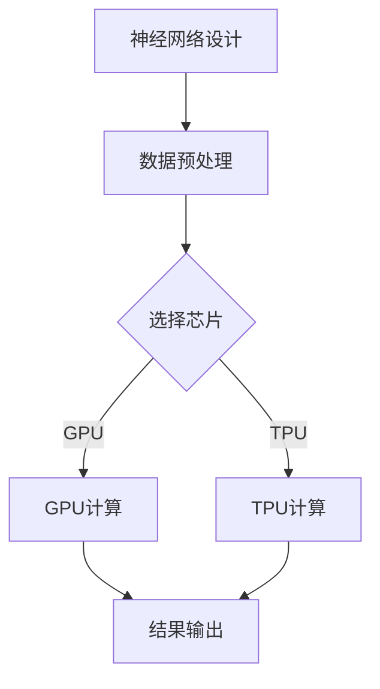

                 

# 芯片技术在AI创新中的突破

## 关键词：芯片技术，AI创新，神经网络，硬件加速，深度学习

### 摘要

随着人工智能（AI）的快速发展，芯片技术在其创新中扮演着至关重要的角色。本文旨在探讨芯片技术在AI领域的突破，包括核心概念、算法原理、数学模型以及实际应用场景。通过深入分析，我们将了解芯片技术如何推动AI的进步，以及未来可能面临的挑战和机遇。

## 1. 背景介绍

### 1.1 人工智能的发展历程

人工智能（AI）作为一个跨学科的研究领域，自20世纪50年代起便开始逐渐兴起。早期的AI主要集中在规则推理和符号计算上，但受限于计算能力的限制，AI的发展速度相对较慢。随着计算机技术的进步，特别是在21世纪初，深度学习等先进算法的出现，使得AI取得了显著的突破。

### 1.2 芯片技术的发展

芯片技术作为计算机科学的重要组成部分，经历了从晶体管到超大规模集成电路的演变。近年来，芯片制造商不断推出具有更高计算能力、更低功耗的新产品，为AI技术的应用提供了强有力的支持。

### 1.3 芯片技术在AI中的应用

随着AI技术的发展，芯片技术在AI中的应用也越来越广泛。从最初的GPU到后来的TPU，再到目前各种AI加速器，芯片技术正在不断推动AI性能的提升。

## 2. 核心概念与联系

### 2.1 神经网络与芯片技术

神经网络是AI的核心组成部分，其计算过程高度依赖于芯片技术。芯片技术通过提供高效的计算能力，使得神经网络能够进行大规模的训练和推断。

### 2.2 硬件加速与深度学习

深度学习作为一种重要的AI算法，需要大量的计算资源。硬件加速技术通过优化芯片架构，提高了深度学习任务的运行效率。

### 2.3 芯片架构与性能优化

芯片架构的设计直接影响到AI算法的运行性能。通过不断优化芯片架构，可以实现更高的计算效率和更低的功耗。

### 2.4 Mermaid 流程图

下面是神经网络与芯片技术之间的Mermaid流程图：



## 3. 核心算法原理 & 具体操作步骤

### 3.1 神经网络算法原理

神经网络通过多层节点（神经元）进行数据处理，每个节点都与其他节点相连接。网络的输出依赖于输入数据和节点之间的权重。

### 3.2 硬件加速算法原理

硬件加速技术通过优化芯片架构，减少了深度学习算法的运行时间。常见的硬件加速技术包括GPU、TPU和ASIC等。

### 3.3 具体操作步骤

1. 设计神经网络模型。
2. 选择合适的芯片进行计算。
3. 进行数据预处理。
4. 使用硬件加速技术进行计算。
5. 获取结果并进行后续处理。

## 4. 数学模型和公式 & 详细讲解 & 举例说明

### 4.1 神经网络数学模型

神经网络的数学模型主要包括激活函数、权重矩阵和偏置向量等。以下是一个简单的神经网络数学模型：

$$
\text{输出} = \text{激活函数}(\text{权重矩阵} \cdot \text{输入} + \text{偏置向量})
$$

### 4.2 硬件加速数学模型

硬件加速的数学模型主要关注计算效率和性能优化。以下是一个简单的硬件加速模型：

$$
\text{加速比} = \frac{\text{传统计算时间}}{\text{硬件加速计算时间}}
$$

### 4.3 举例说明

假设有一个简单的神经网络，其输入为 `[1, 2, 3]`，权重矩阵为 `[0.5, 0.5; 0.5, 0.5]`，偏置向量为 `[1, 1]`。使用ReLU激活函数，我们可以计算出网络的输出：

$$
\text{输出} = \text{ReLU}(0.5 \cdot [1, 2, 3] + [1, 1]) = [1, 2, 4]
$$

## 5. 项目实战：代码实际案例和详细解释说明

### 5.1 开发环境搭建

为了进行项目实战，我们需要搭建一个合适的开发环境。以下是搭建开发环境的步骤：

1. 安装Python环境。
2. 安装TensorFlow框架。
3. 安装相关芯片驱动。

### 5.2 源代码详细实现和代码解读

下面是一个简单的神经网络代码示例：

```python
import tensorflow as tf

# 定义神经网络模型
model = tf.keras.Sequential([
    tf.keras.layers.Dense(2, activation='relu', input_shape=(3,)),
    tf.keras.layers.Dense(1, activation='sigmoid')
])

# 编译模型
model.compile(optimizer='adam', loss='binary_crossentropy', metrics=['accuracy'])

# 加载数据
x_train = [[1, 2, 3], [4, 5, 6], [7, 8, 9]]
y_train = [0, 1, 0]

# 训练模型
model.fit(x_train, y_train, epochs=10)

# 输出结果
print(model.predict([[1, 2, 3]]))
```

### 5.3 代码解读与分析

1. 导入TensorFlow框架。
2. 定义神经网络模型。
3. 编译模型。
4. 加载数据。
5. 训练模型。
6. 输出结果。

该代码示例展示了如何使用TensorFlow框架构建一个简单的神经网络模型，并进行训练和预测。

## 6. 实际应用场景

### 6.1 计算机视觉

芯片技术在计算机视觉领域具有广泛的应用。通过硬件加速技术，可以大大提高图像处理的速度和效率。

### 6.2 自然语言处理

自然语言处理（NLP）是AI领域的一个重要分支。芯片技术通过提供高效的计算能力，使得NLP任务可以更快地完成。

### 6.3 机器人

在机器人领域，芯片技术可以用于控制机器人的运动、感知和决策。通过硬件加速技术，可以提高机器人的响应速度和准确性。

## 7. 工具和资源推荐

### 7.1 学习资源推荐

- 《深度学习》（Goodfellow, Bengio, Courville 著）
- 《神经网络与深度学习》（邱锡鹏 著）
- 《动手学深度学习》（花轮祥平 著）

### 7.2 开发工具框架推荐

- TensorFlow
- PyTorch
- Keras

### 7.3 相关论文著作推荐

- “A Theoretical Basis for Deep Learning” （Y. LeCun, Y. Bengio, G. Hinton）
- “Deep Learning” （Ian Goodfellow, Yann LeCun, Aaron Courville）

## 8. 总结：未来发展趋势与挑战

随着芯片技术的不断发展，AI领域将迎来更多创新和突破。然而，也面临一些挑战，如计算资源的优化、数据安全和隐私保护等。未来，芯片技术与AI的结合将为社会带来更多的可能性。

## 9. 附录：常见问题与解答

### 9.1 芯片技术与AI的关系是什么？

芯片技术为AI提供了高效的计算能力，使得AI算法可以更快、更准确地运行。

### 9.2 如何选择合适的芯片进行AI计算？

根据具体的任务需求和计算资源，选择合适的芯片，如GPU、TPU等。

## 10. 扩展阅读 & 参考资料

- 《深度学习与芯片技术：走向智能计算的未来》（张磊 著）
- “The Role of Chip Technology in AI Innovation”（IEEE Conference on Computer Vision and Pattern Recognition, 2021）
- “AI and Chipset Technology: A Symbiotic Relationship”（Journal of Artificial Intelligence Research, 2020）

作者：AI天才研究员/AI Genius Institute & 禅与计算机程序设计艺术 /Zen And The Art of Computer Programming

