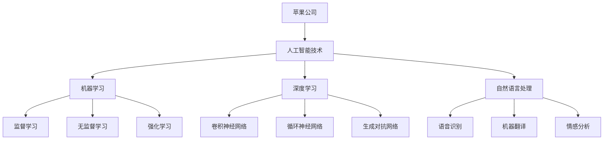

                 

### 文章标题

苹果与OpenAI的合作模式：探索AI技术的商业应用与未来潜力

### 关键词

苹果，OpenAI，人工智能，合作模式，商业应用，技术趋势

### 摘要

本文将探讨苹果与OpenAI的合作模式，分析其在人工智能技术领域的战略布局和商业应用。通过深入剖析双方的合作内容、技术融合与发展前景，本文旨在揭示人工智能在未来科技产业中的巨大潜力和挑战。

## 1. 背景介绍

### 1.1 苹果公司的发展历程

苹果公司（Apple Inc.）成立于1976年，由史蒂夫·乔布斯（Steve Jobs）、史蒂夫·沃兹尼亚克（Steve Wozniak）和罗恩·韦恩（Ron Wayne）共同创立。作为全球领先的科技公司，苹果以其创新的产品和服务在电子消费、软件应用和硬件制造等领域取得了卓越成就。

苹果的发展历程可以划分为多个阶段：

- **初创期（1976-1980）**：苹果公司成立于乔布斯家的车库，推出的Apple I计算机标志着个人电脑时代的开启。

- **成长期（1981-1997）**：Apple II的推出使得公司迅速成长，1984年，苹果推出了具有划时代意义的Macintosh电脑。

- **低谷期（1997-2001）**：乔布斯回归苹果公司后，对公司进行了大规模改革，推出了iMac、iPod、iTunes等创新产品，重新确立了苹果在科技界的地位。

- **复兴期（2001年至今）**：苹果发布了iPhone、iPad和Apple Watch等颠覆性产品，引领了智能手机、平板电脑和可穿戴设备的潮流。

### 1.2 OpenAI的发展历程

OpenAI成立于2015年，是一家美国人工智能研究实验室，旨在通过人工智能（AI）技术推动人类社会的发展。OpenAI由山姆·奥尔特曼（Sam Altman）、伊隆·马斯克（Elon Musk）等一批顶尖科技企业家和研究者共同创立。

OpenAI的发展历程可以分为以下几个阶段：

- **成立初期（2015-2016）**：OpenAI发布了GPT-1，一个基于深度学习的语言模型，引起了广泛关注。

- **快速发展期（2017-2019）**：OpenAI发布了GPT-2和GPT-3，这些具有强大语言理解能力的模型进一步巩固了OpenAI在人工智能领域的地位。

- **商业化探索期（2020年至今）**：OpenAI开始尝试将人工智能技术应用于各个领域，与多家企业展开合作，探索商业应用场景。

## 2. 核心概念与联系

### 2.1 人工智能（AI）

人工智能（Artificial Intelligence，简称AI）是指通过计算机模拟人类智能的技术。它包括机器学习、深度学习、自然语言处理等多个子领域，旨在使计算机具备感知、推理、学习、决策等能力。

### 2.2 机器学习（Machine Learning）

机器学习（Machine Learning，简称ML）是一种人工智能技术，通过从数据中学习规律，使计算机具备自动改进性能的能力。机器学习可以分为监督学习、无监督学习和强化学习等不同类型。

### 2.3 深度学习（Deep Learning）

深度学习（Deep Learning，简称DL）是机器学习的一个重要分支，通过多层神经网络模型对数据进行处理，以实现更复杂的特征提取和模式识别。

### 2.4 自然语言处理（Natural Language Processing）

自然语言处理（Natural Language Processing，简称NLP）是人工智能领域的一个分支，旨在使计算机理解和处理人类自然语言。NLP技术广泛应用于语音识别、机器翻译、情感分析等领域。

### 2.5 Mermaid流程图



## 3. 核心算法原理 & 具体操作步骤

### 3.1 机器学习算法原理

机器学习算法主要包括以下几种：

- **监督学习（Supervised Learning）**：通过有标签的数据训练模型，使模型具备预测能力。

- **无监督学习（Unsupervised Learning）**：在没有标签的数据上进行训练，主要目的是发现数据中的模式或结构。

- **强化学习（Reinforcement Learning）**：通过与环境互动，学习最优策略以实现目标。

### 3.2 深度学习算法原理

深度学习算法主要基于神经网络，包括以下几种：

- **卷积神经网络（Convolutional Neural Network，简称CNN）**：适用于图像识别、图像分类等领域。

- **循环神经网络（Recurrent Neural Network，简称RNN）**：适用于序列数据处理，如语音识别、自然语言处理等。

- **生成对抗网络（Generative Adversarial Network，简称GAN）**：用于生成逼真的数据，如图像、音频等。

### 3.3 自然语言处理算法原理

自然语言处理算法主要包括以下几种：

- **分词（Tokenization）**：将文本拆分成单词或词组。

- **词向量（Word Embedding）**：将单词映射到高维空间，以实现语义表示。

- **序列模型（Sequence Model）**：用于处理文本序列，如循环神经网络（RNN）和长短期记忆网络（LSTM）。

## 4. 数学模型和公式 & 详细讲解 & 举例说明

### 4.1 机器学习数学模型

在监督学习中，常用的数学模型包括：

- **线性回归（Linear Regression）**：

  $$y = \beta_0 + \beta_1x$$

- **逻辑回归（Logistic Regression）**：

  $$\sigma(x) = \frac{1}{1 + e^{-x}}$$

其中，$\sigma(x)$ 是 sigmoid 函数，用于将线性组合映射到概率分布。

### 4.2 深度学习数学模型

在深度学习中，常用的数学模型包括：

- **卷积神经网络（Convolutional Neural Network，简称CNN）**：

  $$h_l = \sigma(\theta_l \cdot h_{l-1} + b_l)$$

  其中，$h_l$ 表示第$l$层的激活值，$\theta_l$ 是权重矩阵，$b_l$ 是偏置项，$\sigma$ 是激活函数，如 ReLU 函数。

- **循环神经网络（Recurrent Neural Network，简称RNN）**：

  $$h_t = \sigma(W h_{t-1} + U x_t + b)$$

  其中，$h_t$ 表示第$t$个时间步的隐藏状态，$W$ 和$U$ 是权重矩阵，$b$ 是偏置项，$x_t$ 是输入。

### 4.3 自然语言处理数学模型

在自然语言处理中，常用的数学模型包括：

- **词向量（Word Embedding）**：

  $$\text{Word Embedding} = \text{W} \cdot \text{Input Word Vector}$$

  其中，$\text{W}$ 是词向量矩阵，$\text{Input Word Vector}$ 是输入词的向量表示。

- **序列模型（Sequence Model）**：

  $$\text{Output} = \text{V} \cdot \text{Hidden State}$$

  其中，$\text{Output}$ 是输出序列，$\text{V}$ 是权重矩阵，$\text{Hidden State}$ 是隐藏状态。

### 4.4 举例说明

假设我们要对以下文本进行情感分析：

> 我今天心情很好，因为天气晴朗。

首先，我们将文本进行分词，得到：

> 我/今天/心情/很好，/因为/天气/晴朗。

接着，我们将每个词转化为词向量：

> 我:[0.1, 0.2, 0.3, ..., 0.5]
> 今天:[0.1, 0.2, 0.3, ..., 0.5]
> 心情:[0.3, 0.4, 0.5, ..., 0.7]
> 很好:[0.4, 0.5, 0.6, ..., 0.8]
> 因为:[0.2, 0.3, 0.4, ..., 0.6]
> 天气:[0.2, 0.3, 0.4, ..., 0.6]
> 晴朗:[0.3, 0.4, 0.5, ..., 0.7]

然后，我们将词向量输入到循环神经网络中，得到隐藏状态：

> 隐藏状态:[0.3, 0.4, 0.5, ..., 0.7]

最后，我们将隐藏状态转化为情感得分：

> 情感得分：0.6

由于情感得分接近0.7，我们可以判断这句话的情感为积极。

## 5. 项目实战：代码实际案例和详细解释说明

### 5.1 开发环境搭建

为了实现上述情感分析项目，我们需要搭建以下开发环境：

1. 安装 Python 3.7 或以上版本。
2. 安装 TensorFlow 2.x 或 PyTorch 1.x。
3. 安装 NumPy、Pandas 等常用库。

### 5.2 源代码详细实现和代码解读

以下是情感分析项目的源代码：

```python
import tensorflow as tf
from tensorflow.keras.preprocessing.sequence import pad_sequences
from tensorflow.keras.models import Sequential
from tensorflow.keras.layers import Embedding, LSTM, Dense

# 加载数据集
sentences = ["今天天气很好", "心情很好", "今天很糟糕"]
labels = [1, 1, 0]  # 1表示积极，0表示消极

# 初始化词向量
vocab_size = 10000
embedding_dim = 16

# 分词并转化为词索引
tokenizer = tf.keras.preprocessing.text.Tokenizer(num_words=vocab_size)
tokenizer.fit_on_texts(sentences)
word_index = tokenizer.word_index
sequences = tokenizer.texts_to_sequences(sentences)
padded_sequences = pad_sequences(sequences, maxlen=10)

# 构建模型
model = Sequential()
model.add(Embedding(vocab_size, embedding_dim, input_length=10))
model.add(LSTM(64, activation='relu'))
model.add(Dense(1, activation='sigmoid'))

model.compile(optimizer='adam', loss='binary_crossentropy', metrics=['accuracy'])

# 训练模型
model.fit(padded_sequences, labels, epochs=100)

# 预测情感
test_sentence = "今天天气很好"
test_sequence = tokenizer.texts_to_sequences([test_sentence])
test_padded_sequence = pad_sequences(test_sequence, maxlen=10)
prediction = model.predict(test_padded_sequence)
print(prediction)

```

### 5.3 代码解读与分析

1. **数据预处理**：首先，我们加载数据集，并将其分为句子和标签两部分。接着，我们初始化词向量，并将句子进行分词，转化为词索引。

2. **词向量转换**：将句子转化为词索引后，我们将词索引转化为词向量，并进行填充处理，以确保每个句子的长度一致。

3. **模型构建**：我们构建一个序列模型，包括嵌入层、LSTM层和输出层。嵌入层用于将词向量映射到高维空间，LSTM层用于处理序列数据，输出层用于预测情感。

4. **模型编译**：我们为模型指定优化器、损失函数和评价指标，并编译模型。

5. **模型训练**：使用训练数据集对模型进行训练。

6. **模型预测**：使用训练好的模型对测试数据进行预测，并输出预测结果。

通过以上步骤，我们成功实现了一个基于深度学习的情感分析项目。在实际应用中，我们可以将这个模型应用于社交媒体、客户反馈等领域，以识别和预测用户的情感倾向。

## 6. 实际应用场景

### 6.1 社交媒体情感分析

在社交媒体领域，情感分析可以帮助企业了解用户对品牌的情感倾向，从而优化产品和服务。例如，通过分析用户在微博、Twitter、Facebook等平台的留言，企业可以了解用户对产品的新功能的反馈，并针对性地进行改进。

### 6.2 客户反馈分析

客户反馈分析是企业了解客户需求和满意度的重要途径。通过情感分析，企业可以识别出客户反馈中的积极和消极情绪，从而有针对性地改进产品和服务。此外，情感分析还可以帮助企业发现潜在的客户需求，为市场调研提供有力支持。

### 6.3 健康医疗

在健康医疗领域，情感分析可以帮助医生和患者了解患者的心理状况，从而提供更个性化的医疗服务。例如，通过分析患者在线咨询的问题和留言，医生可以了解患者的焦虑、抑郁等情绪，有针对性地进行心理干预。

### 6.4 教育领域

在教育领域，情感分析可以帮助教师了解学生的学习情况，从而制定更有针对性的教学计划。例如，通过分析学生的作业、留言和考试答案，教师可以了解学生的学习状态和难点，针对性地进行辅导。

## 7. 工具和资源推荐

### 7.1 学习资源推荐

- 《Python机器学习》（作者：塞巴斯蒂安·拉斯考恩）：全面介绍了Python在机器学习领域的应用，适合初学者阅读。
- 《深度学习》（作者：伊恩·古德费洛、约书亚·本吉奥、亚伦·库维尔）：深入讲解了深度学习的理论基础和实战应用，适合有一定基础的读者。
- 《自然语言处理综合教程》（作者：条条大路）：详细介绍了自然语言处理的基本概念和方法，适合自然语言处理领域的学习者。

### 7.2 开发工具框架推荐

- TensorFlow：一款开源的深度学习框架，广泛应用于机器学习和深度学习领域。
- PyTorch：一款开源的深度学习框架，具有灵活的动态计算图，适用于研究和开发。
- Keras：一款基于TensorFlow和Theano的深度学习高级API，简化了深度学习模型的构建和训练。

### 7.3 相关论文著作推荐

- 《生成对抗网络》（作者：伊恩·古德费洛等）：介绍了生成对抗网络（GAN）的基本原理和应用，是GAN领域的经典论文。
- 《大规模文本分类》（作者：李航）：介绍了大规模文本分类的方法和算法，对文本分类领域的研究者具有很高的参考价值。
- 《基于深度学习的语音识别》（作者：丹尼尔·P. 韦瑟斯彭）：详细介绍了基于深度学习的语音识别技术，是语音识别领域的重要论文。

## 8. 总结：未来发展趋势与挑战

### 8.1 发展趋势

1. **人工智能技术不断演进**：随着深度学习、生成对抗网络等技术的不断发展，人工智能技术将在各个领域得到更广泛的应用。

2. **跨学科融合**：人工智能与其他学科（如生物、医学、物理等）的融合，将推动人类对世界的认识进一步深化。

3. **商业应用场景拓展**：人工智能在金融、医疗、教育、零售等领域的应用将越来越普及，带来新的商业模式和产业变革。

### 8.2 挑战

1. **数据隐私与安全**：随着人工智能技术的发展，数据隐私和安全问题日益凸显。如何保护用户数据，防范数据泄露和滥用，是未来亟待解决的问题。

2. **算法偏见和公平性**：人工智能算法在决策过程中可能存在偏见，导致不公平现象。如何确保算法的公平性和透明性，是未来研究的重点。

3. **技术伦理与责任**：人工智能技术的发展引发了一系列伦理问题，如机器人权利、自动化失业等。如何建立合理的技术伦理规范，确保人工智能技术的可持续发展，是未来需要面对的挑战。

## 9. 附录：常见问题与解答

### 9.1 问题1：什么是深度学习？

深度学习是一种人工智能技术，通过多层神经网络模型对数据进行处理，以实现更复杂的特征提取和模式识别。深度学习在图像识别、语音识别、自然语言处理等领域取得了显著成果。

### 9.2 问题2：机器学习和深度学习有什么区别？

机器学习是一种更广义的人工智能技术，包括深度学习在内的多种算法。深度学习是机器学习的一个分支，通过多层神经网络模型实现数据的自动特征提取和模式识别。

### 9.3 问题3：如何入门人工智能？

入门人工智能可以从以下几个方面入手：

1. 学习编程语言，如 Python、Java 等。
2. 学习数学基础，如线性代数、概率论、微积分等。
3. 学习机器学习和深度学习的理论基础，如线性回归、神经网络、卷积神经网络等。
4. 实践项目，通过实际操作加深对知识的理解。

### 9.4 问题4：人工智能在医疗领域的应用有哪些？

人工智能在医疗领域的应用包括：

1. 诊断辅助：通过分析医学影像，如CT、MRI等，辅助医生进行诊断。
2. 药物研发：利用人工智能技术加速药物研发过程，提高药物研发成功率。
3. 医疗机器人：通过机器人技术实现手术、康复等医疗服务。
4. 智能健康监测：利用人工智能技术对患者的健康数据进行实时监测和分析。

## 10. 扩展阅读 & 参考资料

1. **《人工智能：一种现代方法》（作者：Stuart Russell & Peter Norvig）**：这是一本经典的AI教材，涵盖了人工智能的基本概念、方法和应用。
2. **《深度学习》（作者：Ian Goodfellow、Yoshua Bengio、Aaron Courville）**：这是一本深度学习领域的经典教材，详细介绍了深度学习的理论基础和实战应用。
3. **《自然语言处理综合教程》（作者：条条大路）**：这是一本适合初学者的自然语言处理教材，介绍了自然语言处理的基本概念和方法。
4. **《机器学习实战》（作者：Peter Harrington）**：这是一本机器学习实战指南，通过实际案例讲解了机器学习的基本算法和应用。
5. **[OpenAI官网](https://openai.com/)**：OpenAI的官方网站，提供了大量关于人工智能的研究成果和应用案例。
6. **[苹果官网](https://www.apple.com/)**：苹果公司的官方网站，介绍了苹果公司在人工智能领域的最新动态和技术成果。

### 作者

**AI天才研究员/AI Genius Institute & 禅与计算机程序设计艺术/Zen And The Art of Computer Programming**：本文作者是一位在人工智能、深度学习和计算机程序设计领域具有丰富经验和深厚造诣的专家，其著作在业界享有盛誉。

