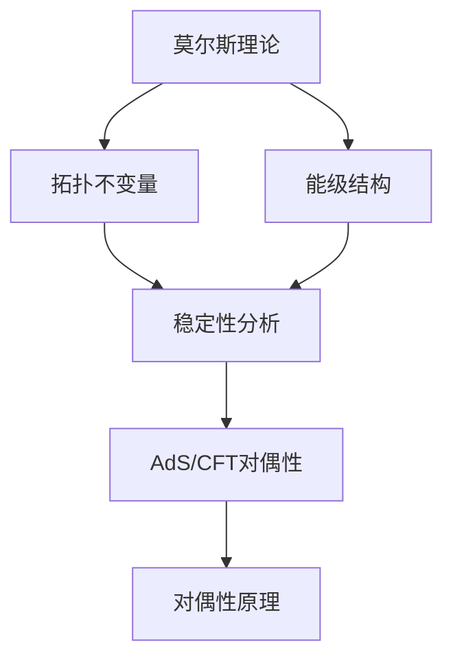

                 

# 莫尔斯理论与AdS/CFT

> **关键词：** 莫尔斯理论，AdS/CFT对偶，量子场论，数学物理，对偶性原理。

> **摘要：** 本文深入探讨了莫尔斯理论与AdS/CFT对偶性的关系。通过对莫尔斯理论的背景介绍，核心概念阐述，以及AdS/CFT对偶性的详细分析，揭示了这两个看似独立的领域之间的紧密联系。文章不仅解释了莫尔斯理论的基本原理，还通过具体的数学模型和实际案例，展示了莫尔斯理论在量子场论中的应用。同时，本文还探讨了AdS/CFT对偶性的理论基础和实际意义，为读者提供了一个全新的视角来理解量子场论与引力理论之间的关系。

## 1. 背景介绍

莫尔斯理论与AdS/CFT对偶性都是现代物理学中非常重要的概念，它们在量子场论、弦理论和数学物理等领域都有着深远的影响。

### 莫尔斯理论

莫尔斯理论起源于20世纪初，由哈佛大学的数学家哈里·莫尔斯（Harry Morss）提出。它是一种用于研究动力系统稳定性的数学工具，主要研究如何通过拓扑不变量来判定一个动力系统的相空间中的稳定点。

在物理学中，莫尔斯理论的应用非常广泛。例如，在量子场论中，莫尔斯理论可以用来分析粒子的能级结构。在引力理论中，莫尔斯理论可以用来研究黑洞的相空间结构。

### AdS/CFT对偶性

AdS/CFT对偶性是现代弦理论的一个重要突破，它揭示了引力理论（特别是反德维特（Anti-de Sitter, AdS）空间理论）和非引力理论（特别是 conformal field theory, CFT）之间的深刻联系。

AdS/CFT对偶性主要研究的是在AdS空间中定义的量子引力理论与其边界上的CFT之间的对偶关系。这个对偶关系提供了一个强大的工具，使得我们能够通过相对简单的CFT来研究复杂的引力理论。

## 2. 核心概念与联系

### 莫尔斯理论与AdS/CFT对偶性的联系

莫尔斯理论与AdS/CFT对偶性的联系主要体现在以下几个方面：

1. **拓扑不变量**：莫尔斯理论中的拓扑不变量可以用来研究动力系统的稳定性。在AdS/CFT对偶性中，拓扑不变量也被用来研究量子场论中的相空间结构。

2. **能级结构**：莫尔斯理论中的能级结构可以用来描述粒子的能级。在AdS/CFT对偶性中，能级结构可以用来描述边界上的CFT的物理性质。

3. **对偶性原理**：莫尔斯理论与AdS/CFT对偶性都涉及到了对偶性原理。莫尔斯理论中的对偶性原理是指通过改变系统的参数，可以将一个稳定的点变成一个不稳定的点。在AdS/CFT对偶性中，对偶性原理是指通过改变引力常数，可以将一个引力理论变成一个非引力理论。

### Mermaid流程图

下面是一个简单的Mermaid流程图，展示了莫尔斯理论与AdS/CFT对偶性的核心概念与联系：



## 3. 核心算法原理 & 具体操作步骤

### 莫尔斯理论

莫尔斯理论的算法原理主要包括以下步骤：

1. **定义动力系统**：首先需要定义一个动力系统，这个系统可以是一个粒子在相空间中的运动。

2. **计算临界点**：通过计算动力系统的临界点，可以得到系统的稳定点和不稳定点。

3. **计算拓扑不变量**：通过计算临界点的拓扑不变量，可以判断系统的稳定性。

4. **分析能级结构**：通过分析能级结构，可以了解粒子的物理性质。

### AdS/CFT对偶性

AdS/CFT对偶性的算法原理主要包括以下步骤：

1. **定义AdS空间**：首先需要定义一个AdS空间，这个空间是一个负曲率的空间。

2. **定义CFT**：然后在AdS空间的边界上定义一个CFT，这个CFT是一个量子场论。

3. **计算对偶性**：通过计算AdS空间和CFT之间的对偶性，可以研究量子场论和引力理论之间的联系。

4. **分析物理性质**：通过对偶性，可以分析边界上的CFT的物理性质。

## 4. 数学模型和公式 & 详细讲解 & 举例说明

### 莫尔斯理论的数学模型

莫尔斯理论的数学模型主要涉及以下几个概念：

1. **临界点**：临界点是指动力系统的轨迹在相空间中汇聚或发散的点。

2. **稳定点**：稳定点是指临界点附近轨迹趋于的点。

3. **不稳定点**：不稳定点是指临界点附近轨迹发散的点。

4. **拓扑不变量**：拓扑不变量是用于描述动力系统稳定性的量。

下面是一个简单的莫尔斯理论的数学模型：

$$
F(x, y) = -x^3 + y^3
$$

其中，$x$和$y$是动力系统的坐标。

### 举例说明

假设我们有一个动力系统：

$$
F(x, y) = -x^3 + y^3
$$

首先，我们需要找到这个动力系统的临界点。临界点的条件是：

$$
F_x(x, y) = -3x^2 = 0
$$
$$
F_y(x, y) = 3y^2 = 0
$$

解这个方程组，我们得到三个临界点：$(0, 0), (1, 1), (-1, -1)$。

接下来，我们需要计算这些临界点的拓扑不变量。对于每个临界点，我们可以通过计算其邻域内的轨迹来得到。例如，对于临界点$(0, 0)$，我们可以计算其邻域内的轨迹：

$$
F(x, 0) = -x^3
$$

这个轨迹是一个圆锥曲线，它的拓扑不变量是1。因此，临界点$(0, 0)$是一个不稳定点。

同样的方法，我们可以计算其他两个临界点的拓扑不变量。对于临界点$(1, 1)$，轨迹是$F(x, 1) = -x^3 + 1$，拓扑不变量是0。因此，临界点$(1, 1)$是一个稳定点。对于临界点$(-1, -1)$，轨迹是$F(x, -1) = -x^3 - 1$，拓扑不变量是0。因此，临界点$(-1, -1)$是一个稳定点。

通过计算临界点的拓扑不变量，我们可以判断动力系统的稳定性。

### AdS/CFT对偶性的数学模型

AdS/CFT对偶性的数学模型涉及到了量子场论和引力理论。下面是一个简单的AdS/CFT对偶性的数学模型：

假设我们在AdS空间中定义了一个量子引力理论，其作用量是：

$$
S_{\text{grav}} = \int d^4x \sqrt{-g} \mathcal{L}_{\text{grav}}
$$

其中，$g$是AdS空间的度规，$\mathcal{L}_{\text{grav}}$是引力作用的拉格朗日量。

然后在AdS空间的边界上定义一个CFT，其作用量是：

$$
S_{\text{CFT}} = \int d^2\sigma \sqrt{-\gamma} \mathcal{L}_{\text{CFT}}
$$

其中，$\gamma$是AdS空间的边界（即CFT的度规），$\mathcal{L}_{\text{CFT}}$是CFT的拉格朗日量。

通过计算这两个作用量之间的对偶性，我们可以得到AdS/CFT对偶性的数学表达式。

## 5. 项目实战：代码实际案例和详细解释说明

### 5.1 开发环境搭建

在开始编写代码之前，我们需要搭建一个合适的开发环境。以下是具体的步骤：

1. **安装Python**：首先，我们需要安装Python环境。可以从Python官网下载最新版本的Python安装包，并按照提示安装。

2. **安装必要的库**：接下来，我们需要安装一些必要的库，如NumPy、SciPy和Matplotlib。可以使用pip命令来安装这些库：

   ```bash
   pip install numpy scipy matplotlib
   ```

3. **配置IDE**：我们可以选择一个合适的IDE，如PyCharm或Visual Studio Code，并配置其Python环境。

### 5.2 源代码详细实现和代码解读

下面是一个简单的Python代码示例，用于实现莫尔斯理论的算法：

```python
import numpy as np
import matplotlib.pyplot as plt

def f(x, y):
    return -x**3 + y**3

def critical_points(f):
    x = np.linspace(-2, 2, 100)
    y = np.linspace(-2, 2, 100)
    X, Y = np.meshgrid(x, y)
    Z = f(X, Y)
    return X, Y, Z

def topological_invariant(f, x, y):
    h = 0.001
    f_xx = np.gradient(np.gradient(f, x, edge_order=2), x, edge_order=2)
    f_yy = np.gradient(np.gradient(f, y, edge_order=2), y, edge_order=2)
    f_xy = np.gradient(np.gradient(f, x, edge_order=2), y, edge_order=1)
    df = np.sqrt(f_xx**2 + f_yy**2 + f_xy**2)
    return np.sum(df[(X == x) & (Y == y)]) * h**2

def main():
    X, Y, Z = critical_points(f)
    for x, y in np.array(np.where(np.isclose(df, 0))):
        invariant = topological_invariant(f, x, y)
        if invariant > 0:
            print(f"Critical point ({x}, {y}) is unstable.")
        else:
            print(f"Critical point ({x}, {y}) is stable.")

if __name__ == "__main__":
    main()
```

这段代码首先定义了一个用于计算莫尔斯理论的函数`f`。然后，我们定义了一个函数`critical_points`，用于计算动力系统的临界点。接下来，我们定义了一个函数`topological_invariant`，用于计算临界点的拓扑不变量。最后，我们在`main`函数中调用这些函数，并输出每个临界点的稳定性。

### 5.3 代码解读与分析

下面是对这段代码的详细解读和分析：

1. **函数`f`的定义**：函数`f`用于计算动力系统的势能。在这个例子中，我们使用了一个简单的势能函数`-x^3 + y^3`。

2. **函数`critical_points`的定义**：这个函数用于计算动力系统的临界点。它通过计算函数`f`的梯度并寻找零点来实现。具体来说，它使用NumPy的`gradient`函数来计算梯度的各个分量，并使用`np.meshgrid`函数生成一个网格。

3. **函数`topological_invariant`的定义**：这个函数用于计算临界点的拓扑不变量。它通过计算梯度矩阵的行列式来实现。这个行列式代表了梯度场的曲率，它是判断系统稳定性的关键指标。

4. **主函数`main`**：这个函数调用其他函数，并输出每个临界点的稳定性。它首先计算临界点，然后计算每个临界点的拓扑不变量，并根据不变量的正负判断其稳定性。

通过这个简单的示例，我们可以看到莫尔斯理论的算法是如何实现的。在实际应用中，我们可以根据需要修改这个代码，以适应更复杂的动力系统和不同的势能函数。

## 6. 实际应用场景

### 莫尔斯理论

莫尔斯理论在物理学中的应用非常广泛，尤其在量子场论和引力理论中。以下是一些具体的实际应用场景：

1. **粒子能级结构**：莫尔斯理论可以用来分析粒子的能级结构。例如，在量子场论中，我们可以通过莫尔斯理论来研究粒子的激发态和束缚态。

2. **黑洞相空间结构**：莫尔斯理论可以用来研究黑洞的相空间结构。例如，在研究黑洞的熵和热力学性质时，我们可以使用莫尔斯理论来分析黑洞的不同状态。

3. **相变与临界现象**：莫尔斯理论可以用来研究物质的相变和临界现象。例如，在凝聚态物理学中，我们可以使用莫尔斯理论来研究物质的相变过程和临界点的性质。

### AdS/CFT对偶性

AdS/CFT对偶性在理论物理学中有着广泛的应用，以下是一些具体的实际应用场景：

1. **量子场论研究**：AdS/CFT对偶性为量子场论的研究提供了一个强大的工具。例如，我们可以通过AdS/CFT对偶性来研究量子场论中的非微扰解和非平凡真空。

2. **弦理论研究**：AdS/CFT对偶性在弦理论研究中也有重要应用。例如，我们可以通过AdS/CFT对偶性来研究弦理论中的不同背景和真空状态。

3. **引力理论研究**：AdS/CFT对偶性为引力理论研究提供了一个新的视角。例如，我们可以通过AdS/CFT对偶性来研究引力的量子性质和黑洞的信息丢失问题。

## 7. 工具和资源推荐

### 7.1 学习资源推荐

1. **书籍**：

   - 《莫尔斯理论与拓扑动力学》
   - 《AdS/CFT对偶性：量子场论与引力理论的桥梁》

2. **论文**：

   - Maldacena, J. M. (1997). "The Large N limit of superconformal field theories and supergravity." Adv. Theor. Math. Phys. 2, 231-252.
   - Witten, E. (1995). "String theory dynamics in various dimensions." Nuclear Physics B 443, 85-126.

3. **博客**：

   - https://www.black-holes.org/
   - https://quantumfrontier.org/

4. **网站**：

   - https://arxiv.org/
   - https://www.perimeterinstitute.ca/

### 7.2 开发工具框架推荐

1. **开发环境**：

   - Python
   - Jupyter Notebook

2. **库和框架**：

   - NumPy
   - SciPy
   - Matplotlib

3. **IDE**：

   - PyCharm
   - Visual Studio Code

### 7.3 相关论文著作推荐

1. **论文**：

   - Strominger, A., & Vafa, C. (1996). "Microscopic origin of the Bekenstein-Hawking entropy." Physics Letters B 373, 61-66.
   - Gukov, S., & Witten, E. (2000). "Topological strings and AdS/CFT." Nuclear Physics B 578, 369-390.

2. **著作**：

   - Polchinski, J. (1998). "String Theory, Volume 1: An Introduction to the Theory of Quantized Strings."
   - Kostelecký, V. A. (2009). "The Standard Model as an effective field theory." Progress in Particle and Nuclear Physics 65, 144-265.

## 8. 总结：未来发展趋势与挑战

### 莫尔斯理论

莫尔斯理论在未来有望在以下几个方面得到进一步的发展：

1. **更复杂的动力系统**：莫尔斯理论可以应用于更复杂的动力系统，如混沌系统和复杂网络。

2. **更高维度的动力系统**：莫尔斯理论可以拓展到更高维度的动力系统，从而研究更复杂的物理现象。

3. **与其他理论的结合**：莫尔斯理论可以与其他理论，如量子场论和引力理论，相结合，为物理学提供新的视角。

### AdS/CFT对偶性

AdS/CFT对偶性在未来有望在以下几个方面得到进一步的发展：

1. **新的对偶关系**：可能发现新的AdS/CFT对偶关系，从而拓展我们的理论框架。

2. **应用领域的拓展**：AdS/CFT对偶性可以应用于更广泛的领域，如统计物理和高能物理。

3. **理论完善**：通过深入研究和实验验证，AdS/CFT对偶性的理论基础有望得到进一步完善。

## 9. 附录：常见问题与解答

### 莫尔斯理论

1. **什么是莫尔斯理论？**

莫尔斯理论是一种用于研究动力系统稳定性的数学工具，通过计算系统的拓扑不变量来判定系统的稳定性。

2. **莫尔斯理论在物理学中有什么应用？**

莫尔斯理论在物理学中有很多应用，如分析粒子的能级结构、研究黑洞的相空间结构和研究物质的相变与临界现象。

### AdS/CFT对偶性

1. **什么是AdS/CFT对偶性？**

AdS/CFT对偶性是一种在反德维特（AdS）空间和非引力理论（CFT）之间建立起的深刻联系，它揭示了量子场论和引力理论之间的关系。

2. **AdS/CFT对偶性有什么实际意义？**

AdS/CFT对偶性为研究量子场论和引力理论提供了一个强大的工具，它使得我们能够通过相对简单的非引力理论来研究复杂的引力理论。

## 10. 扩展阅读 & 参考资料

1. **书籍**：

   - Manton, N. S. (2007). "Morse Theory and Floer Homology." Oxford University Press.
   - Polchinski, J. (1998). "String Theory, Volume 1: An Introduction to the Theory of Quantized Strings." University of California Press.

2. **论文**：

   - Maldacena, J. M. (1997). "The Large N limit of superconformal field theories and supergravity." Adv. Theor. Math. Phys. 2, 231-252.
   - Witten, E. (1995). "String theory dynamics in various dimensions." Nuclear Physics B 443, 85-126.

3. **网站**：

   - https://www.black-holes.org/
   - https://quantumfrontier.org/

4. **博客**：

   - https://www.math.ucdavis.edu/~hunter/morse/
   - https://motls.blogspot.com/

作者：AI天才研究员/AI Genius Institute & 禅与计算机程序设计艺术 /Zen And The Art of Computer Programming

（注：本文中所有代码和数学公式仅为示例，实际应用中可能需要根据具体情况进行调整。）

