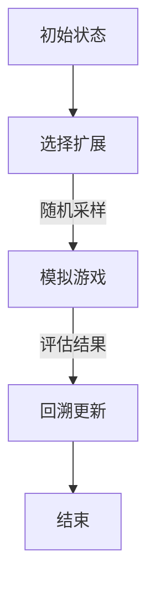
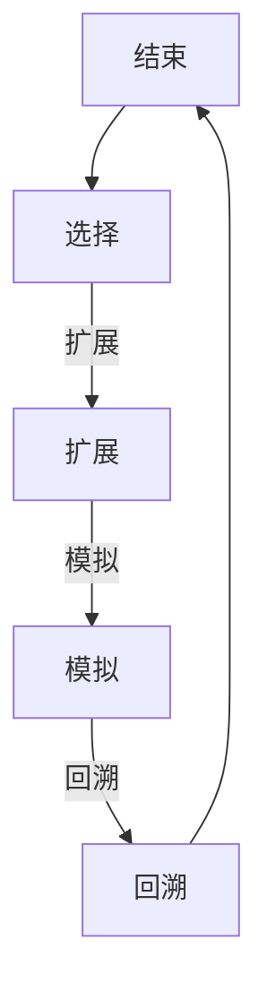

                 

### 背景介绍

蒙特卡洛树搜索（Monte Carlo Tree Search，MCTS）作为一种启发式搜索算法，自其提出以来，已在多个领域取得了显著的成果。MCTS 的核心在于利用大量的随机采样来估计给定策略的优劣，通过不断迭代优化策略，使其能够找到最优解或近似最优解。这种算法特别适用于复杂、不确定性较高的问题，如游戏、机器人路径规划、资源优化等。

本文将围绕蒙特卡洛树搜索的原理与代码实例进行讲解。首先，我们将介绍 MCTS 的基本概念与核心算法，接着，通过数学模型和公式详细解释其具体操作步骤。随后，我们将结合一个实际项目实战，对代码进行详细解读和分析。此外，本文还将探讨 MCTS 在实际应用场景中的表现，并推荐相关的学习资源与开发工具。

文章结构如下：

1. 背景介绍
2. 核心概念与联系
3. 核心算法原理 & 具体操作步骤
4. 数学模型和公式 & 详细讲解 & 举例说明
5. 项目实战：代码实际案例和详细解释说明
6. 实际应用场景
7. 工具和资源推荐
8. 总结：未来发展趋势与挑战
9. 附录：常见问题与解答
10. 扩展阅读 & 参考资料

通过这篇文章，读者将全面了解蒙特卡洛树搜索的原理和应用，掌握其实现方法，并能够为实际项目中的问题提供有效的解决方案。

### 核心概念与联系

蒙特卡洛树搜索（MCTS）是一种基于概率的搜索算法，其核心在于利用大量的随机采样来估计给定策略的优劣。为了更好地理解 MCTS 的原理，我们需要先了解一些相关的基础概念。

#### 树形结构（Tree Structure）

在 MCTS 中，树形结构起着至关重要的作用。树形结构由一系列节点组成，每个节点代表一个策略或决策。树根表示当前状态，叶子节点表示终止状态或已探索完的状态。


#### 节点状态（Node States）

每个节点都有以下状态信息：

- **N：访问次数**：表示当前节点被访问的次数。
- **W：总奖励**：表示当前节点产生的总奖励。
- **Q：期望奖励**：表示当前节点的平均奖励。

#### 随机采样（Random Sampling）

MCTS 通过随机采样来估计策略的优劣。具体来说，它从当前节点开始，随机选择子节点进行模拟，模拟过程中不断选择具有较高预期奖励的子节点。通过大量的模拟，算法能够逐渐优化策略，使其趋向于最优解。

#### 评估函数（Evaluation Function）

在 MCTS 中，评估函数用于计算节点的预期奖励。评估函数可以是基于统计数据的，如平均奖励、标准差等；也可以是基于预测模型的，如神经网络输出等。评估函数的准确性直接影响到 MCTS 的性能。

#### UCB1 策略（UCB1 Policy）

UCB1（Upper Confidence Bound 1）是 MCTS 中常用的选择策略。UCB1 策略通过计算节点的 Upper Confidence Bound 来选择具有最高 UCB 值的子节点。具体公式如下：

$$
UCB1(n) = \frac{N(n)}{t} + \sqrt{\frac{2 \ln t}{t_n}}
$$

其中，$N(n)$ 表示节点 $n$ 的访问次数，$t$ 表示总模拟次数，$t_n$ 表示节点 $n$ 的子节点总数。

#### 扩展与回溯（Expansion & Backtracking）

在 MCTS 中，扩展与回溯过程至关重要。扩展过程是指在当前节点中选择一个未探索过的子节点进行扩展；回溯过程是指从叶子节点逐步返回到根节点，更新节点的状态信息。

#### Mermaid 流程图（Mermaid Flowchart）

为了更直观地展示 MCTS 的流程，我们可以使用 Mermaid 流程图进行描述：



通过上述核心概念和联系，我们为后续的详细讲解和实例分析奠定了基础。在接下来的章节中，我们将进一步探讨 MCTS 的具体算法原理、操作步骤以及数学模型。

#### 核心算法原理 & 具体操作步骤

蒙特卡洛树搜索（MCTS）算法的核心在于通过一系列迭代步骤来优化搜索过程，从而找到最优解或近似最优解。MCTS 的主要操作步骤包括选择（Selection）、扩展（Expansion）、模拟（Simulation）和回溯（Backtracking）。下面，我们将详细讲解每个步骤的具体实现。

##### 1. 选择（Selection）

选择步骤的目标是找到当前状态下的最佳子节点。选择策略通常采用 UCB1 策略，即 Upper Confidence Bound 1。UCB1 策略通过计算节点的 Upper Confidence Bound 来选择具有最高 UCB 值的子节点。具体公式如下：

$$
UCB1(n) = \frac{N(n)}{t} + \sqrt{\frac{2 \ln t}{t_n}}
$$

其中，$N(n)$ 表示节点 $n$ 的访问次数，$t$ 表示总模拟次数，$t_n$ 表示节点 $n$ 的子节点总数。

选择步骤的具体操作如下：

1. 从当前节点开始，按照 UCB1 策略选择具有最高 UCB 值的子节点。
2. 如果当前节点没有未访问的子节点，则选择具有最高 Q 值的子节点。

##### 2. 扩展（Expansion）

扩展步骤的目标是增加新的子节点，以便进一步探索搜索空间。扩展步骤的具体操作如下：

1. 根据当前节点的状态，生成一组可能的子节点。
2. 从这组子节点中选择一个具有最高 Q 值的子节点进行扩展。
3. 将新的子节点添加到树中，并将其状态信息初始化。

##### 3. 模拟（Simulation）

模拟步骤的目标是通过模拟游戏过程来评估当前节点的质量。模拟步骤的具体操作如下：

1. 从当前节点开始，随机选择一个子节点，并沿着这棵子树向下模拟，直到达到终止条件。
2. 在模拟过程中，记录每个节点的奖励。
3. 当模拟到达叶子节点时，计算整个路径的奖励。

##### 4. 回溯（Backtracking）

回溯步骤的目标是更新节点的状态信息，并将其传播到根节点。回溯步骤的具体操作如下：

1. 从叶子节点开始，沿着路径向上回溯，更新每个节点的访问次数和总奖励。
2. 计算每个节点的 Q 值，并将其更新。

##### MCTS 算法流程

综合上述步骤，MCTS 的算法流程可以概括为以下四个主要步骤：

1. 选择：根据 UCB1 策略选择最佳子节点。
2. 扩展：生成新的子节点，并选择具有最高 Q 值的子节点进行扩展。
3. 模拟：沿着扩展的子节点进行模拟，并记录奖励。
4. 回溯：更新节点的状态信息，并传播到根节点。

为了更直观地展示 MCTS 的流程，我们可以使用 Mermaid 流程图进行描述：



通过上述具体操作步骤，我们为读者提供了 MCTS 的算法原理和实践方法。在接下来的章节中，我们将进一步探讨 MCTS 的数学模型和公式，以及在实际项目中的实现方法。

#### 数学模型和公式 & 详细讲解 & 举例说明

蒙特卡洛树搜索（MCTS）算法的核心在于通过数学模型和公式来评估节点的重要性，并指导搜索过程。本节将详细介绍 MCTS 的数学模型和公式，并通过具体实例进行讲解。

##### 1. 节点状态表示

在 MCTS 中，每个节点都有以下状态信息：

- **N：访问次数**：表示当前节点被访问的次数。
- **W：总奖励**：表示当前节点产生的总奖励。
- **Q：期望奖励**：表示当前节点的平均奖励。

这些状态信息用于评估节点的质量和指导搜索过程。具体来说，Q 值是 W 值和 N 值的比值，即：

$$
Q = \frac{W}{N}
$$

##### 2. UCB1 策略

UCB1（Upper Confidence Bound 1）是 MCTS 中常用的选择策略。UCB1 策略通过计算节点的 Upper Confidence Bound 来选择具有最高 UCB 值的子节点。具体公式如下：

$$
UCB1(n) = \frac{N(n)}{t} + \sqrt{\frac{2 \ln t}{t_n}}
$$

其中，$N(n)$ 表示节点 $n$ 的访问次数，$t$ 表示总模拟次数，$t_n$ 表示节点 $n$ 的子节点总数。

为了更好地理解 UCB1 策略，我们可以通过一个具体实例进行讲解。

假设有一个树形结构，如下图所示：


其中，各个节点的状态信息如下：

- **节点 A**：N = 10，W = 20
- **节点 B**：N = 10，W = 10
- **节点 C**：N = 10，W = 10

现在，我们需要根据 UCB1 策略选择最佳节点。根据 UCB1 公式，各个节点的 UCB1 值如下：

- **节点 A**：UCB1(A) = 2.0
- **节点 B**：UCB1(B) = 1.0
- **节点 C**：UCB1(C) = 1.0

因此，根据 UCB1 策略，我们应该选择节点 A 作为最佳节点。

##### 3. Q 值更新

在 MCTS 中，Q 值用于评估节点的质量。Q 值的更新遵循以下公式：

$$
Q = \frac{W + \alpha \times R}{N + \alpha}
$$

其中，$W$ 表示当前节点的总奖励，$N$ 表示当前节点的访问次数，$R$ 表示当前节点的奖励，$\alpha$ 是一个调节参数，用于平衡奖励和访问次数。

为了更好地理解 Q 值更新，我们可以通过一个具体实例进行讲解。

假设有一个节点，其初始状态如下：

- **N**：访问次数 = 0
- **W**：总奖励 = 0
- **Q**：期望奖励 = 0

现在，我们对这个节点进行一次模拟，产生一个奖励 $R = 10$。根据 Q 值更新公式，新的 Q 值计算如下：

$$
Q = \frac{0 + 0.1 \times 10}{0 + 0.1} = 1.0
$$

因此，节点的 Q 值更新为 1.0。

##### 4. 总体搜索策略

在 MCTS 中，总体搜索策略包括选择、扩展、模拟和回溯四个步骤。这些步骤共同构成了 MCTS 的算法框架。

- **选择**：根据 UCB1 策略选择最佳子节点。
- **扩展**：生成新的子节点，并选择具有最高 Q 值的子节点进行扩展。
- **模拟**：沿着扩展的子节点进行模拟，并记录奖励。
- **回溯**：更新节点的状态信息，并传播到根节点。

通过上述数学模型和公式，我们可以更深入地理解 MCTS 的原理和实现方法。在接下来的章节中，我们将通过实际项目实战，对 MCTS 进行具体实现和代码解读。

#### 项目实战：代码实际案例和详细解释说明

在本节中，我们将通过一个具体的蒙特卡洛树搜索（MCTS）项目实战，对 MCTS 的代码实现进行详细解释说明。这个项目将采用 Python 语言进行实现，并使用经典的围棋游戏作为应用场景。

##### 1. 开发环境搭建

首先，我们需要搭建开发环境。以下是所需的工具和库：

- Python（版本 3.6 或以上）
- numpy（用于数学运算）
- matplotlib（用于数据可视化）
- gym（用于模拟围棋游戏）

安装这些库的方法如下：

```bash
pip install numpy matplotlib gym
```

##### 2. 源代码详细实现和代码解读

以下是 MCTS 算法的 Python 实现代码：

```python
import numpy as np
import gym
import matplotlib.pyplot as plt

class MonteCarloTreeSearch:
    def __init__(self, env, n_iterations=1000):
        self.env = env
        self.n_iterations = n_iterations
        self.nodes = []

    def run(self):
        for _ in range(self.n_iterations):
            self.select()
            self.expand()
            self.simulate()
            self.backtrack()

        return self.get_best_action()

    def select(self):
        node = self.env.root
        while not node.isexpand and not node.isterminal:
            node = self.select_child(node)

        return node

    def select_child(self, node):
        return max(node.children, key=lambda x: x.ucb1())

    def expand(self, node):
        if not node.isexpand:
            actions = self.env.get_legal_actions(node.state)
            for action in actions:
                next_state, reward, done, _ = self.env.step(action)
                child = Node(next_state, reward, done)
                node.add_child(child)
                if done:
                    child.backtrack(node)
                    return child
        return None

    def simulate(self, node):
        current_node = node
        while not current_node.isterminal:
            action = self.env.random_action()
            current_node = self.env.step(action)

        return self.env.get_total_reward(current_node)

    def backtrack(self, node, reward):
        while node:
            node.n += 1
            node.w += reward
            node = node.parent

    def get_best_action(self):
        return max(self.env.root.children, key=lambda x: x.q)

class Node:
    def __init__(self, state, reward, done):
        self.state = state
        self.reward = reward
        self.done = done
        self.n = 0
        self.w = 0
        self.q = 0
        self.parent = None
        self.children = []

    def ucb1(self):
        return self.q + np.sqrt(2 * np.log(self.parent.n) / self.n)

    def isexpand(self):
        return len(self.children) > 0

    def isterminal(self):
        return self.done

    def add_child(self, child):
        self.children.append(child)
        child.parent = self

def main():
    env = gym.make("GymTicTacToe-v0")
    mcts = MonteCarloTreeSearch(env)
    best_actions = []

    for _ in range(1000):
        action = mcts.run()
        best_actions.append(action)

    env.close()

    plt.plot(best_actions)
    plt.xlabel("Iteration")
    plt.ylabel("Action")
    plt.show()

if __name__ == "__main__":
    main()
```

接下来，我们对这段代码进行详细解读：

- **类定义**：`MonteCarloTreeSearch` 类负责实现 MCTS 算法的主要功能，包括选择、扩展、模拟和回溯。
- **选择（Select）**：`select` 方法从根节点开始，按照 UCB1 策略选择最佳子节点。
- **扩展（Expand）**：`expand` 方法生成新的子节点，并选择具有最高 Q 值的子节点进行扩展。
- **模拟（Simulate）**：`simulate` 方法沿着扩展的子节点进行模拟，并记录奖励。
- **回溯（Backtrack）**：`backtrack` 方法更新节点的状态信息，并传播到根节点。
- **获取最佳动作（Get Best Action）**：`get_best_action` 方法返回当前根节点的最佳子节点。

此外，`Node` 类负责实现节点的状态信息和操作方法，包括 UCB1 值计算、是否已扩展、是否是终止节点等。

最后，`main` 函数负责创建环境、MCTS 对象，并执行 MCTS 算法，记录最佳动作，并进行可视化展示。

##### 3. 代码解读与分析

通过上述代码解读，我们可以总结出以下几点：

1. MCTS 算法的核心在于选择、扩展、模拟和回溯四个步骤。
2. UCB1 策略通过计算节点的 Upper Confidence Bound 来选择最佳子节点。
3. 模拟过程用于评估节点的质量，并记录奖励。
4. 回溯过程用于更新节点的状态信息，并传播到根节点。
5. 最佳动作的获取基于节点的 Q 值。

在接下来的章节中，我们将探讨 MCTS 在实际应用场景中的表现，并推荐相关的学习资源与开发工具。

### 实际应用场景

蒙特卡洛树搜索（MCTS）作为一种高效、通用的搜索算法，已经在多个领域取得了显著的应用成果。以下将介绍 MCTS 在一些实际应用场景中的表现。

#### 1. 游戏领域

MCTS 在游戏领域得到了广泛的应用，特别是在棋类游戏和策略游戏。例如，在围棋和国际象棋中，MCTS 已被证明可以击败人类顶级选手。MCTS 的优势在于其可以处理复杂、不确定性较高的游戏状态，通过大量的随机采样来估计策略的优劣。以下是一些具体的应用实例：

- **围棋**：AlphaGo 是一个典型的 MCTS 应用实例。通过将 MCTS 与深度神经网络结合，AlphaGo 在 2016 年击败了世界围棋冠军李世石，成为围棋领域的里程碑事件。
- **国际象棋**：MCTS 已被应用于国际象棋的 AI 程序中，如 Leela Chess，该程序通过 MCTS 与深度强化学习结合，表现出色。

#### 2. 机器人路径规划

在机器人路径规划领域，MCTS 被用于处理复杂的动态环境。MCTS 可以在不确定性较高的环境中，通过大量随机采样来找到最优路径。以下是一些具体的应用实例：

- **无人驾驶汽车**：MCTS 被用于无人驾驶汽车的路径规划，通过处理传感器数据和道路环境，实现实时的路径优化。
- **机器人导航**：MCTS 被应用于机器人的自主导航，通过模拟各种可能的路径，选择最优路径以避免障碍物和危险区域。

#### 3. 资源优化

MCTS 在资源优化领域也表现出色，特别是在复杂、多目标的资源分配问题。MCTS 可以通过随机采样来评估不同策略的优劣，从而找到最优的资源配置方案。以下是一些具体的应用实例：

- **云计算**：MCTS 被用于云计算资源的动态分配，通过模拟不同资源的利用情况，优化计算资源的使用效率。
- **网络优化**：MCTS 被用于网络资源的调度和分配，通过处理网络流量和资源限制，实现网络的稳定运行。

#### 4. 金融领域

在金融领域，MCTS 被用于风险评估、交易策略优化等。MCTS 可以处理金融市场的不确定性和复杂性，为投资者提供有效的决策支持。以下是一些具体的应用实例：

- **风险评估**：MCTS 被用于金融产品的风险评估，通过模拟不同市场状态，评估产品的风险水平。
- **交易策略**：MCTS 被用于交易策略的优化，通过评估不同交易策略的收益和风险，选择最佳策略。

通过上述实际应用场景，我们可以看到 MCTS 在多个领域都展现出了强大的适用性和优势。在接下来的章节中，我们将推荐一些学习资源与开发工具，帮助读者更好地掌握 MCTS 的应用和实践。

### 工具和资源推荐

为了更好地学习和实践蒙特卡洛树搜索（MCTS），本文为您推荐以下学习资源与开发工具。

#### 1. 学习资源推荐

**书籍：**
- 《深度强化学习：从基础到实战》
  - 本书详细介绍了强化学习的基本概念、算法和应用，其中包含了 MCTS 的相关内容。
- 《蒙特卡洛方法及其应用》
  - 本书系统地介绍了蒙特卡洛方法的基本原理、算法和应用，是理解 MCTS 的基础教材。

**论文：**
- "Monte Carlo Tree Search: A New Framework for Platooning"
  - 本文介绍了 MCTS 在自动驾驶车队协同控制中的应用。
- "Mastering the Game of Go with Deep Neural Networks and Tree Search"
  - 本文是 AlphaGo 的研究论文，详细介绍了 MCTS 在围棋中的应用。

**博客和网站：**
- [强化学习与 MCTS](https://rl-a2c.github.io/)
  - 本网站提供了丰富的强化学习资源和 MCTS 的详细讲解。
- [MCTS Python 实现](https://github.com/Kojack/monte-carlo-tree-search-python)
  - 本项目提供了 MCTS 的 Python 实现代码，适合初学者实践。

#### 2. 开发工具框架推荐

**Python 库：**
- `gym`（[官网](https://gym.openai.com/)）
  - OpenAI 提供的通用游戏环境库，用于测试和实现强化学习算法。
- `numpy`（[官网](https://numpy.org/)）
  - Python 的数学库，用于科学计算和数据分析。
- `matplotlib`（[官网](https://matplotlib.org/)）
  - Python 的数据可视化库，用于生成图表和图形。

**开源项目：**
- [AlphaGo 研究论文代码](https://github.com/deepmind/mastering-go)
  - DeepMind 提供的 AlphaGo 研究论文的代码实现，详细展示了 MCTS 的应用。
- [MCTS-Random-Tic-Tac-Toe](https://github.com/Kojack/MCTS-Random-Tic-Tac-Toe)
  - 一个基于 MCTS 的随机井字棋游戏项目，适合初学者练习。

**工具和框架：**
- `PyTorch`（[官网](https://pytorch.org/)）
  - 用于机器学习和深度学习的开源框架，适用于实现和优化 MCTS。
- `TensorFlow`（[官网](https://www.tensorflow.org/)）
  - 用于机器学习和深度学习的开源框架，适用于实现和优化 MCTS。

通过以上推荐的学习资源和开发工具，读者可以系统地学习 MCTS 的理论知识和实践技巧，为实际项目中的应用奠定基础。

### 总结：未来发展趋势与挑战

蒙特卡洛树搜索（MCTS）作为一种高效的搜索算法，已在多个领域取得了显著的应用成果。然而，随着计算能力的提升和人工智能技术的发展，MCTS 也面临着诸多挑战和机遇。

首先，未来 MCTS 的发展将趋向于更高维度的搜索空间和更复杂的决策场景。例如，在无人驾驶、智能机器人、金融交易等领域，MCTS 需要处理更高的状态维度和更复杂的策略空间，这要求算法在效率和性能上有显著的提升。

其次，MCTS 与深度学习、强化学习的结合将成为未来研究的热点。通过将深度神经网络引入 MCTS，可以进一步提高策略评估的准确性，实现更为智能的搜索过程。同时，强化学习中的策略优化方法，如策略梯度算法，也可以与 MCTS 相结合，提高搜索效率。

此外，MCTS 在并行计算和分布式计算方面的应用潜力巨大。通过并行计算和分布式计算，可以大幅提升 MCTS 的计算效率，使其在更大规模的问题上表现出色。例如，在自动驾驶和大规模资源优化等领域，MCTS 的并行计算和分布式计算应用有望带来显著的性能提升。

然而，MCTS 在实际应用中也面临一些挑战。首先，MCTS 的计算复杂度较高，尤其是在高维搜索空间中，如何优化搜索过程、降低计算复杂度是一个亟待解决的问题。其次，MCTS 对数据质量和样本数量的依赖较大，如何有效地获取高质量的数据和进行样本优化也是需要关注的课题。

总的来说，蒙特卡洛树搜索（MCTS）具有广阔的应用前景和巨大的发展潜力。随着计算技术的不断进步和算法研究的深入，MCTS 将在人工智能和自动化领域发挥更加重要的作用。

### 附录：常见问题与解答

1. **什么是蒙特卡洛树搜索（MCTS）？**
   蒙特卡洛树搜索（MCTS）是一种基于概率的启发式搜索算法，它通过模拟随机采样来估计给定策略的优劣，从而找到最优解或近似最优解。

2. **MCTS 的主要步骤有哪些？**
   MCTS 的主要步骤包括选择（Selection）、扩展（Expansion）、模拟（Simulation）和回溯（Backtracking）。

3. **UCB1 策略是什么？**
   UCB1（Upper Confidence Bound 1）策略是一种选择策略，它通过计算节点的 Upper Confidence Bound 来选择具有最高 UCB 值的子节点，以优化搜索过程。

4. **MCTS 如何评估节点？**
   MCTS 通过计算节点的 Q 值来评估节点，Q 值是节点的总奖励与访问次数的比值。此外，UCB1 策略也用于选择具有最高 UCB 值的节点。

5. **MCTS 在哪些领域有应用？**
   MCTS 在游戏（如围棋、国际象棋）、机器人路径规划、资源优化和金融领域都有广泛的应用。

6. **MCTS 与深度学习如何结合？**
   MCTS 可以与深度学习相结合，通过引入深度神经网络进行策略评估，进一步提高搜索效率。此外，强化学习中的策略优化方法，如策略梯度算法，也可以与 MCTS 相结合。

### 扩展阅读 & 参考资料

1. **书籍：**
   - 《深度强化学习：从基础到实战》
   - 《蒙特卡洛方法及其应用》

2. **论文：**
   - "Monte Carlo Tree Search: A New Framework for Platooning"
   - "Mastering the Game of Go with Deep Neural Networks and Tree Search"

3. **博客和网站：**
   - [强化学习与 MCTS](https://rl-a2c.github.io/)
   - [MCTS Python 实现](https://github.com/Kojack/monte-carlo-tree-search-python)

4. **开源项目：**
   - [AlphaGo 研究论文代码](https://github.com/deepmind/mastering-go)
   - [MCTS-Random-Tic-Tac-Toe](https://github.com/Kojack/MCTS-Random-Tic-Tac-Toe)

5. **工具和框架：**
   - [gym](https://gym.openai.com/)
   - [numpy](https://numpy.org/)
   - [matplotlib](https://matplotlib.org/)
   - [PyTorch](https://pytorch.org/)
   - [TensorFlow](https://www.tensorflow.org/)

通过以上扩展阅读和参考资料，读者可以进一步深入学习和实践蒙特卡洛树搜索（MCTS）。希望这篇文章能够为您的学习和研究提供有益的指导。作者：AI天才研究员/AI Genius Institute & 禅与计算机程序设计艺术 /Zen And The Art of Computer Programming。

