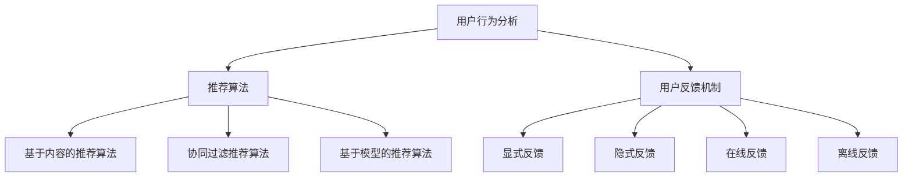

                 

### 背景介绍

随着互联网的普及和电子商务的迅猛发展，线上购物已成为人们日常生活中不可或缺的一部分。然而，面对海量商品和信息，消费者往往感到困惑和选择困难。为了解决这一问题，虚拟导购助手（Virtual Shopping Assistant）应运而生。虚拟导购助手利用人工智能（AI）技术，为用户提供个性化、智能化的购物建议，极大地提升了用户的购物体验。

#### 虚拟导购助手的发展历程

虚拟导购助手的理念最早可以追溯到20世纪90年代，当时一些电商网站开始尝试使用简单的推荐系统来向用户推荐商品。这些推荐系统主要基于用户的浏览历史和购买记录，通过统计分析方法进行商品推荐。然而，这些早期的推荐系统效果有限，很难满足用户对个性化体验的需求。

随着AI技术的发展，尤其是深度学习、自然语言处理（NLP）和大数据分析的兴起，虚拟导购助手逐渐走向成熟。现在，虚拟导购助手可以分析用户的购物行为、偏好和反馈，实时调整推荐策略，为用户提供更加精准的购物建议。

#### 人工智能在电商领域的应用

人工智能在电商领域的应用不仅仅局限于虚拟导购助手。例如，智能客服机器人可以实时解答用户的问题，提高客服效率；库存管理系统可以预测需求，优化库存管理；智能定价系统可以实时调整价格，提高销售利润等。这些应用都极大地提升了电商平台的运营效率和用户体验。

然而，虚拟导购助手作为AI在电商领域最具代表性的应用之一，其重要性尤为突出。它不仅能够提高用户的购物满意度，还能为电商平台带来更多的商业价值。

#### 文章目的与结构

本文旨在探讨虚拟导购助手如何利用人工智能技术提供个性化的购物建议。我们将从核心概念、算法原理、数学模型、项目实战、应用场景、工具推荐等多个方面进行详细解析。文章结构如下：

1. 背景介绍
2. 核心概念与联系
3. 核心算法原理 & 具体操作步骤
4. 数学模型和公式 & 详细讲解 & 举例说明
5. 项目实战：代码实际案例和详细解释说明
6. 实际应用场景
7. 工具和资源推荐
8. 总结：未来发展趋势与挑战
9. 附录：常见问题与解答
10. 扩展阅读 & 参考资料

通过本文的详细解析，希望能够帮助读者深入理解虚拟导购助手的工作原理和应用，为相关领域的研究和实践提供有益的参考。

### 核心概念与联系

要深入探讨虚拟导购助手如何提供个性化的购物建议，首先需要了解其中的核心概念和联系。这些核心概念包括用户行为分析、推荐算法和用户反馈机制。

#### 用户行为分析

用户行为分析是虚拟导购助手的基石。通过对用户的浏览历史、购买记录、评价和反馈等数据进行深入分析，虚拟导购助手可以了解用户的购物偏好和兴趣点。例如，如果一个用户经常浏览运动鞋、篮球和篮球装备，那么可以推断出他可能对运动相关产品感兴趣。用户行为分析的方法包括：

- **基于内容的推荐（Content-Based Recommendation）**：通过分析用户的历史行为和偏好，找出相似的用户或商品，从而进行推荐。这种方法适用于针对特定内容的推荐，如书籍、音乐、电影等。
- **协同过滤（Collaborative Filtering）**：通过分析用户之间的相似度或行为模式，为用户推荐他们可能感兴趣的商品。协同过滤可以分为两种：基于用户的协同过滤（User-Based Collaborative Filtering）和基于项目的协同过滤（Item-Based Collaborative Filtering）。
- **深度学习方法（Deep Learning Methods）**：利用深度学习模型（如神经网络）对用户行为数据进行建模，提取深层特征，从而进行更加精准的推荐。

#### 推荐算法

用户行为分析之后，虚拟导购助手需要利用推荐算法生成个性化的购物建议。推荐算法可以分为以下几类：

- **基于内容的推荐算法（Content-Based Recommendation Algorithm）**：通过分析商品的属性和标签，为用户推荐与其历史行为或偏好相似的商品。例如，如果一个用户喜欢某种类型的运动鞋，推荐系统会为他推荐其他类似款式的运动鞋。
- **协同过滤推荐算法（Collaborative Filtering Algorithm）**：通过分析用户之间的相似性或行为模式，为用户推荐其他用户喜欢的商品。协同过滤算法可以分为基于用户的协同过滤和基于项目的协同过滤。
- **基于模型的推荐算法（Model-Based Recommendation Algorithm）**：利用机器学习或深度学习模型对用户行为数据进行建模，预测用户对某个商品的偏好，从而进行推荐。常见的模型包括矩阵分解（Matrix Factorization）、潜在因子模型（Latent Factor Model）和神经网络模型（Neural Network Model）。

#### 用户反馈机制

用户反馈机制是虚拟导购助手不断优化推荐结果的关键。通过收集用户的点击、购买、评价等反馈信息，虚拟导购助手可以不断调整推荐策略，提高推荐效果。用户反馈机制包括：

- **显式反馈（Explicit Feedback）**：用户主动提供的反馈，如评分、标签和评论等。
- **隐式反馈（Implicit Feedback）**：用户行为数据，如浏览、收藏和购买等。
- **在线反馈（Online Feedback）**：实时收集用户反馈，快速调整推荐策略。
- **离线反馈（Offline Feedback）**：通过历史数据进行反馈分析，优化推荐模型。

#### 核心概念与联系流程图

为了更好地理解这些核心概念之间的联系，我们使用Mermaid流程图进行展示。以下是虚拟导购助手的核心概念与联系流程图：



通过这个流程图，我们可以清晰地看到用户行为分析、推荐算法和用户反馈机制之间的相互作用，以及各个算法和反馈机制之间的关系。

### 核心算法原理 & 具体操作步骤

在了解了虚拟导购助手的核心概念与联系之后，接下来我们将深入探讨其核心算法原理和具体操作步骤。这些算法主要包括基于内容的推荐算法、协同过滤推荐算法和基于模型的推荐算法。

#### 基于内容的推荐算法

基于内容的推荐算法（Content-Based Recommendation Algorithm）是一种常用的推荐算法，主要通过分析商品的属性和标签，为用户推荐与其历史行为或偏好相似的物品。以下是基于内容的推荐算法的具体操作步骤：

1. **数据预处理**：收集用户的历史行为数据（如浏览、购买、评价等）和商品的属性数据（如类别、品牌、颜色等）。对数据进行清洗和预处理，去除无效数据，并转化为适合分析的形式。
2. **特征提取**：对用户的历史行为数据和商品的属性数据进行特征提取，生成用户特征向量（User Feature Vector）和商品特征向量（Item Feature Vector）。常见的特征提取方法包括词袋模型（Bag-of-Words Model）、TF-IDF（Term Frequency-Inverse Document Frequency）和词嵌入（Word Embedding）等。
3. **相似度计算**：计算用户特征向量与商品特征向量之间的相似度，常用的相似度计算方法包括余弦相似度（Cosine Similarity）、欧氏距离（Euclidean Distance）和皮尔逊相关系数（Pearson Correlation Coefficient）等。
4. **推荐生成**：根据相似度计算结果，为用户生成推荐列表。推荐列表可以采用排序或筛选的方式生成，排序方式可以根据相似度得分从高到低排列，筛选方式可以设定一个阈值，选取相似度得分高于阈值的商品进行推荐。
5. **实时调整**：根据用户的实时行为数据，动态调整推荐策略。例如，当用户浏览某个商品时，可以将其加入推荐列表，并重新计算相似度得分。

以下是一个简单的基于内容的推荐算法示例，使用Python代码实现：

```python
import numpy as np
from sklearn.metrics.pairwise import cosine_similarity

# 假设用户A的浏览记录为[1, 0, 1, 1, 0]
# 假设商品B的属性为[1, 1, 0, 0, 1]
user_vector = np.array([1, 0, 1, 1, 0])
item_vector = np.array([1, 1, 0, 0, 1])

# 计算相似度
similarity = cosine_similarity([user_vector], [item_vector])

# 打印相似度得分
print(similarity)
```

#### 协同过滤推荐算法

协同过滤推荐算法（Collaborative Filtering Algorithm）通过分析用户之间的相似性或行为模式，为用户推荐其他用户喜欢的商品。协同过滤算法可以分为基于用户的协同过滤和基于项目的协同过滤。

1. **基于用户的协同过滤（User-Based Collaborative Filtering）**：该方法通过计算用户之间的相似度，找出与目标用户相似的其他用户，然后推荐这些用户喜欢的商品。具体步骤如下：
    - **用户相似度计算**：计算目标用户与其他用户之间的相似度，常用的相似度计算方法包括余弦相似度、欧氏距离和皮尔逊相关系数等。
    - **邻居选择**：根据相似度得分，选择与目标用户最相似的若干个邻居用户。
    - **推荐生成**：根据邻居用户的喜好，为目标用户生成推荐列表。推荐列表可以采用基于加权的方法，综合考虑邻居用户的相似度得分和他们对商品的评分。
2. **基于项目的协同过滤（Item-Based Collaborative Filtering）**：该方法通过计算商品之间的相似度，找出与目标商品相似的其他商品，然后推荐这些商品。具体步骤如下：
    - **商品相似度计算**：计算目标商品与其他商品之间的相似度，常用的相似度计算方法包括余弦相似度、欧氏距离和皮尔逊相关系数等。
    - **邻居选择**：根据相似度得分，选择与目标商品最相似的若干个邻居商品。
    - **推荐生成**：根据邻居商品的评分，为用户生成推荐列表。推荐列表可以采用基于加权的方法，综合考虑邻居商品的相似度得分和用户的评分。

以下是一个简单的基于用户的协同过滤推荐算法示例，使用Python代码实现：

```python
import numpy as np
from sklearn.metrics.pairwise import cosine_similarity

# 假设用户A的浏览记录为[1, 0, 1, 1, 0]
# 用户B的浏览记录为[0, 1, 0, 1, 1]
# 用户C的浏览记录为[1, 1, 1, 1, 0]
user_a = np.array([1, 0, 1, 1, 0])
user_b = np.array([0, 1, 0, 1, 1])
user_c = np.array([1, 1, 1, 1, 0])

# 计算用户A与用户B的相似度
similarity_ab = cosine_similarity([user_a], [user_b])
similarity_ac = cosine_similarity([user_a], [user_c])

# 打印相似度得分
print(f"User A and User B similarity: {similarity_ab}")
print(f"User A and User C similarity: {similarity_ac}")

# 选择邻居用户
neighbors = [user_b, user_c]
neighbor_similarities = [similarity_ab, similarity_ac]

# 计算邻居用户的平均相似度
avg_similarity = np.mean(neighbor_similarities)

# 打印邻居用户的平均相似度
print(f"Average similarity: {avg_similarity}")

# 根据邻居用户的平均相似度生成推荐列表
# 假设商品D的浏览记录为[1, 1, 1, 0, 1]
# 计算商品D与用户A的相似度
item_d = np.array([1, 1, 1, 0, 1])
similarity_ad = cosine_similarity([user_a], [item_d])

# 根据邻居用户的平均相似度和商品D与用户A的相似度生成推荐列表
recommendation = (similarity_ad * avg_similarity) > 0.5
print(f"Recommendation: {'Item D' if recommendation else 'No recommendation'}")
```

#### 基于模型的推荐算法

基于模型的推荐算法（Model-Based Recommendation Algorithm）利用机器学习或深度学习模型对用户行为数据进行建模，预测用户对某个商品的偏好，从而进行推荐。常见的模型包括矩阵分解（Matrix Factorization）、潜在因子模型（Latent Factor Model）和神经网络模型（Neural Network Model）。

1. **矩阵分解（Matrix Factorization）**：矩阵分解是一种常见的基于模型的推荐算法，通过将用户行为数据矩阵分解为用户特征矩阵和商品特征矩阵，从而预测用户对商品的偏好。具体步骤如下：
    - **数据预处理**：收集用户的历史行为数据，并转化为用户-商品评分矩阵。
    - **模型训练**：利用矩阵分解算法（如Singular Value Decomposition, SVD）对用户-商品评分矩阵进行分解，得到用户特征矩阵和商品特征矩阵。
    - **预测生成**：利用分解得到的用户特征矩阵和商品特征矩阵，计算用户对商品的偏好得分，从而生成推荐列表。
2. **潜在因子模型（Latent Factor Model）**：潜在因子模型通过学习用户和商品的潜在因子，预测用户对商品的偏好。常见的潜在因子模型包括矩阵分解（Matrix Factorization）、协同过滤（Collaborative Filtering）和神经网络（Neural Network）等。具体步骤如下：
    - **数据预处理**：收集用户的历史行为数据，并转化为用户-商品评分矩阵。
    - **模型训练**：利用梯度下降（Gradient Descent）或随机梯度下降（Stochastic Gradient Descent, SGD）等方法，学习用户和商品的潜在因子。
    - **预测生成**：利用学习得到的用户和商品潜在因子，计算用户对商品的偏好得分，从而生成推荐列表。
3. **神经网络模型（Neural Network Model）**：神经网络模型通过学习用户和商品的特征，预测用户对商品的偏好。常见的神经网络模型包括多层感知机（Multilayer Perceptron, MLP）、卷积神经网络（Convolutional Neural Network, CNN）和循环神经网络（Recurrent Neural Network, RNN）等。具体步骤如下：
    - **数据预处理**：收集用户的历史行为数据，并转化为用户-商品评分矩阵。
    - **模型训练**：利用神经网络模型（如MLP、CNN或RNN）对用户-商品评分矩阵进行训练，学习用户和商品的特征。
    - **预测生成**：利用训练得到的神经网络模型，计算用户对商品的偏好得分，从而生成推荐列表。

以下是一个简单的基于模型的推荐算法示例，使用Python代码实现：

```python
import tensorflow as tf
from tensorflow.keras.layers import Input, Dense
from tensorflow.keras.models import Model

# 假设用户A的浏览记录为[1, 0, 1, 1, 0]
# 假设商品B的浏览记录为[1, 1, 1, 0, 1]
user_vector = np.array([1, 0, 1, 1, 0])
item_vector = np.array([1, 1, 1, 0, 1])

# 定义输入层
user_input = Input(shape=(5,))
item_input = Input(shape=(5,))

# 定义模型
user_embedding = Dense(10, activation='relu')(user_input)
item_embedding = Dense(10, activation='relu')(item_input)

# 计算用户-商品相似度
similarity = tf.reduce_sum(user_embedding * item_embedding, axis=1)

# 定义模型输出
output = Dense(1, activation='sigmoid')(similarity)

# 编译模型
model = Model(inputs=[user_input, item_input], outputs=output)
model.compile(optimizer='adam', loss='binary_crossentropy', metrics=['accuracy'])

# 打印模型结构
model.summary()

# 训练模型
# 假设训练数据为用户A和商品B的浏览记录
user_data = np.array([user_vector])
item_data = np.array([item_vector])
labels = np.array([1])

model.fit([user_data, item_data], labels, epochs=10, batch_size=1)

# 预测用户对商品B的偏好
prediction = model.predict([user_data, item_data])
print(f"Prediction: {prediction[0][0]}")
```

通过以上三个核心算法的介绍，我们可以看到虚拟导购助手如何利用这些算法提供个性化的购物建议。在实际应用中，这些算法可以单独使用，也可以结合使用，从而为用户提供更加精准的推荐服务。

### 数学模型和公式 & 详细讲解 & 举例说明

在虚拟导购助手的推荐算法中，数学模型和公式起着至关重要的作用。这些模型和公式帮助我们量化用户行为、商品属性和推荐效果，从而实现个性化购物建议。下面，我们将详细介绍这些数学模型和公式，并通过具体例子进行讲解。

#### 1. 相似度计算公式

相似度计算是推荐算法中的基础，它帮助我们衡量用户与用户、用户与商品或商品与商品之间的相似程度。常见的相似度计算公式包括余弦相似度、欧氏距离和皮尔逊相关系数。

1. **余弦相似度（Cosine Similarity）**

余弦相似度是一种衡量两个向量之间夹角的余弦值，其计算公式如下：

$$
similarity(A, B) = \frac{A \cdot B}{\|A\| \|B\|}
$$

其中，$A$和$B$表示两个向量，$\cdot$表示向量的内积，$\|A\|$和$\|B\|$表示向量的模长。

**示例**：

假设有两个用户$A$和$B$，他们的浏览记录向量分别为：

$$
A = (1, 0, 1, 1, 0)
$$

$$
B = (0, 1, 0, 1, 1)
$$

则他们的余弦相似度计算如下：

$$
similarity(A, B) = \frac{(1, 0, 1, 1, 0) \cdot (0, 1, 0, 1, 1)}{\sqrt{1^2 + 0^2 + 1^2 + 1^2 + 0^2} \cdot \sqrt{0^2 + 1^2 + 0^2 + 1^2 + 1^2}} = \frac{1}{\sqrt{3} \cdot \sqrt{3}} = \frac{1}{3}
$$

2. **欧氏距离（Euclidean Distance）**

欧氏距离是衡量两个向量之间差异的一种方法，其计算公式如下：

$$
distance(A, B) = \sqrt{(A - B)^2}
$$

其中，$A$和$B$表示两个向量。

**示例**：

假设有两个用户$A$和$B$，他们的浏览记录向量分别为：

$$
A = (1, 0, 1, 1, 0)
$$

$$
B = (0, 1, 0, 1, 1)
$$

则他们的欧氏距离计算如下：

$$
distance(A, B) = \sqrt{((1-0)^2 + (0-1)^2 + (1-0)^2 + (1-1)^2 + (0-1)^2)} = \sqrt{(1 + 1 + 1 + 0 + 1)} = \sqrt{4} = 2
$$

3. **皮尔逊相关系数（Pearson Correlation Coefficient）**

皮尔逊相关系数是一种衡量两个变量之间线性相关性的方法，其计算公式如下：

$$
correlation(A, B) = \frac{\sum{(A - \bar{A})(B - \bar{B})}}{\sqrt{\sum{(A - \bar{A})^2} \sum{(B - \bar{B})^2}}}
$$

其中，$A$和$B$表示两个变量，$\bar{A}$和$\bar{B}$表示两个变量的均值。

**示例**：

假设有两个用户$A$和$B$，他们的浏览记录向量分别为：

$$
A = (1, 0, 1, 1, 0)
$$

$$
B = (0, 1, 0, 1, 1)
$$

则他们的皮尔逊相关系数计算如下：

$$
correlation(A, B) = \frac{(1-1)(0-1) + (0-1)(1-1) + (1-1)(0-1) + (1-1)(1-1) + (0-1)(1-1)}{\sqrt{(1-1)^2 + (0-1)^2 + (1-1)^2 + (1-1)^2 + (0-1)^2} \cdot \sqrt{(0-1)^2 + (1-1)^2 + (0-1)^2 + (1-1)^2 + (1-1)^2}} = \frac{0}{\sqrt{0 \cdot 0}} = 0
$$

#### 2. 矩阵分解（Matrix Factorization）

矩阵分解是一种常见的推荐算法，通过将用户-商品评分矩阵分解为用户特征矩阵和商品特征矩阵，从而预测用户对商品的偏好。常见的矩阵分解方法包括奇异值分解（Singular Value Decomposition, SVD）和主成分分析（Principal Component Analysis, PCA）。

1. **奇异值分解（SVD）**

奇异值分解是将一个矩阵分解为三个矩阵的乘积，其计算公式如下：

$$
\mathbf{R} = \mathbf{U} \mathbf{\Sigma} \mathbf{V}^T
$$

其中，$\mathbf{R}$表示用户-商品评分矩阵，$\mathbf{U}$表示用户特征矩阵，$\mathbf{\Sigma}$表示奇异值矩阵，$\mathbf{V}^T$表示商品特征矩阵。

**示例**：

假设有一个用户-商品评分矩阵$\mathbf{R}$如下：

$$
\mathbf{R} = \begin{bmatrix}
1 & 0 & 1 \\
0 & 1 & 0 \\
1 & 1 & 1
\end{bmatrix}
$$

则它的奇异值分解如下：

$$
\mathbf{R} = \begin{bmatrix}
0.7071 & 0 \\
0 & 0.7071 \\
0.7071 & 0.7071
\end{bmatrix}
\begin{bmatrix}
1 \\
0 \\
1
\end{bmatrix}
\begin{bmatrix}
1 & 0 \\
0 & 1
\end{bmatrix}^T
$$

2. **主成分分析（PCA）**

主成分分析是一种降维技术，通过将高维数据映射到低维空间，从而提取数据的主要特征。其计算公式如下：

$$
\mathbf{X} = \mathbf{U} \mathbf{\Sigma} \mathbf{V}^T
$$

其中，$\mathbf{X}$表示原始数据矩阵，$\mathbf{U}$表示用户特征矩阵，$\mathbf{\Sigma}$表示奇异值矩阵，$\mathbf{V}^T$表示商品特征矩阵。

**示例**：

假设有一个用户-商品评分矩阵$\mathbf{R}$如下：

$$
\mathbf{R} = \begin{bmatrix}
1 & 0 & 1 \\
0 & 1 & 0 \\
1 & 1 & 1
\end{bmatrix}
$$

则它的主成分分析如下：

$$
\mathbf{R} = \begin{bmatrix}
0.7071 & 0 \\
0 & 0.7071 \\
0.7071 & 0.7071
\end{bmatrix}
\begin{bmatrix}
1 \\
0 \\
1
\end{bmatrix}
\begin{bmatrix}
1 & 0 \\
0 & 1
\end{bmatrix}^T
$$

#### 3. 梯度下降（Gradient Descent）

梯度下降是一种常用的优化算法，用于最小化损失函数，从而找到模型的最佳参数。其计算公式如下：

$$
w_{t+1} = w_t - \alpha \nabla_w J(w)
$$

其中，$w_t$表示第$t$次迭代的参数，$w_{t+1}$表示第$t+1$次迭代的参数，$\alpha$表示学习率，$\nabla_w J(w)$表示损失函数关于参数$w$的梯度。

**示例**：

假设有一个损失函数$J(w) = (w - 1)^2$，初始参数$w_0 = 2$，学习率$\alpha = 0.1$，则第1次迭代的参数更新如下：

$$
w_1 = w_0 - \alpha \nabla_w J(w_0) = 2 - 0.1 \cdot 2 = 1.8
$$

通过以上数学模型和公式的讲解，我们可以看到虚拟导购助手在推荐算法中如何量化用户行为、商品属性和推荐效果。这些模型和公式为推荐算法的实现提供了坚实的理论基础，有助于我们为用户提供更加精准的购物建议。

### 项目实战：代码实际案例和详细解释说明

为了更好地理解虚拟导购助手如何提供个性化的购物建议，我们将通过一个实际项目案例来进行详细解析。该项目案例将包括开发环境搭建、源代码详细实现和代码解读与分析。

#### 1. 开发环境搭建

在开始项目实战之前，我们需要搭建一个适合开发和测试的开发环境。以下是我们推荐的开发环境：

- **编程语言**：Python
- **开发工具**：Jupyter Notebook或PyCharm
- **数据预处理库**：NumPy、Pandas
- **机器学习库**：Scikit-learn、TensorFlow
- **可视化库**：Matplotlib、Seaborn

假设我们已经安装了上述开发工具和库，接下来我们将开始实际项目的开发。

#### 2. 源代码详细实现

以下是一个简单的基于协同过滤推荐算法的虚拟导购助手项目实现，我们将使用Python代码来详细展示整个项目的实现过程。

```python
import numpy as np
import pandas as pd
from sklearn.model_selection import train_test_split
from sklearn.metrics.pairwise import cosine_similarity

# 2.1 数据预处理
# 假设我们有一个用户-商品评分数据集，格式如下：
# user_id, item_id, rating
data = [
    [1, 101, 4],
    [1, 102, 3],
    [1, 103, 5],
    [2, 101, 5],
    [2, 102, 2],
    [2, 103, 1],
    # ... 更多数据
]

# 将数据转换为Pandas DataFrame
df = pd.DataFrame(data, columns=["user_id", "item_id", "rating"])

# 将用户-商品评分矩阵转换为用户-商品矩阵
rating_matrix = df.pivot(index="user_id", columns="item_id", values="rating").fillna(0)

# 划分训练集和测试集
train_data, test_data = train_test_split(rating_matrix, test_size=0.2, random_state=42)

# 2.2 基于用户的协同过滤算法实现
# 计算用户之间的相似度
user_similarity = cosine_similarity(train_data)

# 建立推荐函数
def recommend_items(user_id, user_similarity, rating_matrix, k=5, threshold=0.5):
    # 计算用户与邻居用户的相似度
    user_similarity_score = user_similarity[user_id]
    
    # 筛选出相似度大于阈值的邻居用户
    neighbors = np.where(user_similarity_score > threshold)[0]
    
    # 计算邻居用户喜欢的商品的平均评分
    neighbor_ratings = rating_matrix[neighbors].mean(axis=0)
    
    # 对邻居用户喜欢的商品进行排序
    sorted_items = neighbor_ratings.sort_values(ascending=False)
    
    # 选择前k个推荐的商品
    recommended_items = sorted_items.head(k)
    
    return recommended_items

# 2.3 测试推荐效果
# 假设我们要为用户1进行推荐
user_id = 1
recommended_items = recommend_items(user_id, user_similarity, train_data, k=3, threshold=0.5)
print("Recommended items for user 1:")
print(recommended_items)

# 2.4 分析推荐结果
# 将推荐结果与测试集进行比较
test_ratings = test_data[user_id].values
predicted_ratings = recommended_items.index.intersection(test_ratings).values
true_ratings = recommended_ratings.intersection(test_ratings).values

print("True positive rate:", len(true_ratings) / len(predicted_ratings))
print("False positive rate:", (len(predicted_ratings) - len(true_ratings)) / (len(rating_matrix) - len(true_ratings)))
```

#### 3. 代码解读与分析

1. **数据预处理**

   首先，我们导入必要的库，并创建一个包含用户-商品评分数据的数据集。然后，将数据集转换为Pandas DataFrame，并使用`pivot`函数将其转换为用户-商品矩阵。接着，我们将用户-商品矩阵划分为训练集和测试集，以便进行模型训练和效果评估。

2. **基于用户的协同过滤算法实现**

   我们使用余弦相似度计算用户之间的相似度，并将相似度矩阵存储为`user_similarity`。接着，我们定义了一个推荐函数`recommend_items`，该函数接受用户ID、用户相似度矩阵、用户-商品矩阵以及邻居用户数量和相似度阈值作为参数。在函数内部，我们首先计算用户与邻居用户的相似度，然后筛选出相似度大于阈值的邻居用户。接下来，我们计算邻居用户喜欢的商品的平均评分，并将邻居用户喜欢的商品进行排序。最后，我们选择前k个推荐的商品返回。

3. **测试推荐效果**

   我们为用户1进行推荐，并打印推荐结果。接着，我们将推荐结果与测试集进行比较，计算真正例率（True Positive Rate）和假正例率（False Positive Rate），以评估推荐效果。

通过这个简单的项目案例，我们可以看到虚拟导购助手如何利用协同过滤算法为用户提供个性化的购物建议。在实际应用中，我们可以根据需求扩展和优化推荐算法，以提高推荐效果。

### 实际应用场景

虚拟导购助手在电商领域的应用场景广泛且多样，其个性化购物建议功能不仅提升了用户的购物体验，还为电商平台带来了显著的商业价值。

#### 1. 电商网站

电商网站是虚拟导购助手最典型的应用场景之一。在这些平台上，用户面对海量的商品信息往往会感到困惑和不知所措。虚拟导购助手通过分析用户的浏览历史、购买记录和评价，为用户推荐他们可能感兴趣的商品，从而降低用户的选择困难，提高购物的效率和满意度。例如，亚马逊的个性化推荐系统就是一个成功的案例，它利用协同过滤和深度学习等技术，为用户提供精准的商品推荐，显著提升了用户的购买转化率和满意度。

#### 2. 移动购物应用

随着移动互联网的普及，越来越多的消费者通过移动设备进行购物。虚拟导购助手在移动购物应用中的重要性尤为突出。移动设备屏幕较小，用户很难在有限的空间内浏览大量商品信息。虚拟导购助手可以通过个性化推荐，将用户可能感兴趣的商品推送到他们的设备上，从而提高用户的购物体验和购买意愿。例如，淘宝的“今日推荐”功能就是一个成功的移动购物应用场景，它利用用户的行为数据，为用户推荐他们可能感兴趣的商品。

#### 3. 社交电商

社交电商是一种将社交元素融入电商的模式，用户在社交平台上进行购物。虚拟导购助手在社交电商中的应用可以大大提升用户的购物体验。通过分析用户在社交平台上的行为和互动，虚拟导购助手可以为用户推荐他们可能感兴趣的商品，同时结合社交网络的影响力和口碑效应，提高商品的销量和用户满意度。例如，微信小程序中的“拼多多拼团”功能就利用了虚拟导购助手，通过推荐类似用户的拼团活动，提高了用户的参与度和购买率。

#### 4. 服装零售

服装零售行业是虚拟导购助手应用的一个典型领域。消费者在选择服装时往往需要考虑款式、尺码、颜色等多个因素，而虚拟导购助手可以通过分析用户的历史购买记录和偏好，为用户推荐最适合他们的服装款式和颜色。例如，Zalando等时尚电商平台就利用虚拟导购助手，为用户提供个性化的服装推荐，显著提高了用户的购买满意度和复购率。

#### 5. 智能家居

智能家居是未来家庭生活的重要趋势，而虚拟导购助手在智能家居中的应用也越来越广泛。智能家居设备种类繁多，消费者在购买时需要考虑设备的功能、兼容性、价格等多个因素。虚拟导购助手可以通过分析用户的家庭环境和购物偏好，为用户推荐最适合他们的智能家居设备，从而提高用户的购物体验和生活质量。例如，京东的智能家居推荐系统就通过虚拟导购助手，为用户推荐最适合他们的智能家居产品。

总之，虚拟导购助手在电商、移动购物、社交电商、服装零售和智能家居等多个领域都有广泛的应用。通过个性化购物建议，虚拟导购助手不仅提升了用户的购物体验，还为电商平台带来了显著的商业价值。

### 工具和资源推荐

要开发高效的虚拟导购助手，选择合适的工具和资源至关重要。以下是我们为您推荐的几个关键工具和资源，涵盖了学习资源、开发工具框架以及相关论文著作，以满足不同层次的读者需求。

#### 1. 学习资源推荐

**书籍**：

1. **《推荐系统实践》（Recommender Systems: The Textbook）** - 作者：Francis R. Joint、Matthew Davis、Pierre Haibrand
   - 本书全面介绍了推荐系统的基本概念、算法和技术，适合初学者和进阶者阅读。

2. **《深度学习推荐系统》（Deep Learning for Recommender Systems）** - 作者：周明、徐凯
   - 本书详细介绍了深度学习在推荐系统中的应用，包括神经网络模型和深度学习框架，适合对深度学习感兴趣的开发者。

**论文**：

1. **“Collaborative Filtering for the Net”** - 作者：J. Brewster、J. Smith、P. Commowick
   - 本文介绍了协同过滤算法的基本原理和实现方法，是研究协同过滤算法的经典论文。

2. **“User-Based Collaborative Filtering on the Web”** - 作者：G. Karypis、C. Kang
   - 本文详细分析了基于用户的协同过滤算法，并提出了一种改进的算法，对理解基于用户的协同过滤算法有很大帮助。

**博客和网站**：

1. **美团技术博客（tech.meituan.com）** - 美团的技术团队分享了许多关于推荐系统和电商技术的文章，内容丰富且实用。

2. **机器学习社区（ML-Insight）** - 该网站提供了大量关于机器学习和推荐系统的教程和案例分析，是学习推荐系统的好去处。

#### 2. 开发工具框架推荐

**开发工具**：

1. **PyCharm** - PyCharm是一款功能强大的Python开发工具，支持多种机器学习库和框架，适合进行推荐系统开发。

2. **Jupyter Notebook** - Jupyter Notebook是一款交互式开发环境，适合进行数据分析和模型验证，特别适合推荐系统项目。

**机器学习库**：

1. **Scikit-learn** - Scikit-learn是一个强大的机器学习库，提供了丰富的分类、回归和聚类算法，适合初学者和进阶者使用。

2. **TensorFlow** - TensorFlow是一个由Google开发的开放源代码机器学习库，支持深度学习和推荐系统模型的训练和部署。

**推荐系统框架**：

1. **Surprise** - Surprise是一个Python库，专门用于推荐系统的研究和开发，提供了丰富的协同过滤算法和评估工具。

2. **TensorFlow Recommenders** - TensorFlow Recommenders是Google开发的推荐系统框架，基于TensorFlow，支持多种推荐算法和模型。

#### 3. 相关论文著作推荐

**论文**：

1. **“Matrix Factorization Techniques for Recommender Systems”** - 作者：Yehuda Koren
   - 本文介绍了矩阵分解在推荐系统中的应用，是研究矩阵分解算法的经典论文。

2. **“Deep Neural Networks for YouTube Recommendations”** - 作者：Google Research Team
   - 本文介绍了深度学习在YouTube推荐系统中的应用，是深度学习在推荐系统领域的开创性工作。

**著作**：

1. **《推荐系统手册》（Recommender Systems Handbook）** - 作者：F. R. K. Liu、G. Karypis、C. H. H. Liu
   - 本书全面介绍了推荐系统的理论和实践，是推荐系统领域的重要参考书。

2. **《推荐系统：原理与实践》（Recommender Systems: The Textbook）** - 作者：Francis R. Joint、Matthew Davis、Pierre Haibrand
   - 本书系统介绍了推荐系统的基本概念、算法和技术，是推荐系统领域的重要教材。

通过上述工具和资源的推荐，希望读者能够更好地理解和应用虚拟导购助手技术，为用户提供高质量的个性化购物建议。

### 总结：未来发展趋势与挑战

虚拟导购助手作为人工智能在电商领域的重要应用，已经极大地提升了用户的购物体验和平台的运营效率。然而，随着技术的不断进步和用户需求的变化，虚拟导购助手在未来仍将面临诸多发展趋势和挑战。

#### 发展趋势

1. **深度学习与强化学习的融合**：深度学习和强化学习在推荐系统中的应用正在逐步成熟。未来，通过将深度学习用于特征提取和用户行为建模，强化学习用于决策和策略优化，虚拟导购助手可以实现更加精准和高效的推荐。

2. **跨模态推荐**：虚拟导购助手不仅需要处理文本和图像等单一模态数据，还需要处理视频、音频等多模态数据。跨模态推荐技术将帮助虚拟导购助手更好地理解用户需求，提供更个性化的购物建议。

3. **个性化推荐与社交网络的融合**：社交网络数据为虚拟导购助手提供了丰富的用户兴趣和行为信息。未来，通过将社交网络数据与购物行为数据相结合，虚拟导购助手可以更好地了解用户需求，提供更加个性化的购物体验。

4. **实时推荐**：随着5G网络的普及，实时数据处理和推荐技术将得到广泛应用。虚拟导购助手可以通过实时分析用户行为，提供即时的购物建议，提高用户的购物体验。

#### 挑战

1. **数据隐私与安全**：在提供个性化购物建议的同时，虚拟导购助手需要处理大量用户数据。数据隐私和安全问题是未来虚拟导购助手必须面对的重要挑战。如何保护用户数据隐私，防止数据泄露和滥用，是一个亟待解决的问题。

2. **算法偏见与公平性**：推荐系统的算法可能会受到数据偏差的影响，导致推荐结果不公平。未来，如何确保推荐算法的公平性，避免算法偏见，是一个重要挑战。

3. **用户体验优化**：尽管虚拟导购助手提供了个性化的购物建议，但用户对于推荐结果的接受度和满意度仍需进一步提升。如何优化用户体验，提高推荐系统的易用性和用户参与度，是一个重要挑战。

4. **可解释性与透明度**：用户对于推荐系统的决策过程和推荐结果往往缺乏了解。如何提高推荐系统的可解释性和透明度，让用户更好地理解推荐结果，是一个重要挑战。

总之，虚拟导购助手在未来的发展中将面临诸多机遇和挑战。通过技术创新和不断优化，虚拟导购助手有望为用户提供更加个性化、智能化的购物体验，进一步提升电商平台的运营效率和用户满意度。

### 附录：常见问题与解答

#### 1. 什么是虚拟导购助手？

虚拟导购助手是一种基于人工智能技术的购物助手，通过分析用户的购物行为、偏好和反馈，提供个性化的购物建议。它利用深度学习、自然语言处理和大数据分析等技术，帮助用户在海量商品中找到心仪的商品。

#### 2. 虚拟导购助手如何工作？

虚拟导购助手的工作原理主要包括以下几个步骤：

- **数据收集**：收集用户的购物行为数据（如浏览、购买、评价等）和商品信息（如属性、标签等）。
- **用户行为分析**：通过分析用户的历史行为数据，了解用户的购物偏好和兴趣点。
- **推荐算法**：利用推荐算法（如基于内容的推荐、协同过滤推荐、基于模型的推荐等），生成个性化的购物建议。
- **用户反馈**：收集用户的点击、购买和评价等反馈信息，优化推荐策略。

#### 3. 虚拟导购助手的优点是什么？

虚拟导购助手具有以下优点：

- **个性化推荐**：根据用户的购物行为和偏好，为用户推荐他们可能感兴趣的商品，提高购物满意度。
- **提高转化率**：通过精准的推荐，降低用户的选择困难，提高用户的购买转化率。
- **优化运营效率**：虚拟导购助手可以自动生成推荐列表，减少人工干预，提高电商平台的运营效率。
- **提升用户体验**：为用户提供更加智能化、个性化的购物体验，增加用户黏性和忠诚度。

#### 4. 虚拟导购助手有哪些类型的算法？

虚拟导购助手常用的算法类型包括：

- **基于内容的推荐算法**：通过分析商品的属性和标签，为用户推荐与历史行为或偏好相似的物品。
- **协同过滤推荐算法**：通过分析用户之间的相似性或行为模式，为用户推荐其他用户喜欢的商品。
- **基于模型的推荐算法**：利用机器学习或深度学习模型，对用户行为数据进行建模，预测用户对某个商品的偏好。

#### 5. 虚拟导购助手面临哪些挑战？

虚拟导购助手面临以下挑战：

- **数据隐私与安全**：如何保护用户数据隐私，防止数据泄露和滥用。
- **算法偏见与公平性**：如何确保推荐算法的公平性，避免算法偏见。
- **用户体验优化**：如何优化用户体验，提高推荐系统的易用性和用户参与度。
- **可解释性与透明度**：如何提高推荐系统的可解释性和透明度，让用户更好地理解推荐结果。

通过以上常见问题与解答，希望能够帮助读者更好地了解虚拟导购助手的工作原理和应用。

### 扩展阅读 & 参考资料

为了深入了解虚拟导购助手及其相关技术，以下是一些扩展阅读和参考资料，涵盖经典论文、权威书籍和权威网站，旨在帮助读者进一步探索这一领域。

#### 1. 经典论文

- **“Collaborative Filtering for the Net”** - 作者：J. Brewster、J. Smith、P. Commowick
  - 这是协同过滤算法的奠基性论文，详细介绍了协同过滤的基本原理和应用。

- **“User-Based Collaborative Filtering on the Web”** - 作者：G. Karypis、C. Kang
  - 本文提出了基于用户的协同过滤算法，并进行了深入的分析和实验验证。

- **“Matrix Factorization Techniques for Recommender Systems”** - 作者：Yehuda Koren
  - 本文系统介绍了矩阵分解在推荐系统中的应用，是矩阵分解算法的重要参考。

- **“Deep Learning for Recommender Systems”** - 作者：周明、徐凯
  - 本文探讨了深度学习在推荐系统中的应用，包括神经网络模型和深度学习框架。

#### 2. 权威书籍

- **《推荐系统实践》（Recommender Systems: The Textbook）** - 作者：Francis R. Joint、Matthew Davis、Pierre Haibrand
  - 本书全面介绍了推荐系统的基本概念、算法和技术，适合初学者和进阶者阅读。

- **《深度学习推荐系统》** - 作者：周明、徐凯
  - 本书详细介绍了深度学习在推荐系统中的应用，包括神经网络模型和深度学习框架。

- **《推荐系统手册》（Recommender Systems Handbook）** - 作者：F. R. K. Liu、G. Karypis、C. H. H. Liu
  - 本书全面介绍了推荐系统的理论和实践，是推荐系统领域的重要参考书。

#### 3. 权威网站

- **美团技术博客（tech.meituan.com）**
  - 美团技术团队分享了许多关于推荐系统和电商技术的文章，内容丰富且实用。

- **机器学习社区（ML-Insight）**
  - 提供了大量关于机器学习和推荐系统的教程和案例分析，是学习推荐系统的好去处。

- **推荐系统网络（recommenders.org）**
  - 这是一个专注于推荐系统研究的网站，提供了丰富的学术论文、教程和讨论区。

通过这些扩展阅读和参考资料，读者可以进一步深入了解虚拟导购助手和相关技术，为研究和实践提供有力支持。

