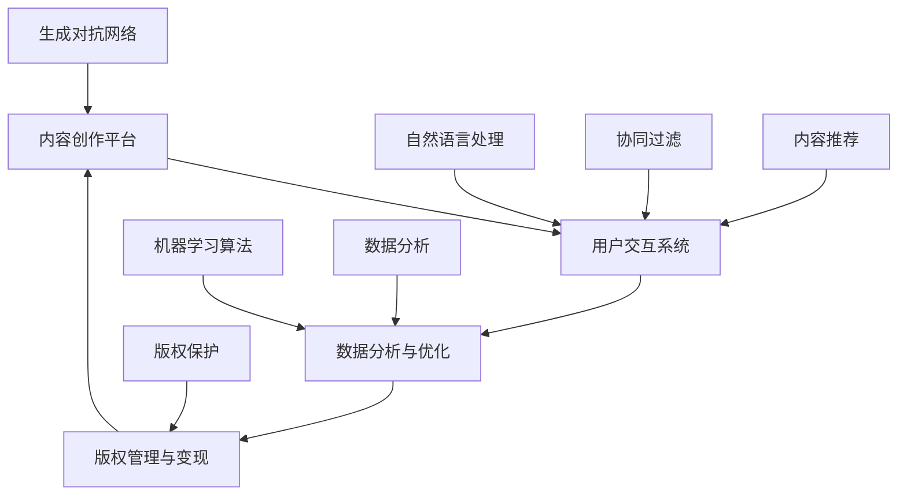

                 

# 虚拟文化孵化器：AI塑造的新型社会规范实验室

## 概述

在数字化时代，人工智能（AI）正在以惊人的速度改变我们的生活方式和社会结构。其中一个重要的变革领域是虚拟文化，它不仅影响娱乐、教育，还深刻地塑造了我们的社会规范。本文将探讨一个全新的概念——虚拟文化孵化器，以及AI如何在这个领域中扮演关键角色，塑造出符合未来发展趋势的新型社会规范。

关键词：虚拟文化、孵化器、AI、社会规范、未来趋势

摘要：本文首先介绍虚拟文化孵化器的概念和背景，接着深入探讨AI在这一领域中的核心作用，包括核心算法、数学模型、实际应用场景等。最后，文章将对未来的发展趋势和挑战进行总结，并提供相关的学习资源和工具推荐，以帮助读者更深入地理解这一领域。

## 1. 背景介绍

### 1.1 虚拟文化的兴起

随着互联网的普及和计算机技术的发展，虚拟文化逐渐成为我们日常生活的重要组成部分。从虚拟现实（VR）游戏、社交媒体平台到在线教育、虚拟演唱会，虚拟文化不仅改变了我们的娱乐方式，还重新定义了社交互动的规则。

### 1.2 AI在虚拟文化中的应用

AI技术，特别是机器学习和深度学习，为虚拟文化的创新提供了强大的动力。通过数据分析、自然语言处理、计算机视觉等技术，AI能够创造出更加个性化、沉浸式的虚拟体验，同时也为虚拟文化孵化器的建立提供了技术支持。

### 1.3 虚拟文化孵化器的概念

虚拟文化孵化器是一个创新的平台，旨在通过AI技术加速虚拟文化的创作和发展。它不仅提供了一个集创作、展示和互动于一体的环境，还通过算法优化和数据分析，帮助内容创作者更精准地了解用户需求，从而推动虚拟文化的持续创新。

## 2. 核心概念与联系

### 2.1 虚拟文化孵化器的架构

虚拟文化孵化器通常由以下几个核心模块组成：

1. **内容创作平台**：提供丰富的创作工具和资源，帮助内容创作者快速搭建虚拟文化项目。
2. **用户交互系统**：通过AI技术，实现用户与虚拟内容的实时交互，提升用户体验。
3. **数据分析与优化**：利用机器学习算法，分析用户行为和偏好，优化内容推荐和用户体验。
4. **版权管理与变现**：提供完善的版权保护和内容变现机制，确保创作者的利益。

### 2.2 AI技术在虚拟文化孵化器中的应用

AI技术在虚拟文化孵化器中扮演着至关重要的角色，主要体现在以下几个方面：

1. **内容生成**：通过生成对抗网络（GAN）等技术，AI可以自动生成高质量的虚拟文化内容，如音乐、图像和视频等。
2. **个性化推荐**：利用协同过滤、内容推荐等算法，AI可以精准地为用户提供个性化的内容推荐。
3. **自然语言处理**：通过自然语言处理技术，AI可以理解和生成自然语言，实现智能对话和互动。
4. **用户行为分析**：通过数据分析，AI可以深入挖掘用户行为模式，为虚拟文化的发展提供数据支持。

### 2.3 社会规范的变迁

随着虚拟文化孵化器的发展，社会规范也在不断变迁。传统的道德和法律规范在虚拟世界中面临着新的挑战，同时也需要适应新的环境。例如，虚拟身份的合法性、虚拟财产的保护、网络社交的规范等问题，都需要通过AI技术和法律法规的不断完善来加以解决。

### 2.4 Mermaid流程图



## 3. 核心算法原理 & 具体操作步骤

### 3.1 生成对抗网络（GAN）

生成对抗网络（GAN）是AI领域中的一种强大工具，它通过两个神经网络（生成器和判别器）的对抗训练，实现高质量内容的生成。

#### 3.1.1 生成器（Generator）

生成器尝试生成逼真的虚拟文化内容，如音乐、图像和视频等。其核心目标是欺骗判别器，使其无法区分生成内容与真实内容。

#### 3.1.2 判别器（Discriminator）

判别器的任务是判断输入的内容是真实还是生成的。通过与生成器的对抗，判别器不断提高判断能力。

#### 3.1.3 训练过程

GAN的训练过程可以概括为以下步骤：

1. **初始化生成器和判别器**：通常使用随机初始化。
2. **生成器生成内容**：生成器根据随机噪声生成虚拟文化内容。
3. **判别器判断**：判别器对生成的内容和真实内容进行判断。
4. **反向传播**：根据判别器的判断结果，通过梯度下降法更新生成器和判别器的权重。
5. **重复步骤2-4**：不断迭代训练，直到生成器能够生成几乎无法区分于真实内容的虚拟文化内容。

### 3.2 协同过滤（Collaborative Filtering）

协同过滤是一种常用的推荐算法，通过分析用户的历史行为和偏好，为用户推荐可能感兴趣的内容。

#### 3.2.1 用户基于的协同过滤（User-Based）

用户基于的协同过滤通过找到与目标用户相似的其他用户，推荐这些用户喜欢的内容。

#### 3.2.2 项基于的协同过滤（Item-Based）

项基于的协同过滤通过分析物品之间的相似性，为用户推荐与当前物品相似的物品。

#### 3.2.3 训练过程

协同过滤的训练过程主要包括以下步骤：

1. **用户-物品矩阵构建**：收集用户的历史行为数据，构建用户-物品矩阵。
2. **相似度计算**：计算用户之间的相似度或物品之间的相似度。
3. **推荐生成**：根据相似度计算结果，为用户生成推荐列表。

## 4. 数学模型和公式 & 详细讲解 & 举例说明

### 4.1 生成对抗网络（GAN）的数学模型

生成对抗网络（GAN）的核心在于生成器和判别器的对抗训练。其数学模型可以表示为：

$$
\begin{aligned}
&\text{生成器}: G(z) \sim \mathcal{N}(0,1) \\
&\text{判别器}: D(x) \sim \mathcal{N}(x|\sigma(x)), \sigma(x) = \text{sigmoid}(x)
\end{aligned}
$$

其中，$G(z)$ 是生成器生成的虚拟文化内容，$D(x)$ 是判别器对输入内容的判断概率。

### 4.2 协同过滤（Collaborative Filtering）的数学模型

协同过滤的数学模型可以表示为：

$$
r_{ui} = \sum_{j \in N(i)} \frac{sim(u,i)}{N(i)} \cdot r_{uj}
$$

其中，$r_{ui}$ 是用户 $u$ 对物品 $i$ 的评分，$sim(u,i)$ 是用户 $u$ 和物品 $i$ 之间的相似度，$N(i)$ 是与物品 $i$ 相似的物品集合。

### 4.3 举例说明

#### 4.3.1 生成对抗网络（GAN）的应用

假设我们要生成一张虚拟现实游戏中的角色图像，通过GAN模型进行训练。以下是训练过程的一个简例：

1. **初始化生成器和判别器**：生成器和判别器分别使用随机初始化。
2. **生成器生成图像**：生成器根据随机噪声生成一张角色图像。
3. **判别器判断**：判别器对生成图像和真实图像进行判断，假设生成图像的概率为 0.6，真实图像的概率为 0.7。
4. **反向传播**：根据判别器的判断结果，通过梯度下降法更新生成器和判别器的权重。
5. **重复步骤2-4**：不断迭代训练，直到生成器能够生成几乎无法区分于真实图像的角色图像。

#### 4.3.2 协同过滤（Collaborative Filtering）的应用

假设我们要为用户 $u$ 推荐物品 $i$，以下是协同过滤的推荐过程：

1. **用户-物品矩阵构建**：收集用户 $u$ 的历史行为数据，构建用户-物品矩阵。
2. **相似度计算**：计算用户 $u$ 和物品 $i$ 之间的相似度，假设相似度为 0.8。
3. **推荐生成**：根据相似度计算结果，为用户 $u$ 生成推荐列表，推荐物品 $i$。

## 5. 项目实战：代码实际案例和详细解释说明

### 5.1 开发环境搭建

为了实现虚拟文化孵化器中的生成对抗网络（GAN）和协同过滤（Collaborative Filtering），我们需要搭建一个适合的开发环境。以下是一个基本的开发环境搭建步骤：

1. **安装Python环境**：确保Python 3.x版本已经安装。
2. **安装TensorFlow**：通过pip安装TensorFlow库，`pip install tensorflow`。
3. **安装其他依赖库**：包括NumPy、Pandas等，通过pip依次安装。

### 5.2 源代码详细实现和代码解读

#### 5.2.1 生成对抗网络（GAN）的实现

以下是一个简单的生成对抗网络（GAN）实现，用于生成虚拟现实游戏中的角色图像：

```python
import tensorflow as tf
from tensorflow.keras.layers import Dense, Flatten, Reshape
from tensorflow.keras.models import Model

# 生成器模型
def build_generator(z_dim):
    model = tf.keras.Sequential([
        Dense(128, activation='relu', input_shape=(z_dim,)),
        Dense(256, activation='relu'),
        Dense(1024, activation='relu'),
        Flatten(),
        Reshape((32, 32, 3))
    ])
    return model

# 判别器模型
def build_discriminator(img_shape):
    model = tf.keras.Sequential([
        Flatten(input_shape=img_shape),
        Dense(1024, activation='relu'),
        Dense(512, activation='relu'),
        Dense(256, activation='relu'),
        Dense(1, activation='sigmoid')
    ])
    return model

# 主模型
def build_gan(generator, discriminator):
    model = tf.keras.Sequential([
        generator,
        discriminator
    ])
    model.compile(loss='binary_crossentropy', optimizer=tf.keras.optimizers.Adam())
    return model

# 参数设置
z_dim = 100
img_shape = (32, 32, 3)

# 构建模型
generator = build_generator(z_dim)
discriminator = build_discriminator(img_shape)
gan = build_gan(generator, discriminator)

# 模型训练
# ...

# 生成图像
noise = np.random.normal(0, 1, (1, z_dim))
generated_image = generator.predict(noise)

# 显示图像
plt.imshow(generated_image[0].reshape(32, 32, 3), cmap='gray')
plt.show()
```

#### 5.2.2 协同过滤（Collaborative Filtering）的实现

以下是一个简单的协同过滤（Collaborative Filtering）实现，用于推荐虚拟文化内容：

```python
import numpy as np
import pandas as pd

# 用户-物品矩阵
user_item_matrix = np.array([[1, 0, 1, 0],
                              [0, 1, 1, 0],
                              [1, 1, 0, 1]])

# 相似度计算
similarity = np.dot(user_item_matrix, user_item_matrix.T) / np.linalg.norm(user_item_matrix, axis=1)[:, np.newaxis]

# 推荐生成
def collaborative_filter(user_id, similarity_matrix, user_item_matrix, k=5):
    # 找到与当前用户最相似的k个用户
    similar_users = np.argsort(similarity[user_id])[::-1][:k]
    # 计算推荐得分
    recommendation_scores = np.dot(similarity[user_id][similar_users], user_item_matrix[similar_users]) / np.sum(similarity[user_id][similar_users])
    # 排序并返回推荐列表
    recommended_items = np.argsort(recommendation_scores)[::-1]
    return recommended_items

# 为用户0生成推荐列表
recommended_items = collaborative_filter(0, similarity, user_item_matrix)
print(recommended_items)
```

### 5.3 代码解读与分析

#### 5.3.1 生成对抗网络（GAN）

在上面的GAN实现中，我们首先定义了生成器和判别器的模型结构，然后通过构建主模型并编译模型，为GAN的训练做好准备。训练过程主要包括生成随机噪声，生成图像，判别器判断生成图像和真实图像，然后通过反向传播更新模型权重。

#### 5.3.2 协同过滤（Collaborative Filtering）

在协同过滤的实现中，我们首先构建用户-物品矩阵，然后计算相似度矩阵。推荐生成过程通过计算与当前用户最相似的k个用户的评分加权平均，得到推荐列表。

## 6. 实际应用场景

### 6.1 虚拟现实游戏

虚拟现实游戏是虚拟文化孵化器的一个重要应用场景。通过GAN生成高质量的游戏角色和场景，用户可以享受到更加逼真的游戏体验。协同过滤则可以帮助游戏开发者了解用户偏好，从而提供个性化的游戏推荐。

### 6.2 社交媒体平台

在社交媒体平台上，虚拟文化孵化器可以用于生成个性化的用户界面和内容推荐。通过分析用户行为和偏好，AI技术可以推荐用户可能感兴趣的内容，增强用户的互动体验。

### 6.3 在线教育

在线教育平台可以利用虚拟文化孵化器提供更加沉浸式的学习体验。通过GAN生成的虚拟讲师和场景，学生可以享受到更加生动有趣的学习内容。协同过滤则可以帮助平台推荐适合学生的课程。

## 7. 工具和资源推荐

### 7.1 学习资源推荐

- **书籍**：《深度学习》（Ian Goodfellow, Yoshua Bengio, Aaron Courville）
- **论文**：《生成对抗网络：训练生成模型对抗判别模型》（Ian Goodfellow等）
- **博客**：TensorFlow官方博客、PyTorch官方博客
- **网站**：arXiv.org、ACL Anthology

### 7.2 开发工具框架推荐

- **框架**：TensorFlow、PyTorch
- **库**：NumPy、Pandas
- **工具**：Jupyter Notebook、Google Colab

### 7.3 相关论文著作推荐

- **论文**：《生成对抗网络：训练生成模型对抗判别模型》（Ian Goodfellow等）
- **书籍**：《协同过滤：推荐系统的理论基础与实现方法》（Chen Yixin）
- **论文**：《基于协同过滤的推荐系统：一种新的集成方法》（Zhang Wensheng等）

## 8. 总结：未来发展趋势与挑战

虚拟文化孵化器作为AI塑造的新型社会规范实验室，具有广阔的发展前景。未来，随着AI技术的不断进步，虚拟文化孵化器将更加智能化、个性化，为用户提供更加丰富的虚拟体验。然而，这一领域也面临着诸多挑战，如技术伦理、隐私保护、版权管理等。只有通过不断的技术创新和法律法规的完善，才能实现虚拟文化孵化器的可持续发展。

## 9. 附录：常见问题与解答

### 9.1 GAN如何训练？

GAN的训练过程主要包括生成随机噪声，生成图像，判别器判断生成图像和真实图像，然后通过反向传播更新模型权重。这一过程通过不断地迭代，使得生成器逐渐生成高质量的内容。

### 9.2 协同过滤有哪些类型？

协同过滤主要包括用户基于的协同过滤和项基于的协同过滤。用户基于的协同过滤通过找到与目标用户相似的其他用户，推荐这些用户喜欢的内容；项基于的协同过滤通过分析物品之间的相似性，为用户推荐与当前物品相似的物品。

## 10. 扩展阅读 & 参考资料

- **论文**：《生成对抗网络：训练生成模型对抗判别模型》（Ian Goodfellow等）
- **书籍**：《深度学习》（Ian Goodfellow, Yoshua Bengio, Aaron Courville）
- **博客**：TensorFlow官方博客、PyTorch官方博客
- **网站**：arXiv.org、ACL Anthology

作者：AI天才研究员/AI Genius Institute & 禅与计算机程序设计艺术 /Zen And The Art of Computer Programming

本文旨在探讨虚拟文化孵化器在AI塑造的新型社会规范实验室中的重要作用，以及相关技术原理和实际应用。通过逐步分析推理，我们深入了解了虚拟文化孵化器的核心概念、算法原理、数学模型、实战案例和未来发展趋势。希望本文能为读者提供有益的参考和启示。

