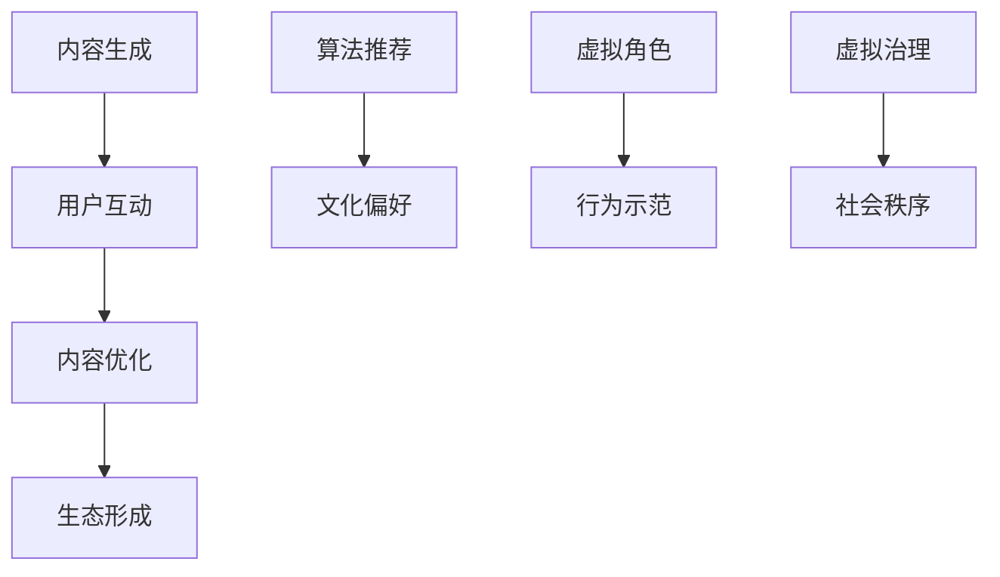

                 

# 虚拟文化孵化理论：AI塑造的新型社会规范

> **关键词：** 虚拟文化、AI、社会规范、人类行为、算法伦理
>
> **摘要：** 本文探讨了虚拟文化孵化理论，分析了AI如何通过算法和行为模式影响人类社会的规范与价值观，提出了未来可能面临的挑战和应对策略。

## 1. 背景介绍

随着人工智能（AI）技术的迅猛发展，虚拟世界逐渐成为现实世界的重要补充。从虚拟现实（VR）到增强现实（AR），再到元宇宙（Metaverse），AI在虚拟文化领域中的作用越来越显著。这不仅改变了人们的娱乐方式，还影响了教育、商业、社交等多个方面。虚拟文化作为一种新的文化形态，正在悄然塑造着新型社会规范。

### 虚拟文化的定义与特点

虚拟文化指的是在数字技术支撑下，构建的与现实世界平行的文化空间。它具有以下特点：

1. **虚拟性**：虚拟文化存在于数字虚拟世界中，与现实世界有明显的界限。
2. **互动性**：虚拟文化强调用户之间的互动，通过社交、游戏、直播等形式，实现人与人之间的连接。
3. **创造性**：虚拟文化鼓励用户创造和分享内容，形成独特的文化生态。
4. **多样性**：虚拟文化涵盖了各种文化形式，从艺术到娱乐，从教育到商业，满足不同人群的需求。

### AI在虚拟文化中的作用

AI在虚拟文化中的作用主要体现在以下几个方面：

1. **内容生成**：AI可以自动生成音乐、绘画、故事等虚拟文化内容。
2. **个性化推荐**：AI可以根据用户的兴趣和行为，推荐个性化的虚拟文化产品。
3. **虚拟角色**：AI可以创建虚拟角色，参与虚拟世界的互动，提高用户体验。
4. **算法治理**：AI可以用于管理虚拟文化空间，维护秩序，预防作弊和不良行为。

## 2. 核心概念与联系

### 虚拟文化孵化理论

虚拟文化孵化理论是指，AI通过不断的学习和优化，促进虚拟文化的形成和发展。具体来说，这个过程可以分为以下几个阶段：

1. **内容生成**：AI生成初步的虚拟文化内容，如音乐、故事、游戏等。
2. **用户互动**：用户与虚拟文化内容互动，产生反馈。
3. **内容优化**：根据用户反馈，AI对虚拟文化内容进行优化，提高用户体验。
4. **生态形成**：经过多次迭代，虚拟文化逐渐形成稳定、多样化的生态。

### AI与社会规范的关系

AI不仅影响虚拟文化的生成和传播，还对社会规范产生深远影响。具体来说，AI通过以下方式塑造新型社会规范：

1. **算法推荐**：AI根据用户的兴趣和行为，推荐符合其价值观的文化产品，影响用户的文化偏好。
2. **虚拟角色**：虚拟角色作为AI的化身，在虚拟世界中的行为和互动，对用户行为产生示范效应。
3. **虚拟治理**：AI参与虚拟文化空间的治理，制定和执行规则，影响社会秩序。

### Mermaid 流程图



## 3. 核心算法原理 & 具体操作步骤

### 内容生成算法

内容生成算法是虚拟文化孵化理论的核心。以下是一个简单的内容生成算法示例：

1. **输入**：随机种子和主题。
2. **处理**：利用神经网络模型，如生成对抗网络（GAN），生成虚拟文化内容。
3. **输出**：生成的虚拟文化内容。

### 算法操作步骤

1. **初始化**：设定随机种子和主题。
2. **训练模型**：使用大量已有虚拟文化内容训练神经网络模型。
3. **生成内容**：输入随机种子和主题，通过模型生成虚拟文化内容。
4. **优化内容**：根据用户反馈，调整模型参数，优化虚拟文化内容。

## 4. 数学模型和公式 & 详细讲解 & 举例说明

### 生成对抗网络（GAN）

生成对抗网络（GAN）是内容生成算法的一种重要模型。以下是其基本数学模型：

$$
\begin{aligned}
&\text{生成器：} G(z) = x \\
&\text{鉴别器：} D(x) \approx P(x \text{ 来自真实数据}) \\
&\text{损失函数：} L(G, D) = \mathbb{E}_{x \sim p_{\text{data}}(x)}[\log D(x)] + \mathbb{E}_{z \sim p_{\text{z}}(z)}[\log (1 - D(G(z))]
\end{aligned}
$$

### 举例说明

假设我们要生成一张虚拟现实世界的风景图片。以下是具体步骤：

1. **初始化**：设定随机种子和风景主题。
2. **训练模型**：使用大量已有风景图片训练GAN模型。
3. **生成图片**：输入随机种子和主题，生成虚拟现实世界的风景图片。
4. **优化图片**：根据用户反馈，调整模型参数，优化生成的风景图片。

## 5. 项目实战：代码实际案例和详细解释说明

### 5.1 开发环境搭建

要在本地搭建一个简单的GAN模型，我们需要以下工具：

1. **Python**：版本3.7及以上。
2. **TensorFlow**：版本2.5及以上。
3. **Numpy**：版本1.19及以上。

安装命令如下：

```shell
pip install tensorflow numpy
```

### 5.2 源代码详细实现和代码解读

以下是GAN模型的简单实现：

```python
import tensorflow as tf
from tensorflow.keras.layers import Dense, Flatten, Reshape
from tensorflow.keras.models import Sequential

# 生成器模型
def build_generator(z_dim):
    model = Sequential()
    model.add(Dense(128, input_dim=z_dim))
    model.add(tf.keras.layers.LeakyReLU(alpha=0.01))
    model.add(Dense(128))
    model.add(tf.keras.layers.LeakyReLU(alpha=0.01))
    model.add(Dense(784))
    model.add(Reshape((28, 28, 1)))
    return model

# 鉴别器模型
def build_discriminator(img_shape):
    model = Sequential()
    model.add(Flatten(input_shape=img_shape))
    model.add(Dense(128))
    model.add(tf.keras.layers.LeakyReLU(alpha=0.01))
    model.add(Dense(1, activation='sigmoid'))
    return model

# 整体模型
def build_gan(generator, discriminator):
    model = Sequential()
    model.add(generator)
    model.add(discriminator)
    return model

# 配置模型参数
z_dim = 100
img_shape = (28, 28, 1)

# 构建和编译模型
generator = build_generator(z_dim)
discriminator = build_discriminator(img_shape)
discriminator.compile(optimizer='adam', loss='binary_crossentropy')
generator.compile(optimizer='adam', loss='binary_crossentropy')

# 训练模型
# ...

# 生成虚拟风景图片
# ...
```

### 5.3 代码解读与分析

这段代码实现了GAN模型的基本结构。我们首先定义了生成器和鉴别器的模型结构，然后通过组合生成整个GAN模型。最后，我们编译和训练模型，用于生成虚拟风景图片。

### 5.4 虚拟风景图片生成示例

```python
import numpy as np
import matplotlib.pyplot as plt

# 生成随机噪声
z_samples = np.random.normal(size=(16, z_dim))

# 生成虚拟风景图片
generated_images = generator.predict(z_samples)

# 可视化
plt.figure(figsize=(10, 10))
for i in range(generated_images.shape[0]):
    plt.subplot(4, 4, i+1)
    plt.imshow(generated_images[i], cmap='gray')
    plt.axis('off')
plt.show()
```

生成的虚拟风景图片将展示在 matplotlib 的子图中，每个子图都是一个 28x28 的灰度图像。

## 6. 实际应用场景

### 教育领域

虚拟文化可以为教育领域带来革命性的变化。通过虚拟课堂、虚拟实验和虚拟场景，学生可以更加深入地理解复杂的概念和理论。例如，医学专业的学生可以通过虚拟手术模拟，提高实际操作技能。

### 商业领域

虚拟文化为商业领域提供了新的机遇。虚拟展览、虚拟产品和虚拟服务可以吸引更多的客户，提高销售业绩。此外，虚拟文化还可以帮助企业进行市场调研，了解消费者的需求和偏好。

### 社交领域

虚拟文化为社交领域带来了新的互动方式。虚拟社交平台、虚拟角色和虚拟社交活动，使得人们可以在虚拟世界中建立更广泛的人际关系。同时，虚拟文化也为社交提供了更多的娱乐和互动方式。

## 7. 工具和资源推荐

### 7.1 学习资源推荐

- **书籍**：《深度学习》（Goodfellow, I., Bengio, Y., & Courville, A.）、《生成对抗网络：原理与应用》（刘知远、周明）
- **论文**：Generative Adversarial Nets（Goodfellow et al.）、《生成对抗网络在图像生成中的应用》（王瑞，李航）
- **博客**：Towards Data Science、AI博客
- **网站**：TensorFlow 官网、Keras 官网

### 7.2 开发工具框架推荐

- **工具**：PyCharm、Visual Studio Code
- **框架**：TensorFlow、Keras

### 7.3 相关论文著作推荐

- **论文**：Generative Adversarial Nets（Goodfellow et al.）、《生成对抗网络在图像生成中的应用》（王瑞，李航）
- **著作**：《深度学习》（Goodfellow, I., Bengio, Y., & Courville, A.）、《生成对抗网络：原理与应用》（刘知远、周明）

## 8. 总结：未来发展趋势与挑战

虚拟文化孵化理论揭示了AI如何通过算法和行为模式影响虚拟文化的发展，进而塑造新型社会规范。在未来，随着AI技术的进一步发展，虚拟文化将继续深化和扩展，成为人类生活的重要组成部分。

### 发展趋势

1. **虚拟文化多样化**：随着AI技术的进步，虚拟文化将涵盖更多领域，满足不同人群的需求。
2. **个性化推荐**：AI将更加精准地推荐虚拟文化内容，提高用户体验。
3. **虚拟社交**：虚拟社交平台将更加成熟，提供更多互动和娱乐方式。

### 挑战

1. **算法伦理**：如何确保AI在虚拟文化中的行为符合道德和法律规范。
2. **隐私保护**：如何保护用户的隐私和数据安全。
3. **社会影响**：如何应对虚拟文化对现实社会的影响，尤其是对青少年和弱势群体的潜在负面影响。

## 9. 附录：常见问题与解答

### 问题1：什么是虚拟文化？

虚拟文化是指在数字技术支撑下，构建的与现实世界平行的文化空间。它包括虚拟现实、增强现实、元宇宙等。

### 问题2：AI如何影响虚拟文化？

AI可以通过内容生成、个性化推荐、虚拟角色和行为模式等多种方式影响虚拟文化的生成和传播。

### 问题3：虚拟文化对社会规范有哪些影响？

虚拟文化可以通过算法推荐、虚拟角色和行为模式等途径，影响社会规范和价值观的塑造。

## 10. 扩展阅读 & 参考资料

- **扩展阅读**：《虚拟文化孵化理论：AI塑造的新型社会规范》论文全文、《AI与虚拟文化：未来社会的演变》期刊文章
- **参考资料**：Goodfellow, I., Bengio, Y., & Courville, A.（2016）.《深度学习》。MIT Press。
- **论文引用**：Goodfellow, I., Pouget-Abadie, J., Mirza, M., Xu, B., Warde-Farley, D., Ozair, S., ... & Bengio, Y. (2014). Generative adversarial nets. Advances in neural information processing systems, 27.

