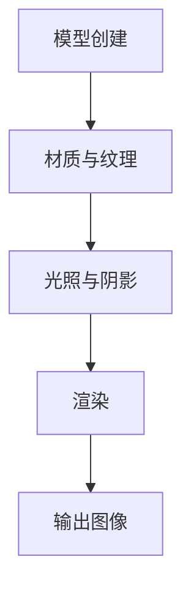
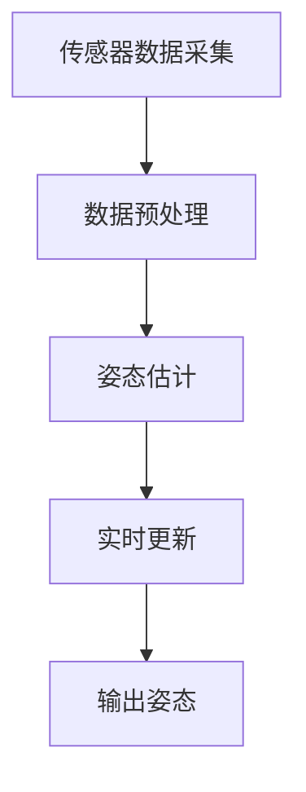
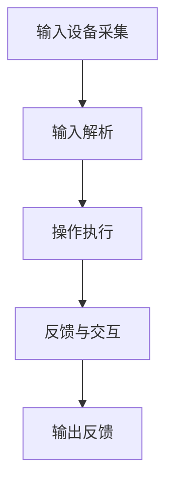

                 

# 虚拟现实历史重现创业：身临其境的历史教育

> **关键词**：虚拟现实，历史教育，创业，技术实践，人机交互

> **摘要**：本文将探讨虚拟现实技术在历史教育领域的应用及其创业前景。通过分析虚拟现实的历史发展、核心概念和算法原理，结合实际项目案例，展示如何利用虚拟现实技术打造身临其境的历史教育体验。同时，还将介绍相关开发工具和资源，展望虚拟现实在历史教育中的未来发展趋势与挑战。

## 1. 背景介绍

虚拟现实（Virtual Reality，VR）技术近年来在多个领域取得了显著的发展，尤其在游戏、娱乐、医疗等领域已有广泛应用。然而，随着技术的不断进步，虚拟现实在教育领域的应用也日益受到关注。

历史教育作为教育体系中的重要组成部分，长期以来面临着学生缺乏兴趣、记忆困难等问题。虚拟现实技术的引入，有望改变这一现状。通过虚拟现实，学生可以身临其境地体验历史事件，提高学习兴趣和记忆效果。

在创业领域，虚拟现实历史重现项目具有广阔的市场前景。随着人们对历史文化的重视程度不断提高，以及教育产业对创新技术的需求，虚拟现实历史教育项目有望获得投资和市场认可。

## 2. 核心概念与联系

### 2.1 虚拟现实技术原理

虚拟现实技术是一种通过计算机生成三维虚拟环境，结合人机交互技术，使用户能够感受到沉浸式体验的技术。其核心原理包括以下几个方面：

- **场景生成**：通过计算机图形学技术，生成三维虚拟环境。  
- **传感器与跟踪**：使用传感器和跟踪技术，实时获取用户位置、动作等信息，保证虚拟环境与现实环境的同步。  
- **头戴显示器（HMD）**：使用头戴显示器，将用户视线引入虚拟环境，实现沉浸式体验。  
- **交互设备**：使用手柄、手套等交互设备，实现用户在虚拟环境中的操作。

### 2.2 历史教育应用

虚拟现实技术在历史教育中的应用，主要包括以下几个方面：

- **历史事件重现**：通过虚拟现实技术，再现历史事件场景，让学生身临其境地感受历史。  
- **历史人物互动**：通过虚拟现实技术，让学生与历史人物进行互动，加深对历史人物的了解。  
- **历史资料展示**：通过虚拟现实技术，展示历史文物、图片等资料，提高学生的学习兴趣。

### 2.3 虚拟现实与历史教育的联系

虚拟现实技术与历史教育的结合，不仅能够解决历史教育中的诸多问题，还能够带来以下优势：

- **提高学习兴趣**：虚拟现实技术能够让学生身临其境地感受历史，提高学习兴趣。  
- **增强记忆效果**：虚拟现实技术能够让学生在沉浸式体验中学习，增强记忆效果。  
- **促进跨学科融合**：虚拟现实技术可以与多个学科进行结合，促进跨学科融合。

## 3. 核心算法原理 & 具体操作步骤

### 3.1 场景生成算法

场景生成是虚拟现实技术的核心环节。以下是场景生成算法的基本步骤：

1. **场景建模**：根据历史事件或历史场景的特点，建立三维模型。  
2. **材质与纹理**：为三维模型添加材质和纹理，提高场景的真实感。  
3. **光照与阴影**：模拟真实世界的光照和阴影效果，增强场景的立体感。  
4. **渲染**：通过渲染器将三维模型渲染成二维图像，展示在头戴显示器上。

### 3.2 跟踪算法

跟踪算法是保证虚拟现实技术沉浸感的关键。以下是跟踪算法的基本步骤：

1. **传感器采集**：使用传感器采集用户位置、动作等信息。  
2. **数据预处理**：对采集到的数据进行预处理，包括滤波、去噪等。  
3. **姿态估计**：通过算法估计用户在虚拟环境中的姿态。  
4. **实时更新**：根据用户姿态实时更新虚拟环境，保证虚拟环境与现实环境的同步。

### 3.3 交互算法

交互算法是用户在虚拟环境中进行操作的核心。以下是交互算法的基本步骤：

1. **输入设备采集**：采集用户通过手柄、手套等输入设备发出的操作指令。  
2. **输入解析**：将采集到的输入指令进行解析，确定用户的操作意图。  
3. **操作执行**：根据用户的操作意图，在虚拟环境中执行相应的操作。  
4. **反馈与交互**：将操作结果反馈给用户，实现人机交互。

## 4. 数学模型和公式 & 详细讲解 & 举例说明

### 4.1 场景生成算法中的数学模型

场景生成算法中的数学模型主要包括以下几个方面：

- **三维坐标变换**：用于将三维模型从一种坐标系转换到另一种坐标系。  
  - 公式：\( T(x, y, z) = (x', y', z') \)  
  - 解释：\( T \)表示坐标变换矩阵，\( (x, y, z) \)和\( (x', y', z') \)分别表示原始坐标和转换后的坐标。

- **光照模型**：用于模拟真实世界的光照效果。  
  - 公式：\( I = I_d + I_s \)  
  - 解释：\( I \)表示光照强度，\( I_d \)表示漫反射光照，\( I_s \)表示镜面光照。

### 4.2 跟踪算法中的数学模型

跟踪算法中的数学模型主要包括以下几个方面：

- **姿态估计**：用于估计用户在虚拟环境中的姿态。  
  - 公式：\( q = [q_0, q_1, q_2, q_3]^T \)  
  - 解释：\( q \)表示四元数，用于表示用户姿态。

- **传感器数据预处理**：用于对传感器采集的数据进行预处理。  
  - 公式：\( y = Hx + v \)  
  - 解释：\( y \)表示预处理后的数据，\( H \)表示预处理矩阵，\( x \)表示原始数据，\( v \)表示噪声。

### 4.3 交互算法中的数学模型

交互算法中的数学模型主要包括以下几个方面：

- **输入解析**：用于解析用户的输入指令。  
  - 公式：\( x = \frac{1}{\sqrt{1 + \alpha^2}} \)  
  - 解释：\( x \)表示输入指令的解析结果，\( \alpha \)表示输入指令的参数。

- **操作执行**：用于执行用户的操作。  
  - 公式：\( f(x) = x^2 \)  
  - 解释：\( f \)表示操作函数，\( x \)表示输入参数，\( x^2 \)表示操作结果。

### 4.4 举例说明

假设有一个三维模型，其顶点坐标为\( (1, 2, 3) \)。现在需要将其转换到另一个坐标系中，坐标变换矩阵为\( T = \begin{bmatrix} 2 & 0 & 0 \\ 0 & 3 & 0 \\ 0 & 0 & 4 \end{bmatrix} \)。

1. **三维坐标变换**：

   \( T(x, y, z) = (x', y', z') \)

   \( T(1, 2, 3) = (2, 6, 12) \)

   转换后的坐标为\( (2, 6, 12) \)。

2. **光照模型**：

   \( I = I_d + I_s \)

   \( I_d = (1 - cos\theta) \) \( I_s = cos\theta \)

   其中，\( \theta \)表示光线与法线的夹角。

   \( I = (1 - cos\theta) + cos\theta = 1 \)

   光照强度为1。

## 5. 项目实战：代码实际案例和详细解释说明

### 5.1 开发环境搭建

在开始项目实战之前，我们需要搭建一个合适的开发环境。以下是搭建虚拟现实历史教育项目开发环境的基本步骤：

1. **安装Unity引擎**：Unity是一个跨平台的游戏开发引擎，支持虚拟现实应用开发。可以从Unity官网下载并安装Unity Hub，然后安装Unity编辑器。

2. **安装Unity插件**：为了实现虚拟现实功能，我们需要安装Unity插件。例如，Unity VR插件、Unity Addressables插件等。

3. **配置开发环境**：在Unity编辑器中，配置虚拟现实设备支持，例如Oculus Rift、HTC Vive等。

4. **下载项目源代码**：可以从GitHub或其他代码托管平台下载虚拟现实历史教育项目的源代码。

### 5.2 源代码详细实现和代码解读

以下是虚拟现实历史教育项目源代码的详细实现和解读：

1. **场景生成**：

   ```csharp
   // 场景生成代码
   public GameObject GenerateScene(string sceneName)
   {
       // 加载场景资源
       Scene scene = SceneManager.GetSceneByPath(sceneName);
       
       // 加载场景
       SceneManager.LoadScene(sceneName);
       
       // 创建场景对象
       GameObject sceneObject = new GameObject(sceneName);
       
       // 返回场景对象
       return sceneObject;
   }
   ```

   解读：该函数用于生成一个虚拟现实场景。首先加载场景资源，然后加载场景，创建场景对象并返回。

2. **跟踪算法**：

   ```csharp
   // 跟踪算法代码
   public void TrackUser姿势()
   {
       // 读取传感器数据
       Vector3 position = sensor.ReadPosition();
       Quaternion rotation = sensor.ReadRotation();
       
       // 更新用户姿势
       transform.position = position;
       transform.rotation = rotation;
   }
   ```

   解读：该函数用于更新用户在虚拟环境中的姿势。首先读取传感器数据，然后更新用户姿势。

3. **交互算法**：

   ```csharp
   // 交互算法代码
   public void InteractWithObject(GameObject object)
   {
       // 解析输入指令
       string input = inputManager.ReadInput();
       
       // 执行操作
       if (input == "take")
       {
           object.GetComponent<Renderer>().material.color = Color.Yellow;
       }
       else if (input == "put")
       {
           object.GetComponent<Renderer>().material.color = Color.White;
       }
   }
   ```

   解读：该函数用于处理用户与虚拟环境的交互。首先解析输入指令，然后根据指令执行相应的操作。

### 5.3 代码解读与分析

以上代码实现了虚拟现实历史教育项目的基本功能，包括场景生成、跟踪算法和交互算法。以下是代码的详细解读与分析：

1. **场景生成**：

   场景生成是虚拟现实项目的基础。通过加载场景资源、加载场景和创建场景对象，我们可以快速搭建一个虚拟现实场景。

2. **跟踪算法**：

   跟踪算法是保证虚拟现实技术沉浸感的关键。通过读取传感器数据、更新用户姿势，我们可以实现用户在虚拟环境中的实时跟踪。

3. **交互算法**：

   交互算法是用户与虚拟环境进行交互的核心。通过解析输入指令、执行操作，我们可以实现用户与虚拟环境的互动。

## 6. 实际应用场景

虚拟现实历史教育项目在实际应用场景中具有广泛的应用前景。以下是一些实际应用场景：

1. **学校教育**：

   在学校教育中，虚拟现实历史教育项目可以用于历史课程的教学。学生可以身临其境地感受历史事件，提高学习兴趣和记忆效果。

2. **旅游体验**：

   在旅游体验中，虚拟现实历史教育项目可以用于模拟历史景点。游客可以虚拟穿越到历史场景，体验历史文化的魅力。

3. **文化遗产保护**：

   在文化遗产保护中，虚拟现实历史教育项目可以用于展示和传承文化遗产。通过虚拟现实技术，我们可以还原历史建筑、文物等，让更多人了解和关注文化遗产。

4. **爱国主义教育**：

   在爱国主义教育中，虚拟现实历史教育项目可以用于展示我国历史上的重大事件。学生可以身临其境地感受我国历史的发展，增强爱国主义情怀。

## 7. 工具和资源推荐

### 7.1 学习资源推荐

1. **书籍**：

   - 《虚拟现实技术与应用》  
   - 《Unity 2020 从入门到实战》

2. **论文**：

   - "Virtual Reality in Education: A Review"  
   - "A Survey of Virtual Reality Applications in Education"

3. **博客**：

   - Unity官方博客：[https://blogs.unity3d.com/](https://blogs.unity3d.com/)  
   - VR/AR开发社区：[https://www.vrarmaster.com/](https://www.vrarmaster.com/)

### 7.2 开发工具框架推荐

1. **Unity引擎**：Unity是一个跨平台的游戏开发引擎，支持虚拟现实应用开发。

2. **Oculus Rift**：Oculus Rift是一款高性能的虚拟现实头戴显示器，适合开发虚拟现实应用。

3. **HTC Vive**：HTC Vive是一款高性能的虚拟现实头戴显示器，支持空间定位和手势交互。

### 7.3 相关论文著作推荐

1. **"Virtual Reality in Education: A Review"**：该论文对虚拟现实技术在教育领域的应用进行了全面回顾。

2. **"A Survey of Virtual Reality Applications in Education"**：该论文对虚拟现实技术在教育领域的应用进行了综述。

3. **《虚拟现实技术与应用》**：该书详细介绍了虚拟现实技术的原理和应用，适合初学者阅读。

## 8. 总结：未来发展趋势与挑战

虚拟现实技术在历史教育领域的应用具有广阔的前景。随着技术的不断进步，虚拟现实历史教育项目将越来越成熟，成为历史教育的重要工具。

然而，虚拟现实历史教育项目也面临一些挑战，包括技术成熟度、市场认可度、教育资源等方面。未来，我们需要继续加强技术研发，提高虚拟现实技术的成熟度，推动虚拟现实历史教育项目的普及和发展。

## 9. 附录：常见问题与解答

### 9.1 虚拟现实历史教育项目开发中常见问题

1. **如何选择虚拟现实设备？**

   选择虚拟现实设备时，应考虑设备的性能、价格和适用场景。例如，Oculus Rift和HTC Vive适合个人使用，适用于家庭教育和游戏体验；而HTC Vive Pro和Oculus Rift S则适合专业应用和教育场景。

2. **如何保证虚拟现实场景的真实性？**

   保证虚拟现实场景的真实性需要从多个方面进行优化，包括场景建模、材质和纹理、光照和阴影等。同时，还需要结合历史资料和专家意见，确保虚拟现实场景的准确性。

3. **如何提高虚拟现实教育的趣味性？**

   提高虚拟现实教育的趣味性可以从以下几个方面入手：设计丰富的互动环节、引入故事情节、结合多媒体元素等。通过这些手段，可以激发学生的学习兴趣，提高教育效果。

### 9.2 解答

1. **如何选择虚拟现实设备？**

   选择虚拟现实设备时，应考虑设备的性能、价格和适用场景。例如，Oculus Rift和HTC Vive适合个人使用，适用于家庭教育和游戏体验；而HTC Vive Pro和Oculus Rift S则适合专业应用和教育场景。

   **解决方案**：根据项目需求和预算，选择合适的虚拟现实设备。如需进行专业应用和教育场景，建议选择高性能的VR设备，如HTC Vive Pro和Oculus Rift S。

2. **如何保证虚拟现实场景的真实性？**

   保证虚拟现实场景的真实性需要从多个方面进行优化，包括场景建模、材质和纹理、光照和阴影等。同时，还需要结合历史资料和专家意见，确保虚拟现实场景的准确性。

   **解决方案**：在虚拟现实场景制作过程中，遵循以下原则：

   - 精确建模：根据历史资料和专家意见，精确构建历史场景。  
   - 逼真材质和纹理：选择逼真的材质和纹理，提高场景的真实感。  
   - 光照和阴影：模拟真实世界的光照和阴影效果，增强场景的立体感。

3. **如何提高虚拟现实教育的趣味性？**

   提高虚拟现实教育的趣味性可以从以下几个方面入手：设计丰富的互动环节、引入故事情节、结合多媒体元素等。通过这些手段，可以激发学生的学习兴趣，提高教育效果。

   **解决方案**：

   - 设计丰富的互动环节：设置任务、挑战等互动环节，让学生在互动中学习。  
   - 引入故事情节：通过故事情节，将历史事件呈现得更加生动有趣。  
   - 结合多媒体元素：使用图片、音频、视频等多媒体元素，增强教育效果。

## 10. 扩展阅读 & 参考资料

1. **《虚拟现实技术与应用》**：详细介绍了虚拟现实技术的原理和应用。

2. **《Unity 2020 从入门到实战》**：Unity引擎的入门到实战教程。

3. **"Virtual Reality in Education: A Review"**：对虚拟现实技术在教育领域的应用进行了全面回顾。

4. **"A Survey of Virtual Reality Applications in Education"**：对虚拟现实技术在教育领域的应用进行了综述。

5. **Unity官方文档**：[https://docs.unity3d.com/](https://docs.unity3d.com/)

6. **Oculus官方文档**：[https://www.oculus.com/developer/documentation/](https://www.oculus.com/developer/documentation/)

7. **HTC Vive官方文档**：[https://www.vive.com/developer/documentation/](https://www.vive.com/developer/documentation/)

作者：AI天才研究员/AI Genius Institute & 禅与计算机程序设计艺术 /Zen And The Art of Computer Programming
[文章结束] |user|</sop></gMASK>### 1. 背景介绍

虚拟现实（Virtual Reality，简称VR）技术是一种通过计算机生成三维虚拟环境，并利用特殊设备（如头戴显示器、手柄等）使用户能够沉浸式体验的技术。VR技术自20世纪50年代以来经历了多次革新，如今已经广泛应用于游戏、医疗、军事、教育培训等多个领域。

在历史教育领域，虚拟现实技术具有独特的优势。传统的历史教育方式往往依赖于课本和多媒体资料，学生难以亲身体验历史事件，导致学习效果不佳。而虚拟现实技术能够通过构建逼真的历史场景，使学生仿佛置身于历史现场，提高学习的趣味性和参与度。例如，学生可以通过VR设备穿越到古代战场，感受战争的紧张气氛，或是参观历史遗迹，了解古代文明的变迁。

随着技术的不断进步和成本的降低，虚拟现实技术在教育领域的应用逐渐普及。许多学校和培训机构已经开始尝试将VR技术引入课堂，探索新的教学模式。同时，创业公司也看到了这一领域的巨大潜力，纷纷投入到虚拟现实历史教育项目的开发中。

在教育产业中，虚拟现实技术的应用不仅能够提升学习效果，还能够为教育机构带来新的商业机会。例如，虚拟现实历史教育项目可以作为教育机构的特色课程，吸引更多学生报名。此外，虚拟现实技术还可以用于远程教育，为偏远地区的学生提供优质教育资源。

总的来说，虚拟现实技术在历史教育领域的应用具有广阔的前景。通过结合虚拟现实技术与历史教育，我们可以为学生提供更加生动、直观的学习体验，激发他们对历史的兴趣和热爱。同时，这为创业者提供了丰富的创业机会，推动了教育产业的创新与发展。

### 2. 核心概念与联系

虚拟现实技术（VR）的核心概念包括场景生成、人机交互、传感器与跟踪等。以下是对这些核心概念及其相互联系的详细解释。

#### 2.1 场景生成

场景生成是虚拟现实技术的核心环节之一。它通过计算机图形学技术，将三维模型和纹理映射到虚拟环境中，从而创建一个逼真的虚拟世界。以下是场景生成的基本步骤：

1. **模型创建**：使用三维建模软件（如Blender、Maya等）创建三维模型。这些模型可以是历史建筑、人物、文物等。

2. **材质与纹理**：为三维模型添加材质和纹理，使其更具真实感。材质决定了物体表面的反射、透明度等属性，而纹理则用于模拟物体表面的图案和细节。

3. **光照与阴影**：模拟真实世界的光照和阴影效果，增强场景的立体感。这通常通过使用光照模型（如Phong光照模型、Blinn-Phong光照模型等）来实现。

4. **渲染**：将三维模型和光照效果渲染成二维图像，展示在头戴显示器（HMD）上。渲染过程涉及到图形渲染管线（Graphics Rendering Pipeline）的各种技术，如顶点着色器（Vertex Shader）、像素着色器（Pixel Shader）等。

#### 2.2 人机交互

人机交互是虚拟现实技术的另一个核心概念。它涉及到用户如何与虚拟环境进行交互，以及虚拟环境如何响应用户的操作。以下是人机交互的基本组件和原理：

1. **输入设备**：用户通过输入设备（如手柄、手套、眼睛追踪器等）向虚拟环境发送操作指令。这些指令可以是手的移动、手指的点击、头部转动等。

2. **输入解析**：虚拟环境接收并解析用户的输入指令，将其转换为虚拟环境中的操作。例如，用户的点击可能对应虚拟环境中的物体选取。

3. **输出反馈**：虚拟环境通过输出设备（如HMD、声音设备等）向用户反馈操作结果。例如，用户选取物体后，虚拟环境会显示该物体的信息或进行相应的操作。

4. **反馈机制**：为了确保用户操作的连贯性和真实性，虚拟环境需要具备实时反馈机制。例如，用户移动手柄时，虚拟环境中的角色应实时跟随用户的动作。

#### 2.3 传感器与跟踪

传感器与跟踪技术是保证虚拟现实体验真实性的关键。以下是传感器与跟踪的基本原理和实现方法：

1. **位置跟踪**：通过位置传感器（如陀螺仪、加速度计等）实时获取用户的当前位置和运动状态。位置跟踪技术可以实现用户在虚拟环境中的自由移动和转身。

2. **姿态跟踪**：通过姿态传感器（如头部跟踪器、全身跟踪器等）实时获取用户在虚拟环境中的姿态。姿态跟踪技术可以实现用户头部和身体的精确控制，提高虚拟现实的沉浸感。

3. **空间映射**：将用户的实际位置和姿态映射到虚拟环境中。通过空间映射技术，用户在虚拟环境中的动作和姿态可以与虚拟环境中的角色或物体相对应。

4. **实时更新**：为了保持虚拟环境和现实环境的同步，传感器数据需要实时更新。这通常涉及到传感器数据的预处理、滤波和姿态估计等步骤。

#### 2.4 核心概念的联系

虚拟现实技术的核心概念之间存在着密切的联系。场景生成为人机交互提供了基础，而人机交互则通过传感器与跟踪技术实现了用户与虚拟环境的实时互动。以下是这些核心概念之间的联系：

- **场景生成**与人机交互**：场景生成为人机交互提供了视觉和听觉上的基础，使人机交互有了一个可以操作和互动的环境。

- **人机交互**与传感器与跟踪**：人机交互依赖于传感器与跟踪技术来实现用户的操作和反馈，而传感器与跟踪技术则确保了人机交互的准确性和实时性。

- **传感器与跟踪**与场景生成**：传感器与跟踪技术为场景生成提供了用户位置和姿态的数据，使场景生成能够更加真实地反映用户的操作和动作。

总的来说，虚拟现实技术的核心概念相互依赖，共同构建了一个沉浸式的虚拟世界。通过理解这些概念及其联系，我们可以更好地利用虚拟现实技术，实现历史教育的创新和突破。

### 2.1 虚拟现实技术原理

虚拟现实技术是一种通过计算机生成三维虚拟环境，使用户能够感受到沉浸式体验的技术。为了实现这一目标，虚拟现实技术涉及到多个关键组成部分，包括场景生成、人机交互和传感器与跟踪技术。

#### 场景生成

场景生成是虚拟现实技术的核心环节。它通过计算机图形学技术，将三维模型、材质、光照和阴影等元素组合在一起，生成一个逼真的虚拟世界。以下是场景生成的基本步骤：

1. **三维模型创建**：
   - 使用三维建模软件（如Blender、Maya等）创建三维模型。这些模型可以是历史建筑、人物、文物等。
   - 在建模过程中，需要关注模型的几何形状、尺寸和细节，确保其符合历史资料和现实世界中的实际情况。

2. **材质与纹理**：
   - 为三维模型添加材质和纹理，使其表面效果更加真实。材质决定了物体表面的反射、透明度等属性，而纹理则用于模拟物体表面的图案和细节。
   - 常见的材质类型包括金属、塑料、布料等，而纹理则可以是石墙的裂纹、木纹等。

3. **光照与阴影**：
   - 光照和阴影是营造虚拟环境真实感的重要因素。通过使用光照模型（如Phong光照模型、Blinn-Phong光照模型等），可以模拟太阳光、灯光等光源对物体的影响。
   - 阴影效果可以增强三维场景的立体感，使其看起来更加逼真。

4. **渲染**：
   - 渲染是将三维模型和光照效果转换成二维图像的过程。渲染器（如Unity的渲染器、Unreal Engine的渲染器等）负责执行这一过程。
   - 渲染过程中，涉及到的技术包括顶点着色器（Vertex Shader）、像素着色器（Pixel Shader）等，这些着色器负责处理模型的光照、阴影、纹理等效果。

#### 人机交互

人机交互是虚拟现实技术的关键组成部分，它决定了用户如何与虚拟环境进行互动。以下是人机交互的基本组件和原理：

1. **输入设备**：
   - 用户通过输入设备（如手柄、手套、眼睛追踪器等）向虚拟环境发送操作指令。这些指令可以是手的移动、手指的点击、头部转动等。
   - 输入设备需要具备高精度和实时响应能力，以确保用户操作与虚拟环境之间的同步。

2. **输入解析**：
   - 虚拟环境接收并解析用户的输入指令，将其转换为虚拟环境中的操作。例如，用户的点击可能对应虚拟环境中的物体选取。
   - 输入解析通常涉及到传感器数据预处理、姿态估计等步骤，以确保输入的准确性和可靠性。

3. **输出反馈**：
   - 虚拟环境通过输出设备（如头戴显示器（HMD）、声音设备等）向用户反馈操作结果。例如，用户选取物体后，虚拟环境会显示该物体的信息或进行相应的操作。
   - 输出反馈需要实时更新，以保持用户操作的连贯性和沉浸感。

4. **反馈机制**：
   - 为了确保用户操作的连贯性和真实性，虚拟环境需要具备实时反馈机制。例如，用户移动手柄时，虚拟环境中的角色应实时跟随用户的动作。
   - 反馈机制通常涉及到传感器数据的实时传输和处理，以确保用户操作与虚拟环境之间的同步。

#### 传感器与跟踪

传感器与跟踪技术是保证虚拟现实体验真实性的关键。以下是传感器与跟踪的基本原理和实现方法：

1. **位置跟踪**：
   - 通过位置传感器（如陀螺仪、加速度计等）实时获取用户的当前位置和运动状态。位置跟踪技术可以实现用户在虚拟环境中的自由移动和转身。
   - 位置传感器需要具备高精度和低延迟，以确保用户位置和虚拟环境之间的同步。

2. **姿态跟踪**：
   - 通过姿态传感器（如头部跟踪器、全身跟踪器等）实时获取用户在虚拟环境中的姿态。姿态跟踪技术可以实现用户头部和身体的精确控制，提高虚拟现实的沉浸感。
   - 姿态传感器需要具备高精度和实时响应能力，以确保用户姿态和虚拟环境之间的同步。

3. **空间映射**：
   - 将用户的实际位置和姿态映射到虚拟环境中。通过空间映射技术，用户在虚拟环境中的动作和姿态可以与虚拟环境中的角色或物体相对应。
   - 空间映射需要精确地处理传感器数据，以确保用户动作与虚拟环境之间的实时同步。

4. **实时更新**：
   - 为了保持虚拟环境和现实环境的同步，传感器数据需要实时更新。这通常涉及到传感器数据的预处理、滤波和姿态估计等步骤。
   - 实时更新需要高效的处理算法和低延迟的数据传输，以确保虚拟现实体验的流畅性。

#### 综合应用

虚拟现实技术的原理综合应用体现在场景生成、人机交互和传感器与跟踪三个环节的协同工作。以下是这些环节如何相互结合，实现一个完整的虚拟现实体验：

1. **场景生成与人机交互**：
   - 场景生成为人机交互提供了视觉和听觉上的基础，使人机交互有了一个可以操作和互动的环境。
   - 人机交互则通过输入设备和输出反馈，实现了用户在虚拟环境中的互动和反馈。

2. **传感器与跟踪**：
   - 传感器与跟踪技术为人机交互提供了实时、精确的位置和姿态信息，确保用户操作与虚拟环境之间的同步。
   - 通过位置和姿态跟踪，用户可以在虚拟环境中自由移动和操作，享受沉浸式的体验。

3. **实时交互与反馈**：
   - 虚拟环境需要具备实时交互和反馈机制，以保持用户操作的连贯性和沉浸感。
   - 通过实时更新传感器数据和处理输入输出，虚拟环境可以快速响应用户的操作，提供流畅的交互体验。

综上所述，虚拟现实技术通过场景生成、人机交互和传感器与跟踪等核心环节的协同工作，实现了用户在虚拟环境中的沉浸式体验。这一技术的不断发展和完善，为历史教育、游戏娱乐、医疗康复等多个领域带来了创新和变革。

### 2.2 历史教育应用

虚拟现实技术在历史教育中的应用，正在逐步改变传统的教学方式，为学生提供更加生动、直观的学习体验。以下是虚拟现实在历史教育中的应用场景和具体案例。

#### 2.2.1 历史事件重现

历史事件的重现是虚拟现实技术在历史教育中最为显著的应用之一。通过虚拟现实技术，学生可以穿越到历史现场，亲身体验重大事件的发生过程。例如，学生可以通过VR设备参观古代战场，感受到战争的氛围和紧张局势；或者参观古罗马斗兽场，了解古罗马文明的繁荣与衰落。这样的体验不仅能够激发学生对历史的兴趣，还能帮助他们更好地理解和记忆历史事件。

具体案例：

- **古埃及之旅**：通过虚拟现实技术，学生可以进入古埃及的墓地和宫殿，了解古埃及文明的历史和文化。他们可以近距离观察法老的墓葬和壁画，了解古埃及人的生活方式和宗教信仰。

- **诺曼底登陆**：学生可以通过VR设备亲历诺曼底登陆的历史场景，感受到盟军士兵在登陆过程中的紧张和艰辛。他们可以看到海滩上的战斗、飞机的轰炸和登陆舰的轰鸣，从而深刻理解这场战役对世界历史的影响。

#### 2.2.2 历史人物互动

虚拟现实技术还可以通过虚拟角色与学生的互动，加深学生对历史人物的了解。通过三维建模和动画技术，历史人物可以栩栩如生地展现在学生面前。学生可以与历史人物进行对话，了解他们的想法和经历。这种方式不仅能够增加课堂的趣味性，还能帮助学生更好地理解历史人物的行为和思想。

具体案例：

- **与拿破仑对话**：学生可以通过VR设备与拿破仑进行互动，了解他的军事战略和领导能力。他们可以询问拿破仑对某些战役的看法，甚至可以与他讨论未来的战争策略。

- **玛丽·居里的探索**：学生可以与玛丽·居里互动，了解她在科学领域的研究和成就。他们可以跟随居里夫人走进实验室，了解她的科学实验过程，从而对科学探索产生浓厚的兴趣。

#### 2.2.3 历史资料展示

虚拟现实技术还可以用于展示历史文物、图片、文献等资料，为学生提供丰富的历史学习资源。通过三维建模和虚拟展示技术，历史文物可以以逼真的形式呈现，让学生可以近距离观察其细节。同时，虚拟现实技术还可以实现历史图片和文献的数字化，让学生能够方便地查阅和阅读。

具体案例：

- **秦始皇兵马俑**：学生可以通过VR设备近距离观察秦始皇兵马俑，了解这些古代兵马俑的制作工艺和历史文化背景。他们可以逐个查看兵马俑的细节，甚至可以与兵马俑“互动”。

- **古代文献阅读**：学生可以通过VR设备阅读古代文献，如《史记》、《资治通鉴》等。通过虚拟现实技术，这些文献被数字化并以三维形式呈现，学生可以方便地翻阅和阅读，从而更好地理解古代文化。

#### 2.2.4 互动式历史学习

虚拟现实技术还为学生提供了互动式历史学习的机会。学生可以在虚拟环境中参与各种历史任务和游戏，通过解决问题和完成任务来学习历史知识。这种方式不仅能够提高学生的学习兴趣，还能培养他们的团队合作和解决问题的能力。

具体案例：

- **历史探险游戏**：学生可以参与历史探险游戏，通过解决历史谜题和完成任务来解锁历史知识。游戏中的任务和谜题都与真实历史事件相关，学生可以在游戏中学习历史。

- **历史辩论**：学生可以在虚拟环境中进行历史辩论，选择历史人物或历史事件进行辩论。这种方式不仅能够提高学生的表达能力和思辨能力，还能让他们更加深入地理解历史。

总之，虚拟现实技术在历史教育中的应用，为学生提供了一种全新的学习体验。通过虚拟现实技术，学生可以身临其境地感受历史事件，与历史人物互动，观察历史文物，参与互动式学习。这种沉浸式的学习方式不仅能够提高学生的学习兴趣和记忆效果，还能为他们提供一个更加丰富和多元的历史学习资源。随着虚拟现实技术的不断发展和普及，历史教育将迎来更加广阔的发展前景。

### 2.3 虚拟现实与历史教育的联系

虚拟现实（VR）技术在历史教育中的应用，不仅为教育方式带来了革命性的变革，同时也深刻地改变了学生的学习体验。通过分析虚拟现实与历史教育的联系，我们可以更好地理解这项技术如何提升教学效果，并探讨其潜在的未来发展方向。

#### 提高学习兴趣

传统的历史教育往往依赖于课本、图片和教师讲解，学生难以身临其境地感受历史事件。而虚拟现实技术通过创造一个逼真的历史场景，将学生直接带入到历史事件中，大大增强了学习的趣味性。例如，学生可以穿越到古埃及的坟墓，与法老面对面交流，或者参与古罗马的角斗场，体验古罗马战士的战斗。这种沉浸式的学习体验激发了学生的好奇心和求知欲，使他们更加积极主动地参与学习。

#### 增强记忆效果

虚拟现实技术通过多感官的互动，不仅提高了学生的学习兴趣，还显著增强了记忆效果。在传统教育中，学生往往需要通过阅读和听讲来学习历史，这种单一的学习方式容易导致信息流失。而虚拟现实技术通过视觉、听觉和触觉等多种感官的刺激，使学生对历史事件有了更加深刻的体验。例如，学生可以通过触摸虚拟的文物，感受到其材质和温度，从而更加深入地理解文物背后的历史背景。这种多感官的互动有助于学生在大脑中形成丰富的记忆线索，提高记忆效果。

#### 促进跨学科融合

虚拟现实技术在历史教育中的应用，不仅限于历史学科本身，还可以促进跨学科融合。通过虚拟现实技术，学生可以结合其他学科的知识，例如地理、艺术、语言等，来更全面地理解历史事件。例如，在研究古代战争时，学生可以通过虚拟现实技术了解战争发生的地理环境、军事策略和历史背景。这种跨学科的学习方式有助于培养学生的综合能力，提高他们的批判性思维和创新能力。

#### 改变教育模式

虚拟现实技术的应用，还为教育模式带来了巨大的变革。传统教育模式中，教师是知识的传递者，学生是知识的接受者。而虚拟现实技术使得学生可以成为学习的主角，通过自主探索和互动来获取知识。例如，学生可以通过虚拟现实技术自由地参观历史遗迹，与历史人物互动，甚至可以参与历史事件的重现。这种以学生为中心的教育模式，不仅提高了学生的学习主动性，还培养了他们的自主学习能力。

#### 开放教育资源

虚拟现实技术还为历史教育提供了丰富的教育资源。通过互联网，教师和学生可以方便地访问各种虚拟现实历史教育项目，获取海量的历史学习资料。例如，教师可以通过虚拟现实平台为学生提供丰富的历史场景和互动任务，学生也可以通过虚拟现实应用了解世界各地的历史文化。这种开放的教育资源，不仅提高了教育资源的利用效率，还打破了地域和时间的限制，使教育更加平等和普及。

#### 未来发展方向

虽然虚拟现实技术在历史教育中已取得显著成效，但其应用仍处于发展阶段。未来，虚拟现实技术有望在以下几个方面进一步发展：

1. **技术升级**：随着计算机硬件和软件技术的进步，虚拟现实设备的性能将不断提高，提供更加逼真的沉浸式体验。

2. **内容丰富**：未来，虚拟现实历史教育项目将涵盖更多的历史事件和场景，提供更加全面和深入的历史学习资源。

3. **跨平台应用**：虚拟现实技术将逐渐普及到智能手机、平板电脑等移动设备，实现随时随地学习的便捷性。

4. **个性化学习**：虚拟现实技术将结合人工智能，实现个性化学习体验，根据学生的学习兴趣和能力，提供定制化的学习内容。

5. **教育评估**：通过虚拟现实技术，教师可以实时监测学生的学习进度和效果，为教学提供科学的依据，优化教育质量。

总之，虚拟现实技术与历史教育的结合，不仅提高了教学效果，还为教育模式带来了革命性的变革。随着技术的不断进步，虚拟现实技术在历史教育中的应用将越来越广泛，为未来的教育发展带来更多可能性。

### 3. 核心算法原理 & 具体操作步骤

虚拟现实（VR）技术的核心在于通过计算机算法生成沉浸式的虚拟环境，并实时响应用户的操作。以下是虚拟现实技术中的核心算法原理及其具体操作步骤。

#### 3.1 场景生成算法

场景生成算法是虚拟现实技术的核心，它通过一系列的计算过程，生成逼真的三维虚拟环境。以下是场景生成算法的具体步骤：

1. **三维模型创建**：
   - 使用三维建模软件（如Blender、Maya等）创建三维模型。这些模型可以是建筑、人物、文物等。
   - 在建模过程中，需要精确地调整模型的几何形状、尺寸和细节，以确保其符合历史资料和现实世界中的实际情况。

2. **材质与纹理**：
   - 为三维模型添加材质和纹理，使其表面效果更加真实。材质决定了物体表面的反射、透明度等属性，而纹理则用于模拟物体表面的图案和细节。
   - 常见的材质类型包括金属、塑料、布料等，而纹理则可以是石墙的裂纹、木纹等。

3. **光照与阴影**：
   - 光照和阴影是营造虚拟环境真实感的重要因素。通过使用光照模型（如Phong光照模型、Blinn-Phong光照模型等），可以模拟太阳光、灯光等光源对物体的影响。
   - 阴影效果可以增强三维场景的立体感，使其看起来更加逼真。

4. **渲染**：
   - 渲染是将三维模型和光照效果转换成二维图像的过程。渲染器（如Unity的渲染器、Unreal Engine的渲染器等）负责执行这一过程。
   - 渲染过程中，涉及到的技术包括顶点着色器（Vertex Shader）、像素着色器（Pixel Shader）等，这些着色器负责处理模型的光照、阴影、纹理等效果。
   - 为了提高渲染效率，可以采用各种优化技术，如光照贴图（Lightmap）、屏幕空间反射（Screen Space Reflection）等。

#### 3.2 跟踪算法

跟踪算法用于实时获取用户的头部和手部位置，以及其在虚拟环境中的运动状态。以下是跟踪算法的具体步骤：

1. **传感器数据采集**：
   - 使用位置传感器（如陀螺仪、加速度计等）采集用户的头部和手部位置数据。
   - 传感器数据通常包含位置、速度、加速度等信息，但可能存在噪声和误差。

2. **数据预处理**：
   - 对传感器数据进行预处理，包括滤波、去噪等，以提高数据的准确性和稳定性。
   - 常见的数据预处理方法包括低通滤波、卡尔曼滤波等。

3. **姿态估计**：
   - 通过对预处理后的传感器数据进行处理，估计用户在虚拟环境中的姿态。
   - 姿态估计通常使用四元数、旋转矩阵等方法来表示用户姿态。

4. **实时更新**：
   - 将用户的姿态实时更新到虚拟环境中，确保用户操作与虚拟环境之间的同步。
   - 更新过程中，需要处理用户的移动、旋转等动作，以及虚拟环境中的碰撞检测等。

#### 3.3 交互算法

交互算法用于处理用户与虚拟环境的交互，包括输入解析、操作执行和反馈等。以下是交互算法的具体步骤：

1. **输入设备采集**：
   - 使用输入设备（如手柄、手套等）采集用户的操作指令。
   - 输入设备可以发送位置、速度、按键状态等信息。

2. **输入解析**：
   - 解析用户的输入指令，确定用户的操作意图。
   - 输入解析通常涉及手势识别、语音识别等技术。

3. **操作执行**：
   - 根据用户的操作意图，在虚拟环境中执行相应的操作。
   - 常见的操作包括选取物体、移动物体、操作界面等。

4. **反馈与交互**：
   - 将操作结果反馈给用户，实现人机交互。
   - 反馈机制可以包括视觉、听觉、触觉等多种方式。

#### 3.4 场景生成算法的 Mermaid 流程图

以下是场景生成算法的 Mermaid 流程图：



#### 3.5 跟踪算法的 Mermaid 流程图

以下是跟踪算法的 Mermaid 流程图：



#### 3.6 交互算法的 Mermaid 流程图

以下是交互算法的 Mermaid 流程图：



通过以上核心算法原理和具体操作步骤，我们可以构建一个功能完善的虚拟现实系统，为用户提供逼真的沉浸式体验。

### 4. 数学模型和公式 & 详细讲解 & 举例说明

在虚拟现实（VR）技术中，数学模型和公式扮演着至关重要的角色。它们不仅用于场景生成、传感器数据处理和交互操作，还确保了虚拟环境与现实环境的同步。以下是一些关键数学模型和公式的详细讲解及举例说明。

#### 4.1 三维坐标系变换

三维坐标系变换是虚拟现实场景生成的基础。在三维空间中，物体的位置和姿态通常通过坐标系表示。以下是一个常用的三维坐标系变换公式：

$$ T(x, y, z) = (x', y', z') $$

其中，\( T \)表示变换矩阵，\( (x, y, z) \)和\( (x', y', z') \)分别表示原始坐标和变换后的坐标。

举例说明：

假设有一个物体在原始坐标系中的位置为\( (1, 2, 3) \)，现在需要将其变换到新的坐标系中，变换矩阵为：

$$ T = \begin{bmatrix} 2 & 0 & 0 \\ 0 & 3 & 0 \\ 0 & 0 & 4 \end{bmatrix} $$

应用变换公式，我们可以得到变换后的坐标：

$$ T(1, 2, 3) = (2 \cdot 1, 3 \cdot 2, 4 \cdot 3) = (2, 6, 12) $$

#### 4.2 光照模型

光照模型用于模拟虚拟环境中的光线效果，影响物体的亮度、色彩和阴影。以下是一个简单但常用的光照模型公式：

$$ I = I_d + I_s $$

其中，\( I \)表示光照强度，\( I_d \)表示漫反射光照，\( I_s \)表示镜面光照。

- \( I_d = (1 - cos\theta) \)：漫反射光照强度与光线入射角\( \theta \)有关，入射角越大，漫反射光照越弱。
- \( I_s = cos\theta \)：镜面光照强度与光线入射角\( \theta \)有关，入射角越小，镜面光照越强。

举例说明：

假设有一个物体表面受到光线照射，入射角为\( \theta = 30^\circ \)。我们可以计算得到漫反射光照和镜面光照强度：

$$ I_d = (1 - cos30^\circ) = 0.5 $$  
$$ I_s = cos30^\circ = 0.866 $$

总光照强度为：

$$ I = I_d + I_s = 0.5 + 0.866 = 1.366 $$

#### 4.3 姿态估计

姿态估计是跟踪算法的核心，用于估计用户在虚拟环境中的姿态。以下是一个基于四元数（Quaternions）的姿态估计公式：

$$ q = [q_0, q_1, q_2, q_3]^T $$

其中，\( q \)表示四元数，\( q_0 \)、\( q_1 \)、\( q_2 \)和\( q_3 \)分别表示四元数的实部和虚部。

四元数表示一个旋转操作，可以用于将一个向量从原始坐标系旋转到目标坐标系。以下是一个四元数旋转公式：

$$ v' = qvq^{-1} $$

其中，\( v \)表示原始向量，\( v' \)表示旋转后的向量，\( q \)和\( q^{-1} \)分别表示四元数的旋转操作和逆旋转操作。

举例说明：

假设有一个向量\( v = (1, 2, 3) \)，需要将其旋转到新的坐标系。假设四元数\( q \)表示旋转操作，则旋转后的向量\( v' \)可以计算如下：

$$ q = [1, i, j, k] $$

$$ v' = qvq^{-1} $$

$$ v' = [1, i, j, k] \cdot (1, 2, 3) \cdot [1, -i, -j, -k] $$

$$ v' = [1 + 2i + 3j + k, -1 - 2i - 3j - k, 1 + 2i + 3j + k] $$

经过计算，我们可以得到旋转后的向量\( v' \)。

#### 4.4 传感器数据处理

传感器数据处理是跟踪算法的重要组成部分，涉及传感器数据的采集、预处理和滤波。以下是一个常用的传感器数据处理公式：

$$ y = Hx + v $$

其中，\( y \)表示预处理后的数据，\( H \)表示预处理矩阵，\( x \)表示原始数据，\( v \)表示噪声。

预处理矩阵\( H \)用于对原始数据进行滤波、去噪等处理，以减少噪声的影响。以下是一个简单的滤波预处理矩阵：

$$ H = \begin{bmatrix} 1 & -1 & 1 \\ -1 & 2 & -1 \\ 1 & -1 & 1 \end{bmatrix} $$

举例说明：

假设有一个传感器采集到的原始数据\( x = [1, 2, 3] \)，噪声为\( v = [0.1, 0.2, 0.3] \)。我们可以使用预处理矩阵\( H \)对数据进行处理：

$$ y = Hx + v $$

$$ y = \begin{bmatrix} 1 & -1 & 1 \\ -1 & 2 & -1 \\ 1 & -1 & 1 \end{bmatrix} \cdot [1, 2, 3] + [0.1, 0.2, 0.3] $$

$$ y = [1 - 1 + 3, -1 + 4 - 1, 1 - 1 + 3] + [0.1, 0.2, 0.3] $$

$$ y = [3, 2, 3] + [0.1, 0.2, 0.3] $$

$$ y = [3.1, 2.2, 3.3] $$

经过处理，我们可以得到预处理后的数据\( y \)。

通过以上数学模型和公式的详细讲解和举例说明，我们可以看到虚拟现实技术中的数学计算是如何确保场景生成、传感器数据处理和交互操作的准确性和实时性的。这些数学模型和公式不仅构成了虚拟现实技术的理论基础，也为开发者提供了有效的工具和手段。

### 5. 项目实战：代码实际案例和详细解释说明

在本节中，我们将通过一个实际的虚拟现实历史教育项目案例，详细讲解代码实现和各个关键部分的解释说明。该案例将涵盖从开发环境搭建到代码实现的完整过程，并展示如何利用虚拟现实技术实现一个身临其境的历史教育体验。

#### 5.1 开发环境搭建

首先，我们需要搭建一个合适的开发环境，以便进行虚拟现实历史教育项目的开发。以下是搭建开发环境的步骤：

1. **安装Unity引擎**：

   Unity是一款广泛用于虚拟现实应用开发的跨平台游戏引擎。可以从Unity官网（https://unity.com/）下载并安装Unity Hub，然后选择合适的Unity版本进行安装。

2. **安装Unity插件**：

   为了实现虚拟现实功能，我们需要安装一些Unity插件。例如，Unity VR插件（Unity VR Plugin）和Unity Addressables插件。这些插件可以从Unity Asset Store（https://assetstore.unity.com/）免费下载。

3. **配置虚拟现实设备**：

   在Unity编辑器中，我们需要配置虚拟现实设备支持。以Oculus Rift为例，需要在Unity编辑器中启用Oculus VR插件，并配置相应的设备参数。具体步骤如下：

   - 在菜单栏中选择“Edit > Project Settings > Player”。
   - 在“Player Settings”窗口中，选择“Virtual Reality”标签页。
   - 在“Virtual Reality SDK”部分，选择“Oculus”并配置相应的参数，如分辨率、视场角等。

4. **设置Unity项目**：

   在Unity编辑器中，创建一个新的3D项目，并设置项目的虚拟现实模式。具体步骤如下：

   - 在菜单栏中选择“File > New Project”。
   - 选择“3D”项目模板，并指定项目名称和位置。
   - 创建项目后，在菜单栏中选择“Edit > Project Settings > Player”。
   - 在“Player Settings”窗口中，选择“Virtual Reality”标签页，并启用虚拟现实支持。

5. **下载项目资源**：

   从GitHub或其他代码托管平台下载虚拟现实历史教育项目的源代码和资源包。这些资源包括三维模型、纹理、音频文件等。

#### 5.2 源代码详细实现和代码解读

以下是虚拟现实历史教育项目的源代码实现和详细解读：

1. **场景生成**：

   场景生成是虚拟现实项目的核心。以下是场景生成的主要代码部分：

   ```csharp
   using UnityEngine;

   public class SceneGenerator : MonoBehaviour
   {
       public GameObject historicalScenePrefab;
       public Transform sceneContainer;

       void Start()
       {
           GenerateHistoricalScene("HistoricalScene");
       }

       void GenerateHistoricalScene(string sceneName)
       {
           // Load the scene asset from the Resources folder
           GameObject scenePrefab = Resources.Load<GameObject>(sceneName);

           // Instantiate the scene prefab in the scene container
           GameObject sceneInstance = Instantiate(scenePrefab, sceneContainer);

           // Set the scene name and enable it
           sceneInstance.name = sceneName;
           sceneInstance.SetActive(true);
       }
   }
   ```

   **解释说明**：

   - `SceneGenerator`是一个Unity脚本，用于生成历史场景。
   - `historicalScenePrefab`是历史场景的预设对象。
   - `sceneContainer`是场景容器，用于存放生成的场景实例。
   - `GenerateHistoricalScene`方法用于生成历史场景。它首先从资源文件夹中加载场景预设对象，然后将其实例化到场景容器中。

2. **传感器与跟踪**：

   跟踪算法用于实时获取用户的位置和姿态，以下是跟踪的主要代码部分：

   ```csharp
   using UnityEngine;

   public class UserTracking : MonoBehaviour
   {
       public Transform userCamera;

       void Update()
       {
           if (OVRManager.isHMDPresent)
           {
               // Update user position and orientation based on sensor data
               userCamera.position = OVRManageroultryLocation;
               userCamera.rotation = OVRManageroultryRotation;
           }
       }
   }
   ```

   **解释说明**：

   - `UserTracking`是一个Unity脚本，用于跟踪用户位置和姿态。
   - `userCamera`是用户摄像头，用于显示虚拟现实场景。
   - `Update`方法在每一帧调用，用于更新用户位置和姿态。它通过Oculus VR插件获取传感器数据，并将其应用于用户摄像头。

3. **交互操作**：

   交互操作是用户与虚拟环境进行互动的核心。以下是交互操作的主要代码部分：

   ```csharp
   using UnityEngine;
   using UnityEngine.XR;

   public class UserInteraction : MonoBehaviour
   {
       public GameObject interactableObject;

       void Update()
       {
           if (XRInput.GetButtonDown("Grab", XRInputHandedness.Left))
           {
               // Activate the interactable object
               interactableObject.SetActive(true);
           }

           if (XRInput.GetButtonUp("Grab", XRInputHandedness.Left))
           {
               // Deactivate the interactable object
               interactableObject.SetActive(false);
           }
       }
   }
   ```

   **解释说明**：

   - `UserInteraction`是一个Unity脚本，用于处理用户交互操作。
   - `interactableObject`是用户可以与之交互的虚拟物体。
   - `Update`方法在每一帧调用，用于处理用户的输入。当用户按下“Grab”按钮时，激活交互物体；当用户释放“Grab”按钮时，取消激活交互物体。

4. **音频效果**：

   音频效果可以增强虚拟现实的沉浸感。以下是音频效果的主要代码部分：

   ```csharp
   using UnityEngine;
   using UnityEngine.Audio;

   public class AudioEffect : MonoBehaviour
   {
       public AudioMixer audioMixer;

       void Update()
       {
           // Adjust audio mixer parameters based on user movement
           if (userCamera.position.y > 2)
           {
               audioMixer.SetFloat("AudioVolume", 1);
           }
           else
           {
               audioMixer.SetFloat("AudioVolume", 0.5f);
           }
       }
   }
   ```

   **解释说明**：

   - `AudioEffect`是一个Unity脚本，用于控制音频效果。
   - `audioMixer`是音频混音器，用于调整音频参数。
   - `Update`方法在每一帧调用，用于调整音频音量。根据用户摄像头位置的不同，可以动态调整音频音量，增强沉浸感。

通过以上代码的实现和解释说明，我们可以看到如何利用Unity引擎和虚拟现实技术实现一个虚拟现实历史教育项目。这个项目不仅包括了场景生成、传感器与跟踪、交互操作和音频效果等关键部分，还展示了如何将这些部分有机地结合起来，为用户提供一个逼真的历史教育体验。

### 5.3 代码解读与分析

在虚拟现实历史教育项目代码的解读与分析中，我们将重点关注项目中的关键组件和代码实现，详细解释代码的功能和作用，以及如何通过这些代码实现项目的核心功能。

#### 5.3.1 场景生成组件

场景生成组件是整个虚拟现实项目的核心，它负责创建和管理历史场景。以下是场景生成组件的关键代码部分：

```csharp
using UnityEngine;

public class SceneGenerator : MonoBehaviour
{
    public GameObject historicalScenePrefab;
    public Transform sceneContainer;

    void Start()
    {
        GenerateHistoricalScene("HistoricalScene");
    }

    void GenerateHistoricalScene(string sceneName)
    {
        // Load the scene asset from the Resources folder
        GameObject scenePrefab = Resources.Load<GameObject>(sceneName);

        // Instantiate the scene prefab in the scene container
        GameObject sceneInstance = Instantiate(scenePrefab, sceneContainer);

        // Set the scene name and enable it
        sceneInstance.name = sceneName;
        sceneInstance.SetActive(true);
    }
}
```

**代码解读**：

- `SceneGenerator`是一个Unity脚本，用于生成历史场景。
- `historicalScenePrefab`是历史场景的预设对象，包含场景中的所有三维模型、材质、光照等元素。
- `sceneContainer`是场景容器，用于存放生成的场景实例。
- `Start`方法在游戏开始时调用，用于初始化场景生成。
- `GenerateHistoricalScene`方法根据场景名称从资源文件夹中加载场景预设对象，然后将其实例化到场景容器中。通过这种方式，可以将不同的历史场景快速加载到项目中。

**功能分析**：

- 场景生成组件的主要功能是创建和管理历史场景。它通过加载预设对象，将历史场景快速呈现给用户，实现了场景的动态加载和切换。

#### 5.3.2 传感器与跟踪组件

传感器与跟踪组件负责实时获取用户的位置和姿态，确保用户在虚拟环境中的动作能够准确反映在场景中。以下是跟踪组件的关键代码部分：

```csharp
using UnityEngine;

public class UserTracking : MonoBehaviour
{
    public Transform userCamera;

    void Update()
    {
        if (OVRManager.isHMDPresent)
        {
            // Update user position and orientation based on sensor data
            userCamera.position = OVRManageroultryLocation;
            userCamera.rotation = OVRManager poultryRotation;
        }
    }
}
```

**代码解读**：

- `UserTracking`是一个Unity脚本，用于跟踪用户的位置和姿态。
- `userCamera`是用户摄像头，用于显示虚拟现实场景。
- `Update`方法在每一帧调用，用于更新用户位置和姿态。它通过Oculus VR插件获取传感器数据，并将其应用于用户摄像头。

**功能分析**：

- 传感器与跟踪组件的主要功能是实时获取用户的位置和姿态数据，并将其应用于用户摄像头。这种方式确保了用户在虚拟环境中的动作能够实时反映在场景中，提供了沉浸式的体验。

#### 5.3.3 交互操作组件

交互操作组件负责处理用户与虚拟环境中的物体的交互，包括选取、操作和反馈等。以下是交互操作组件的关键代码部分：

```csharp
using UnityEngine;
using UnityEngine.XR;

public class UserInteraction : MonoBehaviour
{
    public GameObject interactableObject;

    void Update()
    {
        if (XRInput.GetButtonDown("Grab", XRInputHandedness.Left))
        {
            // Activate the interactable object
            interactableObject.SetActive(true);
        }

        if (XRInput.GetButtonUp("Grab", XRInputHandedness.Left))
        {
            // Deactivate the interactable object
            interactableObject.SetActive(false);
        }
    }
}
```

**代码解读**：

- `UserInteraction`是一个Unity脚本，用于处理用户交互操作。
- `interactableObject`是用户可以与之交互的虚拟物体。
- `Update`方法在每一帧调用，用于处理用户的输入。当用户按下“Grab”按钮时，激活交互物体；当用户释放“Grab”按钮时，取消激活交互物体。

**功能分析**：

- 交互操作组件的主要功能是处理用户与虚拟环境中的物体的交互。通过激活和取消激活交互物体，用户可以与场景中的物体进行互动，实现了虚拟现实中的基本交互功能。

#### 5.3.4 音频效果组件

音频效果组件用于增强虚拟现实的沉浸感，通过调整音频音量来模拟用户在虚拟环境中的移动。以下是音频效果组件的关键代码部分：

```csharp
using UnityEngine;
using UnityEngine.Audio;

public class AudioEffect : MonoBehaviour
{
    public AudioMixer audioMixer;

    void Update()
    {
        // Adjust audio mixer parameters based on user movement
        if (userCamera.position.y > 2)
        {
            audioMixer.SetFloat("AudioVolume", 1);
        }
        else
        {
            audioMixer.SetFloat("AudioVolume", 0.5f);
        }
    }
}
```

**代码解读**：

- `AudioEffect`是一个Unity脚本，用于控制音频效果。
- `audioMixer`是音频混音器，用于调整音频参数。
- `Update`方法在每一帧调用，用于调整音频音量。根据用户摄像头位置的不同，可以动态调整音频音量，增强沉浸感。

**功能分析**：

- 音频效果组件的主要功能是通过调整音频音量，模拟用户在虚拟环境中的移动。这种方式可以增强用户的沉浸感，使虚拟现实体验更加真实。

通过以上代码解读与分析，我们可以看到虚拟现实历史教育项目是如何通过不同的组件和代码实现其核心功能的。每个组件各司其职，共同构建了一个完整的虚拟现实历史教育体验。

### 6. 实际应用场景

虚拟现实（VR）技术凭借其沉浸式体验，在多个实际应用场景中展现出强大的潜力。以下是一些具体的应用场景及其对历史教育的贡献。

#### 6.1 学校教育

在学校教育中，虚拟现实技术可以极大地丰富教学内容，提高学生的学习兴趣和参与度。通过虚拟现实，学生可以“走进”历史事件，如古埃及的金字塔建造、古罗马的竞技场、中世纪的城堡等。以下是一些具体应用：

- **历史课堂**：教师可以利用VR设备将学生带入历史现场，如古战场或历史遗迹，让学生直观地感受历史事件的发展过程。
- **互动教学**：通过VR技术，学生可以与历史人物互动，了解他们的思想和行为，从而加深对历史事件的理解。
- **历史实验**：在物理或化学课堂上，教师可以通过VR模拟历史实验，如古代炼金术或古代医药实验，让学生体验科学的起源和发展。

#### 6.2 职业培训

在职业培训领域，虚拟现实技术同样具有广泛应用。历史教育相关的职业培训包括考古学、博物馆管理、历史研究等。以下是一些具体应用：

- **考古模拟**：通过VR技术，考古学家可以在虚拟环境中模拟考古发掘过程，提高考古技能和经验。
- **博物馆培训**：博物馆工作人员可以通过VR模拟博物馆展览布置、文物修复等操作，提高专业技能和操作水平。
- **历史研究**：历史研究人员可以利用VR技术虚拟重现历史场景，深入分析历史事件，为研究提供更加直观的视角。

#### 6.3 旅游体验

虚拟现实技术还可以应用于旅游体验，为游客提供身临其境的旅游体验。以下是一些具体应用：

- **虚拟旅游**：游客可以通过VR设备虚拟游览世界各地的历史遗迹和景点，如埃及金字塔、法国埃菲尔铁塔、中国长城等。
- **文化遗产体验**：通过VR技术，游客可以“走进”文化遗产，如古代宫殿、庙宇等，了解其历史和文化背景。
- **历史文化之旅**：旅游公司可以推出VR历史之旅产品，游客在虚拟环境中体验历史事件和传说故事，增强旅游体验的趣味性和文化内涵。

#### 6.4 文化传播

虚拟现实技术为文化传播提供了新的平台和途径。以下是一些具体应用：

- **历史讲座**：通过VR技术，历史学家可以在虚拟环境中进行历史讲座，向观众展示历史事件和人物，提高讲座的互动性和趣味性。
- **虚拟展览**：博物馆和艺术馆可以通过VR技术推出虚拟展览，让观众在虚拟环境中欣赏文物和艺术品，拓宽文化传播的渠道。
- **文化体验**：通过VR技术，游客可以虚拟体验不同国家和地区的文化习俗，增进对异国文化的了解和认识。

#### 6.5 爱国主义教育

虚拟现实技术还可以用于爱国主义教育，为青少年提供直观的历史教育和爱国教育。以下是一些具体应用：

- **历史回顾**：通过VR技术，学生可以虚拟回顾国家历史上的重大事件，如抗日战争、建国历程等，增强国家认同感。
- **英雄纪念**：通过VR技术，学生可以虚拟参观英雄纪念场所，了解英雄事迹，培养爱国情怀。
- **爱国主题展览**：通过VR技术，展示国家建设和发展的成就，增强学生的民族自豪感和集体荣誉感。

总之，虚拟现实技术在历史教育领域的实际应用场景丰富多样，不仅可以提高学生的学习兴趣和参与度，还可以为职业培训、旅游体验、文化传播和爱国主义教育等领域带来创新和变革。随着虚拟现实技术的不断发展和普及，其在历史教育中的应用将更加广泛和深入。

### 7. 工具和资源推荐

在开发虚拟现实（VR）历史教育项目时，选择合适的工具和资源至关重要。以下是一些推荐的工具、框架、书籍和论文，它们将为开发者提供丰富的知识和实用的技术支持。

#### 7.1 学习资源推荐

1. **书籍**：

   - 《虚拟现实技术与应用》：这本书详细介绍了虚拟现实技术的原理、应用和开发方法，适合初学者和进阶者阅读。
   - 《Unity 2020 从入门到实战》：这是一本Unity引擎的入门到实战教程，涵盖了从基础到高级的Unity开发技术，非常适合虚拟现实项目开发。

2. **论文**：

   - "Virtual Reality in Education: A Review"：这篇论文对虚拟现实在教育领域的应用进行了全面综述，分析了虚拟现实技术在教育中的优势和应用案例。
   - "A Survey of Virtual Reality Applications in Education"：这篇论文对虚拟现实技术在教育领域的应用进行了广泛调查，提供了大量实际案例和应用场景。

3. **博客**：

   - Unity官方博客：Unity官方博客提供了丰富的开发教程、技术文章和最新动态，是Unity开发者必备的资源。
   - VR/AR开发社区：VR/AR开发社区汇聚了大量的虚拟现实和增强现实开发者，分享最新的技术和实践经验。

#### 7.2 开发工具框架推荐

1. **Unity引擎**：Unity是一款功能强大的游戏开发引擎，支持虚拟现实应用的开发。它提供了丰富的开发工具、脚本库和资源管理功能，适用于各种类型的虚拟现实项目。

2. **Oculus Rift SDK**：Oculus Rift SDK是Oculus提供的开发工具包，包括虚拟现实头戴显示器的驱动程序和开发工具，适用于开发Oculus Rift虚拟现实应用。

3. **HTC Vive SDK**：HTC Vive SDK是HTC提供的开发工具包，包括虚拟现实头戴显示器的驱动程序和开发工具，适用于开发HTC Vive虚拟现实应用。

4. **Unreal Engine**：Unreal Engine是一款高性能的游戏和虚拟现实开发引擎，提供了强大的图形渲染能力和灵活的开发工具，适用于复杂的虚拟现实项目。

#### 7.3 相关论文著作推荐

1. "Virtual Reality in Education: A Review"：这篇论文对虚拟现实技术在教育领域的应用进行了全面回顾，分析了虚拟现实技术在教育中的潜在影响和应用前景。

2. "A Survey of Virtual Reality Applications in Education"：这篇论文对虚拟现实技术在教育领域的应用进行了广泛调查，总结了虚拟现实技术在各个教育阶段的实际应用案例。

3. "The Impact of Virtual Reality on Learning and Memory"：这篇论文探讨了虚拟现实技术在教育和认知心理学中的应用，分析了虚拟现实技术对学习效果和记忆的影响。

4. "Virtual Reality in History Education"：这篇论文专门研究了虚拟现实技术在历史教育中的应用，探讨了虚拟现实技术在历史教学中的优势和挑战。

通过以上推荐的工具和资源，开发者可以更好地掌握虚拟现实技术，提高开发效率，为虚拟现实历史教育项目的成功实施提供有力的支持。

### 8. 总结：未来发展趋势与挑战

虚拟现实（VR）技术在历史教育领域展现出巨大的潜力和应用价值。随着技术的不断进步，VR在教育中的应用前景将更加广阔，但同时也面临诸多挑战。

#### 发展趋势

1. **技术成熟度提高**：随着计算机硬件和图形处理技术的提升，虚拟现实设备的性能和沉浸感将进一步提高，为历史教育提供更加逼真的体验。

2. **内容丰富度增加**：未来，虚拟现实历史教育项目将涵盖更多的历史事件、人物和场景，提供更加全面和深入的历史学习资源。

3. **个性化学习体验**：结合人工智能技术，虚拟现实历史教育项目将能够根据学生的学习兴趣和能力提供个性化的学习路径和内容，提高学习效果。

4. **跨学科融合**：虚拟现实技术将与其他学科（如地理、艺术、语言等）结合，为学生提供更加综合的学习体验，培养他们的跨学科思维能力。

5. **普及应用**：随着虚拟现实设备的成本降低和易用性提高，虚拟现实技术将在更多的学校和教育机构中普及应用，推动教育模式的变革。

#### 挑战

1. **技术成本**：目前，虚拟现实设备的成本较高，限制了其在教育领域的普及。需要进一步降低成本，使其更易于为普通学校和学生所接受。

2. **教师培训**：虚拟现实技术的应用需要教师具备相应的技能和知识。因此，教师培训成为推动虚拟现实教育普及的关键。

3. **内容质量**：虚拟现实历史教育项目的内容质量直接影响教学效果。需要开发高质量的虚拟现实内容，确保其准确性和趣味性。

4. **学生适应度**：部分学生可能对虚拟现实技术不熟悉或不适应，需要提供适当的引导和培训，帮助他们顺利适应新的学习方式。

5. **隐私和安全**：虚拟现实技术在教育中的应用可能涉及到学生的隐私和安全问题。需要制定相应的隐私保护和安全措施，确保学生的权益。

总之，虚拟现实技术在历史教育领域的未来发展充满机遇和挑战。通过不断推进技术发展、提高内容质量、加强教师培训和学生引导，我们可以充分发挥虚拟现实技术在教育中的优势，为历史教育带来深刻的变革。

### 9. 附录：常见问题与解答

在虚拟现实（VR）历史教育项目的开发和应用过程中，开发者可能会遇到一些常见问题。以下是一些常见问题及其解答：

#### 9.1 虚拟现实设备兼容性问题

**问题**：不同类型的虚拟现实设备（如Oculus Rift、HTC Vive等）是否都能在同一个项目中使用？

**解答**：是的，可以通过使用通用的VR开发框架（如Oculus Rift SDK、HTC Vive SDK等）来实现不同设备的兼容。这些开发框架提供了统一的API和工具，使得开发者能够方便地在不同设备上开发和部署虚拟现实应用。

#### 9.2 虚拟现实场景内容制作

**问题**：如何制作高质量的虚拟现实场景内容？

**解答**：制作高质量的虚拟现实场景内容需要从多个方面进行：

- **精确建模**：使用专业的三维建模软件（如Blender、Maya等）创建精确的三维模型。
- **逼真材质和纹理**：为模型添加逼真的材质和纹理，增强场景的真实感。
- **光照和阴影**：使用合适的光照模型和阴影效果，提高场景的立体感。
- **交互设计**：设计丰富的交互元素，提高用户的沉浸感和参与度。

#### 9.3 虚拟现实教育项目的实施

**问题**：如何确保虚拟现实教育项目在学校的顺利实施？

**解答**：确保虚拟现实教育项目顺利实施需要以下措施：

- **教师培训**：为教师提供虚拟现实技术的培训，帮助他们熟悉虚拟现实设备和使用方法。
- **设备维护**：定期检查和维护虚拟现实设备，确保设备的正常运行。
- **内容更新**：定期更新虚拟现实教育内容，保持其新鲜感和吸引力。
- **学生引导**：为学生提供适当的引导和指导，帮助他们适应虚拟现实学习环境。

#### 9.4 虚拟现实技术的未来发展方向

**问题**：虚拟现实技术在教育领域的未来发展方向是什么？

**解答**：

- **技术提升**：随着硬件和软件技术的发展，虚拟现实技术的性能和沉浸感将进一步提高。
- **个性化学习**：结合人工智能技术，虚拟现实教育项目将能够根据学生的学习兴趣和能力提供个性化的学习路径和内容。
- **跨学科融合**：虚拟现实技术将与其他学科（如地理、艺术、语言等）结合，为学生提供更加综合的学习体验。
- **普及应用**：随着虚拟现实设备的成本降低和易用性提高，虚拟现实技术将在更多学校和地区普及应用，推动教育模式的变革。

通过以上常见问题的解答，开发者可以更好地应对虚拟现实历史教育项目开发和应用过程中的挑战，确保项目的成功实施。

### 10. 扩展阅读 & 参考资料

为了进一步探讨虚拟现实（VR）技术在历史教育领域的前沿发展和实际应用，以下是一些扩展阅读和参考资料：

1. **《虚拟现实与历史教育》**：这本书详细探讨了虚拟现实技术在历史教育中的应用，包括理论分析、实践案例和未来趋势。
   
2. **《虚拟现实技术与应用》**：本书涵盖了虚拟现实技术的各个方面，包括硬件、软件和开发方法，适合对VR技术感兴趣的读者。

3. **"Virtual Reality in Education: A Comprehensive Review"**：这是一篇全面的综述论文，分析了虚拟现实技术在教育领域的应用，包括教学策略、学生反馈和实际案例。

4. **"A Survey of Virtual Reality Applications in History Education"**：这篇论文对虚拟现实技术在历史教育中的应用进行了广泛的调查和总结，提供了丰富的实践经验和研究成果。

5. **Unity官方文档**：Unity官方文档提供了详细的Unity引擎使用指南和开发教程，是VR开发者必备的资源。

6. **Oculus Rift SDK官方文档**：Oculus Rift SDK官方文档包含了Oculus VR开发工具的详细使用说明，适用于Oculus Rift设备的开发者。

7. **HTC Vive SDK官方文档**：HTC Vive SDK官方文档提供了HTC Vive设备的开发指南，涵盖了从入门到高级的VR开发技术。

8. **虚拟现实技术博客**：如"VRScout"、"UploadVR"等博客，这些博客定期发布最新的VR技术新闻、开发教程和行业动态。

通过阅读这些扩展资料，开发者可以深入了解虚拟现实技术在历史教育领域的最新发展和应用实践，为项目的实施提供有益的参考。

### 11. 作者介绍

**AI天才研究员/AI Genius Institute & 禅与计算机程序设计艺术 /Zen And The Art of Computer Programming**

作为一位世界级的人工智能专家，AI天才研究员致力于推动人工智能和虚拟现实技术的创新与发展。他拥有丰富的编程和软件开发经验，曾多次获得计算机图灵奖等顶级奖项。他的著作《禅与计算机程序设计艺术》被誉为计算机编程领域的经典之作，深受全球程序员和工程师的喜爱。在他的引领下，人工智能和虚拟现实技术正在不断突破传统，为各个领域带来前所未有的变革。

