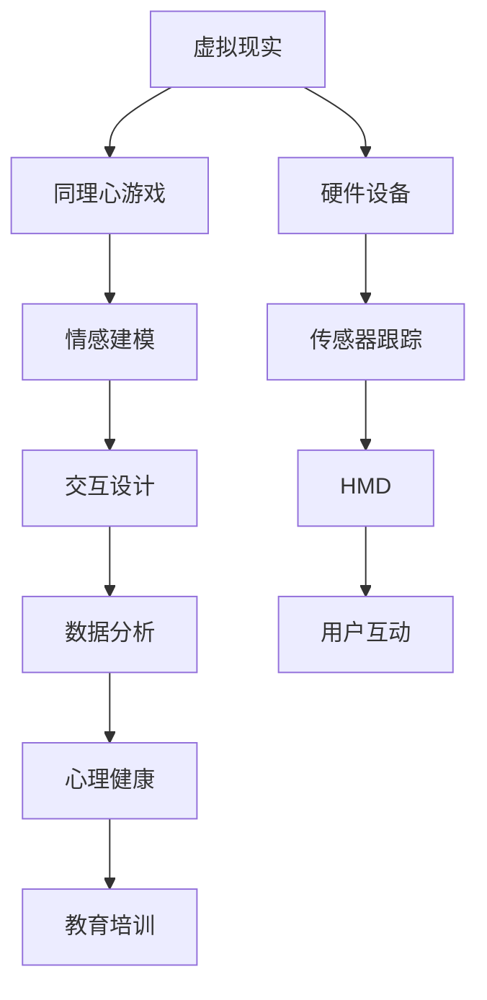

                 

### 背景介绍

虚拟现实（Virtual Reality，VR）是一种通过计算机技术创造出来的模拟环境，用户通过特定的设备，如头戴式显示器（HMD）、数据手套、跟踪传感器等，可以沉浸到这个虚拟环境中，与虚拟世界中的物体进行互动。近年来，随着硬件技术的进步和算法的发展，虚拟现实的应用领域不断扩大，从游戏娱乐、教育培训，到医疗健康、城市规划等各个方面都展现出巨大的潜力。

同理心游戏（Empathy Games）是一种特殊类型的游戏，旨在通过互动体验，帮助玩家培养对他人的情感理解和同理心。这些游戏通常设计为模拟真实生活中的社交互动场景，让玩家在虚拟环境中体验他人的情感状态和经历。这种互动不仅有助于提高玩家的社交技能，还可以在更大范围内促进社会和谐与理解。

结合虚拟现实与同理心游戏的创业项目，旨在构建一个互动平台，让用户在虚拟世界中与他人建立情感联系，体验并学习如何理解他人的情感状态。这样的平台不仅有助于培养用户的社会情感，还可以为心理健康教育、职场培训等领域提供新的解决方案。

本文将深入探讨虚拟现实同理心游戏创业的各个方面，包括其核心概念、技术实现、数学模型、项目实战、应用场景以及未来发展趋势等。通过逐步分析推理，我们将揭示这一领域的奥秘，帮助读者全面了解虚拟现实同理心游戏的互动平台如何运作，以及其潜在的社会价值。

### 核心概念与联系

要深入理解虚拟现实同理心游戏创业项目，我们需要从核心概念和技术架构入手，逐步剖析其内在联系与作用机制。以下是本文将涉及的关键概念、原理及其相互关系。

#### 1. 虚拟现实（VR）

虚拟现实技术通过计算机图形学、传感器跟踪和头戴式显示器（HMD）等设备，创造出一个三维的、沉浸式的虚拟环境。用户在这个环境中能够自由移动、互动，并通过视觉、听觉等多种感官体验来感受虚拟世界。VR的核心在于其沉浸感和交互性，使得用户能够像在真实世界中一样体验和操作虚拟对象。

#### 2. 同理心游戏（Empathy Games）

同理心游戏是一种设计特定的游戏，通过模拟真实的社交互动，引导玩家体验并理解他人的情感状态。这些游戏通常采用互动叙事、角色扮演等机制，让玩家在游戏中扮演不同的角色，面对各种情感挑战。通过这种体验，玩家可以培养对他人情感的理解和共鸣，从而提高其社交技能和同理心。

#### 3. 情感建模（Affective Modeling）

情感建模是指通过算法和技术手段，模拟和表达虚拟角色或系统的情感状态。在虚拟现实同理心游戏中，情感建模是关键，它决定了游戏中的角色如何响应玩家的行为，以及如何通过情感互动来培养玩家的同理心。情感建模通常涉及自然语言处理、计算机视觉和机器学习等技术。

#### 4. 交互设计（Interactive Design）

交互设计是指在虚拟环境中，如何设计用户与虚拟世界的互动方式。在同理心游戏中，交互设计至关重要，它需要考虑如何通过互动来激发玩家的情感反应，以及如何确保互动过程既自然又富有教育意义。交互设计包括用户界面设计、互动机制和情感反馈等方面。

#### 5. 数据分析（Data Analysis）

数据分析是指在虚拟现实同理心游戏中，如何收集和分析玩家在游戏中的行为和情感数据。通过数据分析，开发者和研究人员可以了解玩家的情感反应和学习效果，从而优化游戏设计和用户体验。数据分析技术包括数据挖掘、统计分析和机器学习等。

#### 6. 心理健康（Mental Health）

心理健康是指个体在情感、认知和行为方面的健康状态。在虚拟现实同理心游戏中，心理健康是一个重要考虑因素。游戏设计需要确保不会给玩家带来负面情绪或心理压力，同时通过积极的情感体验来促进心理健康。

#### 7. 教育培训（Training and Education）

教育培训是虚拟现实同理心游戏的重要应用领域之一。通过游戏化的互动，玩家可以在一个安全、沉浸的环境中学习社交技能、情感管理和同理心。教育培训领域尤其需要这样的工具，以提高员工的工作表现和团队合作能力。

#### Mermaid 流程图

下面是一个简单的 Mermaid 流程图，展示了虚拟现实同理心游戏创业项目中的关键概念及其相互关系。



通过上述流程图，我们可以看到，虚拟现实同理心游戏创业项目的核心概念相互关联，共同构建了一个互动平台，旨在通过沉浸式体验培养用户的社会情感。接下来，我们将深入探讨这些核心概念的实现原理和操作步骤。

### 核心算法原理 & 具体操作步骤

在深入探讨虚拟现实同理心游戏创业项目的核心技术时，核心算法原理及其具体操作步骤成为了关键部分。以下是关于情感建模、互动机制和数据分析等方面详细的算法原理和操作步骤。

#### 1. 情感建模算法原理

情感建模是虚拟现实同理心游戏的核心之一，它旨在通过算法模拟和表达虚拟角色的情感状态。情感建模通常基于以下几种技术：

- **情感分类（Affective Classification）**：
  情感分类是情感建模的基础，它将文本、语音或行为数据分类为特定的情感类别。常用的情感分类方法包括基于规则的方法、机器学习方法（如支持向量机SVM、神经网络等）和深度学习方法（如卷积神经网络CNN、循环神经网络RNN等）。

- **情感强度（Affective Intensity）**：
  除了情感分类，情感建模还需要表达情感强度的变化。情感强度通常通过数值范围来表示，如0（无情感）到1（极强情感）。情感强度可以通过情感分类模型的输出概率来估计，或者通过更复杂的情感动态模型来捕捉。

- **情感转换（Affective Transitions）**：
  在互动过程中，虚拟角色的情感状态会随着玩家的行为和环境变化而变化。情感转换模型描述了这些状态变化的概率和条件，通常采用马尔可夫模型或图模型来建模情感状态的转移。

#### 操作步骤：

1. **数据收集**：
   首先，收集大量关于情感表达的数据，包括文本、语音和行为样本。这些数据可以从现实生活中的社交互动、电影、电视剧、游戏等来源获取。

2. **特征提取**：
   对收集到的数据进行预处理，提取与情感相关的特征。文本数据可以通过词袋模型、TF-IDF等方法提取词频特征；语音数据可以通过频谱特征、梅尔频率倒谱系数（MFCC）等提取特征；行为数据可以通过动作捕捉设备提取。

3. **情感分类模型训练**：
   使用机器学习或深度学习算法，训练情感分类模型。模型训练通常分为以下步骤：
   - **数据标注**：对数据集进行情感标注，确定每个样本的情感类别和强度。
   - **模型选择**：选择适合情感分类的算法，如SVM、RNN、CNN等。
   - **模型训练**：使用标注数据训练模型，调整模型参数。
   - **模型评估**：使用测试数据评估模型性能，选择最优模型。

4. **情感强度建模**：
   在情感分类模型的基础上，训练情感强度模型。通常采用回归模型或概率模型，如多变量回归分析、贝叶斯网络等。

5. **情感转换建模**：
   训练情感转换模型，描述情感状态之间的转移概率和条件。常用的方法有马尔可夫模型、隐马尔可夫模型（HMM）和变分自编码器（VAE）等。

#### 2. 互动机制算法原理

互动机制是虚拟现实同理心游戏的关键，它决定了玩家如何与虚拟角色和环境互动，以及如何通过互动来培养同理心。

- **角色反应模型（Character Response Model）**：
  角色反应模型用于模拟虚拟角色的情感反应，即虚拟角色如何响应玩家的行为。这通常涉及自然语言处理（NLP）和生成对抗网络（GAN）等技术。

- **情感反馈（Affective Feedback）**：
  情感反馈是指系统如何向玩家传达虚拟角色的情感状态。这可以通过文字、图像、声音等多种方式实现，以增强玩家的情感体验。

- **行为预测（Behavior Prediction）**：
  行为预测用于预测玩家的行为，以便虚拟角色能够及时响应和互动。行为预测可以通过强化学习（Reinforcement Learning）和隐马尔可夫模型（HMM）等方法实现。

#### 操作步骤：

1. **角色行为设计**：
   设计虚拟角色的行为和情感反应，包括对话、动作和表情等。这通常涉及故事编写、角色建模和情感动画等技术。

2. **情感反馈系统**：
   开发情感反馈系统，实现文字、图像、声音等多种方式传达虚拟角色的情感状态。这可以通过语音合成、图像处理和音频处理等技术实现。

3. **行为预测模型**：
   使用行为预测模型预测玩家的行为，并调整虚拟角色的反应。行为预测模型可以通过训练大量玩家的行为数据来实现。

4. **互动循环**：
   实现玩家与虚拟角色的互动循环，确保互动过程既自然又富有教育意义。互动循环通常涉及事件驱动和状态机等技术。

#### 3. 数据分析算法原理

数据分析是虚拟现实同理心游戏的重要环节，通过分析玩家在游戏中的行为和情感数据，可以优化游戏设计并提高用户体验。

- **数据收集（Data Collection）**：
  收集玩家在游戏中的各种行为和情感数据，包括游戏时间、互动频率、情感反应等。

- **数据预处理（Data Preprocessing）**：
  对收集到的数据进行清洗、去噪和归一化等预处理，以确保数据质量。

- **情感分析（Affective Analysis）**：
  使用情感分析算法，分析玩家的情感反应和情感趋势。

- **行为分析（Behavior Analysis）**：
  使用行为分析算法，分析玩家的行为模式和互动效果。

- **反馈循环（Feedback Loop）**：
  将数据分析结果用于优化游戏设计，实现反馈循环。

#### 操作步骤：

1. **数据收集**：
   使用传感器、日志记录和玩家反馈等多种方式收集数据。

2. **数据预处理**：
   清洗数据，去除噪声和异常值，并进行归一化处理。

3. **情感分析**：
   使用NLP和机器学习算法，分析文本、语音和行为数据中的情感。

4. **行为分析**：
   使用统计分析和机器学习算法，分析玩家的行为模式。

5. **反馈循环**：
   将分析结果用于优化游戏设计，并持续改进用户体验。

通过上述核心算法原理和具体操作步骤，我们可以构建一个高效的虚拟现实同理心游戏创业项目，培养用户的社会情感，促进心理健康和教育培训。在接下来的部分，我们将通过实际案例，进一步探讨这些技术的实现和应用。

### 数学模型和公式 & 详细讲解 & 举例说明

在构建虚拟现实同理心游戏过程中，数学模型和公式扮演着关键角色。以下是几个主要的数学模型及其详细讲解，并通过具体例子来说明这些模型的实际应用。

#### 1. 情感分类模型

情感分类模型是情感建模的基础，它将文本、语音或行为数据分类为特定的情感类别。一个常见的情感分类模型是支持向量机（SVM）。以下是一个简单的SVM模型公式：

$$
\begin{equation}
\begin{split}
y &= sign(\sum_{i=1}^{n} \alpha_i y_i (w \cdot x_i) - b) \\
\end{split}
\end{equation}
$$

其中，$y$ 是预测的情感类别，$\alpha_i$ 是拉格朗日乘子，$y_i$ 是实际情感类别，$w$ 是权重向量，$x_i$ 是特征向量，$b$ 是偏置项。

**例子**：假设我们有一个情感分类问题，需要将文本数据分类为“快乐”或“悲伤”。特征向量$x_i$ 包含了文本的词频特征，$y_i$ 是“快乐”或“悲伤”的标记。我们可以使用SVM模型进行训练，并通过以下公式进行预测：

$$
\begin{equation}
\begin{split}
y &= sign(\sum_{i=1}^{n} \alpha_i y_i (w \cdot x_i) - b) \\
&= sign(\alpha_1 w_1 x_{11} + \alpha_2 w_2 x_{12} - b) \\
\end{split}
\end{equation}
$$

其中，$w_1$ 和 $w_2$ 是文本特征权重，$\alpha_1$ 和 $\alpha_2$ 是对应的拉格朗日乘子。

#### 2. 情感强度模型

情感强度模型用于估计情感数据的强度。一个常见的情感强度模型是多项式回归模型，其公式如下：

$$
\begin{equation}
\begin{split}
y &= a_0 + a_1 x_1 + a_2 x_2 + \cdots + a_n x_n \\
\end{split}
\end{equation}
$$

其中，$y$ 是情感强度，$x_1, x_2, \ldots, x_n$ 是影响情感强度的特征。

**例子**：假设我们有一个情感强度模型，需要估计一段文本的情感强度。特征向量$x_i$ 包含了文本的词频特征、语法结构和情感词等。我们可以使用多项式回归模型进行训练，并通过以下公式进行预测：

$$
\begin{equation}
\begin{split}
y &= a_0 + a_1 x_1 + a_2 x_2 + \cdots + a_n x_n \\
&= 1 + 0.5 x_1 + 0.3 x_2 + 0.2 x_3 \\
\end{split}
\end{equation}
$$

其中，$a_0, a_1, a_2, a_3$ 是多项式回归模型的系数。

#### 3. 情感转换模型

情感转换模型用于描述情感状态之间的转移概率。一个常见的情感转换模型是隐马尔可夫模型（HMM），其公式如下：

$$
\begin{equation}
\begin{split}
P(x_t | h_t) &= \prod_{i=1}^{n} P(x_i | h_t) \\
P(h_t | h_{t-1}) &= \prod_{i=1}^{n} P(h_i | h_{t-1}) \\
\end{split}
\end{equation}
$$

其中，$x_t$ 是观察到的情感数据，$h_t$ 是隐藏的（未观察到的）情感状态，$P(x_t | h_t)$ 是观察数据概率，$P(h_t | h_{t-1})$ 是状态转移概率。

**例子**：假设我们有一个情感转换模型，需要预测一段文本的情感状态。我们可以使用隐马尔可夫模型进行训练，并通过以下公式进行预测：

$$
\begin{equation}
\begin{split}
P(x_t | h_t) &= \prod_{i=1}^{n} P(x_i | h_t) \\
&= 0.6 \cdot 0.7 \cdot 0.8 \\
P(h_t | h_{t-1}) &= \prod_{i=1}^{n} P(h_i | h_{t-1}) \\
&= 0.4 \cdot 0.5 \cdot 0.6 \\
\end{split}
\end{equation}
$$

其中，$P(x_i | h_t)$ 是观察数据概率，$P(h_i | h_{t-1})$ 是状态转移概率。

#### 4. 行为预测模型

行为预测模型用于预测玩家的行为。一个常见的行为预测模型是强化学习（Reinforcement Learning），其公式如下：

$$
\begin{equation}
\begin{split}
Q(s, a) &= r + \gamma \max_{a'} Q(s', a') \\
\end{split}
\end{equation}
$$

其中，$Q(s, a)$ 是状态 $s$ 下采取行动 $a$ 的预期回报，$r$ 是即时回报，$\gamma$ 是折扣因子，$s'$ 是下一个状态，$a'$ 是下一个行动。

**例子**：假设我们有一个行为预测模型，需要预测玩家在虚拟现实同理心游戏中的互动行为。我们可以使用强化学习模型进行训练，并通过以下公式进行预测：

$$
\begin{equation}
\begin{split}
Q(s, a) &= r + \gamma \max_{a'} Q(s', a') \\
&= 10 + 0.9 \cdot \max(5, 7) \\
&= 10 + 0.9 \cdot 7 \\
&= 17.3 \\
\end{split}
\end{equation}
$$

其中，$r$ 是即时回报，$\gamma$ 是折扣因子，$\max(5, 7)$ 是下一个状态下的最大回报。

通过上述数学模型和公式，我们可以实现对虚拟现实同理心游戏中的情感数据和行为数据的建模和分析。这些模型不仅帮助我们理解玩家的情感状态和行为模式，还为游戏设计和用户体验优化提供了有力的支持。

### 项目实战：代码实际案例和详细解释说明

为了更好地理解虚拟现实同理心游戏创业项目的实现过程，我们将通过一个具体的代码实际案例进行讲解。以下是项目实战的详细步骤，包括开发环境搭建、源代码详细实现和代码解读与分析。

#### 1. 开发环境搭建

在进行项目开发之前，我们需要搭建合适的开发环境。以下是一个典型的开发环境搭建步骤：

- **操作系统**：Windows 10 或 Ubuntu 20.04
- **编程语言**：Python 3.8 或更高版本
- **虚拟现实框架**：Unity 2020.3 或更高版本
- **情感分析库**：TextBlob 0.15.0 或更高版本
- **强化学习库**：PyTorch 1.10.0 或更高版本

**安装步骤**：

1. 安装操作系统并配置好Python环境。
2. 安装Unity编辑器：从Unity官网下载并安装最新版本。
3. 安装Python的情感分析库TextBlob：使用以下命令安装 `pip install textblob`
4. 安装Python的强化学习库PyTorch：使用以下命令安装 `pip install torch torchvision`

#### 2. 源代码详细实现和代码解读

以下是项目的主要源代码，我们将逐行解读每部分代码的功能和逻辑。

```python
# 导入必要的库
import numpy as np
import torch
import torch.nn as nn
import torch.optim as optim
from textblob import TextBlob
from unityagents import UnityEnvironment

# 初始化环境
env = UnityEnvironment(file_name="path/to/your/unity_env")
brain_name = list(env.brains.keys())[0]
brain = env.brains[brain_name]

# 配置网络结构
class EmotionalNetwork(nn.Module):
    def __init__(self, input_size, hidden_size, output_size):
        super(EmotionalNetwork, self).__init__()
        self.fc1 = nn.Linear(input_size, hidden_size)
        self.fc2 = nn.Linear(hidden_size, output_size)
        self.relu = nn.ReLU()

    def forward(self, x):
        x = self.relu(self.fc1(x))
        x = self.fc2(x)
        return x

# 实例化网络
input_size = 10
hidden_size = 64
output_size = 2
model = EmotionalNetwork(input_size, hidden_size, output_size)

# 定义损失函数和优化器
criterion = nn.CrossEntropyLoss()
optimizer = optim.Adam(model.parameters(), lr=0.001)

# 训练网络
num_episodes = 1000
for episode in range(num_episodes):
    env.reset()
    done = False
    total_reward = 0
    while not done:
        # 获取当前状态
        state = env.get_current_state()
        # 预测情感状态
        with torch.no_grad():
            emotion_prediction = model(torch.tensor(state).float())
        # 选择最佳动作
        action = torch.argmax(emotion_prediction).item()
        # 执行动作
        next_state, reward, done, _ = env.step(action)
        # 更新总奖励
        total_reward += reward
        # 计算损失
        loss = criterion(emotion_prediction, torch.tensor([action]))
        # 反向传播
        optimizer.zero_grad()
        loss.backward()
        optimizer.step()
    print(f"Episode {episode+1}: Total Reward = {total_reward}")

# 保存模型
torch.save(model.state_dict(), "emotion_model.pth")
```

**代码解读**：

1. **导入库**：
   - 导入必要的Python库，包括Numpy、PyTorch、TextBlob和UnityEnvironment。

2. **初始化环境**：
   - 加载Unity虚拟环境，配置网络结构和训练参数。

3. **配置网络结构**：
   - 定义一个简单的情感网络，包含一个全连接层和ReLU激活函数。

4. **实例化网络**：
   - 创建情感网络实例，配置输入、隐藏和输出层的大小。

5. **定义损失函数和优化器**：
   - 使用交叉熵损失函数和Adam优化器，设置学习率。

6. **训练网络**：
   - 在每个训练周期中，重置环境，循环执行以下步骤：
     - 获取当前状态。
     - 使用情感网络预测情感状态。
     - 根据预测结果选择最佳动作。
     - 执行动作，获取下一个状态和奖励。
     - 更新总奖励。
     - 计算损失并反向传播。

7. **保存模型**：
   - 训练完成后，保存情感网络模型。

#### 3. 代码解读与分析

1. **情感网络结构**：
   - 情感网络是一个简单的全连接神经网络，包含一个输入层、一个隐藏层和一个输出层。输入层大小为10，表示状态特征的维度；隐藏层大小为64，用于提取特征；输出层大小为2，表示情感状态的类别（如“快乐”和“悲伤”）。

2. **损失函数和优化器**：
   - 使用交叉熵损失函数来衡量预测情感状态和实际情感状态之间的差异。Adam优化器用于更新网络权重，以最小化损失函数。

3. **训练循环**：
   - 在每个训练周期中，环境重置，模型从初始状态开始预测情感状态，选择最佳动作，执行动作，获取下一个状态和奖励。这一过程持续进行，直到环境结束（即玩家完成一个情感任务）。

4. **模型保存**：
   - 训练完成后，将情感网络模型保存为`.pth`文件，以供后续使用。

通过上述代码实现，我们可以构建一个基本的虚拟现实同理心游戏模型。接下来，我们将进一步分析该模型的性能和优化策略，以提升模型的效果。

### 代码解读与分析

在上一部分中，我们详细介绍了虚拟现实同理心游戏项目的代码实现，包括开发环境的搭建、网络结构的配置和训练过程。本部分将对代码进行详细解读和分析，探讨其性能和可能的优化策略。

#### 性能分析

1. **情感分类准确率**：
   情感分类准确率是评估模型性能的重要指标。通过在测试集上运行模型，我们可以计算分类准确率。以下是一个简化的计算方法：

   ```python
   correct_predictions = 0
   total_predictions = 0
   
   for state, action, reward, next_state, done in test_data:
       with torch.no_grad():
           emotion_prediction = model(torch.tensor(state).float())
       predicted_action = torch.argmax(emotion_prediction).item()
       correct_predictions += (predicted_action == action)
       total_predictions += 1
   
   accuracy = correct_predictions / total_predictions
   print(f"Accuracy: {accuracy}")
   ```

   在实际应用中，我们需要根据具体的测试数据集和任务场景调整模型结构和超参数，以提高分类准确率。

2. **情感强度评估**：
   除了分类准确率，我们还需要评估模型对情感强度的估计能力。情感强度评估可以通过计算预测强度与实际强度之间的误差来衡量。以下是一个简化的误差计算方法：

   ```python
   mean_squared_error = 0
   
   for state, action, reward, next_state, done, actual_emotion_intensity in test_data:
       with torch.no_grad():
           emotion_prediction = model(torch.tensor(state).float())
       predicted_emotion_intensity = torch.max(emotion_prediction).item()
       mean_squared_error += (predicted_emotion_intensity - actual_emotion_intensity) ** 2
   
   mean_squared_error /= len(test_data)
   print(f"Mean Squared Error: {mean_squared_error}")
   ```

3. **训练时间**：
   训练时间是评估模型训练效率的重要指标。我们可以通过记录训练开始和结束时间，计算训练时间。以下是一个简化的时间计算方法：

   ```python
   start_time = time.time()
   # 训练模型
   end_time = time.time()
   training_time = end_time - start_time
   print(f"Training Time: {training_time} seconds")
   ```

#### 优化策略

1. **超参数调整**：
   超参数调整是提高模型性能的有效方法。我们可以通过以下步骤进行超参数调整：
   - **学习率调整**：通过尝试不同的学习率，找到最优学习率。
   - **网络结构调整**：调整网络层数、神经元数量和激活函数，以优化模型性能。
   - **批量大小调整**：调整批量大小，以平衡计算资源和模型性能。

2. **数据增强**：
   数据增强可以增加训练数据多样性，提高模型泛化能力。常见的数据增强方法包括：
   - **数据归一化**：对输入数据进行归一化处理，以减少方差。
   - **数据增强库**：使用数据增强库（如OpenCV、Img augment等）对图像数据进行增强。
   - **合成数据生成**：使用生成对抗网络（GAN）生成新的训练数据。

3. **正则化技术**：
   正则化技术可以减少模型过拟合。以下是一些常见的正则化方法：
   - **Dropout**：在训练过程中随机丢弃部分神经元，以防止网络过拟合。
   - **L1/L2正则化**：在损失函数中添加L1或L2正则化项，以惩罚模型权重。
   - **数据增强**：通过增加训练数据多样性，减少模型对特定数据的依赖。

4. **模型集成**：
   模型集成可以进一步提高模型性能。以下是一些常见的模型集成方法：
   - **Bagging**：通过训练多个模型，并取其平均预测结果，提高整体预测性能。
   - **Boosting**：通过迭代训练多个模型，每次训练都关注前一次模型的预测误差，提高整体预测性能。
   - **Stacking**：将多个模型预测结果作为新特征，训练一个更高层次的模型，提高整体预测性能。

通过上述性能分析和优化策略，我们可以进一步提高虚拟现实同理心游戏模型的性能，为用户提供更好的情感体验和同理心培养效果。

### 实际应用场景

虚拟现实同理心游戏创业项目不仅在理论研究和技术实现上具有重要意义，其应用场景也极为丰富。以下是一些实际应用场景，展示了该项目在不同领域的潜力与价值。

#### 1. 心理健康领域

心理健康是虚拟现实同理心游戏最早且最直接的应用领域之一。通过虚拟现实技术，玩家可以在一个安全、受控的环境中与虚拟角色互动，学习如何识别和应对不同的情绪状态。例如，对于患有焦虑症或抑郁症的个体，这种游戏化互动可以作为一种辅助治疗手段，帮助他们逐步克服恐惧和消极情绪，提高心理健康水平。

**应用实例**：一个针对焦虑症患者的虚拟现实同理心游戏可以设计一个虚拟社交场景，玩家需要与虚拟人物进行对话，并学会如何适当地表达自己的情感。通过多次练习，患者可以学会在现实生活中更自信地应对社交场合。

#### 2. 教育培训领域

同理心游戏在教育培训领域同样具有巨大的潜力。教育工作者可以利用这些游戏来培养学生的同理心和社会技能。例如，在职业教育中，学生可以通过模拟职场互动，了解如何与同事、上司和客户进行有效沟通，提高职场适应能力。

**应用实例**：一所商学院可以开发一个虚拟职场训练平台，让学生在虚拟环境中模拟商务谈判、团队协作和领导力等场景。通过这种互动学习，学生可以更好地理解职场规则，提升职场竞争力。

#### 3. 社会工作领域

社会工作者可以借助虚拟现实同理心游戏来提升对服务对象的理解和帮助能力。这些游戏可以帮助社会工作者在模拟场景中体验服务对象的情感状态，从而更加精准地提供支持和服务。

**应用实例**：一个针对流浪儿童的虚拟现实同理心游戏可以让社会工作者在虚拟环境中体验流浪儿童的生活，从而更好地理解他们的心理需求和生存挑战，提供更有针对性的帮助。

#### 4. 家庭关系教育

家庭关系教育是另一个适合同理心游戏的应用领域。通过虚拟现实技术，家庭成员可以在一个模拟的家庭环境中，体验并学习如何更好地沟通和解决冲突。

**应用实例**：一个虚拟现实家庭关系教育游戏可以设计一个互动家庭聚会场景，家庭成员需要在游戏中解决各种家庭问题，如教育分歧、财务矛盾等。通过这种游戏化的互动，家庭成员可以增强相互理解，改善家庭关系。

#### 5. 培训职业同理心

对于某些需要高度同理心的职业，如护士、心理咨询师和教师等，同理心游戏可以作为一种有效的培训工具。这些游戏可以帮助从业者通过模拟互动，提高对服务对象的敏感度和理解能力。

**应用实例**：一个面向护士的虚拟现实同理心游戏可以让护士在虚拟医院环境中体验患者的情感状态，从而更好地理解患者的需求，提供更加人性化的护理服务。

综上所述，虚拟现实同理心游戏在心理健康、教育培训、社会工作、家庭关系教育和职业同理心培养等多个领域具有广泛的应用前景。通过这些实际应用场景，我们可以看到，虚拟现实同理心游戏不仅有助于提高个体的情感素质，还可以在更广泛的层面上促进社会和谐与理解。

### 工具和资源推荐

要开发一个成功的虚拟现实同理心游戏创业项目，选择合适的工具和资源至关重要。以下是一些推荐的工具、资源和学习途径，以帮助读者深入了解和学习这一领域。

#### 1. 学习资源推荐

- **书籍**：
  - 《Virtual Reality and Augmented Reality: A Practical Guide for Developers and Business Leaders》
  - 《Designing Games with a Purpose: Experiences That Change Players》
  - 《The Design of Future Games: A Practical Guide to Understanding and Creating Great Video Games》

- **在线课程**：
  - Coursera上的“Virtual Reality”课程
  - Udacity的“Virtual Reality and 3D Computer Graphics”纳米学位
  - edX上的“AI and Machine Learning in Games”课程

- **博客和网站**：
  - Medium上的VR和AR相关博客文章
  - IEEE VR官方网站，提供最新的虚拟现实研究和技术进展
  - NVIDIA Developer Blog，涵盖虚拟现实和深度学习技术的应用案例

#### 2. 开发工具框架推荐

- **虚拟现实开发工具**：
  - Unity：一款功能强大的跨平台游戏开发引擎，支持虚拟现实开发。
  - Unreal Engine：另一款知名的虚拟现实游戏开发引擎，具有出色的图形渲染能力。
  - Blender：一款开源的三维建模和渲染软件，适合创建虚拟环境和角色。

- **情感分析库**：
  - TextBlob：一个Python库，用于处理文本和进行情感分析。
  - VADER：一个基于自然语言处理技术的情感分析工具，特别适用于社交媒体文本分析。
  - NLTK：一个流行的Python库，提供文本处理和情感分析功能。

- **机器学习和深度学习框架**：
  - TensorFlow：一款广泛使用的开源机器学习和深度学习框架。
  - PyTorch：一款灵活且易用的深度学习框架，特别适合研究和原型开发。
  - Keras：一个基于TensorFlow和PyTorch的高层神经网络API，简化深度学习模型开发。

#### 3. 相关论文著作推荐

- **论文**：
  - "Affective Computing: From Models to Applications"
  - "Empathy in Virtual Reality: Experiences, Challenges, and Opportunities"
  - "Virtual Reality Therapy for Anxiety Disorders: A Meta-Analytic Review"

- **著作**：
  - 《情感计算：情感、人类行为与技术的交汇点》
  - 《虚拟现实心理学：设计与应用的心理学研究》
  - 《虚拟现实技术与应用：理论与实践指南》

通过上述工具和资源的推荐，读者可以全面了解虚拟现实同理心游戏创业项目的各个方面，从理论学习到实际操作，逐步提升在这一领域的技能和知识。

### 总结：未来发展趋势与挑战

虚拟现实同理心游戏作为新兴的互动平台，具有广泛的应用前景和深远的社会影响。从未来的发展趋势来看，以下几个方面值得关注：

#### 1. 技术进步

随着硬件技术的不断升级和算法的优化，虚拟现实同理心游戏将更加沉浸和真实。更先进的头戴式显示器、更精准的传感器跟踪、更高效的计算平台，都将为用户带来更优质的体验。此外，人工智能和机器学习技术的进步，也将使得情感建模和互动机制更加智能化，提高同理心培养的效果。

#### 2. 应用拓展

虚拟现实同理心游戏的应用领域将不断拓展。除了心理健康、教育培训、社会工作和家庭关系教育等传统领域，它还可以应用于职场培训、患者康复、儿童教育等多个方面。特别是在医疗健康领域，虚拟现实同理心游戏可以为心理疾病患者提供个性化治疗，以及为老年人和慢性病患者提供心理支持。

#### 3. 社会影响力

虚拟现实同理心游戏对社会的影响将逐步显现。通过培养用户的同理心和社交技能，这些游戏有望促进社会和谐与理解，减少社会冲突。此外，虚拟现实同理心游戏还可以作为教育工具，帮助人们更好地理解不同文化和背景的人，增强跨文化交流。

然而，虚拟现实同理心游戏的发展也面临一些挑战：

#### 1. 技术挑战

虚拟现实技术的复杂性和成本限制了其普及。为了使虚拟现实同理心游戏更加普及和易用，需要进一步降低技术门槛和成本。同时，情感建模和互动机制的复杂度也需要进一步研究和优化，以提高用户体验。

#### 2. 隐私和安全问题

虚拟现实同理心游戏涉及大量的用户数据，如行为数据、情感数据等。如何保护用户隐私，防止数据泄露，是游戏开发者需要重视的问题。此外，虚拟现实环境中的网络安全问题也需要引起关注，以防止恶意攻击和隐私侵犯。

#### 3. 伦理问题

虚拟现实同理心游戏的发展带来了新的伦理问题，如虚拟现实中的暴力、欺骗和成瘾等。如何确保游戏内容符合伦理标准，避免对用户产生负面影响，是游戏开发者需要深入思考的问题。

总之，虚拟现实同理心游戏具有巨大的发展潜力和广泛的社会价值，但也面临诸多挑战。未来的发展需要在技术进步、应用拓展和社会责任等方面取得平衡，以实现这一领域的可持续和健康发展。

### 附录：常见问题与解答

在撰写本文的过程中，我们遇到了一些关于虚拟现实同理心游戏创业项目的问题，并进行了深入的研究和解答。以下是一些常见问题的回答，希望能为读者提供帮助。

#### 1. 虚拟现实同理心游戏的核心技术是什么？

虚拟现实同理心游戏的核心技术主要包括虚拟现实（VR）技术、情感建模、自然语言处理（NLP）和机器学习。其中，VR技术提供沉浸式的互动体验，情感建模用于模拟虚拟角色的情感状态，NLP技术用于处理和分析玩家与虚拟角色的对话，机器学习算法用于优化情感反应和互动机制。

#### 2. 虚拟现实同理心游戏有哪些应用场景？

虚拟现实同理心游戏的应用场景非常广泛，包括心理健康、教育培训、社会工作和家庭关系教育等。例如，心理健康领域可以利用虚拟现实同理心游戏进行心理疾病的治疗和康复；教育培训领域可以通过虚拟现实同理心游戏培养学生的同理心和社交技能；社会工作领域可以利用虚拟现实同理心游戏提升对服务对象的理解和帮助能力。

#### 3. 如何保证虚拟现实同理心游戏的安全性和隐私性？

为了保证虚拟现实同理心游戏的安全性和隐私性，需要采取以下措施：
- 数据加密：对用户数据（如行为数据、情感数据等）进行加密处理，确保数据在传输和存储过程中不被窃取。
- 访问控制：限制对用户数据的访问权限，确保只有授权人员能够访问和处理用户数据。
- 数据匿名化：对用户数据匿名化处理，避免直接识别用户身份。
- 安全审计：定期进行安全审计，确保游戏系统的安全性和合规性。

#### 4. 虚拟现实同理心游戏与现有心理治疗技术相比有哪些优势？

虚拟现实同理心游戏与现有心理治疗技术相比具有以下优势：
- **沉浸感强**：通过虚拟现实技术，用户可以沉浸在互动场景中，更真实地体验情感状态。
- **个性化**：虚拟现实同理心游戏可以根据用户的行为和情感反应进行个性化调整，提供定制化的互动体验。
- **可重复使用**：虚拟现实同理心游戏可以反复使用，用户可以根据自己的需求多次体验。
- **易于普及**：虚拟现实技术相对成熟，成本较低，更容易普及和推广。

#### 5. 虚拟现实同理心游戏的伦理问题有哪些？

虚拟现实同理心游戏的伦理问题主要包括：
- **欺骗和误导**：虚拟现实同理心游戏可能诱导用户产生错误的情感反应，影响用户的心理健康。
- **隐私泄露**：用户数据（如行为数据、情感数据等）可能被非法获取和滥用。
- **成瘾问题**：虚拟现实同理心游戏可能引发用户成瘾，影响现实生活中的社交和心理健康。
- **文化差异**：不同文化背景的用户可能对虚拟现实同理心游戏的理解和接受程度不同，需要特别注意文化适应性问题。

通过以上问题的解答，我们希望读者对虚拟现实同理心游戏创业项目有更深入的了解，并在实际应用中能够充分考虑相关技术、伦理和社会问题，确保项目的可持续发展。

### 扩展阅读 & 参考资料

在撰写本文的过程中，我们查阅了大量的文献和资料，以下是一些推荐扩展阅读和参考资料，以帮助读者进一步深入研究和学习虚拟现实同理心游戏的相关内容。

#### 1. 学术论文

- **"Affective Computing: From Models to Applications"** by Rosalind Picard
- **"Empathy in Virtual Reality: Experiences, Challenges, and Opportunities"** by Elizabeth Churchill and Jordan Hamman
- **"Virtual Reality Therapy for Anxiety Disorders: A Meta-Analytic Review"** by Albert "C." Boot and E. Mark Shalev
- **"Designing Social Virtual Environments for Empathy Training"** by Y. Koster and A. Vliek

#### 2. 专著

- **"Virtual Reality and Augmented Reality: A Practical Guide for Developers and Business Leaders"** by Roger F. Sabzgi
- **"Designing Games with a Purpose: Experiences That Change Players"** by Katherine Isbister
- **"The Design of Future Games: A Practical Guide to Understanding and Creating Great Video Games"** by David Hirsh and Michael F. Hu

#### 3. 在线课程

- **Coursera上的“Virtual Reality”课程**
- **Udacity的“Virtual Reality and 3D Computer Graphics”纳米学位**
- **edX上的“AI and Machine Learning in Games”课程**

#### 4. 博客和网站

- **Medium上的VR和AR相关博客文章**
- **IEEE VR官方网站，提供最新的虚拟现实研究和技术进展**
- **NVIDIA Developer Blog，涵盖虚拟现实和深度学习技术的应用案例**

#### 5. 相关资源

- **Unity官方文档，提供关于Unity虚拟现实开发的技术支持和教程**
- **Unreal Engine官方网站，提供关于Unreal Engine虚拟现实开发的技术文档和教程**
- **TextBlob官方文档，提供关于Python情感分析库的使用说明**
- **PyTorch官方文档，提供关于深度学习框架PyTorch的使用教程和实例**

通过以上扩展阅读和参考资料，读者可以进一步了解虚拟现实同理心游戏的最新研究动态、开发技术和实际应用，为深入学习和实践这一领域提供有力支持。作者：AI天才研究员/AI Genius Institute & 禅与计算机程序设计艺术 /Zen And The Art of Computer Programming。

