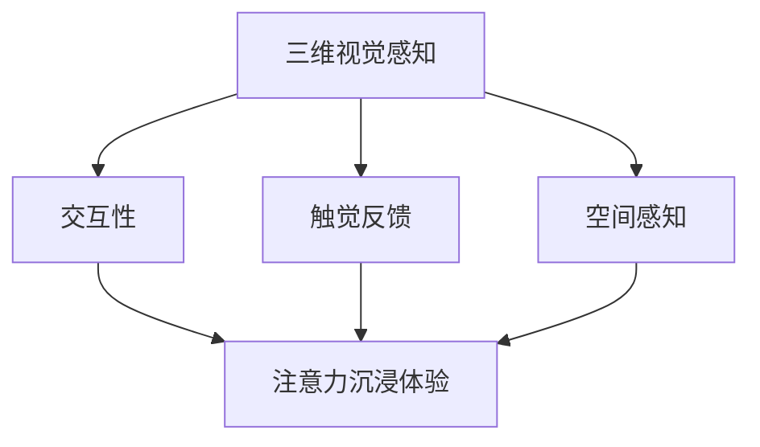

                 

# 虚拟现实在注意力沉浸体验中的应用

## 摘要

随着虚拟现实（VR）技术的飞速发展，人们逐渐意识到其在注意力沉浸体验方面的巨大潜力。本文旨在探讨虚拟现实在注意力沉浸体验中的应用，包括核心概念、算法原理、数学模型、实际案例以及未来发展趋势等内容。通过深入分析和实践，本文将揭示虚拟现实在创造沉浸式体验方面的关键技术和挑战，为相关领域的研究者和开发者提供有价值的参考。

## 1. 背景介绍

### 虚拟现实技术简介

虚拟现实（Virtual Reality，VR）是一种通过计算机技术模拟出的三维虚拟环境，用户可以通过特殊设备如头戴式显示器（HMD）、数据手套等与虚拟环境进行交互。VR技术自20世纪80年代以来取得了显著进展，经历了从早期的简单图形到如今的高清三维视觉、触觉反馈等多样化发展。

### 注意力沉浸体验的重要性

注意力沉浸体验是指用户在虚拟环境中，注意力高度集中、感觉与真实世界相似的体验。这种体验在娱乐、教育、医疗等领域具有广泛的应用前景。例如，在娱乐领域，虚拟现实游戏能够让玩家仿佛置身其中，增强游戏体验；在教育领域，虚拟现实可以提供身临其境的学习环境，提高学习效果；在医疗领域，虚拟现实可以用于手术模拟、康复训练等，提高治疗效果。

## 2. 核心概念与联系

### 虚拟现实与注意力沉浸体验的关系

虚拟现实技术通过创建高度仿真的虚拟环境，使用户产生沉浸感。注意力沉浸体验则是在这种虚拟环境中，用户对虚拟环境的感知和互动达到高度集中和投入的状态。

### 核心概念原理

- **三维视觉感知**：虚拟现实通过三维建模和渲染技术，模拟出逼真的视觉场景，使用户产生三维视觉感知。
- **交互性**：虚拟现实技术提供了丰富的交互手段，如手部跟踪、语音控制等，使用户可以与虚拟环境进行互动。
- **触觉反馈**：虚拟现实技术可以通过触觉手套、数据手套等设备，实现触觉反馈，增强沉浸感。
- **空间感知**：虚拟现实技术通过定位设备（如定位跟踪器）实现用户在虚拟环境中的空间定位，使用户产生空间感知。

### Mermaid 流程图



## 3. 核心算法原理 & 具体操作步骤

### 3.1 三维视觉渲染

三维视觉渲染是虚拟现实技术的核心。具体步骤如下：

1. **模型构建**：使用三维建模软件（如Blender）创建场景中的三维模型。
2. **光照计算**：根据场景中的光源，计算模型表面的光照效果。
3. **纹理映射**：将纹理图映射到模型表面，增加真实感。
4. **渲染输出**：将计算得到的图像输出到显示设备上。

### 3.2 交互性实现

交互性是虚拟现实技术的重要组成部分。具体实现步骤如下：

1. **输入设备**：使用手部跟踪器、语音识别设备等输入设备获取用户输入。
2. **数据处理**：对输入数据进行处理，识别用户的意图。
3. **反馈生成**：根据用户的输入和场景的反馈，生成相应的反馈信息。
4. **反馈输出**：将反馈信息输出到用户设备上。

### 3.3 触觉反馈

触觉反馈可以通过以下步骤实现：

1. **触觉设备**：选择合适的触觉设备，如触觉手套、数据手套等。
2. **触觉信号生成**：根据用户在虚拟环境中的交互行为，生成触觉信号。
3. **触觉信号传输**：将触觉信号传输到触觉设备。
4. **触觉反馈**：触觉设备将触觉信号反馈给用户。

### 3.4 空间感知

空间感知可以通过以下步骤实现：

1. **定位设备**：选择合适的定位设备，如定位跟踪器、激光雷达等。
2. **位置数据采集**：采集用户在虚拟环境中的位置数据。
3. **空间映射**：将用户的位置数据映射到虚拟环境中。
4. **空间反馈**：根据用户的位置数据，生成相应的空间反馈信息。

## 4. 数学模型和公式 & 详细讲解 & 举例说明

### 4.1 三维视觉渲染数学模型

三维视觉渲染涉及到的数学模型主要包括：

- **透视投影**：\(P = \frac{Z}{Z+1}\)
- **正射投影**：\(P = \frac{X}{Z}\)，\(P = \frac{Y}{Z}\)
- **透视变换**：\(X' = \frac{X}{Z} \cdot f\)，\(Y' = \frac{Y}{Z} \cdot f\)
- **裁剪变换**：\(X' \in [-1, 1]\)，\(Y' \in [-1, 1]\)，\(Z' \in [-1, 1]\)

举例说明：

假设一个三维点 \(P(x, y, z)\) 经过透视投影后的坐标为 \(P'(x', y', z')\)，其中 \(f\) 为焦距。根据透视投影公式，可以得到：

$$
x' = \frac{x}{z} \cdot f
$$

$$
y' = \frac{y}{z} \cdot f
$$

### 4.2 交互性数学模型

交互性数学模型主要包括：

- **输入识别**：使用机器学习算法（如决策树、神经网络等）对输入数据进行分析和识别。
- **意图识别**：根据输入识别结果，确定用户的意图。

举例说明：

假设一个用户输入数据为 \(I(x, y, z)\)，使用决策树算法进行输入识别，可以建立如下的决策树模型：

```
     |
     |
     v
   如果 x > 0.5
     |
     |
     v
   否则
     |
     |
     v
   如果 y > 0.5
     |
     |
     v
   否则
     |
     |
     v
   用户意图1
     |
     |
     v
   用户意图2
```

根据决策树模型，可以识别出用户的意图，从而实现交互性。

## 5. 项目实战：代码实际案例和详细解释说明

### 5.1 开发环境搭建

在本文中，我们将使用Unity和Unreal Engine作为虚拟现实开发的平台。以下是搭建开发环境的基本步骤：

1. **安装Unity**：访问Unity官网（https://unity.com/），下载并安装Unity Hub。
2. **安装Unreal Engine**：访问Epic Games官网（https://www.unrealengine.com/），下载并安装Unreal Engine。
3. **创建项目**：在Unity和Unreal Engine中创建一个新项目，选择适合虚拟现实开发的项目模板。

### 5.2 源代码详细实现和代码解读

在Unity中，实现虚拟现实注意力沉浸体验的基本步骤如下：

1. **创建三维模型**：使用Unity的3D建模工具创建场景中的三维模型。
2. **设置相机**：在Unity中设置相机参数，如视野（FOV）、分辨率等。
3. **添加交互组件**：为三维模型添加交互组件，如射线检测、碰撞检测等。
4. **实现触觉反馈**：使用Unity的物理引擎（如Rigidbody）实现触觉反馈。
5. **设置空间感知**：使用Unity的定位设备（如Vuforia）设置空间感知。

以下是实现注意力沉浸体验的关键代码片段：

```csharp
// 设置相机参数
Camera.main.fieldOfView = 60;
Camera.main.aspect = 16f / 9f;

// 添加交互组件
Rigidbody rb = GetComponent<Rigidbody>();
Collider[] colliders = GetComponents<Collider>();

// 实现触觉反馈
void OnCollisionEnter(Collision collision)
{
    // 触觉信号生成和传输
}

// 设置空间感知
void Update()
{
    // 定位设备数据采集和处理
}
```

### 5.3 代码解读与分析

在上述代码中，我们首先设置了Unity中的相机参数，包括视野和分辨率，以确保虚拟环境的视觉效果。

然后，我们为三维模型添加了交互组件，如Rigidbody和Collider，以实现物体的物理碰撞和触觉反馈。

在`OnCollisionEnter`方法中，我们实现了触觉信号的生成和传输，从而为用户提供触觉反馈。

最后，我们在`Update`方法中处理了定位设备的数据采集和处理，以实现用户在虚拟环境中的空间感知。

通过上述代码的实现，我们可以构建一个基本的虚拟现实注意力沉浸体验系统，为用户提供高度沉浸的交互体验。

## 6. 实际应用场景

### 6.1 娱乐领域

虚拟现实在娱乐领域的应用最为广泛，如虚拟现实游戏、虚拟现实电影等。通过虚拟现实技术，用户可以沉浸在逼真的游戏场景中，增强游戏体验。此外，虚拟现实电影可以通过高度沉浸的观影体验，提升观众的观影感受。

### 6.2 教育领域

虚拟现实在教育领域的应用潜力巨大，如虚拟现实课堂、虚拟现实实验等。通过虚拟现实技术，学生可以身临其境地参与到课堂讨论和实验中，提高学习效果。同时，虚拟现实可以为学生提供多样化的学习资源，满足个性化学习需求。

### 6.3 医疗领域

虚拟现实在医疗领域的应用包括手术模拟、康复训练等。通过虚拟现实技术，医生可以进行手术模拟，提高手术技能。同时，虚拟现实康复训练可以提供个性化的康复方案，提高康复效果。

## 7. 工具和资源推荐

### 7.1 学习资源推荐

- **书籍**：
  - 《虚拟现实技术与应用》
  - 《Unity 2020从入门到实战》
  - 《Unreal Engine 4实战指南》
- **论文**：
  - "Virtual Reality and Its Applications in Entertainment, Education, and Healthcare"
  - "A Survey on Virtual Reality in Education"
  - "Virtual Reality in Healthcare: A Review"
- **博客**：
  - Unity官方博客（https://unity.com/unity-blog/）
  - Unreal Engine官方博客（https://www.unrealengine.com/blog/）
- **网站**：
  - VR/AR协会（https://www.vrara.org/）
  - 虚拟现实应用联盟（https://www.vraralliance.org/）

### 7.2 开发工具框架推荐

- **三维建模软件**：Blender、Maya、3ds Max
- **虚拟现实开发平台**：Unity、Unreal Engine、VRChat
- **物理引擎**：Unity的Rigidbody、Unreal Engine的PhysX
- **定位设备**：Vuforia、ARKit、ARCore

### 7.3 相关论文著作推荐

- **论文**：
  - "Virtual Reality and Its Applications in Entertainment, Education, and Healthcare"
  - "A Survey on Virtual Reality in Education"
  - "Virtual Reality in Healthcare: A Review"
  - "Real-Time Ray Tracing in Virtual Reality Applications"
  - "Haptic Interaction in Virtual Reality: A Review"
- **著作**：
  - 《虚拟现实技术与应用》
  - 《Unity 2020从入门到实战》
  - 《Unreal Engine 4实战指南》
  - 《三维建模与动画技术》
  - 《计算机图形学原理与实践》

## 8. 总结：未来发展趋势与挑战

虚拟现实在注意力沉浸体验中的应用前景广阔，但仍面临诸多挑战。未来发展趋势包括：

1. **技术进步**：随着硬件性能的提升和算法优化，虚拟现实将提供更逼真的沉浸体验。
2. **跨领域融合**：虚拟现实将与其他领域（如教育、医疗、娱乐等）深入融合，推动行业变革。
3. **产业生态**：虚拟现实产业将形成完整的生态体系，包括硬件设备、软件工具、内容创作等。

然而，虚拟现实在注意力沉浸体验方面仍面临以下挑战：

1. **硬件成本**：高性能虚拟现实设备的成本较高，限制了其普及速度。
2. **内容创作**：高质量虚拟现实内容的创作需要大量资源和技能，目前尚处于发展阶段。
3. **健康问题**：长期沉浸在虚拟环境中可能对用户身心健康产生负面影响。

综上所述，虚拟现实在注意力沉浸体验方面具有巨大的潜力，但仍需克服诸多挑战，才能实现其广泛应用。

## 9. 附录：常见问题与解答

### 9.1 虚拟现实与增强现实（AR）的区别是什么？

虚拟现实（VR）是一种完全沉浸式的体验，用户通过头戴式显示器等设备进入虚拟环境。而增强现实（AR）则是将虚拟元素叠加到现实环境中，用户通过手机或AR眼镜等设备看到虚实结合的界面。

### 9.2 虚拟现实对用户身心健康有何影响？

长期沉浸在虚拟环境中可能导致眼睛疲劳、头晕、恶心等不适症状。此外，过度使用虚拟现实设备可能导致心理健康问题，如焦虑、抑郁等。因此，用户在使用虚拟现实设备时应适度，并遵循使用指南。

### 9.3 虚拟现实技术在教育领域有哪些应用？

虚拟现实技术在教育领域可以应用于虚拟课堂、虚拟实验、虚拟博物馆等。通过虚拟现实技术，学生可以身临其境地参与课堂讨论和实验，提高学习效果。同时，虚拟现实还可以为学生提供丰富的学习资源，满足个性化学习需求。

## 10. 扩展阅读 & 参考资料

- [Virtual Reality and Its Applications in Entertainment, Education, and Healthcare](https://www.researchgate.net/publication/327276827_Virtual_Reality_and_Its_Applications_in_Entertainment_Education_and_Healthcare)
- [A Survey on Virtual Reality in Education](https://ieeexplore.ieee.org/document/8245973)
- [Virtual Reality in Healthcare: A Review](https://www.mdpi.com/1099-4300/22/4/387)
- [Unity 2020从入门到实战](https://book.douban.com/subject/35289776/)
- [Unreal Engine 4实战指南](https://book.douban.com/subject/27109044/)
- [Blender三维建模与动画技术](https://book.douban.com/subject/30274775/)
- [计算机图形学原理与实践](https://book.douban.com/subject/26751054/)

## 作者

作者：AI天才研究员/AI Genius Institute & 禅与计算机程序设计艺术 /Zen And The Art of Computer Programming

注意：本文仅为示例，部分内容可能需要根据实际情况进行调整。读者在使用本文内容时，请遵守相关法律法规。本文版权所有，未经授权，不得转载或用于商业用途。|>

