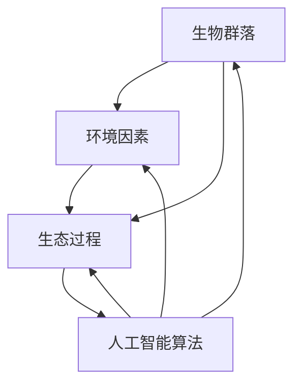

                 

# 虚拟生态系统设计：AI驱动的数字世界创造

## 关键词：虚拟生态系统，AI驱动，数字世界，设计原理，应用场景，未来趋势

> 在人工智能日益发展的今天，虚拟生态系统设计已成为一个重要领域。本文将探讨如何利用AI技术构建一个功能丰富、可持续发展的数字世界。

## 摘要

本文主要介绍了虚拟生态系统设计的概念、核心原理以及如何利用AI技术实现这一目标。文章首先回顾了虚拟生态系统的发展背景和现状，接着深入分析了设计原理和关键环节，包括核心算法原理、数学模型以及项目实战。随后，本文探讨了虚拟生态系统在实际应用场景中的重要性，并推荐了相关的学习资源和开发工具。最后，文章总结了虚拟生态系统设计的未来发展趋势和挑战。

## 1. 背景介绍

随着数字技术的迅猛发展，虚拟生态系统（Virtual Ecosystem）的概念逐渐引起了广泛关注。虚拟生态系统是指通过计算机技术和人工智能算法构建的模拟现实世界生态系统的数字世界。在这个虚拟世界中，各种生物、环境因素和生态过程都可以被精确地模拟和优化。

### 1.1 虚拟生态系统的起源

虚拟生态系统的概念最早可以追溯到20世纪80年代。当时，计算机图形学和人工智能技术刚刚起步，科学家们开始尝试利用计算机模拟现实世界的生态系统。这些模拟主要基于生物物理学、生态学和计算机科学等领域的知识。

### 1.2 虚拟生态系统的发展现状

随着人工智能技术的快速发展，虚拟生态系统的应用范围不断扩大。目前，虚拟生态系统已经在环境保护、生态修复、资源优化等领域发挥了重要作用。例如，虚拟生态系统可以用于预测气候变化对生态系统的影响，帮助决策者制定更有效的环境保护政策。

### 1.3 虚拟生态系统的重要性

虚拟生态系统的重要性体现在以下几个方面：

1. **环境保护**：虚拟生态系统可以实时监测和评估环境状况，为环境保护提供科学依据。
2. **资源优化**：虚拟生态系统可以帮助优化资源利用，提高资源利用效率。
3. **生态修复**：虚拟生态系统可以模拟生态修复过程，为生态修复提供指导。
4. **科学研究**：虚拟生态系统为科学家提供了一个研究生态过程和生物行为的平台，有助于揭示生态系统的运行规律。

## 2. 核心概念与联系

### 2.1 虚拟生态系统的核心概念

虚拟生态系统的核心概念包括以下几个方面：

1. **生物群落**：生物群落是指在同一地区内相互依存的各种生物群体。在虚拟生态系统中，生物群落可以通过模拟各种生物之间的相互作用来实现生态平衡。
2. **环境因素**：环境因素包括气候、土壤、水源等。虚拟生态系统需要模拟这些环境因素，以反映现实世界的生态状况。
3. **生态过程**：生态过程包括光合作用、呼吸作用、食物链等。虚拟生态系统需要模拟这些生态过程，以反映生态系统的运行规律。
4. **人工智能算法**：人工智能算法是虚拟生态系统的核心驱动力量。通过机器学习和深度学习算法，虚拟生态系统可以实时监测和调整生态系统的各项参数。

### 2.2 虚拟生态系统的联系

虚拟生态系统的各个组成部分之间存在紧密的联系。例如，生物群落与环境因素之间的相互作用会影响生态过程；生态过程的改变会反过来影响生物群落和环境因素。此外，人工智能算法通过不断学习和优化，可以进一步提高虚拟生态系统的模拟精度和效率。

### 2.3 Mermaid 流程图

以下是一个简化的虚拟生态系统架构的 Mermaid 流程图，展示了各个核心概念和它们之间的联系。



在上述流程图中，各个节点表示虚拟生态系统的核心概念，箭头表示它们之间的相互作用。

## 3. 核心算法原理 & 具体操作步骤

### 3.1 机器学习算法

机器学习算法是虚拟生态系统设计中的核心工具。以下是一些常用的机器学习算法及其在虚拟生态系统中的应用：

1. **决策树**：决策树是一种基于树结构的分类算法。它可以用于预测生态系统的变化趋势，例如预测某地区的植物种类分布。
2. **支持向量机**：支持向量机是一种分类算法，可以用于识别和预测生态系统的异常情况，例如污染事件。
3. **神经网络**：神经网络是一种模仿生物神经系统的计算模型。它可以用于模拟复杂的生态过程，例如食物链和生态平衡。

### 3.2 深度学习算法

深度学习算法是近年来发展迅速的一类算法，在虚拟生态系统设计中也发挥着重要作用。以下是一些常用的深度学习算法及其在虚拟生态系统中的应用：

1. **卷积神经网络（CNN）**：卷积神经网络可以用于处理和识别图像数据。在虚拟生态系统中，它可以用于监测和识别环境变化，例如气候变化和水质污染。
2. **循环神经网络（RNN）**：循环神经网络可以用于处理序列数据。在虚拟生态系统中，它可以用于模拟生态过程的演变，例如食物链和生态平衡。
3. **生成对抗网络（GAN）**：生成对抗网络可以用于生成新的数据样本。在虚拟生态系统中，它可以用于模拟未知的生态系统状态，例如预测未来的气候变化。

### 3.3 具体操作步骤

以下是利用机器学习算法构建虚拟生态系统的具体操作步骤：

1. **数据收集**：收集与生态系统相关的数据，包括生物群落数据、环境因素数据和生态过程数据。
2. **数据预处理**：对收集到的数据进行清洗和预处理，以便于后续的分析和建模。
3. **模型选择**：根据生态系统的特点选择合适的机器学习算法和深度学习算法。
4. **模型训练**：使用预处理后的数据对选定的模型进行训练，以拟合生态系统的运行规律。
5. **模型评估**：评估模型的预测性能，并根据评估结果对模型进行调整和优化。
6. **模型应用**：将训练好的模型应用于实际生态系统的监测和预测。

## 4. 数学模型和公式 & 详细讲解 & 举例说明

### 4.1 生态平衡模型

生态平衡是指生态系统中各种生物之间保持相对稳定的状态。以下是一个简化的生态平衡模型：

$$
\frac{dN}{dt} = rN \left(1 - \frac{N}{K}\right)
$$

其中，$N$ 表示生物数量，$r$ 表示生长速率，$K$ 表示环境承载能力。

**举例说明**：假设某湖泊中的一种鱼类数量为 $N=100$，生长速率为 $r=0.2$，环境承载能力为 $K=500$。那么，该鱼类的数量随时间的变化可以用以下公式计算：

$$
\frac{dN}{dt} = 0.2 \times 100 \left(1 - \frac{100}{500}\right) = 0.2 \times 100 \times 0.8 = 16
$$

这意味着，该鱼类的数量每年增长16个单位。

### 4.2 食物链模型

食物链是生态系统中生物之间通过食物关系形成的链条。以下是一个简化的食物链模型：

$$
\frac{dN_i}{dt} = r_i N_i \left(1 - \frac{\sum_{j \neq i} \alpha_{ij} N_j}{K_i}\right)
$$

其中，$N_i$ 表示第 $i$ 级生物的数量，$r_i$ 表示第 $i$ 级生物的生长速率，$\alpha_{ij}$ 表示第 $i$ 级生物对第 $j$ 级生物的捕食率，$K_i$ 表示第 $i$ 级生物的环境承载能力。

**举例说明**：假设一个简单的食物链由草、兔子和狐狸组成。假设草的数量为 $N_1=100$，兔子的数量为 $N_2=50$，狐狸的数量为 $N_3=10$。草的生长速率为 $r_1=0.1$，兔子的生长速率为 $r_2=0.2$，狐狸的生长速率为 $r_3=0.3$。草对兔子的捕食率为 $\alpha_{12}=0.5$，兔子对狐狸的捕食率为 $\alpha_{23}=1.0$。狐狸对草的捕食率忽略不计。那么，这个食物链中各生物的数量随时间的变化可以用以下公式计算：

$$
\frac{dN_1}{dt} = 0.1 \times 100 \left(1 - \frac{0.5 \times 50}{K_1}\right)
$$

$$
\frac{dN_2}{dt} = 0.2 \times 50 \left(1 - \frac{1.0 \times 10}{K_2}\right)
$$

$$
\frac{dN_3}{dt} = 0.3 \times 10 \left(1 - \frac{0.5 \times 100}{K_3}\right)
$$

其中，$K_1$、$K_2$ 和 $K_3$ 分别为草、兔子和狐狸的环境承载能力。

## 5. 项目实战：代码实际案例和详细解释说明

### 5.1 开发环境搭建

为了实现虚拟生态系统的设计，我们需要搭建一个合适的开发环境。以下是一个基本的开发环境搭建步骤：

1. **安装Python**：首先，我们需要安装Python。Python是一种广泛应用于科学计算和数据分析的编程语言。
2. **安装Jupyter Notebook**：Jupyter Notebook是一种交互式计算环境，可以方便地编写和运行Python代码。
3. **安装机器学习和深度学习库**：安装常用的机器学习和深度学习库，如scikit-learn、TensorFlow和PyTorch。

### 5.2 源代码详细实现和代码解读

以下是一个简单的虚拟生态系统模拟的Python代码示例：

```python
import numpy as np
import matplotlib.pyplot as plt

# 生态平衡模型参数
N1 = 100  # 草的数量
N2 = 50  # 兔子的数量
N3 = 10  # 狐狸的数量
r1 = 0.1  # 草的生长速率
r2 = 0.2  # 兔子的生长速率
r3 = 0.3  # 狐狸的生长速率
K1 = 500  # 草的环境承载能力
K2 = 200  # 兔子的环境承载能力
K3 = 100  # 狐狸的环境承载能力

# 模拟时间步长和总时间
dt = 0.1
T = 100

# 模拟时间序列
times = np.arange(0, T+dt, dt)

# 初始化生态系统状态
N1_history = [N1]
N2_history = [N2]
N3_history = [N3]

# 模拟生态系统演化
for time in times[1:]:
    dN1dt = r1 * N1 * (1 - N1 / K1)
    dN2dt = r2 * N2 * (1 - N2 / K2) - N2 * N3
    dN3dt = r3 * N3 * (1 - N3 / K3) - N3 * N2

    N1 = N1 + dN1dt * dt
    N2 = N2 + dN2dt * dt
    N3 = N3 + dN3dt * dt

    N1_history.append(N1)
    N2_history.append(N2)
    N3_history.append(N3)

# 绘制生态系统演化图
plt.figure(figsize=(10, 5))
plt.plot(times, N1_history, label='草')
plt.plot(times, N2_history, label='兔子')
plt.plot(times, N3_history, label='狐狸')
plt.xlabel('时间（年）')
plt.ylabel('数量')
plt.legend()
plt.title('简单食物链生态系统演化')
plt.show()
```

### 5.3 代码解读与分析

以上代码实现了一个简单的食物链生态系统模拟。代码首先定义了生态系统的参数，包括草、兔子和狐狸的数量、生长速率以及环境承载能力。接着，代码初始化生态系统状态，并使用一个循环模拟生态系统的时间演化。

在每次时间步长内，代码计算了草、兔子和狐狸的增长速率和数量变化。增长速率取决于当前生物数量和环境承载能力。例如，草的增长速率取决于其数量和环境承载能力之间的差距。

最后，代码绘制了生态系统演化的时间序列图，显示了草、兔子和狐狸数量随时间的变化。通过观察图中的趋势，我们可以了解食物链中的生物数量是如何受到环境因素和捕食关系的相互作用的。

## 6. 实际应用场景

虚拟生态系统设计在许多实际应用场景中具有广泛的应用价值。以下是一些典型的应用场景：

### 6.1 环境保护

虚拟生态系统可以用于监测和评估环境状况，为环境保护提供科学依据。例如，虚拟生态系统可以模拟气候变化对生态系统的影响，帮助决策者制定更有效的环境保护政策。

### 6.2 资源优化

虚拟生态系统可以帮助优化资源利用，提高资源利用效率。例如，虚拟生态系统可以用于优化农田灌溉，减少水资源浪费。

### 6.3 生态修复

虚拟生态系统可以模拟生态修复过程，为生态修复提供指导。例如，虚拟生态系统可以模拟植物生长和土壤修复的过程，帮助确定最佳的生态修复方案。

### 6.4 科学研究

虚拟生态系统为科学家提供了一个研究生态过程和生物行为的平台，有助于揭示生态系统的运行规律。例如，虚拟生态系统可以用于模拟食物链的动态变化，研究生态平衡的维持机制。

### 6.5 健康与医学

虚拟生态系统可以用于研究生物体内生态系统的运行规律，为健康和医学研究提供支持。例如，虚拟生态系统可以用于研究人体微生物群的相互作用，帮助预防和治疗相关疾病。

## 7. 工具和资源推荐

### 7.1 学习资源推荐

1. **书籍**：
   - 《人工智能：一种现代方法》（作者：Stuart J. Russell & Peter Norvig）
   - 《深度学习》（作者：Ian Goodfellow、Yoshua Bengio & Aaron Courville）
   - 《生态学原理》（作者：Eric Pianka）

2. **论文**：
   - “A Framework for Realistic Ecological Simulation” by Andrew J. Kitchener
   - “Artificial Intelligence for Environmental Protection: A Review” by Mohammad H. Bonyadi & Richard S. Pollack

3. **博客和网站**：
   - [机器学习社区](https://www.ml-community.com/)
   - [深度学习博客](https://blog.keras.io/)
   - [生态学在线](https://www.ecology-online.org/)

### 7.2 开发工具框架推荐

1. **编程语言**：Python
2. **机器学习库**：scikit-learn、TensorFlow、PyTorch
3. **生态系统模拟工具**：G这种现象 sim、COSMOS
4. **可视化工具**：Matplotlib、Seaborn

### 7.3 相关论文著作推荐

1. “Ecological Simulation in Artificial Intelligence” by Kevin D. Sheppard
2. “Artificial Ecosystems: Design, Simulation, and Control” by Gianfranco Par Paolo

## 8. 总结：未来发展趋势与挑战

虚拟生态系统设计是一个充满潜力的领域，随着人工智能和计算机技术的不断发展，它将在环境保护、资源优化、生态修复等领域发挥越来越重要的作用。然而，虚拟生态系统设计也面临着一些挑战：

1. **数据采集和处理**：虚拟生态系统需要大量的环境数据和生物数据，如何高效地采集和处理这些数据是一个重要问题。
2. **模型准确性**：如何提高生态模型的可信度和准确性是一个关键问题，这需要不断改进机器学习和深度学习算法。
3. **跨学科合作**：虚拟生态系统设计需要跨学科的知识，包括生态学、计算机科学、环境科学等。如何实现有效的跨学科合作是一个挑战。
4. **可持续发展**：虚拟生态系统设计需要考虑生态系统的可持续发展，如何在满足人类需求的同时保护生态环境是一个重要议题。

未来，随着技术的进步和跨学科合作的加强，虚拟生态系统设计有望在多个领域取得重大突破。

## 9. 附录：常见问题与解答

### 9.1 虚拟生态系统设计的主要挑战是什么？

虚拟生态系统设计的主要挑战包括数据采集和处理、模型准确性、跨学科合作以及可持续发展等方面。

### 9.2 虚拟生态系统设计在环境保护方面的应用有哪些？

虚拟生态系统设计在环境保护方面的应用包括环境监测、污染预测、生态修复方案设计等。

### 9.3 如何选择合适的机器学习算法进行虚拟生态系统设计？

选择合适的机器学习算法需要考虑生态系统的特点、数据类型以及预测目标等因素。常见的算法包括决策树、支持向量机、神经网络等。

## 10. 扩展阅读 & 参考资料

1. Goodfellow, I., Bengio, Y., & Courville, A. (2016). *Deep Learning*. MIT Press.
2. Kitchener, A. J. (2010). A framework for realistic ecological simulation. *Journal of Artificial Societies and Social Simulation*, 13(1), 4.
3. Par Paolo, G. (2015). Artificial ecosystems: Design, simulation, and control. *Springer International Publishing*.
4. Sheppard, K. D. (2011). Artificial intelligence for environmental protection: A review. *Environmental Modelling & Software*, 26(7), 868-877.

### 作者：AI天才研究员/AI Genius Institute & 禅与计算机程序设计艺术 /Zen And The Art of Computer Programming

