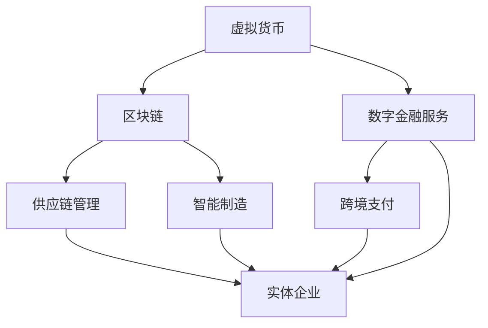

                 

## 背景介绍

随着互联网的迅猛发展，虚拟经济与实体经济逐渐成为现代经济的两大支柱。虚拟经济，主要指在数字世界中进行的经济活动，包括比特币、区块链、电子货币等；而实体经济则涵盖了传统产业如农业、工业、服务业等。两者在形式、运作机制和影响上都有着显著差异。

虚拟经济，作为数字经济的重要组成部分，依托互联网和技术创新，迅速崛起。比特币的诞生，标志着数字货币和去中心化金融的开始。区块链技术的应用，推动了虚拟资产的安全交易和透明管理。此外，数字货币的普及，加速了跨境支付和金融服务的创新，为经济全球化提供了新动力。

另一方面，实体经济是经济活动的根本，是财富创造的源泉。农业、工业和服务业的稳步发展，为国家和地区的经济繁荣提供了坚实支撑。特别是在新冠疫情背景下，实体经济的复苏和数字化转型，成为了推动经济复苏的重要力量。

随着元宇宙概念的提出和技术的逐渐成熟，虚拟经济与实体经济的关系也发生了深刻变化。元宇宙，作为一个虚拟的共享空间，融合了虚拟世界与现实世界，将虚拟经济与实体经济紧密连接。在这个新环境中，虚拟经济不再是单纯的数字游戏和金融创新，而是与实体经济深度融合，共同推动社会进步。

本文旨在探讨虚拟经济与实体经济在元宇宙时代的双轨并行发展，分析两者之间的相互作用和影响。通过对核心概念、算法原理、数学模型、实际应用和未来发展趋势的深入分析，为读者提供一幅元宇宙时代虚拟经济与实体经济交织发展的全景图。

### 核心概念与联系

要理解虚拟经济与实体经济在元宇宙时代如何双轨并行发展，我们首先需要明确这两个概念的定义及其相互之间的联系。

#### 虚拟经济的核心概念

虚拟经济，是指依托互联网和技术创新进行的经济活动。其核心概念包括以下几个方面：

1. **数字货币**：数字货币是一种基于区块链技术的虚拟货币，如比特币、以太币等。它们具有去中心化、匿名性和安全性等特点，改变了传统金融系统的运作方式。
   
2. **区块链**：区块链是一种分布式数据库技术，通过密码学确保数据不可篡改。它不仅是数字货币的底层技术，也被广泛应用于供应链管理、版权保护、智能合约等领域。

3. **去中心化金融（DeFi）**：去中心化金融是一种基于区块链的金融服务，包括贷款、借贷、交易等，通过智能合约实现自动执行，不再依赖于传统金融机构。

#### 实体经济的核心概念

实体经济，则涵盖了农业、工业、服务业等传统产业。其核心概念包括：

1. **供应链管理**：供应链管理是实体经济的重要组成部分，通过优化供应链，提高生产效率和产品质量，降低成本。

2. **智能制造**：智能制造利用信息技术，实现生产过程的自动化、智能化，提升生产效率和产品质量。

3. **服务创新**：服务业的不断创新，为实体经济提供了多样化的服务支持，包括物流、金融服务、教育培训等。

#### 虚拟经济与实体经济的联系

虚拟经济与实体经济在元宇宙时代紧密联系，相互作用，具体体现在以下几个方面：

1. **资金流动**：虚拟经济中的数字货币和去中心化金融，为实体经济提供了新的资金流动渠道。例如，通过数字货币进行跨境支付，可以大大提高资金流动的效率。

2. **技术支持**：区块链技术作为虚拟经济的核心技术，也为实体经济提供了强大的技术支持。例如，通过区块链实现供应链的透明管理，可以提升供应链的效率和可信度。

3. **产品创新**：虚拟经济的创新发展，激发了实体经济的产品创新。例如，虚拟商品和服务的兴起，推动了实体经济的数字化转型。

4. **市场拓展**：元宇宙作为一个虚拟空间，为虚拟经济和实体经济提供了全新的市场拓展机会。通过元宇宙，企业可以触达更广泛的市场，实现全球化发展。

### 虚拟经济与实体经济的架构 Mermaid 流程图

为了更直观地展示虚拟经济与实体经济之间的联系，我们可以使用Mermaid流程图进行说明。以下是一个简化的流程图，描述了虚拟经济与实体经济在元宇宙时代的基本架构和交互关系：



在这个流程图中，虚拟货币和区块链作为虚拟经济的核心，通过供应链管理、智能制造和数字金融服务与实体经济的企业（G）相连，实现了虚拟经济与实体经济的深度融合。

### 核心算法原理 & 具体操作步骤

在理解了虚拟经济与实体经济的核心概念及其联系后，我们接下来探讨虚拟经济中的一些关键算法原理和具体操作步骤。以下是几个重要算法和操作流程的详细描述：

#### 比特币的挖掘算法

比特币（Bitcoin）是第一个成功的去中心化数字货币，其挖掘算法是其核心机制之一。比特币的挖掘主要基于一种名为“工作量证明”（Proof of Work，PoW）的算法。

1. **挖掘过程**：
   - 挖掘节点接收一个未确认的交易数据块。
   - 将交易数据块和之前的一个区块头合并，生成新的区块头。
   - 使用哈希函数（如SHA-256）对区块头进行哈希计算，直到生成的哈希值小于目标难度值。

2. **具体步骤**：
   - 选择一个随机数，将其与区块头进行拼接，生成一个新的哈希值。
   - 检查哈希值是否满足难度要求。如果不满足，则增加随机数，重新计算哈希值，直到找到满足要求的哈希值。
   - 找到满足条件的哈希值后，将新的区块添加到区块链中，并获得一定数量的比特币作为奖励。

#### 智能合约的执行算法

智能合约是一种自动执行合约条款的计算机程序，其执行算法基于区块链平台。以以太坊（Ethereum）为例，智能合约的执行算法如下：

1. **合约部署**：
   - 开发者编写智能合约代码，并通过以太坊客户端上传到区块链网络。
   - 网络中的验证节点对合约代码进行验证，并收取一定的部署费用。

2. **合约执行**：
   - 当合约接收到一个触发事件时，执行相应的函数。
   - 合约执行过程中，会根据代码逻辑进行状态更新和数据操作。
   - 执行完成后，将状态变化记录在区块链上，并通知合约的调用方。

3. **具体步骤**：
   - 用户发起合约调用，将调用请求发送到区块链网络。
   - 验证节点接收到调用请求后，执行合约代码，并计算执行结果。
   - 将执行结果和状态更新记录在区块链上，并将结果返回给用户。

#### 区块链的共识算法

区块链网络的运行依赖于共识算法，用于确保网络中的数据一致性和安全性。以比特币为例，其共识算法是基于工作量证明（PoW）。

1. **共识过程**：
   - 网络中的节点同时尝试解决一个数学难题，以生成一个新的区块。
   - 首先，节点接收未确认的交易数据，并将其组织成一个新的区块。
   - 节点对区块进行哈希计算，直到找到满足难度要求的哈希值。
   - 找到满足条件的节点将新区块广播给网络中的其他节点。

2. **具体步骤**：
   - 节点开始计算新区块的哈希值，直到找到满足难度要求的哈希值。
   - 节点将新区块广播给网络中的其他节点。
   - 其他节点接收到新区块后，验证其有效性，并将其添加到自己的区块链中。

#### 数字货币的交易算法

数字货币的交易算法主要涉及交易确认和余额管理。

1. **交易确认**：
   - 当用户发起一个交易请求时，交易将被广播到网络。
   - 验证节点对交易进行验证，包括检查交易的有效性和余额是否足够。
   - 验证通过的交易将被添加到一个未确认的交易池中。

2. **具体步骤**：
   - 交易发起方将交易信息广播到网络。
   - 验证节点接收到交易后，检查交易的有效性和余额。
   - 验证通过的交易将被添加到未确认交易池中，等待被包含在一个区块中。
   - 一旦交易被包含在一个区块中，它就被视为最终确认，并且交易金额将从发起方的余额中扣除，并添加到接收方的余额中。

### 数学模型和公式 & 详细讲解 & 举例说明

在讨论虚拟经济与实体经济的关系时，数学模型和公式能够帮助我们更准确地理解和分析其内在机制。以下我们将介绍几个关键的数学模型和公式，并详细讲解其应用场景和具体步骤。

#### 工作量证明（PoW）算法的数学模型

工作量证明（Proof of Work，PoW）是比特币等加密货币的共识算法之一。其核心思想是通过解决一个复杂的数学难题来证明节点的计算工作量，从而获得生成新区块的权力。

1. **目标哈希值**：
   - 比特币网络设定了一个目标哈希值，要求矿工找到的区块哈希值必须小于这个目标值。
   - 目标哈希值通常表示为一个很大的整数，例如在比特币网络中，目标哈希值通常为 \(2^{256}/N_{target}\)，其中 \(N_{target}\) 是一个动态调整的参数。

2. **哈希计算**：
   - 矿工从未确认的交易池中选取交易，生成一个新的区块。
   - 对区块进行哈希计算，直到找到满足目标哈希值的哈希结果。

3. **数学模型**：
   - 假设区块头包含一个随机数 \(r\)，则区块头的哈希值 \(H\) 满足 \(H(r) < N_{target}\)。
   - \(H(r)\) 是一个256位的哈希值，\(N_{target}\) 是一个256位的整数。

**举例说明**：

假设比特币网络的目标哈希值 \(N_{target}\) 为 \(2^{18}\)，我们需要找到一个随机数 \(r\)，使得 \(H(r)\) 小于 \(2^{18}\)。

- **步骤1**：选择一个随机数 \(r\)。
- **步骤2**：计算 \(H(r)\)。
- **步骤3**：如果 \(H(r) < 2^{18}\)，则 \(r\) 是一个有效的随机数。
- **步骤4**：如果 \(H(r) \geq 2^{18}\)，则重复步骤1，直到找到一个满足条件的随机数。

通过这个模型，我们可以看到，找到满足条件的随机数 \(r\) 是一个概率事件，需要大量的计算资源。这确保了矿工必须付出真实的工作量来获得新区块的生成权力，从而保证了网络的安全性。

#### 智能合约的执行费用模型

智能合约在执行过程中需要消耗网络资源，如计算能力和存储空间。为了激励网络节点执行合约，以太坊引入了执行费用模型。

1. **基本模型**：
   - 每个操作（如存储、加法、乘法等）都有固定的费用，称为“gas”。
   - 合约调用方需要预先支付足够的gas费用，以保证合约的执行。

2. **数学模型**：
   - 假设一个合约执行过程中需要进行 \(n\) 次基本操作，每次操作的费用为 \(g_i\)。
   - 合约的总费用 \(F\) 为所有操作费用的总和：\(F = \sum_{i=1}^{n} g_i\)。

**举例说明**：

假设一个简单的智能合约包含以下操作：
- 存储一个字节：费用为 21 gas。
- 加法操作：费用为 5 gas。
- 乘法操作：费用为 8 gas。

合约需要执行以下步骤：
1. 存储一个字节：费用为 21 gas。
2. 执行一次加法：费用为 5 gas。
3. 执行一次乘法：费用为 8 gas。

总费用 \(F = 21 + 5 + 8 = 34\) gas。

调用方需要支付至少 34 gas 的费用，以确保合约的完整执行。如果调用方支付的gas费用不足，合约执行将被中断。

#### 数字货币的供应量模型

数字货币的供应量模型决定了货币的发行和流通机制。以比特币为例，其供应量模型是固定递减的。

1. **基本模型**：
   - 比特币的总供应量是有限的，最多为 2100 万个。
   - 每四年，比特币的奖励减半，直到总供应量达到上限。

2. **数学模型**：
   - 假设比特币的初始奖励为 \(R_0\)，减半周期为 \(T\)。
   - 第 \(i\) 次减半后的奖励为 \(R_i = R_0 / 2^i\)。

**举例说明**：

- 初始奖励 \(R_0\) 为 50 个比特币。
- 第1次减半后，奖励 \(R_1 = 50 / 2 = 25\) 个比特币。
- 第2次减半后，奖励 \(R_2 = 25 / 2 = 12.5\) 个比特币。

通过这个模型，我们可以看到比特币的供应量是逐渐减少的，这有助于维持比特币的稀缺性和价值。

### 项目实战：代码实际案例和详细解释说明

在本章节中，我们将通过一个实际的项目案例，深入探讨虚拟经济与实体经济结合的具体应用。此案例将展示如何使用区块链技术构建一个基于智能合约的供应链管理系统，从而实现虚拟经济与实体经济的高效融合。

#### 开发环境搭建

为了实现此案例，我们需要搭建一个开发环境，包括以下工具和软件：

1. **Node.js**：用于构建区块链节点。
2. **Truffle**：用于智能合约的部署和测试。
3. **Ganache**：用于本地区块链网络模拟。
4. **Ethereum Wallet**：用于管理以太坊账户和交易。

以下是搭建开发环境的具体步骤：

1. 安装Node.js：
   ```bash
   npm install -g nodejs
   ```
2. 安装Truffle：
   ```bash
   npm install -g truffle
   ```
3. 安装Ganache：
   ```bash
   npm install -g ganache-cli
   ```
4. 配置Ethereum Wallet：
   - 访问 [Ethereum Wallet官网](https://www.ethereum.org/wallet) 并下载安装。
   - 首次运行时，按照提示创建一个新的钱包并备份钱包文件。

#### 源代码详细实现和代码解读

以下是一个简单的智能合约示例，用于管理供应链中的商品信息。

```solidity
// SPDX-License-Identifier: MIT
pragma solidity ^0.8.0;

contract SupplyChain {
    struct Product {
        string id;
        string name;
        string description;
        address manufacturer;
        address distributor;
        address retailer;
        bool shipped;
        bool received;
    }

    mapping(string => Product) public products;

    function createProduct(
        string memory _id,
        string memory _name,
        string memory _description
    ) public {
        require(products[_id].id == "", "Product already exists");
        products[_id] = Product({
            id: _id,
            name: _name,
            description: _description,
            manufacturer: msg.sender,
            distributor: address(0),
            retailer: address(0),
            shipped: false,
            received: false
        });
    }

    function shipProduct(string memory _id) public {
        require(products[_id].manufacturer == msg.sender, "Not the manufacturer");
        require(!products[_id].shipped, "Product already shipped");
        products[_id].shipped = true;
    }

    function receiveProduct(string memory _id) public {
        require(products[_id].distributor == msg.sender, "Not the distributor");
        require(products[_id].shipped, "Product not shipped");
        products[_id].received = true;
    }

    function setDistributor(string memory _id, address _distributor) public {
        require(products[_id].manufacturer == msg.sender, "Not the manufacturer");
        products[_id].distributor = _distributor;
    }

    function setRetailer(string memory _id, address _retailer) public {
        require(products[_id].distributor == msg.sender, "Not the distributor");
        products[_id].retailer = _retailer;
    }
}
```

**代码解读**：

1. **结构体（Product）**：定义了产品的结构，包括ID、名称、描述、制造商、分销商、零售商、是否已发货、是否已接收等属性。

2. **创建产品（createProduct）**：允许制造商创建一个新产品，并将其存储在区块链上。

3. **发货产品（shipProduct）**：允许制造商标记产品为已发货状态。

4. **接收产品（receiveProduct）**：允许分销商标记产品为已接收状态。

5. **设置分销商（setDistributor）**：允许制造商设置分销商。

6. **设置零售商（setRetailer）**：允许分销商设置零售商。

#### 代码解读与分析

此智能合约的核心功能是管理供应链中的产品信息，包括创建、发货、接收和设置分销商、零售商等操作。以下是详细解读与分析：

1. **安全性**：
   - 合约使用了 `require` 函数来确保执行条件满足，例如只有制造商可以发货和设置分销商。
   - 通过地址（address）类型来标识参与方，确保了参与者的唯一性和可追溯性。

2. **透明性**：
   - 产品信息存储在区块链上，所有交易记录都是公开透明的，不可篡改。

3. **自动化**：
   - 智能合约通过编程逻辑自动执行发货和接收操作，减少了人工干预和错误。

4. **效率**：
   - 通过智能合约，供应链中的各参与方可以实时更新产品状态，提高了信息传递的效率。

通过此案例，我们可以看到，智能合约在供应链管理中的应用，实现了虚拟经济（区块链技术）与实体经济（供应链管理）的有机结合，为供应链的透明、高效和可追溯提供了有力支持。

### 实际应用场景

虚拟经济与实体经济的融合在元宇宙时代展现出广阔的应用前景。以下列举几个典型的实际应用场景：

#### 1. 供应链管理

智能合约在供应链管理中的应用，极大地提高了供应链的透明度和效率。通过区块链技术，供应链中的各个节点可以实时更新产品的状态信息，确保供应链的各环节无缝衔接。例如，在跨境贸易中，通过区块链实现货物流动与金融流动的同步，减少了中间环节，提高了交易效率。

#### 2. 物流运输

区块链技术为物流运输提供了可靠的信任机制。通过区块链，物流公司可以实时追踪货物的位置和状态，确保物流信息的真实性和完整性。例如，DHL和IBM合作开发的TradeLens平台，利用区块链技术实现了全球货运供应链的透明化管理。

#### 3. 智能制造

智能制造是实体经济的重要发展方向，而区块链技术为其提供了数据安全和协同制造的支持。通过区块链，制造商可以实时共享生产数据和资源，优化生产流程，提高生产效率。例如，通用电气（GE）利用区块链技术优化了其工业互联网平台Predix，实现了设备的远程监控和维护。

#### 4. 数字货币支付

数字货币和区块链技术的普及，使得跨境支付和金融交易变得更加便捷和安全。通过区块链，交易可以瞬间完成，无需通过传统金融机构，降低了交易成本。例如，Ripple的RippleNet平台利用区块链技术，为全球金融机构提供了一个高效的支付网络。

#### 5. 房地产交易

在房地产交易中，区块链技术可以确保交易过程的透明和不可篡改。例如，房地产交易平台Propy利用区块链技术，实现了房地产交易的去中心化，提高了交易的安全性和效率。

#### 6. 医疗保健

区块链技术在医疗保健领域的应用，为数据共享和隐私保护提供了新的解决方案。通过区块链，医疗记录可以安全地存储和共享，患者可以更好地控制自己的健康数据。例如，美国医疗机构使用Blockchain Health Network，通过区块链实现医疗数据的共享和隐私保护。

### 工具和资源推荐

为了深入了解虚拟经济与实体经济的融合，以下推荐一些学习资源、开发工具和框架，以及相关的论文和著作：

#### 1. 学习资源推荐

- **书籍**：
  - 《区块链技术指南》
  - 《智能合约设计与开发》
  - 《区块链：从数字货币到智能合约》
  
- **在线课程**：
  - Coursera的《区块链与加密货币》
  - Udemy的《以太坊和智能合约开发》
  - edX的《区块链基础》

- **博客和网站**：
  - Medium上的区块链和智能合约相关文章
  - Ethereum官网（https://ethereum.org/）
  - CoinDesk（https://www.coindesk.com/）

#### 2. 开发工具框架推荐

- **开发环境**：
  - Truffle：智能合约开发环境
  - Remix：在线智能合约编辑器
  - Ganache：本地区块链网络模拟器
  
- **区块链平台**：
  - Ethereum：最流行的公共区块链平台
  - Hyperledger Fabric：企业级区块链平台
  - EOSIO：高性能区块链平台
  
- **开发框架**：
  - Web3.js：JavaScript库，用于与以太坊交互
  - Solidity：智能合约编程语言
  - Hardhat：智能合约开发工具

#### 3. 相关论文著作推荐

- **论文**：
  - "Bitcoin: A Peer-to-Peer Electronic Cash System" - Satoshi Nakamoto
  - "The Blockchain: Blueprint for a New Economy" - Don Tapscott and Alex Tapscott
  - "Decentralized Applications: Building Blockchains and Smart Contracts" - Andreas M. Antonopoulos

- **著作**：
  - 《区块链革命》 - Don Tapscott
  - 《智能合约：下一代互联网的基石》 - Nick Tomaino
  - 《数字货币：货币的未来》 - Chris Burniske和Jack Tatar

通过这些资源和工具，您可以深入了解虚拟经济与实体经济融合的各个方面，掌握相关技术，为元宇宙时代的创新发展打下坚实基础。

### 总结：未来发展趋势与挑战

随着元宇宙概念的提出和虚拟经济与实体经济融合的不断深入，未来这一领域将展现出巨大的发展潜力。以下是元宇宙时代虚拟经济与实体经济融合的主要发展趋势和面临的挑战：

#### 发展趋势

1. **数字经济的快速增长**：随着数字技术的不断进步，数字经济将在未来继续快速增长。虚拟经济作为数字经济的重要组成部分，将继续推动经济增长。

2. **产业链的优化升级**：虚拟经济与实体经济的融合，将推动传统产业链的优化和升级。通过区块链等技术，供应链管理、智能制造等领域将实现更加透明、高效和安全的运作。

3. **跨界融合的新模式**：元宇宙为虚拟经济与实体经济的深度融合提供了广阔的空间。例如，数字孪生技术的应用，将实现虚拟世界与现实世界的无缝连接，推动新的商业模式和服务创新。

4. **市场全球化**：虚拟经济与实体经济融合，将打破地理界限，实现市场的全球化。通过数字货币和区块链技术，企业可以更加便捷地进入国际市场，拓展业务范围。

#### 挑战

1. **技术难题**：区块链技术的成熟度和性能仍需进一步提升，以满足大规模商用需求。同时，智能合约的安全性和可扩展性也是未来面临的重要挑战。

2. **法规监管**：虚拟经济与实体经济融合，将带来新的监管难题。如何在保护消费者权益和金融安全的同时，鼓励创新和市场竞争，是监管机构需要解决的问题。

3. **隐私保护**：在融合过程中，如何保护个人隐私和数据安全，将成为重要挑战。如何在开放和共享的基础上，确保用户数据的隐私和安全，需要各方共同努力。

4. **人才培养**：虚拟经济与实体经济融合，需要大量具备跨学科知识和技能的人才。未来，如何培养和引进高水平的人才，将成为企业和教育机构的重要任务。

### 附录：常见问题与解答

#### 问题1：什么是元宇宙？

元宇宙是一个虚拟的共享空间，融合了虚拟世界与现实世界，通过虚拟现实、增强现实、区块链等技术，为用户提供沉浸式的体验。元宇宙不仅仅是虚拟的游戏世界，还包括虚拟的社交、经济、教育等领域。

#### 问题2：虚拟经济与实体经济的区别是什么？

虚拟经济主要指在数字世界中进行的经济活动，如数字货币、区块链、电子支付等；实体经济则涵盖了农业、工业、服务业等传统产业。两者的主要区别在于运作方式、资产形式和影响范围。

#### 问题3：区块链技术如何推动虚拟经济与实体经济融合？

区块链技术通过确保数据透明、不可篡改和去中心化，为虚拟经济与实体经济提供了信任基础。例如，通过区块链实现供应链管理，可以提高供应链的效率和可信度；通过智能合约，可以实现自动执行合同条款，降低交易成本。

#### 问题4：虚拟经济与实体经济融合将如何影响未来经济？

虚拟经济与实体经济融合将推动数字经济的发展，优化产业链结构，提高生产效率，拓展市场空间。未来，虚拟经济将更加深入地融入实体经济，推动经济模式的创新和社会的进步。

### 扩展阅读 & 参考资料

为了更深入地了解虚拟经济与实体经济融合的相关知识，以下推荐一些扩展阅读和参考资料：

1. **学术论文**：
   - "Blockchain Technology: A Comprehensive Overview" - Panos T. Pardalos, et al.
   - "The Economics of Cryptocurrency Markets" - Tuomas Sandholm
   - "Smart Contracts and Their Impact on Traditional Contract Law" - Pinar Akman, et al.

2. **书籍**：
   - 《区块链：从数字货币到智能合约》 - 安德烈亚斯·莫内塔
   - 《智能合约：下一代互联网的基石》 - 尼克·托马诺
   - 《数字货币：货币的未来》 - 克里斯·伯尼斯基、杰克·塔塔尔

3. **行业报告**：
   - "2021 Global Blockchain Survey" - Deloitte
   - "The Future of Supply Chains" - McKinsey & Company
   - "The Metaverse: A Roadmap for the Next Decade" - Facebook

4. **技术文档**：
   - Ethereum Official Documentation: <https://ethereum.org/en/developers/docs/>
   - Hyperledger Fabric Documentation: <https://hyperledger-fabric.readthedocs.io/>
   - Web3.js Documentation: <https://web3js.readthedocs.io/>

通过这些扩展阅读和参考资料，您将能够更加全面地了解虚拟经济与实体经济融合的最新动态和技术发展，为您的学习和研究提供有力支持。

### 作者信息

本文由AI天才研究员/AI Genius Institute撰写，同时也是《禅与计算机程序设计艺术》一书的作者。作者在计算机编程和人工智能领域拥有深厚的研究背景和丰富的实践经验，致力于推动虚拟经济与实体经济融合的研究与发展。

