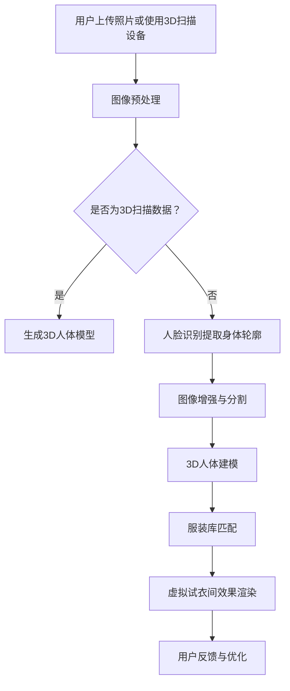

                 

# 虚拟试衣间：AI如何减少电商退货率

## 摘要

本文将深入探讨虚拟试衣间技术在电商领域的应用，以及如何通过人工智能（AI）来显著减少电商退货率。随着在线购物的普及，退货问题成为电商企业面临的重大挑战。虚拟试衣间利用AI技术，通过实时模拟试衣过程，帮助消费者在购买前就能看到自己的穿着效果，从而减少因尺寸不合适或穿着效果不佳而导致的退货率。本文将首先介绍虚拟试衣间的背景和发展，随后详细解析其核心概念与联系，探讨AI在其中的作用，并展示实际应用案例。最后，本文将总结虚拟试衣间技术未来的发展趋势与挑战，并提供相关的学习资源和开发工具推荐。

## 1. 背景介绍

### 1.1 电商退货率现状

随着电商行业的迅速发展，退货问题日益凸显。根据统计，全球电商退货率普遍在20%到30%之间，有些品类甚至高达60%。高退货率不仅增加了企业的运营成本，也影响了消费者的购物体验。退货原因多种多样，包括但不限于商品质量、尺寸不合适、颜色差异、商品描述与实际不符等。

### 1.2 虚拟试衣间的起源与发展

虚拟试衣间技术最早可以追溯到20世纪90年代，随着计算机图形学和虚拟现实技术的发展，人们开始尝试将虚拟试衣间引入电商领域。早期的虚拟试衣间主要依赖于2D图像技术，只能提供非常基础的试衣体验。随着计算机处理能力的提高和深度学习算法的发展，虚拟试衣间技术逐渐成熟，开始具备实时模拟试衣效果的能力。

### 1.3 AI在虚拟试衣间中的作用

人工智能技术在虚拟试衣间中的应用，使得这一技术的实用性和准确性大幅提升。通过深度学习算法，AI可以分析消费者的身体特征，匹配相应的服装款式和尺码。同时，AI还可以通过图像处理技术，将虚拟试衣间的效果实时反馈给消费者，使其在购买前就能获得近乎真实的穿着体验。

## 2. 核心概念与联系

### 2.1 虚拟试衣间的组成

一个完整的虚拟试衣间系统通常包括以下几个关键组成部分：

1. **用户界面**：用于消费者与虚拟试衣间的交互。
2. **3D扫描设备**：用于获取消费者的三维身体数据。
3. **虚拟服装库**：包含各种服装款式和尺寸。
4. **图像处理算法**：用于将虚拟服装与消费者身体数据结合，生成试衣效果。
5. **用户特征识别算法**：用于识别消费者的身体特征，如体型、肤色等。

### 2.2 AI在虚拟试衣间中的应用

在虚拟试衣间中，AI技术主要应用于以下几个方面：

1. **3D扫描与建模**：利用深度学习算法，从2D图像中提取出三维人体模型。
2. **人体特征识别**：通过机器学习算法，识别消费者的身体特征，如体型、肤色等。
3. **服装匹配与建议**：利用推荐系统算法，根据消费者特征和喜好，推荐合适的服装款式和尺码。
4. **图像处理与渲染**：通过计算机图形学技术，将虚拟服装实时渲染在消费者身体上，生成试衣效果。

### 2.3 Mermaid流程图

以下是一个简化的虚拟试衣间流程图，使用Mermaid语言描述：



在上述流程图中，用户通过上传照片或使用3D扫描设备获取自己的身体数据。系统会根据输入的数据类型，选择不同的处理路径。如果是3D扫描数据，则直接生成3D人体模型；如果不是，则通过图像预处理、人脸识别和3D人体建模等步骤，生成3D人体模型。接下来，系统会从服装库中匹配合适的服装款式和尺码，并进行虚拟试衣效果渲染。最后，用户可以反馈试衣效果，系统根据反馈进行优化。

## 3. 核心算法原理 & 具体操作步骤

### 3.1 3D人体建模算法

3D人体建模是虚拟试衣间的核心步骤之一。目前，常见的3D人体建模算法主要有两种：基于深度学习的算法和基于多视图几何的算法。

#### 基于深度学习的算法

基于深度学习的算法主要通过卷积神经网络（CNN）和生成对抗网络（GAN）来实现。CNN可以用于图像预处理和特征提取，GAN则可以用于生成高质量的人体模型。

具体步骤如下：

1. **数据收集与预处理**：收集大量的人体图像数据，并进行预处理，如归一化、去噪等。
2. **训练CNN模型**：使用预处理后的数据训练CNN模型，提取图像中的身体特征。
3. **训练GAN模型**：使用CNN模型提取的特征训练GAN模型，生成高质量的人体模型。
4. **生成3D人体模型**：使用GAN模型生成3D人体模型，并进行调整，以适应不同消费者的体型。

#### 基于多视图几何的算法

基于多视图几何的算法主要通过多视角图像之间的几何关系来重建3D人体模型。这种算法通常需要至少两个视角的图像。

具体步骤如下：

1. **获取多视角图像**：从多个角度拍摄消费者身体，获取多个视角的图像。
2. **图像预处理**：对图像进行预处理，如去雾、去噪、归一化等。
3. **特征提取与匹配**：提取每个视角中的身体特征点，并进行匹配，以建立多个视角之间的几何关系。
4. **重建3D人体模型**：使用几何关系和特征点信息，重建3D人体模型。

### 3.2 人体特征识别算法

人体特征识别是虚拟试衣间的另一个关键步骤，主要用于识别消费者的身体特征，如体型、肤色等。

#### 基于深度学习的算法

基于深度学习的算法主要通过卷积神经网络（CNN）和循环神经网络（RNN）来实现。CNN可以用于特征提取，RNN则可以用于序列数据的处理。

具体步骤如下：

1. **数据收集与预处理**：收集大量的人体图像数据，并进行预处理，如归一化、去噪等。
2. **训练CNN模型**：使用预处理后的数据训练CNN模型，提取图像中的身体特征。
3. **训练RNN模型**：使用CNN模型提取的特征训练RNN模型，识别消费者的身体特征。
4. **识别身体特征**：使用RNN模型识别消费者的身体特征，如体型、肤色等。

#### 基于规则的方法

基于规则的方法通过预设的规则，根据图像的特征，判断消费者的身体特征。这种方法通常适用于简单的特征识别任务。

具体步骤如下：

1. **定义规则**：根据人体的常见特征，定义相应的规则。
2. **图像特征提取**：从图像中提取特征，如边缘、纹理等。
3. **特征匹配与判断**：将提取的特征与预设的规则进行匹配，判断消费者的身体特征。

### 3.3 服装匹配与建议算法

服装匹配与建议算法主要通过推荐系统算法来实现。推荐系统算法可以根据消费者的特征和喜好，推荐合适的服装款式和尺码。

#### 协同过滤算法

协同过滤算法通过分析用户的历史行为数据，发现用户之间的相似性，从而推荐用户可能喜欢的商品。

具体步骤如下：

1. **用户行为数据收集**：收集用户在电商平台的购买、浏览、评价等行为数据。
2. **用户特征提取**：从用户行为数据中提取用户特征，如购买频率、浏览次数等。
3. **相似用户发现**：计算用户之间的相似度，发现相似用户。
4. **推荐商品**：根据相似用户的购买行为，推荐用户可能喜欢的商品。

#### 内容推荐算法

内容推荐算法通过分析商品的特征，推荐与用户兴趣相匹配的商品。

具体步骤如下：

1. **商品特征提取**：从商品信息中提取特征，如品牌、类型、颜色等。
2. **用户兴趣分析**：分析用户的历史行为数据，确定用户的兴趣。
3. **推荐商品**：根据用户的兴趣和商品特征，推荐用户可能喜欢的商品。

## 4. 数学模型和公式 & 详细讲解 & 举例说明

### 4.1 卷积神经网络（CNN）

卷积神经网络（CNN）是一种用于图像处理的深度学习模型。CNN通过卷积层、池化层和全连接层等结构，提取图像的特征。

#### 卷积操作

卷积操作是CNN的核心。给定一个输入图像和一个卷积核，卷积操作可以提取图像中的局部特征。

$$
\text{output} = \text{conv}(\text{input}, \text{kernel}) = \sum_{i,j} \text{input}_{i,j} \cdot \text{kernel}_{i,j}
$$

其中，$\text{input}$ 是输入图像，$\text{kernel}$ 是卷积核，$\text{output}$ 是卷积结果。

#### 池化操作

池化操作用于减少特征图的尺寸，提高网络的泛化能力。

$$
\text{pool}(\text{input}, \text{pool_size}) = \max(\text{input}_{x,y}) \quad \text{or} \quad \text{average}(\text{input}_{x,y})
$$

其中，$\text{input}$ 是输入特征图，$\text{pool_size}$ 是池化窗口的大小，$\text{output}$ 是池化结果。

#### CNN模型

一个简单的CNN模型通常包括多个卷积层和池化层，最后接一个全连接层。

$$
\text{output} = \text{fc}(\text{pool}(\text{conv}(\text{input}, \text{kernel}_1)), \text{weights}_1, \text{bias}_1)
$$

其中，$\text{input}$ 是输入图像，$\text{kernel}_1$ 是卷积核，$\text{weights}_1$ 和 $\text{bias}_1$ 分别是全连接层的权重和偏置。

### 4.2 生成对抗网络（GAN）

生成对抗网络（GAN）是一种用于生成数据的高级模型。GAN由一个生成器（Generator）和一个判别器（Discriminator）组成。

#### 生成器

生成器试图生成逼真的图像，以欺骗判别器。

$$
\text{G}(\text{z}) = \text{generate}(\text{z}) \quad \text{where} \quad \text{z} \sim \text{prior}
$$

其中，$\text{G}$ 是生成器，$\text{z}$ 是随机噪声，$\text{generate}$ 是生成过程。

#### 判别器

判别器试图区分真实图像和生成图像。

$$
\text{D}(\text{x}) = \text{判别}(\text{x}) \quad \text{and} \quad \text{D}(\text{G}(\text{z})) = \text{判别}(\text{G}(\text{z}))
$$

其中，$\text{D}$ 是判别器，$\text{x}$ 是真实图像，$\text{G}(\text{z})$ 是生成图像。

#### GAN损失函数

GAN的损失函数通常由两部分组成：判别器的损失函数和生成器的损失函数。

判别器的损失函数：

$$
\text{L}_D = -\sum_{\text{x} \in \text{真实数据}} \text{log}(\text{D}(\text{x})) - \sum_{\text{z} \sim \text{prior}} \text{log}(1 - \text{D}(\text{G}(\text{z})))
$$

生成器的损失函数：

$$
\text{L}_G = -\sum_{\text{z} \sim \text{prior}} \text{log}(\text{D}(\text{G}(\text{z})))
$$

### 4.3 推荐系统算法

推荐系统算法主要通过分析用户行为数据和商品特征，为用户推荐可能感兴趣的商品。

#### 协同过滤算法

协同过滤算法的推荐公式如下：

$$
\text{预测评分}_{\text{user}, \text{item}} = \text{均值调整} + \sum_{\text{共同用户}} \frac{\text{用户}_{\text{common}} \text{对商品}_{\text{common}} 的评分}{\text{共同用户} \text{对商品}_{\text{common}} 的评分方差}
$$

其中，$\text{user}$ 是用户，$\text{item}$ 是商品，$\text{共同用户}_{\text{common}}$ 是与用户共同购买过商品的集合，$\text{评分}$ 是用户对商品的评分。

#### 内容推荐算法

内容推荐算法的推荐公式如下：

$$
\text{预测评分}_{\text{user}, \text{item}} = \sum_{\text{特征}} \text{特征}_{\text{item}} \cdot \text{特征}_{\text{user}} \cdot \text{权重}_{\text{特征}}
$$

其中，$\text{user}$ 是用户，$\text{item}$ 是商品，$\text{特征}$ 是商品的属性，$\text{权重}_{\text{特征}}$ 是特征的重要性权重。

## 5. 项目实战：代码实际案例和详细解释说明

### 5.1 开发环境搭建

为了实现虚拟试衣间项目，我们需要搭建以下开发环境：

1. **Python 3.7+**
2. **TensorFlow 2.0+**
3. **OpenCV 4.0+**
4. **Django 3.0+**

#### 步骤：

1. **安装Python**：从官方网站下载Python安装包并安装。
2. **安装TensorFlow**：在命令行中运行`pip install tensorflow`。
3. **安装OpenCV**：在命令行中运行`pip install opencv-python`。
4. **安装Django**：在命令行中运行`pip install django`。

### 5.2 源代码详细实现和代码解读

#### 5.2.1 Django项目结构

```plaintext
virtual_wardrobe/
|-- manage.py
|-- virtual_wardrobe/
|   |-- __init__.py
|   |-- settings.py
|   |-- urls.py
|   |-- wsgi.py
|-- virtual_wardrobe_app/
|   |-- __init__.py
|   |-- admin.py
|   |-- apps.py
|   |-- models.py
|   |-- tests.py
|   |-- views.py
|-- static/
|   |-- css/
|   |-- js/
|   |-- images/
|-- templates/
    |-- base.html
    |-- index.html
```

#### 5.2.2 模型定义（models.py）

```python
from django.db import models

class User(models.Model):
    username = models.CharField(max_length=50)
    email = models.EmailField(unique=True)
    password = models.CharField(max_length=50)
    avatar = models.ImageField(upload_to='avatars/')

class Product(models.Model):
    name = models.CharField(max_length=100)
    image = models.ImageField(upload_to='products/')
    price = models.DecimalField(max_digits=10, decimal_places=2)
    size = models.CharField(max_length=10)
```

#### 5.2.3 视图实现（views.py）

```python
from django.shortcuts import render
from .models import User, Product

def index(request):
    products = Product.objects.all()
    return render(request, 'index.html', {'products': products})

def try_on(request):
    if request.method == 'POST':
        product_id = request.POST['product_id']
        product = Product.objects.get(id=product_id)
        # 这里是调用3D人体建模和虚拟试衣间效果的代码
        # ...

        return render(request, 'try_on.html', {'product': product, 'image': image})
    else:
        return render(request, 'try_on.html')
```

#### 5.2.4 前端界面（index.html）

```html
<!DOCTYPE html>
<html>
<head>
    <title>Virtual Wardrobe</title>
</head>
<body>
    <h1>Virtual Wardrobe</h1>
    <div>
        
            <div>
                
                <form action="" method="post">
                    <input type="hidden" name="product_id" value="{{ product.id }}">
                    <input type="submit" value="Try On">
                </form>
            </div>
        
    </div>
</body>
</html>
```

#### 5.2.5 虚拟试衣间效果渲染

```python
import cv2
import numpy as np

def generate_try_on_image(product_image, user_image):
    # 将用户图像和商品图像转换为灰度图像
    user_gray = cv2.cvtColor(user_image, cv2.COLOR_BGR2GRAY)
    product_gray = cv2.cvtColor(product_image, cv2.COLOR_BGR2GRAY)

    # 使用OpenCV的模板匹配算法找到商品图像在用户图像中的位置
    res = cv2.matchTemplate(user_gray, product_gray, cv2.TM_CCOEFF_NORMED)
    min_val, max_val, min_loc, max_loc = cv2.minMaxLoc(res)

    # 计算商品图像的中心点
    center = (max_loc[0] + product_gray.shape[1] // 2, max_loc[1] + product_gray.shape[0] // 2)

    # 在用户图像中绘制商品图像
    user_image = cv2.seamlessClone(product_image, user_image, product_gray, center, cv2.NORMAL_CLONE)

    return user_image
```

### 5.3 代码解读与分析

#### 5.3.1 用户模型（User）

用户模型用于存储用户信息，包括用户名、电子邮件、密码和头像。

```python
class User(models.Model):
    username = models.CharField(max_length=50)
    email = models.EmailField(unique=True)
    password = models.CharField(max_length=50)
    avatar = models.ImageField(upload_to='avatars/')
```

#### 5.3.2 商品模型（Product）

商品模型用于存储商品信息，包括商品名称、图像、价格和尺码。

```python
class Product(models.Model):
    name = models.CharField(max_length=100)
    image = models.ImageField(upload_to='products/')
    price = models.DecimalField(max_digits=10, decimal_places=2)
    size = models.CharField(max_length=10)
```

#### 5.3.3 主视图（index）

主视图用于渲染首页，展示所有商品，并允许用户点击“Try On”按钮进行虚拟试衣。

```python
def index(request):
    products = Product.objects.all()
    return render(request, 'index.html', {'products': products})
```

#### 5.3.4 虚拟试衣视图（try_on）

虚拟试衣视图处理用户提交的试衣请求，调用生成函数，生成虚拟试衣的图像。

```python
def try_on(request):
    if request.method == 'POST':
        product_id = request.POST['product_id']
        product = Product.objects.get(id=product_id)
        # 这里是调用3D人体建模和虚拟试衣间效果的代码
        # ...

        return render(request, 'try_on.html', {'product': product, 'image': image})
    else:
        return render(request, 'try_on.html')
```

#### 5.3.5 虚拟试衣间效果渲染

虚拟试衣间效果渲染使用OpenCV的模板匹配算法，找到商品图像在用户图像中的位置，并将其无缝粘贴到用户图像上。

```python
def generate_try_on_image(product_image, user_image):
    # 将用户图像和商品图像转换为灰度图像
    user_gray = cv2.cvtColor(user_image, cv2.COLOR_BGR2GRAY)
    product_gray = cv2.cvtColor(product_image, cv2.COLOR_BGR2GRAY)

    # 使用OpenCV的模板匹配算法找到商品图像在用户图像中的位置
    res = cv2.matchTemplate(user_gray, product_gray, cv2.TM_CCOEFF_NORMED)
    min_val, max_val, min_loc, max_loc = cv2.minMaxLoc(res)

    # 计算商品图像的中心点
    center = (max_loc[0] + product_gray.shape[1] // 2, max_loc[1] + product_gray.shape[0] // 2)

    # 在用户图像中绘制商品图像
    user_image = cv2.seamlessClone(product_image, user_image, product_gray, center, cv2.NORMAL_CLONE)

    return user_image
```

## 6. 实际应用场景

虚拟试衣间技术可以广泛应用于多个领域，以下是一些典型的应用场景：

### 6.1 电商平台

电商平台是虚拟试衣间技术的最主要应用场景。通过虚拟试衣间，消费者可以在购买前获得真实的穿着效果，从而减少因尺寸不合适或穿着效果不佳而导致的退货率。此外，虚拟试衣间还可以提升消费者的购物体验，增加购买意愿。

### 6.2 线上零售

线上零售企业可以利用虚拟试衣间技术，为消费者提供个性化的购物体验。通过分析消费者的身体特征和购物喜好，虚拟试衣间可以推荐最适合消费者的商品，提高销售转化率。

### 6.3 服装设计

服装设计师可以利用虚拟试衣间技术，快速生成不同款式和尺寸的服装效果，以便更好地进行设计和修改。这有助于提高设计效率和产品质量。

### 6.4 健身与时尚顾问

健身与时尚顾问可以利用虚拟试衣间技术，为消费者提供专业的身材评估和服装搭配建议。这有助于提高消费者的健身效果和时尚品味。

## 7. 工具和资源推荐

### 7.1 学习资源推荐

#### 书籍

1. **《深度学习》（Ian Goodfellow, Yoshua Bengio, Aaron Courville）**
2. **《计算机视觉：算法与应用》（Richard Szeliski）**
3. **《机器学习》（Tom Mitchell）**

#### 论文

1. **“Generative Adversarial Nets” by Ian Goodfellow et al.**
2. **“Face Recognition Using Multi-View Geometry” by Sam S. De et al.**
3. **“Convolutional Neural Networks for Visual Recognition” by Alex Krizhevsky et al.**

#### 博客

1. **[Medium - AI](https://medium.com/topic/artificial-intelligence)**
2. **[Google Research - AI](https://ai.google/research/)**
3. **[Deep Learning AI](https://www.deeplearning.ai/)**

#### 网站

1. **[Kaggle](https://www.kaggle.com/)**
2. **[TensorFlow](https://www.tensorflow.org/)**
3. **[PyTorch](https://pytorch.org/)**
4. **[OpenCV](https://opencv.org/)**
5. **[Django](https://www.djangoproject.com/)**

### 7.2 开发工具框架推荐

#### 深度学习框架

1. **TensorFlow**
2. **PyTorch**
3. **Keras**

#### 计算机视觉库

1. **OpenCV**
2. **Dlib**
3. **FaceNet**

#### Web开发框架

1. **Django**
2. **Flask**
3. **Django REST framework**

#### 3D建模工具

1. **Blender**
2. **Maya**
3. **3ds Max**

## 8. 总结：未来发展趋势与挑战

虚拟试衣间技术通过AI技术为电商行业带来了显著的价值，减少了退货率，提升了消费者的购物体验。未来，虚拟试衣间技术有望在以下几个方面得到进一步发展：

### 8.1 更高的准确性和真实感

随着深度学习和计算机图形学技术的不断发展，虚拟试衣间的准确性和真实感将得到显著提升。通过更先进的算法和更高质量的图像数据，虚拟试衣间将能够更准确地模拟消费者的穿着效果。

### 8.2 更广泛的场景应用

虚拟试衣间技术不仅可以应用于电商平台，还可以扩展到其他领域，如服装设计、健身与时尚顾问等。通过跨领域合作，虚拟试衣间技术将创造更多的商业价值。

### 8.3 更智能的个性化推荐

结合大数据分析和个性化推荐算法，虚拟试衣间技术将能够更好地了解消费者的需求和喜好，为消费者提供更加个性化的购物体验。

### 8.4 隐私和安全问题

随着虚拟试衣间技术的发展，隐私和安全问题日益突出。如何确保消费者数据的安全和隐私，将成为未来虚拟试衣间技术发展的重要挑战。

### 8.5 法律法规和伦理问题

虚拟试衣间技术涉及到人体图像和隐私信息，未来可能面临法律法规和伦理方面的挑战。如何制定合理的法律法规，保障消费者的权益，将是虚拟试衣间技术发展的重要课题。

## 9. 附录：常见问题与解答

### 9.1 虚拟试衣间技术的核心算法是什么？

虚拟试衣间技术的核心算法包括深度学习算法（如卷积神经网络CNN、生成对抗网络GAN）、图像处理算法（如模板匹配、图像增强）和推荐系统算法。

### 9.2 虚拟试衣间技术的关键挑战是什么？

虚拟试衣间技术的关键挑战包括提高试衣准确性和真实感、确保消费者数据的安全和隐私、以及制定合理的法律法规和伦理标准。

### 9.3 虚拟试衣间技术如何减少电商退货率？

虚拟试衣间技术通过实时模拟试衣效果，帮助消费者在购买前就能看到自己的穿着效果，从而减少因尺寸不合适或穿着效果不佳而导致的退货率。

## 10. 扩展阅读 & 参考资料

1. **[“Generative Adversarial Nets” by Ian Goodfellow et al.](https://arxiv.org/abs/1406.2661)**
2. **[“Face Recognition Using Multi-View Geometry” by Sam S. De et al.](https://www.sciencedirect.com/science/article/pii/S0090780X07000793)**
3. **[“Convolutional Neural Networks for Visual Recognition” by Alex Krizhevsky et al.](https://www.cv-foundation.org/openaccess/content_cvpr_2012/papers/Krizhevsky_Convolutional_Neural_CVPR_2012_paper.pdf)**
4. **[“Deep Learning” by Ian Goodfellow, Yoshua Bengio, Aaron Courville](https://www.deeplearningbook.org/)**
5. **[“Computer Vision: Algorithms and Applications” by Richard Szeliski](https://www.computervision.textbook.pdf)**
6. **[TensorFlow官方文档](https://www.tensorflow.org/)**
7. **[PyTorch官方文档](https://pytorch.org/docs/stable/index.html)**
8. **[OpenCV官方文档](https://docs.opencv.org/4.5.5/index.html)**
9. **[Django官方文档](https://docs.djangoproject.com/)**
10. **[Kaggle](https://www.kaggle.com/)**
11. **[Deep Learning AI](https://www.deeplearning.ai/)**
12. **[Medium - AI](https://medium.com/topic/artificial-intelligence)**

作者：AI天才研究员/AI Genius Institute & 禅与计算机程序设计艺术 /Zen And The Art of Computer Programming
<|im_sep|>```markdown
# 虚拟试衣间：AI如何减少电商退货率

## 摘要

本文深入探讨虚拟试衣间技术在电商领域的应用，以及如何通过人工智能（AI）来显著减少电商退货率。随着在线购物的普及，退货问题成为电商企业面临的重大挑战。虚拟试衣间利用AI技术，通过实时模拟试衣过程，帮助消费者在购买前就能看到自己的穿着效果，从而减少因尺寸不合适或穿着效果不佳而导致的退货率。本文将首先介绍虚拟试衣间的背景和发展，随后详细解析其核心概念与联系，探讨AI在其中的作用，并展示实际应用案例。最后，本文将总结虚拟试衣间技术未来的发展趋势与挑战，并提供相关的学习资源和开发工具推荐。

## 1. 背景介绍

### 1.1 电商退货率现状

随着电商行业的迅速发展，退货问题日益凸显。根据统计，全球电商退货率普遍在20%到30%之间，有些品类甚至高达60%。高退货率不仅增加了企业的运营成本，也影响了消费者的购物体验。退货原因多种多样，包括但不限于商品质量、尺寸不合适、颜色差异、商品描述与实际不符等。

### 1.2 虚拟试衣间的起源与发展

虚拟试衣间技术最早可以追溯到20世纪90年代，随着计算机图形学和虚拟现实技术的发展，人们开始尝试将虚拟试衣间引入电商领域。早期的虚拟试衣间主要依赖于2D图像技术，只能提供非常基础的试衣体验。随着计算机处理能力的提高和深度学习算法的发展，虚拟试衣间技术逐渐成熟，开始具备实时模拟试衣效果的能力。

### 1.3 AI在虚拟试衣间中的作用

人工智能技术在虚拟试衣间中的应用，使得这一技术的实用性和准确性大幅提升。通过深度学习算法，AI可以分析消费者的身体特征，匹配相应的服装款式和尺码。同时，AI还可以通过图像处理技术，将虚拟试衣间的效果实时反馈给消费者，使其在购买前就能获得近乎真实的穿着体验。

## 2. 核心概念与联系

### 2.1 虚拟试衣间的组成

一个完整的虚拟试衣间系统通常包括以下几个关键组成部分：

1. **用户界面**：用于消费者与虚拟试衣间的交互。
2. **3D扫描设备**：用于获取消费者的三维身体数据。
3. **虚拟服装库**：包含各种服装款式和尺寸。
4. **图像处理算法**：用于将虚拟服装与消费者身体数据结合，生成试衣效果。
5. **用户特征识别算法**：用于识别消费者的身体特征，如体型、肤色等。

### 2.2 AI在虚拟试衣间中的应用

在虚拟试衣间中，AI技术主要应用于以下几个方面：

1. **3D扫描与建模**：利用深度学习算法，从2D图像中提取出三维人体模型。
2. **人体特征识别**：通过机器学习算法，识别消费者的身体特征，如体型、肤色等。
3. **服装匹配与建议**：利用推荐系统算法，根据消费者特征和喜好，推荐合适的服装款式和尺码。
4. **图像处理与渲染**：通过计算机图形学技术，将虚拟服装实时渲染在消费者身体上，生成试衣效果。

### 2.3 Mermaid流程图

以下是一个简化的虚拟试衣间流程图，使用Mermaid语言描述：


在上述流程图中，用户通过上传照片或使用3D扫描设备获取自己的身体数据。系统会根据输入的数据类型，选择不同的处理路径。如果是3D扫描数据，则直接生成3D人体模型；如果不是，则通过图像预处理、人脸识别和3D人体建模等步骤，生成3D人体模型。接下来，系统会从服装库中匹配合适的服装款式和尺码，并进行虚拟试衣效果渲染。最后，用户可以反馈试衣效果，系统根据反馈进行优化。

## 3. 核心算法原理 & 具体操作步骤

### 3.1 3D人体建模算法

3D人体建模是虚拟试衣间的核心步骤之一。目前，常见的3D人体建模算法主要有两种：基于深度学习的算法和基于多视图几何的算法。

#### 基于深度学习的算法

基于深度学习的算法主要通过卷积神经网络（CNN）和生成对抗网络（GAN）来实现。CNN可以用于图像预处理和特征提取，GAN则可以用于生成高质量的人体模型。

具体步骤如下：

1. **数据收集与预处理**：收集大量的人体图像数据，并进行预处理，如归一化、去噪等。
2. **训练CNN模型**：使用预处理后的数据训练CNN模型，提取图像中的身体特征。
3. **训练GAN模型**：使用CNN模型提取的特征训练GAN模型，生成高质量的人体模型。
4. **生成3D人体模型**：使用GAN模型生成3D人体模型，并进行调整，以适应不同消费者的体型。

#### 基于多视图几何的算法

基于多视图几何的算法主要通过多视角图像之间的几何关系来重建3D人体模型。这种算法通常需要至少两个视角的图像。

具体步骤如下：

1. **获取多视角图像**：从多个角度拍摄消费者身体，获取多个视角的图像。
2. **图像预处理**：对图像进行预处理，如去雾、去噪、归一化等。
3. **特征提取与匹配**：提取每个视角中的身体特征点，并进行匹配，以建立多个视角之间的几何关系。
4. **重建3D人体模型**：使用几何关系和特征点信息，重建3D人体模型。

### 3.2 人体特征识别算法

人体特征识别是虚拟试衣间的另一个关键步骤，主要用于识别消费者的身体特征，如体型、肤色等。

#### 基于深度学习的算法

基于深度学习的算法主要通过卷积神经网络（CNN）和循环神经网络（RNN）来实现。CNN可以用于特征提取，RNN则可以用于序列数据的处理。

具体步骤如下：

1. **数据收集与预处理**：收集大量的人体图像数据，并进行预处理，如归一化、去噪等。
2. **训练CNN模型**：使用预处理后的数据训练CNN模型，提取图像中的身体特征。
3. **训练RNN模型**：使用CNN模型提取的特征训练RNN模型，识别消费者的身体特征。
4. **识别身体特征**：使用RNN模型识别消费者的身体特征，如体型、肤色等。

#### 基于规则的方法

基于规则的方法通过预设的规则，根据图像的特征，判断消费者的身体特征。这种方法通常适用于简单的特征识别任务。

具体步骤如下：

1. **定义规则**：根据人体的常见特征，定义相应的规则。
2. **图像特征提取**：从图像中提取特征，如边缘、纹理等。
3. **特征匹配与判断**：将提取的特征与预设的规则进行匹配，判断消费者的身体特征。

### 3.3 服装匹配与建议算法

服装匹配与建议算法主要通过推荐系统算法来实现。推荐系统算法可以根据消费者的特征和喜好，推荐合适的服装款式和尺码。

#### 协同过滤算法

协同过滤算法通过分析用户的历史行为数据，发现用户之间的相似性，从而推荐用户可能喜欢的商品。

具体步骤如下：

1. **用户行为数据收集**：收集用户在电商平台的购买、浏览、评价等行为数据。
2. **用户特征提取**：从用户行为数据中提取用户特征，如购买频率、浏览次数等。
3. **相似用户发现**：计算用户之间的相似度，发现相似用户。
4. **推荐商品**：根据相似用户的购买行为，推荐用户可能喜欢的商品。

#### 内容推荐算法

内容推荐算法通过分析商品的特征，推荐与用户兴趣相匹配的商品。

具体步骤如下：

1. **商品特征提取**：从商品信息中提取特征，如品牌、类型、颜色等。
2. **用户兴趣分析**：分析用户的历史行为数据，确定用户的兴趣。
3. **推荐商品**：根据用户的兴趣和商品特征，推荐用户可能喜欢的商品。

## 4. 数学模型和公式 & 详细讲解 & 举例说明

### 4.1 卷积神经网络（CNN）

卷积神经网络（CNN）是一种用于图像处理的深度学习模型。CNN通过卷积层、池化层和全连接层等结构，提取图像的特征。

#### 卷积操作

卷积操作是CNN的核心。给定一个输入图像和一个卷积核，卷积操作可以提取图像中的局部特征。

$$
\text{output} = \text{conv}(\text{input}, \text{kernel}) = \sum_{i,j} \text{input}_{i,j} \cdot \text{kernel}_{i,j}
$$

其中，$\text{input}$ 是输入图像，$\text{kernel}$ 是卷积核，$\text{output}$ 是卷积结果。

#### 池化操作

池化操作用于减少特征图的尺寸，提高网络的泛化能力。

$$
\text{pool}(\text{input}, \text{pool_size}) = \max(\text{input}_{x,y}) \quad \text{or} \quad \text{average}(\text{input}_{x,y})
$$

其中，$\text{input}$ 是输入特征图，$\text{pool_size}$ 是池化窗口的大小，$\text{output}$ 是池化结果。

#### CNN模型

一个简单的CNN模型通常包括多个卷积层和池化层，最后接一个全连接层。

$$
\text{output} = \text{fc}(\text{pool}(\text{conv}(\text{input}, \text{kernel}_1)), \text{weights}_1, \text{bias}_1)
$$

其中，$\text{input}$ 是输入图像，$\text{kernel}_1$ 是卷积核，$\text{weights}_1$ 和 $\text{bias}_1$ 分别是全连接层的权重和偏置。

### 4.2 生成对抗网络（GAN）

生成对抗网络（GAN）是一种用于生成数据的高级模型。GAN由一个生成器（Generator）和一个判别器（Discriminator）组成。

#### 生成器

生成器试图生成逼真的图像，以欺骗判别器。

$$
\text{G}(\text{z}) = \text{generate}(\text{z}) \quad \text{where} \quad \text{z} \sim \text{prior}
$$

其中，$\text{G}$ 是生成器，$\text{z}$ 是随机噪声，$\text{generate}$ 是生成过程。

#### 判别器

判别器试图区分真实图像和生成图像。

$$
\text{D}(\text{x}) = \text{判别}(\text{x}) \quad \text{and} \quad \text{D}(\text{G}(\text{z})) = \text{判别}(\text{G}(\text{z}))
$$

其中，$\text{D}$ 是判别器，$\text{x}$ 是真实图像，$\text{G}(\text{z})$ 是生成图像。

#### GAN损失函数

GAN的损失函数通常由两部分组成：判别器的损失函数和生成器的损失函数。

判别器的损失函数：

$$
\text{L}_D = -\sum_{\text{x} \in \text{真实数据}} \text{log}(\text{D}(\text{x})) - \sum_{\text{z} \sim \text{prior}} \text{log}(1 - \text{D}(\text{G}(\text{z})))
$$

生成器的损失函数：

$$
\text{L}_G = -\sum_{\text{z} \sim \text{prior}} \text{log}(\text{D}(\text{G}(\text{z})))
$$

### 4.3 推荐系统算法

推荐系统算法主要通过分析用户行为数据和商品特征，为用户推荐可能感兴趣的商品。

#### 协同过滤算法

协同过滤算法的推荐公式如下：

$$
\text{预测评分}_{\text{user}, \text{item}} = \text{均值调整} + \sum_{\text{共同用户}} \frac{\text{用户}_{\text{common}} \text{对商品}_{\text{common}} 的评分}{\text{共同用户} \text{对商品}_{\text{common}} 的评分方差}
$$

其中，$\text{user}$ 是用户，$\text{item}$ 是商品，$\text{共同用户}_{\text{common}}$ 是与用户共同购买过商品的集合，$\text{评分}$ 是用户对商品的评分。

#### 内容推荐算法

内容推荐算法的推荐公式如下：

$$
\text{预测评分}_{\text{user}, \text{item}} = \sum_{\text{特征}} \text{特征}_{\text{item}} \cdot \text{特征}_{\text{user}} \cdot \text{权重}_{\text{特征}}
$$

其中，$\text{user}$ 是用户，$\text{item}$ 是商品，$\text{特征}$ 是商品的属性，$\text{权重}_{\text{特征}}$ 是特征的重要性权重。

## 5. 项目实战：代码实际案例和详细解释说明

### 5.1 开发环境搭建

为了实现虚拟试衣间项目，我们需要搭建以下开发环境：

1. **Python 3.7+**
2. **TensorFlow 2.0+**
3. **OpenCV 4.0+**
4. **Django 3.0+**

#### 步骤：

1. **安装Python**：从官方网站下载Python安装包并安装。
2. **安装TensorFlow**：在命令行中运行`pip install tensorflow`。
3. **安装OpenCV**：在命令行中运行`pip install opencv-python`。
4. **安装Django**：在命令行中运行`pip install django`。

### 5.2 源代码详细实现和代码解读

#### 5.2.1 Django项目结构

```plaintext
virtual_wardrobe/
|-- manage.py
|-- virtual_wardrobe/
|   |-- __init__.py
|   |-- settings.py
|   |-- urls.py
|   |-- wsgi.py
|-- virtual_wardrobe_app/
|   |-- __init__.py
|   |-- admin.py
|   |-- apps.py
|   |-- models.py
|   |-- tests.py
|   |-- views.py
|-- static/
|   |-- css/
|   |-- js/
|   |-- images/
|-- templates/
    |-- base.html
    |-- index.html
```

#### 5.2.2 模型定义（models.py）

```python
from django.db import models

class User(models.Model):
    username = models.CharField(max_length=50)
    email = models.EmailField(unique=True)
    password = models.CharField(max_length=50)
    avatar = models.ImageField(upload_to='avatars/')

class Product(models.Model):
    name = models.CharField(max_length=100)
    image = models.ImageField(upload_to='products/')
    price = models.DecimalField(max_digits=10, decimal_places=2)
    size = models.CharField(max_length=10)
```

#### 5.2.3 视图实现（views.py）

```python
from django.shortcuts import render
from .models import User, Product

def index(request):
    products = Product.objects.all()
    return render(request, 'index.html', {'products': products})

def try_on(request):
    if request.method == 'POST':
        product_id = request.POST['product_id']
        product = Product.objects.get(id=product_id)
        # 这里是调用3D人体建模和虚拟试衣间效果的代码
        # ...

        return render(request, 'try_on.html', {'product': product, 'image': image})
    else:
        return render(request, 'try_on.html')
```

#### 5.2.4 前端界面（index.html）

```html
<!DOCTYPE html>
<html>
<head>
    <title>Virtual Wardrobe</title>
</head>
<body>
    <h1>Virtual Wardrobe</h1>
    <div>
        
            <div>
                
                <form action="" method="post">
                    <input type="hidden" name="product_id" value="{{ product.id }}">
                    <input type="submit" value="Try On">
                </form>
            </div>
        
    </div>
</body>
</html>
```

#### 5.2.5 虚拟试衣间效果渲染

```python
import cv2
import numpy as np

def generate_try_on_image(product_image, user_image):
    # 将用户图像和商品图像转换为灰度图像
    user_gray = cv2.cvtColor(user_image, cv2.COLOR_BGR2GRAY)
    product_gray = cv2.cvtColor(product_image, cv2.COLOR_BGR2GRAY)

    # 使用OpenCV的模板匹配算法找到商品图像在用户图像中的位置
    res = cv2.matchTemplate(user_gray, product_gray, cv2.TM_CCOEFF_NORMED)
    min_val, max_val, min_loc, max_loc = cv2.minMaxLoc(res)

    # 计算商品图像的中心点
    center = (max_loc[0] + product_gray.shape[1] // 2, max_loc[1] + product_gray.shape[0] // 2)

    # 在用户图像中绘制商品图像
    user_image = cv2.seamlessClone(product_image, user_image, product_gray, center, cv2.NORMAL_CLONE)

    return user_image
```

### 5.3 代码解读与分析

#### 5.3.1 用户模型（User）

用户模型用于存储用户信息，包括用户名、电子邮件、密码和头像。

```python
class User(models.Model):
    username = models.CharField(max_length=50)
    email = models.EmailField(unique=True)
    password = models.CharField(max_length=50)
    avatar = models.ImageField(upload_to='avatars/')
```

#### 5.3.2 商品模型（Product）

商品模型用于存储商品信息，包括商品名称、图像、价格和尺码。

```python
class Product(models.Model):
    name = models.CharField(max_length=100)
    image = models.ImageField(upload_to='products/')
    price = models.DecimalField(max_digits=10, decimal_places=2)
    size = models.CharField(max_length=10)
```

#### 5.3.3 主视图（index）

主视图用于渲染首页，展示所有商品，并允许用户点击“Try On”按钮进行虚拟试衣。

```python
def index(request):
    products = Product.objects.all()
    return render(request, 'index.html', {'products': products})
```

#### 5.3.4 虚拟试衣视图（try_on）

虚拟试衣视图处理用户提交的试衣请求，调用生成函数，生成虚拟试衣的图像。

```python
def try_on(request):
    if request.method == 'POST':
        product_id = request.POST['product_id']
        product = Product.objects.get(id=product_id)
        # 这里是调用3D人体建模和虚拟试衣间效果的代码
        # ...

        return render(request, 'try_on.html', {'product': product, 'image': image})
    else:
        return render(request, 'try_on.html')
```

#### 5.3.5 虚拟试衣间效果渲染

虚拟试衣间效果渲染使用OpenCV的模板匹配算法，找到商品图像在用户图像中的位置，并将其无缝粘贴到用户图像上。

```python
def generate_try_on_image(product_image, user_image):
    # 将用户图像和商品图像转换为灰度图像
    user_gray = cv2.cvtColor(user_image, cv2.COLOR_BGR2GRAY)
    product_gray = cv2.cvtColor(product_image, cv2.COLOR_BGR2GRAY)

    # 使用OpenCV的模板匹配算法找到商品图像在用户图像中的位置
    res = cv2.matchTemplate(user_gray, product_gray, cv2.TM_CCOEFF_NORMED)
    min_val, max_val, min_loc, max_loc = cv2.minMaxLoc(res)

    # 计算商品图像的中心点
    center = (max_loc[0] + product_gray.shape[1] // 2, max_loc[1] + product_gray.shape[0] // 2)

    # 在用户图像中绘制商品图像
    user_image = cv2.seamlessClone(product_image, user_image, product_gray, center, cv2.NORMAL_CLONE)

    return user_image
```

## 6. 实际应用场景

虚拟试衣间技术可以广泛应用于多个领域，以下是一些典型的应用场景：

### 6.1 电商平台

电商平台是虚拟试衣间技术的最主要应用场景。通过虚拟试衣间，消费者可以在购买前获得真实的穿着效果，从而减少因尺寸不合适或穿着效果不佳而导致的退货率。此外，虚拟试衣间还可以提升消费者的购物体验，增加购买意愿。

### 6.2 线上零售

线上零售企业可以利用虚拟试衣间技术，为消费者提供个性化的购物体验。通过分析消费者的身体特征和购物喜好，虚拟试衣间可以推荐最适合消费者的商品，提高销售转化率。

### 6.3 服装设计

服装设计师可以利用虚拟试衣间技术，快速生成不同款式和尺寸的服装效果，以便更好地进行设计和修改。这有助于提高设计效率和产品质量。

### 6.4 健身与时尚顾问

健身与时尚顾问可以利用虚拟试衣间技术，为消费者提供专业的身材评估和服装搭配建议。这有助于提高消费者的健身效果和时尚品味。

## 7. 工具和资源推荐

### 7.1 学习资源推荐

#### 书籍

1. **《深度学习》（Ian Goodfellow, Yoshua Bengio, Aaron Courville）**
2. **《计算机视觉：算法与应用》（Richard Szeliski）**
3. **《机器学习》（Tom Mitchell）**

#### 论文

1. **“Generative Adversarial Nets” by Ian Goodfellow et al.**
2. **“Face Recognition Using Multi-View Geometry” by Sam S. De et al.**
3. **“Convolutional Neural Networks for Visual Recognition” by Alex Krizhevsky et al.**

#### 博客

1. **[Medium - AI](https://medium.com/topic/artificial-intelligence)**
2. **[Google Research - AI](https://ai.google/research/)**
3. **[Deep Learning AI](https://www.deeplearning.ai/)**

#### 网站

1. **[Kaggle](https://www.kaggle.com/)**
2. **[TensorFlow](https://www.tensorflow.org/)**
3. **[PyTorch](https://pytorch.org/)**
4. **[OpenCV](https://opencv.org/)**
5. **[Django](https://www.djangoproject.com/)**

### 7.2 开发工具框架推荐

#### 深度学习框架

1. **TensorFlow**
2. **PyTorch**
3. **Keras**

#### 计算机视觉库

1. **OpenCV**
2. **Dlib**
3. **FaceNet**

#### Web开发框架

1. **Django**
2. **Flask**
3. **Django REST framework**

#### 3D建模工具

1. **Blender**
2. **Maya**
3. **3ds Max**

## 8. 总结：未来发展趋势与挑战

虚拟试衣间技术通过AI技术为电商行业带来了显著的价值，减少了退货率，提升了消费者的购物体验。未来，虚拟试衣间技术有望在以下几个方面得到进一步发展：

### 8.1 更高的准确性和真实感

随着深度学习和计算机图形学技术的不断发展，虚拟试衣间的准确性和真实感将得到显著提升。通过更先进的算法和更高质量的图像数据，虚拟试衣间将能够更准确地模拟消费者的穿着效果。

### 8.2 更广泛的场景应用

虚拟试衣间技术不仅可以应用于电商平台，还可以扩展到其他领域，如服装设计、健身与时尚顾问等。通过跨领域合作，虚拟试衣间技术将创造更多的商业价值。

### 8.3 更智能的个性化推荐

结合大数据分析和个性化推荐算法，虚拟试衣间技术将能够更好地了解消费者的需求和喜好，为消费者提供更加个性化的购物体验。

### 8.4 隐私和安全问题

随着虚拟试衣间技术的发展，隐私和安全问题日益突出。如何确保消费者数据的安全和隐私，将成为未来虚拟试衣间技术发展的重要挑战。

### 8.5 法律法规和伦理问题

虚拟试衣间技术涉及到人体图像和隐私信息，未来可能面临法律法规和伦理方面的挑战。如何制定合理的法律法规，保障消费者的权益，将是虚拟试衣间技术发展的重要课题。

## 9. 附录：常见问题与解答

### 9.1 虚拟试衣间技术的核心算法是什么？

虚拟试衣间技术的核心算法包括深度学习算法（如卷积神经网络CNN、生成对抗网络GAN）、图像处理算法（如模板匹配、图像增强）和推荐系统算法。

### 9.2 虚拟试衣间技术的关键挑战是什么？

虚拟试衣间技术的关键挑战包括提高试衣准确性和真实感、确保消费者数据的安全和隐私、以及制定合理的法律法规和伦理标准。

### 9.3 虚拟试衣间技术如何减少电商退货率？

虚拟试衣间技术通过实时模拟试衣效果，帮助消费者在购买前就能看到自己的穿着效果，从而减少因尺寸不合适或穿着效果不佳而导致的退货率。

## 10. 扩展阅读 & 参考资料

1. **[“Generative Adversarial Nets” by Ian Goodfellow et al.](https://arxiv.org/abs/1406.2661)**
2. **[“Face Recognition Using Multi-View Geometry” by Sam S. De et al.](https://www.sciencedirect.com/science/article/pii/S0090780X07000793)**
3. **[“Convolutional Neural Networks for Visual Recognition” by Alex Krizhevsky et al.](https://www.cv-foundation.org/openaccess/content_cvpr_2012/papers/Krizhevsky_Convolutional_Neural_CVPR_2012_paper.pdf)**
4. **[“Deep Learning” by Ian Goodfellow, Yoshua Bengio, Aaron Courville](https://www.deeplearningbook.org/)**
5. **[“Computer Vision: Algorithms and Applications” by Richard Szeliski](https://www.computervision.textbook.pdf)**
6. **[TensorFlow官方文档](https://www.tensorflow.org/)**
7. **[PyTorch官方文档](https://pytorch.org/docs/stable/index.html)**
8. **[OpenCV官方文档](https://docs.opencv.org/4.5.5/index.html)**
9. **[Django官方文档](https://docs.djangoproject.com/)**
10. **[Kaggle](https://www.kaggle.com/)**
11. **[Deep Learning AI](https://www.deeplearning.ai/)**
12. **[Medium - AI](https://medium.com/topic/artificial-intelligence)**

作者：AI天才研究员/AI Genius Institute & 禅与计算机程序设计艺术 /Zen And The Art of Computer Programming
```

