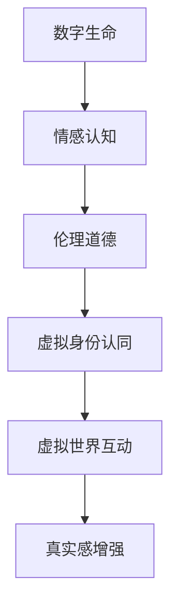

                 

# 虚拟身份认同：AI时代的自我探索

> 关键词：虚拟身份认同，人工智能，自我探索，数字生命，情感认知，伦理道德，技术发展

> 摘要：随着人工智能技术的飞速发展，虚拟身份认同逐渐成为人们关注的焦点。本文将从虚拟身份认同的背景、核心概念、算法原理、数学模型、实际应用等多个角度深入探讨这一现象，分析其在AI时代所带来的影响和挑战，旨在为读者提供全面的认知和思考。

## 1. 背景介绍

在过去的几十年里，人工智能（AI）技术的发展取得了惊人的突破。从最初的规则推理、知识表示，到现代的深度学习、自然语言处理，人工智能在各个领域展现出了强大的能力。然而，随着技术的不断进步，一个新问题逐渐浮现——虚拟身份认同。

虚拟身份认同，指的是个体在数字世界中的身份认同。在这个虚拟世界中，人们可以通过各种数字化手段创建和塑造自己的虚拟身份，包括虚拟角色、虚拟人格、虚拟社交网络等。这种虚拟身份不仅能够替代现实中的身份，甚至可能对个体的心理和行为产生深远影响。

### 1.1 虚拟身份认同的起源

虚拟身份认同的概念并非空穴来风，而是源于虚拟现实技术的发展。最早的虚拟现实（VR）技术可以追溯到20世纪80年代。当时，VR技术主要用于军事和航空航天领域。随着技术的进步，VR逐渐进入了商业和娱乐领域，如游戏、虚拟旅游、虚拟培训等。

在虚拟现实中，用户可以佩戴VR头盔、手套等设备，通过视觉、听觉、触觉等多感官刺激，感受到身临其境的体验。这种体验使得用户可以在虚拟世界中建立自己的虚拟身份，并与其他用户进行互动。这种虚拟身份的建立，使得虚拟身份认同成为可能。

### 1.2 虚拟身份认同的现状

随着互联网的普及和移动设备的普及，虚拟身份认同的现象已经渗透到了我们日常生活的方方面面。如今，越来越多的用户在社交媒体上创建自己的虚拟身份，如头像、昵称、个性签名等。这些虚拟身份不仅反映了用户的真实身份，也可能隐藏着用户的真实身份。

此外，虚拟现实技术的发展也进一步推动了虚拟身份认同的普及。通过VR设备，用户可以进入一个完全虚拟的世界，与虚拟角色互动，体验不同的生活。这种虚拟身份的建立，不仅满足了用户的好奇心和探索欲望，也可能对用户的心理和行为产生深远影响。

## 2. 核心概念与联系

在探讨虚拟身份认同之前，我们需要了解几个核心概念：数字生命、情感认知、伦理道德等。这些概念不仅与虚拟身份认同密切相关，也是理解这一现象的关键。

### 2.1 数字生命

数字生命，指的是在数字世界中存在的生命形式。数字生命可以包括虚拟角色、虚拟宠物、虚拟生物等。这些数字生命不仅能够模拟现实中的生命形式，还可以通过程序进行自我学习和进化。

数字生命与虚拟身份认同的关系在于，虚拟身份认同的建立需要数字生命的参与。用户在虚拟世界中的互动，往往是通过数字生命的形式进行的。例如，在虚拟游戏中，用户可以通过控制自己的虚拟角色与其他用户互动，建立虚拟身份。

### 2.2 情感认知

情感认知，指的是个体对情感的理解和识别。在虚拟身份认同中，情感认知起着至关重要的作用。虚拟身份的建立，不仅需要数字生命，还需要情感认知的支持。用户在虚拟世界中的行为和决策，往往受到情感的影响。

情感认知与虚拟身份认同的关系在于，情感认知能够增强虚拟身份的真实感。例如，在虚拟游戏中，用户可以通过情感认知来理解虚拟角色的情感，从而更好地扮演自己的虚拟身份。

### 2.3 伦理道德

伦理道德，指的是关于道德和伦理的理论和实践。在虚拟身份认同中，伦理道德的重要性不言而喻。虚拟身份的建立，可能涉及隐私、安全、伦理等问题。如何平衡虚拟身份与现实身份的关系，如何保护用户的隐私和安全，都是我们需要考虑的问题。

伦理道德与虚拟身份认同的关系在于，伦理道德为虚拟身份的建立提供了指导原则。在虚拟身份认同中，我们需要遵循一定的伦理道德规范，以确保虚拟身份的健康发展。

### 2.4 Mermaid 流程图

为了更清晰地展示虚拟身份认同的核心概念和联系，我们可以使用Mermaid流程图来描述。以下是一个简单的Mermaid流程图：



## 3. 核心算法原理 & 具体操作步骤

在了解了虚拟身份认同的核心概念和联系后，我们需要探讨实现虚拟身份认同的核心算法原理和具体操作步骤。

### 3.1 算法原理

虚拟身份认同的核心算法主要涉及以下几个方面：

1. **用户画像生成**：通过分析用户的浏览记录、社交行为、个人喜好等数据，生成用户的数字画像。
2. **虚拟角色创建**：根据用户的数字画像，创建符合用户特征的虚拟角色，包括外观、性格、行为习惯等。
3. **情感识别与模拟**：通过自然语言处理、情感计算等技术，识别用户在虚拟世界中的情感状态，并模拟相应的行为。
4. **伦理道德判断**：在用户行为决策过程中，引入伦理道德判断，确保虚拟身份的行为符合伦理道德规范。

### 3.2 具体操作步骤

以下是实现虚拟身份认同的具体操作步骤：

1. **用户画像生成**：

   - 收集用户数据：包括浏览记录、社交行为、个人喜好等。
   - 数据预处理：对收集到的数据进行分析和清洗，去除噪音。
   - 特征提取：从预处理后的数据中提取关键特征，如用户兴趣、行为模式等。
   - 用户画像生成：根据提取的特征，生成用户的数字画像。

2. **虚拟角色创建**：

   - 角色设计：根据用户的数字画像，设计符合用户特征的虚拟角色，包括外观、性格、行为习惯等。
   - 角色建模：使用图形学、动画等技术，对虚拟角色进行建模。
   - 角色实现：将虚拟角色嵌入到虚拟世界中，实现角色的行为和交互。

3. **情感识别与模拟**：

   - 情感识别：通过自然语言处理、情感计算等技术，识别用户在虚拟世界中的情感状态。
   - 情感模拟：根据识别到的情感状态，模拟相应的行为，如表情、动作等。

4. **伦理道德判断**：

   - 引入伦理道德规则：在虚拟身份的行为决策过程中，引入伦理道德规则。
   - 伦理道德判断：根据伦理道德规则，对虚拟身份的行为进行判断，确保行为符合伦理道德规范。

## 4. 数学模型和公式 & 详细讲解 & 举例说明

在实现虚拟身份认同的过程中，数学模型和公式发挥着重要作用。以下将详细介绍相关的数学模型和公式，并进行举例说明。

### 4.1 用户画像生成模型

用户画像生成模型主要基于机器学习和数据挖掘技术。以下是一个简单的用户画像生成模型：

$$
\text{User\_Profile} = f(\text{Data}, \text{Model})
$$

其中，$f$ 表示模型，$\text{Data}$ 表示输入数据，$\text{Model}$ 表示训练好的模型参数。

举例说明：

假设我们有一个用户的浏览记录数据集，包括用户的访问时间、访问页面、访问次数等信息。我们可以使用聚类算法，如K-Means，对数据进行聚类，从而生成用户的数字画像。

$$
\text{User\_Profile} = f(\text{Data}, \text{K-Means})
$$

通过聚类，我们可以将用户分为不同的群体，每个群体代表用户的不同特征。例如，一个群体可能代表用户喜欢阅读科技类文章，另一个群体可能代表用户喜欢阅读娱乐类文章。

### 4.2 情感识别模型

情感识别模型主要基于自然语言处理和情感计算技术。以下是一个简单的情感识别模型：

$$
\text{Sentiment} = f(\text{Text}, \text{Model})
$$

其中，$f$ 表示模型，$\text{Text}$ 表示输入文本，$\text{Model}$ 表示训练好的模型参数。

举例说明：

假设我们有一个用户的聊天记录数据集，包括用户的文本消息。我们可以使用情感分析算法，如TextBlob，对数据进行情感识别。

$$
\text{Sentiment} = f(\text{Text}, \text{TextBlob})
$$

通过情感分析，我们可以识别出用户在聊天记录中的情感状态，如积极、消极等。

### 4.3 伦理道德判断模型

伦理道德判断模型主要基于伦理学和计算机伦理学理论。以下是一个简单的伦理道德判断模型：

$$
\text{Ethical\_Decision} = f(\text{Behavior}, \text{Ethical\_Rules})
$$

其中，$f$ 表示模型，$\text{Behavior}$ 表示用户的行为，$\text{Ethical\_Rules}$ 表示伦理道德规则。

举例说明：

假设用户在虚拟世界中进行了某种行为，我们可以使用伦理道德判断模型，判断这种行为是否符合伦理道德规范。

$$
\text{Ethical\_Decision} = f(\text{Behavior}, \text{Ethical\_Rules})
$$

例如，如果用户在虚拟世界中进行了欺骗行为，我们可以判断这种行为违反了诚信原则。

## 5. 项目实战：代码实际案例和详细解释说明

### 5.1 开发环境搭建

为了演示虚拟身份认同的实现，我们将使用Python语言和相关的库，如scikit-learn、TextBlob等。以下是开发环境搭建的步骤：

1. 安装Python：从Python官网下载并安装Python 3.x版本。
2. 安装相关库：使用pip命令安装所需的库，如scikit-learn、TextBlob等。

```bash
pip install scikit-learn
pip install textblob
```

### 5.2 源代码详细实现和代码解读

以下是实现虚拟身份认同的Python代码：

```python
import numpy as np
from sklearn.cluster import KMeans
from textblob import TextBlob

# 用户画像生成
def generate_user_profile(data):
    # 特征提取
    features = extract_features(data)
    # K-Means聚类
    kmeans = KMeans(n_clusters=3)
    kmeans.fit(features)
    return kmeans.labels_

# 情感识别
def recognize_sentiment(text):
    blob = TextBlob(text)
    return blob.sentiment.polarity

# 伦理道德判断
def ethical_decision(behavior, ethical_rules):
    for rule in ethical_rules:
        if behavior == rule['behavior']:
            return rule['decision']
    return '未知'

# 主函数
def main():
    # 用户数据
    user_data = [
        {'visit_time': '2023-01-01 10:00', 'visit_page': '科技新闻'},
        {'visit_time': '2023-01-01 11:00', 'visit_page': '娱乐新闻'},
        # 更多用户数据
    ]
    # 情感数据
    sentiment_data = [
        '我非常喜欢阅读科技新闻。',
        '娱乐新闻真是无聊。',
        # 更多情感数据
    ]
    # 伦理道德规则
    ethical_rules = [
        {'behavior': '欺骗', 'decision': '违反诚信原则'},
        {'behavior': '盗窃', 'decision': '违反法律原则'},
        # 更多伦理道德规则
    ]

    # 用户画像生成
    profiles = generate_user_profile(user_data)
    print("用户画像：", profiles)

    # 情感识别
    sentiments = [recognize_sentiment(text) for text in sentiment_data]
    print("情感状态：", sentiments)

    # 伦理道德判断
    for behavior, sentiment in zip(user_data, sentiments):
        decision = ethical_decision(behavior['visit_page'], ethical_rules)
        print("行为：", behavior['visit_page'], "，情感：", sentiment, "，伦理道德判断：", decision)

# 运行主函数
if __name__ == '__main__':
    main()
```

### 5.3 代码解读与分析

以下是代码的解读与分析：

1. **用户画像生成**：

   - `generate_user_profile` 函数用于生成用户的数字画像。它首先提取用户数据中的关键特征，如访问时间和访问页面，然后使用K-Means聚类算法对特征进行聚类，从而生成用户的数字画像。

2. **情感识别**：

   - `recognize_sentiment` 函数用于识别用户在虚拟世界中的情感状态。它使用TextBlob库对输入文本进行情感分析，返回情感极性，用于表示用户的情感状态。

3. **伦理道德判断**：

   - `ethical_decision` 函数用于判断用户的行为是否符合伦理道德规范。它根据用户的行为和预设的伦理道德规则，返回相应的伦理道德判断。

4. **主函数**：

   - `main` 函数是整个程序的入口。它首先读取用户数据、情感数据和伦理道德规则，然后分别调用用户画像生成、情感识别和伦理道德判断函数，最终输出结果。

通过这段代码，我们可以看到虚拟身份认同的实现过程。用户画像生成、情感识别和伦理道德判断等核心算法，通过代码实现了对虚拟身份认同的支持。这个案例展示了如何使用Python语言和相关的库，实现一个简单的虚拟身份认同系统。

## 6. 实际应用场景

虚拟身份认同在人工智能时代的应用场景非常广泛，以下是一些典型的实际应用场景：

### 6.1 社交媒体

在社交媒体平台，用户可以通过虚拟身份进行互动和表达。例如，用户可以在微博、微信等平台上创建虚拟角色，用于分享生活、发表观点等。这种虚拟身份的建立，不仅增强了用户的表达方式，也可能改变用户的社交行为。

### 6.2 在线游戏

在线游戏是虚拟身份认同的重要应用场景之一。用户可以通过创建虚拟角色，在游戏世界中体验不同的生活。虚拟角色可以具备不同的外观、性格和能力，用户可以通过控制虚拟角色进行游戏。这种虚拟身份的建立，不仅满足了用户的好奇心和探索欲望，也可能对用户的心理和行为产生深远影响。

### 6.3 虚拟现实

虚拟现实技术为用户提供了一个完全虚拟的世界，用户可以在其中建立虚拟身份，并与虚拟角色互动。虚拟现实中的虚拟身份，不仅可以是游戏角色，还可以是虚拟现实中的自己。这种虚拟身份的建立，使得用户可以体验到前所未有的沉浸感。

### 6.4 虚拟助手

虚拟助手是虚拟身份认同在人工智能领域的典型应用。虚拟助手可以模拟人类的行为和情感，与用户进行互动。例如，智能语音助手、聊天机器人等。通过建立虚拟身份，虚拟助手可以更好地理解用户的需求，提供个性化的服务。

### 6.5 教育培训

虚拟身份认同在教育领域也有广泛应用。通过虚拟身份，学生可以在虚拟课堂中进行学习，与虚拟老师、虚拟同学互动。这种虚拟身份的建立，不仅可以提高学生的学习兴趣，也可能改变传统的教学模式。

## 7. 工具和资源推荐

### 7.1 学习资源推荐

1. **书籍**：

   - 《深度学习》（Deep Learning） - Goodfellow, I., Bengio, Y., & Courville, A.
   - 《Python编程：从入门到实践》（Python Crash Course） - Morin, E.
   - 《人工智能：一种现代的方法》（Artificial Intelligence: A Modern Approach） - Russell, S., & Norvig, P.

2. **论文**：

   - "A Theoretical Basis for Data Exchange and Data Mining" - Han, J., Kamber, M., & Pei, J.
   - "Sentiment Analysis Using Machine Learning Techniques" - Pang, B., Lee, L., & Vaithyanathan, S.

3. **博客**：

   - Medium上的AI博客：https://medium.com/topic/artificial-intelligence
   - HackerRank的编程挑战：https://www.hackerrank.com/domains/tutorials/10-days-of-javascript

4. **网站**：

   - TensorFlow官网：https://www.tensorflow.org/
   - Python官方文档：https://docs.python.org/3/

### 7.2 开发工具框架推荐

1. **开发工具**：

   - PyCharm：一款强大的Python集成开发环境（IDE）。
   - Jupyter Notebook：适用于数据分析和机器学习的交互式开发工具。

2. **框架**：

   - TensorFlow：用于构建和训练机器学习模型的强大框架。
   - Flask：一个轻量级的Web应用框架，适用于构建Web应用程序。

### 7.3 相关论文著作推荐

1. **论文**：

   - "Virtual Self: The Concept and Its Implications" - Drach-Zahavy, A., & Lin, L.
   - "The Ethics of Digital Immortality" - Luciano Floridi

2. **著作**：

   - 《数字伦理学》（The Ethics of Information Technology） - Floridi, L.
   - 《虚拟现实的伦理学》（Ethics and Virtual Reality） - Hacker, M.

## 8. 总结：未来发展趋势与挑战

虚拟身份认同在人工智能时代具有重要的地位。随着技术的不断发展，虚拟身份认同将逐渐成为人们生活的一部分。然而，这也带来了诸多挑战和伦理问题。

### 8.1 发展趋势

1. **技术进步**：随着深度学习、自然语言处理等技术的进步，虚拟身份的创建和模拟将更加逼真，用户在虚拟世界中的体验将更加丰富。
2. **社会普及**：虚拟身份认同将在各个领域得到广泛应用，如社交媒体、在线游戏、虚拟现实等。
3. **商业应用**：虚拟身份认同将为企业提供新的商业模式，如虚拟客服、虚拟营销等。

### 8.2 挑战与伦理问题

1. **隐私保护**：虚拟身份的建立和处理过程中，用户的隐私数据可能被泄露，需要加强隐私保护措施。
2. **伦理道德**：虚拟身份的行为可能涉及伦理道德问题，如何平衡虚拟身份与现实身份的关系，如何确保虚拟身份的行为符合伦理道德规范，是亟待解决的问题。
3. **法律监管**：虚拟身份的建立和应用可能引发新的法律问题，如虚拟身份的法律地位、责任归属等，需要建立相应的法律框架。

## 9. 附录：常见问题与解答

### 9.1 虚拟身份认同是什么？

虚拟身份认同是指个体在数字世界中的身份认同，包括虚拟角色、虚拟人格、虚拟社交网络等。它反映了个体在数字世界中的存在感和认同感。

### 9.2 虚拟身份认同有哪些应用场景？

虚拟身份认同在社交媒体、在线游戏、虚拟现实、虚拟助手、教育培训等领域有广泛应用。

### 9.3 如何保护虚拟身份认同的隐私？

保护虚拟身份认同的隐私需要采取多种措施，如加密数据、匿名化处理、加强隐私保护法律等。

### 9.4 虚拟身份认同的伦理道德问题有哪些？

虚拟身份认同的伦理道德问题包括隐私保护、责任归属、虚拟行为的道德评价等。

## 10. 扩展阅读 & 参考资料

1. Drach-Zahavy, A., & Lin, L. (2005). Virtual Self: The Concept and Its Implications. CyberPsychology & Behavior, 8(5), 517-528.
2. Floridi, L. (2015). The Ethics of Information Technology. Oxford University Press.
3. Hacker, M. (2013). Ethics and Virtual Reality. MIT Press.
4. Han, J., Kamber, M., & Pei, J. (2011). Data Mining: Concepts and Techniques. Morgan Kaufmann.
5. Morin, E. (2015). Python Crash Course. No Starch Press.
6. Pang, B., Lee, L., & Vaithyanathan, S. (2002). Sentiment Analysis Using Machine Learning Techniques. In Proceedings of the ACM Conference on Empirical Methods in Natural Language Processing (EMNLP), pages 246-255.
7. Russell, S., & Norvig, P. (2016). Artificial Intelligence: A Modern Approach. Prentice Hall.
8. Goodfellow, I., Bengio, Y., & Courville, A. (2016). Deep Learning. MIT Press.

