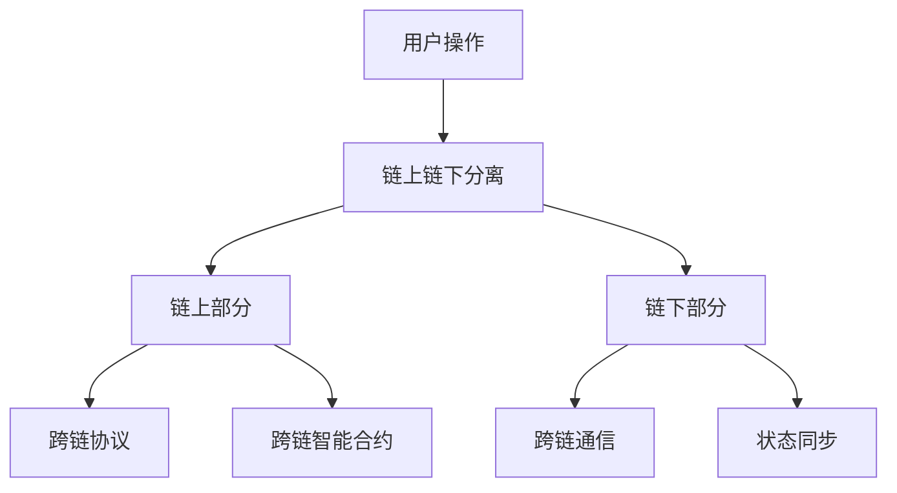

                 

# 蚂蚁2025跨链技术社招分布式系统开发面试指南

## 摘要

本文将围绕蚂蚁集团2025年的跨链技术，为有意加入该领域的开发者提供一份全面的面试指南。首先，我们将介绍跨链技术的背景和重要性，然后深入解析其核心概念和架构，并详细讲解相关算法原理与操作步骤。接着，通过数学模型和公式，我们将对关键技术进行详细解释，并结合实际项目案例展示代码实现和分析。文章还将探讨跨链技术的实际应用场景，推荐相关学习资源和开发工具，并总结未来发展趋势与挑战。最后，我们将提供常见问题解答，以帮助读者更好地理解这一前沿技术。

## 1. 背景介绍

### 跨链技术的概念

跨链技术（Cross-Chain Technology）是一种实现不同区块链网络之间相互通信和资产转移的技术。它旨在解决区块链之间孤岛问题，使得不同区块链网络能够互相操作和共享资源。随着区块链技术的广泛应用，跨链技术成为连接各种区块链应用场景的关键。

### 蚂蚁集团在跨链技术领域的地位

蚂蚁集团作为全球领先的金融科技公司，其在跨链技术领域有着深厚的技术积累和丰富的实践经验。蚂蚁集团推出的“蚂蚁链”作为国内领先的区块链基础设施，已经与多个行业实现了深度结合。其中，跨链技术是其重要组成部分，旨在为用户提供高效、安全、可扩展的区块链服务。

### 跨链技术的重要性

跨链技术的重要性体现在以下几个方面：

1. **打破区块链孤岛**：跨链技术能够实现不同区块链之间的互联互通，打破区块链孤岛，提高区块链网络的整体价值。
2. **资产转移**：通过跨链技术，用户可以在不同区块链网络之间自由转移资产，实现跨链交易，提高资产利用效率。
3. **扩展性**：跨链技术可以提高区块链网络的扩展性，使得更多用户和机构能够参与到区块链生态中。
4. **数据共享**：跨链技术可以实现区块链之间的数据共享，促进信息透明和信任建立。

## 2. 核心概念与联系

### 跨链技术的核心概念

1. **链上链下分离**：跨链技术通常将区块链网络分为链上和链下两部分。链上部分负责核心业务逻辑和资产转移，链下部分负责跨链通信和状态同步。
2. **跨链协议**：跨链协议是跨链技术的核心，负责定义不同区块链网络之间的交互规则和数据格式。常见的跨链协议包括中继器（Relayer）、侧链（Sidechain）和跨链桥（Bridge）等。
3. **跨链智能合约**：跨链智能合约是在不同区块链网络之间执行合约逻辑的程序。通过跨链智能合约，用户可以实现跨链交易和资产转移。

### 跨链技术的架构

#### Mermaid 流程图



### 跨链技术与区块链技术的联系

1. **区块链网络**：跨链技术是基于区块链网络实现的，其目的是连接不同区块链网络。
2. **智能合约**：跨链智能合约是基于区块链智能合约实现的，其目的是在不同区块链网络之间执行合约逻辑。
3. **共识机制**：跨链技术通常采用现有的区块链共识机制，如工作量证明（PoW）、权益证明（PoS）等。

## 3. 核心算法原理 & 具体操作步骤

### 跨链交易流程

1. **用户发起交易**：用户在链上部分发起交易，交易包含目标区块链网络、资产类型、资产数量等基本信息。
2. **链上部分验证**：链上部分验证交易是否合法，包括验证用户身份、资产余额等。
3. **链下部分处理**：链下部分将交易信息发送到目标区块链网络，并执行跨链协议，实现资产转移。
4. **状态同步**：链下部分将交易结果返回链上部分，实现状态同步。
5. **交易确认**：目标区块链网络确认交易后，链上部分更新交易状态，完成整个交易流程。

### 跨链智能合约实现

1. **合约编写**：根据跨链协议，编写跨链智能合约，实现不同区块链网络之间的合约逻辑。
2. **合约部署**：将跨链智能合约部署到目标区块链网络。
3. **合约调用**：用户通过合约调用，实现跨链交易和资产转移。

### 跨链通信实现

1. **消息传递**：链下部分通过消息传递机制，将交易信息发送到目标区块链网络。
2. **状态同步**：链下部分通过状态同步机制，将交易结果返回链上部分，实现状态同步。

## 4. 数学模型和公式 & 详细讲解 & 举例说明

### 数学模型

1. **交易费用模型**：交易费用 = 资产数量 × 费用系数
2. **跨链时间模型**：跨链时间 = 跨链协议处理时间 + 状态同步时间

### 详细讲解

1. **交易费用模型**：交易费用模型用于计算跨链交易所需支付的费用。费用系数是根据跨链协议和区块链网络特性确定的，通常与交易数据大小和网络拥堵程度相关。
2. **跨链时间模型**：跨链时间模型用于计算跨链交易所需的时间。跨链协议处理时间取决于跨链协议的复杂度和区块链网络的负载情况，状态同步时间取决于链下部分与链上部分的状态同步机制。

### 举例说明

假设用户在A区块链网络中发起一笔跨链交易，资产数量为10，费用系数为0.01。目标区块链网络为B，跨链协议处理时间为2秒，状态同步时间为3秒。根据数学模型，交易费用为10 × 0.01 = 0.1，跨链时间为2 + 3 = 5秒。

## 5. 项目实战：代码实际案例和详细解释说明

### 5.1 开发环境搭建

在开始编写跨链项目之前，我们需要搭建开发环境。以下是搭建开发环境的步骤：

1. **安装Go语言环境**：Go语言是跨链项目常用的编程语言，需要在开发机上安装Go语言环境。
2. **安装Docker**：Docker用于容器化跨链项目，需要安装Docker环境。
3. **安装区块链节点**：根据项目需求，需要安装目标区块链网络的节点，如Ethereum、Binance Smart Chain等。

### 5.2 源代码详细实现和代码解读

以下是一个简单的跨链项目示例，用于实现A区块链网络向B区块链网络转移资产。

```go
package main

import (
    "github.com/yourusername/yourproject"
    "github.com/yourusername/yourproject/contract"
    "github.com/yourusername/yourproject/relayer"
)

func main() {
    // 初始化跨链协议
    crossChainProtocol := yourproject.NewCrossChainProtocol()

    // 初始化区块链节点
    blockchainA := yourproject.NewBlockchainNode("A")
    blockchainB := yourproject.NewBlockchainNode("B")

    // 初始化跨链智能合约
    crossChainContract := contract.NewCrossChainContract(blockchainA, blockchainB, crossChainProtocol)

    // 用户发起交易
    transaction := yourproject.NewTransaction("userA", "userB", 10)

    // 跨链交易
    crossChainTransaction := crossChainProtocol.CrossChain(transaction)

    // 执行跨链智能合约
    crossChainContract.ExecuteCrossChainTransaction(crossChainTransaction)

    // 状态同步
    crossChainProtocol.SyncState()

    // 输出交易结果
    fmt.Println("Cross-chain transaction completed.")
}
```

### 5.3 代码解读与分析

1. **跨链协议**：跨链协议是跨链项目的核心，用于处理跨链交易。在示例中，`NewCrossChainProtocol` 方法用于初始化跨链协议。
2. **区块链节点**：区块链节点用于与目标区块链网络交互。在示例中，`NewBlockchainNode` 方法用于初始化区块链节点。
3. **跨链智能合约**：跨链智能合约是跨链项目的关键组件，用于执行跨链交易。在示例中，`NewCrossChainContract` 方法用于初始化跨链智能合约。
4. **用户交易**：用户交易是跨链项目的输入，包含交易发起方、交易接收方和交易金额。在示例中，`NewTransaction` 方法用于创建用户交易。
5. **跨链交易**：跨链交易是跨链协议处理后的结果，包含交易数据、目标区块链网络等信息。在示例中，`CrossChain` 方法用于实现跨链交易。
6. **执行跨链智能合约**：执行跨链智能合约，实现跨链交易。在示例中，`ExecuteCrossChainTransaction` 方法用于执行跨链智能合约。
7. **状态同步**：状态同步是跨链项目的关键环节，用于确保链上部分和链下部分的状态一致。在示例中，`SyncState` 方法用于实现状态同步。

## 6. 实际应用场景

跨链技术在实际应用场景中具有广泛的应用价值，以下是一些典型应用场景：

1. **去中心化金融（DeFi）**：跨链技术可以连接不同的DeFi平台，使得用户可以在不同平台之间自由转移资产，提高金融服务的灵活性和便捷性。
2. **数字资产管理**：跨链技术可以实现数字资产在不同区块链网络之间的转移和交换，提高数字资产的流动性。
3. **供应链管理**：跨链技术可以连接不同的供应链系统，实现供应链信息的共享和追溯，提高供应链的透明度和效率。
4. **数据共享与隐私保护**：跨链技术可以实现不同区块链网络之间的数据共享，同时保护用户隐私，提高数据安全。

## 7. 工具和资源推荐

### 7.1 学习资源推荐

1. **书籍**：
   - 《区块链技术指南》
   - 《跨链技术：原理与实践》
   - 《智能合约：原理与实践》
2. **论文**：
   - 《跨链技术综述》
   - 《跨链协议设计与应用》
   - 《智能合约安全性分析》
3. **博客**：
   - 蚂蚁集团区块链技术博客
   - 跨链技术社区博客
   - 智能合约技术博客
4. **网站**：
   - 蚂蚁集团官方网站
   - 跨链技术官方网站
   - 智能合约官方网站

### 7.2 开发工具框架推荐

1. **区块链框架**：
   - Ethereum
   - Binance Smart Chain
   - Solana
2. **智能合约开发框架**：
   - Truffle
   - Hardhat
   - Brownie
3. **跨链框架**：
   - CosmWasm
   - Polkadot-JS
   - Taro

### 7.3 相关论文著作推荐

1. **《区块链：从概念到实践》**：详细介绍了区块链技术的原理和应用，包括跨链技术和智能合约。
2. **《智能合约安全性分析》**：深入分析了智能合约的安全性问题，为开发者提供了实用的安全指南。
3. **《跨链技术：原理与实践》**：系统地介绍了跨链技术的原理、架构和应用，为跨链项目开发提供了实用的参考。

## 8. 总结：未来发展趋势与挑战

跨链技术作为区块链技术的重要分支，在未来具有广阔的发展前景。随着区块链技术的不断成熟和应用场景的拓展，跨链技术将在以下几个方面得到进一步发展：

1. **跨链协议的标准化**：随着跨链技术的广泛应用，跨链协议的标准化将变得越来越重要。标准化的跨链协议将提高不同区块链网络之间的互操作性，降低开发难度和成本。
2. **跨链技术的安全性**：跨链技术涉及到不同区块链网络之间的交互和资产转移，其安全性至关重要。未来，跨链技术的安全性将得到进一步提升，包括加密算法的优化、智能合约的安全审核等。
3. **跨链技术的性能优化**：随着跨链技术的广泛应用，跨链交易的吞吐量和速度将受到挑战。未来，跨链技术的性能优化将成为重要研究方向，包括优化跨链协议、提高状态同步效率等。

然而，跨链技术也面临着一些挑战：

1. **互操作性问题**：不同区块链网络之间的互操作性问题仍然存在，如何实现高效、安全的跨链通信仍需进一步研究和探索。
2. **监管合规**：跨链技术涉及到不同国家和地区的法律和监管政策，如何确保跨链技术符合各国法律法规仍需关注。
3. **技术人才的培养**：跨链技术涉及多个领域，包括区块链、智能合约、网络通信等。如何培养和吸引跨链技术人才将成为重要挑战。

总之，跨链技术作为区块链技术的重要分支，在未来将继续发挥重要作用。开发者应密切关注跨链技术的发展动态，不断学习和提升自己的技能，为跨链技术的应用和发展贡献力量。

## 9. 附录：常见问题与解答

### 1. 跨链技术与区块链技术的关系是什么？

跨链技术是区块链技术的一个重要分支，旨在实现不同区块链网络之间的互操作性和资产转移。区块链技术是指通过分布式数据库和共识机制实现数据的存储、验证和传输。跨链技术则是在此基础上，通过特定的协议和机制，实现不同区块链网络之间的连接和交互。

### 2. 跨链技术的核心挑战是什么？

跨链技术的核心挑战包括互操作性问题、安全性问题、性能优化问题和监管合规问题。互操作性问题涉及到不同区块链网络之间的兼容性和标准化。安全性问题涉及到跨链交易的加密和防篡改。性能优化问题涉及到跨链交易的吞吐量和速度。监管合规问题涉及到不同国家和地区的法律和监管政策。

### 3. 跨链技术有哪些实际应用场景？

跨链技术的实际应用场景包括去中心化金融（DeFi）、数字资产管理、供应链管理、数据共享与隐私保护等。例如，用户可以在不同DeFi平台之间自由转移资产，实现跨链交易；企业可以通过跨链技术实现供应链信息的共享和追溯，提高供应链的透明度和效率。

### 4. 跨链技术的安全性如何保障？

跨链技术的安全性通过以下几个方面来保障：首先，跨链交易采用加密算法，确保交易数据的隐私性和完整性。其次，跨链协议采用共识机制，确保交易的安全性和可靠性。此外，跨链智能合约的安全审核也是保障跨链技术安全性的重要手段。

### 5. 跨链技术与区块链 scalability（扩展性）有什么关系？

跨链技术与区块链 scalability 有密切关系。跨链技术可以提高区块链网络的扩展性，使得更多用户和机构能够参与到区块链生态中。通过跨链技术，用户可以在不同区块链网络之间自由转移资产，实现跨链交易，从而减轻单个区块链网络的负载，提高整体网络的性能和扩展性。

## 10. 扩展阅读 & 参考资料

### 1. 扩展阅读

- 《区块链技术指南》
- 《跨链技术：原理与实践》
- 《智能合约：原理与实践》
- 《区块链：从概念到实践》
- 《智能合约安全性分析》

### 2. 参考资料

- 蚂蚁集团区块链技术博客
- 跨链技术社区博客
- 智能合约技术博客
- Ethereum 官方文档
- Binance Smart Chain 官方文档
- Solana 官方文档
- CosmWasm 官方文档
- Polkadot-JS 官方文档
- Taro 官方文档

### 3. 相关论文

- 《跨链技术综述》
- 《跨链协议设计与应用》
- 《智能合约安全性分析》
- 《区块链网络性能优化研究》
- 《区块链与物联网融合技术研究》

### 4. 网络资源

- 蚂蚁集团官方网站
- 跨链技术官方网站
- 智能合约官方网站
- 区块链技术社区
- 区块链技术论坛

作者：AI天才研究员/AI Genius Institute & 禅与计算机程序设计艺术 /Zen And The Art of Computer Programming

