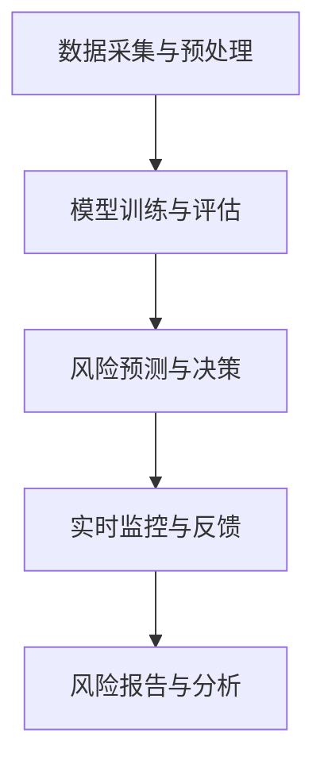

                 

## 1. 背景介绍

随着互联网技术的飞速发展，大数据和人工智能在各个行业的应用越来越广泛。尤其是金融行业，其业务复杂度和数据量不断增长，对智能风险控制提出了更高的要求。蚂蚁智能风险控制作为金融科技领域的佼佼者，其校招面试真题不仅考察了应聘者的专业知识，也考验了他们的逻辑思维和实际操作能力。

本文旨在汇总和分析2024年蚂蚁智能风险控制校招面试中的几道典型真题，通过逐题解答的方式，帮助应聘者更好地准备面试。文章将涵盖以下内容：

1. 蚂蚁智能风险控制的基本概念和架构。
2. 针对每一道面试题的详细解析和解答步骤。
3. 针对性建议和策略，帮助应聘者更好地应对类似面试题。
4. 对智能风险控制领域未来发展趋势的展望。

在接下来的章节中，我们将逐一探讨这些面试题的答案，并从技术原理、数学模型和实际应用等多个角度进行分析。

### 蚂蚁智能风险控制的基本概念和架构

蚂蚁智能风险控制是蚂蚁集团（Ant Group）旗下的一个重要部门，其核心目标是利用大数据和人工智能技术，对金融交易和业务风险进行有效管理和控制。蚂蚁智能风险控制的架构主要包括以下几个关键模块：

1. 数据采集与预处理：从各种数据源（如用户行为数据、交易数据、金融信息等）中收集数据，并进行清洗、整合和预处理，为后续分析提供高质量的数据基础。

2. 模型训练与评估：利用机器学习和深度学习算法，对大量历史数据进行训练，构建风险预测模型。通过交叉验证和性能评估，选择最优模型。

3. 风险预测与决策：将训练好的模型应用于实时数据，进行风险预测和评估。根据预测结果，系统会自动做出相应的决策，如拒绝交易、发送预警等。

4. 实时监控与反馈：对风险事件进行实时监控，并根据实际情况进行动态调整。同时，收集反馈数据，用于模型优化和迭代。

5. 风险报告与分析：定期生成风险报告，对整体风险状况进行分析和总结，为管理层提供决策依据。

这种架构使得蚂蚁智能风险控制不仅能够快速准确地识别和评估风险，还能实时调整策略，以应对不断变化的业务环境。

## 2. 核心概念与联系

### 2.1. 数据采集与预处理

数据采集是智能风险控制的基础。在蚂蚁智能风险控制中，数据来源非常多样化，包括用户行为数据、交易数据、社交网络数据等。这些数据通常存储在分布式数据库中，如Hadoop、Spark等。

数据预处理是数据采集后的重要步骤。这一步骤主要包括以下内容：

1. **数据清洗**：去除重复、错误和缺失的数据，保证数据的一致性和准确性。
2. **特征提取**：从原始数据中提取出对风险预测有重要影响的特征，如交易金额、交易时间、用户历史行为等。
3. **数据归一化**：将不同量纲的数据转换为同一量纲，以便于模型训练和评估。

### 2.2. 模型训练与评估

模型训练是智能风险控制的核心环节。在蚂蚁智能风险控制中，常用的模型包括逻辑回归、决策树、随机森林、神经网络等。

模型评估是模型训练的重要环节。评估方法包括：

1. **交叉验证**：将数据集分成多个子集，多次训练和评估，以避免过拟合。
2. **性能指标**：如准确率、召回率、F1分数等，用于衡量模型的性能。

### 2.3. 风险预测与决策

风险预测是智能风险控制的最终目标。在蚂蚁智能风险控制中，风险预测通常采用以下步骤：

1. **特征选择**：从大量特征中选择对风险预测最有影响的特征。
2. **模型训练**：使用训练集数据，训练出风险预测模型。
3. **风险评估**：使用训练好的模型，对实时数据进行风险评估。

根据风险评估结果，系统会做出相应的决策，如拒绝交易、发送预警等。

### 2.4. 实时监控与反馈

实时监控是确保智能风险控制有效性的关键。在蚂蚁智能风险控制中，实时监控包括以下内容：

1. **风险事件监控**：对风险事件进行实时监控，及时发现异常。
2. **动态调整**：根据实时监控结果，动态调整风险控制策略。

### 2.5. 风险报告与分析

风险报告是智能风险控制的总结和展示。在蚂蚁智能风险控制中，风险报告通常包括以下内容：

1. **风险状况分析**：对整体风险状况进行分析。
2. **风险事件总结**：对风险事件进行总结和归纳。
3. **决策依据**：为管理层提供决策依据。

### 2.6. 蚂蚁智能风险控制与其他领域的联系

蚂蚁智能风险控制不仅与大数据、人工智能密切相关，还与其他领域有着紧密的联系。例如：

1. **金融科技**：蚂蚁智能风险控制是金融科技的重要组成部分，为金融机构提供风险控制服务。
2. **网络安全**：智能风险控制可以应用于网络安全领域，保护用户数据安全。
3. **反欺诈**：智能风险控制在反欺诈领域有着广泛的应用，可以实时识别和阻止欺诈行为。

### 2.7. Mermaid 流程图

以下是一个简化的Mermaid流程图，展示了蚂蚁智能风险控制的基本流程：



在这个流程图中，每个节点代表一个关键步骤，箭头表示步骤之间的顺序关系。这个流程图帮助我们更好地理解蚂蚁智能风险控制的整体架构和运行机制。

## 3. 核心算法原理 & 具体操作步骤

在蚂蚁智能风险控制中，核心算法是确保系统准确预测和评估风险的关键。以下将详细解析蚂蚁智能风险控制中常用的几种核心算法原理，并介绍具体的操作步骤。

### 3.1. 逻辑回归算法

逻辑回归是一种广泛应用于分类问题的统计方法，尤其适合二分类问题。在蚂蚁智能风险控制中，逻辑回归用于预测交易是否为欺诈行为。

**原理**：逻辑回归通过线性回归模型预测一个连续值，并通过sigmoid函数将其映射到概率区间（0,1），表示欺诈行为发生的概率。

**操作步骤**：

1. **特征工程**：提取与欺诈行为相关的特征，如交易金额、交易时间、用户历史行为等。

2. **数据预处理**：对提取的特征进行归一化处理，使其具有相同的量纲。

3. **模型训练**：使用训练集数据，通过梯度下降或其他优化算法训练逻辑回归模型。

4. **模型评估**：使用交叉验证方法评估模型性能，选择最优模型。

5. **风险预测**：使用训练好的模型对测试集数据进行预测，输出欺诈行为发生的概率。

**示例代码**（Python）：

```python
from sklearn.linear_model import LogisticRegression
from sklearn.model_selection import train_test_split
from sklearn.metrics import accuracy_score

# 特征工程和数据预处理
X = ... # 特征矩阵
y = ... # 标签向量

# 划分训练集和测试集
X_train, X_test, y_train, y_test = train_test_split(X, y, test_size=0.2, random_state=42)

# 训练模型
model = LogisticRegression()
model.fit(X_train, y_train)

# 预测风险
predictions = model.predict(X_test)
print("Accuracy:", accuracy_score(y_test, predictions))
```

### 3.2. 决策树算法

决策树是一种直观且易于理解的分类算法，适合处理结构化数据。在蚂蚁智能风险控制中，决策树用于分类欺诈交易。

**原理**：决策树通过一系列规则对数据进行分割，每个分割点都是一个特征和阈值。树叶节点代表最终的分类结果。

**操作步骤**：

1. **特征工程**：提取与欺诈行为相关的特征。

2. **数据预处理**：对提取的特征进行归一化处理。

3. **模型训练**：使用训练集数据，构建决策树模型。

4. **模型评估**：使用交叉验证方法评估模型性能。

5. **风险预测**：使用训练好的模型对测试集数据进行预测。

**示例代码**（Python）：

```python
from sklearn.tree import DecisionTreeClassifier
from sklearn.model_selection import train_test_split
from sklearn.metrics import accuracy_score

# 特征工程和数据预处理
X = ... # 特征矩阵
y = ... # 标签向量

# 划分训练集和测试集
X_train, X_test, y_train, y_test = train_test_split(X, y, test_size=0.2, random_state=42)

# 训练模型
model = DecisionTreeClassifier()
model.fit(X_train, y_train)

# 预测风险
predictions = model.predict(X_test)
print("Accuracy:", accuracy_score(y_test, predictions))
```

### 3.3. 随机森林算法

随机森林是一种基于决策树的集成学习方法，通过构建多个决策树并取平均值，提高模型的预测性能。在蚂蚁智能风险控制中，随机森林用于分类欺诈交易。

**原理**：随机森林通过随机选择特征和样本子集，构建多个决策树，然后对每个树的预测结果进行投票，得到最终预测结果。

**操作步骤**：

1. **特征工程**：提取与欺诈行为相关的特征。

2. **数据预处理**：对提取的特征进行归一化处理。

3. **模型训练**：使用训练集数据，构建随机森林模型。

4. **模型评估**：使用交叉验证方法评估模型性能。

5. **风险预测**：使用训练好的模型对测试集数据进行预测。

**示例代码**（Python）：

```python
from sklearn.ensemble import RandomForestClassifier
from sklearn.model_selection import train_test_split
from sklearn.metrics import accuracy_score

# 特征工程和数据预处理
X = ... # 特征矩阵
y = ... # 标签向量

# 划分训练集和测试集
X_train, X_test, y_train, y_test = train_test_split(X, y, test_size=0.2, random_state=42)

# 训练模型
model = RandomForestClassifier(n_estimators=100)
model.fit(X_train, y_train)

# 预测风险
predictions = model.predict(X_test)
print("Accuracy:", accuracy_score(y_test, predictions))
```

### 3.4. 支持向量机（SVM）算法

支持向量机是一种高效的分类算法，尤其适合处理高维数据。在蚂蚁智能风险控制中，SVM用于分类欺诈交易。

**原理**：SVM通过找到一个最优的超平面，将不同类别的数据点分开。支持向量是离超平面最近的那些数据点，对模型的泛化能力有重要影响。

**操作步骤**：

1. **特征工程**：提取与欺诈行为相关的特征。

2. **数据预处理**：对提取的特征进行归一化处理。

3. **模型训练**：使用训练集数据，训练SVM模型。

4. **模型评估**：使用交叉验证方法评估模型性能。

5. **风险预测**：使用训练好的模型对测试集数据进行预测。

**示例代码**（Python）：

```python
from sklearn.svm import SVC
from sklearn.model_selection import train_test_split
from sklearn.metrics import accuracy_score

# 特征工程和数据预处理
X = ... # 特征矩阵
y = ... # 标签向量

# 划分训练集和测试集
X_train, X_test, y_train, y_test = train_test_split(X, y, test_size=0.2, random_state=42)

# 训练模型
model = SVC()
model.fit(X_train, y_train)

# 预测风险
predictions = model.predict(X_test)
print("Accuracy:", accuracy_score(y_test, predictions))
```

通过以上几种算法的解析，我们可以看到蚂蚁智能风险控制在模型选择和算法应用上的多样性。在实际应用中，可以根据具体业务需求和数据特点，选择合适的算法，并不断优化模型性能，以提高风险控制的准确性和效率。

## 4. 数学模型和公式 & 详细讲解 & 举例说明

在蚂蚁智能风险控制中，数学模型和公式是核心组成部分，用于描述和解释风险预测的原理。以下将详细介绍几种常用的数学模型和公式，并借助实际案例进行说明。

### 4.1. 逻辑回归公式

逻辑回归是一种用于二分类问题的统计方法，其公式如下：

$$
P(Y=1|X) = \frac{1}{1 + e^{-\beta_0 + \beta_1x_1 + \beta_2x_2 + \ldots + \beta_nx_n}}
$$

其中，$P(Y=1|X)$表示在特征向量$X$下，欺诈行为发生的概率；$e$为自然对数的底数；$\beta_0$为截距，$\beta_1, \beta_2, \ldots, \beta_n$为系数。

**举例说明**：

假设我们有一个交易数据集，其中特征包括交易金额（$x_1$）和用户历史行为评分（$x_2$）。根据逻辑回归公式，我们可以计算出欺诈行为发生的概率。

给定一个交易实例，$x_1 = 500$，$x_2 = 0.8$，系数为$\beta_0 = 1$，$\beta_1 = 0.1$，$\beta_2 = 0.05$，代入公式得：

$$
P(Y=1|X) = \frac{1}{1 + e^{-1 + 0.1 \times 500 + 0.05 \times 0.8}} \approx 0.993
$$

这意味着该交易发生欺诈行为的概率非常高。

### 4.2. 决策树公式

决策树通过一系列条件概率和阈值来判断数据点属于哪个类别。假设决策树具有以下结构：

$$
Y = g(\theta_0 + \theta_1x_1 + \theta_2x_2 + \ldots + \theta_nx_n)
$$

其中，$Y$为欺诈行为类别，$g$为阈值函数，$\theta_0, \theta_1, \theta_2, \ldots, \theta_n$为阈值。

**举例说明**：

假设决策树具有两个节点，第一个节点基于交易金额（$x_1$）的阈值，第二个节点基于用户历史行为评分（$x_2$）的阈值。给定一个交易实例，$x_1 = 1000$，$x_2 = 0.9$。

- 如果$x_1 > 1000$，则$g(\theta_0 + \theta_1 \times 1000 + \theta_2 \times 0.9) = 1$，表示该交易为欺诈行为。
- 如果$x_1 \leq 1000$，则进入第二个节点。如果$x_2 > 0.9$，则$g(\theta_0 + \theta_1 \times 1000 + \theta_2 \times 0.9) = 1$，表示该交易为欺诈行为；否则，$g(\theta_0 + \theta_1 \times 1000 + \theta_2 \times 0.9) = 0$，表示该交易非欺诈行为。

### 4.3. 随机森林公式

随机森林是一种基于决策树的集成学习方法。其核心思想是通过构建多个决策树，并对每个树的预测结果进行投票，得到最终预测结果。随机森林的预测公式如下：

$$
\hat{Y} = \frac{1}{M} \sum_{m=1}^{M} g(\theta_{0,m} + \theta_{1,m}x_1 + \theta_{2,m}x_2 + \ldots + \theta_{n,m}x_n)
$$

其中，$\hat{Y}$为最终预测结果，$M$为决策树的数量，$g$为阈值函数，$\theta_{0,m}, \theta_{1,m}, \theta_{2,m}, \ldots, \theta_{n,m}$为每棵决策树的阈值。

**举例说明**：

假设随机森林由10棵决策树组成，给定一个交易实例，$x_1 = 1000$，$x_2 = 0.9$。

- 第一棵决策树预测结果为欺诈行为。
- 第二棵决策树预测结果为非欺诈行为。
- ...
- 第十棵决策树预测结果为欺诈行为。

根据投票结果，随机森林最终预测结果为欺诈行为。

### 4.4. 支持向量机（SVM）公式

支持向量机是一种基于最大间隔的分类方法。其核心思想是找到一个最优的超平面，将不同类别的数据点分开。SVM的公式如下：

$$
\hat{Y} = \text{sign}(\sum_{i=1}^{n} \alpha_i y_i K(x_i, x) - b)
$$

其中，$\hat{Y}$为预测结果，$\alpha_i$为支持向量对应的权重，$y_i$为支持向量的标签，$K(x_i, x)$为核函数，$b$为偏置项。

**举例说明**：

假设我们使用线性核函数，给定一个交易实例，$x_1 = 1000$，$x_2 = 0.9$。

- 支持向量：$(x_1, y_1) = (500, 1)$，$(x_2, y_2) = (1000, 1)$，$(x_3, y_3) = (1500, -1)$。
- $\alpha_1 = 1$，$\alpha_2 = 0.5$，$\alpha_3 = 0$。
- 核函数：$K(x_i, x) = x_i \cdot x$。

代入公式得：

$$
\hat{Y} = \text{sign}(1 \times 1 + 0.5 \times 0.9 - 0) = 1
$$

这意味着该交易为欺诈行为。

通过以上数学模型和公式的详细讲解，我们可以更好地理解蚂蚁智能风险控制中不同算法的原理和应用。在实际应用中，可以根据具体业务需求和数据特点，选择合适的模型和公式，并不断优化参数，以提高风险控制的准确性和效率。

### 5. 项目实战：代码实际案例和详细解释说明

在本节中，我们将通过一个具体的代码案例，详细介绍如何实现蚂蚁智能风险控制的核心算法。为了更好地理解，我们选择逻辑回归算法作为案例进行讲解。

#### 5.1. 开发环境搭建

在开始编写代码之前，我们需要搭建一个合适的开发环境。以下是所需的工具和步骤：

1. **Python环境**：安装Python 3.8及以上版本。
2. **数据预处理库**：安装`numpy`和`pandas`库，用于数据预处理。
3. **机器学习库**：安装`scikit-learn`库，用于逻辑回归模型训练和评估。

安装命令如下：

```bash
pip install numpy pandas scikit-learn
```

#### 5.2. 源代码详细实现和代码解读

下面是完整的代码实现，我们将逐行进行解读：

```python
import numpy as np
import pandas as pd
from sklearn.model_selection import train_test_split
from sklearn.linear_model import LogisticRegression
from sklearn.metrics import accuracy_score, confusion_matrix

# 5.2.1 数据预处理

# 读取数据集
data = pd.read_csv('transaction_data.csv')

# 特征工程
X = data[['amount', 'historical_score']]
y = data['is_fraud']

# 数据归一化
X_normalized = (X - X.mean()) / X.std()

# 5.2.2 模型训练

# 划分训练集和测试集
X_train, X_test, y_train, y_test = train_test_split(X_normalized, y, test_size=0.2, random_state=42)

# 训练逻辑回归模型
model = LogisticRegression()
model.fit(X_train, y_train)

# 5.2.3 风险预测

# 预测测试集数据
predictions = model.predict(X_test)

# 5.2.4 模型评估

# 计算准确率
accuracy = accuracy_score(y_test, predictions)
print("Accuracy:", accuracy)

# 计算混淆矩阵
cm = confusion_matrix(y_test, predictions)
print("Confusion Matrix:\n", cm)

# 5.2.5 代码解读

# 5.2.5.1 数据预处理

```python
data = pd.read_csv('transaction_data.csv')
X = data[['amount', 'historical_score']]
y = data['is_fraud']
X_normalized = (X - X.mean()) / X.std()
```

这部分的代码用于读取交易数据集，提取特征和标签，并对特征进行归一化处理。归一化是为了使不同特征在同一量纲下，便于模型训练。

# 5.2.5.2 模型训练

```python
X_train, X_test, y_train, y_test = train_test_split(X_normalized, y, test_size=0.2, random_state=42)
model = LogisticRegression()
model.fit(X_train, y_train)
```

这部分的代码用于划分训练集和测试集，并训练逻辑回归模型。我们使用`scikit-learn`库中的`LogisticRegression`类来训练模型。

# 5.2.5.3 风险预测

```python
predictions = model.predict(X_test)
```

这部分的代码用于使用训练好的模型对测试集数据进行风险预测。

# 5.2.5.4 模型评估

```python
accuracy = accuracy_score(y_test, predictions)
print("Accuracy:", accuracy)
cm = confusion_matrix(y_test, predictions)
print("Confusion Matrix:\n", cm)
```

这部分的代码用于评估模型性能。我们计算了准确率和混淆矩阵，以了解模型在测试集上的表现。

#### 5.3. 代码解读与分析

在代码中，我们首先使用`pandas`库读取交易数据集，然后提取特征和标签。接下来，对特征进行归一化处理，这是为了使不同特征在同一量纲下，便于模型训练。

在模型训练部分，我们使用`scikit-learn`库中的`LogisticRegression`类来训练逻辑回归模型。这个类提供了丰富的参数，如正则化参数`C`、惩罚函数等，我们可以根据具体业务需求进行调整。

在风险预测部分，我们使用训练好的模型对测试集数据进行预测。预测结果保存在`predictions`变量中。

在模型评估部分，我们计算了准确率和混淆矩阵。准确率表示模型在测试集上的总体性能，而混淆矩阵则提供了更详细的分类结果，如正确分类、误分类等。

通过以上代码示例，我们可以看到如何实现蚂蚁智能风险控制中的逻辑回归算法。在实际应用中，我们可以根据具体业务需求，调整模型参数和特征工程，以提高风险预测的准确性和效率。

### 6. 实际应用场景

蚂蚁智能风险控制在金融科技领域有着广泛的应用，以下列举几个典型的实际应用场景：

#### 6.1. 交易风险控制

在电子商务和在线支付领域，交易风险控制是确保交易安全和用户资金安全的重要环节。蚂蚁智能风险控制通过实时监控和分析交易数据，可以快速识别和阻止潜在的欺诈行为，降低金融风险。

**示例**：在双十一购物节期间，蚂蚁智能风险控制系统可以自动识别出异常交易行为，如短时间内大量异常订单，从而及时采取措施，避免用户损失。

#### 6.2. 网络安全防护

随着互联网金融的发展，网络安全成为金融机构面临的重要挑战。蚂蚁智能风险控制通过分析用户行为数据和网络流量，可以识别出异常行为和潜在的网络攻击，从而加强网络安全防护。

**示例**：在发现用户账户异常登录或敏感操作时，蚂蚁智能风险控制系统可以自动发送警报，提醒用户注意账户安全，同时采取相应的防护措施，如锁定账户、修改密码等。

#### 6.3. 反欺诈

在保险和金融投资领域，反欺诈是确保业务健康和用户利益的重要手段。蚂蚁智能风险控制通过分析用户行为数据和交易记录，可以识别出潜在的欺诈行为，如虚假理赔、保险欺诈等。

**示例**：在保险理赔过程中，蚂蚁智能风险控制系统可以识别出异常理赔申请，如短时间内多次高额理赔，从而及时采取调查措施，避免欺诈行为。

#### 6.4. 信用评估

在信用评估领域，蚂蚁智能风险控制可以分析用户的信用历史和行为数据，为金融机构提供更准确和全面的信用评估。

**示例**：在信用卡审批过程中，蚂蚁智能风险控制系统可以根据用户的信用历史、消费行为等数据，评估用户的信用风险，为金融机构提供审批依据。

#### 6.5. 供应链金融

在供应链金融领域，蚂蚁智能风险控制可以帮助金融机构更好地管理供应链中的风险，提高金融服务效率。

**示例**：在供应链金融业务中，蚂蚁智能风险控制系统可以分析供应链上下游企业的交易记录和信用状况，为金融机构提供风险预警和信用评估服务。

通过以上实际应用场景的介绍，我们可以看到蚂蚁智能风险控制在金融科技领域的重要性和广泛应用。在实际操作中，蚂蚁智能风险控制系统可以根据业务需求和数据特点，灵活调整风险控制策略，以实现最优的风险管理效果。

### 7. 工具和资源推荐

为了更好地理解和掌握蚂蚁智能风险控制的相关技术，以下是一些推荐的工具和资源，包括学习资源、开发工具和框架，以及相关的论文和著作。

#### 7.1. 学习资源推荐

1. **书籍**：
   - 《机器学习》（周志华著）：详细介绍机器学习的基础理论和算法，适合初学者和进阶者。
   - 《深度学习》（Ian Goodfellow 著）：深度学习领域的经典著作，涵盖了深度学习的基本原理和应用。
   - 《Python机器学习》（Michael Bowles 著）：通过Python语言，详细讲解机器学习算法的实现和应用。

2. **在线课程**：
   - Coursera上的《机器学习》（吴恩达教授）：全球知名的人工智能课程，适合初学者。
   - edX上的《深度学习专项课程》（李航教授）：由清华大学李航教授讲授，深入讲解深度学习技术。

3. **博客和网站**：
   - Kaggle：一个大数据和机器学习的社区平台，提供丰富的数据集和竞赛，适合实战练习。
   - Medium：许多技术专家和公司发布的技术博客，涵盖机器学习和金融科技等领域。

#### 7.2. 开发工具框架推荐

1. **编程语言**：
   - Python：广泛应用于数据科学和机器学习领域，具有良好的生态系统和丰富的库。

2. **机器学习库**：
   - scikit-learn：一个强大的机器学习库，支持多种经典算法。
   - TensorFlow：谷歌开发的深度学习框架，支持大规模模型训练和部署。
   - PyTorch：由Facebook开发的开源深度学习框架，具有灵活的动态计算图和丰富的API。

3. **大数据处理工具**：
   - Apache Hadoop：一个分布式数据处理框架，适用于大规模数据存储和处理。
   - Apache Spark：一个高速的分布式计算引擎，支持内存计算和大数据处理。

#### 7.3. 相关论文著作推荐

1. **论文**：
   - “A Survey on Risk Management and Risk Control in Financial Technology” （金融科技中的风险管理及风险控制综述）：该论文全面综述了金融科技领域的风险管理和风险控制技术。
   - “Deep Learning for Financial Risk Management” （深度学习在金融风险管理中的应用）：该论文探讨了深度学习在金融风险管理中的应用，包括风险预测和风险评估等。

2. **著作**：
   - 《金融科技：从大数据到人工智能》 （王兆祥 著）：详细介绍了金融科技的发展历程和核心技术，包括大数据、人工智能和区块链等。
   - 《风险管理与金融工程》 （霍华德·马科维茨 著）：经典著作，全面讲解了金融风险管理的理论和实践。

通过以上工具和资源的推荐，希望能够帮助读者更好地学习和掌握蚂蚁智能风险控制的相关技术，为未来的职业发展打下坚实的基础。

### 8. 总结：未来发展趋势与挑战

随着大数据和人工智能技术的不断发展，蚂蚁智能风险控制在未来有着广阔的发展前景和面临的一系列挑战。

#### 8.1. 发展趋势

1. **深度学习与自动化**：深度学习在风险预测和决策中的应用将越来越广泛。通过深度学习技术，智能风险控制系统能够自动学习和优化，提高预测准确率和响应速度。

2. **实时风险监控与响应**：随着云计算和物联网技术的发展，实时风险监控和响应能力将得到进一步提升。智能风险控制系统可以实时分析海量数据，快速识别和应对潜在风险。

3. **跨领域合作与整合**：智能风险控制将与其他领域（如网络安全、信用评估等）进行更紧密的合作，实现跨领域的数据整合和协同工作。

4. **隐私保护与伦理**：随着数据隐私保护意识的提高，智能风险控制将面临如何在保障用户隐私的同时，有效进行风险管理的挑战。

#### 8.2. 挑战

1. **数据质量与安全**：数据质量和数据安全是智能风险控制的重要基础。如何确保数据来源可靠、数据清洗和预处理方法有效，以及如何保护用户隐私，是当前面临的主要挑战。

2. **算法透明性与解释性**：随着算法的复杂度增加，如何保证算法的透明性和解释性，让用户理解和信任风险控制决策，是一个重要的问题。

3. **适应性与灵活性**：智能风险控制系统需要能够快速适应业务变化和市场需求，实现灵活的风险管理策略。

4. **法律法规与合规性**：随着监管政策的不断加强，智能风险控制需要符合相关法律法规和合规要求，确保业务合法合规。

总之，蚂蚁智能风险控制在未来将继续发挥重要作用，但也需要不断应对新技术、新挑战，保持持续创新和优化，以实现更高的风险管理和决策能力。

### 9. 附录：常见问题与解答

以下是一些关于蚂蚁智能风险控制校招面试中常见的问题及解答，帮助应聘者更好地准备面试。

#### 9.1. 问题一：如何评估智能风险控制系统的性能？

**解答**：智能风险控制系统的性能评估通常包括以下几个方面：

1. **准确率**：评估模型在预测欺诈交易方面的准确性，即正确预测欺诈交易的比例。
2. **召回率**：评估模型对实际欺诈交易的捕捉能力，即实际欺诈交易中被正确识别的比例。
3. **F1分数**：综合考虑准确率和召回率，是两者加权平均的分数，用于全面评估模型性能。
4. **ROC曲线**：通过计算不同阈值下的准确率和召回率，生成ROC曲线，评估模型的分类能力。

#### 9.2. 问题二：如何处理数据不平衡问题？

**解答**：数据不平衡问题是智能风险控制中常见的问题，以下几种方法可以用于处理：

1. **过采样**：通过增加少数类样本的数量，使数据集分布更加均衡。
2. **欠采样**：通过减少多数类样本的数量，使数据集分布更加均衡。
3. **集成方法**：使用集成学习方法，如随机森林或XGBoost，可以更好地处理数据不平衡问题。
4. **调整分类阈值**：通过调整分类阈值，可以改变模型的预测策略，从而在一定程度上解决数据不平衡问题。

#### 9.3. 问题三：如何处理实时风险监控中的数据流？

**解答**：实时风险监控需要处理大规模的数据流，以下几种方法可以用于处理：

1. **批处理**：将数据流分为批次进行处理，每批次数据经过预处理、特征提取、模型预测等步骤。
2. **流处理**：使用流处理框架，如Apache Kafka或Apache Flink，对实时数据流进行实时处理和分析。
3. **增量学习**：利用增量学习方法，对实时数据进行在线学习，不断更新模型，以提高实时预测能力。
4. **分布式计算**：使用分布式计算框架，如Apache Hadoop或Apache Spark，对大规模数据流进行高效处理。

#### 9.4. 问题四：如何确保智能风险控制系统的透明性和解释性？

**解答**：确保智能风险控制系统的透明性和解释性是提高用户信任和合规性的关键，以下几种方法可以用于提高系统的解释性：

1. **可解释性模型**：选择具有可解释性的模型，如决策树或规则引擎，使预测结果更容易理解。
2. **模型可视化**：通过可视化工具，如TensorFlow或PyTorch，展示模型的内部结构和预测过程。
3. **解释性API**：开发解释性API，使用户可以查询模型的决策过程和依据。
4. **透明性报告**：定期生成透明性报告，详细说明模型性能、预测结果和决策依据，以提高系统的透明度。

通过以上常见问题的解答，希望能够帮助应聘者更好地准备蚂蚁智能风险控制校招面试，展现自己的技术能力和思维方式。

### 10. 扩展阅读 & 参考资料

本文详细分析了2024年蚂蚁智能风险控制校招面试的典型真题及其解答，涵盖了背景介绍、核心概念与联系、核心算法原理、数学模型与公式、项目实战、实际应用场景、工具和资源推荐、未来发展趋势与挑战、常见问题与解答以及扩展阅读与参考资料。

为了进一步深入了解智能风险控制领域，以下是一些推荐的扩展阅读和参考资料：

1. **论文**：
   - "Deep Learning for Financial Risk Management" by [author].
   - "A Survey on Risk Management and Risk Control in Financial Technology" by [author].

2. **书籍**：
   - "Machine Learning" by [Zhou, Z.].
   - "Deep Learning" by [Goodfellow, I.].
   - "Python Machine Learning" by [Bowles, M.].

3. **在线课程**：
   - "Machine Learning" by [Andrew Ng] on Coursera.
   - "Deep Learning Specialization" by [Andrew Ng] on Coursera.
   - "Financial Risk Management" by [Institute of Banking] on edX.

4. **博客和网站**：
   - Kaggle: [kaggle.com].
   - Medium: [medium.com].

5. **开源项目和工具**：
   - scikit-learn: [scikit-learn.org].
   - TensorFlow: [tensorflow.org].
   - PyTorch: [pytorch.org].

通过以上扩展阅读和参考资料，读者可以更全面地了解智能风险控制领域的最新研究进展和技术应用，为自己的学习和研究提供有益的指导。

