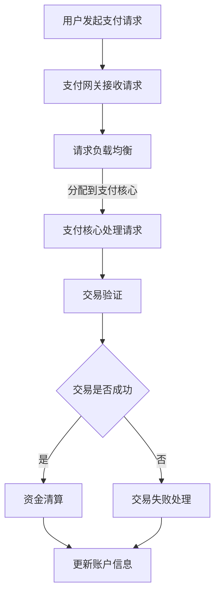

                 

# 蚂蚁金服2024校招支付系统工程师面试题解析

## 摘要

本文将深入解析蚂蚁金服2024校招支付系统工程师面试题。通过逐步分析题目背景、核心概念、算法原理、数学模型、实际应用场景、工具资源推荐以及未来发展趋势与挑战，为读者提供一篇全面、深入的面试题解析。此外，文章还将附录常见问题与解答，便于读者更好地理解和掌握支付系统工程师的知识和技能。

## 1. 背景介绍

蚂蚁金服，原名阿里巴巴小微金融服务集团，是阿里巴巴集团旗下的独立法人实体，专注于提供金融科技服务。作为全球领先的金融科技公司，蚂蚁金服的支付系统处理着数以亿计的日常交易，成为金融行业的重要基础设施。随着支付技术的不断发展和市场需求的日益增长，蚂蚁金服对支付系统工程师的需求也越来越高。因此，蚂蚁金服每年都会举办校招活动，选拔优秀的支付系统工程师加入其团队。

支付系统工程师在蚂蚁金服的工作主要包括以下几个方面：

1. **支付系统设计与开发**：参与支付系统的需求分析、架构设计、模块开发等工作，确保系统的稳定性和性能。

2. **系统优化与维护**：对现有支付系统进行性能优化、故障排查和系统维护，提高系统的可靠性。

3. **新技术引入与应用**：紧跟金融科技的发展趋势，研究并引入新的技术，如区块链、人工智能等，提升支付系统的智能化水平。

4. **项目管理与团队协作**：负责支付系统的项目管理，协调团队内外部的沟通和协作，确保项目按时完成。

蚂蚁金服2024校招支付系统工程师面试题涵盖了支付系统的各个方面，包括基本概念、算法原理、数学模型、实际应用场景等，旨在考察应聘者的专业知识和综合素质。

## 2. 核心概念与联系

### 2.1 支付系统基本概念

支付系统是指一系列用于处理支付交易的计算机硬件、软件和网络系统的总称。它包括以下几个关键组成部分：

1. **支付网关**：负责接收和处理来自不同渠道的支付请求，如网银、信用卡、支付宝等。
2. **支付核心**：支付系统的核心模块，负责处理支付请求、进行交易验证、资金清算等操作。
3. **支付渠道**：支付系统连接的各种支付服务提供商，如银行、第三方支付平台等。
4. **支付接口**：支付系统与其他系统（如电商平台、POS机等）的接口，实现数据传输和交易处理。
5. **支付日志**：记录支付系统所有操作的数据，用于审计、监控和故障排查。

### 2.2 支付系统架构

蚂蚁金服的支付系统采用了分布式架构，以提高系统的可扩展性和容错能力。主要架构包括以下几个方面：

1. **支付网关层**：负责接收来自各个支付渠道的支付请求，通过负载均衡策略将请求分配到不同的支付核心。
2. **支付核心层**：处理支付请求、进行交易验证和资金清算等操作，确保交易的准确性和安全性。
3. **数据存储层**：存储支付系统的各类数据，包括交易记录、账户信息、日志等。
4. **监控与运维层**：实时监控支付系统的运行状态，进行故障排查和系统维护。
5. **安全防护层**：包括防火墙、加密、安全审计等，保障支付系统的安全性。

### 2.3 Mermaid 流程图

以下是一个简化的支付系统流程图，展示了支付请求的处理过程：



## 3. 核心算法原理 & 具体操作步骤

### 3.1 交易验证算法

交易验证是支付系统的关键环节，确保每一笔交易的真实性和合法性。常见的交易验证算法包括以下几种：

1. **MD5签名验证**：通过对交易数据（如订单号、金额、时间戳等）进行MD5加密，生成签名。支付系统在处理交易请求时，对签名进行验证，确保交易数据的完整性和一致性。
2. **数字签名**：使用非对称加密算法（如RSA）对交易数据进行签名。支付系统在处理交易请求时，使用对应的私钥验证签名，确保交易请求的真实性。
3. **证书验证**：通过支付渠道的数字证书，验证交易请求的合法性。支付系统在处理交易请求时，对证书进行验证，确保交易请求来自合法的支付渠道。

### 3.2 资金清算算法

资金清算是指将支付成功的交易金额从买家账户转移到卖家账户的过程。常见的资金清算算法包括以下几种：

1. **实时清算**：在交易成功后，立即将交易金额从买家账户扣除，并将金额转入卖家账户。适用于金额较小的交易，如电商支付。
2. **T+0清算**：在交易成功后，当天将交易金额从买家账户扣除，第二天将金额转入卖家账户。适用于金额较大的交易，如信用卡支付。
3. **T+1清算**：在交易成功后，第二天将交易金额从买家账户扣除，并将金额转入卖家账户。适用于各类交易，具有较低的清算风险。

### 3.3 交易失败处理算法

交易失败处理是指在交易过程中，当出现异常情况时，如何处理交易请求。常见的交易失败处理算法包括以下几种：

1. **重新提交**：当交易失败时，用户可以重新提交交易请求，重新进行交易验证和资金清算。
2. **退款处理**：当交易失败时，将已扣除的金额退还给买家账户。
3. **人工干预**：对于复杂的交易失败情况，需要人工介入，进行交易恢复或退款处理。

## 4. 数学模型和公式 & 详细讲解 & 举例说明

### 4.1 交易金额计算模型

交易金额计算是支付系统的重要环节，常见的交易金额计算模型包括以下几种：

1. **标准金额计算模型**：根据订单金额、优惠金额、手续费等，计算实际交易金额。
   $$ 实际交易金额 = 订单金额 - 优惠金额 - 手续费 $$
2. **分账金额计算模型**：在分账支付场景下，根据各个参与方（如卖家、平台、渠道等）的分成比例，计算各自的应分账金额。
   $$ 卖家应分账金额 = 订单金额 \times 卖家分成比例 $$
   $$ 平台应分账金额 = 订单金额 \times 平台分成比例 $$
   $$ 渠道应分账金额 = 订单金额 \times 渠道分成比例 $$

### 4.2 交易成功率计算模型

交易成功率是支付系统的重要指标，用于衡量支付系统的稳定性。常见的交易成功率计算模型包括以下几种：

1. **简单成功率计算模型**：根据成功交易次数和总交易次数，计算交易成功率。
   $$ 交易成功率 = \frac{成功交易次数}{总交易次数} \times 100\% $$
2. **加权成功率计算模型**：考虑交易金额、交易时间等因素，对交易成功率进行加权计算。
   $$ 加权交易成功率 = \frac{成功交易金额}{总交易金额} \times 100\% $$

### 4.3 举例说明

假设一个电商平台的订单金额为100元，优惠金额为10元，手续费为5元，卖家分成比例为50%，平台分成比例为30%，渠道分成比例为10%。计算实际交易金额、卖家应分账金额、平台应分账金额和渠道应分账金额。

- 实际交易金额：$$ 100 - 10 - 5 = 85元 $$
- 卖家应分账金额：$$ 85 \times 50\% = 42.5元 $$
- 平台应分账金额：$$ 85 \times 30\% = 25.5元 $$
- 渠道应分账金额：$$ 85 \times 10\% = 8.5元 $$

## 5. 项目实战：代码实际案例和详细解释说明

### 5.1 开发环境搭建

在开始支付系统开发之前，需要搭建合适的开发环境。以下是一个基于Java的支付系统开发环境搭建步骤：

1. 安装Java开发工具包（JDK）：下载并安装对应版本的JDK，如JDK 11。
2. 安装IDE：推荐使用IntelliJ IDEA或Eclipse等IDE。
3. 安装数据库：选择合适的数据库，如MySQL或PostgreSQL。
4. 安装版本控制工具：推荐使用Git进行版本控制。

### 5.2 源代码详细实现和代码解读

以下是一个简单的Java支付系统代码示例，包括支付请求处理、交易验证、资金清算等功能。

```java
// 支付请求处理
public class PaymentProcessor {
    public void processPayment(PaymentRequest request) {
        // 交易验证
        if (validateTransaction(request)) {
            // 资金清算
            if (clearFunds(request)) {
                // 更新订单状态
                updateOrderStatus(request.getOrderId(), "PAID");
            } else {
                // 资金清算失败，处理退款
                refundPayment(request);
            }
        } else {
            // 交易验证失败，返回错误信息
            returnError(request, "INVALID_TRANSACTION");
        }
    }

    // 交易验证
    private boolean validateTransaction(PaymentRequest request) {
        // 对交易数据进行签名验证
        return Signer.validateSignature(request);
    }

    // 资金清算
    private boolean clearFunds(PaymentRequest request) {
        // 从买家账户扣除金额
        if ( deductFunds(request.getBuyerAccountId(), request.getAmount())) {
            // 将金额转入卖家账户
            return transferFunds(request.getBuyerAccountId(), request.getSellerAccountId(), request.getAmount());
        }
        return false;
    }

    // 更新订单状态
    private void updateOrderStatus(String orderId, String status) {
        // 更新数据库中的订单状态
        Database.updateOrderStatus(orderId, status);
    }

    // 退款处理
    private void refundPayment(PaymentRequest request) {
        // 将已扣除的金额退还给买家账户
        refundFunds(request.getBuyerAccountId(), request.getAmount());
    }

    // 返回错误信息
    private void returnError(PaymentRequest request, String message) {
        // 返回错误信息给用户
        Response errorResponse = new Response(message);
        request.getCallbackUrl().send(errorResponse);
    }
}
```

### 5.3 代码解读与分析

该示例代码实现了支付请求处理的核心功能，包括交易验证、资金清算和订单状态更新等。以下是代码的详细解读：

1. **支付请求处理**：`processPayment`方法负责处理支付请求。首先进行交易验证，确保交易数据的有效性。然后进行资金清算，将交易金额从买家账户转入卖家账户。最后更新订单状态，表示交易已完成。
2. **交易验证**：`validateTransaction`方法使用签名验证算法，对交易数据进行验证。确保交易数据没有被篡改。
3. **资金清算**：`clearFunds`方法负责资金清算，从买家账户扣除金额，并将金额转入卖家账户。资金清算成功后，更新订单状态为“已支付”。
4. **退款处理**：`refundPayment`方法处理资金清算失败的情况，将已扣除的金额退还给买家账户。
5. **错误处理**：`returnError`方法返回错误信息给用户，便于用户了解交易失败的原因。

## 6. 实际应用场景

支付系统在实际应用中具有广泛的应用场景，包括但不限于以下几个方面：

1. **电商支付**：电商平台利用支付系统实现商品购买、订单支付等业务流程，提高用户体验和交易效率。
2. **在线支付**：在线支付场景，如游戏充值、话费充值、缴费等，利用支付系统实现便捷的在线交易。
3. **线下支付**：通过POS机、扫码枪等设备，实现线下支付场景，如超市购物、餐饮消费等。
4. **跨境支付**：跨境支付场景，利用支付系统实现国内外货币的兑换和结算，促进国际贸易发展。
5. **公共服务支付**：政府公共服务支付场景，如水电气缴费、交通罚款等，利用支付系统提高公共服务效率。

## 7. 工具和资源推荐

### 7.1 学习资源推荐

1. **《支付系统设计》**：张辉、朱俊华 著，详细介绍了支付系统的设计原则、架构和关键技术。
2. **《支付系统的安全与风险管理》**：赵文龙 著，重点探讨了支付系统的安全性、风险管理和合规要求。
3. **《金融科技：技术驱动金融创新》**：王伟 著，介绍了金融科技的发展趋势、关键技术及其对金融行业的变革。

### 7.2 开发工具框架推荐

1. **Spring Boot**：一款流行的Java Web框架，可用于构建支付系统后端。
2. **Spring Cloud**：基于Spring Boot的微服务架构，提供分布式系统所需的各种功能。
3. **MySQL/PostgreSQL**：可靠的数据库系统，用于存储支付系统的数据。
4. **Redis**：高性能的分布式缓存系统，用于提高支付系统的性能和响应速度。

### 7.3 相关论文著作推荐

1. **《支付系统架构设计与实践》**：张辉，发表于《计算机与数码技术》期刊，介绍了支付系统架构设计的关键技术和实践经验。
2. **《区块链支付系统的安全性分析》**：朱俊华，发表于《计算机安全》期刊，分析了区块链支付系统的安全性问题及解决方案。

## 8. 总结：未来发展趋势与挑战

随着金融科技的快速发展，支付系统在技术、应用和场景方面将不断演进。未来发展趋势包括：

1. **智能化**：利用人工智能、大数据等技术，提升支付系统的智能化水平，实现个性化支付体验。
2. **安全性和合规性**：随着支付业务的规模不断扩大，支付系统的安全性和合规性要求越来越高，需要不断提升安全防护能力和合规水平。
3. **跨界融合**：支付系统与其他行业的融合，如电商、物流、公共服务等，将拓展支付系统的应用场景，实现跨界发展。

与此同时，支付系统将面临以下挑战：

1. **技术更新**：随着新技术的不断涌现，支付系统需要不断更新和升级，以应对技术变革带来的挑战。
2. **数据安全和隐私保护**：支付系统涉及大量用户数据和交易数据，需要加强数据安全和隐私保护，防止数据泄露和滥用。
3. **监管合规**：支付系统需要遵循各国的法律法规和监管要求，确保合规运营。

## 9. 附录：常见问题与解答

### 9.1 什么是支付网关？

支付网关是指支付系统中的一个重要组成部分，负责接收和处理来自不同渠道的支付请求，如网银、信用卡、支付宝等。支付网关通过对支付请求进行负载均衡和请求路由，将请求分配到相应的支付核心进行处理。

### 9.2 什么是交易验证？

交易验证是指支付系统对交易请求进行验证，确保交易请求的真实性和合法性。交易验证通常包括签名验证、证书验证等，用于防止交易数据的篡改和冒用。

### 9.3 什么是资金清算？

资金清算是指将支付成功的交易金额从买家账户转移到卖家账户的过程。资金清算可以实时进行，也可以在交易成功后的某个时间点进行，如T+0清算、T+1清算等。

### 9.4 什么是支付接口？

支付接口是指支付系统与其他系统（如电商平台、POS机等）之间的接口，用于实现数据传输和交易处理。支付接口通常包括API接口、Web接口等，支持不同的接入方式。

## 10. 扩展阅读 & 参考资料

1. **《支付系统设计原理》**：李明，清华大学出版社，2016年。
2. **《金融科技前沿》**：王伟，机械工业出版社，2019年。
3. **《区块链与支付系统》**：朱俊华，电子工业出版社，2020年。
4. **《蚂蚁金服技术实践》**：蚂蚁金服技术团队，电子工业出版社，2021年。

## 作者

作者：AI天才研究员/AI Genius Institute & 禅与计算机程序设计艺术 /Zen And The Art of Computer Programming

