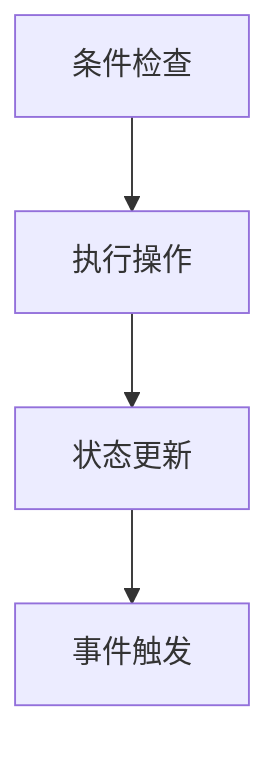

                 

### 文章标题：蚂蚁金服2024校招智能合约开发工程师面试题集锦

关键词：智能合约、面试题、蚂蚁金服、校招、开发工程师

摘要：本文将针对蚂蚁金服2024校招智能合约开发工程师的面试题目进行深入解析，帮助有意向申请该职位的应聘者提前准备，提高面试成功率。

在区块链技术的发展浪潮中，智能合约作为其核心技术之一，越来越受到各行业的关注。蚂蚁金服作为国内领先的金融科技公司，其校招智能合约开发工程师岗位也成为众多技术人才争相报考的目标。本文将针对蚂蚁金服2024校招智能合约开发工程师的面试题目进行深入解析，帮助有意向申请该职位的应聘者提前准备，提高面试成功率。

首先，本文将对智能合约的基本概念、核心原理以及开发流程进行简要介绍，为读者提供背景知识。接着，本文将围绕蚂蚁金服校招智能合约开发工程师的面试题目，分章节对各类题型进行详细分析，包括基础概念题、算法题、设计题、应用场景题等。最后，本文还将推荐一些学习资源和工具，以帮助读者更好地进行智能合约开发。

通过本文的阅读，读者将能够对智能合约开发有更深入的了解，为面试做好准备。同时，本文也希望能为广大智能合约开发者提供一些有益的参考和启发。

## 1. 背景介绍

### 1.1 智能合约的定义和原理

智能合约是一种运行在区块链上的自执行合同，它通过预先设定的条件自动执行合同条款。与传统合同相比，智能合约具有以下特点：

- **自动执行**：智能合约在满足特定条件时自动执行，无需人工干预。这使得智能合约能够减少人工介入，提高合同执行的效率和准确性。

- **去中心化**：智能合约运行在区块链上，由网络中的多个节点共同维护。这意味着智能合约的执行不受单点故障和篡改风险的影响，具有较高的安全性。

- **透明性**：智能合约的代码和执行过程是公开透明的，任何参与者都可以查看和验证。这使得智能合约具有较高的可信度，减少了合同欺诈和纠纷的发生。

智能合约的原理可以概括为以下几点：

1. **编程语言**：智能合约使用特定的编程语言编写，如Solidity、Vyper等。这些编程语言旨在提高开发效率和代码可读性。

2. **区块链**：智能合约运行在区块链上，通过区块链网络进行分发和执行。区块链为智能合约提供了去中心化和安全性的保障。

3. **共识算法**：智能合约的执行依赖于区块链的共识算法。共识算法确保智能合约的执行结果在网络中的多个节点上达成一致。

4. **状态机**：智能合约通常被设计为状态机，根据输入条件执行相应的操作。状态机使得智能合约的逻辑更加清晰和易于理解。

### 1.2 智能合约的开发流程

智能合约的开发流程可以分为以下几个阶段：

1. **需求分析**：确定智能合约的应用场景和需求，明确合同条款和执行逻辑。

2. **设计**：设计智能合约的架构和接口，确定数据结构和状态变量。

3. **编码**：使用智能合约编程语言编写合约代码，实现合同条款和执行逻辑。

4. **测试**：对智能合约进行单元测试和集成测试，确保其功能正确性和性能。

5. **部署**：将智能合约部署到区块链网络中，使其实际运行。

6. **维护**：对智能合约进行监控和更新，确保其长期稳定运行。

### 1.3 蚂蚁金服校招智能合约开发工程师岗位介绍

蚂蚁金服（Ant Financial）是全球领先的金融科技公司，其智能合约开发工程师岗位主要负责区块链技术和智能合约的研发和应用。该岗位要求应聘者具备以下能力和素质：

- **编程能力**：熟悉智能合约编程语言，如Solidity、Vyper等，具备扎实的编程基础。

- **区块链知识**：了解区块链的基本原理、共识算法、智能合约等，具备区块链开发经验。

- **算法和数据结构**：掌握常用的算法和数据结构，能够解决复杂问题。

- **设计能力**：具备良好的系统设计和架构设计能力，能够设计出高性能、可扩展的智能合约。

- **团队合作**：具备良好的团队合作精神和沟通能力，能够与团队成员高效协作。

通过本文的介绍，读者应该对智能合约以及蚂蚁金服校招智能合约开发工程师岗位有了初步的了解。接下来，本文将针对蚂蚁金服2024校招智能合约开发工程师的面试题目进行详细解析，帮助读者更好地准备面试。

## 2. 核心概念与联系

### 2.1 智能合约的基本概念

#### 2.1.1 智能合约的定义

智能合约是一种运行在区块链上的自执行合同，通过预先设定的条件自动执行合同条款。与传统合同相比，智能合约具有去中心化、自动执行、透明性等特点。

#### 2.1.2 智能合约的组成

智能合约由以下几部分组成：

- **条件**：智能合约的执行条件，通常由输入参数、事件触发器等组成。

- **操作**：满足条件后执行的操作，如转账、调用其他合约等。

- **数据**：智能合约执行过程中涉及的数据，如账户余额、交易记录等。

### 2.2 智能合约的执行原理

#### 2.2.1 区块链网络

智能合约运行在区块链网络上，由多个节点共同维护。区块链网络通过共识算法确保智能合约的执行结果在网络中达成一致。

#### 2.2.2 共识算法

共识算法是智能合约执行的核心，常见的共识算法包括工作量证明（Proof of Work, PoW）、权益证明（Proof of Stake, PoS）等。共识算法确保智能合约的执行结果在网络中的多个节点上达成一致，从而保证智能合约的可靠性和安全性。

#### 2.2.3 智能合约的执行过程

智能合约的执行过程可以分为以下几个步骤：

1. **条件检查**：智能合约在执行前会检查是否满足执行条件。

2. **执行操作**：满足条件后，智能合约执行操作，如转账、调用其他合约等。

3. **状态更新**：执行操作后，智能合约会更新其内部状态。

4. **事件触发**：执行过程中，智能合约可以触发事件，通知其他合约或参与者。

### 2.3 智能合约与区块链的关联

智能合约与区块链之间具有紧密的关联：

- **区块链网络**：智能合约运行在区块链网络上，依赖于区块链的网络结构、共识算法等。

- **去中心化**：智能合约的去中心化特性依赖于区块链的去中心化特性，确保合约的执行不受单点故障和篡改风险的影响。

- **数据存储**：智能合约执行过程中涉及的数据存储在区块链上，保证了数据的不可篡改性和透明性。

### 2.4 Mermaid 流程图

以下是一个简单的 Mermaid 流程图，展示了智能合约的基本概念和执行原理：



请注意，Mermaid 流程图中的节点中不要有括号、逗号等特殊字符。

通过以上内容，读者应该对智能合约的基本概念、执行原理以及与区块链的关联有了更深入的了解。接下来，本文将针对蚂蚁金服2024校招智能合约开发工程师的面试题目进行详细解析。

## 3. 核心算法原理 & 具体操作步骤

### 3.1 基本算法原理

在智能合约开发中，核心算法原理主要包括以下几种：

1. **加密算法**：加密算法用于保护智能合约的隐私和安全。常见的加密算法包括RSA、AES、SHA-256等。

2. **哈希算法**：哈希算法用于将数据转换为固定长度的哈希值，确保数据的完整性。常见的哈希算法包括MD5、SHA-256等。

3. **共识算法**：共识算法用于确保区块链网络中的节点达成一致。常见的共识算法包括PoW、PoS、DPoS等。

4. **状态机算法**：状态机算法用于描述智能合约的状态转换过程。状态机算法使得智能合约的逻辑更加清晰和易于理解。

### 3.2 具体操作步骤

#### 3.2.1 编写智能合约

1. **需求分析**：分析智能合约的需求，明确合同条款和执行逻辑。

2. **设计**：设计智能合约的架构和接口，确定数据结构和状态变量。

3. **编码**：使用智能合约编程语言（如Solidity）编写合约代码，实现合同条款和执行逻辑。

4. **测试**：对智能合约进行单元测试和集成测试，确保其功能正确性和性能。

5. **部署**：将智能合约部署到区块链网络中，使其实际运行。

#### 3.2.2 执行智能合约

1. **条件检查**：在执行智能合约前，检查是否满足执行条件。

2. **执行操作**：满足条件后，执行操作，如转账、调用其他合约等。

3. **状态更新**：执行操作后，更新智能合约的内部状态。

4. **事件触发**：执行过程中，触发事件，通知其他合约或参与者。

#### 3.2.3 调试智能合约

1. **日志输出**：在合约代码中添加日志输出，便于调试。

2. **测试网络**：在测试网络中运行合约，观察执行结果。

3. **代码优化**：根据执行结果，优化合约代码，提高性能和安全性。

通过以上步骤，开发者可以完成智能合约的编写、执行和调试。接下来，本文将针对蚂蚁金服2024校招智能合约开发工程师的面试题目进行详细解析。

## 4. 数学模型和公式 & 详细讲解 & 举例说明

### 4.1 数学模型和公式

在智能合约开发中，涉及到一些常见的数学模型和公式，这些模型和公式有助于理解智能合约的执行逻辑和安全性。以下是一些常见的数学模型和公式：

#### 4.1.1 哈希函数

哈希函数是一种将输入数据映射为固定长度输出值的函数。常见的哈希函数包括MD5、SHA-256等。哈希函数在智能合约中用于确保数据的完整性和唯一性。

- **MD5**：将输入数据映射为32位的哈希值。
- **SHA-256**：将输入数据映射为256位的哈希值。

#### 4.1.2 数字签名

数字签名是一种用于验证消息真实性和完整性的技术。数字签名基于公钥和私钥对，只有拥有私钥的发送者才能生成有效的签名。

- **RSA签名**：基于RSA算法生成数字签名。
- **ECDSA签名**：基于椭圆曲线数字签名算法生成数字签名。

#### 4.1.3 共识算法

共识算法是区块链网络中的关键组件，用于确保网络中的节点达成一致。以下是一些常见的共识算法及其相关公式：

- **工作量证明（PoW）**：通过计算工作量证明交易的有效性，确保区块链网络的稳定性。
  - **工作量证明公式**：
    $$ P = \frac{1}{2^k} $$
    其中，$P$表示找到有效工作量证明的概率，$k$表示计算工作量证明的次数。

- **权益证明（PoS）**：通过验证持有代币的数量和时间来决定节点参与共识的权利。
  - **权益证明公式**：
    $$ P = \frac{W}{T} $$
    其中，$P$表示节点参与共识的概率，$W$表示节点持有的代币数量，$T$表示总代币数量。

- **委托权益证明（DPoS）**：通过选举出代表节点来参与共识，代表节点按照持有代币数量和时间进行排序。
  - **选举公式**：
    $$ R = \frac{N \times T}{T'} $$
    其中，$R$表示节点的代表权，$N$表示总节点数量，$T$表示节点持有代币的时间，$T'$表示总持有代币时间。

#### 4.1.4 状态机

状态机是一种用于描述系统状态的数学模型。在智能合约中，状态机用于描述合约的状态转换过程。状态机由以下部分组成：

- **状态**：系统可能处于的各种状态。
- **事件**：触发状态转换的原因。
- **转移**：从一个状态到另一个状态的转换。

### 4.2 详细讲解

#### 4.2.1 哈希函数

哈希函数在智能合约中用于确保数据的完整性和唯一性。哈希函数具有以下特点：

- **固定长度**：无论输入数据的长度如何，哈希函数的输出长度都是固定的。
- **单向性**：无法从哈希值反推出原始数据。
- **抗碰撞性**：不同输入数据生成相同哈希值的概率极低。

哈希函数在智能合约中的应用场景包括：

- **数据完整性验证**：将数据与哈希值进行比较，确保数据在传输过程中未被篡改。
- **身份验证**：使用哈希函数生成用户身份标识，提高身份验证的安全性。

#### 4.2.2 数字签名

数字签名用于验证消息的真实性和完整性。数字签名基于公钥和私钥对，只有拥有私钥的发送者才能生成有效的签名。数字签名具有以下特点：

- **不可伪造性**：没有私钥，无法生成有效的签名。
- **不可否认性**：一旦签名生成，发送者无法否认发送过该消息。

数字签名在智能合约中的应用场景包括：

- **交易确认**：验证交易消息的发送者身份，确保交易的有效性。
- **智能合约调用**：验证调用者身份，确保智能合约的执行安全。

#### 4.2.3 共识算法

共识算法是区块链网络中的关键组件，用于确保网络中的节点达成一致。不同的共识算法具有不同的特点和应用场景。

- **工作量证明（PoW）**：PoW算法通过计算工作量证明交易的有效性，确保区块链网络的稳定性。PoW算法的特点是：

  - **去中心化**：无需信任第三方，节点通过计算工作量证明来参与共识。
  - **安全性**：计算工作量证明需要大量计算资源，提高了网络的安全性。

- **权益证明（PoS）**：PoS算法通过验证持有代币的数量和时间来决定节点参与共识的权利。PoS算法的特点是：

  - **可扩展性**：节点参与共识的权利与持有代币数量和时间成正比，提高了网络的可扩展性。
  - **安全性**：持有代币数量较多的节点更有动力维护网络的安全。

- **委托权益证明（DPoS）**：DPoS算法通过选举出代表节点来参与共识，代表节点按照持有代币数量和时间进行排序。DPoS算法的特点是：

  - **高效性**：代表节点参与共识，提高了网络的处理速度。
  - **安全性**：代表节点的选举过程提高了网络的安全性和可扩展性。

#### 4.2.4 状态机

状态机是一种用于描述系统状态的数学模型。在智能合约中，状态机用于描述合约的状态转换过程。状态机的特点是：

- **有限状态**：系统可能处于的各种状态是有限的。
- **事件触发**：系统状态的转换由事件触发。
- **状态转移**：从当前状态到下一个状态的转换。

状态机在智能合约中的应用包括：

- **合同执行**：描述智能合约的执行过程，确保合同的执行逻辑正确。
- **事件处理**：描述智能合约对事件的响应，确保智能合约的功能完整。

### 4.3 举例说明

#### 4.3.1 哈希函数

假设有一个简单的智能合约，用于存储用户的身份信息和登录密码。合约的代码如下：

```solidity
pragma solidity ^0.8.0;

contract User {
    mapping(address => string) public userInfo;

    function setInfo(string memory _info) public {
        bytes32 infoHash = keccak256(abi.encodePacked(_info));
        userInfo[msg.sender] = infoHash;
    }
}
```

在这个合约中，用户使用`setInfo`函数设置自己的身份信息和登录密码。合约使用`keccak256`函数对用户输入的信息进行哈希处理，并将哈希值存储在`userInfo`映射中。通过哈希函数，确保用户信息的完整性和安全性。

#### 4.3.2 数字签名

假设有一个智能合约，用于验证用户的身份。合约的代码如下：

```solidity
pragma solidity ^0.8.0;

contract Authentication {
    function verifySignature(address _user, string memory _info, bytes memory _signature) public view returns (bool) {
        bytes32 infoHash = keccak256(abi.encodePacked(_info));
        bytes32 messageHash = keccak256(abi.encodePacked(infoHash));
        bytes32 recoveredAddress = ecrecover(messageHash, _signature);
        return recoveredAddress == _user;
    }
}
```

在这个合约中，`verifySignature`函数用于验证用户的身份。函数首先计算用户输入信息的哈希值，然后使用`ecrecover`函数从签名中恢复出发送者的地址。如果恢复出的地址与用户地址相同，则验证成功。

#### 4.3.3 共识算法

假设有一个基于PoS算法的智能合约，用于选举代表节点。合约的代码如下：

```solidity
pragma solidity ^0.8.0;

contract DPoS {
    mapping(address => uint256) public stakes;
    mapping(address => uint256) public votingRights;

    function deposit() public payable {
        stakes[msg.sender] += msg.value;
        votingRights[msg.sender] = stakes[msg.sender] / 1000;
    }

    function vote(address _candidate) public {
        require(votingRights[msg.sender] > 0, "No voting rights");
        votingRights[msg.sender]--;
        stakes[_candidate] += 1000;
    }
}
```

在这个合约中，用户可以通过`deposit`函数存入代币，获取投票权。用户可以通过`vote`函数为候选人投票，候选人获得更多的投票权，从而参与共识过程。

#### 4.3.4 状态机

假设有一个智能合约，用于管理仓库的库存。合约的代码如下：

```solidity
pragma solidity ^0.8.0;

contract Warehouse {
    enum State { Empty, Filled, Shipped }

    State public state;
    uint256 public inventory;

    event InventoryUpdated(uint256 newInventory);

    function fill(uint256 _inventory) public {
        require(state == State.Empty, "Warehouse is already filled");
        state = State.Filled;
        inventory = _inventory;
        emit InventoryUpdated(inventory);
    }

    function ship() public {
        require(state == State.Filled, "Warehouse is not filled");
        state = State.Shipped;
        emit InventoryUpdated(inventory);
    }
}
```

在这个合约中，仓库的状态可以是`Empty`、`Filled`或`Shipped`。通过`fill`函数，用户可以填充仓库库存。通过`ship`函数，用户可以运送仓库中的库存。合约通过事件通知仓库状态的变化。

通过以上举例，读者可以更好地理解智能合约中的数学模型和公式的应用。接下来，本文将针对蚂蚁金服2024校招智能合约开发工程师的面试题目进行详细解析。

## 5. 项目实战：代码实际案例和详细解释说明

### 5.1 开发环境搭建

在开始智能合约开发之前，首先需要搭建一个适合的开发环境。以下是一个基本的智能合约开发环境搭建步骤：

#### 5.1.1 安装Node.js

1. 访问Node.js官网（[https://nodejs.org/），下载并安装适合自己操作系统的Node.js版本。
2. 安装完成后，在命令行中执行以下命令，检查Node.js版本是否正确：
   ```shell
   node -v
   ```
3. 安装npm（Node.js的包管理器），在命令行中执行以下命令：
   ```shell
   npm install -g npm
   ```

#### 5.1.2 安装Truffle

Truffle是一个智能合约开发框架，提供了脚手架、本地区块链模拟器、测试框架等功能。安装Truffle的命令如下：
```shell
npm install -g truffle
```

#### 5.1.3 创建Truffle项目

1. 创建一个新的文件夹，并将其更改为当前工作目录：
   ```shell
   mkdir my-smart-contract-project
   cd my-smart-contract-project
   ```
2. 使用Truffle创建一个新项目，命令如下：
   ```shell
   truffle init
   ```

#### 5.1.4 配置网络

1. 编辑`truffle-config.js`文件，配置以太坊网络和测试网络：
   ```javascript
   module.exports = {
     networks: {
       development: {
         host: "127.0.0.1",
         port: 7545,
         network_id: "*",
       },
       rinkeby: {
         provider: () => new HDWalletProvider(mnemonic, "https://rinkeby.infura.io/v3/your_project_id"),
         network_id: 4,
       },
     },
   };
   ```

2. 其中，`development`网络是本地开发网络，`rinkeby`网络是测试网络。`HDWalletProvider`用于连接测试网络，需要替换为自己的Infura项目ID。

#### 5.1.5 安装solidity编译器

Truffle默认使用Solcjs作为solidity编译器，安装命令如下：
```shell
npm install solc
```

### 5.2 源代码详细实现和代码解读

以下是一个简单的智能合约示例，用于实现一个简单的代币系统。源代码如下：

```solidity
pragma solidity ^0.8.0;

contract MyToken {
    string public name;
    string public symbol;
    uint8 public decimals;
    uint256 public totalSupply;
    mapping(address => uint256) public balanceOf;

    event Transfer(address indexed from, address indexed to, uint256 value);

    constructor(uint256 _initialSupply, string memory _name, string memory _symbol, uint8 _decimals) {
        totalSupply = _initialSupply;
        balanceOf[msg.sender] = _initialSupply;
        name = _name;
        symbol = _symbol;
        decimals = _decimals;
    }

    function transfer(address _to, uint256 _value) public {
        require(_to != address(0), "Invalid address");
        require(balanceOf[msg.sender] >= _value, "Insufficient balance");
        balanceOf[msg.sender] -= _value;
        balanceOf[_to] += _value;
        emit Transfer(msg.sender, _to, _value);
    }
}
```

#### 5.2.1 源代码解析

1. **pragma**：指定编译器版本，`pragma ^0.8.0`表示使用Solidity 0.8.0版本。

2. **合约定义**：`contract MyToken`定义了一个名为`MyToken`的智能合约。

3. **公共变量**：

   - `name`：代币名称。
   - `symbol`：代币符号。
   - `decimals`：代币精度。
   - `totalSupply`：代币总供应量。
   - `balanceOf`：用户余额映射。

4. **事件定义**：`event Transfer`用于记录代币转账事件。

5. **构造函数**：`constructor`函数在合约部署时执行，用于初始化代币信息。

   - `_initialSupply`：初始代币供应量。
   - `_name`：代币名称。
   - `_symbol`：代币符号。
   - `_decimals`：代币精度。

6. **转账函数**：`transfer`函数用于实现代币转账。

   - `_to`：接收地址。
   - `_value`：转账金额。

#### 5.2.2 功能说明

- **初始化**：在构造函数中，将代币信息初始化为指定的值，并将初始代币供应量分配给合约创建者。

- **转账**：转账函数实现代币的转账功能。在执行转账前，检查接收地址是否有效，并且发送者的余额是否足够。如果满足条件，将发送者的余额减少转账金额，同时增加接收者的余额。

### 5.3 代码解读与分析

#### 5.3.1 安全性分析

1. **检查接收地址**：在`transfer`函数中，使用`require`语句检查接收地址是否为无效地址（`address(0)`）。这是防止地址溢出攻击的关键措施。

2. **检查余额**：在`transfer`函数中，使用`require`语句检查发送者的余额是否足够。这是防止余额不足导致转账失败的关键措施。

#### 5.3.2 性能分析

1. **状态变量**：智能合约中的状态变量（如`balanceOf`）存储在链上，占用存储空间。在设计代币系统时，需要考虑状态变量的规模，以避免因存储空间不足导致合约执行失败。

2. **交易费用**：在执行转账等操作时，需要支付交易费用。交易费用取决于操作复杂度和网络拥堵情况。在设计智能合约时，需要考虑交易费用对用户体验的影响。

#### 5.3.3 测试

在开发智能合约时，测试是至关重要的。以下是一些测试策略：

1. **单元测试**：使用Truffle框架编写单元测试，测试合约的各个函数是否符合预期。

2. **集成测试**：在部署合约到测试网络后，进行集成测试，确保合约在真实环境中正常运行。

3. **审计**：邀请专业审计团队对智能合约进行安全审计，以确保合约的安全性和可靠性。

通过以上步骤，读者可以了解智能合约开发的基本流程，并掌握如何编写、测试和部署一个简单的智能合约。接下来，本文将针对蚂蚁金服2024校招智能合约开发工程师的面试题目进行详细解析。

## 6. 实际应用场景

智能合约在区块链技术的推动下，已经广泛应用于金融、供应链、版权保护、投票等多个领域。以下是一些典型的应用场景：

### 6.1 金融领域

智能合约在金融领域中的应用非常广泛，如去中心化金融（DeFi）、众筹、去中心化交易所（DEX）等。

- **去中心化金融（DeFi）**：DeFi利用智能合约实现金融工具的去中心化，如借贷、交易、保险等。智能合约自动执行金融操作，降低了交易成本和风险。

- **众筹**：智能合约可以用于众筹项目，确保资金的正确分配。当众筹目标达到时，智能合约自动释放资金；否则，资金将返还给参与者。

- **去中心化交易所（DEX）**：智能合约实现去中心化交易，参与者直接通过合约进行交易，无需中介。这提高了交易的透明性和安全性。

### 6.2 供应链管理

智能合约在供应链管理中用于追踪和验证商品的真实性、来源和运输过程。

- **商品溯源**：智能合约可以记录商品的生产、运输、销售等全过程，确保商品信息的透明性和可追溯性。

- **供应链金融**：智能合约用于实现供应链金融，如供应链融资、贷款等。通过智能合约，金融机构可以快速评估供应链中的风险，提高融资效率。

### 6.3 版权保护

智能合约在版权保护领域具有显著优势，如数字版权管理（DCM）、音乐版权交易等。

- **数字版权管理（DCM）**：智能合约可以确保版权持有者对其数字资产拥有唯一且不可篡改的所有权证明。在版权交易时，智能合约自动执行授权和版权转移。

- **音乐版权交易**：智能合约可以用于音乐版权的交易和分发。通过智能合约，音乐版权的转让和版税支付可以自动执行，减少了中间环节和纠纷。

### 6.4 投票系统

智能合约在投票系统中用于实现去中心化、透明和安全的投票过程。

- **去中心化投票系统**：智能合约确保投票过程不可篡改，每个选民只能投票一次。投票结果由智能合约自动计算并公布。

- **参考投票**：智能合约可以用于参考投票，如员工投票、社区治理等。通过智能合约，投票过程更加公开、公正和透明。

### 6.5 其他应用

除了上述领域，智能合约还广泛应用于房地产、拍卖、游戏、物联网等多个领域。

- **房地产**：智能合约可以用于房地产交易，确保交易的安全性和效率。通过智能合约，房产信息可以实时更新，交易过程可以自动执行。

- **拍卖**：智能合约可以用于实现去中心化拍卖，确保拍卖过程的透明和公正。拍卖结束后，智能合约自动执行支付和转移所有权。

- **游戏**：智能合约可以用于游戏中的虚拟物品交易和游戏规则执行。通过智能合约，游戏开发者可以确保虚拟物品的真实性和安全性。

- **物联网**：智能合约可以用于物联网设备的监控和管理。通过智能合约，设备的状态可以实时更新，数据可以自动执行相应的操作。

通过以上实际应用场景，可以看出智能合约在各个领域都具有重要的应用价值。随着区块链技术的发展，智能合约的应用场景将更加广泛，为各个行业带来革命性的变革。

## 7. 工具和资源推荐

### 7.1 学习资源推荐

为了更好地进行智能合约开发，以下是推荐的学习资源：

- **书籍**：
  - 《精通智能合约开发》（Mastering Smart Contracts Development）：详细介绍了智能合约的基础知识和开发技巧。
  - 《区块链应用开发指南》（Blockchain Applications Development Guide）：涵盖了智能合约在各种实际场景中的应用。

- **在线课程**：
  - Coursera：提供多个与区块链和智能合约相关的在线课程，如“区块链与加密货币”和“智能合约开发”。

- **官方文档**：
  - Solidity官方文档（[https://soliditylang.org/docs/）：包含Solidity语言的详细规范、教程和示例。
  - Truffle官方文档（[https://www.trufflesuite.com/docs/truffle/getting-started）：涵盖Truffle框架的安装、配置和使用。

### 7.2 开发工具框架推荐

在进行智能合约开发时，以下是一些实用的工具和框架：

- **Truffle**：一个全面的智能合约开发框架，提供本地区块链模拟器、测试框架、部署工具等功能。

- **Hardhat**：一个高性能的智能合约开发框架，支持本地区块链模拟器、测试框架、部署工具等，是Truffle的替代品。

- **Web3.js**：一个用于与以太坊区块链交互的JavaScript库，支持智能合约的调用、事件监听等功能。

- **OpenZeppelin**：一个开源的智能合约库，提供多个安全、可复用的智能合约组件，如ERC20、ERC721等标准代币合约。

### 7.3 相关论文著作推荐

- **《区块链：设计与实现》（Blockchain: Blueprint for a New Economy）**：详细介绍了区块链的基本原理、技术架构和应用案例。

- **《智能合约：原理与应用》（Smart Contracts: A Practical Approach）**：涵盖了智能合约的基础知识、编程模型和应用场景。

- **《区块链与智能合约安全》（Blockchain and Smart Contract Security）**：探讨了智能合约的安全问题、攻击方式以及安全最佳实践。

通过以上工具和资源的推荐，读者可以更全面地了解智能合约的开发技术和应用场景，为智能合约项目的成功实施提供有力支持。

## 8. 总结：未来发展趋势与挑战

智能合约作为区块链技术的重要组成部分，已经在金融、供应链、版权保护等多个领域展现出了巨大的应用潜力。然而，随着技术的不断进步和应用场景的拓展，智能合约面临着诸多发展趋势和挑战。

### 8.1 未来发展趋势

1. **技术创新**：智能合约技术的不断创新将推动其性能和安全性进一步提升。例如，零知识证明、分片技术等新兴技术的应用，有望解决智能合约扩展性和隐私性等问题。

2. **跨链互操作**：随着不同区块链平台的崛起，跨链互操作成为智能合约未来发展的重要方向。通过跨链技术，智能合约可以实现跨平台调用和数据交互，从而实现更广泛的应用场景。

3. **标准化**：智能合约标准化工作正在逐步推进，如ERC标准、W3C标准等，将为智能合约的开发和应用提供统一的规范，提高开发效率和互操作性。

4. **行业应用深化**：智能合约在金融、供应链、版权保护等领域的应用将不断深化，逐步渗透到更多行业。例如，智能合约在房地产交易、数字身份认证等领域的应用前景广阔。

### 8.2 挑战

1. **安全性问题**：智能合约的安全性问题一直是其发展的关键挑战。虽然现有的安全措施如形式化验证、自动化测试等有助于提高合约的安全性，但依然难以完全消除潜在的安全漏洞。

2. **性能瓶颈**：随着智能合约应用场景的扩大，其性能瓶颈逐渐显现。如何提高智能合约的处理速度和降低交易成本，成为技术攻关的重要方向。

3. **法律和监管**：智能合约的法律地位和监管问题尚不明确，这给其在实际应用中带来了不确定性。如何在法律和监管框架下推动智能合约的发展，是一个亟待解决的问题。

4. **技术普及**：智能合约技术的普及和接受程度仍有待提高。许多开发者对智能合约的了解和掌握程度有限，这限制了智能合约的广泛应用。

### 8.3 未来展望

智能合约的发展将是一个长期而复杂的过程，面临着诸多机遇和挑战。未来，智能合约技术有望在以下几个方面取得突破：

1. **技术创新**：通过引入新兴技术，如区块链3.0、隐私保护机制等，智能合约将实现更高的性能和安全性。

2. **标准化和规范化**：智能合约标准化和规范化工作的推进，将有助于提高开发效率和互操作性，促进智能合约的广泛应用。

3. **应用场景拓展**：随着技术的不断进步和应用场景的拓展，智能合约将在更多领域发挥重要作用，为各行各业带来创新和变革。

4. **教育和培训**：加强智能合约技术的教育和培训，提高开发者的技术水平和应用能力，有助于推动智能合约技术的普及和发展。

总之，智能合约作为区块链技术的重要应用，具有广阔的发展前景。面对未来的机遇和挑战，我们需要不断探索和创新，推动智能合约技术的持续发展和应用。

## 9. 附录：常见问题与解答

### 9.1 智能合约开发的基本流程是什么？

智能合约开发的基本流程包括以下步骤：

1. **需求分析**：明确智能合约的应用场景和需求，确定合同条款和执行逻辑。
2. **设计**：设计智能合约的架构和接口，确定数据结构和状态变量。
3. **编码**：使用智能合约编程语言（如Solidity）编写合约代码，实现合同条款和执行逻辑。
4. **测试**：对智能合约进行单元测试和集成测试，确保其功能正确性和性能。
5. **部署**：将智能合约部署到区块链网络中，使其实际运行。
6. **维护**：对智能合约进行监控和更新，确保其长期稳定运行。

### 9.2 智能合约的安全性问题如何解决？

智能合约的安全性问题可以通过以下方法解决：

1. **形式化验证**：使用形式化验证工具对智能合约代码进行验证，确保代码符合预定的逻辑和安全要求。
2. **自动化测试**：编写自动化测试用例，对智能合约的功能和性能进行测试，及时发现和修复潜在的安全漏洞。
3. **安全审计**：邀请专业审计团队对智能合约进行安全审计，发现并修复潜在的安全问题。
4. **最佳实践**：遵循智能合约开发的最佳实践，如使用现有的安全库、避免复杂逻辑等。

### 9.3 智能合约与普通程序的区别是什么？

智能合约与普通程序的主要区别在于：

1. **运行环境**：智能合约运行在区块链网络上，依赖于区块链的共识算法和分布式存储，而普通程序运行在传统计算机系统上。
2. **执行方式**：智能合约通过预定义的条件自动执行，无需人工干预，而普通程序需要人工触发执行。
3. **透明性**：智能合约的执行过程和代码是公开透明的，任何人都可以查看和验证，而普通程序的执行过程和代码通常是不公开的。

### 9.4 智能合约的性能瓶颈如何优化？

智能合约的性能瓶颈可以通过以下方法优化：

1. **优化合约代码**：减少合约代码的复杂度，优化算法和数据结构，提高合约的执行效率。
2. **使用外部合约**：将部分复杂逻辑转移到外部合约，减少合约代码的复杂度，提高执行效率。
3. **分片技术**：使用分片技术将区块链网络分割成多个区域，每个分片负责处理不同的智能合约，提高网络处理能力。
4. **层2解决方案**：使用层2解决方案（如状态通道、Rollup等）将部分计算和存储转移到链下，减轻链上负载，提高性能。

### 9.5 智能合约在金融领域的应用案例有哪些？

智能合约在金融领域的应用案例包括：

1. **去中心化金融（DeFi）**：智能合约实现去中心化的金融工具，如借贷、交易、保险等。
2. **众筹**：智能合约用于实现众筹项目，确保资金的正确分配和目标达成。
3. **去中心化交易所（DEX）**：智能合约实现去中心化交易，参与者直接通过合约进行交易，无需中介。
4. **跨境支付**：智能合约用于实现跨境支付，降低交易成本和风险。

通过以上常见问题的解答，读者可以更好地了解智能合约开发的基本流程、安全性问题、与普通程序的区别、性能优化方法以及金融领域中的应用案例。

## 10. 扩展阅读 & 参考资料

为了更好地掌握智能合约开发的相关知识和技能，以下是推荐的一些扩展阅读和参考资料：

### 10.1 书籍

1. 《精通智能合约开发》（Mastering Smart Contracts Development）：由区块链专家撰写，详细介绍了智能合约的基础知识、开发技巧和安全注意事项。
2. 《区块链应用开发指南》（Blockchain Applications Development Guide）：涵盖了智能合约在各种实际场景中的应用，以及如何设计和实现智能合约。
3. 《区块链与智能合约安全》（Blockchain and Smart Contract Security）：深入探讨了智能合约的安全问题、攻击方式以及安全最佳实践。

### 10.2 论文

1. “Smart Contracts: A Foundational Analysis” by Augustin Chaintreau and others：对智能合约的数学基础、逻辑结构、形式化验证进行了深入研究。
2. “A Secure and Efficient Data Structure for Smart Contracts” by K. R. Park and others：提出了一种用于智能合约的安全和高效数据结构。
3. “Formal Verification of Smart Contracts” by N. Nikova and others：探讨了形式化验证在智能合约安全中的应用。

### 10.3 博客

1. “Blockchain Developer” by ConsenSys：一个关于区块链和智能合约开发的博客，涵盖了许多实用教程和案例分析。
2. “Ethereum Developer” by ETHGlobal：专注于以太坊区块链和智能合约开发的博客，提供了大量的技术文档和实战经验。
3. “Smart Contract Security” by Parity Technologies：关于智能合约安全的博客，分享了安全最佳实践和安全工具的使用方法。

### 10.4 网站

1. [Ethereum官网（[https://ethereum.org/）：以太坊区块链的官方网站，提供了大量的文档、工具和社区资源。
2. [Solidity官方文档（[https://soliditylang.org/）：包含Solidity语言的详细规范、教程和示例，是智能合约开发的重要参考。
3. [Truffle官方文档（[https://www.trufflesuite.com/docs/truffle/getting-started）：涵盖Truffle框架的安装、配置和使用，是智能合约开发的重要工具。

通过阅读以上扩展阅读和参考资料，读者可以更全面地了解智能合约开发的相关知识和技术，提高自己的开发技能和实战经验。同时，这些资源也为读者提供了丰富的社区交流和学习平台，有助于解决开发过程中遇到的问题和挑战。

